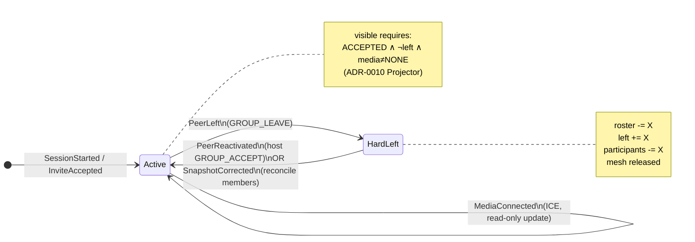

# Conference Membership Transition Reducer

Conference membership 在 Host 与 Follower 上呈 **shard write 不对称**：`GROUP_LEAVE` 触发完整 prune（roster 删 + tombstone + mesh release），而 silent rejoin 仅在 Host 的 `GROUP_ACCEPT` 路径恢复 membership；Follower 收到 `CONFERENCE_MESH_RECONCILE` 时只跑 mesh repair，不校准 roster/left。现场表现：Host `visible=3`，留守 Follower `visible=2`（2026-07 rejoin 人数 regression）。

**决定原因**：Conference membership 必须是 **closed transition system**（单一写 seam），不能继续在 Coordinator 各 handler 分散 patch。Mesh / media 是 membership 转移的派生失效，不是第二套 source of truth。

## 与既有 ADR 关系

- **ADR-0010**：`ConferenceParticipantProjector` 保持被动正确；本 ADR 保证 upstream facts 在同一 transition 内一致收敛。
- **ADR-0011**：reconcile 信号不得进入 invite pipeline；本 ADR 定义 reconcile 作为 **membership snapshot correction** 的语义（非 invite）。

## 核心不变量

- **R-M1（唯一写 seam）**：Conference roster、`leftMemberEndpoints`、participant invite/media 基线的 **mutation MUST** 经 `ConferenceMembershipReducer.apply(...)`。Coordinator handler 只解析信令并 dispatch event，不直接 `applyPrune` / `onLateJoin`。
- **R-M2（Rejoin 幂等）**：`PeerReactivated` / `SnapshotCorrected` **MUST**：清除该 module 的全部 left tombstone；若不在 roster 则 restore；participant 设为 `ACCEPTED` + `CONNECTING`（或 `NONE` 若尚未 mesh）；**可安全重放**。
- **R-M3（Roster mutation → mesh invalidation）**：任意 membership transition **MUST** 失效该 peer 的 mesh 衍生状态（`meshCompletedModules`、必要时 `releaseMeshPeer`）并 `scheduleGroupMeshRetries`。**禁止** roster 已恢复而 mesh planner 仍按「已离开」早退。
- **R-M4（Reconcile = snapshot correction）**：`CONFERENCE_MESH_RECONCILE` payload 中的 `members` 列表为 Host 权威 roster 快照；Follower **MUST** 先 `SnapshotCorrected`，再 mesh repair。不得仅 `completeGroupMesh`。
- **R-M5（Delivery 非唯一路径，P1）**：reconcile 是加速路径；后续 **SHOULD** 在 mesh retry / periodic convergence 上对 roster 缺口做 idempotent self-heal（本 ADR 不阻塞 Phase 1）。

## Transition Graph



### Event → State 转移表（Phase 1 范围）

| Event | 触发入口 | roster | leftMemberEndpoints | participant | mesh 副作用 |
|-------|----------|--------|---------------------|-------------|-------------|
| `PeerLeft` | `handleGroupLeave` | 移除 module | 写入 tombstone | 移除 | release + invalidate |
| `PeerReactivated` | `ensureConferenceParticipantInRoster` / host `GROUP_ACCEPT` | 若缺失则 restore | 清除 module | ACCEPTED + CONNECTING | invalidate + schedule retry |
| `SnapshotCorrected` | `routeConferenceMeshReconcileInvite`（payload.members） | 对齐 host 快照 | 对快照内 module 全清 | 缺失则 restore 基线 | invalidate + schedule retry |
| `MediaConnected` | ICE 回调（Phase 2 迁入 reducer） | — | — | media=CONNECTED | mark mesh completed |

Phase 2 迁入（本 ADR 记录、不阻塞 Phase 1）：`InviteSent`、`InviteAccepted`、`InviteEvicted`。

## Module Seam

```
TalkbackCoordinator (signal dispatch)
        │
        ▼
ConferenceMembershipReducer.apply(event)   ← 唯一写 seam
        │
        ├── ConferenceParticipantManager (roster / left / participant)
        └── mesh invalidation hooks (meshCompletedModules, scheduleGroupMeshRetries)
```

**Interface（caller 须知）**：

- 输入：`ConferenceMembershipEvent` + `TalkbackSession` + `EventContext`（endpoint、payload members、reason）
- 输出：无；副作用集中在 reducer 内
- 幂等：同 event 重放不得恶化状态
- 顺序：`SnapshotCorrected` 先于 `completeGroupMesh`

## Implementation Slices

### Slice 1（P0 — 修 rejoin visible）

1. 新增 `ConferenceMembershipReducer` + `ConferenceMembershipEvent`
2. 迁移三入口：`handleGroupLeave`、`ensureConferenceParticipantInRoster`、`routeConferenceMeshReconcileInvite`
3. `SnapshotCorrected`：解析 payload `members`，对每个 remote module 执行 normalize
4. 红测：`conferenceSilentRejoin_reconcilesParticipantMesh` 增加 **留守方** `visibleParticipantCount == 3`

### Slice 2（P1）

- ICE `MediaConnected` / `MediaDisconnected` 迁入 reducer
- mesh retry tick：roster 缺口 idempotent self-heal（R-M5）

### Slice 3（P2）

- `InviteSent` / `InviteAccepted` / evict 全量迁入
- payload `membershipEpoch` 或 reconcile epoch bump（防 reorder）

## Considered Options

- **各处 hook `normalizeParticipantRejoin`**：快但语义分散，补丁网；拒绝为终态，仅可作为 reducer 内部实现细节。
- **改 Projector 用 mesh 驱动 visible**：违反 ADR-0010 R42；拒绝。
- **新 SignalType `CONFERENCE_ROSTER_SYNC`**：最清晰；与 ADR-0011 Slice B 合并规划；Phase 1 先用 reconcile payload members。

## Consequences

- `TalkbackCoordinator` Conference membership 写路径收缩为 dispatch + mesh 数据面。
- 单元测试以 reducer 为 **interface test surface**（depth / locality）。
- `CONTEXT.md` 增加 **Conference Membership Transition** 术语。
- 不修改 Floor、PTT、Meeting UI、Projector 规则。
