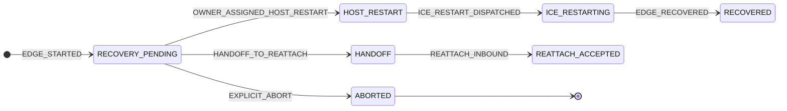

# ADR-0022: Recovery Completion Ownership & Reachability (ADR-CONF-004)

## Status

**Partial Accepted** (2026-07-10; **R28-H / R28-H.1 Accepted 2026-07-13**; **R28-H.2 Accepted 2026-07-13**; **R28-I Accepted 2026-07-14**; **R28-J Accepted 2026-07-20**; **Appendix C Accepted 2026-07-16**; **Appendix C-2 Accepted 2026-07-16**; **Appendix C-3.1 Accepted 2026-07-16**; **Appendix C-3.2 Accepted 2026-07-16**) — **Accepted:** R27′-A/B, R28-D/D1 (gate), **R28-E/F/G** (P2-A completion re-evaluate seam, frozen `/grill-with-docs` 2026-07-10), **R28-H / R28-H.1** (Recovery Edge Obligation Lifetime + deadline / pending-decision single writer; soak `647484ef`; **scope per Obligation Episode — see R28-J**), **R28-H.2** (DISCONNECTED_DEBOUNCING reconnect clears suspicion without starting recovery), **R28-I** (WAITING ownership; soak `ea6466f1` M03→M02 participant edge), **R28-J** (Obligation Episode Generation within Edge Lifecycle; soak `obligation-p1-clean-20260720-125309` session `8f1bcfdc` M02→M01 **PASS**), **Appendix C** (Recovery Attempt Media Action Ownership; causal trace soak `103003` / `125859`), **Appendix C-2** (Deferred Media Action Ownership; soak `112433` **PASS**), **Appendix C-3.1** (Supersede Admission Closure; soak `114047` **PASS**), **Appendix C-3.2** (Recovery Fact Consumption; soak `120053` **PASS**). **Accepted companion:** ADR-0024 R29-E (host prune eligibility consumes R28-H; does not redefine obligation). **Draft:** P2-B re-evaluate action decision tree, full S13 completion. Complements ADR-0021 (R24–R26) and ADR-0023 (R29).

## Summary

S13-B soak proved `RECOVERY_REATTACH_SENT` with `peerReachable=true transportReady=true` does **not** imply host inbound — root cause is **boolean collapse** of orthogonal reachability layers, not missing recovery machinery.

This ADR freezes:

1. **Recovery Edge vs Recovery Attempt vs Obligation Episode** (edge obligation ≠ attempt terminal; R28-J episode scope)
2. **Completion ownership** (per-edge controller, not initiator module)
3. **Action authority + explicit completion decisions** (no decision vacuum)
4. **Two-axis reachability** (`ReachabilitySnapshot`, not linear chain)
5. **Presence projection boundary** (UI reads `ConferencePresenceProjection`, never `ReachabilitySnapshot`)
6. **Recovery Edge Obligation Lifetime** (R28-H: OPEN/CLOSED exclusive close set + observation window; attempt terminal ≠ obligation CLOSED; **scoped per Obligation Episode**)
7. **Obligation Episode Generation** (R28-J: Edge Lifecycle vs Obligation Episode; `obligationGeneration`; `OBLIGATION_CLOSED(RECOVERED)` ≠ edge termination)
8. **WAITING ownership** (R28-I: every WAITING state must name a next-action owner)
9. **Recovery Attempt Media Action Ownership** (Appendix C: attempt MUST resolve media action before silent `FAILED_MEDIA_RECOVERY`)
10. **Deferred Media Action Ownership** (Appendix C-2: `DEFERRED` retains owner; soak `112433` **PASS** — Accepted 2026-07-16)
11. **Recovery Fact Reconciliation** (Appendix C-3: C-3.1 supersede admission **PASS** soak `114047`; C-3.2 fact consumption **PASS** soak `120053`)

```text
ReachabilitySnapshot  →  Recovery Controller  →  EdgeRecoveryFacts
                                                      ↓
                              ConferenceRuntimeProjector  |  ConferencePresenceProjector
                                      ↓                 |           ↓
                              Runtime phase/UI          |    joined/connected/recoveringPeers
                                                          ↓
                                                         UI
```

## Context

### S13-B soak evidence (session `dc040181`, M02 host, M01 WiFi loss)

| Observation | Implication |
|-------------|-------------|
| M01 `RECOVERY_REATTACH_SENT` `peerReachable=true transportReady=true` | Local send success ≠ mesh delivery |
| M02 no `INBOUND` / no `RECOVERED` | `routeConverged=false` while authority view stale |
| M02 Meeting pill `roster=3` while `connected=1` | UI reads membership count, not presence projection |
| M01 SENT then M02 silent | **Decision vacuum** — no `WAITING(reason)` emitted |

Probe markers (`peerReachable`, `transportReady`) are **diagnostic only** until R28-D1 gates replace them.

### Architectural layers (extended)

```text
Conference Lifecycle           — ESTABLISHED / TERMINATED
Membership Authority           — JOINED / LEFT
Reachability fact writers      — Connectivity, Discovery, Signaling/Mesh, Conference Runtime
ConferenceEdgeRecoveryController — per-edge policy, ReachabilitySnapshot consumer, EdgeRecoveryFacts producer
ConferenceRuntimeProjector     — phase, bootstrap, degraded, authority (lifecycle/runtime)
ConferencePresenceProjector    — joinedCount, connectedCount, recoveringPeers (presence)
```

## Decision

### R28-A — Recovery Edge vs Recovery Attempt

A **Recovery Edge** is keyed `(sessionId, remoteModuleId)` and may span multiple **Recovery Attempts** (`attemptId`) and multiple **Obligation Episodes** (`obligationGeneration`; R28-J).

| Terminal scope | Allowed values |
|----------------|----------------|
| **Attempt** | `RECOVERED`, `CANCELLED`, `ATTEMPT_TIMEOUT`, `SUPERSEDED` |
| **Obligation episode** (R28-H) | `RECOVERED`, **`obligationDeadline exceeded`** |
| **Edge lifecycle** (R28-J) | Membership `LEFT(remoteModuleId)`, `CONFERENCE_TERMINATED`, local session teardown |

**`ATTEMPT_TIMEOUT` terminates the attempt, not the obligation episode.**

**`CLOSED(RECOVERED)` terminates the obligation episode, not the Edge Lifecycle (R28-J).**

When reachability improves after attempt terminal, the edge controller **MUST re-evaluate** completion. Re-evaluate **MAY** start a new attempt but **MUST NOT** be conflated with "must start next attempt."

Complements ADR-0021 R24 (Strategy A degraded residency); R28-A clarifies edge/attempt orthogonality R24 assumes.

### R28-B — Completion Ownership

**Owner** = per-edge **Conference Edge Recovery Controller** on **this device** for **this** `(sessionId, remoteModuleId)`.

| Concept | Meaning |
|---------|---------|
| **Completion Owner** | Controller maintaining re-evaluate obligation until **obligation episode** terminal (R28-H) or **Edge Lifecycle** end (R28-J) |
| **Preferred Recovery Initiator** | Role hint (`initiatesReattach`); **≠** lifetime owner |
| **Recovery Action Authority** | Which side **may invoke** role-allowed actions when reachable |

Exactly-one obligation episode is **active per edge per local controller** at a time, not "M01 or M02 owns the edge globally."

### R28-C — Action Authority & Explicit Decisions

**v1 capabilities** (minimum):

| Role | Allowed actions |
|------|-----------------|
| Preferred initiator (participant edge) | Dispatch `RECOVERY_REATTACH` |
| Authority (host) | Accept/reject reattach; bounded **media recovery actions** (not frozen to ICE restart only) |
| Both | **MUST NOT** mutate membership |

On every **re-evaluate** (including after reachability change, attempt terminal, or inbound timeout), controller **MUST** emit exactly one **Recovery Completion Decision**:

```text
1. role-allowed completion action
2. WAITING(reason)
3. SUPERSEDED(nextAttemptId)
4. CANCELLED(reason)
```

**Forbidden:** passive wait with no logged decision (S13-B vacuum: SENT → host silence).

#### WAITING(reason) taxonomy

**Connectivity waiting** — not eligible to run recovery protocol:

```text
WAITING_FOR_LINK
WAITING_FOR_DISCOVERY
WAITING_FOR_ROUTE
```

**Protocol waiting** — protocol started, not yet complete:

```text
WAITING_FOR_AUTHORITY
WAITING_FOR_INBOUND
WAITING_FOR_ACCEPT
```

Mapping from `EdgeReachabilitySnapshot` (R28-D): e.g. `!routeConverged` → `WAITING_FOR_ROUTE`, not `WAITING_FOR_AUTHORITY`.

### R28-D — Edge Reachability Facts (two-axis model)

Recovery Controller aggregates **read-only facts**; it **does not own** and **MUST NOT write back** them.

| Fact | Writer | Meaning |
|------|--------|---------|
| `linkReady` | Connectivity | Local network usable |
| `peerDiscovered` | Discovery | Remote module visible |
| `routeConverged` | Signaling / Mesh | Packets can enter routing domain |
| `authorityReachable` | Conference Runtime | Authority can serve conference semantics |

```kotlin
ReachabilitySnapshot(
    linkReady: Boolean,
    peerDiscovered: Boolean,
    routeConverged: Boolean,
    authorityReachable: Boolean,
)
```

**NOT a linear chain.** `authorityReachable` and `routeConverged` are **orthogonal axes**. Soak counterexample: `peerDiscovered=true`, stale `authorityReachable=true`, `routeConverged=false` → reattach sent, host receives nothing.

#### Gates

```text
canDispatchRecoverySignal(edge) :=
    linkReady && peerDiscovered && routeConverged

canCompleteRecovery(edge) :=
    canDispatchRecoverySignal(edge) && authorityReachable
```

Controller **MUST** evaluate dispatch against `canDispatchRecoverySignal` before sending recovery signals.

### R28-D1 — No Boolean Collapse

Recovery decisions **MUST NOT** depend on standalone booleans:

```text
peerReachable
transportReady
authorityReachable   (as sole gate)
```

Completion and dispatch gates **MUST** be evaluated against **`ReachabilitySnapshot`**.

Diagnostic probes (S13-B) may log legacy fields; they **MUST NOT** drive gating after R28 implementation.

### R28-E — Completion Re-evaluate Seam (P2-A)

#### Core invariant

```text
Media Edge Restored          — transport / ICE connectivity re-established (connectivity fact)
Obligation Episode Completed — controller closes current episode (e.g. `CLOSED(RECOVERED)`)
Edge Lifecycle Ended         — record removed; membership / conference / local teardown (R28-J)

Media Edge Restored MUST NOT imply Obligation Episode Completed.
Obligation Episode Completed MUST NOT imply Edge Lifecycle Ended (R28-J).
```

#### ICE restoration vs completion

When edge phase is **`RECOVERY_PENDING`** (or otherwise non-terminal per R28-F) and **control-plane has not started** for the current attempt:

```text
controlPlaneStarted := attempt has crossed the control-plane boundary
    (e.g. REATTACH_REQUESTED, REATTACH_ACCEPTED, ICE_RESTARTING)
```

**ICE connectivity restoration MUST NOT directly transition the edge to `RECOVERED`.**

Instead, the controller **MUST**:

```text
1. record the media restoration fact (no phase shortcut)
2. emit RECOVERY_REEVALUATE
3. run completion evaluation (R28-C)
```

Only completion evaluation **MAY** produce: `RECOVERED`, `WAITING(reason)`, `SUPERSEDED(nextAttemptId)`, `CANCELLED(reason)`.

**Narrow exception:** when `controlPlaneStarted == true`, ICE CONNECTED **MAY** satisfy completion evaluation immediately and yield `RECOVERED`.

**Forbidden:**

```text
phase == REATTACH_REQUESTED → direct RECOVERED   (use controlPlaneStarted, not phase enumeration)
routeConverged → coordinator.resend()
ICE CONNECTED → auto REATTACH_REQUESTED
```

The re-evaluate **seam is identical for all edges** (host and participant). Role differences appear only in **evaluation output** (P2-B), not in which connectivity events invoke re-evaluate.

### R28-F — Attempt Terminal vs Edge Obligation

#### Definitions

| Term | Meaning |
|------|---------|
| **Attempt Terminal** | Current recovery attempt ends: `RECOVERED`, `FAILED_MEDIA_RECOVERY`, `CANCELLED`, `SUPERSEDED` |
| **Edge Obligation** | Completion owner maintains re-evaluate duty for the **current Obligation Episode** until episode terminal per R28-H (`RECOVERED`, `OBLIGATION_DEADLINE`, or lifecycle-ending close). **Not** synonymous with Edge Lifecycle (R28-J). |
| **Superseded Attempt** | Material capability change causes explicit abandonment of current attempt; new attempt receives new budget |

#### Rules

```text
attempt_timeout terminates the current attempt only.
It MUST NOT terminate the obligation episode.
```

**Phase model (v1 / P2-A):** `FAILED_MEDIA_RECOVERY` = **attempt terminal marker**; edge record **remains** in the controller map (R24-A degraded residency). P2-A deferred an explicit obligation state machine; **R28-H supersedes that deferral** and freezes `OPEN`/`CLOSED` lifetime + `obligationDeadline`.

When a **material** reachability transition occurs **after** attempt terminal (`FAILED_MEDIA_RECOVERY` record retained):

```text
controller MUST:
    1. emit RECOVERY_REEVALUATE
    2. perform completion evaluation

evaluation MAY produce:
    SUPERSEDED(nextAttemptId)   — not required on every transition
    WAITING(reason)
    CANCELLED(reason)
    RECOVERED
```

**Watchdog:**

```text
watchdog budget belongs to attempts, not to recovery edges.

RECOVERY_REEVALUATE  ≠ extend watchdog
RECOVERY_WAITING       ≠ pause watchdog
```

Before attempt timeout, watchdog **MUST** trigger **`RECOVERY_FINAL_EVALUATION`** (`reason=ATTEMPT_TIMEOUT`) — the last evaluation before attempt terminal — then transition to `FAILED_MEDIA_RECOVERY` if still non-success.

During `FAILED_MEDIA_RECOVERY`: ICE `DISCONNECTED`/`FAILED` **MUST NOT** auto-`beginRecovery` (anti attempt-storm). Coordinator-driven material transitions **MAY** invoke re-evaluate.

### R28-G — Capability Re-evaluation Contract

#### Ownership

```text
Materiality detection belongs to TalkbackCoordinator.

Fact writers MUST NOT invoke recovery evaluation directly.
```

Coordinator assembles `EdgeReachabilitySnapshot`, projects **`RecoveryCapabilitySignature`**, compares against per-edge last signature, and notifies the controller **only on material change**.

#### Recovery Capability Signature

A projection of `EdgeReachabilitySnapshot` capturing the **set of recovery actions currently permitted** — not raw connectivity booleans.

```kotlin
RecoveryCapabilitySignature(
    permittedActions: Set<RecoveryAction>,   // e.g. DISPATCH_REATTACH, COMPLETE_EDGE, …
    waitingReason: WaitingReason?           // current blocker for evaluation
)
```

**Material transition** ⇔ `permittedActions` or `waitingReason` changes.

`permittedActions` / `waitingReason` are **recovery-domain** projections. **`authorityReachable=true` does not imply `COMPLETE_EDGE ∈ permittedActions`** (e.g. `WAITING_FOR_INBOUND` while route and authority facts are true).

**Examples:**

| Scenario | Before | After | Material? |
|----------|--------|-------|-----------|
| Participant, route blocked | `{}`, `WAITING_FOR_ROUTE` | `{DISPATCH_REATTACH}`, `null` | ✅ |
| HELLO seq+1, peer already discovered | unchanged | unchanged | ❌ |
| Authority fact enables completion | `{DISPATCH_REATTACH}`, `WAITING_FOR_AUTHORITY` | `{DISPATCH_REATTACH, COMPLETE_EDGE}`, `null` | ✅ |
| Host, `WAITING_FOR_INBOUND`, route only restores | `{…}`, `WAITING_FOR_INBOUND` | unchanged | ❌ |

For **non-initiator edges**: route restoration alone **does not necessarily** constitute a material transition — only signature change counts.

#### Coordinator hooks (v1)

| Fact change | May change signature |
|-------------|-------------------|
| Mesh ICE state | route / dispatch capability |
| Channel readiness | link capability |
| Peer first callable (`0→1`) | discovery capability |
| **Conference authority reachability fact** flip | completion capability |

**Authority fact source:** domain fact (e.g. `isConferenceAuthorityReachable` / future `ConferenceAuthorityTracker`) — **NOT** `emitConferenceRuntimeProjection` itself. Runtime and Recovery projectors **both consume** the same authority fact; recovery **MUST NOT** read projection output.

**Explicit non-triggers:** per-HELLO refresh when peer already discovered; gossip timestamps; ICE `CHECKING` (v1 route = connected/completed only).

#### Observability (P2-A log contract)

| Marker | Role |
|--------|------|
| `RECOVERY_REEVALUATE` | Capability changed; controller awakened |
| `RECOVERY_FINAL_EVALUATION` | Watchdog expiry; last evaluation before attempt terminal |
| `RECOVERY_DECISION` | Evaluation output (P2-B enriches) |
| `RECOVERY_WAITING` | Explicit wait (protocol state, not debug noise) |

`RECOVERY_REEVALUATE` **SHOULD** log: `session`, `edge`, `attempt`, `trigger`, `capabilityBefore`, `capabilityAfter`, `controlPlaneStarted` — compact capability labels, not raw action-set dumps when avoidable.

**Forbidden in P2-A:** `routeConverged → resend()`; debounce material re-evaluate by default; extend watchdog on `WAITING`.

See `docs/audit/p2a-completion-re-evaluate-seam.md` (Accepted).

### R28-H — Recovery Edge Obligation Lifetime

**Rationale (R29 soak `647484ef`, 2026-07-13):** host M02 ran `FAILED_MEDIA_RECOVERY(M01)` → ~4s cleanup → `AUTHORITY_PRUNE`. Gate was `!isEdgeRecovering()` (attempt-scoped). `edgeObligationOpen()` already returned true for failed residency, but prune never consulted it, and no close/deadline existed — so either "prune immediately after attempt terminal" or (if blindly swapped to `edgeObligationOpen`) "never prune". R28-H freezes the missing middle lifecycle.

**Naming note:** R28-G remains **Capability Re-evaluation Contract**. This section is **R28-H**.

**Scope (R28-J, 2026-07-20):** R28-H defines OPEN / CLOSED / `obligationDeadline` for **one Obligation Episode** (`obligationGeneration`). An **Edge Lifecycle** (R28-J) may contain multiple sequential episodes. The no-reopen invariant applies **within** one episode only; a later recovery responsibility after a terminal episode outcome starts a **new** episode (new generation), not a reopen.

#### Lifecycles (R28-H scope + R28-J)

```text
RecoveryAttempt              — one recovery try (phase machine)
        │
        ▼
RecoveryEdgeObligation       — one obligation episode OPEN/CLOSED (THIS section; R28-J)
        │
        ▼
Edge Lifecycle               — continuous edge record existence (R28-J)
        │
        ▼
Membership Mutation (R29)    — who may prune / leave (ADR-0023; when = ADR-0024 R29-E)
```

| Lifecycle | Answers | Terminal meaning |
|-----------|---------|------------------|
| **RecoveryAttempt** | Did this try end? | End of attempt #N only |
| **RecoveryEdgeObligation** | Does Controller still own completion for **this episode**? | Episode CLOSED (`RECOVERED`, `OBLIGATION_DEADLINE`, or lifecycle-ending reason) |
| **Edge Lifecycle** | Does this observer still track this peer edge? | Record removed (`cancelEdge`) |
| **Membership** | Who may mutate roster? | Separate authority boundary (ADR-0023) |

They **MUST** remain independent. **MUST NOT** implicitly terminate each other except via the explicit close / removal rules below.

#### Attempt Terminal (unchanged scope; clarified non-derivations)

Attempt terminal values:

```text
RECOVERED
FAILED_MEDIA_RECOVERY
FAILED_REQUIRES_USER_ACTION
CANCELLED
SUPERSEDED
```

Attempt terminal **only** means: this attempt has ended.

**MUST NOT** derive from attempt terminal alone:

```text
membership mutation
prune eligible
edge obligation CLOSED
```

#### Obligation states

```text
OPEN
CLOSED
```

While **OPEN** (one episode), the edge record **MAY** host many attempts without closing the episode:

```text
Attempt#3 FAILED     →  obligation episode stays OPEN
Attempt#4 SUPERSEDED →  obligation episode stays OPEN
Attempt#5 FAILED     →  obligation episode stays OPEN
…
```

**There is no "reopen" within one episode.** While the episode stays OPEN, a material transition starts a **new Attempt**, not a reopen of the obligation. A later failure after episode CLOSED starts a **new episode** (R28-J), not a reopen.

#### Close Conditions (exclusive set per episode)

`RecoveryEdgeObligation` (current episode) **MUST** transition to **CLOSED** **only** when one of:

```text
1. RECOVERED                         — episode success (Edge Lifecycle MAY continue — R28-J)
2. membership committed LEFT(remote) — closes episode; Edge Lifecycle ends (record removed)
3. conference TERMINATED             — closes episode; Edge Lifecycle ends
4. obligationDeadline exceeded       — episode abandon (Edge Lifecycle MAY continue — R28-J)
```

**Episode vs lifecycle:** conditions 1 and 4 close the **episode only**. Conditions 2 and 3 close the episode **and** terminate the Edge Lifecycle.

**MUST NOT** close obligation:

```text
FAILED_MEDIA_RECOVERY
FAILED_REQUIRES_USER_ACTION
SUPERSEDED
CANCELLED   (attempt-scoped cancel ≠ obligation close unless it coincides with 2 or 3)
```

R28-A / R28-F close set is **extended** by condition 4 (`obligationDeadline`). Conditions 1–3 remain.

#### Observation Window (not sleep)

```text
obligationDeadline =
    attemptTerminalAt + observationWindow
```

`attemptTerminalAt` = wall-clock when the **current** attempt entered an attempt-terminal state that leaves obligation OPEN (typically `FAILED_MEDIA_RECOVERY` / `FAILED_REQUIRES_USER_ACTION`). A later SUPERSEDED → new attempt that again fails **resets** `attemptTerminalAt` to that new terminal instant (deadline follows the latest failed residency entry).

Observation Window duty is **not** "wait then prune".

It **accepts Reachability Material Transitions** and feeds re-evaluation (R28-G):

```text
Recovery Re-evaluation Triggers (examples):
  HELLO (when it changes capability signature)
  routeConverged flip
  authorityReachable flip
  RecoveryCapabilitySignature material change

≠ Obligation Close Triggers
```

Re-evaluation **MAY** start Attempt #N+1 while obligation remains **OPEN**.

Only when `now >= obligationDeadlineAt` **and** none of close conditions 1–3 have fired does condition 4 close the obligation.

#### R28-H.1 — Obligation Deadline Ownership

```text
ConferenceEdgeRecoveryController is the single writer of:

    obligationOpenedAt
    obligationDeadlineAt
    obligationClosedAt
    obligationCloseReason   // RECOVERED | MEMBERSHIP_LEFT | CONFERENCE_TERMINATED | OBLIGATION_DEADLINE
    hasPendingCompletionDecision
```

Membership / projector / prune / `cleanupUnhealthyConferenceSession` **MUST** consume these timestamps, close reason, and pending-decision flag **read-only**.

**Forbidden:** recomputing `obligationDeadline` (or equivalent grace) in coordinator prune paths, presence projectors, or mesh health cleanup. Dual writers recreate the soak failure class (`FAILED` → local cleanup clock → premature `AUTHORITY_PRUNE`).

**Forbidden:** deriving `hasPendingCompletionDecision` from HELLO silence, ICE CLOSED, or `route=false` outside the controller.

Controller **MUST** set `obligationDeadlineAt` when an attempt enters a failed-media residency that leaves obligation OPEN (`attemptTerminalAt + observationWindow`). Subsequent failed residency after SUPERSEDE **MAY** refresh `obligationDeadlineAt` (follows latest failed entry). Closing **MUST** stamp `obligationClosedAt` + `obligationCloseReason` exactly once per episode; a CLOSED episode **MUST NOT** reopen (R28-J: new failure after terminal episode outcome starts a new episode).

`hasPendingCompletionDecision` **MUST** be true while a completion evaluation / re-evaluate / supersede decision for that edge is in flight, and false only when the controller has emitted a settled completion decision (or the edge has no active evaluation). Membership **MUST NOT** invent this flag.

#### R28-H.2 — Debounce Suspicion Clear on ICE Reconnect

`DISCONNECTED_DEBOUNCING` is a **suspicion buffer**, not an attempt and not recovery ownership.

If ICE reconnects while the edge is still in `DISCONNECTED_DEBOUNCING`:

```text
MUST cancel debounce timer
MUST clear debouncing state → CONNECTED (HEALTHY)
MUST NOT start a recovery attempt
MUST NOT emit REATTACH
MUST NOT model the transition as RECOVERED
```

```text
DISCONNECTED_DEBOUNCING + ICE CONNECTED  →  HEALTHY
(not DISCONNECTED_DEBOUNCING → RECOVERED)
```

**Rationale:** leaving the debounce timer armed after media is already CONNECTED produces false `beginRecovery` / `REATTACH` and sticky `edgeRecovering` while topology is healthy — conflating suspicion with obligation/attempt lifecycles.

#### R28-J — Obligation Episode Generation

**Rationale (soak `obligation-p1-clean-20260720-125309`, 2026-07-20):** session `8f1bcfdc`, M02 host → M01: `CLOSED(RECOVERED)` at `obligationGen=1`, healthy gap, second WiFi loss → `RECOVERY_OBLIGATION_OPENED obligationGen=2` with `previousPhase=RECOVERED` / `pathway=NEW_OBLIGATION_EPISODE`; second `CLOSED(RECOVERED)` at `obligationGen=2`. Prior contaminated soak showed `GROUP_LEAVE` → `cancelEdge()` → `edges.remove()` erased history — not an episode-renewal failure. Frozen `/grill-with-docs` 2026-07-20.

R28-H governs **one recovery obligation episode**. R28-J governs **how many sequential episodes** may exist inside one Edge Lifecycle and when `obligationGeneration` advances.

##### Three lifecycles (orthogonal)

```text
Edge Lifecycle          — does this peer relationship still exist on this observer?
Obligation Episode      — one recovery-responsibility cycle (R28-H OPEN → CLOSED)
Recovery Attempt        — one bounded try inside an episode (R28-A / R28-F)
```

| Lifecycle | Identity (v1) | Answers |
|-----------|---------------|---------|
| **Edge Lifecycle** | Continuous `(sessionId, remoteModuleId)` edge record existence | Does this observer still track recovery for this peer in this session? |
| **Obligation Episode** | `obligationGeneration` within one Edge Lifecycle | Is this recovery-responsibility cycle open or closed? |
| **Recovery Attempt** | `attemptId` within one episode | How is this episode being executed right now? |

Edge Lifecycle persistence **does not** imply obligation continuity across episodes.

##### Edge Lifecycle Identity (v1)

In v1, an Edge Lifecycle is identified **implicitly** by the continuous existence of an edge recovery record keyed by `(sessionId, remoteModuleId)`. Removal of this record terminates the lifecycle. Recreating the record starts a new Edge Lifecycle.

**Termination (lifecycle ends; record removed):** only when the underlying peer relationship is **explicitly** ended:

1. **Membership termination** — member explicitly leaves; authority removes member; membership is no longer valid for this peer.
2. **Conference termination** — conference / session lifecycle ends.
3. **Local endpoint teardown** — local user explicitly hangs up; local session is intentionally destroyed.

**Invariant:** `OBLIGATION_CLOSED(*)` **MUST NOT** terminate an Edge Lifecycle. Recovery completion and temporary connectivity failures **MUST NOT** terminate an Edge Lifecycle.

v1 maps lifecycle termination to `cancelEdge()` → `edges.remove(key)` (implementation). ADR reason strings are non-normative; semantic categories above are normative.

##### Obligation Episode

An **Obligation Episode** is one recovery-responsibility cycle **inside** an active Edge Lifecycle. Each episode runs a full R28-H OPEN → attempts → terminal close arc.

`obligationGeneration` is monotonically increasing **within** the current Edge Lifecycle. It identifies the episode counter, **not** edge identity, remote membership version, or endpoint topology generation.

When a new Edge Lifecycle begins (record recreated after removal), `obligationGeneration` **MUST** start from its initial value (v1: `1`).

##### New episode admission (narrow rule)

A **new** Obligation Episode **MAY** be opened only when:

1. The previous episode within the **same** Edge Lifecycle reached a **terminal recovery outcome**, and
2. A subsequent edge failure requires new recovery responsibility.

**Allowed terminal outcomes that admit the next episode:**

```text
CLOSED(RECOVERED)
CLOSED(OBLIGATION_DEADLINE)
```

**MUST NOT** advance `obligationGeneration` (same episode continues):

```text
ATTEMPT_TIMEOUT
FAILED_MEDIA_RECOVERY
FAILED_REQUIRES_USER_ACTION
SUPERSEDED
REATTACH_REQUESTED
REATTACH_ACCEPTED
ICE_RESTARTING
DISCONNECTED_DEBOUNCING
```

Episode generation advances only across **completed recovery responsibilities**, never across attempts or intermediate failure states.

##### No-reopen rule (tightened)

Within one Obligation Episode: once CLOSED, that episode **MUST NOT** reopen.

A later recovery requirement after a terminal episode outcome **MUST** start a **new** Obligation Episode with `obligationGeneration + 1`. This is **not** a reopen.

##### Non-goals (R28-J)

R28-J **does not** define:

- recovery lineage across removed edge records (`cancelEdge` is an identity boundary);
- whether rejoin after explicit leave should inherit prior edge history;
- obligation continuity after transient membership loss or endpoint / module topology migration.

Those belong to a future ADR (e.g. detached edge / rejoin lineage), not R28-J.

#### R28-I — WAITING Ownership

**Rationale (soak `ea6466f1`, 2026-07-14):** participant M03 observed M02 `ICE_RESTORED` + `mediaRestored=true` while `controlPlaneStarted=false`. Controller logged `decision=WAITING rejectReason=control_plane_not_started` and **returned with no next-action owner** — obligation stayed OPEN, presence stuck (`recoveringPeers` / `mediaUnavailablePeers`), until watchdog timeout or `OBLIGATION_DEADLINE`. WAITING was treated as a terminal parking lot, not a owned intermediate state.

A recovery attempt **MAY** enter a **WAITING** state only if an **explicit next-action owner** exists.

**Valid owners:**

```text
inbound control-plane message
route convergence callback
watchdog timeout
recovery reevaluation
```

A recovery attempt **MUST NOT** remain in WAITING without an owner capable of advancing or terminating the obligation.

**Normative log markers (implementation):**

```text
RECOVERY_CONTROL_PLANE_REQUIRED   — media restored; control-plane continuation scheduled
RECOVERY_CONTROL_PLANE_BOUNDARY   — cross control-plane without transport flap (ICE_RESTART_ONLY + ICE CONNECTED)
decision=WAIT_FOR_CONTROL_PLANE   — owned wait; watchdog / reevaluate owns exit
```

**Forbidden:**

```kotlin
onLog("decision=WAITING rejectReason=xxx_not_started")
return   // no owner scheduled
```

Review question for any new WAITING: **who is responsible for pulling this attempt out of WAITING?**

恢复 attempt 可以进入 WAITING，但必须显式声明下一步动作的 owner。

合法 owner：

- 入站 control-plane
- route 收敛回调
- watchdog 超时
- recovery reevaluate

禁止出现没有 owner 的 WAITING。

#### API contract (normative direction)

Prune / membership eligibility consumers **MUST** consult obligation, not attempt phase helpers:

```kotlin
fun edgeObligationOpen(sessionId, remote): Boolean
fun edgeObligationClosed(sessionId, remote): Boolean
fun obligationDeadlineAt(sessionId, remote): Long?
fun obligationCloseReason(sessionId, remote): ObligationCloseReason?
fun hasPendingCompletionDecision(sessionId, remote): Boolean
```

**Non-normative for prune:**

```kotlin
isEdgeRecovering()          // Attempt phase only
isFailedMediaRecovery()     // Attempt residency marker only
isActivelyRecovering()      // Attempt phase only
```

Existing `EdgeRecoveryRecord.edgeObligationOpen()` (phase actively recovering **or** failed-media residency) is a **partial** open predicate for P2-A. R28-H requires it to become a true **per-episode** lifetime API: OPEN until exclusive close set; expose CLOSED; honor `obligationDeadlineAt` owned solely by the controller. Edge Lifecycle may continue after episode CLOSED(RECOVERED) (R28-J).

#### Boundary with Membership (ADR-0024 R29-E)

```text
ADR-0022 R28-H  →  when the current obligation episode ends (episode CLOSED)
ADR-0022 R28-J  →  when the Edge Lifecycle ends (record removed)
ADR-0024 R29-E  →  after episode CLOSED (and deadline rules), when Membership MAY mutate (prune eligibility)
```

R28-H **MUST NOT** define `canAuthorityPrune`. It only freezes obligation CLOSED as a **necessary** recovery-domain input for that future contract.

#### Soak counterexample this freezes

```text
11:18:01  FAILED_MEDIA_RECOVERY(M01)     — attempt terminal; obligation MUST stay OPEN
11:18:05  AUTHORITY_PRUNE(M01)           — illegal relative to R28-H: obligation not CLOSED
11:18:22  HELLO from M01                 — would have been re-eval trigger inside observation window
```

### R27′-A — Presence Projection Boundary

UI **MUST** consume **`ConferencePresenceProjection`** (and runtime phase from `ConferenceRuntimeProjector` where needed).

**`ReachabilitySnapshot` is recovery-internal** and **MUST NOT** surface to UI or ViewModel.

**Forbidden in UI/ViewModel:**

```kotlin
if (routeConverged && authorityReachable) { showRecovering() }
```

ViewModel **MUST NOT** reconstruct presence from `memberKeys.size`, ICE, or transport callbacks.

### R27′-B — Presence Projection Ownership

```kotlin
data class ConferencePresenceProjection(
    val joinedCount: Int,
    val connectedCount: Int,
    val recoveringPeers: Set<String>,  // ModuleId
)
```

**Producer:** dedicated **`ConferencePresenceProjector`**, sibling to `ConferenceRuntimeProjector`.

Both projectors consume the same read-only facts:

```text
MembershipRoster
EdgeRecoveryFacts
ConnectedPeers
AuthorityState (as needed for connected semantics)
```

**MUST NOT** extend `ConferenceRuntimeProjector.Output` with presence fields — prevents runtime DTO bloat (`suspectPeers`, `speakerPeers`, etc. belong on presence plane).

`recoveringPeers` **MUST** derive from **`EdgeRecoveryFacts` per `remoteModuleId`**, not ICE state or HELLO alone.

#### Semantic split (frozen)

```text
Reachability  → Recovery domain
Phase         → Runtime domain
Who is in / connected / recovering → Presence domain
```

## Relationship to ADR-0021

| ADR-0021 | ADR-0022 |
|----------|----------|
| R24 completion ownership after `attempt_timeout` | R28-A/B/C formalize edge vs attempt, re-evaluate, explicit decisions |
| R5 recovery ownership during attempt | R28-B separates owner vs initiator vs action authority |
| R16 EdgeRecoveryFacts → RuntimeProjector | R27′ adds PresenceProjector consumer |
| S13-B probe (in flight) | R28-D/D1 replace bool gates; probes remain audit-only |

R24 Strategy A (degraded residency) **remains v1 default**; R28 does not authorize Strategy B handoff.

## Consequences

- **Positive:** Soak failures become classifiable (`WAITING_FOR_ROUTE` vs `WAITING_FOR_AUTHORITY`); UI decouples from recovery internals; RuntimeProjector stops growing presence fields.
- **Positive (R28-H):** Attempt terminal no longer silently collapses into prune eligibility; host can observe HELLO/route inside `observationWindow` without prematurely closing recovery ownership; `obligationDeadline` prevents permanent joined=3 stuck conferences.
- **Negative:** Two projectors to keep in sync on shared facts; ReachabilitySnapshot wiring is new work (#73-B implementation).
- **Negative (R28-H):** Controller must track `attemptTerminalAt` / `obligationDeadline` and expose OPEN/CLOSED APIs; prune gate (ADR-0024) must migrate off `isEdgeRecovering`.
- **Neutral:** S13-B probe markers stay until gate implementation; Meeting pill fix is R27′ (can ship before R28 behavior fix).
- **Neutral (R28-H):** Does not authorize prune; ADR-0024 R29-E remains required before host post-terminal membership mutation changes.

## Implementation notes (non-normative)

1. **P0 docs:** this ADR + audit cross-links (`s13b-recovery-reattach-reachability.md`, `ro-m3-recovery-write-matrix.md`).
2. **P1 R27′ (implemented 2026-07-10):** `ConferencePresenceProjector` + `TalkbackSessionSnapshot.conferencePresenceProjection`; Meeting pill reads `connectedCount` / `recoveringPeers` — not roster size.
3. **P1 R28 reachability (implemented 2026-07-10):** `EdgeReachabilitySnapshot` gates `dispatchRecoveryReattachOutcome`; `DEFERRED` → `RECOVERY_PENDING` + `RECOVERY_WAITING(reason)`; v1 `routeConverged = qosMonitor.isGroupConnected(remoteModuleId)`. Soak G-R28-D PASS (`logs-s13b-reattach-reachability-20260710-161257`): no `RECOVERY_REATTACH_SENT` while `routeConverged=false`.
4. **P2-A re-evaluate seam (frozen 2026-07-10):** R28-E/F/G — Coordinator-owned `RecoveryCapabilitySignature`; `RECOVERY_REEVALUATE` / `RECOVERY_FINAL_EVALUATION`; `FAILED_MEDIA_RECOVERY` record retained; material transition → MUST re-evaluate, MAY SUPERSEDE. See grill: `p2a-completion-re-evaluate-seam.md`.
5. **R28-H obligation lifetime (frozen 2026-07-13):** OPEN/CLOSED exclusive close set + `obligationDeadline`; no reopen **within one episode** (R28-J); prune consumers must use `edgeObligationClosed()` — implementation pending; `observationWindow` value TBD at impl (soak showed ~4s too short vs ~20s WiFi restore).
6. **R28-J obligation episode generation (implemented 2026-07-20):** `obligationGeneration` on `EdgeRecoveryRecord`; `needsNewObligationEpisode()` / `openNewRecoveryObligation()`; watchdog binds generation. Soak **PASS** `obligation-p1-clean-20260720-125309` (session `8f1bcfdc`, M02→M01 gen=1→gen=2).
7. **P2-B re-evaluate actions:** decision tree for `permittedActions` → dispatch / ICE restart / `WAITING_FOR_INBOUND` / SUPERSEDE — not frozen in P2-A.
8. **P2 cleanup:** retire probe-only bools from decision paths; S13→E matrix update in write matrix.
9. **ADR-0024 R29-E (not this ADR):** host post-terminal prune eligibility after obligation CLOSED.

## Soak gates (future)

| Gate | Pass criterion | Status |
|------|----------------|--------|
| G-R28-D | WiFi loss: `RECOVERY_WAITING` / `RECOVERY_REATTACH_DEFERRED` with `WAITING_FOR_ROUTE` **before** any `RECOVERY_REATTACH_SENT` when `!routeConverged` | **PASS** `logs-s13b-…-161257` |
| G-R27′ | Meeting pill shows `joinedCount` / `connectedCount` / per-peer recovering consistent with host logs | PASS (prior soak) |
| G-R28-C | No interval where edge is non-terminal and no completion decision for > debounce | **PASS via G-P2-A1/A2** (continuation liveness; was FAIL → P2-A) |
| G-P2-A1 | When `RecoveryCapabilitySignature` changes materially, the recovery controller **MUST** evaluate again within the allowed debounce window. Evidence: `RECOVERY_REEVALUATE` **or** `RECOVERY_DECISION` **or** `RECOVERY_WAITING`. (Continuation liveness only — does **not** require `REATTACH_SENT` / `RECOVERED`.) | **PASS** UT `failedMediaRecovery_materialTransition_emitsReevaluate` + `deferredReattach_iceConnected_blocked_emitsReevaluateOnCapabilityChange` + IT `conferenceR28H2_materialReevalKeepsObligationOpenWithoutPrune`. Material change wakes evaluation inside debounce; may still end WAITING / SUPERSEDE / no dispatch |
| G-P2-A2 | No material capability transition may remain unevaluated until attempt timeout or obligation deadline | **PASS** same suite + UT `capability_participant_routeBlocked_thenConverged_isMaterial` (signature materiality) + H2 IT: route restore after `FAILED_MEDIA_RECOVERY` emits `RECOVERY_REEVALUATE` **before** deadline/timeout silence. Proves continuation seam, not recovery success |
| G-P2-A3 | May still have no `RECOVERY_REATTACH_SENT` (actions = P2-B) | Pending |
| G-S13-E | `RECOVERY_EDGE_RECOVERED` or explicit protocol terminal after WiFi restore | Pending → P2-B |
| G-R28-H1 | After `FAILED_MEDIA_RECOVERY`: obligation stays OPEN; no `AUTHORITY_PRUNE` until CLOSED | **PASS** UT `obligationFacts_stayOpenAfterFailedMediaRecovery` + IT `conferenceR29E_hostMayAuthorityPruneAfterObligationDeadline` (pre-deadline: no prune). Evidence: `ConferenceEdgeRecoveryController` is the single writer of obligation lifecycle (`openedAt` / `deadlineAt` / `closedAt` / `closeReason`); cleanup and prune paths consume facts only |
| G-R28-H2 | Material transition inside observation window → `RECOVERY_REEVALUATE` / new attempt; obligation still OPEN | **PASS** UT `failedMediaRecovery_materialTransition_emitsReevaluate` + IT `conferenceR28H2_materialReevalKeepsObligationOpenWithoutPrune` (also covers G-R29-E2 no prune) |
| G-R28-H3 | Permanent offline past `obligationDeadline` → obligation CLOSED (enables later R29-E prune) | **PASS** UT `obligationDeadline_pastWindow_closesWithObligationDeadline` + IT `conferenceR29E_hostMayAuthorityPruneAfterObligationDeadline`. Evidence: `FAILED_MEDIA_RECOVERY` keeps obligation OPEN until `obligationDeadline`; deadline expiration closes with `closeReason=OBLIGATION_DEADLINE` and unlocks R29-E prune eligibility |
| G-R28-J1 | Same Edge Lifecycle: `CLOSED(RECOVERED)` at gen=N, healthy gap, second disconnect → `RECOVERY_OBLIGATION_OPENED` gen=N+1, `pathway=NEW_OBLIGATION_EPISODE`, second `CLOSED(RECOVERED)`; no `member_left` / `cancelEdge` between rounds | **PASS** `obligation-p1-clean-20260720-125309` session `8f1bcfdc` M02 host → M01 |

## Conference transmit barrier scope — closed by ADR-0026 (2026-07-14)

**Open question:** Should conference recovery block unrelated participant transmit?

**Resolution:** **Closed by ADR-0026.** Conference transmit barriers are **edge-scoped**. Remote edge recovery / obligation OPEN MUST NOT block local capture when another publish path remains healthy. See `docs/adr/0026-conference-media-transmit-barrier-scope.md`.

**Device evidence:** Soak3 session `df7a5404` (2026-07-14) — M02 WiFi loss; M01↔M03 audio continued; no `CONFERENCE_WIDE` `stop_capture` on healthy peers.

**Observability:** `CONFERENCE_BARRIER_SNAPSHOT` logs `policy=EDGE_SCOPED`, `canPublish`, peer recovery telemetry (`recovering`, `obligationOpen`, `failed`) — peer fields are diagnostic only.

## P0-a — GROUP transition readiness observation (2026-07-15)

**Problem (revised):** `MEETING_END` governance transition exists, but terminal predicate is **local** (`membershipReconciled` + `transmitMissingPeers` empty). It does not model receive-capability attach or cross-node session identity convergence. Post-meeting PTT failures with healthy floor control are therefore a **transition/readiness false-positive** class, not PTT/Floor bugs.

**Instrumentation (observation only — no gate/mesh/floor/playback behavior changes):**

| Marker | Purpose |
|--------|---------|
| `MEETING_END_BEGIN` | Transition start + session identity at teardown |
| `GROUP_TRANSITION_READINESS_SNAPSHOT` | Local readiness + identity + bootstrap state |
| `BOOTSTRAP_ATTEMPT` | Bootstrap churn counter (`waitingForPrimary`, `attemptId`) |
| `TRANSITION_TERMINAL_READY` | Local transition terminal timing |

**Key fields:** `sessionTraceId`, `localSessionId`, `initiatorModuleId`, `anchorModuleId`, `floorAuthorityModuleId`, `resolvedBootstrapPrimaryModuleId`, `orphanBelief` (belief only — not ground truth).

**Receive sampling:** only when `floorAuthorityModuleId != null` and a remote floor holder exists; records `HOLDER_AUDIO_UNREACHABLE`, not idle `NO_FLOOR_OWNER`.

**Soak:** `scripts/soak-p0a-group-transition.ps1` — host end → PTT at t+0/5/10/15s; Layer 1 reports `transitionDurationMs`, `bootstrapAttemptCount`, `orphanBeliefDurationMs`. Layer 2 (`correlateBySessionTraceId`) deferred until device data.

**Open questions for P0-a data:**

1. Does `terminalReady=true` coincide with `orphanBelief=true` on participants?
2. How many `BOOTSTRAP_ATTEMPT` per `MEETING_END`?

## Appendix C — Recovery Attempt Media Action Ownership (frozen 2026-07-16)

**Also cited as:** ADR-0022-C — Recovery Attempt Closure Contract.

### Problem statement (revised)

P2-A (R28-E/F/G) froze **completion re-evaluate** after attempt terminal or material capability change. Causal trace soak (`MEDIA RECOVERY CAUSAL TRACE`, stamp `20260716-103003` / `20260715-125859`) proved a **prior** gap:

```text
Recovery ownership          Media action ownership       Signaling / ICE        Completion
        |                            |                        |                    |
RECOVERY_EDGE_STARTED                  X                        ?                    ?
        |                            |                        |                    |
   (implicit wait)              no dispatch              passive ICE?          timeout → FAILED
```

**Appendix C freezes the media-action layer.** It does **not** redefine P2-A completion re-evaluate, membership (ADR-0023), floor, playback, GROUP bootstrap (P2-0), or UI projection (R27′).

### Layer model

```text
1. Recovery attempt opened     — RECOVERY_EDGE_STARTED / RECOVERY_ATTEMPT_OPENED
2. Media action ownership      — Appendix C (this section)
3. Signaling + ICE transport   — MEDIA_SIGNAL_* / MEDIA_ICE_* / ICE state
4. Completion evaluation       — P2-A / R28-E/F/G
5. Edge obligation closure     — R28-H
```

An attempt that reaches layer 4 without resolving layer 2 is **architecturally incomplete**, regardless of whether ICE later moves on its own.

### C-1 — Recovery attempt MUST bind a media action owner

After `RECOVERY_EDGE_STARTED` (or equivalent `beginRecovery` terminal for the attempt), the controller **MUST** within the attempt budget assign exactly one of:

| Outcome | Evidence marker (v1) | Meaning |
|---------|----------------------|---------|
| **A. Host media restart** | `RECOVERY_ICE_RESTART_DISPATCHED` | Host owns `createOffer(iceRestart=true)` for this `(session, remote, attempt)` |
| **B. Reattach handoff** | `RECOVERY_HANDOFF_TO_REATTACH` | Attempt explicitly delegates to inbound reattach / `REATTACH_ACCEPTED` path |
| **C. Explicit abort** | `EXPLICIT_RECOVERY_ABORT(reason=…)` | Attempt ends with stated reason; no silent expiry |

**Forbidden:**

```text
RECOVERY_EDGE_STARTED
        → (no A/B/C)
        → ATTEMPT_TIMEOUT
        → FAILED_MEDIA_RECOVERY
```

This pattern **MUST NOT** occur without an intervening media-action decision. Observation of transport (ICE CHECKING, passive candidate) is **not** a media action assignment.

**Rationale (soak `125859`, M02 host, M03 WiFi):** attempt=2 had `RECOVERY_EDGE_STARTED`, never `RECOVERY_ICE_RESTART_DISPATCHED`, then `FAILED_MEDIA_RECOVERY`. Causal chain broke at layer 2.

#### C-1.1 — Media action owner priority (no competing owners)

`EDGE_STARTED` **MUST NOT** leave two media-action paths racing on the same attempt.

**Priority (highest wins; lower paths MUST defer or supersede):**

| Priority | Rule |
|----------|------|
| 1 | **Existing valid media action owner continues** — once `RECOVERY_MEDIA_OWNER_ASSIGNED` is emitted for attempt *N*, no second owner on *N* |
| 2 | **Explicit handoff supersedes passive attempt** — `RECOVERY_HANDOFF_TO_REATTACH` / inbound `REATTACH_ACCEPTED` **MAY** supersede attempt *N* → *N+1*; attempt *N* MUST NOT also dispatch restart |
| 3 | **Abort only when no valid owner exists** — `EXPLICIT_RECOVERY_ABORT` only after deadline without A or B |

**Forbidden race:**

```text
attempt=2  EDGE_STARTED
    +  host ICE_RESTART_DISPATCHED
    +  participant REATTACH_INBOUND (same attempt, no supersede)
```

**Normative assignment marker:**

```text
RECOVERY_MEDIA_OWNER_ASSIGNED
    session=…
    remote=…
    attempt=N
    owner=HOST_RESTART | PARTICIPANT_REATTACH | ABORTED
    recoveryOwnerModuleId=<local module that owns recovery decision>
    mediaActionOwnerModuleId=<module that will execute signaling restart>
    parentAttempt=<optional, when owner follows handoff>
```

Examples:

```text
RECOVERY_MEDIA_OWNER_ASSIGNED owner=HOST_RESTART attempt=2 recoveryOwnerModuleId=M02 mediaActionOwnerModuleId=M02

RECOVERY_MEDIA_OWNER_ASSIGNED owner=PARTICIPANT_REATTACH attempt=3 parentAttempt=2
    recoveryOwnerModuleId=M02 mediaActionOwnerModuleId=M03 supersededByModule=M03
```

`RECOVERY_ICE_RESTART_DISPATCHED` and `RECOVERY_HANDOFF_TO_REATTACH` **imply** `RECOVERY_MEDIA_OWNER_ASSIGNED` but **MUST** remain separate markers for causal trace.

### C-2 — `ICE_RESTART_ONLY` MUST mean recovery authority owns restart dispatch

Policy `ICE_RESTART_ONLY` **MUST NOT** be implemented as passive observation of the remote peer's transport recovery.

**Terminology (do not conflate):**

| Field | Meaning |
|-------|---------|
| `conferenceHostModuleId` | Conference lifecycle / invite authority |
| `recoveryOwnerModuleId` | Module whose edge controller owns the **recovery attempt** decision on **this device** |
| `mediaActionOwnerModuleId` | Module that **executes** signaling restart (may differ after handoff) |

```text
ICE_RESTART_ONLY  :=  recovery authority on this device MUST assign media action owner (C-1)
                      and dispatch restart (A) OR explicit handoff (B)
                      within attempt budget
```

**MUST NOT** alias `recoveryOwnerModuleId` to `conferenceHostModuleId`. GROUP / unicast recovery **MUST** use the same ownership fields without conference-host coupling.

If the recovery authority only watches ICE/candidate facts without assigning owner, the mode is **passive observation** — not recovery ownership.

**Rationale (soak `103003`):** attempt=2 received `MEDIA_SIGNAL_CANDIDATE_RECEIVED` and ICE CONNECTED while host never dispatched restart. Participant transport recovered **without** host media action closure on attempt=2.

### C-3 — Participant reattach is fallback, not primary closure

Successful soak path (`103003`):

```text
attempt=2  EDGE_STARTED, no dispatch
      →  M03 RECOVERY_REATTACH_INBOUND
      →  SUPERSEDE attempt=3
      →  RECOVERY_ICE_RESTART_DISPATCHED (attempt=3)
      →  RECOVERY_EDGE_RECOVERED
```

This path **MAY** recover the conference but **MUST NOT** be the only closure mechanism for host-owned attempts.

| WiFi timing | Risk if reattach is primary |
|-------------|----------------------------|
| Fast | Participant reattach masks missing host dispatch |
| Slow | No reattach inbound before timeout → `FAILED_MEDIA_RECOVERY` while membership stays JOINED |

**Normative:** Primary owner for host `ICE_RESTART_ONLY` is **A** (dispatch). **B** (reattach handoff) is permitted when dispatch preconditions fail, but **MUST** be explicit (`RECOVERY_HANDOFF_TO_REATTACH`), not accidental via timeout silence.

### C-4 — Attempt supersede MUST name reason and causal relation

When attempt *N* is abandoned for attempt *N+1*, logs **MUST** include:

```text
RECOVERY_ATTEMPT_SUPERSEDED
    session=…
    sessionTraceId=…
    remote=…
    oldAttempt=N
    newAttempt=N+1
    reason=<PARTICIPANT_REATTACH | MATERIAL_CAPABILITY | PEER_DISCOVERED | …>
    supersededByModule=<module that triggered supersede, if remote>
    parentAttempt=N
    parentSessionTraceId=<session trace at supersede time>
```

**Causal question answered:** why may attempt *N+1* legally cover attempt *N*?

Forbidden ambiguity:

```text
attempt=2 FAILED_MEDIA_RECOVERY
attempt=3 RECOVERED
```

without supersede record linking `oldAttempt`, `reason`, and `supersededByModule`.

v1 supersede reasons observed in soak:

| reason | Trigger |
|--------|---------|
| `PARTICIPANT_REATTACH` | `RECOVERY_REATTACH_INBOUND` / `REATTACH_ACCEPTED` |
| `PEER_DISCOVERED` | Discovery / HELLO material transition (R28-H2) |
| `MATERIAL_CAPABILITY` | `RecoveryCapabilitySignature` change |

### C-5 — Acceptance: causal invariants, not UI

**PASS** (successful edge recovery) requires, for the recovering attempt lineage:

```text
RECOVERY_EDGE_STARTED
    → MEDIA_ACTION_OWNER_ASSIGNED     (A or B from C-1)
    → (signaling + ICE — MEDIA_SIGNAL_* / ICE CONNECTED)
    → RECOVERY_EDGE_RECOVERED
```

`MEDIA_ACTION_OWNER_ASSIGNED` evidence (any one):

- `RECOVERY_MEDIA_OWNER_ASSIGNED` with `owner=HOST_RESTART` and matching `attempt=`
- `RECOVERY_MEDIA_OWNER_ASSIGNED` with `owner=PARTICIPANT_REATTACH`, `parentAttempt=`, and supersede record
- `EXPLICIT_RECOVERY_ABORT` with reason (replaces silent `FAILED_MEDIA_RECOVERY` when no owner assigned)

**FAIL** (Appendix C violation):

```text
RECOVERY_EDGE_STARTED
    + FAILED_MEDIA_RECOVERY
    + no RECOVERY_ICE_RESTART_DISPATCHED
    + no RECOVERY_HANDOFF_TO_REATTACH
    + no EXPLICIT_RECOVERY_ABORT
```

for the same `(session, remote, attempt)`.

UI (`connected=3`, pill hints) is **diagnostic only**; gates **MUST** use causal trace + recovery markers.

### Observability contract (v1)

Correlation keys (see `MediaRecoveryCausalTrace`):

```text
session, sessionTraceId, scope, remote, attempt,
conferenceGeneration, pcGeneration, transportGeneration
```

Minimum chain for host edge audit:

```text
RECOVERY_EDGE_STARTED attempt=N
    → RECOVERY_ICE_RESTART_DISPATCHED attempt=N   (or HANDOFF)
    → MEDIA_SIGNAL_OFFER_SENT attempt=N
    → MEDIA_ICE_CANDIDATE_* attempt=N
    → RECOVERY_EDGE_RECOVERED attempt=N′          (N′ may supersede N)
```

### Relationship to P2-A / P2-B

| Topic | Owner |
|-------|-------|
| Media action ownership (this Appendix) | **Appendix C** — implement before relying on completion fixes |
| Completion re-evaluate after material change | P2-A (R28-E/F/G) — layer 4 |
| Action decision tree (`DISPATCH_REATTACH`, `WAIT_FOR_INBOUND`, …) | P2-B — draft |
| Post-terminal `FAILED` + late transport | P2-A grace / completion window — **downstream** of C-1; does not excuse missing dispatch at `EDGE_STARTED` |

### Out of scope (explicit)

- Floor routing, playback, membership mutation (ADR-0023), P2-0 canonical lineage, UI projection rules.

### Freeze sentence

> **A recovery attempt is not a recovery completion candidate until its media action ownership is resolved. An attempt that observes transport changes without owning or delegating a media recovery action MUST NOT silently expire into `FAILED_MEDIA_RECOVERY`.**

### Soak gates (Appendix C)

| Gate | Pass criterion | Status |
|------|----------------|--------|
| G-C-1 | **Forbidden:** `RECOVERY_EDGE_STARTED` + deadline expired + **no** `RECOVERY_MEDIA_OWNER_ASSIGNED` (must be `EXPLICIT_RECOVERY_ABORT`, not silent `FAILED_MEDIA_RECOVERY`) | **FAIL** `125859`; partial **PASS** `103003` (handoff on attempt=3) |
| G-C-2 | **Required:** `EDGE_STARTED` → `MEDIA_ACTION_OWNER_ASSIGNED` → signaling/ICE → `EDGE_RECOVERED` | **PASS** `103003` |
| G-C-3 | **Handoff allowed:** attempt=N → participant reattach → `SUPERSEDE(reason)` → attempt=N+1 → `MEDIA_ACTION_OWNER_ASSIGNED` | **PASS** `103003` |
| G-C-4 | Causal trace: `attempt` threads recovery → dispatch → signaling | **PASS** (instrumentation 2026-07-16) |

### Implementation sequence (non-normative; frozen order)

1. **Patch 1 — C-1 contract:** `EDGE_STARTED` → `MEDIA_ACTION_PENDING`; deadline without owner → `EXPLICIT_RECOVERY_ABORT(NO_MEDIA_ACTION_OWNER)`, not silent `FAILED_MEDIA_RECOVERY`.
2. **Patch 2 — Restart dispatch:** `ICE_RESTART_ONLY` path assigns `owner=HOST_RESTART` and emits `RECOVERY_ICE_RESTART_DISPATCHED` (fixes `125859` class).
3. **Patch 3 — Explicit handoff:** participant reattach remains; becomes `RECOVERY_HANDOFF_TO_REATTACH` + supersede, not implicit rescue.

**Explicitly deferred:** longer timeout, blind retry, membership/floor/playback/UI changes.

### Patch design — C-1 vs existing FSM (non-normative)

**Do not duplicate the recovery FSM.** Insert a **media-action sub-state** on the existing attempt, not a parallel controller.

#### Existing `EdgeRecoveryPhase` (today)

```text
DISCONNECTED_DEBOUNCING → RECOVERY_PENDING → [REATTACH_* | ICE_RESTARTING] → RECOVERED
                                              ↘ FAILED_MEDIA_RECOVERY (watchdog)
```

**Gap (code):** `beginRecovery(initiatesReattach=false)` sets `RECOVERY_PENDING`, schedules watchdog, **never** calls `issueBoundedIceRestart`. Restart only from `REATTACH_ACCEPTED` or `continueControlPlaneRecoveryAfterMediaRestored` (ICE_RESTORED path).

#### Proposed insertion (Appendix C)

Add **logical** sub-state on `EdgeRecoveryRecord` (not necessarily new `EdgeRecoveryPhase` enum value in v1):

```text
mediaActionOwner: UNASSIGNED | PENDING | HOST_RESTART | HANDOFF_REATTACH | ABORTED
```

| Existing phase | New sub-state | Trigger |
|----------------|---------------|---------|
| `RECOVERY_PENDING` | `UNASSIGNED` → `PENDING` | `RECOVERY_EDGE_STARTED` |
| `RECOVERY_PENDING` | `PENDING` → `HOST_RESTART` | `issueBoundedIceRestart` success → `RECOVERY_MEDIA_OWNER_ASSIGNED` |
| `RECOVERY_PENDING` | `PENDING` → `HANDOFF_REATTACH` | `RECOVERY_HANDOFF_TO_REATTACH` / inbound reattach |
| `RECOVERY_PENDING` | `PENDING` → `ABORTED` | watchdog, no owner → `EXPLICIT_RECOVERY_ABORT` |
| `ICE_RESTARTING` | `HOST_RESTART` | already dispatched |
| `REATTACH_ACCEPTED` | `HOST_RESTART` or `HANDOFF` | per C-1.1 priority |

**Patch 2 minimal hook:** end of `beginRecovery`, when `policy=ICE_RESTART_ONLY` and `routeConverged` (or immediate), call `assignMediaActionOwner(HOST_RESTART)` → `issueBoundedIceRestart` — **single writer**, no race with reattach (reattach triggers supersede per C-1.1 #2).



#### FSM对照（插入点）

| 现有代码路径 | 现状 | Appendix C 改法 |
|-------------|------|----------------|
| `beginRecovery(ICE_RESTART_ONLY)` | watchdog only | + assign owner + `issueBoundedIceRestart` |
| `beginRecovery(REATTACH)` | `onRequestReattach` | + `HANDOFF` or `HOST_RESTART` after accept |
| `issueBoundedIceRestart` | reattach / ICE_RESTORED only | also from `beginRecovery` |
| watchdog `ATTEMPT_TIMEOUT` | → `FAILED_MEDIA_RECOVERY` | if `mediaActionOwner==UNASSIGNED` → `EXPLICIT_ABORT` |
| `onRecoveryReattachAccepted` | supersede + restart | + `RECOVERY_ATTEMPT_SUPERSEDED` causal fields |

## Appendix C-2 — Deferred Media Action Ownership Preservation (frozen 2026-07-16)

**Also cited as:** ADR-0022-C2 — Deferred Media Action Ownership.

**Extends:** Appendix C (C-1..C-5). **Does not replace** Appendix C section "C-2" (`ICE_RESTART_ONLY` dispatch semantics).

### Problem statement

Evidence pass soak (`MEDIA RECOVERY CAUSAL TRACE`, stamp `20260716-105748`, session `e408b98f`, M03 WiFi flap) proved Appendix C Patch 1/2 fixed **missing owner at dispatch** but exposed a **second, independent** gap:

```text
RECOVERY_EDGE_STARTED
    → DISPATCH_REATTACH (decision approved)
    → outcome=DEFERRED (transport prerequisite unmet)
    → ATTEMPT_TIMEOUT
    → EXPLICIT_RECOVERY_ABORT(reason=NO_MEDIA_ACTION_OWNER)
```

If `DISPATCH_REATTACH` was chosen, an action owner **was selected**. Classifying the terminal as `NO_MEDIA_ACTION_OWNER` is a **lifecycle contradiction** — not evidence that recovery was impossible.

Separately, the same soak showed **deferred wakeup not wired** (host-edge M03→M02: `Remote module recovered: M02` at 10:59:04 without `RECOVERY_REEVALUATE edge=M02`). That is **out of scope for this appendix** — see future **Appendix C-3** (Deferred Action Wakeup Binding).

**Freeze sentence (C-2 scope only):**

> **C-2 corrects ownership classification across DEFERRED transport states. It does not promise recovery.**

### Governance chain (Appendix C family)

```text
C-1   (Appendix C)   — attempt MUST resolve media action owner before silent expiry
C-2   (this section) — deferred action MUST retain ownership; DEFERRED ≠ UNASSIGNED
C-3   (future)       — deferred action MUST have declared wakeup + re-evaluate binding
C-4   (R28-E/F/G)    — completion re-evaluate after material capability change
C-5   (R28-H)        — edge obligation lifetime / projection
```

Patch 2.5 implements **C-6..C-8** (this appendix). Patch 3+ implements **Appendix C-3** — not retry semantics.

### Layer model (unchanged; C-2 insertion point)

```text
1. Recovery attempt opened
2. Media action ownership      — Appendix C + C-2 (owner + disposition)
3. Signaling + ICE transport
4. Completion evaluation       — R28-G (downstream; MUST NOT substitute for C-2)
5. Edge obligation closure     — R28-H
```

C-2 operates entirely in layer 2. It **MUST NOT** duplicate `EdgeRecoveryPhase` or introduce a parallel recovery FSM (per Appendix C patch design).

### C-6 — Deferred ownership preservation

After `RECOVERY_EDGE_STARTED`, once media action ownership is **assigned**, it **MUST** remain valid through a `DEFERRED` disposition until one of:

```text
completion       — action executed and edge recovers
supersede        — attempt N → N+1 with causal record (Appendix C C-4)
explicit abort   — stated terminal reason (not misclassified absence)
```

**Forbidden:**

```text
DISPATCH_REATTACH approved
    → outcome=DEFERRED
    → (ownership released or never recorded)
    → NO_MEDIA_ACTION_OWNER
```

**Normative:**

```text
DEFERRED is a dispatch outcome, not absence of ownership.
DEFERRED MUST NOT be equivalent to UNASSIGNED.
```

**Rationale (soak `105748`, M03→M02 attempt=3/5):** `RECOVERY_REATTACH_DEFERRED reason=WAITING_FOR_ROUTE` preceded `EXPLICIT_RECOVERY_ABORT(NO_MEDIA_ACTION_OWNER)`. The action was chosen; only transport blocked execution.

### C-7 — Deferred action MUST declare wakeup dependency

Every `DEFERRED` disposition **MUST** record which external fact, when it becomes true, **would** permit re-evaluation of the blocked action. This appendix **declares and logs** the binding only — it does **not** require the coordinator to act on it (Appendix C-3).

**Forbidden:**

```text
DEFERRED with no wakeupBinding
    → silent wait until watchdog
```

That pattern is a zombie-attempt source (same class of bug as pre-C-1 silent expiry).

#### Ownership record (logical model)

Do **not** overload `EdgeRecoveryPhase`. Add orthogonal fields on `EdgeRecoveryRecord` (or equivalent):

```kotlin
MediaActionOwnership(
    owner: MediaActionOwner,              // NONE | HOST | PARTICIPANT
    disposition: MediaActionDisposition,  // closed enum — see below
    deferredReason: DeferredReason?,     // when disposition == DEFERRED
    wakeupBinding: WakeupBinding?,       // declared dependency; C-3 wires re-evaluate
)
```

```kotlin
enum class MediaActionOwner { NONE, HOST, PARTICIPANT }

/** Closed enum — MUST NOT add SENT / DISPATCHING / COMPLETED (those live in EdgeRecoveryPhase). */
enum class MediaActionDisposition { UNASSIGNED, ACTIVE, DEFERRED, ABORTED }

enum class DeferredReason {
    ROUTE_NOT_READY,
    AUTHORITY_NOT_READY,
    MEDIA_NOT_READY,
}

data class WakeupBinding(
    sourceType: WakeupSourceType,
    sourceKey: String,   // scoped identity, e.g. edge(session,remote) or module(M02)
)

enum class WakeupSourceType {
    ROUTE_CONVERGED,
    PEER_DISCOVERED,
    AUTHORITY_REACHABLE,
}
```

**Wakeup binding granularity (required):** `wakeupBinding` **MUST** name both `sourceType` and `sourceKey`. Wildcard bindings are **forbidden**.

| Valid | Invalid |
|-------|---------|
| `{ sourceType: ROUTE_CONVERGED, sourceKey: edge(M03→M02) }` | `{ sourceType: RECOVERY_EVENT }` |
| `{ sourceType: PEER_DISCOVERED, sourceKey: module(M02) }` | `{ sourceType: ANY_RECOVERY_EVENT }` |

C-3 matches **external fact → binding.sourceType + sourceKey → `RECOVERY_REEVALUATE`**. Without scoped keys, C-3 reintroduces silent wait.

**Legal `(owner, disposition)` combinations:**

| owner | disposition | Valid? |
|-------|-------------|--------|
| `NONE` | `UNASSIGNED` | Yes — pre-assignment |
| `NONE` | `ACTIVE` | **No** |
| `HOST` / `PARTICIPANT` | `ACTIVE` | Yes — dispatch in flight or completed |
| `HOST` / `PARTICIPANT` | `DEFERRED` | Yes — prerequisite unmet |
| `NONE` | `ABORTED` | Yes — explicit terminal without prior owner |
| `HOST` / `PARTICIPANT` | `ABORTED` | Yes — explicit abort after assignment |

**Orthogonal to `EdgeRecoveryPhase` (examples):**

```text
owner=HOST, disposition=DEFERRED, phase=RECOVERY_PENDING   (WAITING_FOR_ROUTE)
owner=HOST, disposition=ACTIVE,  phase=ICE_RESTARTING
owner=HOST, disposition=ACTIVE,  phase=RECOVERED
```

Ownership **MUST NOT** encode phase progress (`SENT`, `DISPATCHING`, `COMPLETED`).

#### Observability (v1)

When disposition becomes `DEFERRED`, emit:

```text
RECOVERY_MEDIA_ACTION_DEFERRED
    session=…
    remote=…
    attempt=N
    owner=HOST | PARTICIPANT
    disposition=DEFERRED
    deferredReason=ROUTE_NOT_READY | AUTHORITY_NOT_READY | MEDIA_NOT_READY
    wakeupBinding=<sourceType>/<sourceKey>    e.g. ROUTE_CONVERGED/edge(session,M02)
```

Existing `RECOVERY_REATTACH_DEFERRED` / `RECOVERY_MEDIA_ACTION_DEFERRED` (pre-C-2) **SHOULD** converge on this shape in Patch 2.5.

### C-8 — Timeout classification: owner absent vs owner blocked

Watchdog expiry **MUST** distinguish:

| Classification | Meaning | v1 abort reason |
|----------------|---------|-----------------|
| **OWNER_ABSENT** | No media action owner was assigned before deadline | `NO_MEDIA_ACTION_OWNER` (C-1) |
| **OWNER_BLOCKED** | Owner assigned; action remained `DEFERRED` through deadline | `OWNER_BLOCKED` (**not** `NO_MEDIA_ACTION_OWNER`) |

**`OWNER_BLOCKED` is not failed recovery completion.** It means:

> Owner is determined, but the owner’s media action has not yet satisfied its dispatch prerequisite.

Do **not** read `FAILED_MEDIA_RECOVERY` + `OWNER_BLOCKED` as “recovery failed because the action failed”. C-2 covers only `OWNER_ABSENT` vs `OWNER_BLOCKED`. **`ACTION_FAILED`** (action executed but failed) is **out of scope** for C-2 — a future classification if needed.

| Classification | Meaning |
|----------------|---------|
| `OWNER_ABSENT` | No one owns this recovery action |
| `OWNER_BLOCKED` | Owner exists; execution prerequisite unmet |
| `ACTION_FAILED` | *(not C-2)* Action ran and failed |

**Forbidden:**

```text
owner=PARTICIPANT, disposition=DEFERRED, wakeupBinding=ROUTE_CONVERGED
    → ATTEMPT_TIMEOUT
    → reason=NO_MEDIA_ACTION_OWNER
```

**Normative terminal pattern (owner blocked):**

```text
RECOVERY_MEDIA_OWNER_ASSIGNED owner=PARTICIPANT
    → RECOVERY_MEDIA_ACTION_DEFERRED … wakeupBinding=ROUTE_CONVERGED
    → ATTEMPT_TIMEOUT
    → EXPLICIT_RECOVERY_ABORT(reason=OWNER_BLOCKED)   // or ACTION_BLOCKED
    → FAILED_MEDIA_RECOVERY                           // obligation layer unchanged
```

Obligation phase `FAILED_MEDIA_RECOVERY` **MAY** remain (per C-1 freeze: C-layer abort ≠ obligation rename). C-8 fixes **abort reason semantics**, not obligation closure.

**Semantic correction (non–no-op):** Patch 2.5 **changes failure classification** by preserving ownership across `DEFERRED`. It does **not** guarantee the edge recovers.

### Evidence pass summary (soak `105748`, non-normative)

| Edge | DEFERRED reason | Wakeup observed during attempt? | Outcome |
|------|-----------------|----------------------------------|---------|
| M03→M02 (host) | `ROUTE_NOT_READY` | No `ROUTE_CONVERGED`; `HELLO`/recovered at 10:59:04 **without** `RECOVERY_REEVALUATE` | `NO_MEDIA_ACTION_OWNER` (misclassified) |
| M03→M01 (peer) | `MEDIA_NOT_READY` | `PEER_DISCOVERED` → supersede; `ROUTE_CONVERGED` via ICE | `RECOVERED` |

Conclusion: **C-2 is necessary but not sufficient.** C-3 must answer whether `HELLO` / `Remote module recovered` **SHOULD** awaken host-edge deferred reattach, and whether `routeConverged` **over-couples** to host media path.

### Relationship to Appendix C / P2-A

| Topic | Owner |
|-------|-------|
| Owner must exist before silent expiry | Appendix C **C-1** |
| Owner survives `DEFERRED` | **C-6** (this appendix) |
| Wakeup dependency declared | **C-7** (this appendix) |
| Wakeup triggers re-evaluate | **Appendix C-3** (future) — not retry scheduler |
| Capability / route projection | R28-G — **MUST NOT** be modified by C-2 |
| `routeConverged` vs `authorityReachable` vs media | **Separate ADR question** — potential deadlock if conflated; C-3 + reachability audit |

### Out of scope (explicit)

- `routeConverged` / `authorityReachable` projection changes
- Deferred wakeup **implementation** (re-evaluate hooks, supersede from `FAILED` after late HELLO)
- Retry scheduler, blind resend, watchdog extension
- UI projection (`RECOVERY_FAILED` vs `RECOVERY_DEFERRED` — R27′)
- Membership mutation (ADR-0023)
- Floor, playback, GROUP bootstrap

### Soak gates — C-2 correctness only (Appendix C-2)

Patch 2.5 soak validates **ownership semantics**, not recovery success.

**PASS** — for every attempt that entered `DEFERRED`:

```text
owner != UNASSIGNED (and != NONE)
disposition == DEFERRED
deferredReason present
wakeupBinding present (sourceType + sourceKey)
timeout classification: OWNER_BLOCKED ≠ OWNER_ABSENT (no NO_MEDIA_ACTION_OWNER on deferred attempts)
```

**NOT required for C-2 PASS:**

```text
RECOVERED == true
connectedParticipants restored
UI pill cleared
```

G-C2-4 (M03→M02 `RECOVERED` after WiFi flap) remains **deferred to Appendix C-3**.

| Gate | Pass criterion |
|------|----------------|
| G-C2-1 | `outcome=DEFERRED` → `RECOVERY_MEDIA_OWNER_ASSIGNED` + `RECOVERY_MEDIA_ACTION_DEFERRED` with `owner`, `deferredReason`, `wakeupBinding` |
| G-C2-2 | **Forbidden:** `DEFERRED` attempt → `NO_MEDIA_ACTION_OWNER` |
| G-C2-3 | **Required:** `DEFERRED` attempt timeout → `EXPLICIT_RECOVERY_ABORT(reason=OWNER_BLOCKED)` |
| G-C2-4 | M03→M02 `RECOVERED` after flap — **C-3 only**; not a C-2 gate |

### Soak validation (frozen 2026-07-16)

Soak `20260716-112433`, session `59c4eda9`, M02 host / M03 WiFi flap (Patch 2.5):

| Gate | Result | Evidence |
|------|--------|----------|
| G-C2-1 | **PASS** | M03→M02 attempt=3/5: `PARTICIPANT_REATTACH` + `DEFERRED(ROUTE_NOT_READY)` + `wakeupBinding=ROUTE_CONVERGED/edge(...)` |
| G-C2-2 | **PASS** | No `NO_MEDIA_ACTION_OWNER` on DEFERRED attempts 3/5 |
| G-C2-3 | **PASS** | `EXPLICIT_RECOVERY_ABORT reason=OWNER_BLOCKED` on attempts 3/5 |
| G-C2-4 | **N/A** (C-3) | M03→M02 not `RECOVERED`; expected |

**C-2 status: PASS.** Fixes ownership classification across `DEFERRED`; does **not** promise recovery.

**Known C-3 precursor (fixed by C-3.1):** M03→M02 attempt=7 in soak `112433` — `PEER_DISCOVERED` supersede without `EDGE_STARTED` / ownership → `NO_MEDIA_ACTION_OWNER`. Closed by Appendix C-3.1 soak `114047`.

### Implementation sequence (non-normative)

1. **Patch 2.5 — C-6..C-8:** `MediaActionOwnership` fields; defer preserves owner; new abort classification; `RECOVERY_MEDIA_ACTION_DEFERRED` enriched. **Done.**
2. **Soak `20260716-112433`:** G-C2-1..3 **PASS**.
3. **Patch 3.1 — C-3.1 supersede admission:** **Done.** Soak `20260716-114047` **PASS**.
4. **Patch 3.2 — C-3.2 fact consumption:** **Done.** Soak `20260716-120053` **PASS**.

### Open question (for C-3 / reachability ADR; not C-2)

When host-edge ICE is `FAILED` but control path resumes (`HELLO`, `Remote module recovered`):

```text
routeConverged depends on authorityReachable depends on host media?
```

If yes, reattach may remain `DEFERRED` until media recovers — while media recovery may require route — a **projection deadlock**. C-2 **documents** the binding; resolving the gate logic is **C-3 + reachability**, not ownership lifecycle.

**C-2 intentionally preserves the current reachability predicate.** Whether route convergence should depend on host media ICE is **deferred to Appendix C-3**. C-2 **MUST NOT** be used to justify changing `routeConverged` / `authorityReachable` in the same patch.

## Appendix C-3 — Recovery Fact Reconciliation (2026-07-16)

**Also cited as:** ADR-0022-C3 — Recovery Fact Reconciliation.

**Extends:** Appendix C / C-2. **Not** a retry scheduler or watchdog extension.

### Appendix C status (governance chain)

```text
C-1    Media action ownership existence        PASS
C-2    Deferred ownership persistence          PASS
C-3.1  Supersede admission                     PASS
C-3.2  Recovery fact consumption               PASS
C-4    Completion re-evaluation                PENDING
C-5    Obligation projection                   FUTURE
```

### Problem statement

C-2 soak (`20260716-112433`) proved ownership semantics are correct but exposed the next gap:

```text
external recovery fact exists
        +
attempt waiting (DEFERRED or FAILED residency)
        X
recovery lifecycle does not consume the fact
```

Two mirror failures (now split across C-3.1 / C-3.2):

| Layer | Bug | Fixed by |
|-------|-----|----------|
| C-2 | `DEFERRED` releases owner → `NO_MEDIA_ACTION_OWNER` | C-2 **PASS** |
| C-3.1 | Supersede creates attempt without ownership lifecycle | C-3.1 **PASS** |
| C-3.2 | Fact arrives but `wakeupBinding` not consumed → no re-evaluate | C-3.2 **PASS** |

**Freeze sentence (C-3 scope):**

> **C-3 binds external recovery facts to attempt lifecycle reconciliation. It is not retry.**

### C-9 — External fact must trigger re-evaluation

When a recovery-relevant external fact matches an edge with an **open obligation** and a reconcilable attempt (active, `DEFERRED`, or failed residency eligible for supersede), the system **MUST** emit:

```text
RECOVERY_REEVALUATE(session, edge, attempt, trigger=<FACT>)
```

Recovery-relevant facts (v1):

```text
PEER_DISCOVERED
REMOTE_MODULE_RECOVERED   (HELLO / rediscovery)
ROUTE_CONVERGED
AUTHORITY_REACHABLE
```

**Forbidden:**

```text
fact observed
+
attempt waiting (DEFERRED or FAILED residency)
+
(no RECOVERY_REEVALUATE)
```

That pattern is a silent zombie — the same class of bug C-1 eliminated for watchdog expiry.

**Note:** C-9 declares the binding obligation. **C-3.2** implements dispatch from fact writers to re-evaluate. C-2 already records `wakeupBinding` on `DEFERRED` attempts for traceability.

### C-10 — Supersede must create valid ownership context

When attempt *N+1* supersedes attempt *N*, the new attempt **MUST** enter ownership lifecycle via exactly one of:

```text
A. RECOVERY_EDGE_STARTED  →  ownership assignment path (C-1)
B. explicit inherited ownership  →  logged handoff from prior attempt
```

**Forbidden:**

```text
RECOVERY_ATTEMPT_SUPERSEDED
    → new attempt in RECOVERY_PENDING
    → (no EDGE_STARTED, no owner)
    → NO_MEDIA_ACTION_OWNER
```

**Rationale (soak `112433`, M03→M02 attempt=7):** `PEER_DISCOVERED` supersede from `FAILED_MEDIA_RECOVERY` without ownership assignment. **Closed by C-3.1** soak `114047`.

**Semantic freeze:** Supersede is **not** a shortcut that bypasses recovery lifecycle. It is a **lawful entry** into `EDGE_STARTED` + ownership assignment.

### C-11 — Failed residency is not terminal for external recovery facts

`FAILED_MEDIA_RECOVERY` with obligation **OPEN** (R28-H) **MUST NOT** be treated as “recovery is over” when a matching external fact arrives.

```text
FAILED_MEDIA_RECOVERY + obligation OPEN + PEER_DISCOVERED
    → SUPERSEDE (C-11) → new attempt with valid ownership (C-10)
    → MAY → RECOVERED
```

Without C-11, C-2 correctly leaves attempts at `OWNER_BLOCKED` with no lawful resurrection path — facts exist but lifecycle cannot advance.

**Distinction from R29:** R29 governs **membership** mutation authority. C-11 governs **recovery attempt** reconciliation only.

## Appendix C-3.1 — Supersede Admission Closure (Accepted 2026-07-16)

**Status: PASS**

### Invariant

A superseded recovery attempt **MUST** enter the recovery lifecycle through a valid `RECOVERY_EDGE_STARTED` pathway and **MUST** acquire media action ownership before timeout classification.

Implements **C-10** (and enables **C-11** resurrection without ownership vacuum).

### Evidence — before vs after

**Before C-3.1** (soak `112433`, session `59c4eda9`, M03→M02):

```text
FAILED attempt
    |
    PEER_DISCOVERED
    |
    SUPERSEDE
    |
    NO_MEDIA_ACTION_OWNER
```

**After C-3.1** (soak `114047`, session `122be247`, M03→M02):

```text
FAILED(OWNER_BLOCKED)
    |
    PEER_DISCOVERED
    |
    SUPERSEDE
    |
    EDGE_STARTED(pathway=SUPERSEDE)
    |
    PARTICIPANT_REATTACH
    |
    DEFERRED(ROUTE_NOT_READY)
    |
    OWNER_BLOCKED
```

### Soak validation (frozen 2026-07-16)

Soak `20260716-114047`, session `122be247`, M02 host / M03 WiFi flap (Patch 3.1):

| Gate | Result | Evidence |
|------|--------|----------|
| G-C3.1-1 | **PASS** | M03→M02 attempt=7: `RECOVERY_EDGE_STARTED pathway=SUPERSEDE` after `PEER_DISCOVERED` supersede from attempt=5 `FAILED` |
| G-C3.1-2 | **PASS** | `RECOVERY_MEDIA_OWNER_ASSIGNED owner=PARTICIPANT_REATTACH` + `DEFERRED(ROUTE_NOT_READY)` on attempt=7 |
| G-C3.1-3 | **PASS** | Zero `NO_MEDIA_ACTION_OWNER` in session; attempt=7 timeout → `OWNER_BLOCKED` |

**NOT required for C-3.1 PASS:**

```text
RECOVERED == true
connectedParticipants == 3
M03→M02 media restored
```

M03→M02 remained `connected=2` after attempt=7 `OWNER_BLOCKED` — **expected**; that is **C-3.2** (fact consumption), not supersede admission.

### Layer boundary (do not expand C-3.1)

| Layer | C-3.1 soak |
|-------|------------|
| ownership | **PASS** |
| supersede admission | **PASS** |
| action responsibility | **PASS** |
| wakeup / fact consumption | **not in scope** |

C-3.1 answers: *“Does the new attempt have an owner?”* — not *“When should it act again?”*

### Out of scope (C-3.1)

- `RECOVERY_REEVALUATE` wiring for `HELLO` / `ROUTE_CONVERGED` (C-3.2)
- Watchdog timeout extension
- `routeConverged` projection changes
- UI / `connected=` projection

## Appendix C-3.2 — Recovery Fact Consumption (Accepted 2026-07-16)

**Status: PASS**

**Extends:** C-3.1 **PASS**. Implements **C-12** / **C-13** (and enables **C-9** / **C-11** at coordinator layer). **Not** a wakeup scheduler or retry timer.

### Invariant (fact consumption closure)

When a recovery-relevant external fact matches a `DEFERRED` or `FAILED` residency attempt with open obligation, the system **MUST** emit `RECOVERY_REEVALUATE` and produce a new media-action decision — **not** silent wait.

Implements:

- **C-12:** `wakeupBinding` match → `RECOVERY_REEVALUATE`
- **C-13:** `Remote module recovered` + matching deferred/failed attempt → forbidden silent gap

### Evidence — before vs after (M03→M02)

**Before C-3.2** (soak `114047`, session `122be247`, C-3.1 only):

```text
attempt=7 DEFERRED(ROUTE_NOT_READY)
HELLO from M02 / Remote module recovered
    → (no RECOVERY_REEVALUATE edge=M02)
    → OWNER_BLOCKED, connected=2
```

**After C-3.2** (soak `120053`, session `c93ff44b`):

```text
attempt=5 OWNER_BLOCKED
ICE M02 CONNECTED
    → RECOVERY_REEVALUATE(trigger=ROUTE_CONVERGED)
    → SUPERSEDE attempt=7 + EDGE_STARTED(pathway=SUPERSEDE)
    → DISPATCH_REATTACH + RECOVERY_REATTACH_SENT
    → RECOVERY_EDGE_RECOVERED attempt=7
    → connected=3
```

**Note:** `connected=3` in soak `120053` is **observed success**, not a C-3.2 gate requirement.

### Implementation seams (frozen)

```text
WakeupBinding.matchesTrigger(trigger, session, edge)
hasDeferredWakeupForTrigger(session, edge, trigger)
    → bypass R28-G materiality gate when binding matches

onRemoteModuleRecovered → REMOTE_MODULE_RECOVERED trigger
failedResidencyReevaluate → ROUTE_CONVERGED / AUTHORITY_REACHABLE / …
```

### Problem statement (soak `114047` evidence — closed)

Deferred attempt has owner **and** `wakeupBinding`, but matching recovery fact does not enter re-evaluate:

```text
attempt=7
OWNER=PARTICIPANT_REATTACH
DEFERRED(ROUTE_NOT_READY)
wakeupBinding=ROUTE_CONVERGED/edge(...)

          |
          X

HELLO from M02
Remote module recovered

          |
          X

RECOVERY_REEVALUATE(edge=M02)
```

Missing seam:

```text
Fact → binding match → RECOVERY_REEVALUATE → resolve ownership/action
```

### C-12 — Bound recovery fact must consume deferred attempt

If:

```text
attempt.mediaActionDisposition == DEFERRED
incomingFact matches attempt.wakeupBinding
obligation OPEN
```

the system **MUST** emit:

```text
RECOVERY_REEVALUATE(session, edge, attempt, trigger=<FACT>)
```

and proceed to action resolution (dispatch, defer update, or supersede) — **not** silent wait.

### C-13 — No silent recovered fact

**Forbidden:**

```text
Remote module recovered (or matching external fact)
+
deferred attempt with matching wakeupBinding
+
(no RECOVERY_REEVALUATE)
```

Soak `114047` M03→M02 was the canonical C-13 violation. **Closed** by soak `120053`.

### Soak validation (frozen 2026-07-16)

Soak `20260716-120053`, session `c93ff44b`, M02 host / M03 WiFi flap (Patch 3.2):

| Gate | Result | Evidence |
|------|--------|----------|
| G-C3.2-1 | **PASS** | M03→M02 `RECOVERY_REEVALUATE edge=M02 trigger=ROUTE_CONVERGED` @ 12:02:23 |
| G-C3.2-2 | **PASS** | M03→M01 `RECOVERY_REEVALUATE trigger=REMOTE_MODULE_RECOVERED` @ 12:02:23 |
| G-C3.2-3 | **PASS** | `decision=DISPATCH_REATTACH` → `RECOVERY_REATTACH_SENT` attempt=7 |
| G-C3.2-4 | **PASS** | Zero `NO_MEDIA_ACTION_OWNER` in session |

**NOT required for C-3.2 PASS:**

```text
RECOVERED == true
connected == 3
```

Soak `120053` additionally achieved `RECOVERY_EDGE_RECOVERED` attempt=7 and `connected=3` — informational only.

### Soak gates (normative — not recovery success)

**Required:**

```text
HELLO / REMOTE_MODULE_RECOVERED / ROUTE_CONVERGED
    → binding match on DEFERRED attempt
    → RECOVERY_REEVALUATE(edge=M02)
    → new media action decision (dispatch | defer | supersede)
```

**NOT required:**

```text
RECOVERED == true
connected == 3
ICE CONNECTED
```

Even if ICE ultimately fails, `RECOVERY_REEVALUATE` + decision proves C-3.2.

### Out of scope (explicit)

- Watchdog timeout extension, blind retry timers
- `routeConverged` / `authorityReachable` projection changes (separate reachability ADR if C-3.2 blocked)
- UI projection (`RECOVERY_FAILED` vs `DEFERRED` — R27′)
- Membership mutation (ADR-0023)
- Re-opening C-3.1 supersede admission

### Open question (reachability — deferred)

Host-edge `DEFERRED(ROUTE_NOT_READY)` while control path resumes but `routeConverged` stays false (host ICE `FAILED`). Soak `120053` reconciled via `ICE CONNECTED` → `ROUTE_CONVERGED` trigger. Whether `HELLO` alone must advance reconciliation when mesh ICE remains `FAILED` is **deferred** — not required for C-3.2 PASS.

## References

- ADR-0020 — Conference Runtime Projection Contract
- ADR-0021 — Conference Edge Recovery Lifecycle (R24–R26)
- ADR-0023 — Conference Membership Mutation Authority Boundary (R29)
- ADR-0024 — Host Post-Terminal Prune Eligibility (R29-E)
- [ADR-0030](./0030-presence-projection-contract.md) — Presence projection contract (R30-P)
- [ADR-0031](./0031-distributed-observation-contract.md) — Distributed observation contract (R31-O)
- `docs/audit/p2a-completion-re-evaluate-seam.md`
- `docs/audit/s13b-recovery-reattach-reachability.md`
- `docs/audit/ro-m3-recovery-write-matrix.md`
- Causal trace soak `logs/conf-rcv-*-20260716-103003.log` (session `50e3a660`, PASS via reattach supersede)
- Causal trace soak `logs/conf-rcv-*-20260715-125859.log` (session `56830c73`, FAIL — no dispatch on attempt=2)
- Evidence pass soak `logs/conf-rcv-*-20260716-105748-final.log` (session `e408b98f`, M03 WiFi flap — C-2 vs C-3 split)
- C-2 soak `logs/conf-rcv-*-20260716-112433-final.log` (session `59c4eda9`, G-C2-1..3 **PASS**; attempt=7 supersede gap → C-3.1)
- C-3.1 soak `logs/conf-rcv-*-20260716-114047-final.log` (session `122be247`, G-C3.1-1..3 **PASS**; C-10 closed; M03→M02 silent fact → C-3.2)
- C-3.2 soak `logs/conf-rcv-*-20260716-120053-final.log` (session `c93ff44b`, G-C3.2-1..4 **PASS**; M03→M02 `ROUTE_CONVERGED` → `REATTACH_SENT` → `EDGE_RECOVERED`)
- Issue #73-B Recovery Reattach Reachability
- R29 soak `logs-r29-soak-20260713-112015` (session `647484ef`)
