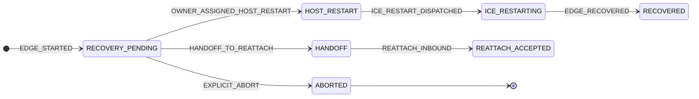

# ADR-0022: Recovery Completion Ownership & Reachability (ADR-CONF-004)

## Status

**Partial Accepted** (2026-07-10; **R28-H / R28-H.1 Accepted 2026-07-13**; **R28-H.2 Accepted 2026-07-13**; **R28-I Accepted 2026-07-14**; **R28-J Accepted 2026-07-20**; **R28-K Accepted 2026-07-21**; **R28-L Accepted 2026-07-21**; **R28-L.1.4 Accepted 2026-07-26**; **R28 Frozen 2026-07-26**; **Appendix C Accepted 2026-07-16**; **Appendix C-2 Accepted 2026-07-16**; **Appendix C-3.1 Accepted 2026-07-16**; **Appendix C-3.2 Accepted 2026-07-16**; **R28-M Draft 2026-07-25**; **R28-PRR Accepted 2026-07-26**) — **Accepted:** R27′-A/B, R28-D/D1 (gate), **R28-E/F/G** (P2-A completion re-evaluate seam, frozen `/grill-with-docs` 2026-07-10), **R28-H / R28-H.1** (Recovery Edge Obligation Lifetime + deadline / pending-decision single writer; soak `647484ef`; **scope per Obligation Episode — see R28-J**), **R28-H.2** (DISCONNECTED_DEBOUNCING reconnect clears suspicion without starting recovery), **R28-I** (WAITING ownership; soak `ea6466f1` M03→M02 participant edge), **R28-J** (Obligation Episode Generation within Edge Lifecycle; soak `obligation-p1-clean-20260720-125309` session `8f1bcfdc` M02→M01 **PASS**), **R28-K** (Recovery Capability vs Attempt Lifetime; soak `obs-matrix-ms1-20260721-120208` session `faaf8579` M-S1 second flap **motivation**), **R28-L** (Recovery Completion Ownership & Convergence; soak `obs-matrix-ms1-r28k-20260721-132235` session `f498ab74` M-S1 post-R28-K **motivation**), **R28-L.1.4** (Link Qualification Transport Repair; soak `obs-r28l1-4-repair-20260726-170329` G-L4-1 **PASS**; post-repair peer path gap documented), **R28-PRR** (Peer Reachability Re-establishment v1; frozen `/grill-with-docs` 2026-07-26; Case B motivation), **Appendix C** (Recovery Attempt Media Action Ownership; causal trace soak `103003` / `125859`), **Appendix C-2** (Deferred Media Action Ownership; soak `112433` **PASS**), **Appendix C-3.1** (Supersede Admission Closure; soak `114047` **PASS**), **Appendix C-3.2** (Recovery Fact Consumption; soak `120053` **PASS**). **R28 freeze (2026-07-26):** scope ends at **Recovery Architecture & Eligibility** (R28-A through R28-L.1.4); no further R28 feature slices. **R28-M** remains Draft (implementation seam), not freeze expansion. Next evolution line: **Peer Reachability Re-establishment (PRR)** — see § R28-PRR. **Accepted companion:** ADR-0024 R29-E (host prune eligibility consumes R28-H; does not redefine obligation). **Draft:** P2-B re-evaluate action decision tree, full S13 completion, **R28-M**. Complements ADR-0021 (R24–R26) and ADR-0023 (R29). **Recovery dispatch eligibility** — which facts may admit a recovery action — is defined in **[ADR-0032](./0032-recovery-dispatch-eligibility-contract.md)** (R28-N), not here; that ADR also corrects three code citations that misattribute the media-plane rule to `INV-REC-009`.

## Summary

S13-B soak proved `RECOVERY_REATTACH_SENT` with `peerReachable=true transportReady=true` does **not** imply host inbound — root cause is **boolean collapse** of orthogonal reachability layers, not missing recovery machinery.

This ADR freezes:

1. **Recovery Edge vs Recovery Attempt vs Obligation Episode** (edge obligation ≠ attempt terminal; R28-J episode scope)
2. **Completion ownership** (per-edge controller, not initiator module)
3. **Action authority + explicit completion decisions** (no decision vacuum)
4. **Two-axis reachability** (`ReachabilitySnapshot`, not linear chain)
5. **Presence projection boundary** (UI reads `ConferencePresenceProjection`, never `ReachabilitySnapshot`)
6. **Recovery Edge Obligation Lifetime** (R28-H: OPEN/CLOSED exclusive close set + observation window; attempt terminal ≠ obligation CLOSED; **scoped per Obligation Episode**)
7. **Obligation Episode Generation** (R28-J: Edge Lifecycle vs Obligation Episode; `obligationGeneration`; `OBLIGATION_CLOSED(RECOVERED)` ≠ edge termination)
8. **WAITING ownership** (R28-I: every WAITING state must name a next-action owner)
9. **Recovery Attempt Media Action Ownership** (Appendix C: attempt MUST resolve media action before silent `FAILED_MEDIA_RECOVERY`)
10. **Deferred Media Action Ownership** (Appendix C-2: `DEFERRED` retains owner; soak `112433` **PASS** — Accepted 2026-07-16)
11. **Recovery Fact Reconciliation** (Appendix C-3: C-3.1 supersede admission **PASS** soak `114047`; C-3.2 fact consumption **PASS** soak `120053`)
12. **Recovery Capability vs Attempt Lifetime** (R28-K: capability unavailable MUST NOT produce attempt failure; timers scoped to capability lifecycle; resume/supersede lineage; soak `obs-matrix-ms1-20260721-120208`)
13. **Recovery Completion Ownership & Convergence** (R28-L: completion fact layer; media ≠ edge recovered; REATTACH reject → reevaluate; rejoin lineage boundary; soak `obs-matrix-ms1-r28k-20260721-132235`)
14. **Recovery Architecture & Eligibility** (R28-L.1.1–L.1.4: link qualification → recovery eligibility gate → transport repair; terminal R28 feature slice)
15. **Recovery Episode Lifecycle Implementation** (R28-M **Draft**: post-`FAILED_MEDIA_RECOVERY` continuation; fact-driven re-evaluate; same-generation attempt supersede; unified lifecycle soak — **not** a new feature slice; **outside R28 freeze**; closes implementation gap between R28-E/F/G/H/J and C-3.2)

```text
ADR-0022 layering (normative roles):

  R28-H / R28-J     — What (episode + generation rules)
  R28-I / Appendix C — What (recovery actions + ownership)
  R28-L.1           — What (qualification + eligibility + repair; R28 freeze terminal)
  R28-O.x           — Observe (producer / projector / consumer trace evidence)
  R28-M             — How (post-FAILED continuation implementation; Draft, not freeze expansion)
  R28-PRR           — Peer reachability re-establishment (Accepted 2026-07-26)
  R28-N             — Dispatch eligibility (which facts may admit an action; → ADR-0032)
```

```text
ReachabilitySnapshot  →  Recovery Controller  →  EdgeRecoveryFacts
                                                      ↓
                              ConferenceRuntimeProjector  |  ConferencePresenceProjector
                                      ↓                 |           ↓
                              Runtime phase/UI          |    joined/connected/recoveringPeers
                                                          ↓
                                                         UI
```

## Context

### S13-B soak evidence (session `dc040181`, M02 host, M01 WiFi loss)

| Observation | Implication |
|-------------|-------------|
| M01 `RECOVERY_REATTACH_SENT` `peerReachable=true transportReady=true` | Local send success ≠ mesh delivery |
| M02 no `INBOUND` / no `RECOVERED` | `routeConverged=false` while authority view stale |
| M02 Meeting pill `roster=3` while `connected=1` | UI reads membership count, not presence projection |
| M01 SENT then M02 silent | **Decision vacuum** — no `WAITING(reason)` emitted |

Probe markers (`peerReachable`, `transportReady`) are **diagnostic only** until R28-D1 gates replace them.

### Architectural layers (extended)

```text
Conference Lifecycle           — ESTABLISHED / TERMINATED
Membership Authority           — JOINED / LEFT
Reachability fact writers      — Connectivity, Discovery, Signaling/Mesh, Conference Runtime
ConferenceEdgeRecoveryController — per-edge policy, ReachabilitySnapshot consumer, EdgeRecoveryFacts producer
ConferenceRuntimeProjector     — phase, bootstrap, degraded, authority (lifecycle/runtime)
ConferencePresenceProjector    — joinedCount, connectedCount, recoveringPeers (presence)
```

## Decision

### R28-A — Recovery Edge vs Recovery Attempt

A **Recovery Edge** is keyed `(sessionId, remoteModuleId)` and may span multiple **Recovery Attempts** (`attemptId`) and multiple **Obligation Episodes** (`obligationGeneration`; R28-J).

| Terminal scope | Allowed values |
|----------------|----------------|
| **Attempt** | `RECOVERED`, `CANCELLED`, `ATTEMPT_TIMEOUT`, `SUPERSEDED` |
| **Obligation episode** (R28-H) | `RECOVERED`, **`obligationDeadline exceeded`** |
| **Edge lifecycle** (R28-J) | Membership `LEFT(remoteModuleId)`, `CONFERENCE_TERMINATED`, local session teardown |

**`ATTEMPT_TIMEOUT` terminates the attempt, not the obligation episode.**

**`CLOSED(RECOVERED)` terminates the obligation episode, not the Edge Lifecycle (R28-J).**

When reachability improves after attempt terminal, the edge controller **MUST re-evaluate** completion. Re-evaluate **MAY** start a new attempt but **MUST NOT** be conflated with "must start next attempt."

Complements ADR-0021 R24 (Strategy A degraded residency); R28-A clarifies edge/attempt orthogonality R24 assumes.

### R28-B — Completion Ownership

**Owner** = per-edge **Conference Edge Recovery Controller** on **this device** for **this** `(sessionId, remoteModuleId)`.

| Concept | Meaning |
|---------|---------|
| **Completion Owner** | Controller maintaining re-evaluate obligation until **obligation episode** terminal (R28-H) or **Edge Lifecycle** end (R28-J) |
| **Preferred Recovery Initiator** | Role hint (`initiatesReattach`); **≠** lifetime owner |
| **Recovery Action Authority** | Which side **may invoke** role-allowed actions when reachable |

Exactly-one obligation episode is **active per edge per local controller** at a time, not "M01 or M02 owns the edge globally."

### R28-C — Action Authority & Explicit Decisions

**v1 capabilities** (minimum):

| Role | Allowed actions |
|------|-----------------|
| Preferred initiator (participant edge) | Dispatch `RECOVERY_REATTACH` |
| Authority (host) | Accept/reject reattach; bounded **media recovery actions** (not frozen to ICE restart only) |
| Both | **MUST NOT** mutate membership |

On every **re-evaluate** (including after reachability change, attempt terminal, or inbound timeout), controller **MUST** emit exactly one **Recovery Completion Decision**:

```text
1. role-allowed completion action
2. WAITING(reason)
3. SUPERSEDED(nextAttemptId)
4. CANCELLED(reason)
```

**Forbidden:** passive wait with no logged decision (S13-B vacuum: SENT → host silence).

#### WAITING(reason) taxonomy

**Connectivity waiting** — not eligible to run recovery protocol:

```text
WAITING_FOR_LINK
WAITING_FOR_DISCOVERY
WAITING_FOR_ROUTE
```

**Protocol waiting** — protocol started, not yet complete:

```text
WAITING_FOR_AUTHORITY
WAITING_FOR_INBOUND
WAITING_FOR_ACCEPT
```

Mapping from `EdgeReachabilitySnapshot` (R28-D): e.g. `!routeConverged` → `WAITING_FOR_ROUTE`, not `WAITING_FOR_AUTHORITY`.

### R28-D — Edge Reachability Facts (two-axis model)

Recovery Controller aggregates **read-only facts**; it **does not own** and **MUST NOT write back** them.

| Fact | Writer | Meaning |
|------|--------|---------|
| `linkReady` | Connectivity | Local network usable |
| `peerDiscovered` | Discovery | Remote module visible |
| `routeConverged` | Signaling / Mesh | Packets can enter routing domain |
| `authorityReachable` | Conference Runtime | Authority can serve conference semantics |

```kotlin
ReachabilitySnapshot(
    linkReady: Boolean,
    peerDiscovered: Boolean,
    routeConverged: Boolean,
    authorityReachable: Boolean,
)
```

**NOT a linear chain.** `authorityReachable` and `routeConverged` are **orthogonal axes**. Soak counterexample: `peerDiscovered=true`, stale `authorityReachable=true`, `routeConverged=false` → reattach sent, host receives nothing.

#### Gates

```text
canDispatchRecoverySignal(edge) :=
    linkReady && peerDiscovered && routeConverged

canCompleteRecovery(edge) :=
    canDispatchRecoverySignal(edge) && authorityReachable
```

Controller **MUST** evaluate dispatch against `canDispatchRecoverySignal` before sending recovery signals.

### R28-D1 — No Boolean Collapse

Recovery decisions **MUST NOT** depend on standalone booleans:

```text
peerReachable
transportReady
authorityReachable   (as sole gate)
```

Completion and dispatch gates **MUST** be evaluated against **`ReachabilitySnapshot`**.

Diagnostic probes (S13-B) may log legacy fields; they **MUST NOT** drive gating after R28 implementation.

### R28-E — Completion Re-evaluate Seam (P2-A)

#### Core invariant

```text
Media Edge Restored          — transport / ICE connectivity re-established (connectivity fact)
Obligation Episode Completed — controller closes current episode (e.g. `CLOSED(RECOVERED)`)
Edge Lifecycle Ended         — record removed; membership / conference / local teardown (R28-J)

Media Edge Restored MUST NOT imply Obligation Episode Completed.
Obligation Episode Completed MUST NOT imply Edge Lifecycle Ended (R28-J).
```

#### ICE restoration vs completion

When edge phase is **`RECOVERY_PENDING`** (or otherwise non-terminal per R28-F) and **control-plane has not started** for the current attempt:

```text
controlPlaneStarted := attempt has crossed accepted recovery control-plane decision
    (REATTACH_ACCEPTED, ICE_RESTARTING after accept)
    — NOT transport delivery (TRANSPORT_SENT / REMOTE_RECEIPT_ACKED / REATTACH_REQUESTED alone)
```

**ICE connectivity restoration MUST NOT directly transition the edge to `RECOVERED`.**

Instead, the controller **MUST**:

```text
1. record the media restoration fact (no phase shortcut)
2. emit RECOVERY_REEVALUATE
3. run completion evaluation (R28-C)
```

Only completion evaluation **MAY** produce: `RECOVERED`, `WAITING(reason)`, `SUPERSEDED(nextAttemptId)`, `CANCELLED(reason)`.

**Narrow exception:** when `controlPlaneStarted == true`, ICE CONNECTED **MAY** satisfy completion evaluation immediately and yield `RECOVERED`.

**Forbidden:**

```text
phase == REATTACH_REQUESTED → direct RECOVERED   (use controlPlaneStarted, not phase enumeration)
routeConverged → coordinator.resend()
ICE CONNECTED → auto REATTACH_REQUESTED
```

The re-evaluate **seam is identical for all edges** (host and participant). Role differences appear only in **evaluation output** (P2-B), not in which connectivity events invoke re-evaluate.

### R28-F — Attempt Terminal vs Edge Obligation

#### Definitions

| Term | Meaning |
|------|---------|
| **Attempt Terminal** | Current recovery attempt ends: `RECOVERED`, `FAILED_MEDIA_RECOVERY`, `CANCELLED`, `SUPERSEDED` |
| **Edge Obligation** | Completion owner maintains re-evaluate duty for the **current Obligation Episode** until episode terminal per R28-H (`RECOVERED`, `OBLIGATION_DEADLINE`, or lifecycle-ending close). **Not** synonymous with Edge Lifecycle (R28-J). |
| **Superseded Attempt** | Material capability change causes explicit abandonment of current attempt; new attempt receives new budget |

#### Rules

```text
attempt_timeout terminates the current attempt only.
It MUST NOT terminate the obligation episode.
```

**Phase model (v1 / P2-A):** `FAILED_MEDIA_RECOVERY` = **attempt terminal marker**; edge record **remains** in the controller map (R24-A degraded residency). P2-A deferred an explicit obligation state machine; **R28-H supersedes that deferral** and freezes `OPEN`/`CLOSED` lifetime + `obligationDeadline`.

When a **material** reachability transition occurs **after** attempt terminal (`FAILED_MEDIA_RECOVERY` record retained):

```text
controller MUST:
    1. emit RECOVERY_REEVALUATE
    2. perform completion evaluation

evaluation MAY produce:
    SUPERSEDED(nextAttemptId)   — not required on every transition
    WAITING(reason)
    CANCELLED(reason)
    RECOVERED
```

**Watchdog:**

```text
watchdog budget belongs to attempts, not to recovery edges.

RECOVERY_REEVALUATE  ≠ extend watchdog
RECOVERY_WAITING       ≠ pause watchdog
```

Before attempt timeout, watchdog **MUST** trigger **`RECOVERY_FINAL_EVALUATION`** (`reason=ATTEMPT_TIMEOUT`) — the last evaluation before attempt terminal — then transition to `FAILED_MEDIA_RECOVERY` if still non-success.

During `FAILED_MEDIA_RECOVERY`: ICE `DISCONNECTED`/`FAILED` **MUST NOT** auto-`beginRecovery` (anti attempt-storm). Coordinator-driven material transitions **MAY** invoke re-evaluate.

### R28-G — Capability Re-evaluation Contract

#### Ownership

```text
Materiality detection belongs to TalkbackCoordinator.

Fact writers MUST NOT invoke recovery evaluation directly.
```

Coordinator assembles `EdgeReachabilitySnapshot`, projects **`RecoveryCapabilitySignature`**, compares against per-edge last signature, and notifies the controller **only on material change**.

#### Recovery Capability Signature

A projection of `EdgeReachabilitySnapshot` capturing the **set of recovery actions currently permitted** — not raw connectivity booleans.

```kotlin
RecoveryCapabilitySignature(
    permittedActions: Set<RecoveryAction>,   // e.g. DISPATCH_REATTACH, COMPLETE_EDGE, …
    waitingReason: WaitingReason?           // current blocker for evaluation
)
```

**Material transition** ⇔ `permittedActions` or `waitingReason` changes.

`permittedActions` / `waitingReason` are **recovery-domain** projections. **`authorityReachable=true` does not imply `COMPLETE_EDGE ∈ permittedActions`** (e.g. `WAITING_FOR_INBOUND` while route and authority facts are true).

**Examples:**

| Scenario | Before | After | Material? |
|----------|--------|-------|-----------|
| Participant, route blocked | `{}`, `WAITING_FOR_ROUTE` | `{DISPATCH_REATTACH}`, `null` | ✅ |
| HELLO seq+1, peer already discovered | unchanged | unchanged | ❌ |
| Authority fact enables completion | `{DISPATCH_REATTACH}`, `WAITING_FOR_AUTHORITY` | `{DISPATCH_REATTACH, COMPLETE_EDGE}`, `null` | ✅ |
| Host, `WAITING_FOR_INBOUND`, route only restores | `{…}`, `WAITING_FOR_INBOUND` | unchanged | ❌ |

For **non-initiator edges**: route restoration alone **does not necessarily** constitute a material transition — only signature change counts.

#### Coordinator hooks (v1)

| Fact change | May change signature |
|-------------|-------------------|
| Mesh ICE state | route / dispatch capability |
| Channel readiness | link capability |
| Peer first callable (`0→1`) | discovery capability |
| **Conference authority reachability fact** flip | completion capability |

**Authority fact source:** domain fact (e.g. `isConferenceAuthorityReachable` / future `ConferenceAuthorityTracker`) — **NOT** `emitConferenceRuntimeProjection` itself. Runtime and Recovery projectors **both consume** the same authority fact; recovery **MUST NOT** read projection output.

**Explicit non-triggers:** per-HELLO refresh when peer already discovered; gossip timestamps; ICE `CHECKING` (v1 route = connected/completed only).

#### Observability (P2-A log contract)

| Marker | Role |
|--------|------|
| `RECOVERY_REEVALUATE` | Capability changed; controller awakened |
| `RECOVERY_FINAL_EVALUATION` | Watchdog expiry; last evaluation before attempt terminal |
| `RECOVERY_DECISION` | Evaluation output (P2-B enriches) |
| `RECOVERY_WAITING` | Explicit wait (protocol state, not debug noise) |

`RECOVERY_REEVALUATE` **SHOULD** log: `session`, `edge`, `attempt`, `trigger`, `capabilityBefore`, `capabilityAfter`, `controlPlaneStarted` — compact capability labels, not raw action-set dumps when avoidable.

**Forbidden in P2-A:** `routeConverged → resend()`; debounce material re-evaluate by default; extend watchdog on `WAITING`.

See `docs/audit/p2a-completion-re-evaluate-seam.md` (Accepted).

### R28-H — Recovery Edge Obligation Lifetime

**Rationale (R29 soak `647484ef`, 2026-07-13):** host M02 ran `FAILED_MEDIA_RECOVERY(M01)` → ~4s cleanup → `AUTHORITY_PRUNE`. Gate was `!isEdgeRecovering()` (attempt-scoped). `edgeObligationOpen()` already returned true for failed residency, but prune never consulted it, and no close/deadline existed — so either "prune immediately after attempt terminal" or (if blindly swapped to `edgeObligationOpen`) "never prune". R28-H freezes the missing middle lifecycle.

**Naming note:** R28-G remains **Capability Re-evaluation Contract**. This section is **R28-H**.

**Scope (R28-J, 2026-07-20):** R28-H defines OPEN / CLOSED / `obligationDeadline` for **one Obligation Episode** (`obligationGeneration`). An **Edge Lifecycle** (R28-J) may contain multiple sequential episodes. The no-reopen invariant applies **within** one episode only; a later recovery responsibility after a terminal episode outcome starts a **new** episode (new generation), not a reopen.

#### Lifecycles (R28-H scope + R28-J)

```text
RecoveryAttempt              — one recovery try (phase machine)
        │
        ▼
RecoveryEdgeObligation       — one obligation episode OPEN/CLOSED (THIS section; R28-J)
        │
        ▼
Edge Lifecycle               — continuous edge record existence (R28-J)
        │
        ▼
Membership Mutation (R29)    — who may prune / leave (ADR-0023; when = ADR-0024 R29-E)
```

| Lifecycle | Answers | Terminal meaning |
|-----------|---------|------------------|
| **RecoveryAttempt** | Did this try end? | End of attempt #N only |
| **RecoveryEdgeObligation** | Does Controller still own completion for **this episode**? | Episode CLOSED (`RECOVERED`, `OBLIGATION_DEADLINE`, or lifecycle-ending reason) |
| **Edge Lifecycle** | Does this observer still track this peer edge? | Record removed (`cancelEdge`) |
| **Membership** | Who may mutate roster? | Separate authority boundary (ADR-0023) |

They **MUST** remain independent. **MUST NOT** implicitly terminate each other except via the explicit close / removal rules below.

#### Attempt Terminal (unchanged scope; clarified non-derivations)

Attempt terminal values:

```text
RECOVERED
FAILED_MEDIA_RECOVERY
FAILED_REQUIRES_USER_ACTION
CANCELLED
SUPERSEDED
```

Attempt terminal **only** means: this attempt has ended.

**MUST NOT** derive from attempt terminal alone:

```text
membership mutation
prune eligible
edge obligation CLOSED
```

#### Obligation states

```text
OPEN
CLOSED
```

While **OPEN** (one episode), the edge record **MAY** host many attempts without closing the episode:

```text
Attempt#3 FAILED     →  obligation episode stays OPEN
Attempt#4 SUPERSEDED →  obligation episode stays OPEN
Attempt#5 FAILED     →  obligation episode stays OPEN
…
```

**There is no "reopen" within one episode.** While the episode stays OPEN, a material transition starts a **new Attempt**, not a reopen of the obligation. A later failure after episode CLOSED starts a **new episode** (R28-J), not a reopen.

#### Close Conditions (exclusive set per episode)

`RecoveryEdgeObligation` (current episode) **MUST** transition to **CLOSED** **only** when one of:

```text
1. RECOVERED                         — episode success (Edge Lifecycle MAY continue — R28-J)
2. membership committed LEFT(remote) — closes episode; Edge Lifecycle ends (record removed)
3. conference TERMINATED             — closes episode; Edge Lifecycle ends
4. obligationDeadline exceeded       — episode abandon (Edge Lifecycle MAY continue — R28-J)
```

**Episode vs lifecycle:** conditions 1 and 4 close the **episode only**. Conditions 2 and 3 close the episode **and** terminate the Edge Lifecycle.

**MUST NOT** close obligation:

```text
FAILED_MEDIA_RECOVERY
FAILED_REQUIRES_USER_ACTION
SUPERSEDED
CANCELLED   (attempt-scoped cancel ≠ obligation close unless it coincides with 2 or 3)
```

R28-A / R28-F close set is **extended** by condition 4 (`obligationDeadline`). Conditions 1–3 remain.

#### Observation Window (not sleep)

```text
obligationDeadline =
    attemptTerminalAt + observationWindow
```

`attemptTerminalAt` = wall-clock when the **current** attempt entered an attempt-terminal state that leaves obligation OPEN (typically `FAILED_MEDIA_RECOVERY` / `FAILED_REQUIRES_USER_ACTION`). A later SUPERSEDED → new attempt that again fails **resets** `attemptTerminalAt` to that new terminal instant (deadline follows the latest failed residency entry).

Observation Window duty is **not** "wait then prune".

It **accepts Reachability Material Transitions** and feeds re-evaluation (R28-G):

```text
Recovery Re-evaluation Triggers (examples):
  HELLO (when it changes capability signature)
  routeConverged flip
  authorityReachable flip
  RecoveryCapabilitySignature material change

≠ Obligation Close Triggers
```

Re-evaluation **MAY** start Attempt #N+1 while obligation remains **OPEN**.

Only when `now >= obligationDeadlineAt` **and** none of close conditions 1–3 have fired does condition 4 close the obligation.

#### R28-H.1 — Obligation Deadline Ownership

```text
ConferenceEdgeRecoveryController is the single writer of:

    obligationOpenedAt
    obligationDeadlineAt
    obligationClosedAt
    obligationCloseReason   // RECOVERED | MEMBERSHIP_LEFT | CONFERENCE_TERMINATED | OBLIGATION_DEADLINE
    hasPendingCompletionDecision
```

Membership / projector / prune / `cleanupUnhealthyConferenceSession` **MUST** consume these timestamps, close reason, and pending-decision flag **read-only**.

**Forbidden:** recomputing `obligationDeadline` (or equivalent grace) in coordinator prune paths, presence projectors, or mesh health cleanup. Dual writers recreate the soak failure class (`FAILED` → local cleanup clock → premature `AUTHORITY_PRUNE`).

**Forbidden:** deriving `hasPendingCompletionDecision` from HELLO silence, ICE CLOSED, or `route=false` outside the controller.

Controller **MUST** set `obligationDeadlineAt` when an attempt enters a failed-media residency that leaves obligation OPEN (`attemptTerminalAt + observationWindow`). Subsequent failed residency after SUPERSEDE **MAY** refresh `obligationDeadlineAt` (follows latest failed entry). Closing **MUST** stamp `obligationClosedAt` + `obligationCloseReason` exactly once per episode; a CLOSED episode **MUST NOT** reopen (R28-J: new failure after terminal episode outcome starts a new episode).

`hasPendingCompletionDecision` **MUST** be true while a completion evaluation / re-evaluate / supersede decision for that edge is in flight, and false only when the controller has emitted a settled completion decision (or the edge has no active evaluation). Membership **MUST NOT** invent this flag.

#### R28-H.2 — Debounce Suspicion Clear on ICE Reconnect

`DISCONNECTED_DEBOUNCING` is a **suspicion buffer**, not an attempt and not recovery ownership.

If ICE reconnects while the edge is still in `DISCONNECTED_DEBOUNCING`:

```text
MUST cancel debounce timer
MUST clear debouncing state → CONNECTED (HEALTHY)
MUST NOT start a recovery attempt
MUST NOT emit REATTACH
MUST NOT model the transition as RECOVERED
```

```text
DISCONNECTED_DEBOUNCING + ICE CONNECTED  →  HEALTHY
(not DISCONNECTED_DEBOUNCING → RECOVERED)
```

**Rationale:** leaving the debounce timer armed after media is already CONNECTED produces false `beginRecovery` / `REATTACH` and sticky `edgeRecovering` while topology is healthy — conflating suspicion with obligation/attempt lifecycles.

#### R28-J — Obligation Episode Generation

**Rationale (soak `obligation-p1-clean-20260720-125309`, 2026-07-20):** session `8f1bcfdc`, M02 host → M01: `CLOSED(RECOVERED)` at `obligationGen=1`, healthy gap, second WiFi loss → `RECOVERY_OBLIGATION_OPENED obligationGen=2` with `previousPhase=RECOVERED` / `pathway=NEW_OBLIGATION_EPISODE`; second `CLOSED(RECOVERED)` at `obligationGen=2`. Prior contaminated soak showed `GROUP_LEAVE` → `cancelEdge()` → `edges.remove()` erased history — not an episode-renewal failure. Frozen `/grill-with-docs` 2026-07-20.

R28-H governs **one recovery obligation episode**. R28-J governs **how many sequential episodes** may exist inside one Edge Lifecycle and when `obligationGeneration` advances.

##### Three lifecycles (orthogonal)

```text
Edge Lifecycle          — does this peer relationship still exist on this observer?
Obligation Episode      — one recovery-responsibility cycle (R28-H OPEN → CLOSED)
Recovery Attempt        — one bounded try inside an episode (R28-A / R28-F)
```

| Lifecycle | Identity (v1) | Answers |
|-----------|---------------|---------|
| **Edge Lifecycle** | Continuous `(sessionId, remoteModuleId)` edge record existence | Does this observer still track recovery for this peer in this session? |
| **Obligation Episode** | `obligationGeneration` within one Edge Lifecycle | Is this recovery-responsibility cycle open or closed? |
| **Recovery Attempt** | `attemptId` within one episode | How is this episode being executed right now? |

Edge Lifecycle persistence **does not** imply obligation continuity across episodes.

##### Edge Lifecycle Identity (v1)

In v1, an Edge Lifecycle is identified **implicitly** by the continuous existence of an edge recovery record keyed by `(sessionId, remoteModuleId)`. Removal of this record terminates the lifecycle. Recreating the record starts a new Edge Lifecycle.

**Termination (lifecycle ends; record removed):** only when the underlying peer relationship is **explicitly** ended:

1. **Membership termination** — member explicitly leaves; authority removes member; membership is no longer valid for this peer.
2. **Conference termination** — conference / session lifecycle ends.
3. **Local endpoint teardown** — local user explicitly hangs up; local session is intentionally destroyed.

**Invariant:** `OBLIGATION_CLOSED(*)` **MUST NOT** terminate an Edge Lifecycle. Recovery completion and temporary connectivity failures **MUST NOT** terminate an Edge Lifecycle.

v1 maps lifecycle termination to `cancelEdge()` → `edges.remove(key)` (implementation). ADR reason strings are non-normative; semantic categories above are normative.

##### Obligation Episode

An **Obligation Episode** is one recovery-responsibility cycle **inside** an active Edge Lifecycle. Each episode runs a full R28-H OPEN → attempts → terminal close arc.

`obligationGeneration` is monotonically increasing **within** the current Edge Lifecycle. It identifies the episode counter, **not** edge identity, remote membership version, or endpoint topology generation.

When a new Edge Lifecycle begins (record recreated after removal), `obligationGeneration` **MUST** start from its initial value (v1: `1`).

##### New episode admission (narrow rule)

A **new** Obligation Episode **MAY** be opened only when:

1. The previous episode within the **same** Edge Lifecycle reached a **terminal recovery outcome**, and
2. A subsequent edge failure requires new recovery responsibility.

**Allowed terminal outcomes that admit the next episode:**

```text
CLOSED(RECOVERED)
CLOSED(OBLIGATION_DEADLINE)
```

**MUST NOT** advance `obligationGeneration` (same episode continues):

```text
ATTEMPT_TIMEOUT
FAILED_MEDIA_RECOVERY
FAILED_REQUIRES_USER_ACTION
SUPERSEDED
REATTACH_REQUESTED
REATTACH_ACCEPTED
ICE_RESTARTING
DISCONNECTED_DEBOUNCING
```

Episode generation advances only across **completed recovery responsibilities**, never across attempts or intermediate failure states.

##### No-reopen rule (tightened)

Within one Obligation Episode: once CLOSED, that episode **MUST NOT** reopen.

A later recovery requirement after a terminal episode outcome **MUST** start a **new** Obligation Episode with `obligationGeneration + 1`. This is **not** a reopen.

##### Non-goals (R28-J)

R28-J **does not** define:

- recovery lineage across removed edge records (`cancelEdge` is an identity boundary);
- whether rejoin after explicit leave should inherit prior edge history;
- obligation continuity after transient membership loss or endpoint / module topology migration.

Those belong to a future ADR (e.g. detached edge / rejoin lineage), not R28-J.

#### R28-I — WAITING Ownership

**Rationale (soak `ea6466f1`, 2026-07-14):** participant M03 observed M02 `ICE_RESTORED` + `mediaRestored=true` while `controlPlaneStarted=false`. Controller logged `decision=WAITING rejectReason=control_plane_not_started` and **returned with no next-action owner** — obligation stayed OPEN, presence stuck (`recoveringPeers` / `mediaUnavailablePeers`), until watchdog timeout or `OBLIGATION_DEADLINE`. WAITING was treated as a terminal parking lot, not a owned intermediate state.

A recovery attempt **MAY** enter a **WAITING** state only if an **explicit next-action owner** exists.

**Valid owners:**

```text
inbound control-plane message
route convergence callback
watchdog timeout
recovery reevaluation
```

A recovery attempt **MUST NOT** remain in WAITING without an owner capable of advancing or terminating the obligation.

**Normative log markers (implementation):**

```text
RECOVERY_CONTROL_PLANE_REQUIRED   — media restored; control-plane continuation scheduled
RECOVERY_CONTROL_PLANE_BOUNDARY   — cross control-plane without transport flap (ICE_RESTART_ONLY + ICE CONNECTED)
decision=WAIT_FOR_CONTROL_PLANE   — owned wait; watchdog / reevaluate owns exit
```

**Forbidden:**

```kotlin
onLog("decision=WAITING rejectReason=xxx_not_started")
return   // no owner scheduled
```

Review question for any new WAITING: **who is responsible for pulling this attempt out of WAITING?**

恢复 attempt 可以进入 WAITING，但必须显式声明下一步动作的 owner。

合法 owner：

- 入站 control-plane
- route 收敛回调
- watchdog 超时
- recovery reevaluate

禁止出现没有 owner 的 WAITING。

#### API contract (normative direction)

Prune / membership eligibility consumers **MUST** consult obligation, not attempt phase helpers:

```kotlin
fun edgeObligationOpen(sessionId, remote): Boolean
fun edgeObligationClosed(sessionId, remote): Boolean
fun obligationDeadlineAt(sessionId, remote): Long?
fun obligationCloseReason(sessionId, remote): ObligationCloseReason?
fun hasPendingCompletionDecision(sessionId, remote): Boolean
```

**Non-normative for prune:**

```kotlin
isEdgeRecovering()          // Attempt phase only
isFailedMediaRecovery()     // Attempt residency marker only
isActivelyRecovering()      // Attempt phase only
```

Existing `EdgeRecoveryRecord.edgeObligationOpen()` (phase actively recovering **or** failed-media residency) is a **partial** open predicate for P2-A. R28-H requires it to become a true **per-episode** lifetime API: OPEN until exclusive close set; expose CLOSED; honor `obligationDeadlineAt` owned solely by the controller. Edge Lifecycle may continue after episode CLOSED(RECOVERED) (R28-J).

#### Boundary with Membership (ADR-0024 R29-E)

```text
ADR-0022 R28-H  →  when the current obligation episode ends (episode CLOSED)
ADR-0022 R28-J  →  when the Edge Lifecycle ends (record removed)
ADR-0024 R29-E  →  after episode CLOSED (and deadline rules), when Membership MAY mutate (prune eligibility)
```

R28-H **MUST NOT** define `canAuthorityPrune`. It only freezes obligation CLOSED as a **necessary** recovery-domain input for that future contract.

#### Soak counterexample this freezes

```text
11:18:01  FAILED_MEDIA_RECOVERY(M01)     — attempt terminal; obligation MUST stay OPEN
11:18:05  AUTHORITY_PRUNE(M01)           — illegal relative to R28-H: obligation not CLOSED
11:18:22  HELLO from M01                 — would have been re-eval trigger inside observation window
```

### R27′-A — Presence Projection Boundary

UI **MUST** consume **`ConferencePresenceProjection`** (and runtime phase from `ConferenceRuntimeProjector` where needed).

**`ReachabilitySnapshot` is recovery-internal** and **MUST NOT** surface to UI or ViewModel.

**Forbidden in UI/ViewModel:**

```kotlin
if (routeConverged && authorityReachable) { showRecovering() }
```

ViewModel **MUST NOT** reconstruct presence from `memberKeys.size`, ICE, or transport callbacks.

### R27′-B — Presence Projection Ownership

```kotlin
data class ConferencePresenceProjection(
    val joinedCount: Int,
    val connectedCount: Int,
    val recoveringPeers: Set<String>,  // ModuleId
)
```

**Producer:** dedicated **`ConferencePresenceProjector`**, sibling to `ConferenceRuntimeProjector`.

Both projectors consume the same read-only facts:

```text
MembershipRoster
EdgeRecoveryFacts
ConnectedPeers
AuthorityState (as needed for connected semantics)
```

**MUST NOT** extend `ConferenceRuntimeProjector.Output` with presence fields — prevents runtime DTO bloat (`suspectPeers`, `speakerPeers`, etc. belong on presence plane).

`recoveringPeers` **MUST** derive from **`EdgeRecoveryFacts` per `remoteModuleId`**, not ICE state or HELLO alone.

#### Semantic split (frozen)

```text
Reachability  → Recovery domain
Phase         → Runtime domain
Who is in / connected / recovering → Presence domain
```

## Relationship to ADR-0021

| ADR-0021 | ADR-0022 |
|----------|----------|
| R24 completion ownership after `attempt_timeout` | R28-A/B/C formalize edge vs attempt, re-evaluate, explicit decisions |
| R5 recovery ownership during attempt | R28-B separates owner vs initiator vs action authority |
| R16 EdgeRecoveryFacts → RuntimeProjector | R27′ adds PresenceProjector consumer |
| S13-B probe (in flight) | R28-D/D1 replace bool gates; probes remain audit-only |

R24 Strategy A (degraded residency) **remains v1 default**; R28 does not authorize Strategy B handoff.

## Consequences

- **Positive:** Soak failures become classifiable (`WAITING_FOR_ROUTE` vs `WAITING_FOR_AUTHORITY`); UI decouples from recovery internals; RuntimeProjector stops growing presence fields.
- **Positive (R28-H):** Attempt terminal no longer silently collapses into prune eligibility; host can observe HELLO/route inside `observationWindow` without prematurely closing recovery ownership; `obligationDeadline` prevents permanent joined=3 stuck conferences.
- **Negative:** Two projectors to keep in sync on shared facts; ReachabilitySnapshot wiring is new work (#73-B implementation).
- **Negative (R28-H):** Controller must track `attemptTerminalAt` / `obligationDeadline` and expose OPEN/CLOSED APIs; prune gate (ADR-0024) must migrate off `isEdgeRecovering`.
- **Neutral:** S13-B probe markers stay until gate implementation; Meeting pill fix is R27′ (can ship before R28 behavior fix).
- **Neutral (R28-H):** Does not authorize prune; ADR-0024 R29-E remains required before host post-terminal membership mutation changes.

## Implementation notes (non-normative)

1. **P0 docs:** this ADR + audit cross-links (`s13b-recovery-reattach-reachability.md`, `ro-m3-recovery-write-matrix.md`).
2. **P1 R27′ (implemented 2026-07-10):** `ConferencePresenceProjector` + `TalkbackSessionSnapshot.conferencePresenceProjection`; Meeting pill reads `connectedCount` / `recoveringPeers` — not roster size.
3. **P1 R28 reachability (implemented 2026-07-10):** `EdgeReachabilitySnapshot` gates `dispatchRecoveryReattachOutcome`; `DEFERRED` → `RECOVERY_PENDING` + `RECOVERY_WAITING(reason)`; v1 `routeConverged = qosMonitor.isGroupConnected(remoteModuleId)`. Soak G-R28-D PASS (`logs-s13b-reattach-reachability-20260710-161257`): no `RECOVERY_REATTACH_SENT` while `routeConverged=false`.
4. **P2-A re-evaluate seam (frozen 2026-07-10):** R28-E/F/G — Coordinator-owned `RecoveryCapabilitySignature`; `RECOVERY_REEVALUATE` / `RECOVERY_FINAL_EVALUATION`; `FAILED_MEDIA_RECOVERY` record retained; material transition → MUST re-evaluate, MAY SUPERSEDE. See grill: `p2a-completion-re-evaluate-seam.md`.
5. **R28-H obligation lifetime (frozen 2026-07-13):** OPEN/CLOSED exclusive close set + `obligationDeadline`; no reopen **within one episode** (R28-J); prune consumers must use `edgeObligationClosed()` — implementation pending; `observationWindow` value TBD at impl (soak showed ~4s too short vs ~20s WiFi restore).
6. **R28-J obligation episode generation (implemented 2026-07-20):** `obligationGeneration` on `EdgeRecoveryRecord`; `needsNewObligationEpisode()` / `openNewRecoveryObligation()`; watchdog binds generation. Soak **PASS** `obligation-p1-clean-20260720-125309` (session `8f1bcfdc`, M02→M01 gen=1→gen=2).
7. **P2-B re-evaluate actions:** decision tree for `permittedActions` → dispatch / ICE restart / `WAITING_FOR_INBOUND` / SUPERSEDE — not frozen in P2-A.
8. **P2 cleanup:** retire probe-only bools from decision paths; S13→E matrix update in write matrix.
9. **ADR-0024 R29-E (not this ADR):** host post-terminal prune eligibility after obligation CLOSED.

## Soak gates (future)

| Gate | Pass criterion | Status |
|------|----------------|--------|
| G-R28-D | WiFi loss: `RECOVERY_WAITING` / `RECOVERY_REATTACH_DEFERRED` with `WAITING_FOR_ROUTE` **before** any `RECOVERY_REATTACH_SENT` when `!routeConverged` | **PASS** `logs-s13b-…-161257` |
| G-R27′ | Meeting pill shows `joinedCount` / `connectedCount` / per-peer recovering consistent with host logs | PASS (prior soak) |
| G-R28-C | No interval where edge is non-terminal and no completion decision for > debounce | **PASS via G-P2-A1/A2** (continuation liveness; was FAIL → P2-A) |
| G-P2-A1 | When `RecoveryCapabilitySignature` changes materially, the recovery controller **MUST** evaluate again within the allowed debounce window. Evidence: `RECOVERY_REEVALUATE` **or** `RECOVERY_DECISION` **or** `RECOVERY_WAITING`. (Continuation liveness only — does **not** require `REATTACH_SENT` / `RECOVERED`.) | **PASS** UT `failedMediaRecovery_materialTransition_emitsReevaluate` + `deferredReattach_iceConnected_blocked_emitsReevaluateOnCapabilityChange` + IT `conferenceR28H2_materialReevalKeepsObligationOpenWithoutPrune`. Material change wakes evaluation inside debounce; may still end WAITING / SUPERSEDE / no dispatch |
| G-P2-A2 | No material capability transition may remain unevaluated until attempt timeout or obligation deadline | **PASS** same suite + UT `capability_participant_routeBlocked_thenConverged_isMaterial` (signature materiality) + H2 IT: route restore after `FAILED_MEDIA_RECOVERY` emits `RECOVERY_REEVALUATE` **before** deadline/timeout silence. Proves continuation seam, not recovery success |
| G-P2-A3 | May still have no `RECOVERY_REATTACH_SENT` (actions = P2-B) | Pending |
| G-S13-E | `RECOVERY_EDGE_RECOVERED` or explicit protocol terminal after WiFi restore | Pending → P2-B |
| G-R28-H1 | After `FAILED_MEDIA_RECOVERY`: obligation stays OPEN; no `AUTHORITY_PRUNE` until CLOSED | **PASS** UT `obligationFacts_stayOpenAfterFailedMediaRecovery` + IT `conferenceR29E_hostMayAuthorityPruneAfterObligationDeadline` (pre-deadline: no prune). Evidence: `ConferenceEdgeRecoveryController` is the single writer of obligation lifecycle (`openedAt` / `deadlineAt` / `closedAt` / `closeReason`); cleanup and prune paths consume facts only |
| G-R28-H2 | Material transition inside observation window → `RECOVERY_REEVALUATE` / new attempt; obligation still OPEN | **PASS** UT `failedMediaRecovery_materialTransition_emitsReevaluate` + IT `conferenceR28H2_materialReevalKeepsObligationOpenWithoutPrune` (also covers G-R29-E2 no prune) |
| G-R28-H3 | Permanent offline past `obligationDeadline` → obligation CLOSED (enables later R29-E prune) | **PASS** UT `obligationDeadline_pastWindow_closesWithObligationDeadline` + IT `conferenceR29E_hostMayAuthorityPruneAfterObligationDeadline`. Evidence: `FAILED_MEDIA_RECOVERY` keeps obligation OPEN until `obligationDeadline`; deadline expiration closes with `closeReason=OBLIGATION_DEADLINE` and unlocks R29-E prune eligibility |
| G-R28-J1 | Same Edge Lifecycle: `CLOSED(RECOVERED)` at gen=N, healthy gap, second disconnect → `RECOVERY_OBLIGATION_OPENED` gen=N+1, `pathway=NEW_OBLIGATION_EPISODE`, second `CLOSED(RECOVERED)`; no `member_left` / `cancelEdge` between rounds | **PASS** `obligation-p1-clean-20260720-125309` session `8f1bcfdc` M02 host → M01 |

## Conference transmit barrier scope — closed by ADR-0026 (2026-07-14)

**Open question:** Should conference recovery block unrelated participant transmit?

**Resolution:** **Closed by ADR-0026.** Conference transmit barriers are **edge-scoped**. Remote edge recovery / obligation OPEN MUST NOT block local capture when another publish path remains healthy. See `docs/adr/0026-conference-media-transmit-barrier-scope.md`.

**Device evidence:** Soak3 session `df7a5404` (2026-07-14) — M02 WiFi loss; M01↔M03 audio continued; no `CONFERENCE_WIDE` `stop_capture` on healthy peers.

**Observability:** `CONFERENCE_BARRIER_SNAPSHOT` logs `policy=EDGE_SCOPED`, `canPublish`, peer recovery telemetry (`recovering`, `obligationOpen`, `failed`) — peer fields are diagnostic only.

## P0-a — GROUP transition readiness observation (2026-07-15)

**Problem (revised):** `MEETING_END` governance transition exists, but terminal predicate is **local** (`membershipReconciled` + `transmitMissingPeers` empty). It does not model receive-capability attach or cross-node session identity convergence. Post-meeting PTT failures with healthy floor control are therefore a **transition/readiness false-positive** class, not PTT/Floor bugs.

**Instrumentation (observation only — no gate/mesh/floor/playback behavior changes):**

| Marker | Purpose |
|--------|---------|
| `MEETING_END_BEGIN` | Transition start + session identity at teardown |
| `GROUP_TRANSITION_READINESS_SNAPSHOT` | Local readiness + identity + bootstrap state |
| `BOOTSTRAP_ATTEMPT` | Bootstrap churn counter (`waitingForPrimary`, `attemptId`) |
| `TRANSITION_TERMINAL_READY` | Local transition terminal timing |

**Key fields:** `sessionTraceId`, `localSessionId`, `initiatorModuleId`, `anchorModuleId`, `floorAuthorityModuleId`, `resolvedBootstrapPrimaryModuleId`, `orphanBelief` (belief only — not ground truth).

**Receive sampling:** only when `floorAuthorityModuleId != null` and a remote floor holder exists; records `HOLDER_AUDIO_UNREACHABLE`, not idle `NO_FLOOR_OWNER`.

**Soak:** `scripts/soak-p0a-group-transition.ps1` — host end → PTT at t+0/5/10/15s; Layer 1 reports `transitionDurationMs`, `bootstrapAttemptCount`, `orphanBeliefDurationMs`. Layer 2 (`correlateBySessionTraceId`) deferred until device data.

**Open questions for P0-a data:**

1. Does `terminalReady=true` coincide with `orphanBelief=true` on participants?
2. How many `BOOTSTRAP_ATTEMPT` per `MEETING_END`?

## Appendix C — Recovery Attempt Media Action Ownership (frozen 2026-07-16)

**Also cited as:** ADR-0022-C — Recovery Attempt Closure Contract.

### Problem statement (revised)

P2-A (R28-E/F/G) froze **completion re-evaluate** after attempt terminal or material capability change. Causal trace soak (`MEDIA RECOVERY CAUSAL TRACE`, stamp `20260716-103003` / `20260715-125859`) proved a **prior** gap:

```text
Recovery ownership          Media action ownership       Signaling / ICE        Completion
        |                            |                        |                    |
RECOVERY_EDGE_STARTED                  X                        ?                    ?
        |                            |                        |                    |
   (implicit wait)              no dispatch              passive ICE?          timeout → FAILED
```

**Appendix C freezes the media-action layer.** It does **not** redefine P2-A completion re-evaluate, membership (ADR-0023), floor, playback, GROUP bootstrap (P2-0), or UI projection (R27′).

### Layer model

```text
1. Recovery attempt opened     — RECOVERY_EDGE_STARTED / RECOVERY_ATTEMPT_OPENED
2. Media action ownership      — Appendix C (this section)
3. Signaling + ICE transport   — MEDIA_SIGNAL_* / MEDIA_ICE_* / ICE state
4. Completion evaluation       — P2-A / R28-E/F/G
5. Edge obligation closure     — R28-H
```

An attempt that reaches layer 4 without resolving layer 2 is **architecturally incomplete**, regardless of whether ICE later moves on its own.

### C-1 — Recovery attempt MUST bind a media action owner

After `RECOVERY_EDGE_STARTED` (or equivalent `beginRecovery` terminal for the attempt), the controller **MUST** within the attempt budget assign exactly one of:

| Outcome | Evidence marker (v1) | Meaning |
|---------|----------------------|---------|
| **A. Host media restart** | `RECOVERY_ICE_RESTART_DISPATCHED` | Host owns `createOffer(iceRestart=true)` for this `(session, remote, attempt)` |
| **B. Reattach handoff** | `RECOVERY_HANDOFF_TO_REATTACH` | Attempt explicitly delegates to inbound reattach / `REATTACH_ACCEPTED` path |
| **C. Explicit abort** | `EXPLICIT_RECOVERY_ABORT(reason=…)` | Attempt ends with stated reason; no silent expiry |

**Forbidden:**

```text
RECOVERY_EDGE_STARTED
        → (no A/B/C)
        → ATTEMPT_TIMEOUT
        → FAILED_MEDIA_RECOVERY
```

This pattern **MUST NOT** occur without an intervening media-action decision. Observation of transport (ICE CHECKING, passive candidate) is **not** a media action assignment.

**Rationale (soak `125859`, M02 host, M03 WiFi):** attempt=2 had `RECOVERY_EDGE_STARTED`, never `RECOVERY_ICE_RESTART_DISPATCHED`, then `FAILED_MEDIA_RECOVERY`. Causal chain broke at layer 2.

#### C-1.1 — Media action owner priority (no competing owners)

`EDGE_STARTED` **MUST NOT** leave two media-action paths racing on the same attempt.

**Priority (highest wins; lower paths MUST defer or supersede):**

| Priority | Rule |
|----------|------|
| 1 | **Existing valid media action owner continues** — once `RECOVERY_MEDIA_OWNER_ASSIGNED` is emitted for attempt *N*, no second owner on *N* |
| 2 | **Explicit handoff supersedes passive attempt** — `RECOVERY_HANDOFF_TO_REATTACH` / inbound `REATTACH_ACCEPTED` **MAY** supersede attempt *N* → *N+1*; attempt *N* MUST NOT also dispatch restart |
| 3 | **Abort only when no valid owner exists** — `EXPLICIT_RECOVERY_ABORT` only after deadline without A or B |

**Forbidden race:**

```text
attempt=2  EDGE_STARTED
    +  host ICE_RESTART_DISPATCHED
    +  participant REATTACH_INBOUND (same attempt, no supersede)
```

**Normative assignment marker:**

```text
RECOVERY_MEDIA_OWNER_ASSIGNED
    session=…
    remote=…
    attempt=N
    owner=HOST_RESTART | PARTICIPANT_REATTACH | ABORTED
    recoveryOwnerModuleId=<local module that owns recovery decision>
    mediaActionOwnerModuleId=<module that will execute signaling restart>
    parentAttempt=<optional, when owner follows handoff>
```

Examples:

```text
RECOVERY_MEDIA_OWNER_ASSIGNED owner=HOST_RESTART attempt=2 recoveryOwnerModuleId=M02 mediaActionOwnerModuleId=M02

RECOVERY_MEDIA_OWNER_ASSIGNED owner=PARTICIPANT_REATTACH attempt=3 parentAttempt=2
    recoveryOwnerModuleId=M02 mediaActionOwnerModuleId=M03 supersededByModule=M03
```

`RECOVERY_ICE_RESTART_DISPATCHED` and `RECOVERY_HANDOFF_TO_REATTACH` **imply** `RECOVERY_MEDIA_OWNER_ASSIGNED` but **MUST** remain separate markers for causal trace.

### C-2 — `ICE_RESTART_ONLY` MUST mean recovery authority owns restart dispatch

Policy `ICE_RESTART_ONLY` **MUST NOT** be implemented as passive observation of the remote peer's transport recovery.

**Terminology (do not conflate):**

| Field | Meaning |
|-------|---------|
| `conferenceHostModuleId` | Conference lifecycle / invite authority |
| `recoveryOwnerModuleId` | Module whose edge controller owns the **recovery attempt** decision on **this device** |
| `mediaActionOwnerModuleId` | Module that **executes** signaling restart (may differ after handoff) |

```text
ICE_RESTART_ONLY  :=  recovery authority on this device MUST assign media action owner (C-1)
                      and dispatch restart (A) OR explicit handoff (B)
                      within attempt budget
```

**MUST NOT** alias `recoveryOwnerModuleId` to `conferenceHostModuleId`. GROUP / unicast recovery **MUST** use the same ownership fields without conference-host coupling.

If the recovery authority only watches ICE/candidate facts without assigning owner, the mode is **passive observation** — not recovery ownership.

**Rationale (soak `103003`):** attempt=2 received `MEDIA_SIGNAL_CANDIDATE_RECEIVED` and ICE CONNECTED while host never dispatched restart. Participant transport recovered **without** host media action closure on attempt=2.

### C-3 — Participant reattach is fallback, not primary closure

Successful soak path (`103003`):

```text
attempt=2  EDGE_STARTED, no dispatch
      →  M03 RECOVERY_REATTACH_INBOUND
      →  SUPERSEDE attempt=3
      →  RECOVERY_ICE_RESTART_DISPATCHED (attempt=3)
      →  RECOVERY_EDGE_RECOVERED
```

This path **MAY** recover the conference but **MUST NOT** be the only closure mechanism for host-owned attempts.

| WiFi timing | Risk if reattach is primary |
|-------------|----------------------------|
| Fast | Participant reattach masks missing host dispatch |
| Slow | No reattach inbound before timeout → `FAILED_MEDIA_RECOVERY` while membership stays JOINED |

**Normative:** Primary owner for host `ICE_RESTART_ONLY` is **A** (dispatch). **B** (reattach handoff) is permitted when dispatch preconditions fail, but **MUST** be explicit (`RECOVERY_HANDOFF_TO_REATTACH`), not accidental via timeout silence.

### C-4 — Attempt supersede MUST name reason and causal relation

When attempt *N* is abandoned for attempt *N+1*, logs **MUST** include:

```text
RECOVERY_ATTEMPT_SUPERSEDED
    session=…
    sessionTraceId=…
    remote=…
    oldAttempt=N
    newAttempt=N+1
    reason=<PARTICIPANT_REATTACH | MATERIAL_CAPABILITY | PEER_DISCOVERED | …>
    supersededByModule=<module that triggered supersede, if remote>
    parentAttempt=N
    parentSessionTraceId=<session trace at supersede time>
```

**Causal question answered:** why may attempt *N+1* legally cover attempt *N*?

Forbidden ambiguity:

```text
attempt=2 FAILED_MEDIA_RECOVERY
attempt=3 RECOVERED
```

without supersede record linking `oldAttempt`, `reason`, and `supersededByModule`.

v1 supersede reasons observed in soak:

| reason | Trigger |
|--------|---------|
| `PARTICIPANT_REATTACH` | `RECOVERY_REATTACH_INBOUND` / `REATTACH_ACCEPTED` |
| `PEER_DISCOVERED` | Discovery / HELLO material transition (R28-H2) |
| `MATERIAL_CAPABILITY` | `RecoveryCapabilitySignature` change |

### C-5 — Acceptance: causal invariants, not UI

**PASS** (successful edge recovery) requires, for the recovering attempt lineage:

```text
RECOVERY_EDGE_STARTED
    → MEDIA_ACTION_OWNER_ASSIGNED     (A or B from C-1)
    → (signaling + ICE — MEDIA_SIGNAL_* / ICE CONNECTED)
    → RECOVERY_EDGE_RECOVERED
```

`MEDIA_ACTION_OWNER_ASSIGNED` evidence (any one):

- `RECOVERY_MEDIA_OWNER_ASSIGNED` with `owner=HOST_RESTART` and matching `attempt=`
- `RECOVERY_MEDIA_OWNER_ASSIGNED` with `owner=PARTICIPANT_REATTACH`, `parentAttempt=`, and supersede record
- `EXPLICIT_RECOVERY_ABORT` with reason (replaces silent `FAILED_MEDIA_RECOVERY` when no owner assigned)

**FAIL** (Appendix C violation):

```text
RECOVERY_EDGE_STARTED
    + FAILED_MEDIA_RECOVERY
    + no RECOVERY_ICE_RESTART_DISPATCHED
    + no RECOVERY_HANDOFF_TO_REATTACH
    + no EXPLICIT_RECOVERY_ABORT
```

for the same `(session, remote, attempt)`.

UI (`connected=3`, pill hints) is **diagnostic only**; gates **MUST** use causal trace + recovery markers.

### Observability contract (v1)

Correlation keys (see `MediaRecoveryCausalTrace`):

```text
session, sessionTraceId, scope, remote, attempt,
conferenceGeneration, pcGeneration, transportGeneration
```

Minimum chain for host edge audit:

```text
RECOVERY_EDGE_STARTED attempt=N
    → RECOVERY_ICE_RESTART_DISPATCHED attempt=N   (or HANDOFF)
    → MEDIA_SIGNAL_OFFER_SENT attempt=N
    → MEDIA_ICE_CANDIDATE_* attempt=N
    → RECOVERY_EDGE_RECOVERED attempt=N′          (N′ may supersede N)
```

### Relationship to P2-A / P2-B

| Topic | Owner |
|-------|-------|
| Media action ownership (this Appendix) | **Appendix C** — implement before relying on completion fixes |
| Completion re-evaluate after material change | P2-A (R28-E/F/G) — layer 4 |
| Action decision tree (`DISPATCH_REATTACH`, `WAIT_FOR_INBOUND`, …) | P2-B — draft |
| Post-terminal `FAILED` + late transport | P2-A grace / completion window — **downstream** of C-1; does not excuse missing dispatch at `EDGE_STARTED` |

### Out of scope (explicit)

- Floor routing, playback, membership mutation (ADR-0023), P2-0 canonical lineage, UI projection rules.

### Freeze sentence

> **A recovery attempt is not a recovery completion candidate until its media action ownership is resolved. An attempt that observes transport changes without owning or delegating a media recovery action MUST NOT silently expire into `FAILED_MEDIA_RECOVERY`.**

### Soak gates (Appendix C)

| Gate | Pass criterion | Status |
|------|----------------|--------|
| G-C-1 | **Forbidden:** `RECOVERY_EDGE_STARTED` + deadline expired + **no** `RECOVERY_MEDIA_OWNER_ASSIGNED` (must be `EXPLICIT_RECOVERY_ABORT`, not silent `FAILED_MEDIA_RECOVERY`) | **FAIL** `125859`; partial **PASS** `103003` (handoff on attempt=3) |
| G-C-2 | **Required:** `EDGE_STARTED` → `MEDIA_ACTION_OWNER_ASSIGNED` → signaling/ICE → `EDGE_RECOVERED` | **PASS** `103003` |
| G-C-3 | **Handoff allowed:** attempt=N → participant reattach → `SUPERSEDE(reason)` → attempt=N+1 → `MEDIA_ACTION_OWNER_ASSIGNED` | **PASS** `103003` |
| G-C-4 | Causal trace: `attempt` threads recovery → dispatch → signaling | **PASS** (instrumentation 2026-07-16) |

### Implementation sequence (non-normative; frozen order)

1. **Patch 1 — C-1 contract:** `EDGE_STARTED` → `MEDIA_ACTION_PENDING`; deadline without owner → `EXPLICIT_RECOVERY_ABORT(NO_MEDIA_ACTION_OWNER)`, not silent `FAILED_MEDIA_RECOVERY`.
2. **Patch 2 — Restart dispatch:** `ICE_RESTART_ONLY` path assigns `owner=HOST_RESTART` and emits `RECOVERY_ICE_RESTART_DISPATCHED` (fixes `125859` class).
3. **Patch 3 — Explicit handoff:** participant reattach remains; becomes `RECOVERY_HANDOFF_TO_REATTACH` + supersede, not implicit rescue.

**Explicitly deferred:** longer timeout, blind retry, membership/floor/playback/UI changes.

### Patch design — C-1 vs existing FSM (non-normative)

**Do not duplicate the recovery FSM.** Insert a **media-action sub-state** on the existing attempt, not a parallel controller.

#### Existing `EdgeRecoveryPhase` (today)

```text
DISCONNECTED_DEBOUNCING → RECOVERY_PENDING → [REATTACH_* | ICE_RESTARTING] → RECOVERED
                                              ↘ FAILED_MEDIA_RECOVERY (watchdog)
```

**Gap (code):** `beginRecovery(initiatesReattach=false)` sets `RECOVERY_PENDING`, schedules watchdog, **never** calls `issueBoundedIceRestart`. Restart only from `REATTACH_ACCEPTED` or `continueControlPlaneRecoveryAfterMediaRestored` (ICE_RESTORED path).

#### Proposed insertion (Appendix C)

Add **logical** sub-state on `EdgeRecoveryRecord` (not necessarily new `EdgeRecoveryPhase` enum value in v1):

```text
mediaActionOwner: UNASSIGNED | PENDING | HOST_RESTART | HANDOFF_REATTACH | ABORTED
```

| Existing phase | New sub-state | Trigger |
|----------------|---------------|---------|
| `RECOVERY_PENDING` | `UNASSIGNED` → `PENDING` | `RECOVERY_EDGE_STARTED` |
| `RECOVERY_PENDING` | `PENDING` → `HOST_RESTART` | `issueBoundedIceRestart` success → `RECOVERY_MEDIA_OWNER_ASSIGNED` |
| `RECOVERY_PENDING` | `PENDING` → `HANDOFF_REATTACH` | `RECOVERY_HANDOFF_TO_REATTACH` / inbound reattach |
| `RECOVERY_PENDING` | `PENDING` → `ABORTED` | watchdog, no owner → `EXPLICIT_RECOVERY_ABORT` |
| `ICE_RESTARTING` | `HOST_RESTART` | already dispatched |
| `REATTACH_ACCEPTED` | `HOST_RESTART` or `HANDOFF` | per C-1.1 priority |

**Patch 2 minimal hook:** end of `beginRecovery`, when `policy=ICE_RESTART_ONLY` and `routeConverged` (or immediate), call `assignMediaActionOwner(HOST_RESTART)` → `issueBoundedIceRestart` — **single writer**, no race with reattach (reattach triggers supersede per C-1.1 #2).


```mermaid
stateDiagram-v2
    direction LR
    [*] --> RECOVERY_PENDING: EDGE_STARTED
    RECOVERY_PENDING --> HOST_RESTART: OWNER_ASSIGNED_HOST_RESTART
    RECOVERY_PENDING --> HANDOFF: HANDOFF_TO_REATTACH
    RECOVERY_PENDING --> ABORTED: EXPLICIT_ABORT
    HOST_RESTART --> ICE_RESTARTING: ICE_RESTART_DISPATCHED
    HANDOFF --> REATTACH_ACCEPTED: REATTACH_INBOUND
    ICE_RESTARTING --> RECOVERED: EDGE_RECOVERED
    ABORTED --> [*]
```

#### FSM对照（插入点）

| 现有代码路径 | 现状 | Appendix C 改法 |
|-------------|------|----------------|
| `beginRecovery(ICE_RESTART_ONLY)` | watchdog only | + assign owner + `issueBoundedIceRestart` |
| `beginRecovery(REATTACH)` | `onRequestReattach` | + `HANDOFF` or `HOST_RESTART` after accept |
| `issueBoundedIceRestart` | reattach / ICE_RESTORED only | also from `beginRecovery` |
| watchdog `ATTEMPT_TIMEOUT` | → `FAILED_MEDIA_RECOVERY` | if `mediaActionOwner==UNASSIGNED` → `EXPLICIT_ABORT` |
| `onRecoveryReattachAccepted` | supersede + restart | + `RECOVERY_ATTEMPT_SUPERSEDED` causal fields |

## Appendix C-2 — Deferred Media Action Ownership Preservation (frozen 2026-07-16)

**Also cited as:** ADR-0022-C2 — Deferred Media Action Ownership.

**Extends:** Appendix C (C-1..C-5). **Does not replace** Appendix C section "C-2" (`ICE_RESTART_ONLY` dispatch semantics).

### Problem statement

Evidence pass soak (`MEDIA RECOVERY CAUSAL TRACE`, stamp `20260716-105748`, session `e408b98f`, M03 WiFi flap) proved Appendix C Patch 1/2 fixed **missing owner at dispatch** but exposed a **second, independent** gap:

```text
RECOVERY_EDGE_STARTED
    → DISPATCH_REATTACH (decision approved)
    → outcome=DEFERRED (transport prerequisite unmet)
    → ATTEMPT_TIMEOUT
    → EXPLICIT_RECOVERY_ABORT(reason=NO_MEDIA_ACTION_OWNER)
```

If `DISPATCH_REATTACH` was chosen, an action owner **was selected**. Classifying the terminal as `NO_MEDIA_ACTION_OWNER` is a **lifecycle contradiction** — not evidence that recovery was impossible.

Separately, the same soak showed **deferred wakeup not wired** (host-edge M03→M02: `Remote module recovered: M02` at 10:59:04 without `RECOVERY_REEVALUATE edge=M02`). That is **out of scope for this appendix** — see future **Appendix C-3** (Deferred Action Wakeup Binding).

**Freeze sentence (C-2 scope only):**

> **C-2 corrects ownership classification across DEFERRED transport states. It does not promise recovery.**

### Governance chain (Appendix C family)

```text
C-1   (Appendix C)   — attempt MUST resolve media action owner before silent expiry
C-2   (this section) — deferred action MUST retain ownership; DEFERRED ≠ UNASSIGNED
C-3   (future)       — deferred action MUST have declared wakeup + re-evaluate binding
C-4   (R28-E/F/G)    — completion re-evaluate after material capability change
C-5   (R28-H)        — edge obligation lifetime / projection
```

Patch 2.5 implements **C-6..C-8** (this appendix). Patch 3+ implements **Appendix C-3** — not retry semantics.

### Layer model (unchanged; C-2 insertion point)

```text
1. Recovery attempt opened
2. Media action ownership      — Appendix C + C-2 (owner + disposition)
3. Signaling + ICE transport
4. Completion evaluation       — R28-G (downstream; MUST NOT substitute for C-2)
5. Edge obligation closure     — R28-H
```

C-2 operates entirely in layer 2. It **MUST NOT** duplicate `EdgeRecoveryPhase` or introduce a parallel recovery FSM (per Appendix C patch design).

### C-6 — Deferred ownership preservation

After `RECOVERY_EDGE_STARTED`, once media action ownership is **assigned**, it **MUST** remain valid through a `DEFERRED` disposition until one of:

```text
completion       — action executed and edge recovers
supersede        — attempt N → N+1 with causal record (Appendix C C-4)
explicit abort   — stated terminal reason (not misclassified absence)
```

**Forbidden:**

```text
DISPATCH_REATTACH approved
    → outcome=DEFERRED
    → (ownership released or never recorded)
    → NO_MEDIA_ACTION_OWNER
```

**Normative:**

```text
DEFERRED is a dispatch outcome, not absence of ownership.
DEFERRED MUST NOT be equivalent to UNASSIGNED.
```

**Rationale (soak `105748`, M03→M02 attempt=3/5):** `RECOVERY_REATTACH_DEFERRED reason=WAITING_FOR_ROUTE` preceded `EXPLICIT_RECOVERY_ABORT(NO_MEDIA_ACTION_OWNER)`. The action was chosen; only transport blocked execution.

### C-7 — Deferred action MUST declare wakeup dependency

Every `DEFERRED` disposition **MUST** record which external fact, when it becomes true, **would** permit re-evaluation of the blocked action. This appendix **declares and logs** the binding only — it does **not** require the coordinator to act on it (Appendix C-3).

**Forbidden:**

```text
DEFERRED with no wakeupBinding
    → silent wait until watchdog
```

That pattern is a zombie-attempt source (same class of bug as pre-C-1 silent expiry).

#### Ownership record (logical model)

Do **not** overload `EdgeRecoveryPhase`. Add orthogonal fields on `EdgeRecoveryRecord` (or equivalent):

```kotlin
MediaActionOwnership(
    owner: MediaActionOwner,              // NONE | HOST | PARTICIPANT
    disposition: MediaActionDisposition,  // closed enum — see below
    deferredReason: DeferredReason?,     // when disposition == DEFERRED
    wakeupBinding: WakeupBinding?,       // declared dependency; C-3 wires re-evaluate
)
```

```kotlin
enum class MediaActionOwner { NONE, HOST, PARTICIPANT }

/** Closed enum — MUST NOT add SENT / DISPATCHING / COMPLETED (those live in EdgeRecoveryPhase). */
enum class MediaActionDisposition { UNASSIGNED, ACTIVE, DEFERRED, ABORTED }

enum class DeferredReason {
    ROUTE_NOT_READY,
    AUTHORITY_NOT_READY,
    MEDIA_NOT_READY,
}

data class WakeupBinding(
    sourceType: WakeupSourceType,
    sourceKey: String,   // scoped identity, e.g. edge(session,remote) or module(M02)
)

enum class WakeupSourceType {
    ROUTE_CONVERGED,
    PEER_DISCOVERED,
    AUTHORITY_REACHABLE,
}
```

**Wakeup binding granularity (required):** `wakeupBinding` **MUST** name both `sourceType` and `sourceKey`. Wildcard bindings are **forbidden**.

| Valid | Invalid |
|-------|---------|
| `{ sourceType: ROUTE_CONVERGED, sourceKey: edge(M03→M02) }` | `{ sourceType: RECOVERY_EVENT }` |
| `{ sourceType: PEER_DISCOVERED, sourceKey: module(M02) }` | `{ sourceType: ANY_RECOVERY_EVENT }` |

C-3 matches **external fact → binding.sourceType + sourceKey → `RECOVERY_REEVALUATE`**. Without scoped keys, C-3 reintroduces silent wait.

**Legal `(owner, disposition)` combinations:**

| owner | disposition | Valid? |
|-------|-------------|--------|
| `NONE` | `UNASSIGNED` | Yes — pre-assignment |
| `NONE` | `ACTIVE` | **No** |
| `HOST` / `PARTICIPANT` | `ACTIVE` | Yes — dispatch in flight or completed |
| `HOST` / `PARTICIPANT` | `DEFERRED` | Yes — prerequisite unmet |
| `NONE` | `ABORTED` | Yes — explicit terminal without prior owner |
| `HOST` / `PARTICIPANT` | `ABORTED` | Yes — explicit abort after assignment |

**Orthogonal to `EdgeRecoveryPhase` (examples):**

```text
owner=HOST, disposition=DEFERRED, phase=RECOVERY_PENDING   (WAITING_FOR_ROUTE)
owner=HOST, disposition=ACTIVE,  phase=ICE_RESTARTING
owner=HOST, disposition=ACTIVE,  phase=RECOVERED
```

Ownership **MUST NOT** encode phase progress (`SENT`, `DISPATCHING`, `COMPLETED`).

#### Observability (v1)

When disposition becomes `DEFERRED`, emit:

```text
RECOVERY_MEDIA_ACTION_DEFERRED
    session=…
    remote=…
    attempt=N
    owner=HOST | PARTICIPANT
    disposition=DEFERRED
    deferredReason=ROUTE_NOT_READY | AUTHORITY_NOT_READY | MEDIA_NOT_READY
    wakeupBinding=<sourceType>/<sourceKey>    e.g. ROUTE_CONVERGED/edge(session,M02)
```

Existing `RECOVERY_REATTACH_DEFERRED` / `RECOVERY_MEDIA_ACTION_DEFERRED` (pre-C-2) **SHOULD** converge on this shape in Patch 2.5.

### C-8 — Timeout classification: owner absent vs owner blocked

Watchdog expiry **MUST** distinguish:

| Classification | Meaning | v1 abort reason |
|----------------|---------|-----------------|
| **OWNER_ABSENT** | No media action owner was assigned before deadline | `NO_MEDIA_ACTION_OWNER` (C-1) |
| **OWNER_BLOCKED** | Owner assigned; action remained `DEFERRED` through deadline | `OWNER_BLOCKED` (**not** `NO_MEDIA_ACTION_OWNER`) |

**`OWNER_BLOCKED` is not failed recovery completion.** It means:

> Owner is determined, but the owner’s media action has not yet satisfied its dispatch prerequisite.

Do **not** read `FAILED_MEDIA_RECOVERY` + `OWNER_BLOCKED` as “recovery failed because the action failed”. C-2 covers only `OWNER_ABSENT` vs `OWNER_BLOCKED`. **`ACTION_FAILED`** (action executed but failed) is **out of scope** for C-2 — a future classification if needed.

| Classification | Meaning |
|----------------|---------|
| `OWNER_ABSENT` | No one owns this recovery action |
| `OWNER_BLOCKED` | Owner exists; execution prerequisite unmet |
| `ACTION_FAILED` | *(not C-2)* Action ran and failed |

**Forbidden:**

```text
owner=PARTICIPANT, disposition=DEFERRED, wakeupBinding=ROUTE_CONVERGED
    → ATTEMPT_TIMEOUT
    → reason=NO_MEDIA_ACTION_OWNER
```

**Normative terminal pattern (owner blocked):**

```text
RECOVERY_MEDIA_OWNER_ASSIGNED owner=PARTICIPANT
    → RECOVERY_MEDIA_ACTION_DEFERRED … wakeupBinding=ROUTE_CONVERGED
    → ATTEMPT_TIMEOUT
    → EXPLICIT_RECOVERY_ABORT(reason=OWNER_BLOCKED)   // or ACTION_BLOCKED
    → FAILED_MEDIA_RECOVERY                           // obligation layer unchanged
```

Obligation phase `FAILED_MEDIA_RECOVERY` **MAY** remain (per C-1 freeze: C-layer abort ≠ obligation rename). C-8 fixes **abort reason semantics**, not obligation closure.

**Semantic correction (non–no-op):** Patch 2.5 **changes failure classification** by preserving ownership across `DEFERRED`. It does **not** guarantee the edge recovers.

### Evidence pass summary (soak `105748`, non-normative)

| Edge | DEFERRED reason | Wakeup observed during attempt? | Outcome |
|------|-----------------|----------------------------------|---------|
| M03→M02 (host) | `ROUTE_NOT_READY` | No `ROUTE_CONVERGED`; `HELLO`/recovered at 10:59:04 **without** `RECOVERY_REEVALUATE` | `NO_MEDIA_ACTION_OWNER` (misclassified) |
| M03→M01 (peer) | `MEDIA_NOT_READY` | `PEER_DISCOVERED` → supersede; `ROUTE_CONVERGED` via ICE | `RECOVERED` |

Conclusion: **C-2 is necessary but not sufficient.** C-3 must answer whether `HELLO` / `Remote module recovered` **SHOULD** awaken host-edge deferred reattach, and whether `routeConverged` **over-couples** to host media path.

### Relationship to Appendix C / P2-A

| Topic | Owner |
|-------|-------|
| Owner must exist before silent expiry | Appendix C **C-1** |
| Owner survives `DEFERRED` | **C-6** (this appendix) |
| Wakeup dependency declared | **C-7** (this appendix) |
| Wakeup triggers re-evaluate | **Appendix C-3** (future) — not retry scheduler |
| Capability / route projection | R28-G — **MUST NOT** be modified by C-2 |
| `routeConverged` vs `authorityReachable` vs media | **Separate ADR question** — potential deadlock if conflated; C-3 + reachability audit |

### Out of scope (explicit)

- `routeConverged` / `authorityReachable` projection changes
- Deferred wakeup **implementation** (re-evaluate hooks, supersede from `FAILED` after late HELLO)
- Retry scheduler, blind resend, watchdog extension
- UI projection (`RECOVERY_FAILED` vs `RECOVERY_DEFERRED` — R27′)
- Membership mutation (ADR-0023)
- Floor, playback, GROUP bootstrap

### Soak gates — C-2 correctness only (Appendix C-2)

Patch 2.5 soak validates **ownership semantics**, not recovery success.

**PASS** — for every attempt that entered `DEFERRED`:

```text
owner != UNASSIGNED (and != NONE)
disposition == DEFERRED
deferredReason present
wakeupBinding present (sourceType + sourceKey)
timeout classification: OWNER_BLOCKED ≠ OWNER_ABSENT (no NO_MEDIA_ACTION_OWNER on deferred attempts)
```

**NOT required for C-2 PASS:**

```text
RECOVERED == true
connectedParticipants restored
UI pill cleared
```

G-C2-4 (M03→M02 `RECOVERED` after WiFi flap) remains **deferred to Appendix C-3**.

| Gate | Pass criterion |
|------|----------------|
| G-C2-1 | `outcome=DEFERRED` → `RECOVERY_MEDIA_OWNER_ASSIGNED` + `RECOVERY_MEDIA_ACTION_DEFERRED` with `owner`, `deferredReason`, `wakeupBinding` |
| G-C2-2 | **Forbidden:** `DEFERRED` attempt → `NO_MEDIA_ACTION_OWNER` |
| G-C2-3 | **Required:** `DEFERRED` attempt timeout → `EXPLICIT_RECOVERY_ABORT(reason=OWNER_BLOCKED)` |
| G-C2-4 | M03→M02 `RECOVERED` after flap — **C-3 only**; not a C-2 gate |

### Soak validation (frozen 2026-07-16)

Soak `20260716-112433`, session `59c4eda9`, M02 host / M03 WiFi flap (Patch 2.5):

| Gate | Result | Evidence |
|------|--------|----------|
| G-C2-1 | **PASS** | M03→M02 attempt=3/5: `PARTICIPANT_REATTACH` + `DEFERRED(ROUTE_NOT_READY)` + `wakeupBinding=ROUTE_CONVERGED/edge(...)` |
| G-C2-2 | **PASS** | No `NO_MEDIA_ACTION_OWNER` on DEFERRED attempts 3/5 |
| G-C2-3 | **PASS** | `EXPLICIT_RECOVERY_ABORT reason=OWNER_BLOCKED` on attempts 3/5 |
| G-C2-4 | **N/A** (C-3) | M03→M02 not `RECOVERED`; expected |

**C-2 status: PASS.** Fixes ownership classification across `DEFERRED`; does **not** promise recovery.

**Known C-3 precursor (fixed by C-3.1):** M03→M02 attempt=7 in soak `112433` — `PEER_DISCOVERED` supersede without `EDGE_STARTED` / ownership → `NO_MEDIA_ACTION_OWNER`. Closed by Appendix C-3.1 soak `114047`.

### Implementation sequence (non-normative)

1. **Patch 2.5 — C-6..C-8:** `MediaActionOwnership` fields; defer preserves owner; new abort classification; `RECOVERY_MEDIA_ACTION_DEFERRED` enriched. **Done.**
2. **Soak `20260716-112433`:** G-C2-1..3 **PASS**.
3. **Patch 3.1 — C-3.1 supersede admission:** **Done.** Soak `20260716-114047` **PASS**.
4. **Patch 3.2 — C-3.2 fact consumption:** **Done.** Soak `20260716-120053` **PASS**.

### Open question (for C-3 / reachability ADR; not C-2)

When host-edge ICE is `FAILED` but control path resumes (`HELLO`, `Remote module recovered`):

```text
routeConverged depends on authorityReachable depends on host media?
```

If yes, reattach may remain `DEFERRED` until media recovers — while media recovery may require route — a **projection deadlock**. C-2 **documents** the binding; resolving the gate logic is **C-3 + reachability**, not ownership lifecycle.

**C-2 intentionally preserves the current reachability predicate.** Whether route convergence should depend on host media ICE is **deferred to Appendix C-3**. C-2 **MUST NOT** be used to justify changing `routeConverged` / `authorityReachable` in the same patch.

## Appendix C-3 — Recovery Fact Reconciliation (2026-07-16)

**Also cited as:** ADR-0022-C3 — Recovery Fact Reconciliation.

**Extends:** Appendix C / C-2. **Not** a retry scheduler or watchdog extension.

### Appendix C status (governance chain)

```text
C-1    Media action ownership existence        PASS
C-2    Deferred ownership persistence          PASS
C-3.1  Supersede admission                     PASS
C-3.2  Recovery fact consumption               PASS
C-4    Completion re-evaluation                PENDING
C-5    Obligation projection                   FUTURE
```

### Problem statement

C-2 soak (`20260716-112433`) proved ownership semantics are correct but exposed the next gap:

```text
external recovery fact exists
        +
attempt waiting (DEFERRED or FAILED residency)
        X
recovery lifecycle does not consume the fact
```

Two mirror failures (now split across C-3.1 / C-3.2):

| Layer | Bug | Fixed by |
|-------|-----|----------|
| C-2 | `DEFERRED` releases owner → `NO_MEDIA_ACTION_OWNER` | C-2 **PASS** |
| C-3.1 | Supersede creates attempt without ownership lifecycle | C-3.1 **PASS** |
| C-3.2 | Fact arrives but `wakeupBinding` not consumed → no re-evaluate | C-3.2 **PASS** |

**Freeze sentence (C-3 scope):**

> **C-3 binds external recovery facts to attempt lifecycle reconciliation. It is not retry.**

### C-9 — External fact must trigger re-evaluation

When a recovery-relevant external fact matches an edge with an **open obligation** and a reconcilable attempt (active, `DEFERRED`, or failed residency eligible for supersede), the system **MUST** emit:

```text
RECOVERY_REEVALUATE(session, edge, attempt, trigger=<FACT>)
```

Recovery-relevant facts (v1):

```text
PEER_DISCOVERED
REMOTE_MODULE_RECOVERED   (HELLO / rediscovery)
ROUTE_CONVERGED
AUTHORITY_REACHABLE
```

**Forbidden:**

```text
fact observed
+
attempt waiting (DEFERRED or FAILED residency)
+
(no RECOVERY_REEVALUATE)
```

That pattern is a silent zombie — the same class of bug C-1 eliminated for watchdog expiry.

**Note:** C-9 declares the binding obligation. **C-3.2** implements dispatch from fact writers to re-evaluate. C-2 already records `wakeupBinding` on `DEFERRED` attempts for traceability.

### C-10 — Supersede must create valid ownership context

When attempt *N+1* supersedes attempt *N*, the new attempt **MUST** enter ownership lifecycle via exactly one of:

```text
A. RECOVERY_EDGE_STARTED  →  ownership assignment path (C-1)
B. explicit inherited ownership  →  logged handoff from prior attempt
```

**Forbidden:**

```text
RECOVERY_ATTEMPT_SUPERSEDED
    → new attempt in RECOVERY_PENDING
    → (no EDGE_STARTED, no owner)
    → NO_MEDIA_ACTION_OWNER
```

**Rationale (soak `112433`, M03→M02 attempt=7):** `PEER_DISCOVERED` supersede from `FAILED_MEDIA_RECOVERY` without ownership assignment. **Closed by C-3.1** soak `114047`.

**Semantic freeze:** Supersede is **not** a shortcut that bypasses recovery lifecycle. It is a **lawful entry** into `EDGE_STARTED` + ownership assignment.

### C-11 — Failed residency is not terminal for external recovery facts

`FAILED_MEDIA_RECOVERY` with obligation **OPEN** (R28-H) **MUST NOT** be treated as “recovery is over” when a matching external fact arrives.

```text
FAILED_MEDIA_RECOVERY + obligation OPEN + PEER_DISCOVERED
    → SUPERSEDE (C-11) → new attempt with valid ownership (C-10)
    → MAY → RECOVERED
```

Without C-11, C-2 correctly leaves attempts at `OWNER_BLOCKED` with no lawful resurrection path — facts exist but lifecycle cannot advance.

**Distinction from R29:** R29 governs **membership** mutation authority. C-11 governs **recovery attempt** reconciliation only.

## Appendix C-3.1 — Supersede Admission Closure (Accepted 2026-07-16)

**Status: PASS**

### Invariant

A superseded recovery attempt **MUST** enter the recovery lifecycle through a valid `RECOVERY_EDGE_STARTED` pathway and **MUST** acquire media action ownership before timeout classification.

Implements **C-10** (and enables **C-11** resurrection without ownership vacuum).

### Evidence — before vs after

**Before C-3.1** (soak `112433`, session `59c4eda9`, M03→M02):

```text
FAILED attempt
    |
    PEER_DISCOVERED
    |
    SUPERSEDE
    |
    NO_MEDIA_ACTION_OWNER
```

**After C-3.1** (soak `114047`, session `122be247`, M03→M02):

```text
FAILED(OWNER_BLOCKED)
    |
    PEER_DISCOVERED
    |
    SUPERSEDE
    |
    EDGE_STARTED(pathway=SUPERSEDE)
    |
    PARTICIPANT_REATTACH
    |
    DEFERRED(ROUTE_NOT_READY)
    |
    OWNER_BLOCKED
```

### Soak validation (frozen 2026-07-16)

Soak `20260716-114047`, session `122be247`, M02 host / M03 WiFi flap (Patch 3.1):

| Gate | Result | Evidence |
|------|--------|----------|
| G-C3.1-1 | **PASS** | M03→M02 attempt=7: `RECOVERY_EDGE_STARTED pathway=SUPERSEDE` after `PEER_DISCOVERED` supersede from attempt=5 `FAILED` |
| G-C3.1-2 | **PASS** | `RECOVERY_MEDIA_OWNER_ASSIGNED owner=PARTICIPANT_REATTACH` + `DEFERRED(ROUTE_NOT_READY)` on attempt=7 |
| G-C3.1-3 | **PASS** | Zero `NO_MEDIA_ACTION_OWNER` in session; attempt=7 timeout → `OWNER_BLOCKED` |

**NOT required for C-3.1 PASS:**

```text
RECOVERED == true
connectedParticipants == 3
M03→M02 media restored
```

M03→M02 remained `connected=2` after attempt=7 `OWNER_BLOCKED` — **expected**; that is **C-3.2** (fact consumption), not supersede admission.

### Layer boundary (do not expand C-3.1)

| Layer | C-3.1 soak |
|-------|------------|
| ownership | **PASS** |
| supersede admission | **PASS** |
| action responsibility | **PASS** |
| wakeup / fact consumption | **not in scope** |

C-3.1 answers: *“Does the new attempt have an owner?”* — not *“When should it act again?”*

### Out of scope (C-3.1)

- `RECOVERY_REEVALUATE` wiring for `HELLO` / `ROUTE_CONVERGED` (C-3.2)
- Watchdog timeout extension
- `routeConverged` projection changes
- UI / `connected=` projection

## Appendix C-3.2 — Recovery Fact Consumption (Accepted 2026-07-16)

**Status: PASS**

**Extends:** C-3.1 **PASS**. Implements **C-12** / **C-13** (and enables **C-9** / **C-11** at coordinator layer). **Not** a wakeup scheduler or retry timer.

### Invariant (fact consumption closure)

When a recovery-relevant external fact matches a `DEFERRED` or `FAILED` residency attempt with open obligation, the system **MUST** emit `RECOVERY_REEVALUATE` and produce a new media-action decision — **not** silent wait.

Implements:

- **C-12:** `wakeupBinding` match → `RECOVERY_REEVALUATE`
- **C-13:** `Remote module recovered` + matching deferred/failed attempt → forbidden silent gap

### Evidence — before vs after (M03→M02)

**Before C-3.2** (soak `114047`, session `122be247`, C-3.1 only):

```text
attempt=7 DEFERRED(ROUTE_NOT_READY)
HELLO from M02 / Remote module recovered
    → (no RECOVERY_REEVALUATE edge=M02)
    → OWNER_BLOCKED, connected=2
```

**After C-3.2** (soak `120053`, session `c93ff44b`):

```text
attempt=5 OWNER_BLOCKED
ICE M02 CONNECTED
    → RECOVERY_REEVALUATE(trigger=ROUTE_CONVERGED)
    → SUPERSEDE attempt=7 + EDGE_STARTED(pathway=SUPERSEDE)
    → DISPATCH_REATTACH + RECOVERY_REATTACH_SENT
    → RECOVERY_EDGE_RECOVERED attempt=7
    → connected=3
```

**Note:** `connected=3` in soak `120053` is **observed success**, not a C-3.2 gate requirement.

### Implementation seams (frozen)

```text
WakeupBinding.matchesTrigger(trigger, session, edge)
hasDeferredWakeupForTrigger(session, edge, trigger)
    → bypass R28-G materiality gate when binding matches

onRemoteModuleRecovered → REMOTE_MODULE_RECOVERED trigger
failedResidencyReevaluate → ROUTE_CONVERGED / AUTHORITY_REACHABLE / …
```

### Problem statement (soak `114047` evidence — closed)

Deferred attempt has owner **and** `wakeupBinding`, but matching recovery fact does not enter re-evaluate:

```text
attempt=7
OWNER=PARTICIPANT_REATTACH
DEFERRED(ROUTE_NOT_READY)
wakeupBinding=ROUTE_CONVERGED/edge(...)

          |
          X

HELLO from M02
Remote module recovered

          |
          X

RECOVERY_REEVALUATE(edge=M02)
```

Missing seam:

```text
Fact → binding match → RECOVERY_REEVALUATE → resolve ownership/action
```

### C-12 — Bound recovery fact must consume deferred attempt

If:

```text
attempt.mediaActionDisposition == DEFERRED
incomingFact matches attempt.wakeupBinding
obligation OPEN
```

the system **MUST** emit:

```text
RECOVERY_REEVALUATE(session, edge, attempt, trigger=<FACT>)
```

and proceed to action resolution (dispatch, defer update, or supersede) — **not** silent wait.

### C-13 — No silent recovered fact

**Forbidden:**

```text
Remote module recovered (or matching external fact)
+
deferred attempt with matching wakeupBinding
+
(no RECOVERY_REEVALUATE)
```

Soak `114047` M03→M02 was the canonical C-13 violation. **Closed** by soak `120053`.

### Soak validation (frozen 2026-07-16)

Soak `20260716-120053`, session `c93ff44b`, M02 host / M03 WiFi flap (Patch 3.2):

| Gate | Result | Evidence |
|------|--------|----------|
| G-C3.2-1 | **PASS** | M03→M02 `RECOVERY_REEVALUATE edge=M02 trigger=ROUTE_CONVERGED` @ 12:02:23 |
| G-C3.2-2 | **PASS** | M03→M01 `RECOVERY_REEVALUATE trigger=REMOTE_MODULE_RECOVERED` @ 12:02:23 |
| G-C3.2-3 | **PASS** | `decision=DISPATCH_REATTACH` → `RECOVERY_REATTACH_SENT` attempt=7 |
| G-C3.2-4 | **PASS** | Zero `NO_MEDIA_ACTION_OWNER` in session |

**NOT required for C-3.2 PASS:**

```text
RECOVERED == true
connected == 3
```

Soak `120053` additionally achieved `RECOVERY_EDGE_RECOVERED` attempt=7 and `connected=3` — informational only.

### Soak gates (normative — not recovery success)

**Required:**

```text
HELLO / REMOTE_MODULE_RECOVERED / ROUTE_CONVERGED
    → binding match on DEFERRED attempt
    → RECOVERY_REEVALUATE(edge=M02)
    → new media action decision (dispatch | defer | supersede)
```

**NOT required:**

```text
RECOVERED == true
connected == 3
ICE CONNECTED
```

Even if ICE ultimately fails, `RECOVERY_REEVALUATE` + decision proves C-3.2.

### Out of scope (explicit)

- Watchdog timeout extension, blind retry timers
- `routeConverged` / `authorityReachable` projection changes (separate reachability ADR if C-3.2 blocked)
- UI projection (`RECOVERY_FAILED` vs `DEFERRED` — R27′)
- Membership mutation (ADR-0023)
- Re-opening C-3.1 supersede admission

### Open question (reachability — deferred)

Host-edge `DEFERRED(ROUTE_NOT_READY)` while control path resumes but `routeConverged` stays false (host ICE `FAILED`). Soak `120053` reconciled via `ICE CONNECTED` → `ROUTE_CONVERGED` trigger. Whether `HELLO` alone must advance reconciliation when mesh ICE remains `FAILED` is **deferred** — not required for C-3.2 PASS.

## R28-K — Recovery Capability vs Attempt Lifetime (Accepted 2026-07-21)

**Refines:** R28-F (attempt terminal vs obligation), R28-G (capability signature), Appendix C-2/C-3 (deferred / supersede). **Does not amend:** ADR-0024 (membership prune), ADR-0030/0031 (presence / distributed observation), Appendix D (REATTACH delivery). **Out of scope:** controller API, watchdog implementation details, REATTACH state machine.

### 1. Motivation

Soak `obs-matrix-ms1-20260721-120208` (session `faaf8579-c32f-43c7-98ed-ab9539e5f2aa`, M-S1 WiFi flap, M02 host):

- **Round 1:** `FAILED_MEDIA_RECOVERY` @ 12:05:01 while `routeConverged=false`, then `ROUTE_CONVERGED` → attempt supersede → `RECOVERED` @ 12:05:22.
- **Round 2:** same pattern — `MEDIA_ACTION_DEFERRED` / `WAITING_FOR_ROUTE`, 13s watchdog → `ATTEMPT_TIMEOUT` / `EXPLICIT_ABORT:OWNER_BLOCKED` while capability still blocked; WiFi restore did not converge to `RECOVERED` before `OBLIGATION_DEADLINE`.

ADR-0024 v2 fail-closed prune **PASS** (no `AUTHORITY_PRUNE`; `RECOVERY_PRUNE_DEFERRED`; `OBLIGATION_DEADLINE` closed obligation only).

**Root cause class:** Recovery treated **environment unavailability** as **attempt failure**. This is distinct from presence projection gaps (M03 not seeing M01 disconnect — expected under ADR-0030/0031 local-edge model; Conference Health aggregation remains deferred).

### 2. Model separation

Three lifecycles MUST NOT be conflated:

```text
Capability lifecycle          Attempt lifecycle           Episode lifecycle
(route, authority,            (open → waiting →           (obligationGeneration;
 transport, control path)      executing → outcome)        OPEN → CLOSED)

        |                              |                            |
        v                              v                            v
Controls whether attempt      Produces attempt-level        Bounds recovery
execution / timers may run    outcomes (not membership)     responsibility window
```

**Frozen boundary chain:**

```text
Capability availability  →  controls attempt execution
Attempt result           →  updates recovery episode facts
Recovery episode         →  MUST NOT directly mutate membership (ADR-0024 / INV-MEM-002)
```

| Layer | Episode terminal (examples) | Attempt outcome (examples) |
|-------|----------------------------|----------------------------|
| **Episode** | `RECOVERED`, `OBLIGATION_DEADLINE` | — |
| **Attempt** | — | `RECOVERED`, `EXHAUSTED` / `FAILED_MEDIA_RECOVERY`, `SUPERSEDED`, `CANCELLED` |

**Attempt terminal outcome MUST NOT be interpreted as episode terminal state.** Episode closure follows R28-H / R28-J only.

### 3. Normative invariants

#### INV-REC-001 — Capability unavailable MUST NOT produce attempt failure

```text
Recovery attempt failure MUST NOT be emitted while required recovery
capability is unavailable.

When required recovery capability is unavailable, the attempt MUST enter
a WAITING/deferred state. Attempt-level failure MUST NOT be emitted solely
because no progress was observed during capability blockage.

Forbidden solely-during-capability-blockage (non-exhaustive):
- ATTEMPT_TIMEOUT
- EXPLICIT_ABORT or OWNER_BLOCKED induced only by capability blockage
  (e.g. watchdog expiry while routeConverged=false)

Permitted (not blocked by this invariant):
- OWNER_BLOCKED when the owner is permanently absent or the episode
  deadline has been reached under an explicit episode-level rule
- EXPLICIT_ABORT for reasons other than capability-induced watchdog expiry
  (e.g. NO_MEDIA_ACTION_OWNER per Appendix C)

Capability unavailable includes (non-exhaustive):
- route not converged
- authority unreachable (when required for the pending action)
- signaling / control transport unavailable
- required control channel unavailable

Normative implementation constraint:
Starting or continuing an attempt failure timer while capability is
unavailable is FORBIDDEN. Setting phase to WAITING while a watchdog
continues to count down is NON-COMPLIANT.
```

#### INV-REC-002 — Attempt terminal outcome ≠ episode terminal

```text
Recovery attempt terminal outcome MUST NOT be interpreted as recovery
episode terminal state.

Attempt terminal outcomes (including FAILED_MEDIA_RECOVERY, ATTEMPT_TIMEOUT,
EXHAUSTED) close or exhaust the current attempt only. They MUST NOT, by
themselves, imply:
- membership removal eligibility
- permanent recovery impossibility for the edge
- obligation episode CLOSED (unless a separate episode rule applies, e.g.
  OBLIGATION_DEADLINE per R28-H)

"No progress during capability blockage" is NEVER sufficient for attempt
terminal failure (see INV-REC-001).
```

#### INV-REC-003 — Timers scoped to capability lifecycle

```text
Recovery attempt timers MUST be scoped to the lifecycle of the capability
they measure.

A timer that measures progress toward a recovery action MUST NOT start,
advance, or expire while the capability prerequisite for that action is
unavailable.

This applies uniformly to all attempt-scoped timers (watchdog, ICE restart,
signaling, ACK, media establishment). Adding a new timer MUST NOT require a
new invariant; it MUST declare which capability lifecycle gates its
advancement.

Examples:
- Attempt watchdog: MUST NOT start while recoveryCapabilityAvailable is
  false for the pending action; MUST NOT advance during capability blockage.
- ICE restart timer: advances only while route converged AND ICE restart
  has been dispatched.

Preferred pattern when capability is unavailable:
  evaluate → WAITING → (no timer)
Not:
  start watchdog → pause watchdog
```

**Refinement of R28-F:** `RECOVERY_WAITING` **MUST** suppress attempt failure timers when the wait reason is capability blockage (`WAITING_FOR_ROUTE`, `MEDIA_NOT_READY` with route/transport blocked, etc.). R28-F watchdog budget still belongs to attempts — but the clock runs only when capability permits execution.

#### INV-REC-004 — Capability restoration: explicit resume or supersede with lineage

```text
When recovery capability becomes available after a WAITING period, the
system MUST explicitly choose one of:

(A) Resume — continue the existing open attempt:
    same attemptId AND same recovery lineage binding
    (sessionId, edge, attemptId, obligationGeneration per Appendix D)

(B) Supersede — open a new attempt:
    new attemptId AND new lineage reference recorded;
    supersede admission per Appendix C-3.1

Implicit resume (e.g. applying inbound signals stamped with a stale
attemptId or obligationGeneration without explicit admission) is FORBIDDEN.

Lineage dimensions (all MUST align for resume):
- attemptId
- obligationGeneration (within the current Obligation Episode)
- recovery signal nonce / envelope binding where applicable (Appendix D)

Example forbidden without supersede:
  attempt=3 open, inbound candidate or signal belongs to attempt=2
  → MUST reject or supersede with causal record, not silent apply.
```

### 4. FAILED_MEDIA_RECOVERY — semantics clarification (no enum change)

Frozen 2026-07-21. **Does not rename** `EdgeRecoveryPhase.FAILED_MEDIA_RECOVERY` in this amendment.

```text
FAILED_MEDIA_RECOVERY is an attempt-level failure indication.

1. Marks the current attempt as exhausted or aborted; NOT episode terminal
   by itself.
2. MUST NOT be interpreted as: membership failure, permanent recovery
   impossibility, or authority to prune (ADR-0024 / INV-MEM-002).
3. Obligation episode MAY remain OPEN after FAILED_MEDIA_RECOVERY (R28-H).
   Material capability restoration MAY trigger RECOVERY_REEVALUATE and
   supersede to a new attempt (soak round 1: FAILED → RECOVERED).
4. Future migration target (non-normative): AttemptState EXHAUSTED vs
   EpisodeState DEADLINE — not in this freeze.
```

**Semantic correction:** `FAILED` in this phase name means **current attempt abandoned**, not **recovery finished** or **edge dead**.

### 5. Soak gates

| Gate | Criterion |
|------|-----------|
| **G-R28-K1** | WiFi flap (M-S1): while `routeConverged=false` (or equivalent capability blocker), logs MUST show `WAITING` / `RECOVERY_MEDIA_ACTION_DEFERRED` / `RECOVERY_REATTACH_DEFERRED`; MUST NOT show `ATTEMPT_TIMEOUT` or capability-induced `OWNER_BLOCKED` solely from watchdog during blockage |
| **G-R28-K2** | After route restored: MUST show `RECOVERY_REEVALUATE` or explicit supersede with lineage before `RECOVERED` or episode `OBLIGATION_DEADLINE` |
| **G-R28-K3** | MUST NOT increment `attemptId` (new attempt generation) solely due to capability blockage timer expiry — no attempt-storm via repeated timeout → supersede while still blocked |

**Evidence (pre-fix, motivation):** `logs/obs-matrix-ms1-20260721-120208/` — round 2 `12:06:08` deferred → `12:06:21` `ATTEMPT_TIMEOUT` `controlPlaneStarted=false` → `OWNER_BLOCKED` → stuck `FAILED_MEDIA_RECOVERY`; `AUTHORITY_PRUNE` absent (ADR-0024 v2 **PASS**).

## R28-L — Recovery Completion Ownership & Convergence (Accepted 2026-07-21)

**Refines:** R28-E (completion re-evaluate seam), R28-F (`FAILED_MEDIA_RECOVERY` semantics), R28-K (capability vs attempt — **does not extend**). **Does not amend:** ADR-0024 (membership prune), ADR-0030/0031 (presence / distributed observation), R28-J (obligation episode lifecycle), Appendix D (REATTACH delivery transport). **Out of scope (deferred to implementation design):** `RecoveryCompletionFact` transport protocol, ACK model, authority as sole completion owner, REATTACH state machine details, tombstone / cache policy.

### 1. Motivation

Post-R28-K soak `obs-matrix-ms1-r28k-20260721-132235` (session `f498ab74`, M-S1 WiFi flap) confirms **G-R28-K1 PASS**: capability blockage produced `RECOVERY_WAITING` / `RECOVERY_WATCHDOG_DEFERRED` without capability-induced `ATTEMPT_TIMEOUT`.

Remaining failures are **completion ownership** gaps, not capability lifetime gaps:

1. **Split-brain completion** — one observer records edge `RECOVERED` and closes its obligation; a related observer retains an open attempt (`REATTACH_REQUESTED`) because completion is local mutable state, not an observable fact.
2. **Media-plane over-completion** — `ICE_CONNECTED` / `mediaRestored=true` interpreted as full recovery while `controlPlaneStarted=false`, yielding `ATTEMPT_TIMEOUT` → `FAILED_MEDIA_RECOVERY` despite live media.
3. **Stale lineage after rejoin** — leave/rejoin does not boundary prior participant incarnation recovery state; old `attemptId` / obligation affects new lifecycle.

The recovery model already distinguishes **Capability lifecycle**, **Attempt lifecycle**, and **Obligation lifecycle** (R28-K). It lacks a frozen **Completion lifecycle**: who may declare recovery complete, and how other observers converge.

REATTACH is one carrier that exposed this gap; R28-L is **not** “fix REATTACH delivery.”

### 2. Model — four layers

```text
Capability
    |
    v
Recovery Attempt
    |
    v
Completion Evaluation
    |
    v
Recovery Completion Fact
```

| Layer | Role |
|-------|------|
| **Capability** | Whether attempt execution / timers may run (R28-K) |
| **Recovery Attempt** | Attempt-scoped outcomes (`RECOVERED`, `FAILED_MEDIA_RECOVERY`, `SUPERSEDED`, …) |
| **Completion Evaluation** | Decides whether declared completion requirements are satisfied |
| **Recovery Completion Fact** | Observable recovery-domain fact consumable by other observers |

**Recovery Completion Fact** is recovery-domain only. It is **not**:

- membership mutation
- presence state
- UI state

This ADR freezes **semantic boundaries** for completion facts. It does **not** require a specific broadcast mechanism.

### 3. Completion evaluation — media vs control vs edge

R28-E already forbids ICE restoration → direct `RECOVERED` when `controlPlaneStarted == false`. R28-L freezes the **outcome taxonomy**:

```text
ICE_RESTORED / media connectivity evidence
        |
        v
   MEDIA_RECOVERED          (media-plane fact only)

MEDIA_RECOVERED
        +
CONTROL_PLANE_READY        (per declared completion requirements)
        |
        v
   EDGE_RECOVERED           (recovery completion for the edge)
```

`CONTROL_PLANE_READY` is defined by existing recovery contracts (e.g. Appendix D `controlPlaneStarted` derivation). R28-L does not redefine it.

**Forbidden implicit upgrade:**

```text
ICE_CONNECTED  →  EDGE_RECOVERED     (without completion evaluation)
mediaRestored  →  obligation CLOSED  (without completion evaluation)
```

### 4. Normative invariants

#### INV-REC-005 — Media restoration MUST NOT imply recovery completion

```text
INV-REC-005 — Media connectivity restoration alone MUST NOT complete a
recovery obligation or establish EDGE_RECOVERED.

ICE_CONNECTED, mediaRestored, or equivalent media-plane evidence MAY
establish MEDIA_RECOVERED.

They MUST NOT alone establish EDGE_RECOVERED.

EDGE_RECOVERED requires all declared recovery completion requirements
for the edge, including required control-plane readiness when the
recovery policy declares it.
```

**Distinction from INV-REC-003 (R28-K):** INV-REC-003 gates timers while **capability is unavailable**. INV-REC-005 gates **completion conclusions** while **capability may be available** but **completion requirements are incomplete** (e.g. media up, control plane not started).

#### INV-REC-006 — Recovery completion MUST have observable ownership

```text
INV-REC-006 — Recovery completion MUST be representable as an observable
recovery-domain fact.

A local recovery state transition MUST NOT be the sole source of truth
when other observers maintain independent recovery state for the same
edge and obligation generation.

A Recovery Completion Fact MUST identify at minimum:

- session identity
- edge identity
- obligation generation
- completion result
- completion source (local | remote-confirmed)

Completion result (non-exhaustive):
- RECOVERED
- DEADLINE
- SUPERSEDED

This invariant does NOT require:
- a specific transport or broadcast protocol
- that all observers receive the fact synchronously
- that presence projection equals completion fact

It requires that completion be **associable and verifiable** across
observers that share recovery responsibility for the edge.
```

**Non-normative sketch (implementation deferred):**

```text
RecoveryCompletionFact
  sessionId
  edgeId
  obligationGeneration
  result: RECOVERED | DEADLINE | SUPERSEDED
  source: local | remote-confirmed
```

#### INV-REC-007 — REATTACH rejection is not completion

```text
INV-REC-007 — A rejected recovery request MUST NOT directly mark the
requester edge as recovered.

REATTACH_REJECTED with reason OBLIGATION_CLOSED indicates that the
remote side has closed its recovery obligation for the referenced
lineage. It is a negative response carrying a positive hint: "this
obligation episode is already closed on the responder."

The requester MUST perform recovery reevaluation using current:

- capability state
- media state (including MEDIA_RECOVERED if applicable)
- control-plane state
- completion facts (INV-REC-006)

Forbidden:

  REATTACH_REJECTED(OBLIGATION_CLOSED)  →  markRecovered()   (direct)

Required:

  REATTACH_REJECTED  →  RECOVERY_REEVALUATE  →  completion evaluation
                              |
              +---------------+---------------+
              |               |               |
         RECOVERED      new attempt      deadline / WAITING
```

Reject is **not** a completion event. It is a **reevaluate trigger**.

#### INV-REC-008 — Rejoin creates a new recovery lineage boundary

```text
INV-REC-008 — Conference rejoin MUST NOT inherit stale recovery
attempt state from a previous participant incarnation.

A rejoin creates a new recovery lineage boundary. Outstanding recovery
state from the previous incarnation MUST NOT affect the new
participant lifecycle.

At minimum, lineage binding MUST distinguish:

- sessionId
- participantInstanceId (or equivalent incarnation identity)
- obligationGeneration
- attemptId

Clearing `recovering[]` in UI projection alone is NON-COMPLIANT if
controller obligation / attempt records from the prior incarnation
remain active.
```

### 5. FAILED_MEDIA_RECOVERY — semantic supplement (no enum change)

`FAILED_MEDIA_RECOVERY` remains an **attempt-level exhaustion signal** (R28-F). R28-L adds:

```text
FAILED_MEDIA_RECOVERY does NOT imply:

- episode terminal failure (obligation MAY remain OPEN per R28-H)
- membership failure or prune eligibility by itself
- permanent inability to recover

An open obligation MAY supersede a failed attempt after capability
restoration or new completion evidence (INV-REC-004 / R28-K).
```

Attempt timeout while `mediaRestored=true` and `controlPlaneStarted=false` is a **completion evaluation failure**, not evidence that media recovery failed.

### 6. Soak gates

| Gate | Criterion |
|------|-----------|
| **G-R28-L1** | Media-only recovery: `ICE_CONNECTED` + `mediaRestored` without required control-plane readiness MUST NOT produce `EDGE_RECOVERED` or close the obligation solely on media evidence |
| **G-R28-L2** | Completion convergence: when one observer records `EDGE_RECOVERED` / obligation `CLOSED(RECOVERED)` for `(session, edge, obligationGeneration)`, other observers with related open recovery state for that lineage MUST either consume an equivalent completion fact or reevaluate to a consistent local outcome. **Does not require** identical UI presence (ADR-0030/0031) |
| **G-R28-L3** | Rejoin lineage: after leave/rejoin, prior incarnation `attemptId` / recovery obligation state MUST NOT affect the new participant incarnation |

**Evidence (motivation, post-R28-K):** `logs/obs-matrix-ms1-r28k-20260721-132235/` session `f498ab74`:

- **G-R28-K PASS:** `14:20:55` `RECOVERY_WATCHDOG_DEFERRED` `ROUTE_NOT_READY` on M01→M02; no capability-block `ATTEMPT_TIMEOUT`.
- **G-R28-L1/L2 FAIL (M01→M02):** `14:21:36` M01 `REATTACH_SENT`; M02 `EDGE_RECOVERED` for M01 via ICE restart; `14:21:38` `REATTACH_INBOUND_REJECTED` `OBLIGATION_CLOSED`; M01 remains `REATTACH_REQUESTED` / `obligationOpen=true` with `hostIce=CONNECTED`.
- **G-R28-L1 FAIL (M03→M02):** `14:21:24` `ICE_RESTORED` `mediaRestored=true`; `14:21:37` `ATTEMPT_TIMEOUT` → `FAILED_MEDIA_RECOVERY` with `controlPlaneStarted=false`.
- **G-R28-L3 FAIL (M01):** `14:22:35` leave with `edges={M02:REATTACH_REQUESTED@a1}`; `14:22:42` rejoin; `14:22:43+` still `recovering=[M02]`.

### 7. Relationship to adjacent ADRs

| ADR / section | Relationship |
|---------------|--------------|
| **R28-K** | Upstream: capability vs attempt. R28-L does **not** extend capability deferral rules. |
| **R28-E** | Upstream: re-evaluate seam. R28-L freezes completion outcome taxonomy (`MEDIA_RECOVERED` vs `EDGE_RECOVERED`). |
| **R28-J / R28-H** | Unchanged: obligation episode lifecycle and deadline. |
| **ADR-0024** | Unchanged: membership eviction consumes obligation facts; completion fact ≠ prune. |
| **ADR-0030 / 0031** | Unchanged: completion fact ≠ presence projection. |
| **Appendix D** | Unchanged transport contract; R28-L does not subsume delivery ACK design. |

### 8. Deferred (implementation design — not in this freeze)

- `RecoveryCompletionFact` propagation (broadcast, pull, implicit inference)
- Whether authority is the sole completion fact emitter for host edges
- Tombstone / dedup / cache TTL for completion facts
- Full REATTACH state machine beyond INV-REC-007 reject semantics

**Suggested implementation order (non-normative):** (1) ADR R28-L freeze; (2) minimal UT for INV-REC-005/007/008; (3) then evaluate Appendix D delivery work.

## Appendix D — REATTACH Control-Plane Delivery Contract (P0-A)

Frozen 2026-07-21. Closes soak `8c187a94` (M-S1): `RECOVERY_REATTACH_SENT` without peer `INBOUND`.

### Problem

`signalingChannel.send()` success is **transport fact only**. It MUST NOT advance recovery obligation, `controlPlaneStarted`, or imply membership progress. See ADR-0024: `TRANSPORT_SENT ≠ REMOTE_DELIVERED`.

### INV-RCV-001 — Delivery path gate

```text
Recovery signal MUST NOT be dispatched when the control route
cannot provide a valid delivery path.

A local send success is insufficient evidence.
```

Implementation: `EdgeReachabilitySnapshot.canDispatchRecoverySignal()` — **not** `canAttemptRecovery()`.

Recovery capability (initiate attempt) and recovery signal delivery capability are **distinct**.

### Sender delivery state machine

```text
QUEUED
  → TRANSPORT_SENT          // send() ok; NOT delivery proof
  → REMOTE_RECEIPT_ACKED    // peer explicit receipt (delivery progress only)
  → ACCEPTED / REJECTED     // recovery control-plane conclusion
```

### Receiver decision state machine

```text
RECEIVED                  // handleConferenceRejoin entry, intent=RECOVERY_REATTACH
  → ACCEPTED
  → REJECTED(reason)
  → DEFERRED(reason)        // MUST be observable — no silent drop
        → ACCEPTED | REJECTED
```

`DEFERRED` is a first-class state, not log-only.

### controlPlaneStarted

```text
controlPlaneStarted MUST be derived from accepted recovery control-plane decision,
not transport delivery.

controlPlaneStarted := phase ∈ { REATTACH_ACCEPTED, ICE_RESTARTING }
```

| Event | Meaning | Sets controlPlaneStarted |
|-------|---------|--------------------------|
| TRANSPORT_SENT | Local send ok | **No** |
| REMOTE_RECEIPT_ACKED | Peer received | **No** |
| RECEIVED | Handler entry | **No** |
| ACCEPTED | Peer accepted recovery | **Yes** |
| DEFERRED | Blocked, will retry | **No** |
| REJECTED | Lineage / policy deny | **No** |

`REATTACH_REQUESTED` phase MAY track in-flight transport; it MUST NOT imply `controlPlaneStarted`.

### Lineage binding key

```text
(sessionId, sender, receiver, nonce, attemptId, obligationGeneration)
```

| Field | Owner |
|-------|-------|
| sessionId | Conference session owner |
| nonce | REATTACH request producer (envelope) |
| attemptId | Recovery Controller |
| obligationGeneration | Recovery obligation owner |

`attemptId` MUST NOT be generated by transport retry. Transport retries reuse the same lineage.

Stale `attemptId` / `obligationGeneration` → REJECT + log. Duplicate RECEIVED / ACK → idempotent.

`TRANSPORT_SENT` without receipt → MAY retry (same lineage); MUST NOT close obligation.

### Log compatibility

Keep `RECOVERY_REATTACH_SENT`; add fields:

```text
transportResult=SENT
deliveryState=TRANSPORT_SENT
```

New: `RECOVERY_REATTACH_RECEIPT` (REMOTE_RECEIPT_ACKED), `RECOVERY_REATTACH_INBOUND_DEFERRED`.

### Out of scope

MembershipEviction, tombstone/roster replay, R28-J obligation episode semantics, fail-closed prune guard (ADR-0024).

## R28-M — Recovery Episode Lifecycle Implementation (Draft 2026-07-25)

**Outside R28 freeze:** R28-M is an implementation chapter under frozen rules. It does **not** extend R28 scope (see § R28 Freeze).

**Role:** Implementation chapter — **not** a new feature. R28-M closes the gap between frozen rules (R28-E/F/G/H/J, Appendix C-3) and runtime behavior observed in R28-O.x soaks.

**Does not redefine:** episode admission (R28-J), obligation deadline (R28-H), media action ownership (Appendix C), completion taxonomy (R28-L), or transport delivery (Appendix D).

**Motivation (soak `obs-r28o7-ownership-20260725-195227`, session `3388926c`, M02 host, M03 WiFi flap):**

| Observation | Implication |
|-------------|-------------|
| `RECOVERY_ACTION_OWNERSHIP_DISPATCH outcome=ISSUED owner=HOST_RESTART` on M01/M02 for M03 | **Not** `NO_MEDIA_ACTION_OWNER` — action layer executed |
| `WATCHDOG_ABORT attempt_timeout` with `controlPlaneStarted=true iceRestartIssued=true` | Completion gate timeout — separate from ownership |
| M03→M02 `REATTACH_REQUESTED` with `authorityReachable=false controlPlaneStarted=false` | Recovery **strategy** gap (Appendix M-A) — not episode lifecycle per se |
| `REMOTE_MODULE_RECOVERED` / `ICE_CONNECTED` → `processingDecision=REJECT processingReason=STALE_ATTEMPT` while `phase=FAILED_MEDIA_RECOVERY attemptId=1` | **Implementation gap:** ADR requires post-FAILED re-evaluate; code rejects facts as stale |
| Zero `RECOVERED` for M03 edges after WiFi restore | Lifecycle chain broken at supersede admission after attempt terminal |

**Diagnosis (one sentence):** ADR says `FAILED → wait for RecoveryFact → re-evaluate`; implementation does `FAILED → RecoveryFact → STALE`.

This is **not** a design change. Design already allows continuation (R28-F § material transition after attempt terminal; R28-J § `FAILED_MEDIA_RECOVERY` does **not** advance `obligationGeneration`). R28-M freezes **how** to implement that seam.

### Governance: R28-O.x vs R28-M

| Layer | Role | Status |
|-------|------|--------|
| **R28-O.x** | Observability — prove whether producer / projector / consumer executed frozen rules | Evidence chain (e.g. O.3 producer, O.4 projector, O.5 consumer, O.6/O.7 ownership trace). **Stop expanding** unless a new independent observability gap appears |
| **R28-M** | Implementation — make the lifecycle chain complete end-to-end | **Active** — code + UT + unified soak |

O.x answers *"where did the chain break?"* M answers *"fix the chain."*

### M-1 — Episode persists; attempts supersede (first principle)

Within one **Obligation Episode** (`obligationGeneration` unchanged):

```text
ATTEMPT_TIMEOUT / FAILED_MEDIA_RECOVERY
    → attempt terminal (R28-F)
    → obligation episode STILL OPEN (R28-H)
    → controller retains completion duty until CLOSED(RECOVERED) or CLOSED(OBLIGATION_DEADLINE)
```

**MUST NOT** conflate:

```text
attempt terminal     ≠  obligation episode closed
attempt supersede    ≠  obligationGeneration advance
```

A subsequent recovery need after attempt terminal **MUST** be expressed as **`SUPERSEDED(nextAttemptId)` within the same `obligationGeneration`**, not as a new episode, unless R28-J episode terminal already occurred (`CLOSED(RECOVERED)` or `CLOSED(OBLIGATION_DEADLINE)`).

**Anti-pattern (observed):** treating `FAILED_MEDIA_RECOVERY` as a lineage freeze — facts that would admit supersede are rejected as `STALE_ATTEMPT` because `attemptId` / phase still reflect the failed attempt.

### M-2 — RecoveryFact drives re-evaluate (not `beginRecovery` storm)

Post attempt-terminal residency, external signals **MUST NOT** call `beginRecovery()` directly (R28-F anti attempt-storm).

Required path (aligns with Appendix C-3.2 producer / consumer split):

```text
RecoveryFact observed
    → binding / materiality check (Coordinator or controller admission)
    → RECOVERY_REEVALUATE(session, edge, attempt, trigger=<FACT>)
    → Recovery Completion Decision (R28-C)
        → SUPERSEDED(nextAttemptId) | WAITING(reason) | DISPATCH_* | RECOVERED | CANCELLED(reason)
```

**Eligible fact families** (non-exhaustive; must be wired consistently post-FAILED):

```text
ICE_CONNECTED
REMOTE_MODULE_RECOVERED
ROUTE_CONVERGED
NETWORK_CHANGED          — when material per R28-G signature
HELLO / peer rediscovery — when bound to deferred attempt (C-3.2)
```

**Forbidden post-FAILED:**

```text
RecoveryFact → silent drop
RecoveryFact → STALE_ATTEMPT without re-evaluate
RecoveryFact → beginRecovery() bypassing decision emission
```

### M-3 — Same-generation supersede; FAILED must not freeze lineage

**Core implementation principle:** `FAILED_MEDIA_RECOVERY` **MUST NOT** freeze lineage for facts that arrive **after** attempt terminal while obligation remains OPEN.

Expected chain (unified lifecycle):

```text
attempt=1
    → FAILED_MEDIA_RECOVERY (attempt terminal; obligation OPEN)

RecoveryFact (post-terminal, same obligationGeneration)
    → RECOVERY_REEVALUATE
    → decision=SUPERSEDED(attempt=2)
    → new attempt opened with supersede lineage (Appendix C-3.1)

attempt=2
    → media / control-plane recovery actions
    → RECOVERED | next terminal outcome
```

**Contrast (soak `3388926c` failure mode):**

```text
attempt=1 FAILED
    → ICE_CONNECTED / REMOTE_MODULE_RECOVERED
    → REJECT reason=STALE_ATTEMPT
    → (no SUPERSEDED, no attempt=2)
    → permanent FAILED residency until obligationDeadline
```

**Lineage rules (extends Appendix D + C-3.1):**

| Situation | Required behavior |
|-----------|-------------------|
| Fact arrives while `phase=FAILED_MEDIA_RECOVERY`, same `obligationGeneration`, obligation OPEN | **MUST** enter M-2 re-evaluate path; **MAY** `SUPERSEDED(attemptId+1)` |
| Fact references **superseded** attempt after supersede committed | REJECT `STALE_ATTEMPT` (valid) |
| Fact references closed obligation episode | REJECT per R28-J no-reopen |
| Duplicate fact same attempt after terminal | Idempotent re-evaluate or reject **after** at least one re-evaluate for that terminal boundary |

**Invariant:**

```text
INV-REC-009 — Post-terminal fact admission

FAILED_MEDIA_RECOVERY freezes the **current attempt**, but MUST NOT freeze the
logical edge lineage while the obligation episode remains OPEN.

While obligation episode is OPEN and phase is attempt-terminal
(FAILED_MEDIA_RECOVERY or FAILED_REQUIRES_USER_ACTION), a material
RecoveryFact for that edge MUST NOT be rejected solely because the
current attempt is terminal. Rejection is permitted only after
re-evaluate emits an explicit decision (including SUPERSEDED).

STALE_ATTEMPT applies only when the fact references a **superseded**
attempt id (fact.attemptId < currentAttemptId). Obligation closed or
generation mismatch uses STALE_OBLIGATION_GENERATION, not STALE_ATTEMPT.
```

### M-4 — Unified lifecycle soak (normative acceptance)

All post-R28-M soak runs **MUST** validate the **same** chain — not per-trace-point PASS/FAIL matrices:

```text
WiFi flap (or controlled reachability loss)
    → attempt=1 executes recovery action (ICE_RESTART | REATTACH per role)
    → ATTEMPT_TIMEOUT → FAILED_MEDIA_RECOVERY (allowed intermediate)
    → RecoveryFact after terminal (ICE_CONNECTED | REMOTE_MODULE_RECOVERED | ROUTE_CONVERGED | NETWORK_CHANGED)
    → RECOVERY_REEVALUATE
    → SUPERSEDED(attempt+1)   [same obligationGeneration]
    → attempt=2 recovery action
    → media + control-plane convergence (R28-L)
    → RECOVERED
    → obligation CLOSED(RECOVERED)
```

**Required log gates (G-R28-M):**

| Gate | PASS criterion |
|------|----------------|
| **G-R28-M-1** | After first `FAILED_MEDIA_RECOVERY`, obligation facts show `obligationOpen=true` until `RECOVERED` or `OBLIGATION_DEADLINE` |
| **G-R28-M-2** | Post-terminal `RecoveryFact` emits `RECOVERY_REEVALUATE` with `trigger=<FACT>` (not silent) |
| **G-R28-M-3** | Re-evaluate emits `SUPERSEDED(attemptId+1)` with same `obligationGeneration` before second recovery action |
| **G-R28-M-4** | Session ends with `RECOVERY_EDGE_RECOVERED` / `CLOSED(RECOVERED)` for the flapped edge on all observers that had an open obligation |
| **G-R28-M-5** | Duplicate post-terminal fact (e.g. repeated HELLO / same trigger on same failed attempt) → `decision=IGNORE`; `attemptId` MUST NOT increase |

**NOT required for early implementation slices:** `connected==N` on all devices simultaneously; zero intermediate `FAILED` (first-attempt success is informational only).

**Soak `3388926c` result:** G-R28-M-1 **PASS**; G-R28-M-2 **FAIL** (`STALE_ATTEMPT`); G-R28-M-3 **FAIL**; G-R28-M-4 **FAIL**.

### Relationship to adjacent sections

| Section | Relationship |
|---------|--------------|
| **R28-F / R28-E / R28-G** | Upstream rules M-2 implements |
| **R28-H / R28-J** | M-1 episode vs attempt vs generation boundaries |
| **Appendix C-3.1** | Supersede admission — M-3 extends to post-`FAILED_MEDIA_RECOVERY` |
| **Appendix C-3.2** | Fact → re-evaluate — M-2/M-3 extend consumption past deferred-only path |
| **R28-L** | Downstream completion taxonomy after attempt=2 succeeds |
| **R28-O.x** | Diagnostic evidence; **not** implementation owner |

### Implementation order (non-normative)

1. **M-3 / INV-REC-009** — post-terminal fact admission + supersede (closes `STALE_ATTEMPT` freeze)
2. **M-2** — coordinator materiality for `NETWORK_CHANGED` after FAILED
3. **G-R28-M soak** — three-device WiFi flap
4. **Appendix M-A** — recovery action selection (REATTACH fallback) if G-R28-M-4 still fails on participant→host edges

### Appendix M-A — Recovery Action Selection (Draft; out of M lifecycle core)

**Scope:** Strategy for **which** recovery action to dispatch after re-evaluate admits a new attempt. **Not** episode lifecycle — kept separate so M-1..M-3 can land without conflating "when to supersede" with "what to dispatch."

**Observed gap (soak `3388926c`, M03→M02):**

```text
authorityReachable=false
    → REATTACH_REQUESTED
    → controlPlaneStarted=false
    → attempt_timeout → FAILED_MEDIA_RECOVERY
```

**Decision sketch (v1):**

```text
role=participant edge to host
    authorityReachable=true  → REATTACH (preferred initiator path, R28-I)
    authorityReachable=false → WAITING_FOR_AUTHORITY
                              OR ICE_RESTART (when capability permits, R28-G signature)
                              — MUST emit explicit WAITING or dispatch decision; no silent timeout
```

**Does not amend:** Appendix D delivery contract; R28-I WAITING taxonomy; host accept/reject semantics.

**Soak gate (informational until M core passes):** participant edge after host path loss **MUST NOT** sit in `REATTACH_REQUESTED` with `iceRestartIssued=false` for full watchdog budget when `authorityReachable=false` without a logged `WAITING_FOR_AUTHORITY` or strategy fallback.

### Appendix M-B — Pending Wakeup Contract (M-B.1 Accepted)

**Status:** Accepted M-B.1 (2026-07-26); observe-only traces from 2026-07-25 retained below.

**Scope:** Observe-only trace for `RECOVERY_PENDING` + deferred media action wakeup lifecycle. **Does not** amend `MEDIA_NOT_READY`, `canDispatchRecoveryMediaAction()`, M-3 continuation, or lineage admission.

**Motivation (soak `obs-r28m-20260725-211705`):** WiFi flap on M03 produced `RECOVERY_MEDIA_ACTION_DEFERRED` with `wakeup=PEER_DISCOVERED`, but recovery never progressed to `FAILED_MEDIA_RECOVERY` — M-3 continuation was never exercised. Root gap is **pending wakeup availability**, not post-FAILED semantics.

**Pending stage (left branch):**

```text
RECOVERY_PENDING
        |
        +-- PEER_DISCOVERED (wakeup producer)
        +-- CONTROL_PLANE_READY
        +-- MEDIA_READY
        +-- obligation deadline -> RECOVERY_WAKEUP_EXPIRED
```

**Hypotheses under test:**

| ID | Hypothesis | Observe |
|----|------------|---------|
| **H1** | Transport: WiFi restore but zero `HELLO` inbound | `SIGNAL_NETWORK_CHANGED`, `SIGNAL_SOCKET_REBIND`, `SIGNAL_DATAGRAM_RECEIVED` HELLO |
| **H2** | Discovery: `HELLO` + `SIGNAL_PEER_OBSERVED` but no `PEER_DISCOVERED` | `PEER_DISCOVERED_SKIPPED reason=count_not_increased` |

**Required observe-only log chain:**

```text
Network restore -> Transport rebound -> HELLO inbound -> SIGNAL_PEER_OBSERVED
    -> PEER_DISCOVERED / PEER_DISCOVERED_SKIPPED
    -> RECOVERY_WAKEUP_ARMED -> RECOVERY_WAKEUP_FIRED / RECOVERY_WAKEUP_SKIPPED / RECOVERY_WAKEUP_EXPIRED
    -> RECOVERY_REEVALUATE -> MEDIA_ACTION_ISSUED -> FAILED / RECOVERED
```

**Trace tags:**

| Tag | Meaning |
|-----|---------|
| `RECOVERY_WAKEUP_ARMED` | Deferred action registered with wakeup binding |
| `RECOVERY_WAKEUP_FIRED` | Matching trigger consumed deferred wakeup |
| `RECOVERY_WAKEUP_SKIPPED` | Trigger arrived but materiality gate blocked re-evaluate |
| `RECOVERY_WAKEUP_EXPIRED` | Obligation closed while wakeup still armed |
| `PEER_DISCOVERED` | Dialable count increased; recovery notify fired |
| `PEER_DISCOVERED_SKIPPED` | Peer observed but dialable count did not increase |
| `SIGNAL_PEER_OBSERVED` | `rememberSignalPeer` after inbound signal |

**Non-goals:** Relax `MEDIA_NOT_READY`; force `FAILED` for soak; amend M-3 / INV-REC-009.

**Promotion:** Accept appendix only after Phase 2 Case A proves which link breaks (transport vs discovery contract).

#### Phase 2 soak finding (`obs-r28m-phase2-20260726-085554`)

**Finding:** Pending wakeup correctness depends on two independent contracts:

1. **Transport reachability restoration** — peer signaling path must deliver inbound datagrams again.
2. **Existing-peer reachability notification** — recovery must observe that a known peer became reachable again (not only that dialable count increased).

Current soak failure occurred **before** recovery continuation (M-3 never exercised).

**Observed chain (M01, edge M03):**

```text
08:56:59  M03 WiFi lost (networkId 111)
08:57:04  RECOVERY_PENDING + RECOVERY_WAKEUP_ARMED (PEER_DISCOVERED)
08:57:12  M03 WiFi restored (networkId 112, socket rebind)
08:57:12..08:58:34  M01: zero M03 inbound (~88s); M01 outbound to M03 continues
08:57:17  M02: ROUTE_CONVERGED -> EDGE_RECOVERED (M02<->M03 path OK)
08:58:33  RECOVERY_WAKEUP_EXPIRED (MEMBERSHIP_LEFT)
08:58:34  M03 HELLO inbound on M01 (1s after obligation closed)
```

**Hypothesis adjudication:**

| ID | Result | Evidence |
|----|--------|----------|
| **H1** | **Confirmed (primary)** | M03 `SIGNAL_DATAGRAM_SENT dst=192.168.31.110` from 08:57:12; M01 `SIGNAL_DATAGRAM_RECEIVED` from M03 = 0 until 08:58:34. M02 receives M03 at 08:57:17. Asymmetric path M01<->M03, not M03 global outage. Stale dst IP ruled out (correct IP in SENT logs). |
| **H2** | **Confirmed (secondary)** | `PEER_DISCOVERED_SKIPPED reason=count_not_increased` throughout; `PEER_DISCOVERED` never fired. M02 bypassed via `ROUTE_CONVERGED`, not `PEER_DISCOVERED` wakeup. |

**Pending wakeup = transport restoration AND reachability notification.** Both failed on M01 for M03 in this soak.

**Next observe-only tags (Step 1-2):**

| Tag | Meaning |
|-----|---------|
| `SIGNAL_PATH_ASYMMETRY` | Outbound to peer IP while inbound silence exceeds threshold |
| `SIGNAL_INBOUND_RESUMED` | First inbound after prolonged silence from peer IP |
| `PEER_REACHABLE_RESTORED` | Known peer observed again after `moduleStaleMs` silence |

**Non-goals (unchanged):** Do not amend M-3, `MEDIA_NOT_READY`, or wakeup consumption until M01<->M03 path failure is explained.

#### R28-L Link Qualification Finding (`obs-r28m-receive-20260726-093619`)

**Status:** Observe-only contract (2026-07-26)

**Observation:**

`TRANSPORT_READY` currently indicates socket lifecycle readiness (bound socket + receive loop marked active), not bidirectional peer reachability.

Soak session `e33bb696` (M03 WiFi flap, 09:51 force-restart):

```text
09:53:53  M03 SOCKET_REBIND socketId=4 + RECEIVE_LOOP_STARTED + TRANSPORT_READY
09:53:54+ M03 FIRST_OUTBOUND (HELLO/HEARTBEAT/ICE to M01/M02)
          M01 zero inbound from 190 (last inbound 09:52:53)
          M03 zero inbound from M01/M02
09:54:07  PATH_ASYMMETRY lastInboundAgeMs=73192
```

M02 on M01: signaling bidirectional resumed 09:53:54, ICE/media CONNECTED, but `edgeRecoveryPhase=REATTACH_REQUESTED` — separate R28-M completion consumption gap.

**Decision:**

Recovery eligibility requires a qualified link state, not `TRANSPORT_READY` alone.

Proposed observe-only qualification ladder (v1):

```text
BOUND
  -> RECEIVE_READY (first inbound after rebind)
  -> BIDIRECTIONAL_READY (outbound + inbound after rebind)
  -> RECOVERY_ELIGIBLE (future gate; not implemented)
```

**Trace acceptance matrix (observe-only):**

| Path | Expected chain |
|------|----------------|
| Failure | `SOCKET_REBIND` -> `RECEIVE_LOOP_STARTED` -> `FIRST_OUTBOUND_AFTER_REBIND` -> (no `FIRST_INBOUND_AFTER_REBIND`) -> (no `BIDIRECTIONAL_CONFIRMED`) |
| Success | `SOCKET_REBIND` -> `FIRST_OUTBOUND_AFTER_REBIND` -> `FIRST_INBOUND_AFTER_REBIND` -> `BIDIRECTIONAL_CONFIRMED` -> `EDGE_RECOVERED` |

**Soak adjudication (three outcomes only):**

| Result | Meaning |
|--------|---------|
| REBIND + no `FIRST_INBOUND` | L2/transport path problem (Case 2) |
| `FIRST_INBOUND` but no `BIDIRECTIONAL_CONFIRMED` | Trace hook or transport contract bug |
| `BIDIRECTIONAL_CONFIRMED` but no `EDGE_RECOVERED` | R28-M completion consumption |

**Implementation note:** Round-1 trace hooks (`FIRST_INBOUND_AFTER_REBIND`, `RECEIVE_LOOP_BLOCKING`, `SOCKET_BOUND`) were defined but not wired on the actual `UdpSignalingChannel.receive()` success path; round-2 wires hooks on the same path as `SIGNAL_DATAGRAM_RECEIVED` and adds `FIRST_OUTBOUND_AFTER_REBIND` + `BIDIRECTIONAL_CONFIRMED`.

**Non-goals:**

- No recovery behavior change
- No retry policy change
- No ICE policy change
- No RTT/sequence/heartbeat-window link quality (deferred)

#### R28-L Trace Contract Fix (`obs-r28l-qualification-20260726-101302`)

**Status:** Observe-only trace fix (2026-07-26)

**Observation:**

Soak session `71f7c454` (M03 WiFi flap) showed link qualification traces working on the real receive/send path:

```text
10:14:31  SOCKET_REBIND socketId=4
10:14:31  FIRST_OUTBOUND_AFTER_REBIND socketId=4
10:14:32  FIRST_INBOUND_AFTER_REBIND socketId=4 sourceAddress=192.168.31.110:50000
10:14:29  EDGE_RECOVERED (ICE_RESTORED, before formal WiFi restore)
```

`socketId` was consistent across rebind/outbound/inbound (no send/receive epoch split). Missing `BIDIRECTIONAL_CONFIRMED` was caused by trace generation initialization: `qualificationRebindGeneration` and `bidirectionalConfirmedForGeneration` both defaulted to `0`, so dedup returned early (`0 == 0`).

**Decision:**

Trace generation uses non-zero monotonic `rebindGeneration` epoch (`+= 1` on each rebind). `bidirectionalConfirmedGeneration` is nullable (`Long?`); unset means not yet confirmed for current epoch.

**Behavior impact:** None. Recovery behavior unchanged.

#### R28-L Diagnostic Freeze (`obs-r28l-qualification-20260726-102139`)

**Status:** **PASS (diagnostic layer)** — Frozen (2026-07-26)

**Verdict:** Observe-only link qualification contract is sufficient to adjudicate transport vs recovery. No further Recovery/M-3/wakeup soak required for R28-L diagnosis.

**Failure sample** (session `467cc536`, M03 WiFi flap ~29s):

```text
10:29:07  SOCKET_REBIND socketId=4 rebindGeneration=4 + RECEIVE_LOOP_STARTED/BLOCKING
10:29:07  FIRST_OUTBOUND_AFTER_REBIND socketId=4
          (no FIRST_INBOUND_AFTER_REBIND, no BIDIRECTIONAL_CONFIRMED)
10:28:34  M01 last inbound from 190; zero inbound after rebind
10:29:47  RECOVERY_WAKEUP_EXPIRED; no EDGE_RECOVERED
```

**Success sample** (session `71f7c454`, same flap protocol):

```text
SOCKET_REBIND -> FIRST_OUTBOUND -> FIRST_INBOUND (~1s) -> EDGE_RECOVERED
```

**Hypothesis adjudication (frozen):**

| Hypothesis | Result |
|------------|--------|
| Socket rebind failed | Rejected |
| Receive loop not started | Rejected |
| Socket epoch split (send vs receive) | Rejected |
| Trace contract incomplete | Rejected (post trace-gen fix) |
| Recovery not consuming evidence | Not primary in failure samples |
| **Transport qualification not met (intermittent)** | **Confirmed** |

**Root cause (one line):** After Android WiFi network switch, UDP transport can enter a half-connected state: socket bound, send OK, receive loop alive, but peer return path absent. `Network available` ≠ `path to peer available`. Failure is intermittent (timing/L2/route), not deterministic application bug.

**Architectural decision (frozen):**

```text
TRANSPORT_READY  ≠  RECOVERY_ELIGIBLE

BOUND -> RECEIVE_READY -> BIDIRECTIONAL_READY -> RECOVERY_ELIGIBLE
```

Industry pattern: do not trust `onAvailable()`; confirm path with active bidirectional probe (current `FIRST_OUTBOUND` / `FIRST_INBOUND` / `BIDIRECTIONAL_CONFIRMED` traces are the observe-only v0).

**Non-goals (R28-L frozen):** Do not amend Recovery, M-3, wakeup, ICE timeout, or REATTACH policy under R28-L diagnostic scope.

#### R28-L.1 Link Qualification Runtime (Proposed)

**Status:** Proposed — implementation not started

**Scope:** Introduce link qualification runtime states; gate recovery continuation on qualified link. **Does not** attempt to fix Android WiFi/L2 intermittency.

**States (v1):**

```text
LINK_BOUND
LINK_RECEIVE_READY
LINK_BIDIRECTIONAL_READY
LINK_UNQUALIFIED
```

**Gate (conceptual):**

```text
recovery media action eligible  iff  linkQualification == BIDIRECTIONAL_READY
(not transportReady alone)
```

**Failure path (conceptual):**

```text
REBIND -> OUTBOUND -> (no inbound within budget) -> LINK_UNQUALIFIED -> retry rebind / validation
```

**In scope:** Link qualification module, promotion of observe traces to runtime state, recovery eligibility gate seam.

**Out of scope:** Recovery state machine rewrite, M-3 continuation semantics, wakeup consumption, ICE policy, guaranteed WiFi flap recovery.

**Principle:** Link qualification is a prerequisite, not a recovery outcome.

#### R28-L.1.1 Link Qualification Runtime (Landed)

**Status:** Landed (2026-07-26); repair wired via L.1.4

| Component | Role |
|-----------|------|
| `LinkQualificationState` | Transport-owned qualification enum |
| `LinkQualificationTracker` | Aggregates facts → state |
| `LinkQualificationFactSink` | Facts from `UdpSignalingChannel` |
| `TransportCapabilitySnapshot` | `SignalingTransportManager.linkQualificationSnapshot()` |

**State machine (v1):** `BOUND` → `RECEIVE_READY` → `BIDIRECTIONAL_READY`; timeout after outbound without inbound → `UNQUALIFIED`.

**Landed:** inbound timeout scheduler (`LinkQualificationTracker`, 30s default).

**Wired (L.1.4):** qualification repair / retry rebind on `UNQUALIFIED` via `QualificationRepairCoordinator` (see R28-L.1.4).

#### R28-L.1.2 Runtime Observation Contract (Accepted)

**Status:** Accepted (2026-07-26)

Observe-only traces: `LINK_FACT_RECEIVED`, `LINK_QUALIFICATION_STATE_CHANGED`, `LINK_QUALIFICATION_SNAPSHOT_READ`. Soak script `scripts/soak-r28l1-link-qualification.ps1`. Case B (transport bound, no inbound) validated on device.

#### R28-L.1.3 Recovery Eligibility Gate (Accepted)

**Status:** Accepted (2026-07-26)

**Purpose:** Prevent recovery execution on transport states that are bound but not bidirectionally validated.

**Non-goals:**

- transport repair
- ICE strategy
- recovery lifecycle changes
- episode management

**Gate placement:** Recovery continuation entry (`resolveMediaActionOwner` / `issueBoundedIceRestart`), not Transport / ICE / REATTACH / wakeup.

**Semantics:** `WAIT_LINK_QUALIFICATION` — link qualification does not decide recovery success/failure; it only gates media action execution. No `failRecovery`, no obligation close, no `attempt++`.

**Trace:** `RECOVERY_MEDIA_ACTION_BLOCKED reason=WAIT_LINK_QUALIFICATION qualification=... socketId=... generation=... remoteKey=... attempt=...`

**Components:** `RecoveryEligibilityGate`, `ConferenceEdgeRecoveryController.linkQualificationSnapshot`, `onRecoveryLinkQualificationChanged`.

**UT:** `RecoveryEligibilityGateTest`, `ConferenceEdgeRecoveryControllerTest` (`gR28L3_1/2/3`).

#### R28-L.1.4 Link Qualification Repair (Accepted)

**Status:** Accepted (2026-07-26); implementation landed per L.1.4.9; soak `obs-r28l1-4-repair-20260726-170329` adjudicated. **Does not** amend `RecoveryEligibilityGate`, M-B wakeup, or recovery lineage.

**One line:**

> When link qualification fails, transport repairs eligibility itself; Recovery only consumes qualification results and does not repair transport.

**Recovery boundary (frozen):**

> Recovery consumes transport capability; it does not repair transport connectivity.
>
> Recovery never initiates transport repair; it only reacts to transport capability transitions.
>
> Peer Reachability is the sole owner of post-repair signaling path establishment.

**Motivation:**

Two-week soak chain converged to a single missing layer:

```text
Recovery Episode
      |
      | waits
      v
Recovery Eligibility Gate (L.1.3 Accepted)
      |
      | requires
      v
Link Qualification (L.1.1/L.1.2 Accepted)
      |
      | missing
      v
Transport Repair  <-- L.1.4 (Accepted)
      |
      | may still lack
      v
Peer Reachability Re-establishment  <-- next layer (not L.1.4)
```

Failure sample `467cc536` and post-M-B.1 soak `obs-r28m-mb1-20260726-154359` (session `182d7fa0`): `TRANSPORT_READY` + outbound HELLO/HEARTBEAT, zero inbound after rebind → `UNQUALIFIED` (or pre-L.1.1: no `BIDIRECTIONAL_READY`) → L.1.3 `WAIT_LINK_QUALIFICATION` → `WAKEUP_EXPIRED`. M-B.1 wakeup producer cannot fire without inbound (`PEER_REACHABLE_RESTORED` = 0). Pre-L.1.4 root gap was **transport path repair**; post-L.1.4 soak shows repair executes but **post-repair peer-to-peer signaling path establishment is not guaranteed** (see L.1.4.10).

**Non-goals:**

- Recovery state machine rewrite
- M-3 continuation semantics
- Wakeup binding changes (M-B.1 frozen)
- `PEER_DISCOVERED` / dialable-count semantics
- Discovery port 51999 self-healing (M-C frozen)
- ICE restart policy
- New Recovery phases

**Boundary (invariant):**

```text
RecoveryController  MUST NOT call  repair() | rebind() | socket ops
RecoveryController  MUST NOT broadcast HELLO | refresh discovery | mutate transport epoch
```

Transport repair is transport-owned. Recovery reads `TransportCapabilitySnapshot` via L.1.3 gate only. Post-repair peer signaling path is PRR-owned (§ R28-PRR).

**Boundary violations (normative):** Recovery-initiated socket rebind, HELLO broadcast, or discovery refresh → **violates R28 freeze**; route to PRR or transport layer.

##### L.1.4.0 Design constraints (frozen)

**Constraint 1 — Repair idempotency:** Same socket epoch MUST NOT spawn duplicate repairs. Coordinator owns `TransportRepairState`:

```text
IDLE -> REPAIR_REQUESTED -> REPAIR_IN_PROGRESS -> QUALIFICATION_WAIT
                                                      |
                                    (cap) -> REPAIR_EXHAUSTED -> UNQUALIFIED_STABLE
```

While `REPAIR_REQUESTED` / `REPAIR_IN_PROGRESS` / `QUALIFICATION_WAIT` for generation *G*, duplicate timeout / network jitter / recovery wakeup MUST be rejected. Recovery does not read `TransportRepairState`; it reads qualification snapshot only.

**Constraint 2 — Repair does not mutate recovery lineage:** Transport repair may change `socketId` and `qualificationGeneration`, but MUST NOT change recovery `attempt`, episode, obligation, or lineage generation. Allowed:

```text
FAILED_MEDIA_RECOVERY attempt=3 -> transport repair -> BIDIRECTIONAL_READY -> continue attempt=3
```

Forbidden: `transport repair -> new recovery episode -> attempt++`.

##### L.1.4.1 `UNQUALIFIED` ≠ DEAD

Current ladder:

```text
BOUND -> RECEIVE_READY -> (30s outbound, no inbound) -> UNQUALIFIED
```

`UNQUALIFIED` means:

```text
current transport epoch does not satisfy recovery eligibility
= transport repair is permitted
```

`UNQUALIFIED` is **not** `FAILED` / `CLOSED` / `DROP`. Socket may remain bound; receive loop may be active; outbound may succeed. Only bidirectional qualification for the current `rebindGeneration` is absent.

##### L.1.4.2 Repair lifecycle

Add transport-internal repair phase. **Do not** add Recovery phases.

```text
                +----------------+
                |
                v
        BIDIRECTIONAL_READY
                ^
                | FIRST_INBOUND_AFTER_REBIND
                |
        RECEIVE_READY
                ^
                | rebind (new generation)
                |
        QUALIFICATION_REPAIRING  (transport-only, in-flight repair)
                ^
                | rebind (new generation)
                |
        UNQUALIFIED  (stable: qualification failed, repair permitted)
                |
                | repairCap reached
                v
        UNQUALIFIED_STABLE  (terminal until external restart)
```

`UNQUALIFIED` is a **stable** qualification failure state (not in-flight repair). `QUALIFICATION_REPAIRING` signals active repair for UI/debug.

`UNQUALIFIED_STABLE`: no further automatic repair until `network_changed`, `socket_error`, or `manual_reconnect`.

State enum: add `QUALIFICATION_REPAIRING`, `UNQUALIFIED_STABLE` to `LinkQualificationState` (transport package only). Coordinator also exposes `TransportRepairState` (not visible to Recovery).

##### L.1.4.3 Single repair entry point

**Only** allowed trigger:

```text
LinkQualificationTracker.onQualificationTimeout()
        |
        v
TransportRepairRequester.requestQualificationRepair(...)
```

**Forbidden:**

```text
RecoveryController -> repair() | rebind() | socket()
ConferenceEdgeRecoveryController -> transport mutation
```

`qualificationRetryRequested = true` (existing snapshot flag) becomes the handoff signal from tracker to repair coordinator; repair coordinator owns retry scheduling and cap.

##### L.1.4.4 API (proposed)

```kotlin
interface TransportRepairRequester {
    fun requestQualificationRepair(
        reason: QualificationFailureReason
    )
}

enum class QualificationFailureReason {
    QUALIFICATION_TIMEOUT,
    SOCKET_ERROR,      // future
    NETWORK_CHANGED    // restart stable repair
}
```

v1 scope: **local signaling socket** repair only (not per-remote `EndpointKey`). Link qualification is local-transport epoch scoped (`LinkQualificationTracker` is not per-peer today). Per-peer asymmetry (M02 receives M03, M01 does not) is observed via inbound facts; repair action is rebind local signaling + probe refresh.

Implementation sketch:

```text
requestQualificationRepair
        |
        +--> SignalingTransportBinding.rebindBinding(networkId, "qualification_repair")
        |
        +--> optional HELLO / heartbeat refresh (coordinator seam, transport-initiated)
        |
        +--> qualification ladder restart (facts -> BOUND -> RECEIVE_READY -> ...)
```

##### L.1.4.5 Trace contract

| Tag | When |
|-----|------|
| `LINK_QUALIFICATION_REPAIR_REQUESTED` | Coordinator accepts handoff; schedules repair |
| `LINK_QUALIFICATION_REPAIR_STARTED` | Rebind executing |
| `LINK_QUALIFICATION_REPAIR_SUCCEEDED` | Epoch reaches `BIDIRECTIONAL_READY` after repair |
| `LINK_QUALIFICATION_REPAIR_EXHAUSTED` | `repairCap` reached → `UNQUALIFIED_STABLE` |

All repair traces MUST include: `reason`, `oldSocketId`, `newSocketId`, `qualificationGeneration`, `repairAttempt`.

Example (request):

```text
LINK_QUALIFICATION_REPAIR_REQUESTED reason=QUALIFICATION_TIMEOUT
    generation=4 attempt=1 socketId=4 networkId=112
```

Example (success):

```text
LINK_QUALIFICATION_REPAIR_SUCCEEDED generation=5 socketId=5
```

Example (exhausted):

```text
LINK_QUALIFICATION_REPAIR_EXHAUSTED retryCount=3 generation=4
    nextRestart=network_changed|socket_error|manual
```

Keep existing: `LINK_QUALIFICATION_STATE_CHANGED` (`RECEIVE_READY` → `BIDIRECTIONAL_READY`), `LINK_FACT_RECEIVED`, `RECOVERY_MEDIA_ACTION_BLOCKED reason=WAIT_LINK_QUALIFICATION`.

##### L.1.4.6 Retry policy

```text
repairCap = 3
backoff: 1s, 5s, 15s  (attempts 1..3)
on exhaust: UNQUALIFIED_STABLE (no further auto-rebind)
restart triggers: network_changed | socket_error | manual_reconnect
```

**Forbidden:** infinite rebind loop from `UNQUALIFIED`; ICE restart storm; Recovery `attempt++` driven by transport repair.

##### L.1.4.7 Acceptance gates (G-R28-L.1.4)

| Gate | Scenario | Required | Forbidden |
|------|----------|----------|-----------|
| **G-L4-1** | Black hole: `TRANSPORT_READY` → `RECEIVE_READY` → timeout → `UNQUALIFIED` | `LINK_QUALIFICATION_REPAIR_REQUESTED` | silent stall |
| **G-L4-2** | Repair success: `UNQUALIFIED` → repair → `FIRST_INBOUND` → `BIDIRECTIONAL_READY` | `RECOVERY_CONTINUE` (L.1.3 unblocks) | — |
| **G-L4-3** | Repair fail: cap exhausted → `UNQUALIFIED_STABLE` | `LINK_QUALIFICATION_REPAIR_EXHAUSTED` | ICE restart storm; `episode++`; `attempt++` |
| **G-L4-4** | Recovery isolation | — | `ConferenceEdgeRecoveryController` / `RecoveryController` calls `repair` / `rebind` / socket APIs |
| **G-L4-5** | `UNQUALIFIED_STABLE` after cap | `LINK_QUALIFICATION_REPAIR_EXHAUSTED` | recovery episode mutation; `attempt++`; obligation close |

Call chain (frozen):

```text
LinkQualificationTracker.onQualificationTimeout()
        -> QualificationRepairCoordinator (via SignalingTransportManager)
        -> UdpSignalingChannel.rebindBinding()
```

NOT: `RecoveryController -> repair`.

Soak target: replay `467cc536` protocol (M03 WiFi flap ~29s). Observed chain (`obs-r28l1-4-repair-20260726-170329`):

```text
UNQUALIFIED -> REPAIR -> FIRST_OUTBOUND_AFTER_REPAIR -> (no inbound) -> WAIT_LINK_QUALIFICATION persists
```

Full success chain (not observed in acceptance soak):

```text
UNQUALIFIED -> REPAIR -> BIDIRECTIONAL_READY -> RECOVERY_CONTINUE -> EDGE_RECOVERED
```

(pre-fix chain ended at `WAKEUP_EXPIRED` with zero inbound; post-L.1.4 repair executes but peer path may remain asymmetric — L.1.4.10)

##### L.1.4.8 Existing capability scan (Step 2 — no new code)

| Capability | Location | Reuse for L.1.4 |
|------------|----------|-----------------|
| Signaling rebind | `UdpSignalingChannel.rebindBinding` | **Yes** — close socket, new `socketId`, `qualificationRebindGeneration += 1`, emits `onSocketBound` / `onReceiveLoopStarted` facts |
| Network-triggered rebind | `SignalingTransportManager.onNetworkAvailable` → all bindings | **Yes** — also **restart trigger** for `UNQUALIFIED_STABLE` |
| Lazy recover rebind | `UdpSignalingChannel.ensureSocketBound` (`recover_$reason`) | **Pattern only** — private; repair should call `rebindBinding` with `reason=qualification_repair` |
| Qualification timeout | `LinkQualificationTracker.onQualificationTimeout` | **Yes** — already transitions to `UNQUALIFIED`, sets `qualificationRetryRequested=true`; **missing**: callback to repair coordinator |
| Inbound timeout scheduler | `LinkQualificationTracker.scheduleInboundTimeoutIfNeeded` (30s default) | **Yes** — landed; update L.1.1 note |
| Socket / generation trace | `TransportCapabilityTrace`, `qualificationRebindGeneration` | **Yes** — no new epoch model |
| HELLO / heartbeat probe | `TalkbackCoordinator.broadcastHello`, `heartbeatIntervalMs=2000` | **Seam** — repair may call `rebroadcastHello()` via thin transport-initiated callback; not owned by Recovery |
| Discovery rebind retry | `DiscoveryUdpSocket` (M-C, port 51999) | **No** — wrong transport; do not couple |
| Recovery gate consumer | `RecoveryEligibilityGate`, `onRecoveryLinkQualificationChanged` | **Read-only** — extend to notify on `BIDIRECTIONAL_READY` only (existing `TalkbackRuntimeFactory` wiring) |
| Per-remote qualification | — | **Not present** — v1 remains local epoch; per-peer asymmetry is diagnostic only |

**Gap to implement:** `TransportRepairRequester` + `QualificationRepairCoordinator` (name TBD) wiring timeout → rebind → cap/backoff → `UNQUALIFIED_STABLE`; traces in `LinkQualificationTrace`.

##### L.1.4.9 Implementation change list (Step 3 — landed)

| # | File / component | Change | Status |
|---|------------------|--------|--------|
| 1 | `LinkQualificationState.kt` | Add `QUALIFICATION_REPAIRING`, `UNQUALIFIED_STABLE` | landed |
| 2 | `LinkQualificationTracker.kt` | On timeout: invoke repair callback; handle repair-enter/exit transitions; cancel timeout during repair | landed |
| 3 | `LinkQualificationTrace.kt` | Add `repairRequested`, `repairSucceeded`, `repairExhausted`; observe-only `LINK_REPAIR_SOCKET_CONTEXT`, `LINK_FIRST_OUTBOUND/INBOUND_AFTER_REPAIR`, `REMOTE_RECEIVE_OBSERVED` | landed |
| 4 | `TransportRepairRequester.kt` (new) | Interface + `QualificationFailureReason` | landed |
| 5 | `QualificationRepairCoordinator.kt` (new) | Cap/backoff, call `SignalingTransportBinding.rebindBinding`, manage `UNQUALIFIED_STABLE` | landed |
| 6 | `SignalingTransportManager.kt` | Register repair coordinator; expose `requestQualificationRepair` seam; `onNetworkAvailable` restarts stable repair | landed |
| 7 | `UdpSignalingChannel.kt` | Accept `qualification_repair` reason; `REMOTE_RECEIVE_OBSERVED` peer evidence | landed |
| 8 | `TalkbackRuntimeFactory.kt` | Wire tracker timeout → repair coordinator; optional `rebroadcastHello` callback | landed |
| 9 | `TransportCapabilitySnapshot.kt` | Optional: `repairAttempt`, `repairStable` fields for gate diagnostics | landed |
| 10 | `LinkQualificationTrackerTest.kt` | Timeout → repair requested; cap → `UNQUALIFIED_STABLE`; restart on network | landed |
| 11 | `QualificationRepairCoordinatorTest.kt` (new) | Backoff, cap, trace emission | landed |
| 12 | `ConferenceEdgeRecoveryControllerTest.kt` | G-L4-4: assert no transport repair imports/calls | landed |
| 13 | `scripts/soak-r28l1-link-qualification.ps1` | Extend grep matrix for repair traces + G-L4-1..3 | landed |

**Explicitly unchanged:** `ConferenceEdgeRecoveryController` recovery logic, M-B.1 wakeup, M-3, `PEER_DISCOVERED`, `DiscoveryUdpSocket`, ICE policy.

##### L.1.4.10 Soak adjudication (`obs-r28l1-4-repair-20260726-170329`)

**Scenario:** M02 host, M03 WiFi flap (~30s), three-device mesh. Observe-only completion traces (`RECOVERY_OBLIGATION_CLOSE_REQUESTED`, `RECOVERY_COMPLETION_EVIDENCE_ACCEPTED`) deployed; recovery logic unchanged.

**G-L4-1 PASS — transport repair executes:**

```text
17:06:02  LINK_QUALIFICATION_STATE_CHANGED -> UNQUALIFIED (QUALIFICATION_TIMEOUT)
17:06:03  LINK_QUALIFICATION_REPAIR_STARTED socketId 5 -> 6, generation 5 -> 6, networkId=129
17:06:05  LINK_FIRST_OUTBOUND_AFTER_REPAIR socketId=6
```

**Case B — post-repair peer signaling path not established:**

| Observation | Implication |
|-------------|-------------|
| No `LINK_FIRST_INBOUND_AFTER_REPAIR` | Local qualification ladder stalls after outbound |
| No `BIDIRECTIONAL_READY` / `WAKEUP_FIRED` / `REATTACH_SENT` | L.1.3 gate never unblocks; recovery never reaches completion path |
| M02: zero `REMOTE_RECEIVE_OBSERVED remote=M03` after repair | Peer did not observe M03 signaling after repair |
| M03: no `HELLO from M02` after flap; `SIGNAL_PATH_ASYMMETRY lastInboundAgeMs≈96s` | Asymmetric peer path persists post-repair |
| `17:06:35` second timeout → `REPAIR_DUPLICATE_REJECTED (QUALIFICATION_WAIT)` | Second repair blocked by idempotency (→ L.1.5) |

**Frozen gap statement:**

> Post-repair peer-to-peer signaling path establishment is not guaranteed (observed in WiFi flap soak).

Do **not** attribute this gap to Android/L2 alone; do **not** fold it into Recovery completion ownership.

**Excluded hypotheses (this soak):**

- Completion ownership bug — zero `COMPLETION_EVIDENCE_ACCEPTED` / `OBLIGATION_CLOSE_REQUESTED` (expected: gate never cleared)
- Qualification timeout scheduling failure — timeout fired at 30s as designed
- Repair did not rebind socket — Case A ruled out (socket 5→6, generation incremented)

**Architecture closure (frozen):**

```text
Recovery / Qualification / Repair     — in scope, L.1.4 Accepted
Peer Reachability Re-establishment    — out of scope for L.1.4; next layer
```

**Next layer name:** `Peer Reachability Re-establishment` (discovery refresh, endpoint re-announce, peer path convergence — transport-initiated, not `ConferenceEdgeRecoveryController`).

Companion soak `obs-r28m-completion-20260726-164948` (session `8792302b`): same WiFi flap protocol; zero completion traces — confirms diagnosis stalled at qualification/repair boundary, not completion convergence.

##### L.1.4.11 Acceptance summary

| Gate | Result | Evidence |
|------|--------|----------|
| **G-L4-1** | **PASS** | Timeout → `UNQUALIFIED` → `REPAIR_STARTED` → new socket epoch |
| **G-L4-2** | **PARTIAL** | Outbound after repair; no inbound → no `BIDIRECTIONAL_READY` |
| **G-L4-3** | not exercised | Cap not reached (second repair rejected — L.1.5) |
| **G-L4-4** | **PASS** | No recovery controller transport mutation |
| **G-L4-5** | not exercised | — |

#### R28-L.1.5 Qualification Repair Retry Policy (Future Work)

**Status:** Future Work (2026-07-26) — **not** in L.1.4 scope.

**Problem:** After first repair enters `QUALIFICATION_WAIT`, a second `QUALIFICATION_TIMEOUT` while still waiting is rejected as `REPAIR_DUPLICATE_REJECTED`. Repair cap/backoff never advances; peer path may remain black-holed indefinitely until `network_changed` / `socket_error` / `manual_reconnect`.

**Non-goals:** Recovery episode mutation; obligation close; ICE restart policy.

**Candidate scope:** Allow bounded re-repair while `QUALIFICATION_WAIT` exceeds inbound budget; distinguish duplicate jitter from genuine second failure; align with L.1.4.6 backoff without violating G-L4-4.

## R28 Freeze — Recovery Architecture & Eligibility (2026-07-26)

**Status:** Frozen

**Accepted terminal scope (no further R28 feature slices):**

```text
R28-A .. R28-L     Episode, evidence, lineage, completion
R28-L.1.1–L.1.4   Link qualification, eligibility gate, transport repair
```

**Explicitly outside R28 freeze:**

| Item | Role |
|------|------|
| **R28-M** (Draft) | Post-`FAILED_MEDIA_RECOVERY` implementation seam; consumes frozen rules |
| **R28-L.1.5** | Repair retry robustness (Future Work) |
| **R28-PRR** | Peer reachability re-establishment (**Accepted 2026-07-26**, v1) |

**Principle:** Network recovery problems MUST NOT default back into `ConferenceEdgeRecoveryController`. Recovery reacts to `BIDIRECTIONAL_READY`; it does not build the path.

## R28-PRR — Peer Reachability Re-establishment (v1)

**Status:** Accepted (2026-07-26) — frozen `/grill-with-docs`. **Not** part of R28 freeze scope; next evolution line after R28-L.1.4.

**Abbreviation:** PRR

**One line:**

> PRR is the component responsible for re-announcing a new local signaling epoch after a transport epoch transition, allowing peer signaling paths to be re-established.

**Positioning:** PRR is **not** another transport repair mechanism. L.1.4 transport repair rebinds the local signaling socket; PRR does not repair anything — it **announces** the new epoch so peers can update their reachability view. Misreading PRR as "PRR repair → Recovery" violates this section.

```text
Transport Repair (L.1.4)
        │
        ▼
Transport Epoch Changed
        │
        ▼
PRR Announcement (re-announce only)
        │
        ▼
Peer Updates Reachability
        │
        ▼
Qualification observes inbound → BIDIRECTIONAL_READY
```

**Motivation:** Soak `obs-r28l1-4-repair-20260726-170329` Case B — L.1.4 transport repair executes (G-L4-1 **PASS**), but post-repair peer-to-peer signaling path is not established: `LINK_FIRST_OUTBOUND_AFTER_REPAIR` without `LINK_FIRST_INBOUND_AFTER_REPAIR`, no `BIDIRECTIONAL_READY`, M02 zero `REMOTE_RECEIVE_OBSERVED` after repair, M03 no HELLO from repair side after WiFi flap.

**Non-goals:**

- R28 freeze expansion (no L.1.5/L.1.6 under PRR)
- Recovery controller logic changes
- `REPAIR_DUPLICATE_REJECTED` fix (L.1.5 Future Work)
- Android/L2 root-cause attribution in Recovery
- Per-peer `LinkQualificationState`
- Callable Roster / dialable-count semantics change (L.1.4 non-goal inheritance)
- Discovery transport lifecycle (M-C owns port `51999`)
- Transport repair / socket rebind (L.1.4 owns repair; PRR is announcement only)

##### PRR.1 Owner & placement

| Item | Owner |
|------|-------|
| PRR episode lifecycle | **Signaling Transport** (`SignalingTransportManager` seam) |
| `PRR_REANNOUNCE` action | Signaling Transport |
| Discovery transport rebind | **M-C** (`DiscoveryUdpSocket`) — not PRR |
| `LinkQualificationState` / `BIDIRECTIONAL_READY` | **`LinkQualificationTracker`** — sole writer |
| Recovery continuation | **`ConferenceEdgeRecoveryController`** — reads qualification snapshot only |

**Forbidden owners:** `ConferenceEdgeRecoveryController`, `ConferenceRecoveryCoordinator`, `LinkQualificationTracker` (for network actions), Discovery layer (for signaling re-announce).

##### PRR.2 Layering & scope

```text
Transport Epoch Changed
        │
        ▼
PRR Episode (epoch scoped)          ← 1 epoch = 1 episode
        │
        │ emit Facts
        ▼
Peer Observation (per-peer facts)   ← PRR_FACT_OBSERVED
        │
        ▼
Link Qualification (transport scoped)
        │
        │ aggregate → BIDIRECTIONAL_READY
        ▼
Recovery Eligibility Gate
        │
        ▼
Recovery Controller (per-edge)
```

| Layer | Scope |
|-------|-------|
| PRR Episode | Transport epoch |
| PRR Facts | Per-peer observations (facts, not state machines) |
| Link Qualification | Local transport / socket epoch |
| Recovery | Per edge `(sessionId, remoteModuleId)` |

**Responsibility chain (normative):**

```text
Transport Repair / Network Rebind / Socket Re-created
        │
        ▼
Peer Reachability Re-establishment (PRR)
        │
        ▼
Link Qualification
        │
        ▼
Recovery Eligibility
        │
        ▼
Recovery Controller   (reacts to capability transitions only)
```

##### PRR.3 Inputs & outputs

**Input facts (candidates — PRR consumes, does not own):**

| Fact | Source | Role |
|------|--------|------|
| Transport epoch transition | Repair coordinator, network rebind, socket recreate | **PRR episode trigger** |
| Network available | Connectivity layer | May coincide with epoch transition |
| Socket rebound / repair completed | L.1.4 `QualificationRepairCoordinator` | Common epoch transition cause |
| Route change | Transport binding | May produce epoch transition |

**Output facts (PRR emits — PRR does not emit capability state):**

| Fact | When |
|------|------|
| `PRR_EPISODE_STARTED` | Local transport epoch transition |
| `PRR_HELLO_SENT` | After `PRR_REANNOUNCE` (signaling reachability) |
| `PRR_ENDPOINT_REANNOUNCED` | Same send as HELLO; proves endpoint payload |
| `PRR_DISCOVERY_REFRESHED` | Optional fallback only (see PRR.5) |
| `PRR_FACT_OBSERVED` | Remote peer received a PRR fact (peer-side observation) |

**Downstream (not PRR-owned):**

| Capability | Owner |
|------------|-------|
| `BOUND` → `RECEIVE_READY` → `BIDIRECTIONAL_READY` | `LinkQualificationTracker` |
| Recovery media action eligible | `RecoveryEligibilityGate` |

Recovery **ONLY reads** `TransportCapabilitySnapshot` / `BIDIRECTIONAL_READY`. Recovery MUST NOT read PRR state.

##### PRR.4 Episode lifecycle

**Trigger:** local transport epoch transition — repair rebind, network rebind, socket re-created, or any operation that advances local signaling transport epoch. Qualification repair is one valid cause; not the only cause.

**Rule:** whoever produces a new local transport epoch runs a local PRR episode. Episodes are **not** peer-coordinated.

```text
Transport Epoch++
        │
        ▼
PRR_EPISODE_STARTED reason=TRANSPORT_EPOCH_CHANGED transportEpoch=N
        │
        ▼
PRR_REANNOUNCE (single runtime action: HELLO + endpoint information, one UDP send)
        │
        ├── trace: PRR_HELLO_SENT
        └── trace: PRR_ENDPOINT_REANNOUNCED
        │
        ▼
Peer Effect? ──no (within budget)──► PRR_DISCOVERY_REFRESHED (optional fallback)
        │
        yes
        ▼
PRR_FACT_OBSERVED remote=<peer>  (≥1 peer)
        │
        ▼
(socket facts) FIRST_INBOUND → LinkQualificationTracker → BIDIRECTIONAL_READY
```

**PRR MUST NOT:** mutate recovery episode, obligation, `attempt`, or lineage generation.

##### PRR.5 Signaling re-announce vs discovery

**Required (v1):** signaling reachability re-announcement via `PRR_REANNOUNCE` (HELLO + endpoint information in one send; two trace facts).

**Optional fallback:** discovery refresh when peer effect is not established within budget. Discovery refresh is **not** an inherent episode action; it is a degradation path when re-announce alone is insufficient.

**M-C boundary:** PRR owns signaling re-announcement on port `50000`. M-C owns discovery transport lifecycle on port `51999`. PRR MUST NOT own discovery socket rebind.

##### PRR.6 Invariants

| ID | Invariant |
|----|-----------|
| **INV-PRR-001** | PRR MUST NOT mutate `LinkQualificationState` directly. PRR may only emit transport observations (facts). `LinkQualificationTracker` is the sole authority that derives capability state, including `BIDIRECTIONAL_READY`. |
| **INV-PRR-002** | A PRR episode MUST be initiated by a **local transport epoch transition**. Transport repair, network rebind, or any operation that creates a new transport epoch MAY initiate PRR. Recovery, Qualification, and remote peer state MUST NOT initiate PRR. |
| **INV-PRR-003** | PRR episode is **local-transport epoch scoped** (one episode per epoch transition). Peer observations are recorded as **per-peer facts** (`PRR_FACT_OBSERVED`) for effect verification only. PRR MUST NOT maintain per-peer reachability state machines. |
| **INV-PRR-004** | Link Qualification remains **local-transport epoch scoped** in PRR v1. Per-peer path asymmetry is observable via `PRR_FACT_OBSERVED` and `REMOTE_RECEIVE_OBSERVED`; it does not promote to per-peer `LinkQualificationState` without a separate ADR. |
| **INV-PRR-005** | PRR success indicates that the new transport epoch has been observed by at least one peer. It does **not** imply that every peer, or the recovery target peer, has established signaling reachability. |
| **INV-PRR-006** | PRR owns **signaling reachability re-announcement** only. Discovery transport lifecycle remains owned by M-C. Discovery refresh is an optional optimization and MUST NOT be required for PRR correctness. |
| **INV-PRR-007** | Qualification MUST NOT emit network actions (HELLO / discovery / reannounce); it only emits state. PRR is the sole owner of signaling re-announcement after epoch transition. |
| **INV-PRR-008** | PRR MUST be idempotent. Repeated PRR episodes within the same transport epoch SHALL NOT change runtime semantics. Duplicate triggers (network callback jitter, link flaps, roaming) MAY emit additional HELLO; they MUST NOT advance epoch, mutate recovery lineage, or re-enter qualification repair. |
| **INV-PRR-009** | PRR success MUST NOT imply Link Qualification success. `PRR_EFFECT_ESTABLISHED` (peer informed) does not entail `BIDIRECTIONAL_READY` (inbound observed on local socket). G-PRR PASS and G-L4-2 PASS are independent layers. |
| **INV-PRR-010** | PRR MUST remain stateless beyond the current transport epoch. PRR episodes MUST derive all emitted announcements from the current transport epoch and endpoint snapshot only. PRR MUST NOT maintain independent peer reachability history, retry lineage, or recovery context. |

##### PRR.7 Boundary violations

| Violation | Route to |
|-----------|----------|
| Recovery initiates socket rebind, HELLO, or discovery refresh | **Violates R28 freeze** → PRR or Signaling Transport |
| PRR directly sets `BIDIRECTIONAL_READY` | **Violates INV-PRR-001** → Link Qualification only |
| `ConferenceRecoveryCoordinator.startPrr()` or equivalent | **Violates owner** → Signaling Transport |
| Qualification timeout → `sendHello()` in tracker | **Violates INV-PRR-007** → PRR episode |
| PRR maintains `PeerReachabilityState` enum | **Violates INV-PRR-003** → facts only |
| PRR maintains peer reachability history / retry lineage / recovery context | **Violates INV-PRR-010** → epoch + endpoint snapshot only |
| PRR owns discovery port `51999` rebind | **Violates INV-PRR-006** → M-C |
| Recovery reads `prrState` / `peerReachability` | **Violates R28 freeze** → `readLinkQualificationSnapshot()` only |
| PRR performs socket rebind / transport repair | **Violates positioning** → L.1.4 repair only; PRR is announcement |

##### PRR.8 Acceptance gates (G-PRR)

Three independent PASS layers (role-agnostic; do not bind gates to host/participant/repair-side):

```text
G-PRR PASS          Peer received my PRR facts
G-L4-2 PASS         FIRST_INBOUND → BIDIRECTIONAL_READY
G-R28 PASS          Eligibility → Recovery Continue → EDGE_RECOVERED
```

| Gate | Layer | Required | Forbidden |
|------|-------|----------|-----------|
| **G-PRR-1** | PRR Episode | `PRR_EPISODE_STARTED` with `reason=TRANSPORT_EPOCH_CHANGED` and `transportEpoch` | Recovery / Qualification timeout directly starting PRR |
| **G-PRR-2** | PRR Announcement | `PRR_HELLO_SENT` + `PRR_ENDPOINT_REANNOUNCED` after episode start | Recovery path emitting PRR traces |
| **G-PRR-3** | PRR Effect | `∃ peer : PRR_FACT_OBSERVED(remote=peer)` | — |

**G-PRR-3 note:** Architecture gate uses **∃ peer** only. Scenario scripts MAY assert `PRR_FACT_OBSERVED(remote=<expectedRecoveryPeer>)` as a **scenario assertion**, not a gate change.

**Downstream gates (unchanged, verified in full-chain soak):**

| Gate | Required |
|------|----------|
| **G-L4-2** | `LINK_FIRST_INBOUND_AFTER_REPAIR` → `LINK_QUALIFICATION_STATE_CHANGED newState=BIDIRECTIONAL_READY` |
| **G-L4-4** | No recovery controller transport mutation |
| **G-R28** (full Case B) | `RECOVERY_CONTINUE` / `EDGE_RECOVERED` after `BIDIRECTIONAL_READY` |

**Case B failure delta (current → target):**

| Observation (FAIL) | Target (PASS) |
|--------------------|---------------|
| No `LINK_FIRST_INBOUND_AFTER_REPAIR` | Present after `PRR_HELLO_SENT` |
| No `BIDIRECTIONAL_READY` | `LINK_QUALIFICATION_STATE_CHANGED → BIDIRECTIONAL_READY` |
| Zero `REMOTE_RECEIVE_OBSERVED` after repair | `PRR_FACT_OBSERVED` + `REMOTE_RECEIVE_OBSERVED` |
| Peer: no HELLO after flap | `PRR_FACT_OBSERVED` on peer within budget |

##### PRR.9 Soak script direction

**Script:** `scripts/soak-r28-prr-v1.ps1` (G-PRR); `scripts/soak-r28-prr-caseb.ps1` (future full Case B)

**Protocol:** replay L.1.4 Case B — host + participant WiFi flap ~30s, three-device mesh.

**Parameters:**

```text
expectedRecoveryPeer=M03   # scenario assertion only, not G-PRR gate
prrPathBudgetMs=30000       # align with L.1.1 qualification timeout default
```

**Per-device grep (role-agnostic):**

```text
G-PRR-1..3 on each node that reports transport epoch transition
G-L4-2 on each node with qualification tracker
Scenario: ASSERT PRR_FACT_OBSERVED(remote=$expectedRecoveryPeer)
FORBIDDEN: PRR traces on RecoveryController code paths
```

**Extends:** `scripts/soak-r28l1-link-qualification.ps1` repair trace matrix.

##### PRR.10 Evolution timeline

```text
2026-07-10   R28-E/F/G frozen (completion re-evaluate seam)
2026-07-21   R28-K/L Accepted (capability vs attempt; completion ownership)
2026-07-26   R28-L.1.1–L.1.4 Accepted (qualification → gate → transport repair)
2026-07-26   R28 Freeze (terminal feature scope)
2026-07-26   L.1.4.10 Case B: repair OK, peer path gap documented
2026-07-26   R28-PRR v1 Accepted (this section)
     │       Implementation: Signaling Transport seam TBD
     ▼
Future       L.1.5 repair retry robustness (not PRR)
Future       R28-M implementation seam (consumes frozen rules)
```

```text
Frozen R28 stack                    PRR v1 (this ADR)
─────────────────────              ───────────────────
Recovery reacts only               PRR re-announces epoch
BIDIRECTIONAL_READY                Facts → Qualification → READY
Never repairs transport            Never mutates recovery lineage
L.1.4 repairs local socket         PRR establishes peer signaling path
```

**Recovery MUST NOT know:** socket construction, UDP receive path, HELLO refresh, discovery refresh.

**Recovery ONLY reads:** `TransportCapabilitySnapshot` / `BIDIRECTIONAL_READY`.

#### R28-L Appendix M-C: Discovery Transport Self-Healing (Accepted)

**Status:** Accepted (2026-07-26)

**Problem:** WiFi / network flap can leave discovery port `51999` in `EADDRINUSE` after `rebindBinding`; prior behavior failed permanently and gossip sweep continued with `dialableBefore=0`.

**Scope:** `DiscoveryUdpSocket` + `DiscoveryTransportTrace` only. Does not change signaling `50000`, recovery, or L.1.3 gate.

**Behavior:**

1. `close` old socket, short post-close delay (50ms default) before bind
2. `EADDRINUSE` / `BindException` → exponential backoff retry: 500ms, 1s, 2s, 5s, 10s, cap 30s; no permanent failure
3. Single pending retry task (cancel superseded retries)

**Traces:** `DISCOVERY_REBIND_REQUESTED`, `DISCOVERY_REBIND_SUCCESS`, `DISCOVERY_REBIND_FAILED`, `DISCOVERY_REBIND_RETRY_SCHEDULED`, `DISCOVERY_READY`

**UT:** `DiscoveryUdpSocketTest` (`d1` close→rebind→ready, `d2` EADDRINUSE once→retry→ready, `d3` ten failures→capped retry, no leak)

## §13.2 Recovery Action Restoration Contract

### 13.2.4 Recovery Resurrection Eligibility Matrix — ACCEPTED

**Status:** **Accepted 2026-07-28** (semantic contract). Gap-2 implementation: successor obligation admission only.

**Freeze goal:** define **successor obligation-episode admission**, not recovery execution / carrier / completion / UI.

**R2 admission predicate (E2 + freshness):**

```text
MUST admit successor obligation episode iff:

  EdgeLifecycle ACTIVE
  AND previous obligationGeneration is CLOSED
  AND evidence.kind == REMOTE_MODULE_RECOVERED
  AND evidence.observedAtMs > previousObligation.closedAtMs
  AND evidence belongs to current edge identity
  AND edge still unhealthy (no media-complete)
```

**Unhealthy clarification:** `no media-complete` means `phase != RECOVERED`. Attempt-scoped `mediaRestored=true` (media-plane fact left after incomplete ICE / deadline) MUST NOT deny successor admission.

**Authority (O2′ / C2):**

```text
Coordinator: REMOTE_MODULE_RECOVERED + observedAtMs → R28-G onRecoveryReachabilityChanged(evidence)
Controller (sole obligationGeneration writer):
  OPEN  → reevaluate / SUPERSEDE (MUST NOT bump gen)
  CLOSED + fresh REMOTE_MODULE_RECOVERED → admitSuccessorObligationEpisode → B2′
  evidence != null && trigger != REMOTE_MODULE_RECOVERED
    → RECOVERY_INVALID_EVIDENCE_BINDING (MUST NOT silent ignore)
  else → IGNORE
```

**B2′ execution reset:** new `obligationGeneration` + new `attemptId`; clear iceRestartIssued / mediaRestored / deferred / watchdog leftovers; preserve edge key / channelId / initiatesReattach.

**M1:** `resolveMediaActionOwner` / reattach 同源；`immediate=false`；watchdog only after dispatch (INV-REC-023).

**B-13.2.4-1:** `ADMIT_SUCCESSOR_OBLIGATION_EPISODE ≠ BEGIN_RECOVERY_ATTEMPT` — forbid admit→beginRecovery fusion.

**INV-REC-017..027** (summary): obligation CLOSED ≠ authority death; fresh evidence MAY admit gen+1; resurrection MUST NOT mutate completion; no exhausted carrier inherit; evidence is admission-only; terminal authority is current gen+attempt (INV-REC-022); no budget before dispatch; controller-only gen writer; kind gate; evidence rides R28-G only; reuse policy not execution state.

**Implementation gates:**

| Gate | Verifies |
|------|----------|
| **G-RESURRECT-0** | evidence kind ≠ `REMOTE_MODULE_RECOVERED` → DENY |
| **G-RESURRECT-1** | CLOSED + fresh evidence + ACTIVE edge → gen+1 admitted |
| **G-RESURRECT-2** | CLOSED + stale evidence → no-op |
| **G-RESURRECT-3** | OPEN obligation → reevaluate, no gen bump |
| **G-RESURRECT-4** | stale terminal fact → INV-REC-022 reject |
| **G-RESURRECT-5** | successor execution state clean |
| **G-RESURRECT-6** | CLOSED + `mediaRestored=true` residual + fresh evidence → still admit gen+1 |
| **G-RESURRECT-7** | CLOSED(OBLIGATION_DEADLINE) + late `markRecovered` → ignore; fresh evidence still admits |

**Out of Gap-2 scope:** Gap-1 (`SIGNAL_INBOUND_RESUMED`), deadline/watchdog extension, carrier / completion predicate / UI, HELLO→`EDGE_RECOVERED`, resurrection-specific owner / `immediate=true`.

## §13.3 Negotiation Capability Observation Lifecycle (B3.0) — ACCEPTED

**Status:** **Accepted 2026-07-28** (architecture review after soak `logs/43e-b3-20260728-180733`).

**Verdict:** B3 capability contract remains valid. Failure is missing **capability observation lifecycle**, not wrong Capability Truth.

```text
Capability Truth = probeIceRestartGate(edge).executable   (INV-NEG-012)  ✅
Producer seam / Event contract / Rising-edge model         ✅
Observation memory for rising-edge detector                ❌ → B3.0 fix
```

**Layering:**

```text
probeIceRestartGate → current executable (Truth)
        ↓
observation ledger (previousExecutable / edge lifecycle)
        ↓
rising-edge detector (false → true)
        ↓
NEGOTIATION_CAN_EXECUTE
```

### INV-NEG-015

> Any deferred negotiation intent MUST establish a capability observation baseline before waiting for `NEGOTIATION_CAN_EXECUTE`.

中文：任何进入 deferred negotiation lifecycle 的 intent，在等待 `NEGOTIATION_CAN_EXECUTE` 前，必须建立 capability observation baseline。

**Admission seed (P0 / B3.0):** when Recovery creates a negotiation-deferred ICE-restart intent because the gate is non-executable, Coordinator records observation=`false`. Must **not** seed from bare probe queries (probe stays side-effect free).

**Lifecycle hygiene (P1):** clear observation on edge/session/channel termination. Generation binding is P2 hardening — out of B3.0 root-cause fix.

**Naming:** observation ledger (`NegotiationCapabilityObservation` / `lastObservedNegotiationExecutableByEdge`), not “capability cache”.

**Do not change:** capability predicate, wakeup model (`NEGOTIATION_CAN_EXECUTE`), event semantics, or return to `NEGOTIATION_RELEASED` wakeup.

**Regression test:** stale previous=`true` → defer (seed `false`) → STABLE/`executable=true` → rising-edge → `NEGOTIATION_CAN_EXECUTE` / wakeup / EXECUTED.

### Soak `43e-b30-20260728-190310` — refined verdict (Accepted 2026-07-28)

```text
FAIL_B30 as gold-chain verdict     = correct (no DEFER→CAN_EXECUTE→WAKEUP→EXECUTED)
B3.0 capability observation        = PASS (INV-NEG-015 baselines 8/8)
B3 wakeup closure                  = BLOCKED_BY_OBLIGATION_LIFECYCLE
```

**Not a B3 capability regression.** Observation baseline is established; deferred intent dies before capability rising-edge can fire.

Host M02 / edge M03 / intent `R1` decision chain:

```text
REMOTE_MODULE_RECOVERED → SUPERSEDE attempt=2
  → GATE_BLOCKED SIGNALING_NOT_STABLE (HAVE_LOCAL_OFFER)
  → DEFER R1 + OBSERVATION baseline=false          ✅ INV-NEG-015
  → ICE CONNECTED / MEDIA_LIFECYCLE CONNECTED
  → RECOVERY_COMPLETION_EVIDENCE_ACCEPTED evidence=ICE_CONNECTED
  → phase ICE_RESTARTING → RECOVERED
  → OBLIGATION_CLOSE_REQUESTED reason=RECOVERED
  → WAKEUP_EXPIRED / STALE_DISCARD R1 (~177ms)
```

**Semantic split exposed:**

| Layer | Question | This soak |
|-------|----------|-----------|
| Negotiation capability | Can I `createOffer`? | Still `HAVE_LOCAL_OFFER` / gate false |
| Recovery obligation | Do I still need recovery? | Closed on `ICE_CONNECTED` as `RECOVERED` |

`RECOVERED` here is **media-plane ICE restore**, not “deferred negotiation intent no longer needed”. Closing obligation unconditionally expires the negotiation intent → Recovery layer overrides Negotiation wait.

**Do not change (still frozen):** `NEGOTIATION_CAN_EXECUTE`, rising-edge, probe predicate, observation baseline.

### Q10 — Obligation vs Deferred Intent lifecycle — **FROZEN R-1**

**Status:** Frozen 2026-07-28 (grill).

**Decision:** **R-1 Defer obligation close** — not R-2 (close obligation, keep orphan intent).

Rationale: as-built and glossary already make **Obligation Episode the sole lifecycle owner** of ICE Restart Intent (`closeObligation` → expire deferred; INV-NEG-002/003). R-2 would introduce a second durable owner (DeferredIntentController) — out of B3 / this knife.

```text
ICE_CONNECTED / Media Edge Restored
  → record transport/media fact
  → canClose(obligation, evidence)?
       pending intents all covered | superseded | cancelled | ALL-domain end?
         NO  → obligation remains OPEN (INV-REC-027)
         YES → CLOSED(RECOVERED) / expire covered intents
```

**Semantic freeze:** `RECOVERED` (episode close) ≠ “one dimension (transport) finished”. Episode close only after owned deferred intents are covered or ALL-domain invalidated.

### Q11 — Phase when transport restored but NEGOTIATION intent uncovered — **FROZEN P-1**

**Status:** Frozen 2026-07-28 (grill).

**Decision:** **P-1** — reject P-2 (`phase=RECOVERED` + obligation OPEN) and defer P-3 (new `WAITING_*` phases).

```text
ICE_CONNECTED
  → mediaRestored = true          // Media Edge Restored fact
  → phase stays actively recovering (not RECOVERED)
  → obligation OPEN
  → … NEGOTIATION_CAN_EXECUTE → EXECUTED (or ALL-domain invalidate) …
  → closeObligation permitted
  → phase = RECOVERED
```

**Phase semantics (frozen):**

| Phase reading | Meaning |
|---------------|---------|
| **Actively recovering** (existing enum members where `isActivelyRecovering()`; not a new enum token) | Recovery process ongoing; unresolved obligation may still own deferred intents. **May include** transport/media restored facts. |
| **`RECOVERED`** | All owned deferred intents resolved **and** `closeObligation` permitted. **Not** ICE connected / media restored / one dimension complete. |

**Reject P-2:** `phase=RECOVERED` + `obligation OPEN` breaks projection contract (UI/metrics infer finished while NEGOTIATION intent pending).

**Defer P-3:** domain wait belongs in intent domain + block reason + obligation OPEN — not global phase explosion (`WAITING_MEDIA` / `WAITING_CONTROL` / …).

### INV-REC-027 (frozen with Q10 R-1)

> Recovery obligation MUST remain open while it owns any uncovered deferred intent.

中文：Recovery obligation 只要仍持有未被 completion evidence 覆盖的 deferred intent，就不得关闭。

### INV-REC-028 (frozen with Q11 P-1)

> Recovery phase MUST NOT transition to `RECOVERED` while any owned deferred intent remains uncovered.

中文：只要 obligation 仍持有未被 completion evidence 覆盖的 deferred intent，attempt phase 不得进入 `RECOVERED`。

Pairs with INV-REC-026 (domain coverage) and INV-REC-027 (obligation stays open).

```text
Evidence → domain coverage check
  uncovered → stay actively recovering + obligation OPEN
  all covered → close obligation → RECOVERED
```

### Q12 — Obligation deferred-intent cardinality — **FROZEN M-1**

**Status:** Frozen 2026-07-28 (grill).

**Decision:** **M-1 single active deferred intent slot** — reject M-2 (multi-intent aggregate) and M-3 (per-domain sub-obligations) for this knife.

```text
Edge → Obligation Episode → at most one active Deferred Intent → Domain
```

As-built matches: one `EdgeRecoveryRecord` holds one `{mediaActionDisposition, deferredReason, wakeupBinding, iceRestartIntentId, deferredGateBlockReason}`.

**canClose (M-1):**

```text
canClose(obligation, evidence) =
  noDeferredIntent
  OR evidence.covers(intent.domain)
  OR evidence covers ALL (session/membership terminate, explicit cancel)
```

**Out of scope:** multi-domain bags, partial-complete phases, child-intent stale rules — later orchestration evolution, not completion-authority fix.

**Q10–Q12 closed loop:**

```text
Completion evidence → domain match → intent resolved → obligation close → phase RECOVERED
```

### Q13 — `media_path_active_without_restart` authority — **FROZEN B-3 + B-1**

**Status:** Frozen 2026-07-28 (grill).

**Decision:** **B-3 + B-1** — not B-2 alone.

| Layer | Rule |
|-------|------|
| **B-1 (semantics)** | `media_path_active_without_restart` is an **Observation Fact** (telemetry/diagnosis only). It MUST NOT enter the `CompletionEvidence` set / `canClose` authority. |
| **B-3 (behavior)** | While a **pending NEGOTIATION deferred ICE-restart intent** exists, forbid the short-circuit that upgrades this observation into control-plane / restart-completed semantics (`crossControlPlaneBoundary` → `phase=ICE_RESTARTING` → `markRecovered`). |

**Fact meaning:**

```text
Observed: ICE/media path usable WITHOUT a successful ICE restart transaction
Proves:   transport/media availability now
Does NOT prove: negotiation intent resolved | restart executed | obligation complete
```

**Correct chain (with pending NEGOTIATION defer):**

```text
ICE CONNECTED → observe media_path_active_without_restart (audit only)
  → pending NEGOTIATION intent? YES
  → forbid short-circuit completion
  → stay actively recovering + obligation OPEN (Q10/Q11)
  → NEGOTIATION_CAN_EXECUTE → dispatch → resolve
  → then closeObligation → RECOVERED
```

**ICE_RESTARTING:** enter only after restart is actually **dispatched** (INV-NEG-004 / Q11) — not when media is live while restart remains DEFERRED.

### INV-REC-029 (frozen with Q13 B-1)

> Media or transport availability observation MUST NOT imply negotiation completion.

中文：Media/transport 恢复事实不得推导 negotiation 完成。

### INV-REC-030 (frozen with Q13 B-3)

> A recovery path that owns a deferred ICE-restart intent MUST NOT enter restart-completed / episode-RECOVERED semantics before that restart transaction is dispatched and resolved (or the intent is invalidated by ALL-domain / explicit supersede-cancel).

中文：需要 ICE restart 且仍持有 deferred restart intent 的恢复路径，在 restart 实际 dispatch 并解消（或被 ALL-domain/显式作废）前，不得进入 restart-completed / episode RECOVERED 语义。

**Root-cause statement (post Q10–Q13):**

> Recovery completion authority incorrectly promoted an observation fact (`media_path_active_without_restart`) into domain completion / episode close while a NEGOTIATION deferred intent was still uncovered — not a missing `NEGOTIATION_CAN_EXECUTE` event.

### Q14 — Post-EXECUTED obligation close evidence — **FROZEN C-3** (absorbs C-2)

**Status:** Frozen 2026-07-28 (grill).

**Decision:** **C-3** — reject C-1. C-2’s “post-dispatch evidence only” constraint is absorbed into C-3 (prefer timestamp/`restartDispatchAt` freshness over blindly clearing `mediaRestored` bool).

```text
DEFERRED (NEGOTIATION)
  → NEGOTIATION_CAN_EXECUTE
  → EXECUTED                    // intent action resolved (dispatch accepted)
  → NEGOTIATION_INTENT_RESOLVED // deferral cleared; iceRestartIssued may be true
  → wait RESTART_RESOLVED evidence (post-dispatch)
  → closeObligation → RECOVERED
```

| Token | Means |
|-------|--------|
| **EXECUTED** | Deferred action was dispatched / attempt consumed the intent (e.g. createOffer/SLD/send). **Not** episode success. |
| **RECOVERED** | Obligation complete: intent resolved **and** restart-resolved completion evidence accepted. |

**Forbidden (C-1):** after EXECUTED, reuse **pre-dispatch** `mediaRestored` / `ICE_CONNECTED` to close.

**Freshness (C-2 absorbed):** completion evidence for close MUST be **post-`restartDispatchAt`** (or equivalent generation/attempt binding) — not a boolean that predates dispatch.

### INV-REC-031 (frozen with Q14 C-3)

> Executing a deferred intent resolves the intent action, but MUST NOT by itself close the owning obligation.

中文：deferred intent 的执行成功只代表动作完成，不代表 recovery obligation 完成。

### INV-NEG-016 (frozen with Q14; **not** INV-NEG-014 — that id is audit-wakeup)

> A negotiation ICE-restart completion MUST be evidenced by **post-dispatch** resolution, not by pre-dispatch transport availability.

中文：ICE restart 完成必须由 dispatch 后产生的 resolution evidence 证明，不得使用 dispatch 前已有的 transport availability。

### Q10–Q14 freeze summary (B3.1 / Recovery completion authority)

| Q | Decision |
|---|----------|
| Q10 | **R-1** defer obligation close |
| Q11 | **P-1** stay actively recovering until close permitted |
| Q12 | **M-1** single deferred intent slot + domain |
| Q13 | **B-3+B-1** media_path observation ≠ completion; forbid short-circuit |
| Q14 | **C-3** EXECUTED ≠ RECOVERED; need post-dispatch restart-resolved evidence |

```text
ICE_CONNECTED(old) ──X──→ close
NEGOTIATION_CAN_EXECUTE → dispatch → EXECUTED
  → post-dispatch restart-resolved evidence → closeObligation → RECOVERED
```

**Implement checkpoints (design frozen — no further model expansion):**

1. Every `markRecovered()` caller holds **legal** completion evidence (domain + freshness).
2. Every `closeObligation()` path goes through `canClose(obligation, evidence)` (M-1).
3. No path elevates `mediaRestored` / `media_path_active_without_restart` alone into `phase=RECOVERED` while uncovered NEGOTIATION defer exists, or into `ICE_RESTARTING` before dispatch.

### Implementation note — B3.1 completion authority (2026-07-28)

**Status:** Implemented on `fix/ignore-late-ice-after-recovered`.

| Checkpoint | Seam |
|------------|------|
| Check 1 | `markRecovered` refuses when `!canClose(... RECOVERED ...)` — logs `RECOVERY_COMPLETION_HELD`; phase stays actively recovering |
| Check 2 | `closeObligation` gated by `canClose` — ALL-domain (`MEMBERSHIP_LEFT` / `CONFERENCE_TERMINATED` / `OBLIGATION_DEADLINE`) always; else domain coverage + post-`restartDispatchAtMs` freshness for RECOVERED after ICE restart dispatch |
| Check 3 | `continueControlPlaneRecoveryAfterMediaRestored`: pending NEGOTIATION defer → `RECOVERY_MEDIA_PATH_OBSERVATION decision=HOLD` (no `ICE_RESTARTING` / no `markRecovered`) |

**Fields:** `EdgeRecoveryRecord.restartDispatchAtMs`, `mediaRestoredObservedAtMs` (bool `mediaRestored` retained; freshness via timestamps).

**UT lock:** `RecoveryCompletionAuthorityTest` (defer+ICE / media_path HOLD / pre-dispatch mediaRestored HOLD / post-dispatch CLOSE / reattach probe freshness).

**Reverse proof (2026-07-28):** `phase=RECOVERED` only inside `markRecovered` after `canClose`; `onIceConnected` is fact→evaluate only. Soak analyzer: `scripts/analyze-b31-completion-authority.ps1` / runner `scripts/soak-b31-completion-authority.ps1`.

**Field soak — PASS_B31 (2026-07-28):** `logs/b31-completion-20260728-202439/`

| Gate | Result |
|------|--------|
| Gold R1 | DEFER → CAN_EXECUTE → WAKEUP → EXECUTED → DISPATCH |
| EDGE_RECOVERED | after dispatch |
| leakEarlyClose | false |
| HOLD | seen (allowed) |

Counts: deferred=8 baselines=8 gold=1 gap=0 executed=4 completionHeld=4 mediaPathHold=2 edgeRecovered=6.

```text
B3 Capability              PASS (frozen; unchanged this knife)
Recovery Completion Auth   PASS_B31 (UT + field gold chain)
Remaining                  Qualification / signaling — SEPARATE
```

### Lineage closure — **CLOSED 2026-07-28** (architecture review)

**Status:** B3 Capability + Recovery Completion Authority formally **CLOSED**. Move from bug investigation to long-term invariant maintenance. Do **not** reopen Q10–Q14 / INV-REC-026..031 / INV-NEG-015..016 / rising-edge / probe for residual work.

```text
Protocol capability:     CLOSED
Completion authority:    CLOSED
Recovery semantics:      CLOSED
Qualification/signaling: NEXT WORKSTREAM (SEPARATE)
```

**Final correct chain (normative):**

```text
Peer disconnect → obligation OPEN
  → ICE restart blocked (e.g. SIGNALING_NOT_STABLE)
  → Deferred intent (domain=NEGOTIATION) + observation baseline=false
  → NEGOTIATION_CAN_EXECUTE → drain → dispatch → EXECUTED
  → post-dispatch restart-resolved evidence → canClose=true
  → closeObligation → RECOVERED
```

**Forbidden equalities (frozen):**

```text
ICE_CONNECTED  ≠ RECOVERED
mediaRestored  ≠ restart completed
EXECUTED       ≠ obligation complete
old evidence   ≠ fresh (post-dispatch) evidence
```

**Regression gold standard (any future Recovery change must preserve):**

1. **Completion authority** — every `RECOVERED` / `closeObligation` answers: which evidence covers which domain?
2. **Freshness** — every `mediaRestoredObservedAt` / `ICE_CONNECTED` used for close answers: after the current recovery action (`restartDispatchAt`)?
3. **Capability separation** — Recovery MUST NOT produce `NEGOTIATION_CAN_EXECUTE`; only consume Coordinator negotiation-seam rising-edge.

**Next workstream (historical):** `QualificationRepairCoordinator` / signaling readiness — **QUALIFICATION_SIG_V1 CLOSED 2026-07-29**; must not mutate frozen B3 capability or completion-authority contracts.

### Qualification / Signaling Readiness — **QUALIFICATION_SIG_V1 CLOSED** (2026-07-29)

**Status:** **CLOSED 2026-07-29.** Grill **ACCEPTED 2026-07-28** (Q1–Q8 + INV-SIG-001..020); implementation + soak closed below. B3 / Completion Authority remain **CLOSED** — do not reopen. Do not expand this contract with further soak unless a new admission seam is introduced.

```text
CLOSED                         NEW
─────────────────────          ─────────────────────────────
B3 Capability                  Link / Signaling Readiness
NEGOTIATION_CAN_EXECUTE        link qualification
rising-edge / probe            signaling socket
Completion Authority           post-rebind inbound
canClose / freshness           readiness restoration
```

**Problem restatement (only):**

> After a recovery action completes, why can the edge's signaling path not stably return to a communicable (qualified) state?

**Not:** why recovery did not recover (CLOSED).

**Forbidden modifications (ADR guard for this workstream):**

| Forbidden | Why (already answered elsewhere) |
|-----------|----------------------------------|
| `NEGOTIATION_CAN_EXECUTE` producer / rising-edge / probe | When offer may be created — not path health |
| `closeObligation` / `markRecovered` / `RECOVERED` | When recovery duty completes — not control-plane re-establish |
| restart freshness / `mediaRestoredObservedAtMs` | Old-evidence pollution — CLOSED |

**Forbidden equalities (new workstream):**

```text
network reachability  ≠  signaling qualification
ICE_CONNECTED         ≠  signaling qualification
socket bound          ≠  bidirectional control path
outbound OK           ≠  inbound OK
```

**Existing layers (must not collapse):**

| Layer | Owner today | Answers |
|-------|-------------|---------|
| **Link Qualification** (R28-L.1) | transport / `LinkQualificationTracker` | Local socket epoch: BOUND → RECEIVE_READY → `BIDIRECTIONAL_READY` (any inbound after outbound) |
| **Transport Repair** (R28-L.1.4) | `QualificationRepairCoordinator` | Rebind local signaling when `UNQUALIFIED` |
| **Peer Reachability (PRR)** | R28-PRR | Post-repair **peer-to-peer** signaling path |

Grill order: Layer1 Qualification Truth → Layer2 Owner → Layer3 Post-rebind inbound.

#### Q1 — Qualification truth (frozen 2026-07-28 — T4 / v1=T2)

```text
T1 = local qualification prerequisite   (existing BIDIRECTIONAL_READY ladder)
T2 = peer-edge signaling qualification truth   (THIS workstream v1)
T3 = diagnostic / optional higher confidence   (HELLO RTT / identity — NOT v1 gate)
```

**Layers:**

| Layer | Name | Truth | Role |
|-------|------|-------|------|
| 0 | Network / transport observation | WiFi/IP/bind/outbound SENT | capability observation only — never qualification |
| 1 | Local signaling capability | `BOUND` → `RECEIVE_READY` → `BIDIRECTIONAL_READY` | "Am I ready?" — **do not redefine** |
| 2 | Peer-edge signaling qualification | inbound from `remoteModuleId` on **current signaling generation** | "Is path to this peer restored?" — **v1 contract** |
| 3 | Control-plane confidence | HELLO RTT / identity / ACK | diagnostics only in v1 |

**Canonical name:** `PEER_EDGE_SIGNALING_READY` (edge-local, peer-specific, generation-aware).  
**Avoid:** `SIGNALING_READY` / `SIGNALING_QUALIFIED` (global implication).

**v1 contract:**

```text
peerEdgeSignalingReady(edge) =
    localQualification >= BIDIRECTIONAL_READY
    && inboundObserved(remoteModuleId, currentSignalingGeneration)
```

T1 is necessary; T2 is completion truth for this workstream; T3 does not admit.

**Forbidden:** `ICE_CONNECTED` / outbound-only / rebind-success → peer-edge ready.

#### Q2 — Fact / generation / decision owners (frozen 2026-07-28 — P2)

**Three-way separation (mandatory):**

| Role | Owner | Emits / owns |
|------|-------|----------------|
| **Generation sole writer** | `LinkQualificationTracker` | `rebindGeneration` advance on rebind/repair |
| **Inbound fact producer** | Signaling receive path (`UdpSignalingChannel`) | `PeerInboundObserved` — never announces ready |
| **Ready decision** | `PeerEdgeSignalingReadiness` (name) | `PEER_EDGE_SIGNALING_READY(edge)` projection |

```text
UdpSignalingChannel / receive pipeline
        → PeerInboundObserved(remoteModuleId, socketId, receiveGeneration, observedAtMs)
        → PeerEdgeSignalingReadiness
        → PEER_EDGE_SIGNALING_READY(edge)

LinkQualificationTracker remains:
  currentGeneration + local qualification + BIDIRECTIONAL_READY only
  MUST NOT grow a per-peer map (that is P1 — rejected)
```

**Identity:** `remoteModuleId = envelope.from.moduleId` (primary). UDP `srcIp→module` is auxiliary lookup only — not qualification identity.

**Fact MUST stamp `receiveGeneration` at packet-accept time** (bound to the socket epoch that received it). Forbidden: async callback later reading `currentGeneration` (G5 packet attributed to G6).

**Decision owner MUST NOT:** rebind, reconnect, bump generation, `closeObligation` / recovery mutation.

##### INV-SIG-001 — Only transport qualification layer may advance signaling generation

##### INV-SIG-002 — Peer edge readiness MUST derive from peer-scoped inbound facts carrying generation

##### INV-SIG-003 — Local `BIDIRECTIONAL_READY` MUST NOT imply `PEER_EDGE_SIGNALING_READY`

#### Q3 — Generation transition invalidates peer ready (frozen 2026-07-28 — C4)

> Generation transition is a fact boundary; ready is a projection that must be **re-proven** on the new generation.

```text
advanceRebindGeneration()  // LinkQualificationTracker sole writer
  → currentGeneration = G_n+1
  → PeerEdgeSignalingReadiness.invalidateGeneration(G_n)   // SYNC, same call stack
  → then announce / notify repair listeners (PRR / binder)
```

**MUST:** invalidate **all** peer ready projections from the prior generation (C1 epoch wipe).  
**MUST NOT:** inherit G_n ready into G_n+1; async invalidate after announce (stale query window); let repair/rebind/PRR/binder set `PEER_EDGE_SIGNALING_READY=true`.

**Ready returns only via:** `PeerInboundObserved(..., receiveGeneration == current)` + local ≥ `BIDIRECTIONAL_READY`.

C2 (keep same-gen facts across partial migration) deferred — v1 is **one signaling generation = one qualification epoch**.

##### INV-SIG-004 — Peer signaling readiness MUST NOT survive a signaling generation transition

##### INV-SIG-005 — Rebind / repair / announce MUST NOT directly produce `PEER_EDGE_SIGNALING_READY`

#### Q4 — Inbound evidence eligibility (frozen 2026-07-28 — I5)

```text
PeerInboundObserved iff:
  datagram → envelope parse OK
  && signature / HMAC verify OK
  && from.moduleId present
  && SignalType valid (any signaling type: HELLO, HEARTBEAT, CONTROL, …)
  && receiveGeneration stamped at accept
```

**Not required:** HELLO specifically. **Excluded:** RTP / media / audio.  
**Bad signature:** drop — **no** `PeerInboundObserved`. Optional `PeerInboundRejected` is **audit/telemetry only** — qualification consumers MUST NOT subscribe (INV-SIG-007).

##### INV-SIG-006 — `PeerInboundObserved` MUST originate only from authenticated signaling envelopes

##### INV-SIG-007 — Rejected inbound traffic MUST NOT affect peer signaling qualification

##### INV-SIG-008 — Media-plane packets MUST NOT satisfy signaling qualification

#### Q5 — Ready is a derived projection with freshness (frozen 2026-07-28 — V3)

```text
PEER_EDGE_SIGNALING_READY(edge) =
    localQualification >= BIDIRECTIONAL_READY
    && edge.observedGeneration == currentGeneration
    && now - edge.lastPeerInboundObservedAtMs <= moduleStaleMs
```

**Stored facts:** `lastPeerInboundObservedAtMs` + `observedGeneration` (not a sticky `ready=true` bit).  
**Freshness window:** reuse `moduleStaleMs` — **no** `SIG_PEER_STALE_MS`.  
**Refresh:** any I5-valid SignalType (HELLO / HEARTBEAT / CONTROL / …) updates `lastPeerInboundObservedAtMs` only — MUST NOT mutate membership / negotiation / recovery.  
**Generation invalidate (Q3)** still clears immediately; soft-expire covers silence within the current epoch.

##### INV-SIG-009 — Peer signaling readiness is a derived projection, not a durable fact

##### INV-SIG-010 — Only authenticated signaling inbound observations refresh peer signaling freshness

##### INV-SIG-011 — Media-plane activity MUST NOT refresh signaling freshness

#### Q6 — Action after peer ready=false (frozen 2026-07-28 — R3)

> Qualification projection MUST NOT own repair authority. Observation → hint ≠ observation → rebind.

| Component | Owns |
|-----------|------|
| `PeerEdgeSignalingReadiness` | projection only (`ready` / `lastObservedAt` / `generation` / `reason`) |
| `LinkQualificationTracker` → `QualificationRepairCoordinator` | **local** UNQUALIFIED / inbound-timeout → repair → generation++ (unchanged L.1.4) |
| Peer-edge stale while local BIDIR | `PeerEdgeSignalingLost` → **PRR hint** (peer-scoped, **per-peer debounce**) |

**MUST NOT:** peer stale alone → `requestQualificationRepair` / `generation++` / invalidate other peers / Recovery / ICE restart.  
**MUST NOT:** global epoch announce for one peer's freshness expiry.

```text
M03 freshness expired (local still BIDIR)
  → PeerEdgeSignalingLost(peer=M03, gen=G6, FRESHNESS_EXPIRED)
  → debounce(M03)
  → if still not ready → PRR announce(peer=M03)
  → M01 ready unchanged; no generation++
```

##### INV-SIG-012 — Peer edge qualification loss MUST NOT directly initiate transport generation repair

##### INV-SIG-013 — Peer-specific signaling loss MAY emit a peer-scoped PRR hint; MUST NOT advance global signaling epoch

##### INV-SIG-014 — Qualification projection components MUST NOT own repair authority

#### Q7 — Restore after PRR announce (frozen 2026-07-28 — A2)

```text
announce ≠ ready

PRR announce(peer) = outbound attempt / peer attention request only
READY restored only by I5 PeerInboundObserved(peer, currentGeneration)
  → Q5 projection formula
```

**PRR MUST NOT:** advance generation, mark ready, refresh peer freshness.  
**PRR outbound MUST NOT** count as L.1 `FIRST_OUTBOUND_AFTER_REBIND` (local qualification outbound vs peer-repair outbound — separate ledgers).  
**Inbound source:** `source=NETWORK_SIGNAL` (authenticated path). Ready does not care whether PRR triggered the peer's response.

##### INV-SIG-015 — PRR announce completion MUST NOT produce peer signaling readiness

##### INV-SIG-016 — Only authenticated peer inbound observation may restore `PEER_EDGE_SIGNALING_READY`

##### INV-SIG-017 — Peer repair outbound traffic MUST NOT satisfy local signaling qualification evidence

#### Q8 — Business impact matrix (frozen 2026-07-28 — accept recommended table)

`PEER_EDGE_SIGNALING_READY` is a **peer-edge signaling qualification projection**, not a global health gate. It only affects **peer-scoped signaling admission**.

| Domain | Gate | Rule |
|--------|------|------|
| ICE restart / media recovery dispatch | **I** | B3 / local L.1.3 / negotiation only — MUST NOT read peer-edge ready |
| New control signaling to that peer (REATTACH / GROUP_* / offer/answer/control) | **H** | Hard-block assume-reachable when not ready |
| Existing media (RTP / audio) | **I** | MUST NOT tear media because signaling degraded |
| Membership / floor / prune | **I** | Other authorities |
| UI signaling degraded | **S** | Diagnostic only — MUST NOT drive state machines |
| PRR hint (Q6) | allowed | Hint ≠ readiness |

**Forbidden deadlock:** `PEER_EDGE_SIGNALING_READY=false` → block ICE restart (signaling broken ↔ need restart ↔ requires ready).  
**Forbidden:** false → `closeObligation` / roll back `RECOVERED` / conference-wide mute.

##### INV-SIG-018 — Peer edge signaling readiness only gates new peer-scoped control signaling admission; MUST NOT gate media continuity or recovery completion

##### INV-SIG-019 — Loss of peer signaling readiness MUST NOT mutate recovery obligation lifecycle

##### INV-SIG-020 — Existing media continuity and peer signaling qualification are independent projections

#### Grill closure — **ACCEPTED 2026-07-28** (Q1–Q8)

```text
Q1 T4/T2 truth · Q2 P2 three-way owners · Q3 C4 sync invalidate
Q4 I5 auth inbound · Q5 V3+moduleStaleMs · Q6 R3 PRR hint
Q7 A2 announce≠ready · Q8 impact matrix
INV-SIG-001..020
```

**Implementation may begin.** Three hard rails:

1. `PeerEdgeSignalingReadiness` MUST NOT call repair / rebind / `generation++`
2. PRR / rebind / binder MUST NOT write `PEER_EDGE_SIGNALING_READY`
3. `PEER_EDGE_SIGNALING_READY` MUST NOT enter B3 completion / obligation / `NEGOTIATION_CAN_EXECUTE`

**Not in this grill:** concrete class APIs, debounce timings, UT list — implementation design.

#### QUALIFICATION_SIG_V1 soak closure — **CLOSED 2026-07-29**

**Contract freeze:**

> Peer edge signaling readiness is an authenticated, generation-scoped, freshness-bounded projection used **only** for peer-scoped control signaling admission.

> Peer stale MUST produce a peer-scoped repair hint (PRR) and MUST NOT advance the global transport / signaling epoch.

**Soak evidence (do not reopen for more cases):**

| Layer | Result | Evidence |
|-------|--------|----------|
| Projection | PASS | `PEER_EDGE_NOT_READY` / `PEER_EDGE_READY` / `PEER_EDGE_INVALIDATED` (`obs-sig-peer-edge-trace-20260729-091712`) |
| Peer stale → PRR | PASS | `PRR_EPISODE reason=peer_edge_stale:M03` with `transportEpoch` unchanged |
| Hard admission | PASS | `PEER_EDGE_CONTROL_BLOCKED type=GROUP_INVITE peer=M03 reason=FRESHNESS_EXPIRED` before transport (`obs-sig-hard-gate-20260729-095157`); no invite datagram to that peer |
| B3 isolation | PASS | no `markRecovered` / obligation pollution from peer-edge path |

**Companion fix (not part of INV-SIG contract):** unicast `SINGLE_CALL` Directory capability must be probed **live** on each `canStart` — a construction-time `CapabilitySnapshot` freezes `DIRECTORY_NOT_READY` after late discovery (`ChannelGovernanceRuntime`). Soak after fix: `GATE_DECISION op=SINGLE_CALL result=ALLOW`.

```text
B3 Recovery Completion        CLOSED
Qualification Signaling V1    CLOSED
Hard Admission                PASS
```

### Design freeze confirmation — **ACCEPTED 2026-07-28**

**Reviewer verdict:** Q10–Q14 + INV-REC-026..031 + INV-NEG-016 formally frozen. Further grilling has no ROI for the current bug.

```text
B3 capability:                 FROZEN / NO CHANGE
Recovery completion authority: DESIGN FROZEN
Next phase:                    IMPLEMENTATION ONLY
```

**Next session scope (strict):** Recovery completion authority fix only.

| In scope | Out of scope |
|----------|--------------|
| Check 1: audit every `markRecovered()` (evidence / domain / freshness / covers deferred?) | Change `NEGOTIATION_CAN_EXECUTE` / rising-edge / probe / observation baseline |
| Check 2: all `closeObligation()` via `canClose(obligation, evidence)` | Re-open Q10–Q14 |
| Check 3: scan `mediaRestored` / `media_path_active_without_restart` / bare `ICE_CONNECTED` promotion paths | Multi-intent (M-2/M-3), new WAITING_* phases, architecture optimization |

**Semantic equalities (frozen):**

```text
ICE_CONNECTED      ≠ RECOVERED
mediaRestored      ≠ restart completed
EXECUTED           ≠ obligation completed
RECOVERED          == all owned deferred responsibility resolved
```

### INV-REC-026 (Accepted with Q10–Q14)

**Status:** **Accepted 2026-07-28** (grill Q10–Q14). Implementation is a separate knife; do not expand `NEGOTIATION_CAN_EXECUTE` / rising-edge / probe / observation baseline in that knife.

#### Formal statement

> Recovery completion evidence MUST NOT close a deferred intent whose blocking domain is not satisfied by that evidence.

中文：Recovery completion evidence 只能关闭由该 evidence 覆盖的 deferred intent；不得跨域关闭其它 domain 的 intent.

**Corollary (negotiation):** a deferred intent with `domain=NEGOTIATION` (`DeferredReason.NEGOTIATION_SETTLING` / `gateBlock=SIGNALING_NOT_STABLE|ANSWERER_SETTLING`) MUST remain alive until either:

1. executed after `NEGOTIATION_CAN_EXECUTE` **and** post-dispatch restart-resolved evidence accepted (Q14 C-3), or
2. an **explicit higher-priority outcome that covers NEGOTIATION domain** (or ALL), or
3. edge/session lifecycle end.

`ICE_CONNECTED` / `MEDIA_RESTORED` / `media_path_active_without_restart` alone are **not** (2).

#### Naming split (semantic)

| Today (overloaded) | Proposed reading |
|--------------------|------------------|
| `RECOVERED` / `ObligationCloseReason.RECOVERED` | Often means **transport/media recovery success** |
| Deferred ICE-restart intent success | Means **negotiation recovery resolved** (executed or domain-valid invalidation) |

Do not rename in code this round — freeze the distinction in the authority model first.

#### Current implementation fact (root cause confirmed)

`closeObligation()` **unconditionally** calls `expireDeferredIceRestartIntent(... OBLIGATION_CLOSE:$reason)` — i.e. **closeAll(edge deferred intents)**, no `canClose(intent, evidence)` gate.

Soak chain (`43e-b30-20260728-190310`, R1):

```text
DEFER R1 domain=NEGOTIATION block=SIGNALING_NOT_STABLE
  → ICE CONNECTED
  → crossControlPlaneBoundary(media_path_active_without_restart)
       // forces phase=ICE_RESTARTING even though restart not issued
  → COMPLETION_EVIDENCE_ACCEPTED(ICE_CONNECTED)
  → markRecovered → closeObligation(RECOVERED)
  → expire R1   // unauthorized cross-domain close
```

So `ICE_CONNECTED` is mapped as if it completed **ALL** pending recovery intents on the edge.

---

### Table 1 — Deferred Intent Domain (as-built → target)

| Intent / deferred carrier | Today's signals | Domain |
|---------------------------|-----------------|--------|
| Host ICE restart (bounded) | `DeferredReason.NEGOTIATION_SETTLING` + `IceRestartGateBlockReason` + wakeup `NEGOTIATION_CAN_EXECUTE` | **NEGOTIATION** |
| Host ICE restart / media action | `DeferredReason.MEDIA_NOT_READY` | **MEDIA** |
| Recovery media dispatch | `DeferredReason.ROUTE_NOT_READY` | **TRANSPORT** |
| Recovery media dispatch | `DeferredReason.AUTHORITY_NOT_READY` | **CONTROL** |
| Participant reattach | reattach delivery / wakeup `ROUTE_CONVERGED` / peer discover (existing) | **SESSION/CONTROL** (reattach) |

Target shape (design only):

```text
DeferredIntent { id, edge, domain, blockReason, wakeupBinding }
```

`gateBlock` already logged on R1 — promote to explicit domain at grill/impl time.

---

### Table 2 — Completion Evidence Authority

| Evidence / close reason | Proves | MAY close domains | MUST NOT close |
|-------------------------|--------|-------------------|----------------|
| `ICE_CONNECTED` | transport path usable | TRANSPORT, MEDIA (if policy says media≡ICE) | **NEGOTIATION** |
| `MEDIA_RESTORED` / media path live | media path restored | MEDIA (and TRANSPORT if bundled) | **NEGOTIATION** |
| `media_path_active_without_restart` boundary | media live without local restart dispatch | same as ICE/MEDIA | **NEGOTIATION** (must not force-complete deferred restart) |
| `NEGOTIATION_CAN_EXECUTE` + drain EXECUTED | negotiation gate open and intent ran | NEGOTIATION (resolve by execution) | — |
| Remote answer applied / signaling STABLE + gate recheck executable | negotiation settled enough to run or drop restart | NEGOTIATION (after re-probe) | — |
| Rollback completed | negotiation rolled back | NEGOTIATION (B3.1) | — |
| Explicit cancel / policy abort | intent abandoned | named domains or ALL | — |
| `MEMBERSHIP_LEFT` / `CONFERENCE_TERMINATED` / session end | edge lifecycle over | **ALL** | — |
| `OBLIGATION_DEADLINE` | episode timed out | episode close; intent expiry is episode hygiene — **grill whether NEGOTIATION defer should extend deadline** | silent success-as-RECOVERED |
| `SUPERSEDE` / `ADMIT_SUCCESSOR` | new attempt replaces old | prior attempt's intents (lineage) | must audit STALE_DISCARD SUPERSEDED |

**Authority check (target):**

```text
canClose(intent, evidence) :=
  evidence.covers(intent.domain) OR evidence.covers(ALL)
```

Today:

```text
closeObligation → expireDeferredIceRestartIntent   // ALWAYS
```

≡ `canClose = true` for every deferred ICE-restart intent regardless of domain.

### Design verdict (B3.1 / INV-REC-026 — historical)

> **B3 negotiation wakeup is correct. The leak is Recovery completion authority: transport/media evidence closes NEGOTIATION deferred intents. Freeze INV-REC-026 (domain-matched close). Next implementable knife is `canClose(intent, evidence)` at obligation close / `media_path_active_without_restart` — not more CAN_EXECUTE surface.**

**Out of that design step:** code changes, renaming `RECOVERED`, B3.1 rollback, extending obligation deadline policy.

---

## Appendix D — Negotiation Deferred Drain Authority (IMPLEMENTED 2026-07-29)

**Status:** **Design Accepted** (grill Q1–Q5, `/grill-with-docs` 2026-07-29). **Implementation landed** (`df476d9` + lineage UTs). Soak gold-chain still field-gated. **Do not expand Q6** without new field evidence.

**Cross-ref:** ADR-0034 Fork observation — G-PRES-E `BLOCKED_BY_COMPLETION` (long SYNCING is accurate projection). Evidence soak: `logs/obs-pres-mediafact-20260729-150053`.

**Entry freeze:**

```text
ICE_RESTART_DEFERRED (SIGNALING_NOT_STABLE)
        → WAIT_FOR_NEGOTIATION_INTENT
        → (no OBLIGATION_CLOSED(RECOVERED) while uncovered NEGOTIATION defer)
```

**Forbidden in this knife:** UVCP mapping, SYNCING timeout, recovering display rewrite, peer readiness, B3 capability/rising-edge/probe reopen, Completion Authority redesign.

### Companion CLOSED contracts (do not reopen)

```text
observation ≠ completion
capability ≠ ownership
readiness ≠ repair
intent lineage ≠ transport state
EXECUTED ≠ RECOVERED
```

### Q1–Q5 decisions

| Q | Decision |
|---|----------|
| **Q1** | Deferred ICE Restart Intent **owner** = Obligation Episode / Edge Recovery Controller. Single lifecycle authority owns create / retain / execute / expire / cancel. Helpers OK; authority not split. |
| **Q2** | `NEGOTIATION_CAN_EXECUTE` = **A**: Truth = `probeIceRestartGate.executable`; Event = rising-edge notify; Consume = owner re-probe + post-baseline freshness + lineage. Event ≠ permission. Split `SIGNALING_NOT_STABLE` for diagnosis (e.g. `OFFER_AWAITING_ANSWER` = `HAVE_LOCAL_OFFER`) without second capability owner. |
| **Q3** | Rising-edge **C**: Coordinator alone owns observation ledger + rising-edge + notify; Recovery consumes/drains. Fallback recompute on enumerated negotiation seams **and** immediately after `DEFER_ADMISSION`. No timer polling; no Recovery self-schedule drain; no `mediaRestored` → CAN_EXECUTE. |
| **Q4** | EXECUTED **A** = adopt Q14 C-3: EXECUTED clears deferral / proves dispatch only; obligation close still requires Restart-Resolved Evidence via existing Completion Authority (INV-NEG-016 / INV-REC-031). No Drain-only `canClose`. |
| **Q5** | Lineage **A** = **current-slot-only**. SUPERSEDE = lineage cut (predecessor STALE_DISCARD forever). Successor = new intentId + new DEFER_ADMISSION baseline; no inherited freshness/wakeup. Late answer → negotiation seam → recompute → drain **current** slot only. |

### Invariants (new)

#### INV-NEG-018

> Deferred ICE Restart Intent lifecycle MUST have exactly one authority owner. The authority MUST own create, retain, execute, expire and cancel. Negotiation capability producers MUST NOT mutate intent lifecycle.

中文：Deferred ICE Restart Intent 必须有唯一 lifecycle authority；该 authority 独占 create/retain/execute/expire/cancel；capability 生产者不得改 intent lifecycle。

#### INV-NEG-019

> `NEGOTIATION_CAN_EXECUTE` is a notification of a capability truth transition, not execution authority. Deferred intent execution MUST: (1) consume only events after its defer admission baseline; (2) re-probe current negotiation capability; (3) execute only when current intent lineage remains valid.

中文：`NEGOTIATION_CAN_EXECUTE` 是 capability 边沿通知，不是执行权；execute 必须 post-baseline、re-probe、且当前 lineage 有效。

#### INV-NEG-020

> Negotiation capability observation MUST have a single owner. Recovery MUST consume `NEGOTIATION_CAN_EXECUTE` but MUST NOT produce capability truth or maintain capability observation state. Capability recomputation MAY be triggered by defined negotiation seams and deferred-intent admission, but MUST NOT rely on timer polling or blind retry.

中文：capability observation 单 owner（Coordinator）；Recovery 只消费；recompute 仅枚举 seam + DEFER_ADMISSION，禁止 timer/盲重试。

#### INV-NEG-021

> Deferred ICE Restart drain execution MUST NOT resolve Recovery obligation. EXECUTED only proves deferred intent dispatch completion. Recovery completion MUST continue to require existing Restart-Resolved Evidence evaluated by Completion Authority.

中文：drain EXECUTED ≠ 关义务；义务完成仍走既有 Restart-Resolved Evidence / Completion Authority。

#### INV-NEG-022

> Deferred ICE Restart drain MUST operate only on the current active intent lineage. SUPERSEDED / STALE_DISCARDED intents MUST NOT be reactivated by late negotiation answers, capability events, or transport observations. A successor intent MUST establish a new admission baseline and MUST NOT inherit predecessor freshness or wakeup evidence.

中文：drain 仅当前 active lineage；已 SUPERSEDE/STALE_DISCARD 的 intent 不可被 late answer/capability/transport 复活；successor 必须新 baseline，不得继承 predecessor freshness/wakeup。

### Normative chain

```text
Peer need restart + gate blocked
  → create Deferred Intent (owner=Obligation Episode) + DEFER_ADMISSION baseline=false
  → Coordinator recompute (Q3 fallback)
  → … WAIT_FOR_NEGOTIATION_INTENT …
  → negotiation seam / rising-edge → NEGOTIATION_CAN_EXECUTE (event)
  → Recovery consume → re-probe → lineage OK → EXECUTED (clear defer)
  → Restart-Resolved Evidence (post-restartDispatchAt) → canClose → RECOVERED
```

### Field soak classification (`obs-pres-mediafact-20260729-150053`, M02→M03)

```text
15:02:34  ICE restart #1 dispatch → HAVE_LOCAL_OFFER
15:02:55  DEFER R1 SIGNALING_NOT_STABLE + OBSERVATION baseline=false
15:02:56  SUPERSEDE → STALE_DISCARD R1 → DEFER R2 (new baseline)
          RECOVERY_COMPLETION_HELD (ICE_CONNECTED 不得关 NEGOTIATION)
          no post-defer NEGOTIATION_CAN_EXECUTE
```

**Verdict under this freeze:** **H-prod** — capability Truth stayed false (`HAVE_LOCAL_OFFER` / awaiting remote answer). Not a UVCP defect; not EXECUTED→RECOVERED leak. Completion HOLD behaved correctly. Drain gap = waiting for negotiation seam that flips Truth (late answer → `SIGNALING_STABLE_AFTER_REMOTE_ANSWER`).

### Implementation checklist (code landed df476d9; soak remains field-gated)

1. Ensure `DEFER_ADMISSION` path always triggers Coordinator `recomputeNegotiationCapability` once.
2. Enforce drain gates: post-baseline event (or seam-driven recompute notify), re-probe, current `(intentId, attemptId, obligationGen)`.
3. Diagnostic split of `SIGNALING_NOT_STABLE` (at least `OFFER_AWAITING_ANSWER`) — logs/binding only.
4. UT: supersede R1→R2 + late CAN_EXECUTE must not revive R1; DEFER while Truth already true → immediate rising-edge path; EXECUTED must not `closeObligation`.
5. Soak: gold chain DEFER → CAN_EXECUTE → WAKEUP → EXECUTED → post-dispatch RECOVERED; G-PRES-E remains observation-only until obligation closes.

### Design verdict

> **G-PRES-E long SYNCING is correct while NEGOTIATION deferred intent is uncovered. Drain Authority frozen (Q1–Q5 / INV-NEG-018..022) and implemented (`df476d9`). Next gate is soak gold-chain — not more grill questions, not UVCP/timeout, not Completion Authority reopen.**

---

## Appendix E — Completion Convergence Grill (Q1 CLOSED 2026-07-30)

**Status:** **Q1–Q4 CLOSED (A)** — **Q5 CLOSED (A)** — **PR5-0/1/2/2b PASS** — **Q6 FULLY CLOSED (A/A/C/A/A)** — **Q7 FULLY CLOSED (A/B/A)** — **Q7 implementation AUTHORIZED** — **PR5-3 BLOCKED** — **Next: Q7 implementation slice → soak Gate A → PR5-3**.

**Entry:** PR4 Delivery Contract soak **PASS** (`logs/signal-path-20260730-183447`, session `103c9ef2-bb0d-44c4-aac9-d3c3d22244a1`). Cross-ref: [ice-restart-offer-delivery-investigation.md](../investigations/ice-restart-offer-delivery-investigation.md) §Session Handoff.

**Frozen upstream (do not reopen):** PR1–PR4 delivery chain; ADR-0035 `DELIVERY_CONFIRMED` semantics; Appendix D Negotiation Deferred Drain (`df476d9`).

**Normative chain (frozen with Q1-A):**

```text
Transport facts
      |
      v
Delivery facts
      |
      v
Recovery facts
      |
      v
Episode Owner
      |
      v
Completion Policy
      |
      v
closeObligation / terminal completion
```

**Out of scope until Q2 closed:** code changes; UVCP mapping rewrite; SYNCING timeout; PR4 ACK contract changes; transport ingress repair.

---

### E.1 Background facts (frozen)

Session `103c9ef2-bb0d-44c4-aac9-d3c3d22244a1` — `logs/signal-path-20260730-183447`.

**M02 → M03 (success path):**

```text
ICE_RESTORED
        |
        v
DELIVERY_CONFIRMED(ALREADY_SATISFIED)
        |
        v
RECOVERY_REEVALUATE
        |
        v
RECOVERED
```

**M03 → M02 (convergence gap):**

```text
ICE CONNECTED
        +
mediaUnavailable=true
        +
obligationOpen=true
        |
        v
FAILED_MEDIA_RECOVERY(attempt_timeout)
```

**Frozen asymmetry:**

```text
peer media fact
        ≠
local completion decision
```

**Investigation framing (do not collapse):**

```text
Delivery confirmed?
        |
        v
Recovery obligation owner?
        |
        v
Who owns completion decision?
        |
        v
Which invariant allows close?
```

**Carry-forward separations:**

```text
peer fact              ≠ local completion decision
delivery fact            ≠ recovery completion
media connected          ≠ obligation satisfied
```

**PR4 lesson:** missing observable fact ≠ failure. PR4 closed `no ACK → DELIVERY_EXHAUSTED` with `handler processed → ACK(ALREADY_SATISFIED) → DELIVERY_CONFIRMED`. ADR-0022 may require an analogous **completion fact** — not a policy rewrite that shortcuts layering.

---

### E.2 ADR-0022-Q1 — Recovery Completion Authority — **CLOSED: A** (2026-07-30)

**Decision:** **A — Episode Owner Single Writer.**

**Rationale:** Not preference — the only natural closure under established layering (Transport → Delivery → Recovery facts → Episode Owner → Completion Policy → close).

#### Q1 frozen record

| Item | Decision |
|------|----------|
| Completion authority | **Episode Owner Single Writer** |
| `closeObligation` writer | Episode owner |
| Policy inputs | recovery facts / local completion facts |
| Forbidden inputs | UI state · delivery state · peer command |
| peer `RECOVERED` | **fact**, not close command |
| ACK / `DELIVERY_CONFIRMED` | **delivery fact**, not completion signal |
| `ICE_CONNECTED` | **media fact**, not completion predicate |

#### A-model semantics (frozen)

```text
Peer Edge
    |
    | emits facts
    v

Episode Owner
    |
    | evaluates Completion Policy
    v

RECOVERED | WAITING | CONTINUE_RECOVERY | FAILED
```

Delivery chain position (PR4 — unchanged):

```text
RECOVERY_REATTACH_ACK
        |
        v
DELIVERY_CONFIRMED
        |
        v
RECOVERY_REEVALUATE
        |
        v
Completion Policy
```

**Frozen separations:**

```text
DELIVERY_CONFIRMED        ≠ RECOVERED
RECOVERY_REEVALUATE       ≠ closeObligation
```

#### FORBIDDEN shortcuts (frozen)

```text
ACK → closeObligation                         ❌
ICE_CONNECTED → closeObligation               ❌
peer RECOVERED → local obligation close       ❌
```

#### C / D — explicitly rejected

**C — Any Edge Success:** Rejected. Produces asymmetric terminal state (`M02 recovered` while `M03 obligation OPEN + media unavailable`). Not a mesh / conference general model.

**D — Media Projection Owner:** Rejected. Soak counterexample: `ICE CONNECTED + control pending + obligation OPEN`. Reintroduces PR4-excluded shortcut `media fact → completion`. Violates `media connected ≠ recovery completed`.

**B — Authority / Host Owner:** Not selected. Mesh / single-call local truth + handoff complexity outweigh unified-host benefit for **close authority** (authority may still emit facts).

#### E.2.1 Frozen sentence

```text
Completion authority consumes recovery facts.
It does not consume UI state,
delivery state,
or peer assertions as completion commands.
```

---

### E.3 ADR-0022-Q2 — RECOVERED Predicate Contract (OPEN)

**Core question:**

> Episode Owner 在消费 recovery facts 后，什么 invariant 满足时可以将 obligation 标记为 `RECOVERED`？

**Grill constraint (carry Q1):**

```text
facts → policy → completion

not:

state projection → completion
delivery → completion
peer assertion → completion
```

**Cross-ref (existing body — do not reopen without Q2 decision):** Main ADR `canClose(obligation, evidence)` (M-1); Q13 B-1/B-3 (`media_path_active_without_restart` observation-only); Q14 C-3 (post-dispatch restart-resolved evidence); Appendix D INV-NEG-021 (EXECUTED ≠ RECOVERED). Q2 **names** the predicate contract under Q1-A — may align with or refine these, not bypass them.

**Soak anchor (`103c9ef2`, M03→M02):** `ICE CONNECTED` + `mediaUnavailable=true` + `obligationOpen=true` + `REATTACH_REQUESTED` → `FAILED_MEDIA_RECOVERY(attempt_timeout)`. Predicate gap — not delivery gap.

---

#### Q2-1 — Delivery Confirmation Predicate — **CLOSED: A** (2026-07-30)

**Scope:** Completion predicate only — **do not** reopen PR4 ACK contract.

**PR4 frozen upstream:**

```text
RECOVERY_REATTACH_ACK
    |
    v
DELIVERY_CONFIRMED

DELIVERY_CONFIRMED = peer received and handler processed
DELIVERY_CONFIRMED ≠ recovery completed
```

**Core question:**

> Episode Owner 在允许 `RECOVERED` 前，delivery uncertainty 是否必须已经关闭？

##### Candidates

| Option | Model | Verdict |
|--------|-------|---------|
| **A** | Delivery uncertainty **MUST** close before `RECOVERED` | **SELECTED** |
| **B** | Delivery optional — media + control sufficient; delivery telemetry only | **Rejected** — `Delivery: UNKNOWN` + `Recovery: RECOVERED` semantic conflict |
| **C** | Split by `handlerOutcome` — `ACCEPTED` optional, `ALREADY_SATISFIED` mandatory | **Rejected** — both mean peer handler consumed intent; dual completion paths |
| **D** | Delivery timeout ignorable if other facts satisfied | **Rejected** — `failure to prove handled ≠ proof of recovery` |

##### Q2-1-A frozen predicate

When the active recovery attempt issued a scoped delivery lineage:

```text
RECOVERED requires:

deliveryState == CONFIRMED
AND
mediaRecoveryEvidenceSatisfied
AND
controlReconciliationCompleted
AND
topologyPredicateSatisfied          // Q2-4 OPEN
```

**Semantics:**

```text
offer sent
+
no ACK
+
media happens to recover
    ⇒
NOT RECOVERED
```

Recovery intent peer-consumption must be **proven** before completion — aligns with PR4: `DELIVERY_CONFIRMED` closes delivery uncertainty; completion policy must not ignore that uncertainty.

**Counterexample blocked:**

```text
M02: ICE_CONNECTED + media OK
M03: offer never handled
=> RECOVERED   ❌
```

##### FORBIDDEN shortcuts (Q2-1)

```text
ICE_CONNECTED + media OK → RECOVERED                    ❌
ALREADY_SATISFIED → RECOVERED                           ❌
delivery timeout + other facts → RECOVERED              ❌
```

`DELIVERY_CONFIRMED` → mandatory `RECOVERY_REEVALUATE` input (PR4); **also** mandatory completion predicate input when scoped lineage exists (Q2-1-A).

---

#### Q2-2 — Media Recovery Predicate — **CLOSED: A** (2026-07-30)

**Core question:**

> Episode Owner 在判断 `RECOVERED` 时，`ICE_CONNECTED` 是否足够代表 media recovery?

**Frozen fact:**

```text
ICE_CONNECTED
    ≠
media path usable
```

**Soak (`103c9ef2`, M03→M02):**

```text
ICE_CONNECTED
+
mediaUnavailable=true
+
FAILED_MEDIA_RECOVERY
```

##### Candidates

| Option | Model | Verdict |
|--------|-------|---------|
| **A** | Media readiness **required**; ICE necessary but not sufficient | **SELECTED** |
| **B** | `ICE_CONNECTED` ⇒ media OK | **Rejected** — reproduces soak (`ICE_CONNECTED` + `mediaUnavailable`) |
| **C** | Media not part of completion (`control + delivery only`) | **Rejected** — allows `control recovered + no audio = RECOVERED` |
| **D** | Other | — |

##### Q2-2-A frozen predicate

```text
RECOVERED requires:

ICE_CONNECTED
AND
!mediaUnavailable
AND
mediaRecoveryEvidenceSatisfied
```

**Layering:**

```text
ICE_CONNECTED
        |
        v
transport fact

media path active / mediaRestored
        |
        v
recovery fact
```

**Admissible completion inputs:** `mediaRestored` event · capture/send/receive path ready · existing media health evidence (per policy).

**Forbidden:**

```text
ICE_CONNECTED → RECOVERED                         ❌
```

**Q2-2c (aligns Q13 B-1):** `media_path_active_without_restart` remains **observation-only** — MUST NOT enter `CompletionEvidence` / `canClose` as sole media proof.

##### Frozen sentence

```text
ICE state is transport evidence.
Media availability is recovery evidence.
Completion consumes recovery evidence, not transport projection.
```

---

#### Q2-3 — Control Plane Predicate — **CLOSED: A** (2026-07-30)

**Core question:**

> `REATTACH_REQUESTED + ICE_CONNECTED` 是否允许 `RECOVERED`?

**Soak (`103c9ef2`, M03→M02):**

```text
REATTACH_REQUESTED
        +
ICE_CONNECTED
        +
mediaUnavailable=true
        +
obligation OPEN
```

##### Candidates

| Option | Model | Verdict |
|--------|-------|---------|
| **A** | Control pending must **converge** before `RECOVERED` candidate | **SELECTED** |
| **B** | `REATTACH_REQUESTED + ICE_CONNECTED` ⇒ `RECOVERED` candidate | **Rejected** — ICE ≠ restart intent consumed / generation matched |
| **C** | `ACK(ALREADY_SATISFIED)` ⇒ control recovered | **Rejected** — violates PR4: handler outcome ≠ completion; only `RECOVERY_REEVALUATE` input |
| **D** | Other | — |

##### Q2-3-A frozen predicate

```text
RECOVERED requires:

no outstanding recovery control reconciliation
OR
controlReconciliationCompleted
```

**Chain:**

```text
REATTACH_REQUESTED
        |
        v
CONTROL_RECONCILED
        |
        v
candidate RECOVERED
```

While control reconciliation outstanding: policy output = `WAITING` or `CONTINUE_RECOVERY` — **not** `RECOVERED`, even if ICE already CONNECTED.

**`DELIVERY_CONFIRMED(ALREADY_SATISFIED)`:** delivery fact → mandatory `RECOVERY_REEVALUATE` input; does **not** substitute for `controlReconciliationCompleted`.

---

#### Q2-1 .. Q2-3 partial stack (frozen)

```text
Facts
 ├── DELIVERY_CONFIRMED              // Q2-1-A
 ├── ICE_CONNECTED                   // transport
 ├── !mediaUnavailable               // Q2-2-A
 ├── mediaRecoveryEvidenceSatisfied  // Q2-2-A
 ├── controlReconciliationCompleted  // Q2-3-A
 └── topologyPredicateSatisfied      // Q2-4-A

          ↓

Completion Policy (Episode Owner)

          ↓

RECOVERED | WAITING | CONTINUE_RECOVERY | FAILED
```

Attempt-terminal semantics (Q2-5-A) frozen below.

**Soak read (`103c9ef2` M03→M02):**

```text
delivery confirmed (peer direction)
        +
ICE connected
        +
obligation still OPEN
        |
        v
media + control predicates not satisfied
        |
        v
FAILED_MEDIA_RECOVERY(attempt_timeout)   // Q2-5-A: attempt-terminal
```

---

#### Q2-4 — Topology Convergence Predicate — **CLOSED: A** (2026-07-30)

**Frozen constraint:**

```text
peer RECOVERED
        ≠
local RECOVERED
```

Recovery is a **local Episode** lifecycle. Peer completion means remote side observed completion facts — **not** a local close command.

**Core question:**

> Mesh topology convergence 是否是 `RECOVERED` 必要条件？peer `RECOVERED` / roster epoch 如何参与？

**Design constraint:** Topology facts enter Completion Policy — mesh state MUST NOT become a second completion authority.

##### Candidates

| Option | Model | Verdict |
|--------|-------|---------|
| **A** | Topology convergence **required**; peer `RECOVERED` is **fact input** only | **SELECTED** |
| **B** | Peer `RECOVERED` ⇒ topology satisfied | **Rejected** — elevates peer completion to topology authority; roster epoch stale may still close |
| **C** | Topology not part of completion (delivery + media + control only) | **Rejected** — membership stale / generation mismatch can leave topology unresolved after apparent audio recovery |
| **D** | Host / anchor topology authority closes all edges | **Rejected** — recentralizes completion; conflicts Q1-A Episode Owner Single Writer |

##### Q2-4-A frozen predicate

```text
RECOVERED requires:

deliveryConfirmed
AND
mediaRecoveryEvidenceSatisfied
AND
controlReconciliationCompleted
AND
topologyPredicateSatisfied
```

**`topologyPredicateSatisfied` (topologyConverged):**

```text
local membership view consistent
AND
expected peer edge generation satisfied
AND
roster / topology epoch converged
```

**Peer state role:**

```text
peer RECOVERED
        |
        v
topology evidence input     ✅

peer RECOVERED
        |
        v
close local obligation      ❌
```

**Mesh asymmetry (allowed):**

```text
M02: edge M03 recovered
M03: edge M02 still pending
```

Each edge owns its own recovery episode — no cross-close.

##### FORBIDDEN shortcuts (Q2-4)

```text
peer RECOVERED → local closeObligation           ❌
roster UI shows connected → RECOVERED            ❌
anchor topology state → all episodes complete    ❌
```

##### Layering (aligns PR4-Q4 / INV-DELIVERY-010)

```text
Handler
   |
   v
Delivery fact
   |
   v
Recovery facts
   |
   v
Topology projection
   |
   v
Episode Completion Policy
   |
   +--> RECOVERED
   +--> WAITING
   +--> CONTINUE_RECOVERY
   +--> FAILED
```

---

#### Q2-5 — `FAILED_MEDIA_RECOVERY` Terminal Semantics — **CLOSED: A** (2026-07-30)

**Scope:** Attempt failure vs episode failure boundary — not UI display.

**Soak gap (`103c9ef2`, M03→M02):**

```text
ICE_CONNECTED
+
DELIVERY_CONFIRMED (peer direction)
+
mediaUnavailable=true
        |
        v
attempt_timeout
        |
        v
FAILED_MEDIA_RECOVERY
```

**Core question:**

> `attempt_timeout` 是否等价于 episode 完成失败，还是仅当前 recovery attempt 失败？

##### Candidates

| Option | Model | Verdict |
|--------|-------|---------|
| **A** | Attempt-terminal — **not** auto completion-terminal | **SELECTED** |
| **B** | `attempt_timeout` ⇒ `closeObligation(FAILED)` | **Rejected** — premature terminal (ICE up, media delayed → timeout → close → later media recovers) |
| **C** | Infinite `CONTINUE_RECOVERY` — obligation zombie | **Rejected** — no R28-H terminal convergence |
| **D** | Host / peer decides final failure | **Rejected** — violates Q1-A Episode Owner Single Writer |

##### Q2-5-A frozen semantics

```text
FAILED_MEDIA_RECOVERY
=
current recovery attempt terminal failure

FAILED_MEDIA_RECOVERY
≠
episode permanently closed
```

**Flow:**

```text
RecoveryAttempt
        |
        | timeout
        v
RECOVERY_ATTEMPT_FAILED   (attempt terminal fact)

        |
        v
Episode Owner evaluates:

   CONTINUE_RECOVERY
   WAITING
   FINAL_FAILURE (R28-H)
```

**Episode under OPEN obligation:**

```text
Episode OPEN
   |
   RecoveryAttempt#1
   |
   +--> FAILED_MEDIA_RECOVERY
          |
          +--> CONTINUE_RECOVERY
          +--> WAITING
          +--> FINAL_FAILED (via R28-H / Completion Policy)
```

**R28-H mapping (frozen):**

```text
R28-H owns final episode closure.
FAILED_MEDIA_RECOVERY = RecoveryAttempt terminal fact.
```

```text
attempt timeout
        |
        v
RECOVERY_ATTEMPT_FAILED
        |
        v
Completion Policy / R28-H
        |
        +--> continue
        +--> wait
        +--> final failure
```

Aligns with PR2: `delivery retry exhausted ≠ recovery completion failed`.

##### FORBIDDEN shortcuts (Q2-5)

```text
attempt_timeout → closeObligation                    ❌
FAILED_MEDIA_RECOVERY → RECOVERED impossible forever ❌
peer timeout → local completion                      ❌
```

Timer MUST NOT directly close obligation — Episode Owner + R28-H decide terminal outcome.

---

#### Q2 FORBIDDEN (frozen with Q1 + Q2-4 + Q2-5)

```text
DELIVERY_CONFIRMED → closeObligation              ❌
ICE_CONNECTED → closeObligation                   ❌
peer RECOVERED → closeObligation                  ❌
roster UI / projection → RECOVERED                ❌
anchor topology → all episodes complete           ❌
attempt_timeout → closeObligation                 ❌
UVCP / presence projection → closeObligation        ❌
```

---

#### Q2 decision output — **CLOSED** (2026-07-30)

**Success — `canClose(RECOVERED)`:**

```text
canClose(obligation, evidence) :=
  deliveryState == CONFIRMED            // Q2-1-A (when scoped lineage issued)
  AND ICE_CONNECTED                     // Q2-2-A transport
  AND !mediaUnavailable                 // Q2-2-A
  AND mediaRecoveryEvidenceSatisfied    // Q2-2-A
  AND controlReconciliationCompleted    // Q2-3-A
  AND topologyPredicateSatisfied        // Q2-4-A
  AND no uncovered deferred intent (Appendix D / M-1)
```

**Failure — attempt terminal (Q2-5-A):**

```text
attempt_timeout
        |
        v
RECOVERY_ATTEMPT_FAILED / FAILED_MEDIA_RECOVERY
        |
        v
Completion Policy / R28-H
        |
        +--> CONTINUE_RECOVERY
        +--> WAITING
        +--> FINAL_FAILURE (episode close — R28-H authority)
```

`FAILED_MEDIA_RECOVERY` does **not** auto-close obligation; subsequent facts may still satisfy success predicate above.

---

### E.4 Grill status (Q1–Q2)

| Item | Status |
|------|--------|
| ADR-0022-Q1 Recovery Completion Authority | **CLOSED — A** |
| ADR-0022-Q2 RECOVERED Predicate Contract | **CLOSED — A×5** |

---

### E.5 ADR-0022-Q3 — Recovery Attempt vs Episode Completion State Machine — **CLOSED: A** (2026-07-30)

**Scope:** Structural separation — **not** predicate re-grill (Q2 frozen).

**Frozen from Q1/Q2:**

```text
RecoveryAttempt != Episode
Attempt terminal != Episode terminal
Facts != Completion command
```

**Core question:**

> 是否需要显式拆分 Recovery Attempt State 与 Episode Completion State，避免 `FAILED_MEDIA_RECOVERY`、`WAITING`、`RECOVERED` 在同一状态空间混用？

**Soak anchor (`103c9ef2`, M03→M02):**

```text
Episode: OPEN
Attempt: REATTACH_REQUESTED → timeout → FAILED_MEDIA_RECOVERY
```

Single-state-machine risk:

```text
FAILED_MEDIA_RECOVERY → ? → RECOVERED
```

Ambiguity: attempt failed vs episode failed vs retry allowed vs UVCP display.

---

#### Q3-1 — Explicit dual state domains? — **CLOSED: A**

| Option | Model | Verdict |
|--------|-------|---------|
| **A** | **Dual state domains** — Attempt lifecycle + Episode completion lifecycle | **SELECTED** |
| **B** | Single enhanced state machine (`RECOVERING` / `RECOVERY_FAILED` / `RECOVERED`) | **Rejected** — attempt retry and episode failure mixed again |
| **C** | Episode-only — no attempt state | **Rejected** — PR2 delivery lineage + PR4 ACK prove attempt is independent |
| **D** | Other | — |

##### Recovery Attempt State (Q3-A)

Describes **one recovery attempt** lifecycle:

```text
ATTEMPT_IDLE
ATTEMPT_REQUESTED
ATTEMPT_DISPATCHING
ATTEMPT_WAITING_DELIVERY
ATTEMPT_NEGOTIATING
ATTEMPT_FAILED
ATTEMPT_SUCCEEDED
```

##### Episode Completion State (Q3-A)

Describes **recovery obligation** lifecycle:

```text
OPEN
RECOVERY_EVALUATING
RECOVERED
CONTINUE_RECOVERY
WAITING
FAILED_FINAL
CLOSED
```

**Relationship (frozen):**

```text
Attempt
   |
   | produces facts
   v
Completion Policy
   |
   v
Episode Completion State
```

**Forbidden:**

```text
Attempt state directly mutates Episode state    ❌
```

---

#### Q3-2 — Where does `FAILED_MEDIA_RECOVERY` live? — **CLOSED: A** (aligns Q2-5-A)

| Placement | Verdict |
|-----------|---------|
| **A** | `RecoveryAttemptState.ATTEMPT_FAILED`; Episode stays `OPEN` → Completion Policy decides | **SELECTED** |
| **B** | Episode state `FAILED_MEDIA_RECOVERY` | **Rejected** — violates Q2-5-A |

Legacy log name `FAILED_MEDIA_RECOVERY` maps to **attempt terminal fact**; episode completion state uses `FAILED_FINAL` / R28-H close reasons — not mixed attempt label as episode terminal.

---

#### Q3-3 — Where does `RECOVERED` live? — **CLOSED: A**

| State | Owner |
|-------|-------|
| `RECOVERED` | **EpisodeCompletionState only** |
| `ATTEMPT_SUCCEEDED` | Recovery Attempt only |

```text
successful attempt ≠ completed episode
```

Example: Attempt#1 success but topology pending → Episode ≠ `RECOVERED`.

---

#### Q3-4 — UVCP consumes which state? — **CLOSED: A**

```text
UVCP ← Completion Projection ← EpisodeCompletionState + Recovery facts
```

**Forbidden:**

```text
ATTEMPT_SUCCEEDED → UI CONNECTED    ❌
AttemptState → UVCP directly        ❌
```

Aligns PR4-Q4 / INV-DELIVERY-010: projection reads completion layer, not attempt layer.

---

#### Q3-5 — Terminal taxonomy — **CLOSED: A** (aligns R28-H)

```text
Attempt terminal:
    ATTEMPT_SUCCEEDED
    ATTEMPT_FAILED

Episode terminal:
    RECOVERED
    FAILED_FINAL
```

Do **not** use `FAILED_MEDIA_RECOVERY` as a global / episode terminal label.

---

#### Q3-A frozen model

```text
Recovery Attempt
        |
        | facts
        v
Completion Policy
        |
        v
Episode Completion
```

**Overall structure:**

```text
                 Recovery Episode
                       |
              owns obligation lifecycle
                       |
        +--------------+--------------+
        |                             |
        v                             v

Recovery Attempt              Completion State

REQUESTED / DISPATCHING         OPEN
WAITING_DELIVERY                RECOVERY_EVALUATING
NEGOTIATING                     WAITING
ATTEMPT_FAILED                  CONTINUE_RECOVERY
ATTEMPT_SUCCEEDED               RECOVERED
                                FAILED_FINAL
                                CLOSED

        |
        +---- facts ---->
                  Completion Policy
```

---

### E.6 Grill status (Q1–Q3)

| Item | Status |
|------|--------|
| ADR-0022-Q1 Recovery Completion Authority | **CLOSED — A** |
| ADR-0022-Q2 RECOVERED Predicate Contract | **CLOSED — A×5** |
| ADR-0022-Q3 Attempt / Episode state machine | **CLOSED — A** |

---

### E.7 ADR-0022-Q4 — Code Migration Boundary — **CLOSED: A×5** (2026-07-30)

**Scope:** Freeze **ownership / boundary only** — no implementation, no state-machine rewrite in this round.

**Frozen upstream (Q1–Q3):**

```text
Recovery Attempt State
        |
        | facts
        v
Completion Policy
        |
        v
Episode Completion State
```

**Forbidden:**

```text
Attempt state ─────X────> Episode state mutation
ACK / ICE / UI  ─────X────> closeObligation
```

**Q4 question:**

> 现有类中哪些职责属于 Attempt Owner，哪些属于 Episode Completion Owner？

**Risk today:** recovery logic may simultaneously orchestrate attempts, track delivery, judge media recovery, close obligation, and drive UI projection.

**Code anchors (as-built):** `ConferenceEdgeRecoveryController`, `TalkbackCoordinator`, recovery handlers in Coordinator ingress path.

---

#### Q4-1 — Recovery Attempt Owner — **CLOSED: A**

**Owns attempt states:** `ATTEMPT_IDLE` · `REQUESTED` · `DISPATCHING` · `WAITING_DELIVERY` · `NEGOTIATING` · `ATTEMPT_FAILED` · `ATTEMPT_SUCCEEDED`

| Option | Model | Verdict |
|--------|-------|---------|
| **A** | `ConferenceEdgeRecoveryController` / `RecoveryAttemptContext` owns attempt state | **SELECTED** |
| **B** | `TalkbackCoordinator` owns attempt + episode | **Rejected** — god object |
| **C** | `RecoveryDeliveryPolicy` owns attempt | **Rejected** — delivery ≠ recovery lifecycle |
| **D** | Each Handler maintains own attempt | **Rejected** — handler emits facts only |

**Frozen `RecoveryAttemptOwner` owns:**

```text
attemptId
delivery lineage
attempt phase
attempt terminal result
```

**Does NOT own:**

```text
closeObligation
RECOVERED
FAILED_FINAL
```

---

#### Q4-2 — Episode Completion Owner — **CLOSED: A**

**Owns episode states:** `OPEN` · `RECOVERY_EVALUATING` · `WAITING` · `CONTINUE_RECOVERY` · `RECOVERED` · `FAILED_FINAL` · `CLOSED`

| Option | Model | Verdict |
|--------|-------|---------|
| **A** | Episode Owner / **Completion Policy** owns episode completion state | **SELECTED** |
| **B** | Recovery Controller owns episode completion | **Rejected** — conflicts Q1-A single writer for close |
| **C** | Delivery Policy owns completion | **Rejected** — delivery ≠ completion |
| **D** | UVCP Projection owns completion | **Rejected** — projection ≠ authority |

**Frozen chain:**

```text
CompletionPolicy.evaluate(facts)
        |
        v
EpisodeCompletionState transition
```

**Recovery Controller MAY:**

```text
report facts
request reevaluation
```

**Recovery Controller MUST NOT:**

```text
episode.close() / closeObligation() as completion authority
```

---

#### Q4-3 — `TalkbackCoordinator` boundary — **CLOSED: A**

**As-built surface (examples):** `attemptConferencePeerOffer()`, `handleGroupJoin()`, recovery ACK ingress, obligation close paths.

| Option | Model | Verdict |
|--------|-------|---------|
| **A** | Coordinator remains **facade** — route events; owners hold truth | **SELECTED** |
| **B** | Extract all recovery state out of Coordinator immediately | Deferred — behavior risk |
| **C** | Coordinator keeps all state | **Rejected** — god object |
| **D** | Handlers call Episode Owner directly | **Rejected** — bypasses orchestration seam |

**Target routing:**

```text
TalkbackCoordinator
        |
        +--> RecoveryAttemptOwner (Controller / attempt context)
        |
        +--> CompletionPolicy (episode completion)
```

Coordinator: receive events · route · **no completion truth**.

---

#### Q4-4 — Handler boundary — **CLOSED: A**

| Option | Model | Verdict |
|--------|-------|---------|
| **A** | Handler → **Fact** only | **SELECTED** |
| **B** | Handler → Completion decision | **Rejected** |

**Handler MAY emit:**

```text
RECOVERY_HANDLER_ACCEPTED
RECOVERY_HANDLER_REJECTED
handlerOutcome
```

**Handler MUST NOT:**

```text
closeObligation()
markRecovered()
setUVCPConnected()
```

---

#### Q4-5 — Migration order — **CLOSED: A**

| Option | Sequence | Verdict |
|--------|----------|---------|
| **A** | observation → owner split → transition migration → remove old mutation | **SELECTED** |
| **B** | State machine refactor first | **Rejected** — couples structure + behavior |
| **C** | UI first | **Rejected** |
| **D** | Delivery first | **Rejected** — PR4 delivery closed |

Avoid simultaneous `state split + behavior change`.

---

#### Q4 frozen target architecture

```text
                 Transport
                    |
                    v
              Recovery Facts
                    |
        +-----------+------------+
        |                        |
        v                        v

Recovery Attempt Owner     Episode Completion Owner
(ConferenceEdgeRecoveryController)   (Completion Policy)
        |                        |
 ATTEMPT_* states          OPEN / RECOVERED / FAILED_FINAL

        \                        /
         \                      /
          ---- Completion Policy

                    |
                    v
              Completion Projection
                    |
                    v
                 UVCP
```

#### Q4 FORBIDDEN (frozen)

```text
RecoveryController.closeObligation() as completion authority    ❌
Handler.markRecovered()                                         ❌
ACK handler mutate Episode                                      ❌
DeliveryPolicy own completion                                   ❌
UVCP drive recovery                                             ❌
```

---

### E.8 Grill status (Q1–Q4)

| Item | Status |
|------|--------|
| ADR-0022-Q1 .. Q4 | **CLOSED — A** |

---

### E.9 ADR-0022-Q5 — Implementation Authorization — **CLOSED: A** (2026-07-30)

**Scope:** PR slicing · owner migration order · per-PR risk boundary · acceptance evidence. **No predicate/state semantics re-grill** (Q1–Q4 frozen). **No code in Q5 round** — authorization only.

**Core question:**

> 如何把已冻结的 Attempt / Episode 双状态域迁入现有 runtime，而不引入 completion 行为漂移？

**Frozen upstream:**

```text
PR2 Delivery        CLOSED
PR3 Admission       CLOSED
PR4 Delivery ACK    CLOSED

ADR-0022 Q1 Authority      CLOSED
ADR-0022 Q2 Predicate      CLOSED
ADR-0022 Q3 State Machine  CLOSED
ADR-0022 Q4 Ownership      CLOSED
```

**Implementation target chain:**

```text
Facts
  ↓
RecoveryAttemptOwner
  ↓
CompletionPolicy
  ↓
EpisodeCompletionProjection
  ↓
UVCP
```

---

#### Q5-1 — First PR scope / phased slices — **CLOSED: A**

**Decision:** Phased small PRs — **Observation → Ownership split** (minimal risk).

| PR | Scope | Runtime behavior |
|----|-------|------------------|
| **PR5-0** | Completion **observation layer** — decision logs · attempt/episode state **projection** · analyzer validation | **0 change** to `closeObligation` · `RECOVERED` · UVCP |
| **PR5-1** | **Attempt owner migration** — `ConferenceEdgeRecoveryController` / `RecoveryAttemptContext` owns `REQUESTED` … `ATTEMPT_SUCCEEDED` | Attempt terminal **≠** `RECOVERED` |
| **PR5-2** | **Episode completion owner** — `CompletionPolicy` sole writer of `closeObligation` / `markRecovered` / `markFailedFinal` | Facts → `evaluate()` → episode transition |
| **PR5-3** | **UVCP projection cleanup** — UVCP reads `EpisodeCompletionState` + facts; **not** `AttemptState` | Attempt terminal **❌** → UVCP |

**PR5-0 goal:** prove `existing behavior == new projection output` before owner migration.

**PR5-1 migration FROM:** scattered Coordinator / Handler / delivery callbacks → **TO:** Controller + attempt context.

**PR5-2 migration FROM:** `controller.closeObligation()` · `handler.markRecovered()` · ACK close paths → **TO:** `CompletionPolicy.evaluate(facts)`.

---

#### Q5-2 — Single big PR? — **CLOSED: A**

| Option | Verdict |
|--------|---------|
| **A** | Small phased PRs | **SELECTED** |
| **B** | Single full refactor PR | **Rejected** — shortcuts hard to prove; soak regression hard to bisect |
| **C** | Logs only, no owner migration | **Rejected** — Q4 ownership separation unused |
| **D** | Other | — |

---

#### Q5-3 — Migration invariants (frozen during all PR5 slices)

**INV-MIG-001:**

```text
DELIVERY_CONFIRMED ≠ RECOVERED
```

**INV-MIG-002:**

```text
ATTEMPT_SUCCEEDED ≠ Episode CLOSED
```

**INV-MIG-003:**

```text
UVCP never consumes attempt terminal
```

**INV-MIG-004:**

```text
Only CompletionPolicy writes terminal episode state
```

---

#### Q5-4 — First implementation PR runtime change? — **CLOSED: A**

| Option | Verdict |
|--------|---------|
| **A** | **PR5-0** — projection + logs + tests only; **zero runtime behavior change** | **SELECTED** |
| **B** | Direct Controller owner migration first | **Rejected** — behavior + structure coupled |
| **C** | Direct `closeObligation` caller change first | **Rejected** — bypasses projection evidence |
| **D** | Other | — |

**Authorized first slice:** PR5-0 only. Owner migration (PR5-1+) gated on PR5-0 soak replay PASS.

---

#### Q5-5 — Acceptance criteria (frozen)

**PR5-0 PASS requires:**

**Soak replay** — e.g. `103c9ef2` M03→M02 pattern:

```text
ICE_CONNECTED + delivery confirmed + obligation OPEN
```

New projection MUST show:

```text
WAITING / CONTINUE_RECOVERY
```

NOT:

```text
RECOVERED
```

**PR4 regression** — preserve:

```text
ALREADY_SATISFIED → DELIVERY_CONFIRMED → RECOVERY_REEVALUATE
```

FORBIDDEN:

```text
ACK → closeObligation
```

**UVCP regression** — preserve:

```text
media connected + completion pending
    ⇒ SYNCING / RECONNECTING
```

**Analyzer:** completion decision log + attempt/episode projection fields validate against frozen Q2 predicate without mutating runtime.

---

#### Q5 FORBIDDEN (carry Q1–Q4)

```text
PR5-0 changes closeObligation / RECOVERED / UVCP mapping     ❌
Attempt success → RECOVERED in any PR before PR5-2 complete  ❌
ACK / ICE / UI → closeObligation outside CompletionPolicy      ❌
Single PR mixing projection + owner migration + UVCP         ❌
```

---

### E.10 Implementation status (2026-07-30)

| Item | Status |
|------|--------|
| ADR-0022-Q1 .. Q4 | **CLOSED — A** |
| ADR-0022-Q5 Implementation authorization | **CLOSED — A** (Q5-1 .. Q5-5) |
| **PR5-0** Observation layer | **CLOSED** — projection + UT + soak (`CompletionObservationProjection`) |
| **PR5-1** Attempt owner migration | **CLOSED** — `RecoveryAttemptOwner`; soak `signal-path-20260730-193030` |
| **PR5-2** Completion writer migration | **PASS** — `RecoveryCompletionPolicy` sole terminal writer; soak `signal-path-20260730-195856` |
| **PR5-2b** Control fact wiring | **PASS** — `RECOVERY_CONTROL_RECONCILIATION_FACT` + Q6-2 predicate; UT PASS; soak Gate B/C PASS |
| **PR5-2b** Soak Gate A | **BLOCKED** — `membershipEpochConverged=false` (source-plane mismatch); **not** writer / predicate defect |
| **PR5-3** UVCP projection cleanup | **BLOCKED** — gated on Q7 closure + Gate A PASS |
| **ADR-0022-Q7** Membership authority domain | **FULLY CLOSED (A/B/A)** — implementation **AUTHORIZED** — see E.12 |

**Do not label PR5-2 as FAILED** — that misattributes participant control-plane convergence to writer migration.

#### PR5-2 writer migration PASS (soak `signal-path-20260730-195856`)

Session `e1e74bc9-8f96-42c5-af77-7b91cd0b66eb`. Authority edge **M02→M03** gold chain:

```text
ALREADY_SATISFIED
        ↓
DELIVERY_CONFIRMED
        ↓
RECOVERY_REEVALUATE (trigger=DELIVERY_CONFIRMED)
        ↓
RECOVERY_COMPLETION_DECISION writer=CompletionPolicy candidate=RECOVERED
        ↓
RECOVERY_EDGE_RECOVERED
        ↓
OBLIGATION_CLOSED reason=RECOVERED
```

**Not** `ACK → RECOVERED` shortcut. PR4 + PR5-0 + PR5-1 + PR5-2 layers chained.

**Known limitation (tracked separately, not PR5-2):**

Participant recovery **M03→M02** — transport / delivery / ICE / media satisfied; `controlPlaneStarted=false` → predicate `WAITING (CONTROL_RECONCILIATION_PENDING)` → `attempt_timeout` → `OBLIGATION_DEADLINE`. Reclassify Case E as **predicate blocked** (missing control reconciliation fact), not writer wrong. Soak validates frozen Q2-3: `REATTACH_REQUESTED + ICE_CONNECTED ≠ RECOVERED`.

**Observer M01→M03 SYNC** — out of PR5-2 scope; **PR5-3** UVCP / observer projection (`Facts → Completion Projection → UVCP`; no UVCP-driven completion).

**Next action:** **Q7 implementation slice** (`MembershipAuthorityResolver` per Q7-1/2/3) → soak Gate A re-verify → **PR5-3**. **Do not** reopen Q6/Q7; **do not** create new topology authority (Q7-3-C deferred).

---

### E.11 ADR-0022-Q6 — Control Reconciliation Predicate Grill

**Status:** **Q6 FULLY CLOSED** — PR5-2b **PASS**. **Q7 FULLY CLOSED** — **implementation AUTHORIZED**.

**Architectural framing:** The gap is not “whether recovery succeeded” but:

```text
participant local episode:
    transport/media restored
    delivery confirmed
    BUT control authority not yet reconciled
```

Q6 defines **what fact proves control-plane consistency was re-established after recovery** — not a new “success shortcut.”

**Frozen invariants (carry from PR4 / PR5-2):**

```text
control fact → CompletionPolicy
CompletionPolicy → RECOVERED decision

FORBIDDEN:
ACK → recovered
ICE → recovered
UI → recovered
peer assertion → recovered
```

#### Background freeze (soak `e1e74bc9-8f96-42c5-af77-7b91cd0b66eb`, M03→M02)

```text
DELIVERY_CONFIRMED
ICE_CONNECTED
mediaRestored=true

BUT

controlPlaneStarted=false
        ↓
CompletionPolicy
        ↓
WAITING (CONTROL_RECONCILIATION_PENDING)
```

Current behavior matches frozen ADR-0022 Q2. Q6 answers only:

```text
controlReconciliationCompleted = ?
```

**Frozen upstream (do not reopen in Q6):** PR5-2 writer / `CompletionPolicy` authority; Q2 predicate **shape** (extend definition only via Q6 closure); PR4 `DELIVERY_CONFIRMED`; UVCP mapping (PR5-3).

---

#### Q6-1 — Control reconciliation fact **ownership** — **CLOSED: A** (2026-07-30)

> Who **produces** `controlReconciliationCompleted`?

**Constraint:**

```text
Fact producer ≠ Completion authority

Producer: observes runtime → publishes fact
CompletionPolicy: consumes fact → decides completion

FORBIDDEN:
CompletionPolicy → query controller/session/topology → self-emit fact
```

**Decision:** **A — Recovery Controller / `ConferenceEdgeRecoveryController` side** (aligned with PR5-1 attempt fact ownership; Q6 adds control reconciliation **fact emission**, not attempt state mutation).

**Normative chain:**

```text
RecoveryAttemptOwner / ConferenceEdgeRecoveryController
        observes
    transport · session · control handshake · epoch · membership
        ↓
    emit RECOVERY_CONTROL_RECONCILIATION_FACT (controlReconciled=true|false)
        ↓
    CompletionPolicy.evaluate()
```

| Option | Model | Verdict |
|--------|-------|---------|
| **A** | Controller derives from control-plane facts | **SELECTED** |
| **B** | CompletionPolicy probes session/topology/controller | **Rejected** — God-object; violates Q1/Q4 fact/decision split |
| **C** | Handler / ACK sets `controlReconciled=true` on receipt | **Rejected** — PR4: ACK proves handled, not local control converged |
| **D** | UVCP / projection infers from UI CONNECTED | **Rejected** — violates `Completion → UVCP` one-way |

**Q6-1 decision matrix:**

| Invariant | A | B | C | D |
|-----------|---|---|---|---|
| CompletionPolicy sole episode writer | ✅ | ❌ | ❌ | ❌ |
| Fact / decision separation | ✅ | ❌ | ❌ | ❌ |
| PR4 Handler boundary | ✅ | ⚠️ | ❌ | ❌ |
| Mesh decentralized (no central truth) | ✅ | ⚠️ | ❌ | ❌ |
| Participant recovery asymmetry | ✅ | ⚠️ | ❌ | ❌ |
| UVCP one-way | ✅ | ⚠️ | ⚠️ | ❌ |

**INV-Q6-001:**

> `controlReconciliationCompleted` MUST be produced by Recovery Controller (or delegated fact writer on controller side). CompletionPolicy, Handler/ACK, and UVCP MUST NOT emit or infer this fact.

**Implementation verification (future soak):**

PASS:

```text
RECOVERY_CONTROL_RECONCILIATION_FACT controlReconciled=true
        ↓
RECOVERY_COMPLETION_DECISION writer=CompletionPolicy candidate=RECOVERED
        ↓
closeObligation (via CompletionPolicy only)
```

FAIL if any:

```text
ACK_RECEIVED → controlReconciled=true
CompletionPolicy.queryController() / internal topology probe
UVCP_CONNECTED → closeObligation
```

---

#### Q6-2 — Control reconciliation **predicate** — **CLOSED: C** (2026-07-30)

> When may Recovery Controller emit `RECOVERY_CONTROL_RECONCILIATION_FACT` with `controlReconciliationCompleted=true`?

**Frozen upstream:** Q6-1 owner A · Q2-3 `control reconciliation ≠ ICE_CONNECTED` · Q2-4 `topologyPredicate` independent.

**Semantic distinction (do not conflate):**

| Layer | Question |
|-------|----------|
| Link / transport | path exists? |
| Session | local episode coherent? |
| Mesh control view | recovery control state coherent with peer? |

**Decision:** **C — Full control convergence** (edge-scoped; **not** a substitute for Q2-4 topology).

**Frozen definition:**

```text
controlReconciliationCompleted :=
    controlHandshakeCompleted
    AND sessionEpochMatched
    AND membershipEpochConverged
```

**Semantics:**

```text
ICE          → transport exists
Delivery     → peer handled recovery offer
Control recon → recovery control state coherent (this predicate)
Topology     → mesh membership view consistent (Q2-4, separate)
RECOVERED    → CompletionPolicy only
```

**Runtime mapping (implementation target):**

| Sub-fact | Source |
|----------|--------|
| `controlHandshakeCompleted` | recovery control exchange (e.g. control-plane boundary / handshake seam) |
| `sessionEpochMatched` | `RecoveryAttemptContext` / session snapshot vs active attempt |
| `membershipEpochConverged` | CTA / roster snapshot epoch alignment for this edge |

**Q6-2 candidate matrix:**

| Option | Definition | Verdict |
|--------|------------|---------|
| **A** | handshake + local session edge installed | **Rejected** — mesh membership epoch stale risk |
| **B** | handshake + session epoch + obligation generation matched | **Rejected** — roster/topology split still possible |
| **C** | handshake + session epoch + membership epoch converged | **SELECTED** |
| **D** | peer reports RECOVERED | **Rejected** — peer completion ≠ local evidence |

**Q6-2 decision matrix:**

| Invariant | A | B | C | D |
|-----------|---|---|---|---|
| No ICE shortcut | ⚠️ | ✅ | ✅ | ❌ |
| No lineage split | ❌ | ✅ | ✅ | ❌ |
| Mesh / decentralized | ❌ | ⚠️ | ✅ | ❌ |
| Clear split from Q2-4 topology | ✅ | ✅ | ✅ | ❌ |
| Explains soak `e1e74bc9` M03→M02 | ⚠️ | ✅ | ✅ | ❌ |
| Long-term extension | ⚠️ | ⚠️ | ✅ | ❌ |

**Explicit exclusions (Q6-2 C does NOT subsume):**

```text
mediaRecoveryEvidenceSatisfied     → Q2-2 (frozen)
topologyPredicateSatisfied       → Q2-4 (frozen)
RECOVERED / obligation close     → CompletionPolicy only
```

**INV-Q6-002:**

> `controlReconciliationCompleted` MUST mean edge control convergence (handshake + session epoch + membership epoch). MUST NOT be set from `ICE_CONNECTED`, `ACK(ALREADY_SATISFIED)`, peer RECOVERED assertion, or UVCP/UI observation.

**Soak `e1e74bc9` (M03→M02):** `ICE_CONNECTED` + delivery + media true but `controlHandshakeCompleted=false` (maps to current `controlPlaneStarted=false`) ⇒ `controlReconciled=false` ⇒ `WAITING` — **expected under C**.

**Implementation verification (future soak):**

PASS:

```text
RECOVERY_CONTROL_RECONCILIATION_FACT
    handshake=true sessionEpochMatched=true membershipEpochConverged=true
        ↓
RECOVERY_COMPLETION_DECISION writer=CompletionPolicy candidate=RECOVERED
        ↓
closeObligation (CompletionPolicy only)
```

FAIL if any:

```text
ICE_CONNECTED → controlReconciled=true
ACK(ALREADY_SATISFIED) → controlReconciled=true
peer RECOVERED → controlReconciled=true
```

**Note:** Current projection uses `controlPlaneStarted()` as interim `controlReconciled` proxy — implementation under Q6 must align emit path with frozen C without changing Q2 predicate **AND** structure.

---

#### Q6-3 — Control vs topology **boundary** — **CLOSED: A** (2026-07-30)

> Does `topologyPredicateSatisfied` subsume `controlReconciliationCompleted`, or remain an independent AND gate?

**Frozen upstream:**

```text
Q2-4 topologyPredicateSatisfied =
    local membership view consistent
    AND expected peer edge generation satisfied
    AND roster/topology epoch converged

Q6-2 controlReconciliationCompleted =
    controlHandshakeCompleted
    AND sessionEpochMatched
    AND membershipEpochConverged
```

Shared epoch/membership vocabulary MUST NOT imply a single “unified convergence flag.”

**Decision:** **A — Independent AND** — separate facts, separate producers, separate predicates; CompletionPolicy consumes both.

**Frozen `canClose` composition (Q6-3 extends Q2; no merge):**

```text
canClose :=
    deliveryConfirmed
    AND mediaRecoveryEvidenceSatisfied
    AND controlReconciliationCompleted
    AND topologyPredicateSatisfied
    AND … (existing Q2 gates unchanged)
```

**Semantic split:**

| Predicate | Question | Scope |
|-----------|----------|-------|
| **Control** (`controlReconciliationCompleted`) | Is **this recovery edge’s** control state coherent with peer? | peer ↔ local recovery session (handshake, session epoch, obligation lineage) |
| **Topology** (`topologyPredicateSatisfied`) | Is **mesh membership view** consistent? | whole channel membership graph (roster epoch, expected peers, edge generation) |

**Completion chain (frozen):**

```text
Transport     → ICE_CONNECTED
Delivery      → DELIVERY_CONFIRMED
Media         → mediaRecoveryEvidenceSatisfied
Control facts → controlReconciliationCompleted
Topology facts→ topologyPredicateSatisfied
        ↓
CompletionPolicy.evaluate()
        ↓
RECOVERED
```

**Q6-3 candidate matrix:**

| Option | Model | Verdict |
|--------|-------|---------|
| **A** | `controlReconciliationCompleted AND topologyPredicateSatisfied` | **SELECTED** |
| **B** | Topology includes control (handshake, session epoch, membership epoch) | **Rejected** — topology answers “who is connected”, not “recovery protocol complete” |
| **C** | Control includes full roster/topology convergence | **Rejected** — control becomes global mesh state; breaks local edge recovery |
| **D** | `control OR topology` (best-effort) | **Rejected** — allows premature RECOVERED |

**Q6-3 decision matrix:**

| Invariant | A | B | C | D |
|-----------|---|---|---|---|
| Control / topology layering | ✅ | ❌ | ❌ | ❌ |
| Mesh scalability | ✅ | ⚠️ | ❌ | ❌ |
| No premature RECOVERED | ✅ | ⚠️ | ⚠️ | ❌ |
| Consistent with frozen Q2-4 | ✅ | ❌ | ❌ | ❌ |
| Participant recovery (e.g. `e1e74bc9`) | ✅ | ⚠️ | ❌ | ❌ |

**INV-Q6-003:**

> `controlReconciliationCompleted` and `topologyPredicateSatisfied` MUST remain independent boolean predicates in `canClose`. MUST NOT derive one from the other. MUST NOT replace either with a unified `RecoveryReady` flag.

**Soak illustration:** M03→M02 may have `topology=true` while `control=false` ⇒ `WAITING` — valid under A. Conversely `control=true` + `topology=false` (e.g. M02↔M03 control OK but M01 roster lag) ⇒ MUST NOT RECOVERED.

**Implementation verification (future soak):**

PASS:

```text
RECOVERY_CONTROL_RECONCILIATION_FACT controlReconciled=true
TOPOLOGY_CONVERGED_FACT topologySatisfied=true   (or equivalent Q2-4 observation)
        ↓
RECOVERY_COMPLETION_DECISION writer=CompletionPolicy candidate=RECOVERED
```

FAIL if any:

```text
topologyEpochMatched → controlReconciled=true
controlHandshakeCompleted → topologySatisfied=true
(controlReconciled OR topologySatisfied) alone → RECOVERED
```

---

#### Q6-4 — `ALREADY_SATISFIED` role — **CLOSED: A** (2026-07-30)

> Does `handlerOutcome=ALREADY_SATISFIED` have any special standing in the control predicate?

**Frozen upstream:**

```text
PR4-Q2:
    handlerOutcome=ALREADY_SATISFIED → DELIVERY_CONFIRMED

PR4-Q3:
    DELIVERY_CONFIRMED → RECOVERY_REEVALUATE (not RECOVERED)

Q6-2:
    controlReconciliationCompleted :=
        controlHandshakeCompleted
        AND sessionEpochMatched
        AND membershipEpochConverged
```

**Decision:** **A — Pure delivery outcome** — `ALREADY_SATISFIED` is delivery-confirmation evidence only; MUST NOT be consumed as control-reconciliation evidence.

**Frozen semantics:**

```text
handlerOutcome=ALREADY_SATISFIED
    only means:
        delivery obligation was handled

enters:
    DELIVERY_CONFIRMED
        ↓
    RECOVERY_REEVALUATE
        ↓
    CompletionPolicy.evaluate()

but:
    controlReconciliationCompleted
    MUST be computed independently
```

**Semantic chain (frozen):**

```text
ALREADY_SATISFIED
        |
        v
deliveryConfirmed=true
        |
        v
evaluate independently:
    controlHandshake?
    sessionEpoch?
    membershipEpoch?
        |
        v
WAITING / RECOVERED
```

**Full fact chain (Q6-4 extends PR4 + Q6-1..Q6-3):**

```text
RECOVERY_REATTACH_ACK
        |
        +-- handlerOutcome=ALREADY_SATISFIED
                    |
                    v
          DELIVERY_CONFIRMED

Control Controller independently emits:
    RECOVERY_CONTROL_RECONCILIATION_FACT

Topology Controller independently emits:
    RECOVERY_TOPOLOGY_CONVERGED_FACT (or Q2-4 equivalent)
                    |
                    v
            CompletionPolicy.evaluate()
                    |
                    v
        RECOVERED / WAITING / CONTINUE
```

**Q6-4 candidate matrix:**

| Option | Model | Verdict |
|--------|-------|---------|
| **A** | `ALREADY_SATISFIED` → delivery only; control predicate independent | **SELECTED** |
| **B** | `ALREADY_SATISFIED` as partial control hint (`peer already has recovery state`) | **Rejected** — handler sees offer-processing result, not control convergence; stale epoch risk |
| **C** | Split by recovery type / context (delivery vs control hint) | **Rejected** — implicit mini completion machine on ACK payload; violates PR4-Q2 |
| **D** | `ALREADY_SATISFIED` → direct RECOVERED candidate | **Rejected** — PR4-Q3: `DELIVERY_CONFIRMED ≠ RECOVERED` |

**Q6-4 decision matrix:**

| Invariant | A | B | C | D |
|-----------|---|---|---|---|
| PR4 compatibility | ✅ | ❌ | ❌ | ❌ |
| Control predicate purity | ✅ | ❌ | ⚠️ | ❌ |
| No false RECOVERED | ✅ | ❌ | ⚠️ | ❌ |
| ACK contract stable | ✅ | ❌ | ❌ | ❌ |
| Mesh extension | ✅ | ⚠️ | ❌ | ❌ |

**INV-Q6-004:**

> `handlerOutcome=ALREADY_SATISFIED` MUST be treated as **DeliveryConfirmation evidence** only. MUST NOT set, imply, or shortcut `controlReconciliationCompleted`. MUST NOT bypass `CompletionPolicy.evaluate()` toward `closeObligation`.

**Soak `e1e74bc9` (M03→M02 participant):**

```text
ICE_CONNECTED=true
media=true
ACK(ALREADY_SATISFIED) → deliveryConfirmed=true
controlPlaneStarted=false → controlReconciled=false
        ⇒ WAITING(CONTROL_RECONCILIATION_PENDING)
```

Correct under A — delivery satisfied does not imply control reconciled.

**Implementation verification (future soak):**

PASS:

```text
ACK(ALREADY_SATISFIED)
    +
controlHandshakeCompleted=true
sessionEpochMatched=true
membershipEpochConverged=true
    +
topologyPredicateSatisfied=true
        ↓
CompletionPolicy
        ↓
RECOVERED
```

FAIL if any:

```text
ACK(ALREADY_SATISFIED) → controlReconciliationCompleted=true
DROP_DUPLICATE_ICE_CONNECTED → control recovered
handlerOutcome → closeObligation (bypass CompletionPolicy)
```

---

#### Q6-5 — Control failure **evolution** — **CLOSED: A** (2026-07-30)

> When completion-required control fact is not satisfied, how does Episode evolve from waiting to continue recovery or final failure?

**Frozen upstream:**

```text
Q2-5:
    FAILED_MEDIA_RECOVERY = attempt terminal failure ≠ episode terminal

Q3:
    Attempt state ≠ Episode completion state

Q6-2:
    controlReconciliationCompleted :=
        controlHandshakeCompleted
        AND sessionEpochMatched
        AND membershipEpochConverged

Q6-4:
    ALREADY_SATISFIED ≠ control reconciliation
```

Therefore:

```text
ICE_CONNECTED + DELIVERY_CONFIRMED + MEDIA_OK
but controlReconciliationCompleted=false
    ⇒ MUST NOT RECOVERED
```

**Decision:** **A — Policy-driven WAITING / CONTINUE_RECOVERY / FAILED_FINAL** — `controlReconciliationCompleted=false` is a CompletionPolicy input fact only; episode terminal outcome is decided by Episode Owner via policy (attempt history, retry budget, deadline, uncovered intent).

**Frozen model:**

```text
controlReconciliationCompleted=false
        ↓
CompletionPolicy.evaluate()
        ↓
WAITING
or CONTINUE_RECOVERY
or FAILED_FINAL
```

`controlReconciliationCompleted=false` does **NOT** imply `RECOVERED` or `FAILED_FINAL` by itself.

**State examples (frozen):**

| Situation | Episode outcome |
|-----------|-----------------|
| `control=false`, attempt active | `WAITING` |
| `control=false`, attempt=FAILED, retry budget remains | `CONTINUE_RECOVERY` |
| `control=false`, episode deadline expired | `FAILED_FINAL` |

**Q3 dual-state alignment (frozen):**

```text
Attempt:  REQUESTED → FAILED (attempt terminal)

Facts ↓

Episode:  OPEN → CONTINUE_RECOVERY → FAILED_FINAL
```

**Q6-5 candidate matrix:**

| Option | Model | Verdict |
|--------|-------|---------|
| **A** | Policy-driven `WAITING` / `CONTINUE_RECOVERY` / `FAILED_FINAL` | **SELECTED** |
| **B** | `control=false` → always `WAITING` | **Rejected** — zombie obligation; no resource release; violates Q2-5 (`attempt_timeout` → policy decision) |
| **C** | `attempt_timeout` → immediate `FAILED_FINAL` | **Rejected** — violates Q2-5-A: attempt terminal ≠ episode terminal |
| **D** | Host/peer authority forces close or fail | **Rejected** — violates Q1 Episode Owner single writer; peer/host command ≠ local completion authority |

**Q6-5 decision matrix:**

| Invariant | A | B | C | D |
|-----------|---|---|---|---|
| Q3 attempt/episode separation | ✅ | ⚠️ | ❌ | ❌ |
| No zombie obligation | ✅ | ❌ | ✅ | ⚠️ |
| Mesh participant recovery | ✅ | ❌ | ❌ | ❌ |
| Episode Owner authority | ✅ | ⚠️ | ❌ | ❌ |
| R28-H alignment | ✅ | ❌ | ❌ | ❌ |

**INV-Q6-005:**

> `controlReconciliationCompleted=false` MUST be consumed only as a CompletionPolicy predicate input. Episode Owner MUST NOT map it directly to `RECOVERED` or `FAILED_FINAL`. Terminal episode outcomes (`WAITING`, `CONTINUE_RECOVERY`, `FAILED_FINAL`) MUST follow frozen Q3 + Q2-5 policy (retry budget, deadline, uncovered intent).

**Soak `e1e74bc9` (M03→M02):** transport + delivery + media satisfied; `control=false` → `WAITING` → `attempt_timeout` → `OBLIGATION_DEADLINE` — **expected under A** (not writer regression; missing control fact emit + policy path).

**Forbidden chains (Q6 final — carry forward):**

```text
control=false → RECOVERED                    ❌
ATTEMPT_FAILED → FAILED_FINAL (direct)       ❌
ALREADY_SATISFIED → closeObligation / fail   ❌
peer RECOVERED → local RECOVERED             ❌
```

---

#### Q6 closure summary — **FULLY CLOSED** (2026-07-30)

| Question | Decision | Frozen invariant |
|----------|----------|------------------|
| **Q6-1** Ownership | **A** | Recovery Controller owns control fact emit — INV-Q6-001 |
| **Q6-2** Predicate | **C** | handshake + session epoch + membership epoch — INV-Q6-002 |
| **Q6-3** Boundary | **A** | control AND topology independent — INV-Q6-003 |
| **Q6-4** ACK semantics | **A** | `ALREADY_SATISFIED` = delivery only — INV-Q6-004 |
| **Q6-5** Failure evolution | **A** | policy-driven WAITING / CONTINUE / FINAL — INV-Q6-005 |

**Complete model (frozen):**

```text
Recovery Facts
    |
    +-- deliveryConfirmed
    +-- mediaRecoveryEvidenceSatisfied
    +-- controlReconciliationCompleted
    +-- topologyPredicateSatisfied
            ↓
    CompletionPolicy.evaluate()
            ↓
    RECOVERED | WAITING | CONTINUE_RECOVERY | FAILED_FINAL
            ↓
    Episode Completion (Episode Owner)
            ↓
    UVCP Projection (PR5-3 — not yet migrated)
```

**Architectural closure (soak `e1e74bc9` M03→M02):**

Reclassified from “unknown why not recovered” to **“missing `RECOVERY_CONTROL_RECONCILIATION_FACT` implementation wiring”** — predicate + writer path correct; fact producer gap.

**Implementation sequence (updated 2026-07-30):**

1. ~~**PR5-2b control fact wiring**~~ — **DONE** (`RECOVERY_CONTROL_RECONCILIATION_FACT`; Q6-2 predicate; soak Gate B/C PASS)
2. ~~**ADR-0022-Q7-1**~~ — **DONE** (authority domain = channel GROUP topology; INV-Q7-001/002)
3. ~~**ADR-0022-Q7-1/2/3**~~ — **DONE** (authority domain A; resolver seam B; digest source A)
4. **Q7 implementation slice** — `MembershipAuthorityResolver` + soak Gate A
5. **PR5-3 UVCP projection migration**

**Do not:** reopen Q6/Q7; create new topology authority; Coordinator as topology truth owner.

#### Q6 closure target (predicate + episode — frozen)

**Frozen (Q6-1 .. Q6-5):**

```text
controlReconciliationCompleted :=
    controlHandshakeCompleted
    AND sessionEpochMatched
    AND membershipEpochConverged
    (owner: Recovery Controller — INV-Q6-001)

handlerOutcome=ALREADY_SATISFIED
    → DELIVERY_CONFIRMED only (INV-Q6-004)
    → MUST NOT imply controlReconciliationCompleted

canClose :=
    deliveryConfirmed
    AND mediaRecoveryEvidenceSatisfied
    AND controlReconciliationCompleted      -- INV-Q6-003: independent AND
    AND topologyPredicateSatisfied          -- INV-Q6-003: independent AND
    AND … (existing Q2 gates unchanged)

controlReconciliationCompleted=false
    → CompletionPolicy input only (INV-Q6-005)
    → WAITING | CONTINUE_RECOVERY | FAILED_FINAL (Episode Owner policy)

CompletionPolicy
    ↓
RECOVERED | WAITING | CONTINUE_RECOVERY | FAILED_FINAL
```

**Grill sequence:** **Q6 FULLY CLOSED** — Q6-1 (A) · Q6-2 (C) · Q6-3 (A) · Q6-4 (A) · Q6-5 (A).

---

### E.12 ADR-0022-Q7 — Membership Authority Domain for Control Reconciliation — **FULLY CLOSED** (2026-07-30)

**Status:** **Q7 FULLY CLOSED** — **Q7-1 (A)** · **Q7-2 (B)** · **Q7-3 (A)**. **Implementation AUTHORIZED.** **Do not** reopen Q7 grill without new field evidence.

**Semantic correction (frozen):**

```text
conference roster convergence        ≠ membership authority convergence
membershipEpochConverged             = channel membership authority alignment
Resolver consumes observation cache  ≠ Resolver owns topology authority
```

**Wrong fix (FORBIDDEN):**

```text
queryMembershipEpochConverged(groupSessionId)   // ad-hoc sessionId swap ❌
TalkbackCoordinator inline topology truth        ❌
Resolver-owned digest cache (second truth store) ❌
New ChannelTopologyAuthority in Q7 slice           ❌
```

**Correct fix (Q7 implementation):**

```text
MembershipAuthorityResolver(context)
    → read lastSeenAuthorityDigestByChannel[channelId]   // Q7-3-A
    → compare local GROUP MembershipView
    → membershipEpochConverged boolean
```

**Entry:** PR5-2b control fact wiring **PASS** (soak `1cb3a3e4` Gate B/C PASS; Gate A BLOCKED by source-plane mismatch).

**PR5-2b soak verdict:**

| Gate | Result | Meaning |
|------|--------|---------|
| **B** | **PASS** | `controlReconciliationCompleted=false` → `WAITING` → SYNCING (ADR-0022 protection works) |
| **C** | **PASS** | ICE + media + delivery satisfied; no shortcut to `RECOVERED` |
| **A** | **BLOCKED** | `membershipEpochConverged=false` persists → no `OBLIGATION_CLOSED reason=RECOVERED` |

**Root cause (field evidence — not predicate defect):**

Two membership worlds coexist on the same channel:

| Plane | Session | `rosterEpoch` | `memberHash` | `membershipDigestAligned` |
|-------|---------|---------------|--------------|---------------------------|
| **A — GROUP / channel topology** | `grp:CH-01` | **3** | **-925203082** | **true** (21:45:20 M02) |
| **B — Conference topology** | `1cb3a3e4` | **1** | (conference-frozen) | — |

Q6-2 asks: *after recovery, is control-plane membership consistent?*

Current wiring asks: *does the **conference session** digest match channel authority digest?*

Those are **not the same question**.

**Wiring gap (soak `1cb3a3e4`):**

```text
refreshControlReconciliationFact(record)
        ↓
queryMembershipEpochConverged(conferenceSessionId)
        ↓
membershipDigestAlignedWithAuthority(conferenceSession)
        ↓
localDigest  ← TopologyDigest.fromSession(CONFERENCE)  rosterEpoch=1
authorityDigest ← lastSeenAuthorityDigestByChannel[CH-01]  rosterEpoch=3 (from M01 GROUP HELLO)
        ↓
membershipEpochConverged=false  reason=MEMBERSHIP_EPOCH_MISMATCH
```

Meanwhile GROUP plane on M02: `membershipDigestAligned=true`, transport + delivery + media **PASS**, CompletionPolicy writer **PASS** — only membership **fact source** fails.

**Architectural issue (not a one-line bug):**

```text
sessionId == membership authority domain          ❌ false assumption
```

Recovery completion MUST NOT implicitly bind `membershipEpochConverged` to whichever `TalkbackSession` owns the conference UUID.

---

#### Q7-1 — Membership authority domain — **CLOSED: A** (2026-07-30)

> For `controlReconciliationCompleted`, which **membership authority domain** supplies `membershipEpochConverged`?

**Decision:** **A — Channel GROUP topology authority**

```text
membershipEpochConverged :=
    recovery participant view
    matches
    channel membership authority digest
```

Authority chain (frozen):

```text
Channel Membership Authority (GROUP / channel topology)
        |
        v
MembershipAuthorityResolver          // Q7-2-B: independent seam; Coordinator injects
        |
        v
TopologyDigest compare
        |
        v
RECOVERY_CONTROL_RECONCILIATION_FACT.membershipEpochConverged
```

**Frozen upstream (do not reopen):** Q6-2 predicate shape (`handshake AND sessionEpoch AND membership epoch`); PR5-2 CompletionPolicy sole writer; PR5-2b fact emit path; Q6-4 (`ALREADY_SATISFIED` ≠ control).

**CompletionPolicy MUST remain ignorant of:**

```text
GROUP vs CONFERENCE vs session id
```

It consumes only:

```text
controlReconciliationCompleted = true | false
membershipEpochConverged       = true | false   // opaque to Policy
```

**Q7-1 candidate matrix:**

| Option | Domain for `membershipEpochConverged` | Verdict |
|--------|----------------------------------------|---------|
| **A** | Channel GROUP topology authority digest (`membershipDigestAlignedWithAuthority` on GROUP session for channel) | **SELECTED** |
| **B** | Conference session as membership authority | **Rejected** — second authority; GROUP vs CONFERENCE roster split |
| **C** | `groupEpochMatched AND conferenceEpochMatched` | **Rejected** — permanent WAITING when conference snapshot lags (soak `1cb3a3e4`) |
| **D** | Remove membership gate from Q6-2 | **Rejected** — reverts to ICE+delivery → RECOVERED; violates Q6-2-C |

**Q7-1 decision matrix:**

| Criterion | A | B | C | D |
|-----------|---|---|---|---|
| Aligns with existing GROUP authority | ✅ | ❌ | ⚠️ | ❌ |
| Q6-2 predicate unchanged | ✅ | ⚠️ | ⚠️ | ❌ |
| Recovery does not own membership | ✅ | ❌ | ⚠️ | ❌ |
| Soak Case B (conference epoch lag) | ✅ | ⚠️ | ❌ | ❌ |
| Mesh / channel extensibility | ✅ | ❌ | ⚠️ | ❌ |

**Rationale (A):** Recovery edge = **channel membership** + **conference recovery transport**. Conference lifecycle roster ≠ mesh topology authority. Soak `1cb3a3e4`: GROUP `membershipDigestAligned=true` while conference `rosterEpoch=1` — fact must reflect **authority convergence**, not conference snapshot age.

**INV-Q7-001 (frozen):**

> `CompletionPolicy` and `ControlReconciliationEvaluator` MUST NOT branch on membership domain (`SessionType.GROUP` vs `SessionType.CONFERENCE`, conference `sessionId`, or roster epoch sources). They consume only `controlReconciliationCompleted` / projection booleans.

Forbidden:

```kotlin
CompletionPolicy { if (conferenceEpoch == ...) … }   ❌
```

**INV-Q7-002 (frozen):**

> `MembershipAuthorityResolver` (or equivalent Q7-2-named seam) is the **sole** producer of `membershipEpochConverged` for control reconciliation. MUST NOT derive membership fact from `TopologyDigest.fromSession(conferenceSession)` directly in recovery controller wiring.

Forbidden:

```text
ConferenceSession → membership fact          ❌
conferenceSessionId → membershipDigestAlignedWithAuthority(conference)   ❌
```

Required:

```text
MembershipAuthorityResolver(channelId, recoveryContext)
        → membershipEpochConverged boolean
```

---

---

#### Q7-3 — Authority digest source ownership — **CLOSED: A** (2026-07-30)

> Does `MembershipAuthorityResolver` consume **cache of authority observation** or **authoritative topology snapshot**?

**Decision:** **A — `lastSeenAuthorityDigestByChannel` as current implementation source**

```text
MembershipAuthorityResolver consumes
    latest observed channel authority digest (observation cache)

NOT
    authoritative topology snapshot owner (deferred: Q7-3-C evolution)
```

**Authority read path (frozen):**

```text
GROUP HELLO / snapshotApplied
        |
        v
lastSeenAuthorityDigestByChannel[channelId]
        |
        v
MembershipAuthorityResolver.resolveAuthorityDigest(channelId)
        |
        v
compare vs localMembershipView (GROUP TopologyDigest)
```

**Frozen semantics:**

> `MembershipAuthorityResolver` consumes the latest **observed** channel authority digest. It does **not** create, mutate, or own topology authority state.

**Q7-3 candidate matrix:**

| Option | Authority digest source | Verdict |
|--------|-------------------------|---------|
| **A** | `lastSeenAuthorityDigestByChannel` (Coordinator observation cache from authority HELLO) | **SELECTED** |
| **B** | Resolver maintains its own digest cache | **Rejected** — duplicate truth store |
| **C** | Formal `ChannelTopologyAuthority` / topology snapshot seam | **Deferred evolution** — out of Q7 slice |
| **D** | Conference snapshot | **Rejected** — violates Q7-1-A |

**Risk acknowledged (A):** `lastSeen` = last observed authority digest, not guaranteed current if HELLO delayed. Q7 fixes **wrong domain** and **wrong producer**; observation freshness remains upstream.

**INV-Q7-004 (frozen):**

> `MembershipAuthorityResolver` is a **consumer** of authority observation facts, not an authority state owner. MUST NOT mutate roster, epoch, membership election, or topology reconciliation.

**INV-Q7-005 (frozen):**

> `lastSeenAuthorityDigestByChannel` is an **observation cache only**. MUST NOT be treated as topology mutation authority. Coordinator MAY **write** cache from HELLO; Resolver **reads** for convergence comparison only.

**Future evolution (deferred):** Q7-3-C — formal `ChannelTopologyAuthority` snapshot. Track separately; do not block Q7 implementation.

**Q7-3 FORBIDDEN:**

```text
Resolver-owned digest cache (option B)                          ❌
New ChannelTopologyAuthority / snapshot lifecycle in Q7 slice   ❌
Reopen Q7-1 / Q7-2                                              ❌
Resolver drives membership mutation / reconciliation            ❌
Change CompletionPolicy / Q6-2 predicate / UVCP                   ❌
```

---

#### Q7 implementation boundary — **AUTHORIZED** (2026-07-30)

> Who owns `MembershipAuthorityResolver`, and how does recovery obtain `membershipEpochConverged`?

**Decision:** **B — Independent `MembershipAuthorityResolver` seam; `TalkbackCoordinator` injects implementation**

```text
MembershipAuthorityResolver = membershipEpochConverged fact owner
```

**Frozen upstream:** Q7-1-A; INV-Q7-001; INV-Q7-002.

**Architectural goal:** Resolver MUST NOT become an invisible Coordinator. Coordinator routes and injects; Resolver **reads** channel authority and **produces** convergence fact only.

**Fact producer ownership (frozen with Q7-2):**

| Fact | Owner |
|------|-------|
| ICE / transport state | Transport |
| Delivery fact | Handler |
| Attempt state | `RecoveryAttemptOwner` |
| Membership convergence | **`MembershipAuthorityResolver`** |
| Completion decision | `CompletionPolicy` |

**Q7-2 candidate matrix:**

| Option | Owner / structure | Verdict |
|--------|---------------------|---------|
| **A** | `TalkbackCoordinator` wrapper — `coordinator.membershipDigestAligned(channelId)` | **Rejected** — acceptable short-term but stacks topology truth on Coordinator; drifts toward Q4-forbidden “Coordinator owns truth” |
| **B** | Independent `MembershipAuthorityResolver` in `core/session`; Coordinator injects | **SELECTED** — explicit producer seam; preserves ADR-0022 layering |
| **C** | `GroupMeshReconciler` owns resolver | **Rejected** — read-fact vs drive-reconciliation blur; reconciler ≠ fact provider |
| **D** | `ConferenceEdgeRecoveryController` inline | **Rejected** — violates INV-Q7-002; God object |

**Q7-2 decision matrix:**

| Criterion | A | B | C | D |
|-----------|---|---|---|---|
| Single fact producer (INV-Q7-002) | ⚠️ | ✅ | ⚠️ | ❌ |
| Coordinator not topology truth owner | ❌ | ✅ | ⚠️ | ❌ |
| Recovery package domain-agnostic | ⚠️ | ✅ | ⚠️ | ❌ |
| Aligns with Q4 migration boundary | ❌ | ✅ | ⚠️ | ❌ |
| Clear migration from `membershipDigestAlignedWithAuthority` | ✅ | ✅ | ⚠️ | ❌ |

**Frozen structure (Q7-2-B):**

```text
                 +------------------------+
                 | MembershipAuthority    |
                 | Resolver               |
                 +------------------------+
                         |
                         v
                  TopologyDigest compare

ConferenceEdgeRecoveryController
        |
        v
 queryMembershipEpochConverged(context)
        |
        v
MembershipAuthorityResolver.isMembershipEpochConverged(context)
```

**API seam (frozen):**

```kotlin
data class RecoveryMembershipContext(
    val channelId: String,
    val conferenceSessionId: String?,   // log / correlation only — NOT authority lookup
    val localMembershipView: MembershipView
)

interface MembershipAuthorityResolver {
    fun resolveAuthorityDigest(channelId: String): TopologyDigest?
    fun isMembershipEpochConverged(context: RecoveryMembershipContext): Boolean
}
```

`conferenceSessionId` MUST NOT be used for digest authority lookup (Q7-1-A domain = channel only).

**Wiring change (frozen intent):**

```text
queryMembershipEpochConverged(conferenceSessionId)     ❌ old
queryMembershipEpochConverged(RecoveryMembershipContext) ✅ new
```

`recoveryContext` carries at minimum: `channelId`, `conferenceSessionId` (logging), `localMembershipView` — resolver uses **channelId** + local view for convergence (Q7-1-A).

**INV-Q7-003 (frozen):**

> `MembershipAuthorityResolver` is the **sole owner** of `membershipEpochConverged` production for control reconciliation. `TalkbackCoordinator` MAY inject resolver implementation but MUST NOT remain the long-term inline producer of membership convergence facts via ad-hoc wrapper methods called from recovery controller.

**Migration note:** Existing `membershipDigestAlignedWithAuthority()` logic MAY move **into** resolver implementation (one-time clear migration) — not a workaround sessionId swap.

---

#### Q7-3 — Authority digest source ownership — **OPEN**

> Where does `MembershipAuthorityResolver` read channel membership authority digest from?

**Frozen upstream:** Q7-1-A (domain = channel GROUP topology); Q7-2-B (resolver owns fact production); INV-Q7-001..003.

**Do not implement resolver until Q7-3 closed.** Q7-3 decides **digest source** only — not resolver API (Q7-2), not predicate, not CompletionPolicy.

**Question:** Is `lastSeenAuthorityDigestByChannel[channelId]` (from authority HELLO on GROUP plane) sufficient as authority source, or must resolver consume a formal `ChannelTopologyAuthority` / topology snapshot seam?

**Why this matters:** Determines whether mesh topology authority remains stable under conference recovery and future membership mutations (ADR-0023 boundary).

**Candidate matrix (initial — grill in Q7-3):**

| Option | Authority digest source | Notes |
|--------|-------------------------|-------|
| **A** | `lastSeenAuthorityDigestByChannel` (current Coordinator cache from authority HELLO) | Minimal change; field-proven in soak |
| **B** | GROUP session `TopologyDigest.fromSession` + same authority cache for comparison | Local view from GROUP session; authority from cache |
| **C** | Formal topology snapshot / `ChannelTopologyAuthority` read seam | Strongest ownership; may require new snapshot API |
| **D** | Conference session or inline Coordinator read in controller | **Rejected** |

**Q7-3 FORBIDDEN:**

```text
Implement MembershipAuthorityResolver before Q7-3 freeze              ❌
Reopen Q7-1 authority domain or Q7-2 resolver ownership               ❌
Resolver drives membership mutation / reconciliation                  ❌
Change CompletionPolicy / Q6-2 predicate / UVCP                       ❌
```

---

#### Q7 implementation boundary (after Q7-3 freeze only)

**Allowed (narrow):**

| Change | Scope |
|--------|-------|
| **Add** | `MembershipAuthorityResolver` + `RecoveryMembershipContext` |
| **Migrate** | `membershipDigestAlignedWithAuthority()` comparison into resolver; read `lastSeenAuthorityDigestByChannel` (Q7-3-A) |
| **Modify** | `queryMembershipEpochConverged(RecoveryMembershipContext)` |
| **Modify** | `refreshControlReconciliationFact` — build context; call resolver |

**Verification target (soak Gate A):**

```text
old: Conference epoch=1, Authority epoch=3 → membershipEpochConverged=false
new: Resolver(channel CH-01) + GROUP-aligned local view → true
```

**Not allowed:**

```text
❌ canClose predicate shape
❌ CompletionPolicy
❌ ALREADY_SATISFIED semantics
❌ ICE / delivery / retry logic
❌ UVCP (PR5-3)
❌ Delete or bypass membership gate (Q7-1-D)
❌ New topology authority / roster mutation / membership election
❌ Resolver-owned digest cache
```

**Implementation success chain (soak Gate A — ADR-0022 closure target):**

```text
RECOVERY_CONTROL_RECONCILIATION_FACT
    membershipEpochConverged: false → true
        ↓
RECOVERY_COMPLETION_DECISION
    candidate: WAITING → RECOVERED
        ↓
RECOVERY_OBLIGATION_CLOSED
    reason=RECOVERED
```

Goal is **not** merely UI green — prove completion ownership chain closes when channel authority is aligned.

**Wiring target (frozen):**

```text
ConferenceEdgeRecoveryController
        ↓
RecoveryMembershipContext(channelId, conferenceSessionId?, localView)
        ↓
MembershipAuthorityResolver.isMembershipEpochConverged(context)   // Q7-2-B
        ↓
lastSeenAuthorityDigestByChannel[channelId]   // Q7-3-A observation read
        vs
TopologyDigest.fromSession(GROUP session)     // localMembershipView
        ↓
ControlReconciliationEvaluator (unchanged)
        ↓
CompletionPolicy (unchanged)
```

---

#### Q7 acceptance criteria (frozen with Q7-1)

**Case A — Normal recovery (Gate A PASS):**

```text
RECOVERY_CONTROL_RECONCILIATION_FACT
    controlHandshakeCompleted=true
    sessionEpochMatched=true
    membershipEpochConverged=true
        ↓
RECOVERY_COMPLETION_DECISION writer=CompletionPolicy candidate=RECOVERED
        ↓
RECOVERY_OBLIGATION_CLOSED reason=RECOVERED
```

**Case B — Conference epoch lags channel authority (must NOT block):**

```text
GROUP:     rosterEpoch=3, membershipDigestAligned=true
Conference: rosterEpoch=1 (lifecycle-frozen)
```

Channel authority already aligned → `membershipEpochConverged=true` → completion MAY proceed. **Must not** block solely because conference session epoch is stale.

**Case C — True topology divergence (must block):**

```text
M02 local digest: epoch=3
M03 peer view:    epoch=2   (channel authority not converged)
```

→ `membershipEpochConverged=false` → `WAITING` → SYNCING. **Must not** RECOVERED.

---

#### Q7 FORBIDDEN (carry Q6 + PR5-2b + Q7)

```text
Ad-hoc sessionId substitution (conference → group) without resolver seam   ❌
Coordinator as long-term membership fact producer (Q7-2-A drift)          ❌
Resolver inline in Controller (Q7-2-D)                                    ❌
Resolver-owned digest cache (Q7-3-B)                                      ❌
New topology authority in Q7 slice (Q7-3-C deferred)                      ❌
GroupMeshReconciler as fact owner (Q7-2-C)                                ❌
Widen / delete membership gate (Q7-1 option D)                            ❌
ICE_CONNECTED / DELIVERY / ACK → membershipEpochConverged=true          ❌
CompletionPolicy branches on GROUP vs CONFERENCE session type             ❌
ConferenceSession → membership fact (INV-Q7-002)                            ❌
Reopen Q6 predicate shape or PR5-2 writer migration                       ❌
```

---

#### Q7 closure summary — **FULLY CLOSED** (2026-07-30)

| Question | Decision | Frozen invariant |
|----------|----------|------------------|
| **Q7-1** Authority domain | **A** | Channel GROUP topology authority — INV-Q7-001, INV-Q7-002 |
| **Q7-2** Resolver ownership | **B** | Independent `MembershipAuthorityResolver` seam — INV-Q7-003 |
| **Q7-3** Digest source | **A** | `lastSeenAuthorityDigestByChannel` observation read — INV-Q7-004, INV-Q7-005 |

**Deferred evolution:** Q7-3-C formal `ChannelTopologyAuthority` snapshot — separate track; not blocking Q7 impl.

**Complete membership fact chain (frozen):**

```text
GROUP HELLO → lastSeenAuthorityDigestByChannel
        +
RecoveryMembershipContext (channelId + local GROUP view)
        ↓
MembershipAuthorityResolver.isMembershipEpochConverged()
        ↓
RECOVERY_CONTROL_RECONCILIATION_FACT.membershipEpochConverged
        ↓
ControlReconciliationEvaluator (Q6-2 — unchanged)
        ↓
CompletionPolicy (unchanged)
```

**Architectural closure:** PR5-2b Gate A BLOCKED reclassified from “recovery failed” to “membership fact read wrong session plane” — Q7 fixes producer + source without reopening Q6.

**Next:** Q7 implementation slice → soak Gate A → PR5-3 UVCP.

---

#### Q7 closure target

| Question | Status | Target |
|----------|--------|--------|
| **Q7-1** Membership authority domain | **CLOSED — A** | INV-Q7-001, INV-Q7-002 |
| **Q7-2** Resolver ownership / seam | **CLOSED — B** | INV-Q7-003; `RecoveryMembershipContext` |
| **Q7-3** Authority digest source | **CLOSED — A** | INV-Q7-004, INV-Q7-005 |
| **Q7 implementation** | **AUTHORIZED** | Resolver + soak Gate A |
| **PR5-3 UVCP** | **BLOCKED** | After Gate A PASS |

**Field references:**

- PR5-2b soak: `logs/signal-path-20260730-195856` (conference `1cb3a3e4`; GROUP `grp:CH-01` epoch 3 aligned; conference epoch 1; Gate B/C PASS, Gate A BLOCKED)
- PR5-2 authority gold chain: same log dir, session `e1e74bc9` (pre-PR52b; Gate A PASS when control + membership aligned)

---

### E.13 PR5-2c — Recovery Delivery Lineage Convergence — **Q1 CLOSED** (2026-07-31)

**Status:** **PR5-2c-Q1 CLOSED / FROZEN** (Q1-1..Q1-7, INV-PR52c-001..008). **PR5-2c-A inbound delivery fix IMPLEMENTED + SOAK PASS** (2026-07-31). **PR5-2c-A CLOSED** — Gate A/B PASS on `logs/pr52c-a-dual-canonical-20260731-153100` (session `f31341c9`). CompletionPolicy / Attempt Owner / Q7 adapter **UNCHANGED**.

**Problem (field):** `ALREADY_SATISFIED` on participant but `ACK_SKIPPED(STALE_OBLIGATION_GENERATION)` → host `deliveryConfirmed=false` while control + membership already true (`logs/pr52b-q7-b-20260731-131605`).

**Architectural fact (frozen):**

```text
attempt lifecycle        ≠  delivery obligation lifecycle
ATTEMPT_SUPERSEDED       ≠  DELIVERY_CONFIRMED
ALREADY_SATISFIED        ≠  deliveryConfirmed
```

**Q1-1 Delivery obligation identity — CLOSED: A**

```text
(sessionId, remoteModuleId, obligationGeneration, offerLineageId)
```

`recoveryAttemptId` = correlated metadata, **not** sole ACK acceptance key.

**Q1-2 ACK identity — CLOSED:** same as delivery obligation + `deliveryAttemptId` + edge (`from`/`to`).

**Q1-3 Supersede后旧 ACK — CLOSED: A**

Pending delivery obligation **not** auto-cancelled on attempt supersede. Valid ACK for `(obligationGen, offerLineageId)` may confirm pending even if `currentAttemptId` advanced.

**Q1-4 ALREADY_SATISFIED — CLOSED:** produces **valid ACK** → `DELIVERY_CONFIRMED` fact; **not** direct `deliveryConfirmed` on handler.

**Q1-5 DELIVERY_CONFIRMED writer — CLOSED:** sole `DeliveryFactWriter` / delivery plane exit (not Attempt Owner, not CompletionPolicy).

**Allowed chain:**

```text
RECOVERY_OFFER_SENT → Handler ALREADY_SATISFIED → valid ACK
    → DeliveryFactWriter → DELIVERY_CONFIRMED
    → CompletionPolicy → RECOVERED → OBLIGATION_CLOSED
```

**FORBIDDEN (PR5-2c carry Q6-4):**

```text
ALREADY_SATISFIED → RECOVERED / deliveryConfirmed directly     ❌
ATTEMPT_SUPERSEDED → deliveryConfirmed                         ❌
currentAttemptId mismatch alone → ACK stale                    ❌
old ACK → new obligationGeneration                             ❌
```

**INV-PR52c-001:** Delivery obligation key = `(edge, obligationGeneration, offerLineageId)`.

**INV-PR52c-002:** `attempt SUPERSEDED ≠ delivery obligation CANCELLED`.

**INV-PR52c-003:** Recovery obligation closure is **directional** (Q1-6 layer-1 A, 2026-07-31). Local closed state for `(local → remote)` MUST NOT, by itself, invalidate valid inbound delivery `(remote → local)`; inbound ACK judged on inbound delivery lineage identity.

**INV-PR52c-004:** Close reason ≠ inbound delivery validity by default (Q1-6 layer-2 C2). `OBLIGATION_DEADLINE` invalidates **late** inbound delivery facts. `RECOVERED` MUST NOT quarantine valid opposite-direction delivery. `MEMBERSHIP_LEFT` / `CONFERENCE_TERMINATED` → session/membership validity (not auto delivery reject).

**INV-PR52c-005:** Local `RECOVERED` MUST NOT impose a temporal cutoff on valid opposite-direction delivery (Q1-7.1 T-A). Inbound ACK acceptance = inbound delivery identity + pending validity, not opposite-direction close time.

**INV-PR52c-006:** Directional recovery episode (Q1-7.2 R-C): if `deliveryRequired == true`, `RECOVERED` requires `deliveryConfirmed == true`; if `deliveryRequired == false`, `RECOVERED` MAY coexist with `deliveryConfirmed == false`. Q6-4 preserved.

**INV-PR52c-007:** Attempt supersession MUST NOT invalidate an otherwise valid delivery obligation (Q1-7.3a S-A). Inbound ACK MUST NOT reject solely because `ack.recoveryAttemptId != currentRecoveryAttemptId`. Delivery identity rules remain authoritative.

**INV-PR52c-008:** Obligation generation bump invalidates **same-direction** orphan / new delivery for the old generation; it MUST NOT quarantine valid **opposite-direction** inbound delivery (Q1-7.3b G-C). Inbound ACK MUST NOT reject solely because `inbound.obligationGeneration < receiver.edge.obligationGeneration`. Accept only when inbound matches a still-valid pending delivery obligation `(from, to, obligationGeneration, offerLineageId, deliveryAttemptId)`; otherwise `STALE` / `INVALID` — old generation MUST NOT be permanently legalized without matching pending.

**Directional delivery acceptance (Q1-6 + Q1-7 consolidated):**

```text
Inbound ACK acceptance authority = delivery obligation identity + pending validity

MUST NOT reject solely because:
  • local opposite-direction obligationClosed / RECOVERED
  • ack.recoveryAttemptId != currentRecoveryAttemptId
  • inbound.obligationGeneration < receiver.currentObligationGeneration

MUST reject when:
  • inbound identity does not match any valid pending delivery obligation
  • OBLIGATION_DEADLINE late-fact rules (INV-PR52c-004)
  • session/membership invalid (MEMBERSHIP_LEFT / CONFERENCE_TERMINATED)

Three lifecycles — IDs must not cross-terminate:
  Attempt lifecycle     → supersede
  Delivery lifecycle    → pending → confirmed / explicitly invalidated
  Episode lifecycle     → waiting → recovered / failed
```

**Implementation note:** `pendingDelivery.obligationGeneration == ack.obligationGeneration` — **not** `ack.obligationGeneration == currentAttempt.obligationGeneration` or `receiver.edge.obligationGeneration`.

**Field reference:** `logs/pr52b-q7-b-20260731-131605/DELIVERY_LINEAGE_REPORT` (M02→M03 session `a8d1874b`).

#### E.13.1 PR5-2c-A soak status board (2026-07-31, post dual-canonical PASS)

```text
PR5-2c-Q1 lineage identity        CLOSED / FROZEN ✅

PR5-2c-A inbound delivery fix     CLOSED / SOAK PASS ✅
  Gate A Delivery                 PASS
  Gate B Completion               PASS

Q7 adapter                        SOAK PASS ✅
Q7-3 Digest Source                OPEN (non-blocking)

PR5-2c-C deferred intent          CLOSED / IMPLEMENTATION VERIFIED ✅ (§E.14.19)
PR5-2c-D signal path / D1 ingress CLOSED / FIELD_VERIFIED ✅ (§E.15.15)

CompletionPolicy                  UNCHANGED ✅
Attempt Owner                     UNCHANGED ✅
UVCP                              UNCHANGED ✅

Current blocker:
  none on D1 / C individually

Next candidate:
  Joint D1 + PR5-2c-C Recovery Regression §E.16  OPEN
  J-X §E.16.1 SEMANTICS CLOSED; Slice-1 CLOSED / VERIFIED
  §E.16.2 Field Authorization Contract          FROZEN
  Phase-3 field                                 NOT AUTHORIZED
  PR5-3 / UVCP                                  BLOCKED until JOINT PASS
```

**Dual canonical PASS** (`logs/pr52c-a-dual-canonical-20260731-153100`, session `f31341c9-760e-48f3-953f-9fed1a2b1fd3`, M03 WiFi flap):

```text
M02 → M03
RECOVERY_DELIVERY_PENDING (L1)
        ↓
M03 RECOVERY_REATTACH_ACK_SENT (ALREADY_SATISFIED)
        ↓
M02 RECOVERY_DELIVERY_CONFIRMED
        ↓
deliveryConfirmed=true
        ↓
CompletionPolicy candidate=RECOVERED
        ↓
RECOVERY_OBLIGATION_CLOSED reason=RECOVERED
```

**Old failure eliminated:** no `ACK_SKIPPED(OBLIGATION_CLOSED)` → no `DELIVERY_EXHAUSTED` on this edge. **CompletionPolicy unchanged** — delivery fact entered completion input correctly (`Delivery fact first. Completion consumes fact.`).

**Field invariants exercised (soak):** INV-PR52c-001 (delivery identity ≠ attempt alone), INV-PR52c-003/005 (no peer-wide closure quarantine), INV-PR52c-007 (lineage across attempt), INV-PR52c-008 (no blind generation STALE).

**Caveat (regression hardening, non-blocking):** prior ordering-race precondition (`M03→M02 RECOVERED` then `M02→M03` inbound) **not replayed** in `153100`. Slice验收 covers: *legal opposite-direction delivery not rejected by closure / attempt / generation*. Optional future case: T1 local `RECOVERED` → T2 reverse `DELIVERY_PENDING` → T3 ACK accepted.

**Prior FAIL (root cause, fixed):** `logs/pr52c-a-dual-canonical-20260731-142413` (session `51d57892`) — `ACK_SKIPPED(OBLIGATION_CLOSED)` before fix; see E.13.3.

**TEST-INFRA-001:** Gate evaluator must normalize delivery edge keys (`remote=` vs `to=` vs `peerKey`) before counting `DELIVERY_PENDING` / `DELIVERY_CONFIRMED`. Observer-only; not runtime. Script: `scripts/analyze-pr52c-a-dual-canonical.ps1`.

**Inbound responder chain — SOAK PASS** (`logs/pr52c-a-canonical-short-20260731-141428`, session `7001bdb9-3de1-4c06-879f-059352fe5d48`, M03 short WiFi flap ~22s):

```text
M03 → M02
RECOVERY_REATTACH_RECEIVED (offerLineageId=L9)
        ↓
DROP_DUPLICATE_ICE_CONNECTED (localIce=CONNECTED)
        ↓
ALREADY_SATISFIED
        ↓
RECOVERY_REATTACH_ACK_SENT
```

Initiator-side delivery fact closure (same soak, M03 log):

```text
M03
RECOVERY_DELIVERY_CONFIRMED
handlerOutcome=ALREADY_SATISFIED
offerLineageId=L9
```

**Outbound host delivery — not failure evidence** (M03 old package): M02→M03 `offerLineageId=L5` → `DELIVERY_PENDING` → M03 `ACK_SKIPPED(STALE_OBLIGATION_GENERATION)` → M02 `DELIVERY_EXHAUSTED`. Lineage rules must **not** be relaxed to force ACK arrival.

**Long flap reference** (`logs/pr52c-a-canonical-20260731-140736`): VALID gate but A-1 NOT EXERCISED (`ACCEPT_ICE_RESTART`, `localIce=FAILED`); superseded by short-flap evidence for inbound ALREADY_SATISFIED.

#### E.13.2 PR5-2c-A dual canonical gate — **CLOSED / PASS** (2026-07-31)

**Canonical soak:** M02 host Conference CH-01; M01 + M03 joined; M03 short WiFi flap (~12s); M02 online.

**Target chain (M02 authority → M03 edge):**

```text
M02 → M03
offer / DELIVERY_PENDING
        ↓
M03 ALREADY_SATISFIED
        ↓
M03 RECOVERY_REATTACH_ACK_SENT
        ↓
M02 RECOVERY_DELIVERY_CONFIRMED
        ↓
CompletionPolicy candidate=RECOVERED
        ↓
OBLIGATION_CLOSED reason=RECOVERED
```

**PASS evidence:** `logs/pr52c-a-dual-canonical-20260731-153100` (session `f31341c9`).

**Prior FAIL (pre-fix):** `logs/pr52c-a-dual-canonical-20260731-142413` — ordering race; see E.13.3.

**PR5-2c-A CLOSED** → **PR5-2c-C CLOSED** §E.14.19. Do **not** expand PR5-2c-A scope further.

#### E.13.3 Field evidence — cross-edge completion ordering race (2026-07-31)

**LogDir:** `logs/pr52c-a-dual-canonical-20260731-142413`  
**Session:** `51d57892-837f-4f6a-b109-2d1582026563`  
**Build:** M01 + M02 + M03 all `pr52c-a`  
**Trigger:** M03 WiFi OFF ~18s (14:25:05 → 14:25:23)

**Frozen causal chain (not lineage failure):**

```text
M03 → M02:
    OBLIGATION_CLOSED(reason=RECOVERED)
    deliveryConfirmed=false
    trigger=ICE_RESTORED
            ↓
M02 → M03:
    DELIVERY_PENDING(offerLineageId=L1) ×3
            ↓
M03:
    RECOVERY_DELIVERY_ACK_SKIPPED(reason=OBLIGATION_CLOSED)
    (not STALE_OBLIGATION_GENERATION)
            ↓
M02:
    DELIVERY_EXHAUSTED
```

**Architectural warning (field fact, not yet normative):**

> `OBLIGATION_CLOSED(reason=RECOVERED)` ≠ “this edge no longer needs to handle any inbound delivery still in flight.”

When `deliveryConfirmed=false`, another direction may still have a **legal pending delivery obligation** arriving after closure on the participant→authority view.

**UI correlation:** M01/M02 show M03 `SYNCING` (`obligationOpen=true`, `DELIVERY_EXHAUSTED` on M02); M02 log shows M03 `finalPresence=SYNCING` with ICE still `CONNECTED`.

**Code touchpoint (observation only):** `ConferenceEdgeRecoveryController.evaluateInboundReattachLineage` returns `OBLIGATION_CLOSED` when `record.obligationClosedAtMs != null` on the **local edge record for `remoteModuleId`** — closure on M03's `remote=M02` episode precedes M02's outbound `L1` offers to M03.

#### E.13.4 Grill — Q1-6 / Q1-7 (2026-07-31)

**Status:** **Q1-6 CLOSED (A/C2).** **Q1-7 CLOSED (T-A / R-C / S-A / G-C).** **PR5-2c-Q1-7 FROZEN.** **PR5-2c-A implemented + soak PASS** (2026-07-31).

##### Q1-6 layer-1 — Directional closure vs inbound delivery — **CLOSED: A** (2026-07-31)

Recovery episode **directionality** is a semantic constraint:

```text
M03 → M02   local initiator episode   CLOSED(RECOVERED)
        ≠
M02 → M03   peer initiator episode    inbound L1 still legal pending
```

`remote=M02` + `obligationClosedAtMs` on M03 **MUST NOT**, by itself, reject all inbound recovery delivery from M02.

**Decision A:** Closure blocks **local-direction completion only**; valid inbound delivery (opposite direction) may still ACK.

Closure is **completion state**, not **peer-level quarantine**. Aligns with delivery key `(session, from, to, obligationGeneration, offerLineageId)`.

**INV-PR52c-003:** Recovery obligation closure is **directional**. Local closed state for `(local → remote)` MUST NOT, by itself, invalidate valid inbound delivery `(remote → local)`. Inbound ACK MUST be evaluated on inbound delivery lineage identity.

**Implementation gap (observation):** **CLOSED** (2026-07-31). `evaluateInboundReattachLineage` directional acceptance implemented; soak `153100` PASS. Prior gap: `obligationClosedAtMs` peer-wide + `senderObligationGeneration < record.obligationGeneration` without pending match.

##### Q1-6 layer-2 — Close **reason** vs inbound invalidation — **CLOSED: C2** (2026-07-31)

Two dimensions — **not** unified because both are “close”:

```text
RECOVERED              → local-direction success; ≠ inbound delivery invalid
OBLIGATION_DEADLINE    → local obligation expired; late inbound facts rejected
MEMBERSHIP_LEFT /
CONFERENCE_TERMINATED  → session/membership lifecycle; inbound validity via separate rules
```

**Decision C2:**

| Close reason | Inbound delivery effect |
|--------------|-------------------------|
| `RECOVERED` | **Does not** quarantine valid opposite-direction inbound delivery |
| `OBLIGATION_DEADLINE` | **Rejects** late inbound delivery (extends existing late-fact semantics) |
| `MEMBERSHIP_LEFT` / `CONFERENCE_TERMINATED` | **Not** auto delivery reject; session/membership validity rules apply |

**Why not B2:** coupling completion close reason to delivery quarantine ignores frozen delivery key `(session, from, to, obligationGeneration, offerLineageId)`. Ask: *is this inbound obligation still in a valid session/membership context?* — not *was peer edge record ever CLOSED?*

**INV-PR52c-004:** Close reason does not by itself determine inbound delivery validity, except `OBLIGATION_DEADLINE` invalidates **late** inbound delivery facts. `RECOVERED` MUST NOT quarantine a valid opposite-direction delivery obligation. `MEMBERSHIP_LEFT` and `CONFERENCE_TERMINATED` remain subject to independent session/membership validity rules.

##### Q1-7 — `RECOVERED` prerequisites & ACK temporal boundary — **CLOSED / FROZEN** (2026-07-31)

```text
Q1-7.1  T-A   CLOSED
Q1-7.2  R-C   CLOSED
Q1-7.3a S-A   CLOSED
Q1-7.3b G-C   CLOSED

PR5-2c-Q1-7 = FROZEN / IMPLEMENTATION-READY
```

**Q1-7.1 ACK after opposite-direction RECOVERED — CLOSED: T-A** (2026-07-31)

Local `RECOVERED` fully decoupled from inbound delivery validity. Valid inbound `DELIVERY_PENDING` → ACK **MUST** be accepted regardless of local close time on opposite direction.

```text
T1: local→remote RECOVERED  (closes local-direction completion only)
T2: remote→local legal DELIVERY_PENDING
T3: ACK MUST be accepted
```

Not T-C (`offerSentAt < localRecoveredAt`) — would reintroduce cross-direction temporal coupling.

**INV-PR52c-005** (see §E.13 invariant block).

##### Q1-7.2 `RECOVERED` vs `deliveryConfirmed` — **CLOSED: R-C** (2026-07-31)

Distinguish **delivery obligation exists** vs **delivery fact confirmed**:

```text
deliveryRequired = false
    → no outbound delivery obligation on this directional episode
    → RECOVERED MAY hold with deliveryConfirmed=false

deliveryRequired = true
    → delivery is required completion fact
    → deliveryConfirmed=false ⇒ NOT RECOVERED
```

Field (`dual-canonical`, M03→M02 @ ICE_RESTORED): `deliveryRequired=false`, `candidate=RECOVERED`, `OBLIGATION_CLOSED(RECOVERED)`, `deliveryConfirmed=false` — **legal**. Do not read `deliveryConfirmed=false` as “RECOVERED illegal” without checking `deliveryRequired`.

**INV-PR52c-006** (see §E.13 invariant block). Q6-4 preserved: `ALREADY_SATISFIED` ≠ `deliveryConfirmed` ≠ `RECOVERED`.

**Race root cause (reconfirmed):** not `deliveryConfirmed=false → RECOVERED`, but `obligationClosedAtMs` applied as peer-wide closure → inbound `ACK_SKIPPED`. Fix = **directional delivery acceptance**, not CompletionPolicy rewrite.

##### Q1-7.3 ACK after attempt supersede / obligation generation bump

**Q1-7.3a Attempt supersede — CLOSED: S-A** (2026-07-31)

```text
attempt supersede ≠ delivery cancellation ≠ delivery identity invalidation
```

Inbound ACK MUST accept when `(from, to, obligationGeneration, offerLineageId, deliveryAttemptId)` matches pending delivery — **even if** `ack.recoveryAttemptId != currentRecoveryAttemptId`.

**INV-PR52c-007.** Keeps boundaries: attempt lifecycle (supersede) · delivery lifecycle (pending→confirmed) · episode lifecycle (waiting→recovered) — **IDs must not cross-terminate**.

**Q1-7.3b Obligation generation bump — CLOSED: G-C** (2026-07-31)

Stricter than supersede: generation bump changes obligation episode identity. Bump invalidates **same-direction** orphan / new delivery for the old generation; it does **not** auto-cancel opposite-direction pending delivery obligations.

```text
generation bump
    ↓
invalidates same-direction old-episode new/isolated delivery
    ↓
opposite-direction inbound delivery
    ↓
matches valid pending (from, to, obligationGeneration, offerLineageId, deliveryAttemptId)
    → ACCEPT → ACK → DELIVERY_CONFIRMED
else
    → STALE / INVALID
```

`receiver.currentObligationGeneration` MUST NOT alone determine inbound ACK staleness. Old generation without matching pending delivery MUST NOT be permanently legalized by G-C.

**INV-PR52c-008** (see §E.13 invariant block). Consistent with INV-PR52c-001, 002, 003, 005, 007.

**Implementation gap (observation):** **CLOSED** (2026-07-31). See E.13.4 inbound lineage gate note above.

#### E.13.5 Separate observation — M03→M01 mesh (do not merge with E.13.3)

Same soak, **independent** completion path:

```text
M03 → M01: DELIVERY_CONFIRMED + ALREADY_SATISFIED
        ↓
candidate=CONTINUE_RECOVERY (ATTEMPT_TERMINAL_OPEN_OBLIGATION)
        ↓
ICE_RESTARTING → FAILED_MEDIA:attempt_timeout → attempt supersede
```

Track separately from cross-edge ordering race; different completion predicates / attempt terminal rules.

---

### E.14 PR5-2c-C — Deferred Intent Convergence (**CLOSED** 2026-08-01)

**Status:** **PR5-2c-C CLOSED / IMPLEMENTATION VERIFIED** — deterministic validation #3 §E.14.19. Field soak #1/#2/#3 **NOT EXERCISED**; soak #4 **BLOCKED BY TESTABILITY** §E.14.13 (not implementation blocker). **PR5-2c-A CLOSED**.

**Scope (this knife):**

```text
RECOVERY_DELIVERY_PENDING
        ↓
ICE / control / membership restored
        ↓
DEFERRED_INTENT_CREATED
        ↓
OFFER_AWAITING_ANSWER
        ↓
never uncovered → DEFERRED_INTENT_UNCOVERED → SYNCING
```

**Frozen field evidence (pre-PR5-2c-C):**

```text
attemptId=2  intentId=R1  gateBlock=OFFER_AWAITING_ANSWER
iceConnected=true  controlReconciled=true
membershipEpochConverged=true  topologySatisfied=true
deliveryConfirmed=false
→ DEFERRED_INTENT_UNCOVERED  obligationOpen=true  finalPresence=SYNCING
```

Ref: `logs/signal-path-20260729-185201`, `logs/signal-path-20260729-191529` (D1_NO_REMOTE_RECEIVE — offer never at peer ingress; `HAVE_LOCAL_OFFER` stuck).

**Out of scope (do not patch in this knife):**

```text
CompletionPolicy ❌   Q7 Resolver ❌   Delivery lineage ❌ (PR5-2c-A CLOSED)
Attempt Owner ❌ (unless intent ownership proof requires)   UVCP ❌
timeout-as-primary convergence ❌   ALREADY_SATISFIED shortcut ❌
deliveryConfirmed shortcut ❌
```

**Discipline:** same as Q7 / Q1 — **authority / ownership / fact semantics first**, then patch. Do not fix `OFFER_AWAITING_ANSWER` by shortening timeout or blind ACK — that masks negotiation deadlock.

**Upstream frozen (do not reopen):** Appendix D Negotiation Deferred Drain (Q1–Q5 / INV-NEG-018..022); Q10–Q13 completion domain match (INV-REC-026..029); PR5-2c-A delivery plane.

#### E.14.1 Status board

```text
PR5-2c-A                         CLOSED / SOAK PASS ✅

PR5-2c-C
  Design                           FROZEN ✅
  Implementation                   VERIFIED ✅
  Deterministic PASS               ✅ §E.14.19

Field soak:
  #1                               NOT EXERCISED
  #2                               NOT EXERCISED
  #3                               NOT EXERCISED

soak #4                          BLOCKED BY TESTABILITY ⚠️
                                   (not an implementation blocker)

deterministic validation #1      NEAR-PASS §E.14.15
deterministic validation #2      NEAR-PASS §E.14.17
deterministic validation #3      PASS §E.14.19 (Gate A/B/C ✅)
§E.14.18 fence lifecycle fix     LANDED — UT 6 PASS

Next:
  PR5-2c-D / D1 Signal Path Grill §E.15 (not PR5-3)
  (optional field observation — not soak PASS)

Do NOT run soak #4 as WiFi flap

Q7 adapter                       SOAK PASS ✅
Q6                               CLOSED
CompletionPolicy                 UNCHANGED ✅

Deliverable: LogDir + PR52C_C_DEFERRED_INTENT_REPORT.txt
Scripts: soak-pr52c-c.ps1 / analyze-pr52c-c-deferred-intent.ps1
```

#### E.14.10 Field gate — frozen acceptance (2026-07-31)

**First judge:** intent lifecycle + drain ownership + retry fencing — **not** UI / SYNCING pill.

**Gate A:**

```text
CREATED
  → DEFERRED_INTENT_HELD(dispatch_not_ready)
  → DEFERRED_INTENT_DRAIN_RETRY
  → REPROBE(pass: negotiationExecutable=true dispatchReady=true)
  → EXECUTED | DISPATCHED
```

**Gate B:**

```text
DRAIN_RETRY = dispatch seam wakeup
NOT synthesizing NEGOTIATION_CAN_EXECUTE
retry fence: intentId + attemptId + obligationGen + admissionSeq
DRAIN_ATTEMPT trigger=DISPATCH_READINESS_RETRY
```

**Gate C:** `DEFERRED_INTENT_REPROBE_RESULT` present when `DRAIN_RETRY` exercised.

**Classifications (not all are C failures):**

| Verdict | Meaning |
|---------|---------|
| `PASS_HELD_DISPATCH_CHAIN` | Gate A+B+C |
| `H_PROD_NEGOTIATION_HOLD` | `WAIT_NEGOTIATION_CAPABILITY` / `OFFER_AWAITING_ANSWER` — negotiation not ready |
| `D1_TRANSPORT_SIGNAL_PATH` | Local accept without peer ingress — not C target |
| `PARTIAL_HELD_NO_RETRY` | HELD(dispatch) without `DRAIN_RETRY` |

`NEGOTIATION_CAN_EXECUTE` on PASS soak should appear only on first negotiation capability rising edge (before successful `DRAIN_RETRY` execute path).

**Allowed wakeup sequence:**

```text
NEGOTIATION_CAN_EXECUTE → HELD(dispatch) → DISPATCH_READINESS_RETRY
```

**Forbidden:**

```text
dispatchReady → fake NEGOTIATION_CAN_EXECUTE → drain
```

**SOAK PASS entry:** Gate A + Gate B + Gate C all **PASS** → `PR5-2c-C SOAK PASS`. Classification `PASS_HELD_DISPATCH_CHAIN`.

**On FAIL — localize only to:** (1) intent lifecycle, (2) negotiation wakeup, (3) dispatch readiness seam, (4) retry fence. Do **not** expand into CompletionPolicy, delivery lineage, PR5-2c-A, or Q7 adapter.

**Out of scope for C verdict:** `SYNCING` / UI pill (observation only).

**Deliverable:** `LogDir` + `PR52C_C_DEFERRED_INTENT_REPORT.txt` — analyzed by `scripts/analyze-pr52c-c-deferred-intent.ps1`.

#### E.14.11 Field soak evidence — NOT EXERCISED (not implementation failure)

**Discipline:** soak runs that do not enter the PR5-2c-C state space are **field exercise evidence** only — **not** Gate verdict against implementation. Gate A **FAIL** here means **target lifecycle absent**, not `drainPendingIceRestart()` defect.

##### E.14.11.1 Field soak #1 (2026-07-31)

**LogDir:** `logs/pr52c-c-20260731-193228`  
**Session:** `da0f8aaf-6e90-4704-a5be-51141ba9cd5b`  
**Trigger:** M03 WiFi flap; M02 host Conference CH-01

```text
Result:           NOT EXERCISED
Implementation:   NOT FAILED
Classification:     NO_DEFERRED_INTENT
Gate: A FAIL (target absent) | B/C PASS (vacuous)
```

**Actual path:** `RECOVERY_MEDIA_ACTION_DEFERRED` (`MEDIA_NOT_READY`, `ADMISSION_CONFIDENCE:WAITING_STALE`) → `PEER_REACHABILITY_RESTORED` → `RECOVERY_ICE_RESTART_DISPATCHED` `intentId=NONE`.

**Not entered:** negotiation-domain `DEFERRED_INTENT_CREATED` → `NEGOTIATION_CAN_EXECUTE` → `HELD(dispatch_not_ready)` → `DRAIN_RETRY`.

**Boundary — do NOT conflate:**

| Soak #1 | PR5-2c-C |
|---------|----------|
| `RECOVERY_MEDIA_ACTION_DEFERRED` / `MEDIA_NOT_READY` | negotiation `DEFERRED_INTENT_*` lifecycle |
| `intentId=NONE` | must have `intentId=R*` |
| admission / media readiness gating | negotiation lineage + drain ownership |
| recovery action admission | deferred ICE restart intent (Appendix D) |

**UI (observation only):** M01→M03 SYNCING; M03→M01 SYNCING; M03→M02 RECONNECTING — `obligationOpen=true` + edge recovering (G-PRES-E).

##### E.14.11.2 Field soak #2 (2026-07-31)

**LogDir:** `logs/pr52c-c-20260731-194504`  
**Session:** `8f22dda3-3e04-4d6b-9f67-ee8abc7c33aa`  
**Trigger:** M03 WiFi flap (shorter window vs #1); M02 host Conference CH-01

```text
PR5-2c-C Field Soak #2

Log:    pr52c-c-20260731-194504

Result:           NOT EXERCISED
Implementation:   NOT FAILED
Classification:     NO_DEFERRED_INTENT

Gate:
  A  FAIL (target lifecycle absent)
  B  PASS (vacuous)
  C  PASS (vacuous)
```

PR5-2c-C field soak #2 did **not** exercise `HELD(dispatch_not_ready)` lifecycle.

**Observed (authority M02→M03):**

- authority path used admission/media defer — **not** negotiation deferred intent
- `DEFERRED_INTENT_CREATED` **absent** on M02 authority edge (analyzer scope)
- ICE restart dispatched directly with `intentId=NONE`

**Therefore:**

- no evidence against C implementation
- no Gate A execution evidence obtained
- **not** PASS; **not** implementation FAIL

**New evidence vs soak #1 — topology / role split:**

```text
M01→M03:
    DEFERRED_INTENT_CREATED
    intentId=R2
    gateBlock=OFFER_AWAITING_ANSWER

M02 authority→M03:
    RECOVERY_MEDIA_ACTION_DEFERRED
    intentId=NONE
```

Deferred intent exists on **M01→M03**, not on **M02 authority→M03**. This is **not** evidence that `drainPendingIceRestart()` failed to consume HELD intent — the **target edge / role** did not enter PR5-2c-C lifecycle.

**M02 `NEGOTIATION_CAN_EXECUTE`:** 2× at session stable — `intentId=NONE` (not tied to open deferred intent).

##### E.14.11.3 Field soak #3 (2026-07-31)

**LogDir:** `logs/pr52c-c-20260731-195305`  
**Session:** `43c214d2-33d4-4637-980a-13721e036e02`  
**Trigger:** M03 short WiFi flap rounds; M02 host Conference CH-01 (authority-edge targeting per §E.14.12 pre-soak #3)

```text
PR5-2c-C Field Soak #3

Log:    pr52c-c-20260731-195305

Result:           NOT EXERCISED
Implementation:   NOT FAILED
Classification:     NO_DEFERRED_INTENT

Gate:
  A  FAIL (target lifecycle absent)
  B  PASS (vacuous)
  C  PASS (vacuous)
```

**M02 authority→M03:** `RECOVERY_MEDIA_ACTION_DEFERRED` (`MEDIA_NOT_READY`) → `PEER_REACHABILITY_RESTORED` → `RECOVERY_ICE_RESTART_DISPATCHED` `intentId=NONE` (attempt=3). No `DEFERRED_INTENT_CREATED` / `HELD(dispatch)` on authority edge.

**M01→M03:** `DEFERRED_INTENT_CREATED` `intentId=R3` `gateBlock=OFFER_AWAITING_ANSWER` — participant path only (mis-path §E.14.10 / soak #2 pattern).

**M02 four-token order:** `NEGOTIATION_CAN_EXECUTE` (stable, `intentId=NONE`) → `MEDIA_NOT_READY` → `DISPATCHED intentId=NONE` — no CREATED, no HELD.

##### E.14.11.4 Repeated topology asymmetry — soak #1/#2/#3 (2026-07-31)

Field soak #3 confirmed **repeated topology asymmetry** — not a missed one-off event.

**Default recovery topology under M03 WiFi flap:** authority edge prefers **admission/media domain**, not negotiation intent domain.

**Consistent across soak #1/#2/#3 — M02 authority→M03:**

```text
MEDIA / ADMISSION path
    ↓
RECOVERY_MEDIA_ACTION_DEFERRED
    ↓
PEER_REACHABILITY_RESTORED
    ↓
RECOVERY_ICE_RESTART_DISPATCHED
    intentId=NONE
```

**Participant edge (e.g. M01→M03) in same sessions:**

```text
NEGOTIATION intent path
    ↓
DEFERRED_INTENT_CREATED
    ↓
gateBlock=OFFER_AWAITING_ANSWER
```

**Role selection (field evidence, not design verdict):**

```text
participant owns deferred negotiation
authority owns immediate recovery dispatch
```

**Therefore:**

- absence of `HELD(dispatch_not_ready)` on authority edge is due to **exercise topology**, not implementation evidence
- **not** PASS; **not** implementation FAIL
- PR5-2c-C field validation has shifted from **verify implementation** to **construct correct state-machine entry** on authority edge

**PR5-2c-C remaining unknown (post soak #3):**

```text
NOT unknown:
    ❌ intent lineage cut / HELD retry fence / fake NEG wakeup / dispatch retry impl

Unknown:
    ⚪ how to exercise authority-owned negotiation deferred intent
       + dispatch gap in field (exerciseability)
```

#### E.14.12 Field soak #4 — test entry spec (BLOCKED BY TESTABILITY — see §E.14.13)

**Do not claim soak #4 executed** via phone-only WiFi flap / membership leave. Soak #1/#2/#3 proved flap → admission/media → `intentId=NONE`; another flap yields **NOT EXERCISED ×N** only, not PR5-2c-C evidence.

PR5-2c-C has moved from **code verification** to **test entry construction**. Target chain unchanged:

```text
DEFERRED_INTENT_CREATED
    gateBlock=OFFER_AWAITING_ANSWER
        ↓
NEGOTIATION_CAN_EXECUTE
        ↓
dispatchReady=false
        ↓
DEFERRED_INTENT_HELD(dispatch_not_ready)
```

##### E.14.12.1 Invariants — do not trigger

```text
M02 = authority (host)
M03 = target participant
CH-01 = active conference
```

**Do not trigger:**

```text
WiFi flap
membership leave
conference restart
```

These prefer **Admission / Media Recovery** and bypass negotiation deferred intent.

##### E.14.12.2 Phase 0 — steady baseline

```text
M02 host + M01 participant + M03 participant
membership aligned | media connected | control stable
no pending recovery intent (log confirm)
```

##### E.14.12.3 Phase 1 — M02→M03 negotiation pending (intent owner = authority)

**Goal:** M02 becomes **intent owner** — not recovery-driven media path.

**Must observe on M02→M03:**

```text
DEFERRED_INTENT_CREATED
remote=M03
intentId=Rx
gateBlock=OFFER_AWAITING_ANSWER
```

**Key state:** `local offer exists` + `waiting remote answer` — not generic recovery.

**Method A (best — debug hook):**

```text
M02: createIceRestartIntent(remote=M03)
M03: hold / delay answer
```

Expect M02: `HAVE_LOCAL_OFFER` → `OFFER_AWAITING_ANSWER` → `DEFERRED_INTENT_CREATED`.

**Method B (no hook):** ICE restart on M02→M03 edge — offer generated, signaling send ok, **answer path delayed**. **Do not break transport** (→ `MEDIA_NOT_READY`).

##### E.14.12.4 Phase 2 — inject dispatch gap (core)

After `NEGOTIATION_CAN_EXECUTE`, create window where `dispatchReady=false`:

```text
drainPendingIceRestart()
    probe.executable=true
    dispatchReady=false
    → DEFERRED_INTENT_HELD reason=dispatch_not_ready
```

**Dispatch gap injection priority:**

1. **First:** admission debug — `canDispatchRecoverySignal=false` while `negotiationExecutable=true` (cleanest).
2. **Second:** `signaling reachable=false` without destroying offer state (avoid re-entering `OFFER_AWAITING_ANSWER` instead of dispatch hold).

##### E.14.12.5 Soak #4 pass rules

**Entry (before Gate A scores):** must have simultaneously:

```text
DEFERRED_INTENT_CREATED > 0
remote=M03
gateBlock=OFFER_AWAITING_ANSWER
```

Otherwise: `NO_DEFERRED_INTENT` — continue staging.

**Core marker:** `DEFERRED_INTENT_HELD reason=dispatch_not_ready` on M02→M03 — then Gate A/B/C per §E.14.10.

**Gate B after HELD:** `DEFERRED_INTENT_DRAIN_RETRY` `trigger=DISPATCH_READINESS_RETRY` — **not** `NEGOTIATION_CAN_EXECUTE` re-consumption.

**Gate C after HELD:** `DRAIN_RETRY` → `DEFERRED_INTENT_REPROBE_RESULT` + fence match.

**Analyzer:** `analyze-pr52c-c-deferred-intent.ps1` emits `AuthorityIntentOwnership` block (M02→M03 vs participant contrast) to avoid re-analyzing “participant has intent, authority does not.”

##### E.14.12.6 Quick log triage

M02→M03 grep **order:**

```text
DEFERRED_INTENT_CREATED → NEGOTIATION_CAN_EXECUTE → DEFERRED_INTENT_HELD → RECOVERY_ICE_RESTART_DISPATCHED
```

**Deliverable:** `LogDir` + `PR52C_C_DEFERRED_INTENT_REPORT.txt` via `soak-pr52c-c.ps1` / `analyze-pr52c-c-deferred-intent.ps1`.

**Verification path (do not skip stages):**

```text
DESIGN FROZEN
        ↓
IMPLEMENTATION READY
        ↓
AUTHORITY-OWNED ENTRY EXERCISE  ← soak #4
        ↓
HELD(dispatch) lifecycle proof
```

Do **not** seek entry from random recovery events. **Do not expand implementation scope** for soak #4.

##### E.14.12.7 Soak #4 execution checklist (frozen)

**Pre-check:**

```text
M02 = authority | M03 = remote target | CH-01 = active
DEFERRED_INTENT_CREATED(remote=M03) == 0  (no stale intent)
```

**Phase 1 accept (M02→M03 only):**

```text
DEFERRED_INTENT_CREATED
    intentId=R*
    gateBlock=OFFER_AWAITING_ANSWER
    attemptId + obligationGen + admissionSeq present
```

**Phase 1 reject:** `RECOVERY_MEDIA_ACTION_DEFERRED` + `intentId=NONE` (admission path — not C entry).

**Phase 2:** after `NEGOTIATION_CAN_EXECUTE` — `probe.executable=true`, keep `dispatchReady=false` → `DEFERRED_INTENT_HELD reason=dispatch_not_ready`.

**Success evidence chain:**

```text
CREATED (OFFER_AWAITING_ANSWER)
  → NEGOTIATION_CAN_EXECUTE (probe=true, dispatch=false)
  → HELD(dispatch_not_ready)
  → DRAIN_RETRY (trigger=DISPATCH_READINESS_RETRY)
  → REPROBE_RESULT
  → EXECUTED
```

**PASS:** `AuthorityIntentOwnership` M02→M03 `created=YES` + `gateBlock=OFFER_AWAITING_ANSWER` **AND** Gate A `HELD(dispatch_not_ready)` — then Gate B/C.

**Still NOT EXERCISED:** `topology_split=YES` (M01 has CREATED, M02 `intentId=NONE`) → `soak4_entry=FAIL` — no implementation verdict.

**Focus:** M02→M03 ownership entry only — do not be misled by M01 participant intent.

##### E.14.12.8 Soak #4 execution timeline (durations frozen)

**LogDir (current run):** `logs/pr52c-c-20260731-200832` — clear via `soak-pr52c-c.ps1 -ClearOnly` before each attempt.

**Clock:** all durations below are **wall-clock holds**, not “wait until UI shows X”.

| Phase | Start | Action | Hold / duration | Stop when | M02→M03 log checkpoint |
|-------|-------|--------|-----------------|-----------|------------------------|
| **0. Baseline** | T0 | M02 host CH-01; M01+M03 join | **60s** stable | all three media/control stable | no `DEFERRED_INTENT_CREATED remote=M03` |
| **0b. Pre-check** | T0+60s | read M02 logcat snippet only | **0s** (snapshot) | — | `CREATED remote=M03` count = 0 |
| **1a. Intent (hook)** | T0+60s | M02: `createIceRestartIntent(M03)` | immediate | offer logged | `HAVE_LOCAL_OFFER` or `gateBlock=OFFER_AWAITING_ANSWER` within **10s** |
| **1a. Hold answer** | after offer | M03: hold/delay answer | **15–30s** | M02 shows `DEFERRED_INTENT_CREATED` | `intentId=R*` + `gateBlock=OFFER_AWAITING_ANSWER` within **30s** of offer |
| **1b. Intent (no hook)** | T0+60s | trigger M02→M03 ICE restart with **signaling ok, answer delayed** | see note | **reject** if `RECOVERY_MEDIA_ACTION_DEFERRED` appears | same CREATED line as 1a |
| **1b. Answer delay** | after M02 offer send | keep M03 able to **receive** but **do not complete answer** | **15–30s** | CREATED on M02 (not only M01) | if only M01 CREATED → stop attempt (topology_split) |
| **2. Negotiation rise** | after CREATED | allow answer / capability to complete on M03 | **5–15s** | `NEGOTIATION_CAN_EXECUTE` on M02 with `intentId=R*` (not NONE) | within **15s** of answer release |
| **2b. Dispatch gap** | within **3s** of NEG | inject `dispatchReady=false` (admission debug preferred) | **10–20s** | `DEFERRED_INTENT_HELD reason=dispatch_not_ready` | within **20s** of NEG; if `DISPATCHED intentId=NONE` first → gap missed |
| **3. Drain chain** | after HELD | release dispatch gate; do not kill apps | **30–60s** | `DRAIN_RETRY` → `REPROBE_RESULT` → `EXECUTED` | observe through **60s** |
| **End** | — | collect logs | — | — | run analyzer |

**Method 1b note (no debug hook — current field APK):** **do not use M03 WiFi OFF** (proven → `MEDIA_NOT_READY` in soak #1–#3). Requires engineering injection or signaling-only delay tooling. If unavailable, run Phase 0 + pre-check only; record `exerciseability blocked — no authority intent hook`.

**Per-attempt spacing:** if attempt fails (media defer or topology_split), wait **≥90s** stable before next attempt; max **2 attempts** per log session.

**Do not:** WiFi flap ≥3s, membership leave, conference restart, kill app mid-CREATED.

**Collect:**

```powershell
.\scripts\soak-pr52c-c.ps1 -CollectOnly -LogDir logs\pr52c-c-20260731-200832
.\scripts\analyze-pr52c-c-deferred-intent.ps1 -LogDir logs\pr52c-c-20260731-200832
```

**First read:** `AuthorityIntentOwnership` → `soak4_entry` / `topology_split`.

#### E.14.13 Testability boundary — **CLOSED** (2026-07-31)

**Ruling:** PR5-2c-C **cannot be field-exercised** by uncontrolled network flap alone.

**Proven path (soak #1/#2/#3 — do not repeat as soak #4):**

```text
WiFi flap
    ↓
recovery / admission / media domain
    ↓
RECOVERY_MEDIA_ACTION_DEFERRED / intentId=NONE dispatch
```

**Bypasses PR5-2c-C state space:**

```text
NEGOTIATION deferred intent
    ↓
dispatch gap
    ↓
HELD(dispatch_not_ready)
```

**Required for field exercise (not available on phone-only field APK):**

```text
authority-owned negotiation intent injection
    OR
deterministic signaling delay (hold answer on M03)
    PLUS
dispatch readiness injection (dispatchReady=false while negotiationExecutable=true)
```

**soak #4 status:** **BLOCKED BY TESTABILITY** — **not** implementation blocker.

**Field soak role after #1/#2/#3:** supplementary topology evidence only; **cannot** close Gate A/B/C without §E.14.14 instrumentation.

**Verification path to SOAK PASS:**

```text
IMPLEMENTATION READY
    ↓
UT + integration tests (existing)
    ↓
debug injection soak (§E.14.14)
    ↓
IMPLEMENTATION VERIFIED / SOAK PASS
```

#### E.14.14 Debug injection — authorized slice (**LANDED** 2026-07-31)

**Scope:** debug build instrumentation only — **no production semantics change**.

**Allowed:** debug intent creation; `canDispatchRecoverySignal` override; dispatch seam trigger via `retryHeldDeferredIntentDrain`.

**Forbidden:** CompletionPolicy; Negotiation Gate truth mutation; Attempt Owner; delivery lineage.

**Code:** `Pr52cDebugInjection.kt`; `ConferenceEdgeRecoveryController.debugCreateDeferredNegotiationIntent` / `debugReleaseDispatchReadiness`; `TalkbackCoordinator.debugPr52c*`; UT `Pr52cDebugInjectionValidationTest` + `Pr52cDeferredIntentHoldTest` (**6 PASS** 2026-07-31).

**Log hygiene:** dispatch-readiness retry terminal reason = `DRAIN_AFTER_DISPATCH_READINESS_RETRY` (not `DRAIN_AFTER_NEGOTIATION_CAN_EXECUTE`) — keeps Gate B field grep clean.

**Field trigger (debug APK, M02 host in CH-01):**

```text
adb shell am broadcast -a com.talkback.appprod.debug.PR52C_CREATE --es remote M03
adb shell am broadcast -a com.talkback.appprod.debug.PR52C_BLOCK_DISPATCH --es remote M03
adb shell am broadcast -a com.talkback.appprod.debug.PR52C_NEG_EXECUTE --es remote M03
adb shell am broadcast -a com.talkback.appprod.debug.PR52C_RELEASE_DISPATCH --es remote M03
```

**Naming:** instrumented run = **PR5-2c-C deterministic validation run #1** (not soak #4 / not WiFi flap).

**Expected chain:** `DEBUG_CREATE_DEFERRED_INTENT` → `DEFERRED_INTENT_CREATED` → `NEGOTIATION_CAN_EXECUTE` → `HELD(dispatch)` → `DRAIN_RETRY` → `REPROBE_RESULT` → `EXECUTED`.

**Field soak #1/#2/#3:** remain `NOT EXERCISED (expected)`; Gate closure via deterministic validation + existing UT.

**Deterministic validation run #1 (2026-07-31 20:42 UTC+8):**

```text
LogDir=logs/pr52c-c-deterministic-20260731-202600
M02: INSTALL_FAILED_USER_RESTRICTED (old APK; broadcasts delivered, no DEBUG_* / DEFERRED_*)
M01/M03: APK updated
Classification: NO_DEFERRED_INTENT (no CH-01 host obligation on M02 at trigger time)
```

**Rerun checklist:** M02 USB install approved → `adb install -r talkback-app-debug.apk` → M02 host CH-01 60s steady → four adb broadcasts → collect → analyze.

#### E.14.15 Deterministic validation #1 — **NEAR-PASS** (2026-07-31)

**Log:** `logs/pr52c-c-deterministic-20260731-210418`

**Result:** NEAR-PASS — not implementation failure; test isolation insufficient for EXECUTED closure.

**Verified:**

```text
DEBUG_CREATE_DEFERRED_INTENT
DEFERRED_INTENT_CREATED (gateBlock=OFFER_AWAITING_ANSWER)
NEGOTIATION_CAN_EXECUTE
DEFERRED_INTENT_HELD (hold=DISPATCH / dispatch_not_ready)
DEFERRED_INTENT_DRAIN_RETRY (trigger=DISPATCH_READINESS_RETRY)
DEFERRED_INTENT_REPROBE_RESULT (mandatory reprobe)
Gate B PASS (no fake NEGOTIATION_CAN_EXECUTE on DRAIN_RETRY)
Gate C PASS
```

**Not verified:**

```text
DEFERRED_INTENT_EXECUTED after debug dispatch readiness release
reprobe dispatchReady=true at closure (debug block held dispatch through reprobe window)
```

**Reason:** production recovery seams raced with debug release before `DEBUG_RELEASE_DISPATCH`:

```text
PEER_REACHABILITY_RESTORED
MEDIA_NOT_READY deferral
production dispatch wakeup → RECOVERY_ICE_RESTART_DISPATCHED (intentId=R1)
```

without `DEFERRED_INTENT_EXECUTED` terminal log.

**Accurate status:**

```text
HELD(dispatch) creation          VERIFIED ✅
dispatch-readiness retry         VERIFIED ✅
retry fencing                    VERIFIED ✅
reprobe requirement              VERIFIED ✅
terminal EXECUTED closure        NOT VERIFIED ⚠️
```

**Infrastructure fixes landed during #1:**

- debug receiver `RECEIVER_EXPORTED` (adb broadcast permission)
- `runOnCoordinatorSync` sets `onCoordinatorThread` (nested drain deadlock)

**Do not:** mark PR5-2c-C PASS; do not relax Gate A; do not force `dispatchReady=true`.

#### E.14.16 Validation fence — intent-scoped production drain suppression (**LANDED** 2026-07-31)

**Problem:** deterministic validation must not disable production seams globally; only fence **drain retry** for the armed debug `intentId`.

**Mechanism:** `Pr52cDebugInjection` validation fence armed on `debugCreateDeferredNegotiationIntent`:

```text
DEFERRED_INTENT_VALIDATION_FENCE_ARMED intentId=R*
suppressProductionDrain=true
```

While armed, production wakeups log:

```text
DEFERRED_INTENT_VALIDATION_FENCE action=suppress_production_drain
```

and do **not** invoke `retryHeldDeferredIntentDrain` / `resolveMediaActionOwner` for that intent.

**Only authorized closure seam:**

```text
DEBUG_RELEASE_DISPATCH  (not ROUTE_CONVERGED alias)
        |
        v
retryHeldDeferredIntentDrain
        |
        v
DEFERRED_INTENT_EXECUTED
```

**Preserves:** real transport, signaling, negotiation probe, dispatch-readiness truth (debug block still gates `canDispatchRecoveryMediaAction`).

**Forbidden for validation:**

- force `dispatchReady=true`
- direct `debugDrainPendingIceRestart()` bypass
- global disable of `PEER_REACHABILITY_RESTORED`

**Next:** deterministic validation #2 — same four adb broadcasts; expect Gate A PASS with isolated `DEBUG_RELEASE_DISPATCH` closure.

#### E.14.17 Deterministic validation #2 — **NEAR-PASS** (2026-07-31)

**Log:** `logs/pr52c-c-deterministic-20260731-214922`

**Result:** NEAR-PASS — fence suppress on production drain wakeup **VERIFIED**; `DEBUG_RELEASE_DISPATCH` did **not** produce `DRAIN_RETRY` → no `EXECUTED`.

**Verified:**

```text
DEFERRED_INTENT_CREATED
NEGOTIATION_CAN_EXECUTE
DEFERRED_INTENT_HELD (hold=DISPATCH)
DEBUG_RELEASE_DISPATCH
DEFERRED_INTENT_VALIDATION_FENCE action=suppress_production_drain (PEER_REACHABILITY_RESTORED)
```

**Not verified:**

```text
DEFERRED_INTENT_DRAIN_RETRY (seam=DEBUG_RELEASE_DISPATCH)
DEFERRED_INTENT_EXECUTED
```

**Root cause (not negotiation / dispatch truth failure):**

```text
PEER_REACHABILITY_RESTORED
        ↓
runCompletionEvaluationStub → resolveMediaActionOwner (outside wakeup fence)
        ↓
RECOVERY_MEDIA_ACTION_DEFERRED deferredReason=MEDIA_NOT_READY
        ↓
isNegotiationDeferredIceRestartSlot=false
        ↓
debugRelease → retryHeldDeferredIntentDrain silently returns (not_negotiation_deferred_slot)
```

Additionally: `clearValidationFence()` at end of `debugReleaseDispatchReadiness` allowed production `PEER_REACHABILITY_RESTORED` drain → `RECOVERY_ICE_RESTART_DISPATCHED` without `DEFERRED_INTENT_EXECUTED`.

#### E.14.18 Fence lifecycle + media-resolve suppression fix (**LANDED** 2026-07-31)

**Fix 1 — explicit DEBUG_RELEASE retry seam (no forced dispatchReady):**

```text
DEBUG_RELEASE_DISPATCH
        ↓
releaseDispatch (unblock canDispatchRecoveryMediaAction)
        ↓
DEBUG_RELEASE_DISPATCH_READINESS_OBSERVED dispatchReady=<truth>
        ↓
retryHeldDeferredIntentDrain(seam=DEBUG_RELEASE_DISPATCH)
        ↓
DEFERRED_INTENT_DRAIN_RETRY → REPROBE → EXECUTED
```

**Fix 2 — fence lifecycle deferred to terminal outcome:**

```text
clearValidationFence only on:
  EXECUTED (after DEFERRED_INTENT_EXECUTED)
  STALE_DISCARD / EXPIRED (expireDeferredIceRestartIntent)
NOT on debugReleaseDispatchReadiness return
HELD(dispatch) after retry → fence remains armed
```

**Fix 3 — extend fence to production media resolve:**

```text
resolveMediaActionOwner + recordMediaActionDeferred
        ↓
if fenced intentId + production seam
        ↓
suppress (log DEFERRED_INTENT_VALIDATION_FENCE action=suppress_production_media_*)
```

Preserves production `PEER_REACHABILITY_RESTORED` semantics globally; only intent-scoped validation fence suppresses side effects for armed `intentId`.

**UT:** `Pr52cDeferredIntentHoldTest` (5) + `Pr52cDebugInjectionValidationTest` (1) — **6 PASS**.

**Next:** deterministic validation #3 — expect full Gate A chain with `DRAIN_RETRY.seam=DEBUG_RELEASE_DISPATCH`.

#### E.14.19 Deterministic validation #3 — **PASS** / **PR5-2c-C formal close** (2026-08-01)

**Frozen status:**

```text
PR5-2c-C

DESIGN                         FROZEN ✅
IMPLEMENTATION                 VERIFIED ✅

Verified by:
  deterministic validation #3

Log:
  logs/pr52c-c-deterministic-20260801-061545

Classification:
  PASS_HELD_DISPATCH_CHAIN
```

**Discipline:** deterministic injection proves **state machine contract + ownership + retry fencing** — **not** field soak PASS. Natural WiFi flap does not guarantee entry into `HELD(dispatch)` state space (soak #4 BLOCKED BY TESTABILITY). Future field runs = **field observation** — not `soak PASS`.

**Result:** Gate A/B/C **PASS** — `CLASSIFICATION: PASS_HELD_DISPATCH_CHAIN`

**Verified chain (M02→M03 intentId=R1):**

```text
DEFERRED_INTENT_CREATED (gateBlock=OFFER_AWAITING_ANSWER)
        ↓
NEGOTIATION_CAN_EXECUTE
        ↓
DEFERRED_INTENT_HELD (hold=DISPATCH dispatch_not_ready)
        ↓
PEER_REACHABILITY_RESTORED → fence suppress (drain + media_resolve)
        ↓
DEBUG_RELEASE_DISPATCH
        ↓
DEBUG_RELEASE_DISPATCH_READINESS_OBSERVED dispatchReady=true
        ↓
DEFERRED_INTENT_DRAIN_RETRY seam=DEBUG_RELEASE_DISPATCH retryCount=1
        ↓
DEFERRED_INTENT_REPROBE_RESULT trigger=DISPATCH_READINESS_RETRY
        negotiationExecutable=true dispatchReady=true
        ↓
RECOVERY_ICE_RESTART_DISPATCHED intentId=R1
        ↓
DEFERRED_INTENT_EXECUTED
        ↓
DEFERRED_INTENT_VALIDATION_FENCE_CLEARED reason=EXECUTED
```

**Gate B:** `DRAIN_RETRY.seam=DEBUG_RELEASE_DISPATCH` — not `NEGOTIATION_CAN_EXECUTE` / not `PEER_REACHABILITY_RESTORED`. fake NEG on DRAIN_RETRY: **0**.

**Gate C:** mandatory reprobe with `negotiationExecutable=true dispatchReady=true` at closure.

#### Acceptance — C-Q1 Ownership — **PASS** ✅

```text
Negotiation Gate
    = truth + wakeup contract

Obligation Episode
    = intent persistence + drain lifecycle
```

No ownership migration.

#### Acceptance — C-Q2 Drain admission — **PASS** ✅

```text
NEGOTIATION_CAN_EXECUTE
        |
        v
probe executable
        +
dispatch readiness
        |
        v
EXECUTE

dispatchReady=false
        |
        v
HELD(dispatch)
```

#### Acceptance — C-Q3 Retry fencing — **PASS** ✅

```text
HELD(dispatch)
        |
        v
DEBUG_RELEASE_DISPATCH
        |
        v
DRAIN_RETRY
        |
        v
REPROBE

DRAIN_RETRY.seam != NEGOTIATION_CAN_EXECUTE
DRAIN_RETRY.seam != PEER_REACHABILITY_RESTORED
DRAIN_RETRY.seam = DEBUG_RELEASE_DISPATCH
```

#### Regression — frozen items unchanged

| Item | Status |
|------|--------|
| CompletionPolicy | unchanged ✅ |
| Delivery lineage | unchanged ✅ |
| Attempt Owner | unchanged ✅ |
| Appendix D Q5 lineage cut | preserved ✅ |
| Q1-7 delivery acceptance | no impact ✅ |
| B3 recovery completion semantics | no impact ✅ |

**Next:** PR5-2c-C **CLOSED** → PR5-2c-D / next blocker.

#### E.14.2 C-Q1 — Deferred intent owner — **CLOSED: C′ split** (2026-07-31)

**Decision:** **Do not reopen Appendix D Q1.** Freeze **C′ split ownership**:

```text
Deferred Intent Ownership

Obligation Episode (ConferenceEdgeRecoveryController)
    owns:
        create
        retain
        expire
        intentId lifecycle
        drain execution ownership

Negotiation Gate (Coordinator probe + capability seams)
    owns:
        negotiation truth
        OFFER_AWAITING_ANSWER meaning
        wakeup contract
        NEGOTIATION_CAN_EXECUTE projection
```

**Normative chain:**

```text
Intent ownership      = Obligation Episode
Execution permission  = Negotiation Gate (probe.executable at drain re-probe)
```

**Forbidden:**

```text
OFFER_AWAITING_ANSWER
        ↓
Negotiation Gate
        ↓
delete / recreate intent
```

Would split obligation hygiene (`closeObligation` / `expireDeferred`), lose intent lineage, contradict INV-NEG-018.

**Allowed:**

```text
EdgeRecoveryController.drainPendingIceRestart()
        ↓
computeIceRestartGateProbe()  (re-probe at drain)
        ↓
NEGOTIATION_CAN_EXECUTE? (wakeup event — Coordinator)
        ↓
execute current intent slot (Episode-owned)
```

#### INV-PR52c-C-001

> Deferred intent lifecycle MUST remain owned by Obligation Episode. Negotiation Gate MUST NOT own deferred intent persistence.

中文：Deferred intent 生命周期必须由 Obligation Episode 持有；Negotiation Gate 不得持有 deferred intent 持久化。

#### INV-PR52c-C-002

> Negotiation Gate owns the truth of whether a deferred negotiation action may execute, but does not own the lifecycle of the deferred obligation.

中文：Negotiation Gate 拥有「deferred negotiation 动作是否可执行」的真值，但不拥有 deferred obligation 的生命周期。

**Cross-ref:** Appendix D Q1 (lifecycle owner = Obligation Episode); INV-NEG-018..020. **Separate from delivery:** Q1 `attempt supersede ≠ delivery cancel` does **not** apply to negotiation intent lineage — see C-Q3.

#### E.14.3 C-Q2 — Consume trigger — **CLOSED: B** (2026-07-31)

**Decision:** **Option B** — aligns with C′ split ownership:

```text
Negotiation Gate     → execution permission (probe.executable)
Recovery Dispatch    → dispatch permission (may send the action)
```

Neither substitutes for the other.

**Frozen drain execution:**

```text
Wakeup (negotiation domain):
    ONLY NEGOTIATION_CAN_EXECUTE

Execute permission:
    probe.executable
    AND
    recovery dispatch readiness
```

Normative:

```text
NEGOTIATION_CAN_EXECUTE
        +
dispatchReady
        ↓
DEFERRED_INTENT_EXECUTED
```

#### INV-PR52c-C-003

> Deferred intent MUST NOT be consumed solely because recovery observation facts become satisfied. `NEGOTIATION_CAN_EXECUTE` remains the only negotiation-domain wakeup event. Execution additionally requires recovery dispatch readiness.

中文：不得仅因 recovery observation facts 满足而消费 deferred intent。`NEGOTIATION_CAN_EXECUTE` 仍是唯一 negotiation domain wakeup 事件；执行 additionally 需要 recovery dispatch readiness。

**Recovery observation facts** (`ICE_CONNECTED`, `CONTROL_RECONCILED`, `MEMBERSHIP_CONVERGED`, `TOPOLOGY_READY`, …) MAY **trigger reevaluation** — MUST NOT **force execute**.

**Forbidden:**

```text
ICE_CONNECTED → drainPendingIceRestart() → send offer
```

Would repeat transport-restored-but-negotiation-not-established leak.

**Dispatch readiness** belongs to **Recovery dispatch domain** (ADR-0032), **not** Completion domain:

```text
dispatch readiness ≈
    canDispatchRecoverySignal()      // link + discovery + signaling reachable
    + admission projection DISPATCH_NOW

NOT completion facts:
    iceConnected / controlReconciled / membershipEpochConverged
```

**Forbidden:**

```text
dispatchReady=true → override NEGOTIATION_CAN_EXECUTE
```

**State machine (frozen):**

```text
DEFERRED_INTENT_CREATED
        ↓
WAITING_NEGOTIATION_CAPABILITY
        ↓ NEGOTIATION_CAN_EXECUTE
CHECK_DISPATCH_READINESS
        ↓                    ↓
 dispatchReady          dispatchNotReady
        ↓                    ↓
 EXECUTED              HELD (retry/wakeup)
```

`HELD` ≠ `EXPIRED` ≠ `CANCELLED`.

**Field slice (OFFER_AWAITING_ANSWER + all completion facts true):** under C-Q2, remains `DEFERRED_INTENT_HELD` / `reason=NEGOTIATION_NOT_EXECUTABLE` — not `RECOVERED`, not consumed.

**Implementation:** dispatch readiness + `HELD(dispatch)` enforced in `drainPendingIceRestartInternal` — **VERIFIED** §E.14.19 deterministic #3.

#### E.14.4 C-Q3.1 — Supersede / lineage cut — **CLOSED: A (adopt Appendix D Q5)** (2026-07-31)

**Decision:** **Full adopt Appendix D Q5.** No `intentId` migrate exception for PR5-2c-C.

**Negotiation intent lineage ≠ delivery obligation lineage** — different identity, different invariants.

```text
attempt SUPERSEDE
        ↓
expireDeferredIceRestartIntent(SUPERSEDE:*)
        ↓
old intentId terminal → STALE_DISCARD(SUPERSEDED)
        ↓
clear deferred state
        ↓
successor attempt → next defer → new intentId + new DEFER_ADMISSION baseline

ADMIT_SUCCESSOR
        ↓
expireDeferredIceRestartIntent(ADMIT_SUCCESSOR)
        ↓
lineage cut (same rule)
```

**Delivery domain (do not transfer):**

```text
INV-PR52c-007: attempt supersede ≠ delivery obligation cancel
delivery identity: (session, from, to, obligationGeneration, offerLineageId, …)
```

**Negotiation domain:**

```text
Appendix D Q5: attempt supersede = negotiation lineage cut
intent identity: (intentId, baseline, admissionSeq) + drain fence (attemptId, obligationGen)
```

**Cannot derive:** delivery retains lineage → negotiation retains lineage.

**Reject migrate (option B):** ambiguous late `NEGOTIATION_CAN_EXECUTE` / late answer fencing; new attempt admission context; contradicts INV-NEG-022 + UT `r1Defer_supersede_r2_lateR1Event_doesNotExecuteR1`.

#### INV-PR52c-C-004

> Negotiation deferred intent lineage MUST NOT migrate across attempt supersede or admission successor. A superseded intentId is terminal and cannot execute. A successor attempt MUST establish a new intent identity and a new admission baseline.

中文：Negotiation deferred intent lineage 不得跨 attempt supersede 或 admission successor 迁移；被 supersede 的 intentId 终态且不可执行；successor attempt 必须建立新 intent identity 与新 admission baseline。

**Cross-ref:** INV-NEG-022; Appendix D Q5.

#### E.14.5 C-Q3.2 — HELD retry fencing — **CLOSED: B** (2026-07-31)

**Decision:** **Option B** — dispatch-readiness **event-driven retry** on `HELD(dispatch_not_ready)`; **not** timer polling; **not** fake `NEGOTIATION_CAN_EXECUTE`.

```text
HELD(dispatch_not_ready)
        ↓ dispatch-readiness seam
DEFERRED_INTENT_DRAIN_RETRY
        ↓ fence: intentId + attemptId + obligationGen + admissionSeq
re-probe: probe.executable AND dispatchReady
        ↓              ↓
    EXECUTED    HELD(negotiation | dispatch)
```

#### INV-PR52c-C-005

> A deferred intent held by recovery dispatch readiness MAY retry on a dispatch-readiness transition. Such retry MUST: preserve the same valid intent lineage; re-probe negotiation capability; re-evaluate dispatch eligibility. Such retry MUST NOT: synthesize `NEGOTIATION_CAN_EXECUTE`; consume stale negotiation capability; revive superseded intent lineage.

中文：因 recovery dispatch readiness 而 HELD 的 deferred intent 可在 dispatch-readiness 转换时 retry；retry 必须保持同一有效 intent lineage、re-probe negotiation capability、re-evaluate dispatch eligibility；不得伪造 `NEGOTIATION_CAN_EXECUTE`、不得消费 stale negotiation capability、不得复活已 supersede 的 intent lineage。

**HELD(dispatch_not_ready):** same `intentId`, `attemptId`, `admissionSeq`; `retryCount++` audit only — NOT new intentId, NOT new admission baseline, NOT fake negotiation event.

**HELD(negotiation):** strict — only `NEGOTIATION_CAN_EXECUTE` may advance from `WAITING_NEGOTIATION_CAPABILITY`. **Forbidden:** `dispatchReady → drain → override probe=false`.

**Timer polling rejected** (option C): loses event semantics; duplicate-offer risk; weakens baseline fencing; contradicts Appendix D event-driven model (INV-NEG-020).

**Capability seq on retry:** retry is **not** a new negotiation capability consume — `capabilityEventObservationSeq` null or dispatch-readiness observation; MUST NOT use stale pre-baseline capability seq as permission.

#### E.14.6 PR5-2c-C frozen summary (2026-07-31; **CLOSED** 2026-08-01)

| Question | Decision | Verified |
|----------|----------|----------|
| C-Q1 | **C′ split** — Episode owns lifecycle; Negotiation Gate owns truth + wakeup projection | ✅ §E.14.19 |
| C-Q2 | **B** — wakeup = `NEGOTIATION_CAN_EXECUTE` only; EXECUTED = `probe.executable` AND dispatch readiness | ✅ §E.14.19 |
| C-Q3.1 | **A** — adopt Appendix D Q5 lineage cut (no intentId migrate) | ✅ (unchanged) |
| C-Q3.2 | **B** — dispatch-readiness seam → `DRAIN_RETRY` on same lineage | ✅ §E.14.19 |

**Invariants:** INV-PR52c-C-001..005.

#### E.14.7 State transition — before / after (implementation guide)

**Before (as-built gaps):**

```text
DEFERRED_INTENT_CREATED
        ↓
drain on NEGOTIATION_CAN_EXECUTE only
        ↓
re-probe probe.executable only (no dispatch check)
        ↓
EXECUTED | REJECTED(gate_not_executable) — intent stays deferred, no HELD reason
```

No `HELD(dispatch_not_ready)`; no dispatch-readiness retry; supersede path already cuts lineage (Q5).

**After (PR5-2c-C target):**

```text
                    DEFERRED_INTENT_CREATED
                            ↓
              WAITING_NEGOTIATION_CAPABILITY
                            |
            +---------------+---------------+
            | only NEGOTIATION_CAN_EXECUTE  |
            +---------------+---------------+
                            ↓
                 CHECK_DISPATCH_READINESS
                            |
            +---------------+---------------+
            |                               |
     dispatchReady                   dispatchNotReady
            |                               |
            ↓                               ↓
    re-probe executable              HELD(dispatch_not_ready)
            |                               |
            ↓                               | dispatch-readiness seam
        EXECUTED                            ↓
                            DEFERRED_INTENT_DRAIN_RETRY
                            (fence + re-probe both planes)
                                    |
                    +---------------+---------------+
                    |                               |
             both ready                      still blocked
                    |                               |
                    ↓                               ↓
                EXECUTED              HELD(negotiation|dispatch)

WAITING_NEGOTIATION_CAPABILITY:
    probe=false → stay waiting (no dispatch retry path)

SUPERSEDE / ADMIT_SUCCESSOR:
    any state → lineage cut (C-Q3.1) — not mixed into HELD retry
```

**Log tokens (add):** `DEFERRED_INTENT_HELD`, `DEFERRED_INTENT_DRAIN_RETRY`, `DEFERRED_INTENT_REPROBE_RESULT` (may fold into existing `DEFERRED_INTENT_DRAIN_ATTEMPT`).

#### E.14.8 Implementation slice — authorized scope (2026-07-31)

**May change:**

1. `drainPendingIceRestart()` — HELD dispatch path, retry, fence, mandatory re-probe + dispatch readiness.
2. Dispatch seam hooks — `ROUTE_CONVERGED`, signaling reachable, admission `DISPATCH_NOW` → `DEFERRED_INTENT_DRAIN_RETRY` when `HELD(dispatch_not_ready)`.
3. Observation / logging — tokens above.

**Forbidden:**

```text
CompletionPolicy             ❌
deliveryConfirmed semantics  ❌
Q7 resolver                  ❌
Attempt Owner lifecycle      ❌
Appendix D intent lineage    ❌
```

**Do not mix:** HELD retry hooks into attempt supersede / `openNewRecoveryObligation` paths — separate seam from attempt transition.

**Landed (2026-07-31):** `drainPendingIceRestartInternal` — negotiation re-probe then dispatch readiness; `DEFERRED_INTENT_HELD` / `DRAIN_RETRY`; `retryHeldDeferredIntentDrain`; `reevaluateOpenObligation` dispatch seam; UT `Pr52cDeferredIntentHoldTest`.

**Field soak scripts:** `scripts/soak-pr52c-c.ps1` (ClearOnly / CollectOnly / AnalyzeOnly); `scripts/analyze-pr52c-c-deferred-intent.ps1` (Gate A/B/C + H-prod classification).

#### E.14.9 Field classification hint (not verdict)

`OFFER_AWAITING_ANSWER` + `DEFERRED_INTENT_UNCOVERED` may be:

```text
H-prod  — negotiation seam never flips probe.executable (correct gate hold)
D1      — local offer never reached peer; answer path never runs (transport delivery)
```

**Next:** PR5-2c-C **CLOSED** → **PR5-2c-D** §E.15 (D1 Signal Path Grill).

---

### E.15 PR5-2c-D — Signal Path / D1 Remote Ingress (**CLOSED / FIELD_VERIFIED** 2026-08-01)

**Status:** **D1 CLOSED / FIELD_VERIFIED** §E.15.15. Grill **CLOSED** §E.15.3–§E.15.10. Implementation **PASS** §E.15.11–§E.15.12. Deterministic UT **PASS**. Field validation **PASS** (`PASS_D1_INGRESS_RETRY_CHAIN`, Option A run `logs/d1-ingress-miss-20260801-142717`). **Do not expand D1 / do not reopen without new field defect.**

**User-visible blocker (post PR5-2c-A/C):**

```text
M02 SEND / LOCAL_ACCEPT
        ↓
M03 无 ingress（D1_NO_REMOTE_RECEIVE）
        ↓
HAVE_LOCAL_OFFER / OFFER_AWAITING_ANSWER
        ↓
intent 长时间 uncovered
        ↓
UI SYNCING（honest projection — not UVCP defect）
```

PR5-2c-A closed **delivery lineage / ACK acceptance**. PR5-2c-C closed **deferred intent state machine** (deterministic). Neither proves **remote ingress** for recovery signaling during peer interface rebuild window.

**Scope (phase 1 Grill):** §E.15.3–§E.15.10 — **CLOSED**.

**Scope (phase 2 Implementation):** §E.15.11–§E.15.14 — **CLOSED / PASS**.

**Scope (phase 3 Field):** §E.15.15 — **CLOSED / FIELD_VERIFIED**.

```text
dispatch
        ↓
signaling transport
        ↓
remote ingress
        ↓
answer / capability observation
```

**Out of scope (do not patch in PR5-2c-D without explicit grill reopen):**

```text
CompletionPolicy ❌
PR5-2c-C drain / deferred intent ❌
Delivery lineage (PR5-2c-A) ❌
Q7 membership resolver ❌
UVCP / PR5-3 ❌
NEGOTIATION_CAN_EXECUTE semantics ❌
```

**Discipline:** fixing SYNCING by UVCP timeout or forcing `NEGOTIATION_CAN_EXECUTE` **masks** D1 — forbidden.

**Fact separation (carry — do not collapse):**

```text
LOCAL_ACCEPT           ≠  REMOTE_INGRESS_CONFIRMED
REMOTE_INGRESS_CONFIRMED  ≠  NEGOTIATION_CAN_EXECUTE
```

`LOCAL_ACCEPT` = sender transport accepted outbound. `REMOTE_INGRESS_CONFIRMED` = peer ingress ladder progressed (UDP → decode → recovery classify → handler). `NEGOTIATION_CAN_EXECUTE` = negotiation gate probe after ingress + SDP path.

Ref field evidence: `logs/signal-path-20260729-185201`, `logs/signal-path-20260729-191529`; investigation [ice-restart-offer-delivery-investigation.md](../investigations/ice-restart-offer-delivery-investigation.md) §D1 ingress subclass **D1-A** (peer interface down / unbound rebind window).

#### E.15.1 Status board

```text
PR5-2c-D / D1
  Grill                            CLOSED ✅ §E.15.3–§E.15.10
  D1-Q1 ownership                  CLOSED D §E.15.3
  D1-Q1d retry-after-miss          CLOSED ✅ §E.15.10
  Slice-1..2C                      CLOSED / PASS ✅
  Deterministic UT                 PASS ✅
  Option A injection               VERIFIED ✅ §E.15.14
  Field validation                 PASS ✅ §E.15.15
  D1 delivery ownership            CLOSED / FIELD_VERIFIED ✅

Upstream frozen:
  PR5-2c-A CLOSED ✅
  PR5-2c-C CLOSED / VERIFIED ✅
  ADR-0035 PR1–PR4 delivery contract CLOSED ✅
  PR2 retry = mitigation not ingress repair (investigation frozen)

Next (outside D1 / C code):
  Joint D1 + PR5-2c-C Recovery Regression §E.16  OPEN
  J-X §E.16.1 SEMANTICS CLOSED; Slice-1 CLOSED / VERIFIED
  §E.16.2 Field Authorization Contract          FROZEN
  Phase-3 field                                 NOT AUTHORIZED
  PR5-3 / UVCP                                  BLOCKED until JOINT PASS
  Do NOT expand D1 or C / do NOT reopen without new field defect
```

#### E.15.2 As-built seam audit (pre-grill — not verdict)

Observation-only ingress ladder exists (`OfferDeliveryObservation`: `UDP_DATAGRAM_RECEIVED` → `SIGNAL_ENVELOPE_DECODED` → `RECOVERY_REATTACH_CLASSIFIED` → `REMOTE_RECEIVE` → `RECOVERY_HANDLER_ENTER`). **No** `REMOTE_INGRESS_CONFIRMED` fact feeds recovery policy today.

Delivery retry today (`RecoveryOfferDeliveryPolicy` on `EdgeRecoveryRecord`):

```text
onOutboundDeliveryPending → scheduleDeliveryRetry(timer)
onDeliveryHint(reachability) → evaluateDeliveryRetry
maxDeliveryAttempts → DELIVERY_EXHAUSTED → Episode WAITING
```

Retry policy is **episode-adjacent** (lineage + `recoveryOfferDeliveryPhase` on record). Trigger inputs: **timer backstop** + **sender-local reachability hints** + **admission gate** at dispatch — **not** peer ingress readiness observation.

Sender dispatch eligibility (`canDispatchRecoverySignal` / `peerSignalingReachable`) is **sender-local recent inbound** — does **not** observe peer's ingress rebuild after `NETWORK_LOST` (investigation §Root cause refined). This is the suspected **ownership seam gap**, not proof that option D is correct.

#### E.15.3 D1-Q1 — Ingress fact + retry ownership — **CLOSED: D** (2026-08-01)

> When M02 has `LOCAL_ACCEPT` / `SENT` but M03 produces **no** `RECOVERY_REATTACH` ingress within the delivery observation window, **who owns** the fact *remote ingress not yet established*, and **who decides** the next recovery signal attempt?

**Decision:** **Option D — split ownership.** **Do not merge** with D1-Q1d dispatch policy (retry timing) — ownership frozen here; policy grilled separately §E.15.4.

**Frozen ownership:**

```text
Transport / Signal ingress plane
    owns:
        REMOTE_INGRESS_OBSERVED
        REMOTE_INGRESS_ABSENT(window)

Recovery delivery policy
    owns:
        retry / exhaustion policy
    consumes:
        ingress facts
        LOCAL_ACCEPT
        ACK / DELIVERY_CONFIRMED

Obligation Episode
    owns:
        offerLineageId
        deliveryAttemptId
        obligation lineage
        phase / persistence

Coordinator
    does NOT become delivery-policy owner
```

**Frozen fact separation (INV-D1-001):**

```text
LOCAL_ACCEPT              ≠  REMOTE_INGRESS_OBSERVED
peerSignalingReachable    ≠  remote ingress readiness
REMOTE_INGRESS_OBSERVED   ≠  NEGOTIATION_CAN_EXECUTE
```

> `peerSignalingReachable` is sender-local recent inbound — not peer inbound socket / binding readiness after `NETWORK_LOST`.

**Rejected:**

| Option | Why rejected |
|--------|--------------|
| A | Transport owns retry → duplicates Episode lineage / recovery terminal risk |
| B | Coordinator as policy brain → blurs Episode persistence; forbidden §E.15 |
| C | Episode alone → lacks ingress observation feed without Transport fact producer |

**Grill carry-forward (not D1-Q1 scope — deferred):**

```text
D1-Q1a  normative lifecycle names — partial in D freeze (OBSERVED / ABSENT(window))
D1-Q1b  same offerLineageId on retry — PR2 carry; grill under D1-Q1d-e
D1-Q1c  OfferDeliveryObservation → fact producer — implied by Transport owner
```

#### E.15.4 D1-Q1d — Dispatch policy vs ingress miss — **CLOSED: retry-after-miss** (2026-08-01)

**Decision:** **retry-after-miss** — not `block-until-ready`. Full normative chain §E.15.10.

**Rationale:** decentralized mesh — sender cannot verify peer inbound socket / binding readiness at dispatch time. `REMOTE_INGRESS_READY → allow dispatch` invents unverifiable peer-ready fact.

**Rejected:** `block-until-ready` at dispatch (§E.15.4 grill rationale retained in §E.15.10).

#### E.15.5 D1-Q1d-e1 — Observation window — **CLOSED: C** (2026-08-01)

> What closes the `REMOTE_INGRESS` observation window?

**Decision:** **C — lineage-scoped observation window + bounded deadline.** Window is strictly **delivery-lineage scoped** — does not pollute peer-wide or episode-global state.

**Normative window lifecycle:**

```text
window.open
    = LOCAL_ACCEPT
      (offerLineageId, deliveryAttemptId)

window.close
    = first REMOTE_INGRESS_OBSERVED
      for the same correlation
    OR bounded deadline
    OR lineage superseded
    OR DELIVERY_CONFIRMED
    OR DELIVERY_EXHAUSTED
```

**On close without ingress:**

```text
window closes without ingress
        ↓
REMOTE_INGRESS_ABSENT(window)
        ↓
RecoveryDeliveryPolicy (consumes fact)
        ↓
retry opportunity
```

#### INV-D1-002 — per-lineage windows (not peer-wide timer)

```text
M02 → M03 : L1 / deliveryAttemptId=3
M02 → M04 : L7 / deliveryAttemptId=1
```

Each `(offerLineageId, deliveryAttemptId)` has an **independent** observation window. M03 ingress miss **MUST NOT** affect M04 window state.

#### INV-D1-003 — ABSENT is not a permanent fact

`REMOTE_INGRESS_ABSENT(window)` means:

> within this **bounded window**, no ingress was observed for this correlation.

**NOT:**

> M03 currently has no ingress capability.

Subsequent delivery attempts **MUST NOT** inherit a prior `ABSENT`. Each window produces its own observation outcome.

#### INV-D1-004 — ABSENT does not change lineage identity

`ABSENT(window)` is a **delivery observation fact** on:

```text
offerLineageId + deliveryAttemptId + ABSENT(window)
```

**Forbidden side effects:**

```text
ABSENT → bump obligationGeneration
ABSENT → supersede recovery attempt
ABSENT → new intentId
```

**Discipline (carry PR5-2c-A/C):**

```text
Observation ≠ Lineage transition ≠ Completion
```

#### E.15.6 D1-Q1d-e2 — Late ingress after window close — **CLOSED** (2026-08-01)

**Core principle:**

```text
WINDOW_CLOSE = observation boundary
```

Not a state that late ingress may reopen.

> After `REMOTE_INGRESS_ABSENT(window)` is emitted, how is late `REMOTE_INGRESS_OBSERVED` handled?

**Decision:** late ingress **never** reverses window-close facts or policy actions already derived from them.

**Frozen rule:**

```text
ABSENT(window) already emitted
        ↓
late REMOTE_INGRESS_OBSERVED
        ↓
observation-only
```

**Forbidden:**

```text
revoke REMOTE_INGRESS_ABSENT already emitted
cancel retry opportunity already produced from ABSENT
DELIVERY_EXHAUSTED → DELIVERY_CONFIRMED via late ingress
trigger NEGOTIATION_CAN_EXECUTE
rewrite obligation / attempt / intent lineage
```

**Rejected exception:** `ABSENT` emitted but retry not yet dispatched → late ingress **cannot** cancel retry. Would create ordering race:

```text
deadline → ABSENT → retry scheduled
              ↕
         late ingress
```

Window deadline is the **cut point** — ingress after close **MUST NOT** reverse policy facts.

**Lifecycle matrix (frozen):**

```text
OPEN
 └─ ingress observed → REMOTE_INGRESS_OBSERVED → window close
 └─ deadline without ingress → ABSENT(window) → CLOSED

CLOSED / ABSENT
 └─ late ingress → OBSERVATION_ONLY

EXHAUSTED
 └─ late ingress → DISCARD (PR2 late ACK carry)

SUPERSEDED
 └─ late ingress → OBSERVATION_ONLY
```

#### INV-D1-005 — late ingress ≠ delivery confirmation

```text
late ingress          ≠  delivery confirmation
delivery confirmation = pending delivery identity match (PR5-2c-A)
```

No conflict with `DELIVERY_CONFIRMED` identity rules.

**D1-Q1d-e2d (carry INV-D1-003):** `ABSENT(window)` on `(L*, N)` **MUST NOT** block a **new** `(L', N')` observation window.

#### E.15.7 D1-Q1d-e3 — Retry trigger union — **CLOSED** (2026-08-01)

**Decision:** **Single primary retry trigger** — `REMOTE_INGRESS_ABSENT(window)` emit. Timer is **window deadline only**. Reachability hints **re-evaluate open window only**. `LOCAL_ACCEPT` is **never** a retry trigger.

**Frozen primary chain:**

```text
REMOTE_INGRESS_ABSENT(window)
        ↓
RecoveryDeliveryPolicy.evaluateRetry()
        ↓
retry opportunity
```

**Timer role (not retry trigger):**

```text
timer = bounded observation-window deadline
        ↓
window.close without ingress
        ↓
ABSENT(window)
```

**NOT:** `timer → retry` parallel path.

**Reachability hint role:**

```text
PEER_REACHABILITY_RESTORED / route hint
    = re-evaluate OPEN window only
    ≠ retry permission
    ≠ REMOTE_INGRESS_OBSERVED
```

**LOCAL_ACCEPT:**

```text
LOCAL_ACCEPT ≠ retry trigger
```

#### INV-D1-006 — one retry opportunity per ABSENT (dedupe)

For the same `(offerLineageId, deliveryAttemptId)`:

```text
FORBIDDEN:
  ABSENT → retry opportunity #1
  timer  → retry opportunity #2   (duplicate path)
```

One `ABSENT(window)` emit → one `evaluateRetry()` consumption → one retry scheduling decision (subject to dedupe inside policy).

**End-to-end chain (frozen):**

```text
LOCAL_ACCEPT
    ↓
OPEN observation window
    ├── REMOTE_INGRESS_OBSERVED → close
    └── deadline
          ↓
       ABSENT(window)
          ↓
       evaluateRetry()
          ↓
       retry opportunity
          ↓
       admission / dispatch gate
          ↓
       dispatch | hold | exhausted
```

#### INV-D1-007 — delivery fact ≠ dispatch permission

```text
REMOTE_INGRESS_ABSENT  ≠  canDispatchRecoverySignal
```

`ABSENT` is a **delivery observation fact** — does not grant dispatch permission. Preserves PR5-2c-C dispatch readiness semantics (no D1 fix leaking into deferred-intent drain).

**e3a resolution:** `ABSENT` emit is sufficient to enter `evaluateRetry()`; **dispatch** still requires admission + dispatch gate at retry dispatch time.

#### E.15.8 D1-Q1d-e4 — Exhaustion / `deliveryAttemptId` budget — **CLOSED** (2026-08-01)

**Three concepts (frozen — do not collapse):**

```text
offerLineageId      = delivery budget / lifecycle scope
deliveryAttemptId   = single observation window / dispatch correlation
ABSENT(window)      = one retry opportunity (not budget consumption)
```

**Budget scope (PR2 carry):** `maxDeliveryAttempts = 3` **per `offerLineageId`**. Same `offerLineageId` on ingress-absent retries until `DELIVERY_EXHAUSTED`.

**Frozen cycle (example L1):**

```text
L1 / N1
  LOCAL_ACCEPT → window → ABSENT
  → at most one retry dispatch → N2

L1 / N2
  LOCAL_ACCEPT → window → ABSENT
  → at most one retry dispatch → N3

L1 / N3
  LOCAL_ACCEPT → window → ABSENT
  → DELIVERY_EXHAUSTED
```

#### INV-D1-008 — budget consumed on dispatch, not on ABSENT

```text
ABSENT(window) emit     → retry opportunity (evaluateRetry)
budget increment        → on actual retry DISPATCH only
```

If admission / dispatch gate blocks dispatch at retry time, **MUST NOT** burn a delivery attempt merely because the observation window closed.

#### INV-D1-009 — EXHAUSTED fence

Once `DELIVERY_EXHAUSTED(L1)`:

```text
L1 + any N*
  REMOTE_INGRESS_ABSENT     → DISCARD
  REMOTE_INGRESS_OBSERVED   → DISCARD
```

**Forbidden:** re-enter retry; reverse exhaustion into completion or negotiation permission.

`DELIVERY_EXHAUSTED` → Episode `WAITING` only (PR2) — no negotiation intent side effects.

#### INV-D1-010 — supersede = Q5 lineage cut (not budget inherit)

```text
L1 → SUPERSEDE → old L1 stale → new L2 → fresh delivery budget
```

**Forbidden:**

```text
L1 exhausted → supersede → L2 inherits attempt #3
```

New `offerLineageId` = independent delivery lineage. Avoids mixing **attempt supersede** with **delivery cancel** (PR5-2c-A discipline).

#### E.15.9 D1-Q1d-e5 — PR3 admission / dispatch gate boundary — **CLOSED** (2026-08-01)

**Decision:** PR3 admission + dispatch gates apply at **every dispatch** (initial + retry). Admission is **gate only** — **never** retry trigger.

**Frozen dispatch gate stack:**

```text
REMOTE_INGRESS_ABSENT(window)
        ↓
evaluateRetry()
        ↓
┌──────────────────────────────┐
│ Dispatch gates (each dispatch) │
│ ① PR3 admission              │
│ ② canDispatchRecoverySignal  │
│ ③ PR5-2c-C dispatch readiness* │
└──────────────────────────────┘
        ↓
   dispatch | HOLD/DEFER
```

`*` **PR5-2c-C `dispatchReady`** applies only when edge is in **negotiation-deferred domain** — **do not** merge PR5-2c-C state machine into D1 delivery ownership slice.

#### INV-D1-011 — admission is gate, not trigger

```text
admission PASS   ≠ retry trigger
admission FAIL   ≠ discard ABSENT
admission FAIL   → RETRY_DEFERRED / HOLD
admission recovery → MUST NOT auto-retry without new ABSENT(window)
```

**Only retry trigger (carry §E.15.7):** `REMOTE_INGRESS_ABSENT(window)`.

#### INV-D1-012 — blocked gate does not consume budget

```text
ABSENT → evaluateRetry → admission BLOCKED
        → HOLD/DEFER
        → no dispatch
        → no deliveryAttemptId / budget consumption
```

Budget advances **only** on actual dispatch (carry INV-D1-008).

#### INV-D1-013 — admission ≠ ingress truth

```text
admission PASS  → infer REMOTE_INGRESS_OBSERVED     ❌
admission FAIL  → invalidate ABSENT                ❌
ABSENT          → bypass admission on retry           ❌
```

**Fact separation (carry):**

```text
LOCAL_ACCEPT            ≠ REMOTE_INGRESS_OBSERVED
peerSignalingReachable  ≠ remote ingress readiness
admission               ≠ ingress fact
```

#### E.15.10 D1-Q1d — Frozen summary (**CLOSED: retry-after-miss** 2026-08-01)

```text
D1-Q1       CLOSED / D ✅
D1-Q1d-e1   CLOSED / C ✅
D1-Q1d-e2   CLOSED ✅
D1-Q1d-e3   CLOSED ✅
D1-Q1d-e4   CLOSED ✅
D1-Q1d-e5   CLOSED ✅
────────────────────────
D1-Q1d      CLOSED / retry-after-miss ✅
```

**End-to-end normative chain:**

```text
LOCAL_ACCEPT
    ↓
lineage-scoped observation window (offerLineageId, deliveryAttemptId)
    ├── REMOTE_INGRESS_OBSERVED → window close → delivery progression
    └── deadline without ingress
          ↓
       REMOTE_INGRESS_ABSENT(window)
          ↓
       evaluateRetry()                    [sole primary retry trigger]
          ↓
       admission + dispatch gates
          ├── blocked → HOLD/DEFER (no budget burn)
          └── allowed → dispatch
                         ↓
                    next deliveryAttemptId
                    (budget on dispatch only; max 3 per offerLineageId)
```

**Invariants index:** INV-D1-001..013 (§E.15.3, §E.15.5–§E.15.9).

#### E.15.11 Implementation authorization (**AUTHORIZED** 2026-08-01)

**Grill gate satisfied:**

```text
D1-Q1 + D1-Q1d-e1..e5 CLOSED ✅
```

**IN scope (strict):**

```text
1. Ingress fact producer
   Transport/Signal → REMOTE_INGRESS_OBSERVED / REMOTE_INGRESS_ABSENT(window)
   (upgrade OfferDeliveryObservation path from log-only to fact emission)

2. RecoveryDeliveryPolicy retry consumption
   ABSENT(window) → evaluateRetry() (primary trigger; timer = window deadline only)

3. Admission / dispatch gate wiring
   PR3 admission + canDispatchRecoverySignal at initial AND retry dispatch
   BLOCKED → RETRY_DEFERRED/HOLD without budget burn

4. Delivery budget / exhaustion writer
   per offerLineageId max 3; dispatch-only consumption; EXHAUSTED fence

5. UT + field replay instrumentation
   replay criterion: logs/signal-path-20260729-185201 (D1_NO_REMOTE_RECEIVE)
```

**OUT of scope (forbidden in this slice):**

```text
CompletionPolicy ❌
PR5-2c-C drain / deferred intent machine ❌
Delivery lineage identity rules (PR5-2c-A) — no reopen ❌
Q7 membership resolver ❌
UVCP ❌
Attempt Owner lifecycle rewrite ❌
block-until-ready / REMOTE_INGRESS_READY dispatch gate ❌
```

**Field replay gate (pre-IMPLEMENTATION VERIFIED):**

```text
M02→M03 recovery L1:
  ingress-absent fact consumed → retry policy decision
  not timer-only retry regression
  budget not burned on admission HOLD
  (full chain may still D1 if peer ingress window > budget — PR2 mitigation boundary)
```

**Scripts:** `scripts/analyze-d1-delivery.ps1`, `scripts/soak-d1-field-replay.ps1`, `scripts/analyze-ice-restart-offer-delivery.ps1`, `scripts/analyze-recovery-delivery.ps1`.

#### E.15.12 Implementation CLOSED + Field replay #1 (**2026-08-01**)

**Implementation status:**

```text
D1 Slice-1..2C             CLOSED / PASS ✅
D1 deterministic UT        PASS ✅
D1 implementation          CLOSED / PASS ✅
D1 field replay #1         NOT EXERCISED ⚪ (ABSENT path)
```

**Field replay #1** — `logs/d1-field-replay-20260801-132831`

```text
Result:           NOT EXERCISED (ABSENT path)
Classification:   OBSERVED_DIRECT_RECOVERY
Implementation:   NOT FAILED

Evidence:
  LOCAL_ACCEPT
      ↓
  REMOTE_INGRESS_OBSERVED (M03 ×2)
      ↓
  no REMOTE_INGRESS_ABSENT
      ↓
  no retry evaluation
```

**Proven in field:** ingress producer emits `REMOTE_INGRESS_OBSERVED` on peer REMOTE_RECEIVE; window does not spuriously emit ABSENT when OBSERVED wins before deadline (INV e2).

**Not proven:** ABSENT(window) → evaluateRetry → admission → dispatch chain (retry-after-miss).

**Analyzer classes (updated):**

| Class | Meaning |
|-------|---------|
| `PASS_D1_INGRESS_RETRY_CHAIN` | ABSENT → retry full chain |
| `OBSERVED_DIRECT_RECOVERY` | ingress direct recovery; no ABSENT |
| `NO_INGRESS_FACT` | LOCAL_ACCEPT with neither OBSERVED nor ABSENT |
| `LEGACY_TIMER_ONLY` | old timer/hint driven retry |
| `NOT_EXERCISED` | no recovery LOCAL_ACCEPT window |

Do **not** call OBSERVED-only runs `NO_INGRESS_FACT` / `D1_NO_INGRESS_FACT`.

**Superseded by:** Option A field validation §E.15.14–§E.15.15 (`PASS_D1_INGRESS_RETRY_CHAIN`). Replay #1 remains valid evidence that OBSERVED closes the window without spurious ABSENT.

#### E.15.13 Cross-ref — PR5-2c-C boundary

PR5-2c-D addresses **why ingress never starts** (transport/signaling path). PR5-2c-C addressed **what happens after** negotiation capability exists but dispatch readiness lags. Do not merge D1 transport failure into deferred-intent drain patches.

#### E.15.14 Option A — `dropRecoveryOfferIngress` (deterministic ABSENT path)

**Purpose:** exercise the ABSENT ownership chain without WiFi flap / reachability noise.

**Injection (DEBUG only):**

```text
M03 arm:  com.talkback.appprod.debug.D1_ARM_DROP_INGRESS
M03 clear: com.talkback.appprod.debug.D1_CLEAR_INGRESS_MISS
hook: UdpSignalingChannel after classifyInbound, before REMOTE_RECEIVE
drop: GROUP_JOIN + joinIntent=RECOVERY_REATTACH only
```

**Expected chain:**

```text
LOCAL_ACCEPT(L,N)
  → (no REMOTE_INGRESS_OBSERVED for dropped attempt)
  → REMOTE_INGRESS_ABSENT(window)
  → RECOVERY_DELIVERY_RETRY_EVALUATE(trigger=REMOTE_INGRESS_ABSENT)
  → ADMISSION PASS
  → RECOVERY_DELIVERY_RETRY_ADMITTED
  → dispatch(N+1)
  → LOCAL_ACCEPT(L,N+1)
```

**Gates:**

| Gate | Require |
|------|---------|
| D1-A | `REMOTE_INGRESS_ABSENT` exists |
| D1-B | ABSENT → evaluateRetry → admission → dispatch |
| D1-C | attempt budget N success → N+1 |
| D1-D | no timer/hint/LOCAL_ACCEPT-driven retry evaluate |

**Fences (must hold):**

1. Producer: not both `REMOTE_INGRESS_ABSENT` and `REMOTE_RECEIVE` for the same `(offerLineageId, deliveryAttemptId)`.
2. Policy: retry evaluate only with `trigger=REMOTE_INGRESS_ABSENT`.

**Scripts:** `scripts/soak-d1-ingress-miss.ps1`, `scripts/analyze-d1-delivery.ps1`.

**Out of scope (do not modify for Option A):** `RecoveryDeliveryPolicy` semantics, `CompletionPolicy`, `ConferenceEdgeRecoveryController` lifecycle, PR5-2c-C drain, UVCP.

**Pass upgrades field status from** `implementation PASS / field ABSENT NOT EXERCISED` **to** `D1 delivery ownership VERIFIED` when classification = `PASS_D1_INGRESS_RETRY_CHAIN` under injection.

**Field run #1 (Option A) — `logs/d1-ingress-miss-20260801-142717` (**2026-08-01**):**

```text
Classification:   PASS_D1_INGRESS_RETRY_CHAIN
fieldStatus:      FIELD_VERIFIED
Gate D1-A..D:     PASS
Fence 1:          PASS
DROP_INGRESS:     3 (attempt 1/2/3)
OBSERVED(peer):   0
REMOTE_RECEIVE:   0
LEGACY_EVAL:      0
```

Proven: ingress-miss → ABSENT(window) → evaluateRetry(ABSENT) → ADMITTED → dispatch/budget N→N+1; timer/hint observation-only.

#### E.15.15 D1 CLOSED / FIELD_VERIFIED (**2026-08-01**)

**Final freeze:**

```text
D1 GRILL                         CLOSED ✅
D1 implementation                CLOSED / PASS ✅
D1 deterministic validation      PASS ✅
D1 field validation              PASS ✅
D1 delivery ownership            FIELD_VERIFIED ✅
```

**Field evidence:** `logs/d1-ingress-miss-20260801-142717` — classification `PASS_D1_INGRESS_RETRY_CHAIN`; Gate D1-A..D PASS; Fence 1/2 PASS; `LEGACY_EVAL=0`; `DELIVERY_EXHAUSTED` after budget under sticky drop (expected).

**Normative note:** `PASS_D1_INGRESS_RETRY_CHAIN` was achieved via real M02→M03 Android/UDP path. Option A (`dropRecoveryOfferIngress`) is **DEBUG deterministic fault injection only** — production delivery ownership does **not** depend on debug injection. Injection proves the ownership chain under ingress miss; it is not a product feature.

**Do not:**

```text
expand D1 scope
reopen D1 grill without new field defect
patch CompletionPolicy / PR5-2c-C / UVCP "to fix D1"
treat SYNCING / OFFER_AWAITING_ANSWER as D1 failure after this close
```

**Next:** Joint D1 + PR5-2c-C Recovery Regression §E.16 (**OPEN**). **PR5-3 / UVCP BLOCKED** until joint PASS. **PR5-2c-D / D1 itself: CLOSED. No further D1 code change required.**

### E.16 Joint D1 + PR5-2c-C Recovery Regression (**OPEN** 2026-08-01)

**Purpose:** prove D1 and PR5-2c-C do not interfere inside the **same recovery episode**, before PR5-3 / UVCP projection migration.

**Status:**

```text
PR5-2c-A                         CLOSED / SOAK PASS ✅
PR5-2c-C                         CLOSED / VERIFIED ✅
D1                               CLOSED / FIELD_VERIFIED ✅

Joint D1 + C Regression          OPEN
J-X Cross-domain intent ownership (§E.16.1)
J-X-1                            CLOSED = C (explicit supersede)
J-X-2                            CLOSED = D (DeferredIntentAuthority)
J-X-3                            CLOSED = B/B/B (evidence/fence/budget)
J-X-4                            CLOSED = B (HELD supersede via authority)
J-X-5                            CLOSED = B (no inherit dispatchReady)
J-X-6                            CLOSED = B (late observe only)
J-X-7                            CLOSED = C (SUPERSEDED terminal; retention separate)
J-X semantics pack               CLOSED
DeferredIntentAuthority Slice-1  CLOSED / VERIFIED (Phase-1/2)
§E.16.2 Field Auth Contract      FROZEN
Phase-3 field Joint soak         NOT AUTHORIZED
PR5-3 / UVCP                     BLOCKED UNTIL JOINT PASS
```

**Discipline:** **Do not modify D1 or C production ownership code** for this regression. Reuse existing deterministic injections only:

```text
D1 Option A:  M03 dropRecoveryOfferIngress (DEBUG)
C:            existing PR5-2c-C debug create / block-dispatch / neg-execute / release-dispatch
```

**What is verified (exactly four concerns):**

1. **D1 ingress miss must not falsely enter C** — ABSENT → delivery retry must not invent `NEGOTIATION_CAN_EXECUTE` / `DEFERRED_INTENT_HELD(dispatch)` unless negotiation domain conditions are truly met.
2. **C must not swallow D1 retry** — when both domains are active, D1 `ABSENT → delivery retry` and C `NEGOTIATION_CAN_EXECUTE → HELD(dispatch) → dispatch-readiness retry` remain independent wakeups (no cross-domain impersonation).
3. **Fence correlation must not cross-contaminate** — D1 `(offerLineageId, deliveryAttemptId)` vs C `(intentId, attemptId, obligationGen, admissionSeq)` stay correct across supersede / retry / completion.
4. **CompletionPolicy must not close early** — hard guard:

```text
D1 delivery recovered  ≠  C negotiation recovered  ≠  Episode RECOVERED
```

**Suggested scenario (same episode) - orchestration after `200519` / `201352`:**

```text
M02 host / M03 target / CH-01
ClearOnly → stable meeting → Arm D1 → START orchestrator FIRST → flap
scripts/run-joint-d1-c-orchestrator.ps1:
  Live preempt: ATTEMPT_REQUESTED/WAKEUP(M03) BEFORE prod ICE_RESTART_DISPATCHED(NONE)
  CREATE → CREATED + VALIDATION_FENCE_ARMED → BLOCK
  NEG hard gate: CREATED+FENCE + DISPATCHED(NONE,attemptA)=0 else ABORT_INVALID_EXERCISE
  NEG → MUST HELD(DISPATCH) before any CLEAR
  LOCAL_ACCEPT(L*)+DROP = D1 correlation only (field: DISPATCHED precedes LOCAL_ACCEPT)
  D1 ABSENT→EVALUATE→ADMITTED→RETRY → CLEAR DROP → RELEASE → EXECUTED+REPROBE_PASS
Collect/Analyze
```

**Injection timing (frozen — orchestration / not production bug):**

- **Too early (before REATTACH):** C-CREATE → `GROUP_MESH` (`145829`).
- **Too late (after D1 EXHAUSTED):** C → `HELD(NEGOTIATION)` (`150808`).
- **Sticky DROP through C RELEASE:** `EXECUTED=0` (`151247`).
- **CREATE after prod `ICE_RESTART_DISPATCHED(NONE)`:** `already_issued` / `STALE_DISCARD`, no `HELD(DISPATCH)` (`153247`, `195948`, `200519`).
- **`200519`:** CREATED+FENCE→BLOCK→NEG order verified; still loses because same attempt already `DISPATCHED(intentId=NONE)`. Stop retuning CREATED waits.
- **201352 ownership audit (read-only):** preempt + NEG gate PASS (DISPATCHED(NONE)=0); EDGE_STARTED -> clearMediaActionDeferral() -> MEDIA_NOT_READY silently drops R16 -> NEGOTIATION_CAN_EXECUTE(intentId=NONE) / no HELD. Evidence: logs/joint-d1-c-20260801-201352/R16_OWNERSHIP_AUDIT.txt. Opens §E.16.1 J-X. **No production fix authorized.**
- **Correct orchestration:** preempt C ownership **before** prod restart transaction; NEG only if `DISPATCHED(NONE,A)=0`; else abort (invalid exercise, not J-B FAIL). Then `HELD(DISPATCH)` → D1 one round → `CLEAR` → `RELEASE` → literal `EXECUTED`+`REPROBE_PASS`.
- **Discipline:** never CLEAR D1 on first A/E/M glimpse. Do not change C/D1 production code; do not loosen J-B; `DISPATCHED ≠ EXECUTED`.

**Gates:**

| Gate | Require |
|------|---------|
| **J-A** | D1 `ABSENT→EVALUATE→ADMITTED→RETRY` (**EXHAUSTED not required**) |
| **J-B** | C `CREATED → CAN_EXECUTE → HELD(dispatch) → DRAIN_RETRY → REPROBE(pass) → EXECUTED` (**literal** `REPROBE_PASS` + `EXECUTED` required; `DISPATCHED` alone = FAIL; `DISPATCHED ≠ EXECUTED ≠ RECOVERED`) |
| **J-C** | D1 retry does not forge `NEGOTIATION_CAN_EXECUTE` |
| **J-D** | C retry does not impersonate D1 `ABSENT` |
| **J-E** | Both fence correlations correct end-to-end |
| **J-F** | No premature `RECOVERED` / completion close (**hard gate**) |
| **J-G** | Final membership / media / signaling consistent |

**Why before PR5-3:** UVCP migration is projection cleanup (`EpisodeCompletionState + facts → UVCP`). If joint regression later finds D1+C timing inconsistency after UVCP moves, root-cause attribution collapses across D1 / C / CompletionPolicy / UVCP. Joint PASS is the **PR5-3 baseline**.

**Pass upgrades next to:**

```text
JOINT-RECOVERY-REGRESSION PASS
        ↓
PR5-3 Grill
        ↓
UVCP migration
        ↓
field regression
```

**Tooling (production code unchanged):**

```text
scripts/soak-joint-d1-c.ps1          ClearOnly / CollectOnly / AnalyzeOnly + TEST_STEPS
scripts/analyze-joint-d1-c.ps1       Gates J-A..J-G → JOINT_D1_C_REPORT.txt
```

**Report contract:**

```text
J-A D1 ingress retry chain       PASS|FAIL
J-B C deferred drain chain       PASS|FAIL  (EXECUTED+REPROBE_PASS mandatory)
J-C D1→C trigger purity         PASS|FAIL
J-D C→D1 trigger purity         PASS|FAIL
J-E correlation/fence            PASS|FAIL
J-F completion safety             PASS|FAIL  <-- HARD GATE
J-G final recovery consistency    PASS|FAIL

CLASSIFICATION (priority):
  FAIL_COMPLETION_SAFETY
    > FAIL_CROSS_DOMAIN_CONTAMINATION
    > FAIL_D1_CHAIN / FAIL_C_CHAIN
    > NOT_EXERCISED
  PASS_JOINT_D1_C  → only unlock for PR5-3 / UVCP

J-B note: DISPATCHED-only → FAIL_C_CHAIN / CONDITIONAL_FAIL (do not unlock PR5-3).
Field `logs/joint-d1-c-20260801-150355`: J-A/E PASS (L2+R3 same episode); J-B FAIL (DISPATCHED without EXECUTED+REPROBE_PASS) → overall NOT CLOSED.
```

**J-F FAIL ⇒ entire Joint Regression FAIL** even if J-A..J-E / J-G PASS.

---
#### E.16.1 J-X Grill — Cross-domain deferred intent ownership boundary (**SEMANTICS CLOSED** 2026-08-01; Slice-1 CLOSED / VERIFIED)

**Status:**

```text
J-X semantics package                       CLOSED (J-X-1 through J-X-7)
J-X-1  explicit supersede                   CLOSED = C
J-X-2  DeferredIntentAuthority              CLOSED = D
J-X-3  evidence/fence/budget                CLOSED = B/B/B
J-X-4  HELD may supersede                   CLOSED = B
J-X-5  no evidence inheritance              CLOSED = B
J-X-6  late event observation only          CLOSED = B
J-X-7  SUPERSEDED execution terminal        CLOSED = C

DeferredIntentAuthority Slice-1             CLOSED / VERIFIED ✅
  Phase-1 UT                                PASS
  Phase-2 deterministic Joint               PASS
  Phase-3 field Joint soak                  NOT AUTHORIZED ⚪

Production domains:
  D1 / PR5-2c-C / CompletionPolicy / DeliveryPolicy   FROZEN

Joint J-B                                   NOT VERIFIED
PR5-3 / UVCP                                BLOCKED

Authorization Gate:

  §E.16.2                                FROZEN
  Production domains (D1/C/Completion/Delivery)  FROZEN
  Phase-3A Field                         AUTHORIZED (2026-08-01)

  Bound run card:
    Authorize Phase-3A Field
    EXERCISE_MODE=OWNERSHIP_ISOLATION
    stimulus=DEBUG_EXPLICIT_SUPERSEDE
    IntentIdentity=(sessionId, edgeId, intentId)

  In scope under this auth:
    DEBUG_EXPLICIT_SUPERSEDE harness (debug/test face only)
    Phase-3A orchestrator + ownershipIsolation analyzer
    Phase-3A field run scoring ownershipIsolation only

  Still forbidden:
    J-B semantic changes / PR5-3 unlock
    D1 / CompletionPolicy / DeliveryPolicy / NEGOTIATION_CAN_EXECUTE changes
    scoring jb or pr53Unlock from Phase-3A
```

**Problem definition:**

> May `MEDIA_NOT_READY` / `EDGE_STARTED` supersede an already `CREATED` + `FENCED` NEGOTIATION deferred intent?

**As-built (`201352`, attempt=28, `R16`):**

```text
NEGOTIATION domain owns R16
  deferredReason=NEGOTIATION_SETTLING
  FENCE_ARMED
        |
        v
EDGE_STARTED (ICE_DISCONNECTED)
        |
        v
clearMediaActionDeferral()          <- silent; no ownership transition fact
        |
        v
iceRestartIntentId=null
        |
        v
MEDIA domain re-defers MEDIA_NOT_READY
        |
        v
NEGOTIATION_CAN_EXECUTE intentId=NONE
        |
        v
no DRAIN_ATTEMPT(R16) / no HELD(DISPATCH)
```

Core defect under Grill:

```text
MEDIA transition  ->  mutates  ->  NEGOTIATION ownership state
```

without an auditable supersede/expire fact (violates INV-NEG-003 spirit: deferred ICE-restart intent must not silently vanish).

**Evidence (read-only):** `logs/joint-d1-c-20260801-201352/R16_OWNERSHIP_AUDIT.txt`
Code seam (map only): `ConferenceEdgeRecoveryController` `EDGE_STARTED` path ~`clearMediaActionDeferral` then `resolveMediaActionOwner` -> `MEDIA_NOT_READY`. Fence suppress checks `iceRestartIntentId` **after** clear, so it never fires.

##### J-X-1 — May one domain clear another domain's committed deferred intent?

| Option | Rule | Notes |
|--------|------|-------|
| **A** | Any higher-priority recovery transition may replace/clear | Current behavior; silent `CREATED->FENCED->NONE`; rejects C lifecycle independence |
| **B** | Never clear; other domain may only observe / create parallel obligation | Too strict for real transport/media reset epochs |
| **C** | Clear/replace **only via explicit supersede fact** | **FROZEN** |

**J-X-1 = C (CLOSED):**

```text
Committed deferred intent = owned obligation
Cross-domain clear/replace REQUIRES explicit supersede, e.g.:

  DEFERRED_INTENT_SUPERSEDED
    oldIntent=R*
    oldDomain=NEGOTIATION
    newDomain=MEDIA
    reason=EDGE_STARTED|...

Must:
  - clear fence with named reason
  - be analyzer-traceable
  - let Joint distinguish legal supersede vs bug
```

Rationale: recovery may invalidate an old NEGOTIATION intent after transport/media reset, but **silent `clearMediaActionDeferral()` is forbidden**. The defect is missing ownership transition fact, not the existence of supersede.

##### J-X-2 — Who owns supersede authority?

> When a new recovery domain needs to retire an existing deferred intent, who may emit `DEFERRED_INTENT_SUPERSEDED`?

| Option | Authority | Notes |
|--------|-----------|-------|
| **A** | New domain owner (e.g. MEDIA) supersedes itself | Domain-local; easily becomes "MEDIA clears whatever exists" + event (near-current bug) |
| **B** | Coordinator / orchestration layer | Global view, but re-opens Coordinator-as-policy-brain (conflicts PR5-2c-A/C freeze) |
| **C** | Existing intent owner (NEGOTIATION) decides keep/supersede | Ownership stable; needs request/ack; owner may be inactive |
| **D** | Narrow **DeferredIntentAuthority** owns lifecycle transition / legality / audit only | **FROZEN** |

**J-X-2 = D (CLOSED):**

```text
DeferredIntentAuthority

owns:
  - lifecycle transition
  - supersede legality
  - audit event (DEFERRED_INTENT_SUPERSEDED)

does NOT own:
  - media recovery policy
  - negotiation policy
  - dispatch / CompletionPolicy / delivery

Chain:
  MEDIA_NOT_READY
        |
        v
  requestSupersede(R*)
        |
        v
  DeferredIntentAuthority
        |
        +--> DEFERRED_INTENT_SUPERSEDED
        |
        +--> allow new MEDIA obligation (or deny)
```

Layering:

```text
Domain  --request transition-->  DeferredIntentAuthority  --owns lifecycle fact-->  Intent state
```

Rationale: J-X-1 treats deferred intent as a **cross-domain committed obligation**, so its lifecycle needs a dedicated authority. Rejects A (implicit ownership), B (Coordinator brain), C (request/ack complexity + inactive owner).

**Does not authorize moving** RecoveryDeliveryPolicy / CompletionPolicy / ConferenceEdgeRecoveryController ownership. Authority is **transition legality + audit only**.

##### J-X-3 — After supersede, how are old-intent evidence / fence / budget handled?

```text
R* (NEGOTIATION)  --DEFERRED_INTENT_SUPERSEDED-->  R*+1 (new domain / new intent)
```

Old intent must not vanish, and must not keep executing.

###### J-X-3a — Evidence

| Option | Rule | Notes |
|--------|------|-------|
| **A** | Delete old evidence | Conflicts J-X-1 audit; cannot explain missing EXECUTED |
| **B** | Retain as immutable historical terminal `SUPERSEDED` | **FROZEN** — `SUPERSEDED ≠ FAILED ≠ EXECUTED` |
| **C** | Keep as active observation | Dual-owner risk; must not drain/retry/affect completion |

**J-X-3a = B:** retain `intentId`, `createdAt`, `ownerDomain`, `supersededAt`, `supersedeReason`, optional `replacementIntentId` as immutable history.

###### J-X-3b — Fence

| Option | Rule | Notes |
|--------|------|-------|
| **A** | Auto-clear with no event | Replays current bug |
| **B** | Explicit release in same supersede transaction | **FROZEN** — `ARMED → RELEASED_BY_SUPERSEDE` + `FENCE_RELEASED(reason=SUPERSEDED)` |
| **C** | Keep fence forever | Meaningless once intent cannot execute |

**J-X-3b = B:** fence lifecycle completes with supersede fact (not silent clear).

###### J-X-3c — Budget

| Option | Rule | Notes |
|--------|------|-------|
| **A** | Consume old budget on supersede | Wrong: supersede ≠ dispatch |
| **B** | Freeze old budget; no consume; no inheritance | **FROZEN** — replacement starts new lifecycle |
| **C** | Migrate budget to replacement intent | Cross-domain pollution (NEG failure burns MEDIA retry) |

**J-X-3c = B:** `supersede ≠ retry`, `supersede ≠ attempt++`.

**J-X-3 = B/B/B (CLOSED):**

```text
DeferredIntentAuthority

ACTIVE
  |
  | supersede
  v
SUPERSEDED
  |
  +-- evidence retained (immutable terminal)
  +-- fence RELEASED_BY_SUPERSEDE (explicit)
  +-- budget frozen (no consume, no inherit)
```

##### J-X-4 — May supersede occur while the intent is in `HELD(DISPATCH)`?

```text
CREATED -> BLOCK(DISPATCH_NOT_READY) -> HELD(DISPATCH)
  -> MEDIA_NOT_READY / EDGE_STARTED ?
```

| Option | Rule | Notes |
|--------|------|-------|
| **A** | Forbidden — HELD is commitment boundary; must EXECUTE or EXPLICIT FAIL | Stable HELD; risk of stuck HOLD when transport epoch changes |
| **B** | Allowed only via DeferredIntentAuthority + auditable supersede | **FROZEN** |
| **C** | Forbidden until timeout then supersede | Introduces timer-as-authority; conflicts D1/C discipline |

**J-X-4 = B (CLOSED):**

```text
HELD(DISPATCH)
  = dispatch obligation exists + currently blocked
  ≠ immutable execution promise
  ≠ EXECUTED

HELD allows supersede ONLY through DeferredIntentAuthority

Must emit:
  DEFERRED_INTENT_SUPERSEDED
    oldState=HELD
    reason=...

Same J-X-3 transaction rules:
  evidence -> SUPERSEDED terminal
  fence -> RELEASED_BY_SUPERSEDE
  budget -> frozen

Forbidden:
  direct clear
  implicit replacement
  silent fence removal
```

Principle: deeper state increases **audit requirements**, not a hard ban on mutation.

##### J-X-5 — May replacement inherit prior HELD dispatch-readiness evidence?

```text
R16 HELD(DISPATCH) / dispatchReady=true
  -> SUPERSEDED
  -> R17 replacement
```

| Option | Rule | Notes |
|--------|------|-------|
| **A** | Inherit / carry dispatchReady to replacement | Faster; stale if transport/signaling epoch changed |
| **B** | No inherit — old evidence historical only; replacement re-probes | **FROZEN** |
| **C** | Conditional inherit (same edge/session/epochs + TTL) | Expands J-X into capability-cache / TTL authority |

**J-X-5 = B (CLOSED):**

```text
intent evidence  ≠  capability truth

Replacement intent:
  - inherits no dispatch readiness evidence
  - inherits no NEGOTIATION_CAN_EXECUTE state
  - may reference old evidence for audit only

Old evidence:
  immutable historical observation
  not execution permission

R17 must:
  obtain fresh NEGOTIATION_CAN_EXECUTE (edge rising-edge)
  fresh-probe dispatchReady
```

Protects J-B from:

```text
R16 dispatchReady=true -> R17 reuse -> fake EXECUTED
```

##### J-X-6 — May SUPERSEDED old intent still emit late events?

```text
R16 SUPERSEDED -> R17 replacement
late: CAN_EXECUTE / DRAIN_RETRY / DISPATCH_RESULT / ICE_RESTART_DISPATCHED ?
```

| Option | Rule | Notes |
|--------|------|-------|
| **A** | Fully discard all late events | Simple; weak audit (e.g. late DISPATCH_SUCCESS unexplained) |
| **B** | Observation-only; execution/mutation forbidden | **FROZEN** |
| **C** | Allow some late events to revive old intent | Breaks SUPERSEDE as ownership transition / terminal lifecycle |

**J-X-6 = B (CLOSED):**

```text
Evidence: immutable
Intent lifecycle: authoritative
Late observation: allowed
Late mutation: forbidden

SUPERSEDED
  |
  +-- late event -> audit fact (e.g. DEFERRED_INTENT_LATE_EVENT_OBSERVED /
  |                            DISPATCH_RESULT_AFTER_SUPERSEDE)
  |
  +-- state mutation ❌
  +-- drain trigger ❌
  +-- retry trigger ❌
  +-- completion evidence ❌

Forbidden for SUPERSEDED old intent:
  DEFERRED_INTENT_DRAIN_RETRY (as transition)
  NEGOTIATION_CAN_EXECUTE transition
  DISPATCH permission
  EXECUTED transition
  RECOVERED transition
```

J-B closure guarantee:

```text
R16: SUPERSEDED; late events ignored for execution
R17: fresh ownership + capability + dispatch evidence
```

##### J-X-7 — Is SUPERSEDED terminal, or are CANCELLED / EXPIRED required?

| Option | Rule | Notes |
|--------|------|-------|
| **A** | SUPERSEDED is sole execution terminal | Simple; retention/purge may pollute intent state later |
| **B** | SUPERSEDED is intermediate; requires CANCELLED/EXPIRED | Extra cleanup/timeout owners; complexity vs J-X-2 |
| **C** | Split: SUPERSEDED = execution terminal; retention/purge separate | **CLOSED** |

**J-X-7 = C (CLOSED):**

```text
Intent execution lifecycle (DeferredIntentAuthority owns):

  CREATED -> HELD -> EXECUTED (-> COMPLETED)
                 \-> SUPERSEDED ★ terminal

No execution-state:
  CANCELLED transition
  EXPIRED execution state

Retention lifecycle (independent; not intent execution):

  SUPERSEDED -> RETENTION_EXPIRED -> PURGED

Invariants:
  SUPERSEDED MUST NOT re-enter executable states
  Retention expiration MUST NOT imply execution failure
```

Authority split:

```text
DeferredIntentAuthority owns:
  CREATED / HELD / SUPERSEDED / EXECUTED

does NOT own:
  storage retention / purge
```

**J-X semantics pack (J-X-1 through J-X-7) CLOSED.**

##### Implementation Authorization — DeferredIntentAuthority Slice-1 (**CLOSED / VERIFIED** 2026-08-01)

**Purpose:** authorize the **minimum** production slice that realizes J-X-1..7. Slice-1 ownership path is closed; Phase-3 field soak remains **NOT AUTHORIZED**.

**Pipeline (ordered):**

```text
Implementation Authorization (this section)
        ↓
DeferredIntentAuthority slice
        ↓
Unit / deterministic validation
        ↓
Joint soak re-run
        ↓
J-B: HELD(DISPATCH) -> DRAIN_RETRY -> REPROBE_PASS -> EXECUTED
        ↓
PR5-3 unlock (only after Joint PASS)
```

###### Slice-1 IN (allowed)

```text
DeferredIntentAuthority

owns:
  requestSupersede()
  validate transition legality
  emit:
    DEFERRED_INTENT_SUPERSEDED
    (and J-X-3 fence RELEASED_BY_SUPERSEDE / FENCE_RELEASED(reason=SUPERSEDED)
     in the same supersede transaction)

SUPERSEDED handling:
  old intent state = SUPERSEDED (execution terminal)
  late event = audit only (J-X-6)
  replacement = no evidence / CAN_EXECUTE inheritance (J-X-5)
```

###### Slice-1 OUT (remain frozen)

```text
RecoveryDeliveryPolicy
CompletionPolicy
D1 ingress producer
PR5-2c-C drain algorithm
NEGOTIATION_CAN_EXECUTE semantics
dispatch readiness rules
UVCP / PR5-3 projection
retention / purge storage lifecycle (J-X-7 retention plane)
```

###### Acceptance gate — do NOT field-run first

**1) UT (required):**

```text
CREATED -> SUPERSEDED                         PASS
HELD -> SUPERSEDED                            PASS
SUPERSEDED + late event                       audit only PASS
SUPERSEDED -> EXECUTED                        reject PASS
SUPERSEDED -> HELD                            reject PASS
replacement no evidence copy                  PASS
```

**2) Deterministic Joint (required after UT):**

```text
R16: CREATED -> HELD -> SUPERSEDED; late events ignored for execution
R17: fresh ownership + fresh capability + fresh evidence
```

**3) Field Joint soak (only after 1+2):**

```text
J-B closure: HELD(DISPATCH) -> DRAIN_RETRY -> REPROBE_PASS -> EXECUTED(R*)
```

Until Phase-3 field soak is explicitly authorized: Joint J-B NOT VERIFIED, PR5-3 BLOCKED, non-Slice-1 production code FROZEN.

**Closure status:** Slice-1 **CLOSED / VERIFIED** (2026-08-01).  
**Acceptance progress:**

```text
Phase-1 UT                                      PASS ✅
  DeferredIntentAuthoritySlice1Test
Phase-2 deterministic Joint (authority only)    PASS ✅
  DeferredIntentAuthoritySlice1JointTest
  R16: CREATED -> HELD(DISPATCH) -> SUPERSEDED via EDGE_STARTED
       late drain/retry ignored (no EXECUTED)
  R17: fresh ownership / fence / evidence; no inheritance from R16
Phase-3 field Joint soak                        NOT AUTHORIZED ⚪

Proven path (replaces silent clear):
  EDGE_STARTED -> DeferredIntentAuthority -> DEFERRED_INTENT_SUPERSEDED
  -> FENCE_RELEASED(reason=SUPERSEDE)

Field Authorization prerequisites (when opened):
  Slice-1 deterministic PASS
  + explicit field scenario
  + J-B evidence contract unchanged
  -> authorize Phase-3 only then

Hold discipline (until Phase-3 Field Authorization):
  - do not run field soak
  - do not expand DeferredIntentAuthority scope
  - do not change C drain / negotiation / dispatchReady semantics
  - do not unlock PR5-3 early
  - do not extrapolate deterministic Joint PASS to field PASS

Phase-3 staging (NOT AUTHORIZED — structure only):
  Phase-3A  Field Joint preflight
  Phase-3B  Field J-B evidence
            HELD(dispatch) -> DRAIN_RETRY -> REPROBE -> EXECUTED
            J-B literal: EXECUTED != DISPATCHED; require HELD(dispatch),
            DRAIN_RETRY, fresh reprobe pass, dispatch evidence,
            DEFERRED_INTENT_EXECUTED
  Phase-3C  PR5-3 unlock review
```

IN/OUT scope unchanged. Do not expand into NEGOTIATION_CAN_EXECUTE / CompletionPolicy / D1 / UVCP without new authorization.

---

#### E.16.2 Field Authorization Contract (**FROZEN** 2026-08-01)

**Status:**

```text
§E.16.2                                 FROZEN ✅
Production domains (D1/C/Completion/Delivery)  FROZEN 🔒
Phase-3A Field Authorization            AUTHORIZED (2026-08-01)
  EXERCISE_MODE=OWNERSHIP_ISOLATION
  stimulus=DEBUG_EXPLICIT_SUPERSEDE
  IntentIdentity=(sessionId, edgeId, intentId)
Phase-3A harness                        LANDED (DEBUG_EXPLICIT_SUPERSEDE + UT PASS)
Phase-3A field result                   PASS ✅
  evidence=logs/phase3a-ownership-20260802-124028
Phase-3B Field Authorization            AUTHORIZED (2026-08-02)
  EXERCISE_MODE=J_B_JOINT
  J-B execution                         NOT VERIFIED ⚪
  Phase-3B #1                           ABORT_INVALID_EXERCISE_BUCKET_A
    evidence=logs/phase3b-jb-joint-20260802-124424
    note=HELD reached; execution interrupted (REATTACH cut) — not J-B product FAIL
  Phase-3B #2                           ABORT_INVALID_EXERCISE_BUCKET_B
    evidence=logs/phase3b-jb-joint-20260802-130019
    note=HELD not reached; pre-HELD EDGE_STARTED SUPERSEDE — not J-B product FAIL
    diagnostic=R4_NO_HELD_DIAGNOSTIC.txt
    (also proves Slice-1 seam: authority supersede + auditable fence)
  J-F                                   PASS (both rounds)
  Production                            FROZEN
  pr53Unlock                            BLOCKED
  Phase-3B-Retry-A                      CLOSED / PASS_JB_EXECUTION ✅ (2026-08-02)
    EXERCISE_MODE=J_B_EXECUTION
    objective=HELD_TO_EXECUTED
    evidence=logs/phase3b-retry-a-20260802-143254
    intentId=R5 session=e2025eae-d2e6-4b85-8b4a-ce8a34a39a58
    chain=CREATED→HELD(DISPATCH)→RELEASE→DRAIN_RETRY→REPROBE_PASS→EXECUTED
    jb=PASS jf=PASS Pre-HELD=PASS
    note=proves DeferredIntentAuthority does not block HELD→EXECUTED; J-B NOT relaxed
  Phase-3C Joint Final Validation       AUTHORIZED (2026-08-02)
    EXERCISE_MODE=J_B_JOINT
    objective=SAME_EPISODE_JA_JB_JF
    gates=J-A + J-B + J-F (hard)
    Pre-HELD Stability Gate             mandatory
    pr53Unlock                          BLOCKED until Joint PASS + unlock review
    field result                        PENDING
    attempt-1                           ABORT_INVALID_EXERCISE
      evidence=logs/phase3c-joint-final-20260802-145914
      note=harness preempted on CREATE-probe leftover (no flap; D1 cleared before L3)
    attempt-2b                          ABORT_INVALID_EXERCISE_BUCKET_B
      evidence=logs/phase3c-joint-final-20260802-150548
      intentId=R10 — SUPERSEDE while CREATED (NEG lost race)
    attempt-3                           ABORT_INVALID_EXERCISE (harness false Bucket B)
      evidence=logs/phase3c-joint-final-20260802-151101
      intentId=R11 — HELD then EDGE SUPERSEDE; gate fixed after
    attempt-4                           ABORT_INVALID_EXERCISE (PREEMPT_TIMEOUT)
      evidence=logs/phase3c-joint-final-20260802-151448
    attempt-5                           ABORT_INVALID_EXERCISE_BUCKET_A ✅ reclass confirmed
      evidence=logs/phase3c-joint-final-20260802-152331
      intentId=R12 offerLineageId=L4
      ja=PASS (ABSENT→EVALUATE→ADMITTED→RETRY)
      jb=NOT_EXERCISED (post-HELD EDGE SUPERSEDE ~820ms — no execution window)
      jf=PASS
      note=NOT product FAIL_C; Slice-1 supersede of HELD correct (auditable, no silent clear)
  J-Contract Decision                   B ✅ FROZEN (2026-08-02)
    meaning=single-episode J-A + J-B required for PR5-3 unlock primary evidence
    A (split evidence)                  SUPPLEMENTARY ONLY — not unlock primary
  Phase-3C-B Protected Execution Window AUTHORIZED (2026-08-02)
    EXERCISE_MODE=J_B_JOINT
    harness-only=J-A complete → topology freeze → HELD→EXECUTED
    no production / no J-B relax
    field Attempt-1 (2026-08-02)        FAIL_C ⚠️ VALID exercise (NOT INVALID)
      log=logs/phase3c-b-20260802-200004
      ja=PASS ✅ (L5)
      jb=FAIL ❌ (R14 path exercised; no EXECUTED)
      jf=PASS ✅
      vs Attempt-5=Bucket A (HELD→EDGE→SUPERSEDE) — different class
      path=CREATE→HELD→RELEASE→REPROBE→executable=false
           →OFFER_AWAITING_ANSWER→HELD(NEGOTIATION)
      meaning=J-B execution contract exercised; post-release
              negotiation readiness not satisfied
      scoring-bug=DEBUG_FORCED_REPROBE must NOT count as J-B PASS
    Phase-3C-B Attempt-2 Harness Fix    AUTHORIZED (2026-08-02)
      scope=harness-only pre-create STABLE gate + release-after REPROBE accounting
      OUT=production / DeferredIntentAuthority / D1 / C SM / J-B threshold
      field Attempt-2 (2026-08-02)        ABORT_INVALID_EXERCISE ⚪ (NOT J-B FAIL)
        log=logs/phase3c-b-20260802-201450
        ja=PASS (L6)
        jb=NOT_EXERCISED
        code=PRE_CREATE_SIGNALING_NOT_STABLE (120s)
        class=harness attribution error (GROUP_MESH leaked into CONFERENCE)
        note=CONFERENCE edge CLOSED (fe1df595|M03); gate matched grp:CH-01|M03
    Phase-3C-B Attempt-3 Harness Fix    AUTHORIZED (2026-08-02)
      scope=CONFERENCE_ONLY
      field Attempt-3 (2026-08-02)        ABORT_INVALID_EXERCISE ⚪ (NOT J-B FAIL)
        log=logs/phase3c-b-20260802-202550
        ja=PASS (L7)
        jb=NOT_EXERCISED
        code=CONFERENCE_CLOSED (fast-fail; no 120s GROUP hunt)
        preflight=grp:CH-01|M03 reason=WRONG_SCOPE ✅ rejected
        note=scope fix VERIFIED; bottleneck=CONFERENCE lifecycle stability
    Phase-3C-B Environment Gate         CONTRACT FROZEN; Attempt-4b CLOSED; Attempt-4c AUTHORIZED
      CONFERENCE_STABILITY_GATE before CREATE:
        scope=CONFERENCE + sessionId + edgeId
        signalingState=STABLE
        edgeLifecycle=CONNECTED
        stableDuration>=5s (5~10s band)
      purpose=avoid create-during-signaling-churn (not success padding)
      OUT=production / J-B relax / D1/C
    Phase-3C-B Attempt-4 (R2 Joint)       CLOSED (2026-08-02)
      log=logs/phase3c-b-attempt4-20260802-212434
      result=FAIL_C_CHAIN
      failureCase=C_OWNERSHIP_OK_EXEC_MISSING
      ja=NOT_EXERCISED / INVALID PATH (ALREADY_SATISFIED fast path; no ingress-miss chain)
      jb=NOT VERIFIED (no HELD(DISPATCH) / EXECUTED)
      r2Ownership=FIELD_VERIFIED ✅ (ADMIT_SUCCESSOR → DEFERRED_INTENT_RELEASED; no silent null)
      pr53Unlock=BLOCKED
      meaning=valuable convergence — R2 safe under recovery lifecycle competition;
              gap remains D1 ingress-miss chain + C HELD→RELEASE→EXECUTED
    Phase-3C-B Attempt-4b                 CLOSED (2026-08-02)
      log=logs/phase3c-b-attempt4b-20260802-220150
      result=ABORT_INVALID_EXERCISE
      code=JA_TIMEOUT
      ja=NOT_VERIFIED (L1 + D1_DROP + ABSENT; no EVALUATE/ADMITTED/RETRY)
      jb=NOT_ENTERED
      r2Ownership=not_challenged
      pr53Unlock=BLOCKED
      offline4c=D1_DIAG_A sub=STIMULATION_WINDOW_LAG+SUPERSEDE_CLEAR_DELIVERY_BEFORE_ABSENT
      meaning=blocking point back at D1 exercise ingress; not C/ownership
    Phase-3C-B Attempt-4c                 SUSPENDED (2026-08-03)
      purpose=D1 ABSENT→ADMISSION diagnostic (harness-only admission trace)
      harness=scripts/run-phase3c-b-protected-window.ps1 (-Attempt 4c)
      reason=NOT "proven to fail" — no explicable exercise topology; further
             rounds cannot produce incremental evidence until R3 + successor
             suppression primitive land
      offlineResult=D1_DIAG_A (answered from 4b log; field round adds nothing)
    PR5-3 Root Cause Grill R3        VERIFIED (2026-08-03) — see §E.17
      title=Recovery Delivery Obligation Conservation (NOT "supersede fix")
      scope=termination integrity only
      semantic=X′ (supersede may legally terminate; adoption NOT implied)
      invariant=INV-REC-032 obligation conservation
      authority=RecoveryOfferDeliveryPolicy (controller = requester, not mutator)
      evidence=logs/phase3c-b-attempt4b-20260802-220150 (103s obligation loss)
    PR5-3 Root Cause Grill R4        REGISTERED (2026-08-03)
      title=Successor Adoption Integrity
      question=when does a successor actually adopt the recovery obligation?
      owns=adoption point / adoption facts / delivery-vs-deferredIntent kinship
      R4-def=DONE (§E.20 — semantic contract only)
      R4-impl=WAITING (runtime transition; no TRANSFERRED / no generation change)
      note=R3 closure MUST NOT be worded as "supersede semantics clarified"
    Classification buckets (KEEP — do not merge):
      FAIL_C                 = product chain real failure
      ABORT_INVALID_EXERCISE = exercise preconditions not met
      NOT_EXERCISED          = no J-B evidence produced
    Field soak               STOPPED (2026-08-02)
    PR5-3 Root Cause Grill R1        CLOSED / VERIFIED ✅ (read-only 2026-08-02)
      root=shared mutable storage + non-authoritative mutation
      primary offender=clearMediaActionDeferral()
      secondary=EDGE_STARTED semantic overreach
      NOT root cause=D1 / DeliveryPolicy / CAN_EXECUTE / J-B contract
    PR5-3 Root Cause Grill R2        IMPLEMENTED / VERIFIED ✅ (decision=A 2026-08-02)
    Phase-3B Joint field Attempt-4   CLOSED (see Attempt-4 above)
    Field soak                           STOPPED (Attempt-4b single round only)
    harness                             scripts/run-phase3c-b-protected-window.ps1 (-Attempt 4b|4c)
D1                                     CLOSED ✅
DeferredIntentAuthority Slice-1         CLOSED / VERIFIED (§E.16.1)
R2 ownership invariant                    FIELD_VERIFIED ✅ (Attempt-4)
PR5-3 / UVCP                            BLOCKED 🔒
Production                              FROZEN (R2 only; no J-B relax / no CompletionPolicy)
```

**Purpose:** D1 **CLOSED**; Slice-1 **CLOSED**; Grill R1/R2 **VERIFIED**; Attempt-4 / 4b **CLOSED**; Attempt-4c **SUSPENDED**; **Grill R3 VERIFIED** (§E.17 obligation conservation, P1 replay PASS); **R4 REGISTERED** with **R4-def DONE** (§E.20 adoption contract); PR5-3 **BLOCKED**.

**Evidence-model shift (2026-08-03):** Joint is demoted from *sole diagnostic instrument* to *integration confidence gate*. It is **not** cancelled. See §E.17.7.

**Non-goals (still out of scope):**

```text
- expanding DeferredIntentAuthority beyond Slice-1
- changing D1 / C drain / Completion / Delivery / NEGOTIATION_CAN_EXECUTE
- scoring J-B / Joint PASS / PR5-3 unlock from Phase-3A
```

##### E.16.2.0 Review disposition (consistency check — CLOSED)

Contract-only review. No implementation expansion.

| ID | Check | Disposition |
|----|-------|-------------|
| **Review-1** | FA-0 isolates OWNERSHIP_ISOLATION from J-B / EXECUTED / PR5-3 scoring | **CONFIRMED** |
| **Review-2** | R16 PASS requires CREATED→HELD(DISPATCH)→SUPERSEDED; CREATE→SUPERSEDE alone rejected | **CONFIRMED** |
| **Review-3** | IntentIdentity = `(sessionId, edgeId, intentId)`; forbid remote/session/attempt alone | **CONFIRMED** |
| **Review-4** | Phase-3A PASS ≠ Joint PASS ≠ PR5-3 unlock | **CONFIRMED** |
| **Review-5** | J-A remains PR5-3 hard gate (`J-A = YES`) | **CONFIRMED** |
| **Review-6** | INVALID / ABORT priority above product FAIL classes | **CONFIRMED** |

##### E.16.2.1 Exercise Mode (FA-0 — hard gate)

Every field run **MUST** declare exactly one mode:

```text
EXERCISE_MODE =
  OWNERSHIP_ISOLATION   // Phase-3A
  |
  J_B_JOINT             // Phase-3B
```

Rules:

```text
mode missing
or analyzer mode mismatch
or report lacks EXERCISE_MODE
        ↓
ABORT_INVALID_EXERCISE
        ↓
NOT product FAIL
```

**OWNERSHIP_ISOLATION — may evaluate:**

```text
R16 lifecycle
SUPERSEDED ownership transition
fence release
late event audit-only
R16/R17 ownership isolation
```

**OWNERSHIP_ISOLATION — must NOT evaluate:**

```text
J-B
EXECUTED (as success criterion)
PR5-3 unlock
```

Purpose: prevent Phase-3A (no EXECUTED expected) from being scored as `FAIL_C_CHAIN` by the legacy Joint analyzer.

##### E.16.2.2 Phase-3A — Ownership Isolation

**Objective — prove:**

```text
DeferredIntentAuthority
        ↓
SUPERSEDED
        ↓
fence release
        ↓
late event isolation
```

**Objective — do NOT prove (out of Phase-3A):**

```text
NEGOTIATION_CAN_EXECUTE semantics
dispatch / drain algorithm
CompletionPolicy
D1 retry ownership
PR5-3 / UVCP
J-B EXECUTED chain
```

**R16 contract (PASS requires full chain):**

```text
CREATED
   ↓
HELD(DISPATCH)
   ↓
SUPERSEDED
```

**Forbidden as Phase-3A PASS:**

```text
CREATED → SUPERSEDE alone
```

Rationale: must prove an **execution obligation already held** was correctly terminated — not merely create-record cleanup.

**R16 PASS criteria — must exist (same `intentId`, e.g. R16):**

```text
DEFERRED_INTENT_HELD(... hold=DISPATCH intentId=R16)
DEFERRED_INTENT_SUPERSEDED(
  oldIntent=R16
  oldState=HELD_DISPATCH
  authority=DeferredIntentAuthority
)
FENCE_RELEASED(intentId=R16 reason=SUPERSEDE)
  // fence release reason token = SUPERSEDE (Slice-1 as-built);
  // intent execution state = SUPERSEDED
late event disposition = AUDIT_ONLY
  (e.g. DEFERRED_INTENT_LATE_EVENT_OBSERVED ... disposition=AUDIT_ONLY
   and/or late drain/neg signals produce no R16 execution)
```

**R16 PASS criteria — must NOT exist for R16:**

```text
DEFERRED_INTENT_DRAIN_RETRY(intentId=R16)
RECOVERY_ICE_RESTART_DISPATCHED(intentId=R16)
DEFERRED_INTENT_EXECUTED(intentId=R16)
obligation close / RECOVERED attributed to R16
```

**R17 (Phase-3A scope — isolation only):**

```text
After R16 SUPERSEDED:
  R17 may be CREATED with fresh ownership / fence / evidence
  R17 MUST NOT inherit R16 dispatchReady / CAN_EXECUTE / probe / drain eligibility
Phase-3A does NOT require R17 EXECUTED
```

**IntentIdentity (correlation key — frozen):**

```text
IntentIdentity = (sessionId, edgeId, intentId)
```

**Forbidden as sole aggregation keys:**

```text
remoteModuleId alone
sessionId alone
attemptId alone
```

R16 and R17 are distinct IntentIdentity values (`old intent ≠ replacement intent`, J-X-5). Analyzer joins **MUST** key on the full triple.

**Phase-3A primary verdict:**

```text
ownershipIsolation = PASS | FAIL | NOT_EXERCISED
jb                 = NOT_EXERCISED   (forced under OWNERSHIP_ISOLATION)
pr53Unlock         = BLOCKED         (forced)
```

**Unlock ladder (frozen — Phase-3A cannot climb it):**

| Phase | Result meaning | Unlock effect |
|-------|----------------|---------------|
| 3A Ownership Isolation | PASS = ownership isolation only | **no** PR5-3 unlock |
| 3B J-B | PASS = C drain chain only | **partial** (still need J-A + J-F) |
| 3C Joint regression | PASS = J-A + J-B + J-F | **yes** — unlock review may allow |

```text
Phase-3A PASS
  ≠ Joint PASS
  ≠ PR5-3 unlock
```

##### E.16.2.3 Phase-3B — J-B Reopen

Entered **only after** Phase-3A PASS **and** explicit **Authorize Phase-3B Field**.

May combine:

```text
D1 + C + DeferredIntentAuthority
```

under `EXERCISE_MODE=J_B_JOINT`.

**Separation (frozen after field #1/#2):**

```text
Question 1 — DeferredIntentAuthority supersede legality
  → covered by Phase-3A (PASS); do not re-score as J-B

Question 2 — HELD drain execution (J-B only)
  → HELD(DISPATCH) → DRAIN_RETRY → REPROBE_PASS → EXECUTED
```

Lifecycle interruptions before/after HELD that prevent Question 2 are
`ABORT_INVALID_EXERCISE`, not J-B product FAIL.

###### Phase-3B Pre-HELD Stability Gate (exercise contract — FROZEN)

Required path before any J-B scoring:

```text
R*
CREATED
 ↓
FENCE
 ↓
BLOCK
 ↓
NEGOTIATION_CAN_EXECUTE
 ↓
HELD(DISPATCH)
```

During this window:

```text
EDGE_STARTED / SUPERSEDE before HELD
        → ABORT_INVALID_EXERCISE
        → jb = NOT_EXERCISED
        → not product FAIL_C / FAIL_OWNERSHIP
```

Field classification buckets (observation):

| Bucket | Window | Example | Score |
|--------|--------|---------|-------|
| **A** | after HELD | REATTACH / EDGE lifecycle cuts held intent before EXECUTED | `ABORT_INVALID_EXERCISE_BUCKET_A` (not J-B FAIL) |
| **B** | before HELD | EDGE_STARTED → SUPERSEDED while CREATED | `ABORT_INVALID_EXERCISE_BUCKET_B` (not J-B FAIL; may still evidence Slice-1 seam) |

**J-B evidence contract — unchanged / not relaxed** (only after Pre-HELD gate PASS):

```text
HELD(DISPATCH)
        ↓
DRAIN_RETRY
        ↓
REPROBE_PASS
        ↓
EXECUTED
```

Literal:

```text
DISPATCHED ≠ EXECUTED
RECOVERY_ICE_RESTART_DISPATCHED alone = FAIL for J-B
```

Required together for J-B PASS:

```text
HELD(dispatch)
DRAIN_RETRY
fresh reprobe pass
dispatch evidence (same intentId)
DEFERRED_INTENT_EXECUTED (same intentId)
```

**Phase-3B-Retry-A** (PASS 2026-08-02):

```text
EXERCISE_MODE=J_B_EXECUTION
objective=HELD_TO_EXECUTED
field result=PASS_JB_EXECUTION
evidence=logs/phase3b-retry-a-20260802-143254
intentId=R5
acceptance observed:
  CREATED → BLOCK → NEGOTIATION_CAN_EXECUTE → HELD(DISPATCH)
  → RELEASE → DRAIN_RETRY → REPROBE_PASS → EXECUTED
jb=PASS jf=PASS
constraints honored:
  no D1 / no topology perturbation / no EDGE_STARTED before HELD
does NOT unlock PR5-3 (J-A + J_B_JOINT still required)
harness:
  scripts/run-phase3b-retry-a.ps1
```

##### E.16.2.4 Phase-3C — PR5-3 Qualification

PR5-3 unlock is **not** implied by:

```text
Slice-1 PASS
Phase-3A ownershipIsolation PASS
Phase-3B-Retry-A PASS alone
Phase-3C Attempt-5 J-A PASS alone
split evidence (Decision A)
```

**J-Contract Decision = B (FROZEN 2026-08-02):**

```text
PR5-3 unlock primary evidence MUST be single-episode Joint:
  J-A + J-B + J-F under EXERCISE_MODE=J_B_JOINT
  with a protected HELD→EXECUTED window (harness-only)

Decision A (split: Attempt-5 J-A + Retry-A J-B) =
  SUPPLEMENTARY evidence only — NOT unlock primary
```

**PR5-3 unlock requires (frozen under Decision B):**

```text
Slice-1 CLOSED / VERIFIED
+
single-episode Joint:
  J-A PASS
  J-B PASS   // HELD→RELEASE→DRAIN_RETRY→REPROBE_PASS→EXECUTED same episode as J-A
  J-F PASS
+
unlock review
```

**J-A hard-gate freeze:**

```text
J-A = YES (still PR5-3 hard gate)
```

###### E.16.2.4.1 Phase-3C-B — Protected Execution Window (harness contract — FROZEN)

**Status:** contract FROZEN; field **AUTHORIZED** (2026-08-02) — `Authorize Phase-3C-B Protected Execution Window`.

**Problem (Attempt-5):** flap-induced `EDGE_STARTED` legally SUPERSEDEs `HELD_DISPATCH` (~820ms), removing the J-B execution window. Slice-1 behavior is correct; Joint exercise lacks a stable `HELD→EXECUTED` interval.

**Objective (harness-only):**

```text
same episode / same IntentIdentity + offerLineageId correlation plane
        ↓
J-A complete (ABSENT→EVALUATE→ADMITTED→RETRY)
        ↓
CREATE R* → BLOCK → NEG → HELD(DISPATCH)
        ↓
PROTECTED WINDOW: no harness-driven lifecycle cut
  (no further flap / no debug supersede / no intentional EDGE stimulus)
        ↓
RELEASE → DRAIN_RETRY → REPROBE_PASS → EXECUTED
        ↓
J-F: no premature RECOVERED
```

**Allowed (tooling):**

```text
reorder / gate timing of adb debug broadcasts
hold flap complete before C HELD→EXECUTED (or complete J-A then freeze topology)
abort INVALID if EDGE_STARTED/SUPERSEDE during protected window after HELD
Pre-HELD Stability Gate remains mandatory
```

**Forbidden:**

```text
relax J-B (DISPATCHED ≠ EXECUTED)
treat SUPERSEDED as EXECUTED
ban / disable legal DeferredIntentAuthority supersede in production
change D1 / C drain / CompletionPolicy / DeliveryPolicy / NEGOTIATION_CAN_EXECUTE
production DeferredIntentAuthority changes
```

**Classification:**

```text
EDGE_STARTED|SUPERSEDE after HELD before EXECUTED during protected window
  → ABORT_INVALID_EXERCISE_BUCKET_A (exercise broken — not FAIL_C)
  // Phase-3C Attempt-5 class

HELD→RELEASE→REPROBE with negotiationExecutable=false / gate not ready
  → FAIL_C under VALID exercise (J-B contract exercised; readiness miss)
  // Phase-3C-B Attempt-1 class — NOT INVALID

HELD→EXECUTED complete + J-A + J-F
  → PASS_JOINT (eligible for unlock review; pr53Unlock still BLOCKED until review act)
```

**J-B evidence contract (Attempt-1 lesson — FROZEN):**

```text
VALID_JB_CHAIN =
  RELEASE
      ↓
  fresh capability observation (post-release)
      ↓
  REPROBE_PASS (executable=true AND dispatchReady=true)
      ↓
  EXECUTED

FORBIDDEN as J-B PASS evidence:
  DEBUG_FORCED_REPROBE
  pre-release probe
  cached capability
  (would reintroduce DISPATCHED ≠ EXECUTED class of error)
```

###### E.16.2.4.2 Phase-3C-B Attempt-2 — Harness Fix Contract (CLOSED field)

**Status:** AUTHORIZED + field **ABORT_INVALID_EXERCISE** (2026-08-02) —  
`logs/phase3c-b-20260802-201450`. **NOT** counted as J-B FAIL.

**Lesson (harness attribution):** `tag=grp:CH-01|M03` must not satisfy CONFERENCE readiness.  
`ReadinessIdentity = (scope, sessionId, edgeId)` — same discipline as IntentIdentity.

###### E.16.2.4.3 Phase-3C-B Attempt-3 — Conference-scoped Harness Fix (AUTHORIZED)

**Status:** contract **FROZEN**; harness **AUTHORIZED** (2026-08-02) —  
`Authorize Phase-3C-B Attempt-3 Harness Fix` (`scope=CONFERENCE_ONLY`). Field PENDING.

**ReadinessIdentity (normative for this exercise):**

```text
ReadinessIdentity = (scope, sessionId, edgeId)
CONFERENCE ≠ GROUP_MESH
same remote/module MUST NOT merge across scopes
```

**IN (harness-only):**

```text
1. Conference-scoped STABLE gate — accept ONLY:
   scope=CONFERENCE
   AND sessionId=currentEpisode (UUID)
   AND edgeId=currentConferenceEdge
   AND signalingState=STABLE

   forbid as readiness evidence:
     grp:* / GROUP_MESH / stale session / same-remote different-scope

2. CLOSED fast-fail:
   CONFERENCE edge CLOSED
     → ABORT_INVALID_EXERCISE(CONFERENCE_CLOSED)
   MUST NOT wait 120s hunting other scopes

3. Preflight dump (mandatory):
   ExerciseScope / SelectedSession / SelectedEdge / RejectedCandidates(+reason)
```

**OUT:**

```text
production
DeferredIntentAuthority
C capability
D1 policy
J-B contract / threshold change
```

**Sequence:** harness scope fix → conference stable preflight → Attempt-3 field → then score J-B.

**Attempt-3 field result:** `ABORT_INVALID_EXERCISE(CONFERENCE_CLOSED)` — scope fix verified (`grp:*` → `WRONG_SCOPE`); J-B not scored. Bottleneck converged to CONFERENCE lifecycle stability (not J-B / C changes).

###### E.16.2.4.4 Phase-3C-B Attempt-4 — R2 Joint Field (CLOSED)

**Status:** field **CLOSED** (2026-08-02).

**Result:** `FAIL_C_CHAIN` / `failureCase=C_OWNERSHIP_OK_EXEC_MISSING` — **not** unlock-eligible.

**Verified:**

```text
R2 ownership: ADMIT_SUCCESSOR → DEFERRED_INTENT_RELEASED (no silent null)
J-B contract: still valid (no DISPATCHED==EXECUTED; no HELD/DRAIN_RETRY/REPROBE relax)
```

**Not verified:**

```text
J-A ingress-miss chain (ALREADY_SATISFIED fast path)
J-B HELD(DISPATCH)→RELEASE→EXECUTED
```

**Episode path observed:** `RECOVERY_REATTACH` → `ALREADY_SATISFIED` → `ADMIT_SUCCESSOR` → supersede (~527ms) — recovery lifecycle competition, not D1+C joint execution.

###### E.16.2.4.5 Phase-3C-B Attempt-4b — Harness-controlled Joint (CLOSED)

**Status:** field **CLOSED** (2026-08-02).

**Log:** `logs/phase3c-b-attempt4b-20260802-220150` (session `e79b1f7a-3a2e-41c9-a2dd-b910a7c971f2`, offerLineageId=L1).

**Result:**

```text
P0                  PASS (APK SHA256; banner scrolled out)
J-A                 NOT VERIFIED
failure             ABORT_INVALID_EXERCISE(JA_TIMEOUT)
J-B                 NOT ENTERED
R2 ownership        not challenged
PR5-3               BLOCKED
```

**Observed chain (partial):**

```text
LOCAL_ACCEPT + DELIVERY_PENDING (attempt=1, L1)
→ REATTACH_ACCEPTED / ATTEMPT_SUPERSEDED (attempt=2, +77ms)
→ RECOVERY_REMOTE_INGRESS_ABSENT (WINDOW_DEADLINE, +3s)
→ no RECOVERY_DELIVERY_RETRY_EVALUATE
```

**Offline Attempt-4c classification (same log):**

```text
D1_DIAG_A
sub=STIMULATION_WINDOW_LAG+SUPERSEDE_CLEAR_DELIVERY_BEFORE_ABSENT
stimulationLagSec=67
nextAudit=D1_delivery_trigger_audit
```

**Mechanism (not new production verdict):** `supersedeAttempt()` calls `clearDeliveryState()` before ingress observation window deadline; `onRemoteIngressAbsent()` returns early because `recoveryOfferDeliveryPhase` is no longer `isAwaitingAck()`. Compounded by harness arm→L1 lag (~67s).

**No new production conclusion** — exercise did not reach C/J-B.

###### E.16.2.4.5a Phase-3C-B Attempt-4c — D1 ABSENT→ADMISSION diagnostic (AUTHORIZED)

**Status:** harness **READY**; field **AUTHORIZED** (2026-08-02).

**Authorize text:**

```text
Authorize Phase-3C-B Attempt-4c
purpose=D1 ABSENT→ADMISSION diagnostic
harness-only: admission trace collection after D1_DROP + ABSENT
no: production change / J-B relax / R2 scope change
```

**Harness:** `scripts/run-phase3c-b-protected-window.ps1 -Attempt 4c`

**Protocol:**

```text
1. Conference established
2. D1_ARM_DROP_INGRESS (M03)
3. FLAP IMMEDIATELY (M03 WiFi OFF 25–30s then ON)
4. On ABSENT: collect PostAbsentCollectSec (default 3s) admission trace
5. Classify: D1_DIAG_A | D1_DIAG_B | D1_DIAG_C
6. STOP (no CREATE/HELD/J-B)
```

**Classification branches:**

```text
D1_DIAG_A  — ABSENT without EVALUATE → D1 delivery trigger audit
D1_DIAG_B  — EVALUATE without ADMITTED → D1 policy audit (defer reason)
D1_DIAG_C  — EVALUATE→ADMITTED/RETRY → eligible to continue J-B (future 4b/5)
```

**Sub-reason tokens (harness):** `STIMULATION_WINDOW_LAG`, `SUPERSEDE_CLEAR_DELIVERY_BEFORE_ABSENT`, `DELIVERY_PHASE_NOT_AWAITING_ACK`, `NO_ABSENT`.

**OUT:** production changes / blind 4b re-run without diagnostic / J-B relax.

###### E.16.2.4.6 Phase-3C-B Environment Gate — Stability Gate (FROZEN)

**Status:** contract **FROZEN** (2026-08-02 operator confirm).

**Do not merge classification buckets:**

```text
FAIL_C                 = product chain real failure
ABORT_INVALID_EXERCISE = exercise preconditions not met
NOT_EXERCISED          = no J-B evidence produced
```

**CONFERENCE_STABILITY_GATE (harness-only, before CREATE / before Attempt-4 J-B window):**

```text
scope=CONFERENCE
AND sessionId=currentEpisode
AND edgeId=currentConferenceEdge
AND signalingState=STABLE
AND edgeLifecycle=CONNECTED
AND stableDuration >= T   // T in 5~10s; default T=5s

purpose:
  avoid create-during-signaling-churn
  (not to inflate pass rate)

fail → ABORT_INVALID_EXERCISE (not FAIL_C)
```

**OUT:** production / J-B relax / D1 / C change.

Rationale: D1 ingress-miss ownership is part of the Joint contract. Unlocking on C-only would allow:

```text
C PASS without delivery ownership participation
→ regression risk on ingress/delivery plane
```

Until Phase-3C review explicitly allows otherwise, `pr53Unlock=ALLOWED` only when the above set holds under `EXERCISE_MODE=J_B_JOINT`.

##### E.16.2.5 Field Authorization Gates (checklist)

| Gate | Content | Required |
|------|---------|----------|
| **FA-0** | `EXERCISE_MODE` declared; analyzer/report mode match | ✅ |
| **FA-1** | Build identity: APK SHA + build timestamp + git revision + authority-enabled banner/proof token | ✅ |
| **FA-2** | Scenario anchor IntentIdentity `(sessionId, edgeId, intentId)` — forbid remote/session/attempt alone | ✅ |
| **FA-3** | Stimulus contract: Phase-3A supersede source fixed to **one** of `DEBUG_EXPLICIT_SUPERSEDE` \| `EDGE_STARTED_SUPERSEDE` | ✅ |
| **FA-4** | Evidence completeness: missing critical tokens → `NOT_EXERCISED` / `ABORT_INVALID_EXERCISE`, not implementation FAIL | ✅ |
| **FA-5** | Analyzer classification split: `ownershipIsolation=` / `jb=` / `pr53Unlock=` (no single result covering all) | ✅ |
| **FA-6** | Regression fence: during field, do not modify D1 / RecoveryDeliveryPolicy / CompletionPolicy / NEGOTIATION_CAN_EXECUTE without new Grill | ✅ |

**FA-1 detail — forbidden evidence:**

```text
"刚编的应该是这个版本" / verbal build identity
```

**FA-3 detail — forbidden stimulus:**

```text
现场临时依赖“看看哪个 event 刚好触发”
```

Chosen Phase-3A stimulus **MUST** be recorded in the run report before inject. Changing stimulus mid-campaign requires checklist re-freeze, not ad-hoc swap.

**FA-4 examples:**

```text
DROP aimed at wrong peer / wrong offer class     → ABORT_INVALID_EXERCISE
no R16 IntentIdentity anchor                     → ABORT_INVALID_EXERCISE / NOT_EXERCISED
R16 never reached HELD(DISPATCH)                 → ABORT_INVALID_EXERCISE / NOT_EXERCISED
HELD then silent clear / missing SUPERSEDED fact → FAIL_OWNERSHIP
SUPERSEDED then late mutation (drain/EXECUTED)   → FAIL_OWNERSHIP
J_B_JOINT mode missing EXECUTED (valid exercise + Pre-HELD gate PASS) → FAIL_C
pre-HELD EDGE_STARTED/SUPERSEDE (Bucket B) → ABORT_INVALID_EXERCISE (not FAIL_C)
post-HELD lifecycle cut before EXECUTED (Bucket A) → ABORT_INVALID_EXERCISE (not FAIL_C)
```

##### E.16.2.6 Analyzer classification matrix (frozen)

Reports **MUST** expose separately:

```text
ownershipIsolation = PASS | FAIL | NOT_EXERCISED
jb                 = PASS | FAIL | NOT_EXERCISED
pr53Unlock         = ALLOWED | BLOCKED
```

Plus exercise validity:

```text
exerciseValidity = VALID | ABORT_INVALID_EXERCISE | NOT_EXERCISED
```

**Classification priority (highest wins — frozen):**

```text
ABORT_INVALID_EXERCISE     // env / orchestration / wrong anchor / mode mismatch
        ↑
FAIL_SAFETY                // J-F / premature RECOVERED / completion safety
        ↑
FAIL_OWNERSHIP             // silent clear, late mutation after SUPERSEDE, isolation breach
        ↑
FAIL_D1 / FAIL_C           // product chain incomplete under valid exercise
        ↑
PASS
```

Orchestration defects **MUST NOT** be classified as product FAIL.

Rules:

```text
OWNERSHIP_ISOLATION mode:
  jb MUST be NOT_EXERCISED (do not score J-B)
  pr53Unlock MUST be BLOCKED

J_B_JOINT mode:
  ownershipIsolation may be PASS from prior Phase-3A evidence
    or re-asserted in-run; must not be silently ignored if R16 path present
  jb scored under §E.16.2.3
  pr53Unlock only after §E.16.2.4 set
```

Analyzer/harness changes to enforce FA-0/FA-5 remain **not authorized** by this freeze; they require a later explicit auth tied to Phase-3A preparation (still ≠ production domain changes).

##### E.16.2.7 Phase gate (process freeze)

```text
CURRENT

  Slice-1                         CLOSED / VERIFIED ✅
  §E.16.2                         FROZEN ✅
  Production                      FROZEN 🔒
  Field                           NOT AUTHORIZED 🚫
  PR5-3 / UVCP                    BLOCKED


NEXT (separate human act — not granted here)

  Authorize Phase-3A Field
    MUST name EXERCISE_MODE=OWNERSHIP_ISOLATION
    MUST name exactly one FA-3 stimulus:
      DEBUG_EXPLICIT_SUPERSEDE | EDGE_STARTED_SUPERSEDE
        ↓
  Ownership Isolation field (3A)


ONLY AFTER Phase-3A PASS

  Authorize Phase-3B Field
        ↓
  J-B field (3B)


ONLY AFTER J-B + J-F + J-A

  Phase-3C PR5-3 unlock review
```

**Separation rule (hard):**

```text
§E.16.2 contract freeze
        ≠
Authorize Phase-3A Field
```

Do not merge these acts. FA-3 **allowed set** is frozen here; **chosen stimulus** is bound only at Authorize Phase-3A Field.

##### E.16.2.8 Freeze checklist (completed)

```text
[x] Review-1..6 CONFIRMED
[x] FA-0..FA-6 accepted
[x] R16 requires CREATED→HELD(DISPATCH)→SUPERSEDED
[x] IntentIdentity = (sessionId, edgeId, intentId)
[x] J-A = YES as PR5-3 hard gate
[x] Classification priority: INVALID above FAIL
[x] Phase-3A PASS ≠ Joint PASS ≠ PR5-3 unlock
[x] Field execution remains NOT AUTHORIZED until Authorize Phase-3A Field
```

**Authorization status after freeze:** §E.16.2 **FROZEN**. Production **FROZEN**. Field **NOT AUTHORIZED**. No Phase-3A authorization implied.

##### E.16.3 PR5-3 Root Cause Grill R1 — Root Cause Map v1 (CLOSED / VERIFIED)

**Status:** **CLOSED / VERIFIED** (read-only audit — 2026-08-02). Field soak **STOPPED**. Production **FROZEN** until R2 targeted slice authorized.

**Root cause (normative):**

```text
Shared mutable deferred-intent storage + non-authoritative mutation

Primary offender:  clearMediaActionDeferral()
Secondary:         EDGE_STARTED semantic overreach

NOT root cause:    D1 | RecoveryDeliveryPolicy | NEGOTIATION_CAN_EXECUTE | J-B contract
```

**Architecture conflict (not “Authority needs more scope”):**

```text
DeferredIntentAuthority     owns transition semantics → SUPERSEDED fact
        ≠
EdgeRecoveryRecord          direct mutation → iceRestartIntentId = null

semantic owner ≠ state owner
```

**Blocking thesis:** Authority governs supersede **legality** but does **not** own deferred-intent **storage**. `pendingIceRestartIntentId()` reads record slot; `clearMediaActionDeferral()` nulls it outside Authority terminal transition.

**Audit A — Intent mutation inventory** (`ConferenceEdgeRecoveryController.kt`):

| Caller / path | Domain | Authority before clear? | Clears `iceRestartIntentId` |
|---------------|--------|-------------------------|-----------------------------|
| `beginRecovery` → EDGE_STARTED | MEDIA | `requestSupersede(MEDIA)` | `clearMediaActionDeferral` |
| `admitSupersededRecoveryAttempt` | MEDIA | same | same |
| `supersedeAttempt` | MEDIA/recovery | `expireDeferredIceRestartIntent` logs only | `clearMediaActionDeferral` |
| `drain` obligation closed / already issued / stale | NEGOTIATION | `expire*` logs only | `clearMediaActionDeferral` |
| `drain` success → EXECUTED | NEGOTIATION | `markExecuted` after clear+restore | clear → restore → dispatch → null |
| `ADMIT_SUCCESSOR` new obligation | recovery | `expire` on predecessor | clear on **new** record |
| `debugExplicitSupersede` | TEST | `requestSupersede(TEST)` | `clearMediaActionDeferral` |
| `RecoveryCompletionPolicy.close` | ALL domains | `expire(OBLIGATION_CLOSE)` logs | (host callback; clear via other paths) |

**Hidden bug — `expireDeferredIceRestartIntent`:** name says `expire`; implementation **logs only**; mutation happens in separate `clearMediaActionDeferral`. Pattern: audit fact ≠ state transition (same class as D1 observation vs completion).

**Audit B — EDGE_STARTED:** flap → `beginRecovery` → supersede (MEDIA) → unconditional slot clear. D1 indirect via shared record + recovery lifecycle (not direct D1→C call).

**Audit C — Lifecycle:** actual `CREATED→HELD→EDGE_STARTED→clear→NONE`; target `CREATED→HELD→SUPERSEDED(Authority)→slot release only after terminal`.

**G3:** `NEGOTIATION_CAN_EXECUTE=false` conflates negotiation-not-ready vs intent-slot destroyed.

##### E.16.4 PR5-3 Root Cause Grill R2 — Minimal ownership repair (IMPLEMENTED / VERIFIED)

**Status:** **IMPLEMENTED / VERIFIED** (2026-08-02). **decision=A** (Authority-owned clear). R1 answered **why** intent disappears; R2 enforced **INV-DI-001** so committed intent slot cannot be nulled without Authority release.

**IN (delivered):**

```text
1. INV-DI-001 frozen (below)
2. releaseIntent(intentId, reason, domain, kind) — sole Authority terminal + slot-release path
3. Controller: releaseDeferredIntentSlot() — only place that sets record.iceRestartIntentId = null
4. S1 beginRecovery / EDGE_STARTED → supersede + Authority slot release
5. S2 drain failure → expire = Authority TERMINAL_DISCARD (not log-only)
6. S3 completion close → expireDeferredIceRestartIntent → Authority
7. S4 expire() semantics = terminal transition request
```

**OUT (unchanged):**

```text
slot split (Option C — future ADR)
D1 change
C drain redesign
CompletionPolicy change
field soak / Attempt-4+
```

**INV-DI-001 (frozen):**

> Committed deferred intent lifecycle state MUST NOT be modified by non-owner direct mutation.

Forbidden without Authority terminal transition:

```kotlin
record.iceRestartIntentId = null
```

in controller recovery / media / delivery / completion paths (except `releaseDeferredIntentSlot` after successful `releaseIntent`).

Required path:

```text
Controller.request release
    → DeferredIntentAuthority.releaseIntent(...)
    → DEFERRED_INTENT_RELEASED audit fact
    → record slot release
```

**R2 decision disposition:**

| Option | Summary | R2 disposition |
|--------|---------|----------------|
| **A** | Authority-owned clear via `releaseIntent` | **IMPLEMENTED** |
| **B** | Tombstone | **Rejected for R2** — retain history; wider drain surface |
| **C** | Slot split | **Reject for PR5-3** — architecture refactor |

**Verification (PASS):**

```text
Phase-1  InvDi001ReleaseIntentTest + DeferredIntentAuthoritySlice1Test
Phase-2  DeferredIntentAuthoritySlice1JointTest (R16 HELD→SUPERSEDED→slot released)
Phase-3  Pr52cDeferredIntentHoldTest + DebugExplicitSupersedePhase3aTest
```

**Next:** **Grill R3** (§E.17) — read-only, no device. Attempt-4c **SUSPENDED**; do **not** run further Joint rounds until R3 closes and the successor-suppression primitive lands. PR5-3 remains BLOCKED.

---


#### E.14.9 Field classification hint (not verdict)

`OFFER_AWAITING_ANSWER` + `DEFERRED_INTENT_UNCOVERED` may be:

```text
H-prod  — negotiation seam never flips probe.executable (correct gate hold)
D1      — local offer never reached peer; answer path never runs (transport delivery)
```

Do not treat as single root cause. PR5-2c-C must not merge D1 transport with negotiation consume without seam evidence. **PR5-2c-D / D1** §E.15 — **CLOSED / FIELD_VERIFIED** §E.15.15.

---

### E.17 Recovery Delivery Obligation Conservation — Grill R3 (**VERIFIED** 2026-08-03)

**Naming is normative.** This is *not* a "supersede fix". `supersedeAttempt()` is not the defect; the defect is that a recovery delivery obligation can cease to exist without being settled, abandoned, or adopted. The subject is the **obligation lifecycle**, not the function that happens to end it.

#### E.17.1 Semantic decision — X′ (supersede is legal termination; adoption is NOT implied)

Three candidate semantics were considered for `supersedeAttempt() → clearDeliveryState()`:

| | Semantic | Verdict |
|---|---|---|
| **X** | Supersede legally abandons the old lineage because the successor becomes the new recovery path | **REJECTED** — falsified by field evidence (§E.17.5) |
| **Y** | Supersede must never discard an unresolved delivery obligation; retry must survive | **REJECTED** — would sustain duplicate recovery competition |
| **X′** | Supersede *may* legally terminate the old lineage, **but** termination must be complete, and successor *creation* does not constitute obligation *adoption* | **ACCEPTED** |

The decisive distinction:

```text
successor existence  ≠  successor adoption
```

X was rejected because its premise ("the successor becomes the new recovery path") is empirically false in the observed episode — the successor was gate-blocked 4ms after creation and never dispatched.

#### E.17.2 INV-REC-032 — Recovery Obligation Conservation

> A recovery delivery obligation MUST be conserved. It may remain active, be explicitly settled, or be explicitly abandoned/superseded. It MUST NOT disappear through state reset or authority bypass.

**Requirement 1 — Single authority; projections hold no lifecycle state.**

Delivery lifecycle state MUST have a single authority. Non-authoritative projections MUST NOT retain independent lifecycle copies.

| Component | Role |
|---|---|
| `RecoveryOfferDeliveryPolicy` | **authority** — sole writer of delivery lifecycle |
| `RecoveryIngressObservation` | obligation observer — holds the ingress window, terminated *by* the authority |
| `RecoveryAttemptContext.deliveryPhase` | **forbidden** — must not hold lifecycle state |

This is R1's convergence applied again: **do not synchronise copies — remove them.**

**Requirement 2 — Terminal states must be distinguishable.**

Terminal transitions MUST NOT collapse into initial/default states. `deliveryPhase = NONE` is invalid as a terminal because `NONE` (never existed) and a terminated lineage (existed, then ended) become indistinguishable — the same information-loss pattern R2 closed for `DeferredIntent`.

R3 introduces exactly one new terminal:

```text
SUPERSEDED — the lineage existed and was explicitly terminated
```

`SUPERSEDED` deliberately does **not** express *why* it ended, *whether anyone adopted it*, or *whether recovery succeeded*.

**Requirement 3 — Transfer adoption is a separate invariant (deferred to R4).**

Creation of a successor attempt MUST NOT be treated as obligation adoption. R3 states the prohibition; R4 defines the adoption point.

#### E.17.3 Delivery lineage authority

Current call path — controller mutates state it does not own:

```text
ConferenceEdgeRecoveryController.supersedeAttempt()
    → policy.clearDeliveryState(record)       // silent; no fact; observation untouched
```

Target — single writer, consistent with R1/R2:

```text
ConferenceEdgeRecoveryController.supersedeAttempt()
    → policy.supersedeLineage(record, reason)   // request termination
          ├─ mutate delivery lifecycle → SUPERSEDED
          ├─ emit audit fact
          └─ RecoveryIngressObservation.onLineageSuperseded(lineageId)
```

The controller is a **requester**, not a mutator. Note `RecoveryIngressObservation.onLineageSuperseded()` already exists and already closes open windows as `CLOSED_SUPERSEDED` — it is simply never called from any production path today (test-only).

#### E.17.4 Scope boundary (frozen)

R3 answers **"after supersede, does the system preserve obligation lifecycle integrity?"** — not **"should supersede have happened?"**

| In scope (R3) | Out of scope (→ R4) |
|---|---|
| lifecycle closure across authority + observer | whether the successor actually adopts the obligation |
| terminal-state distinguishability | whether the negotiation gate may block recovery continuation |
| observation window cleanup | whether deferred intent should block transfer |
| removal of stale attempt-plane projection | `TRANSFERRED` semantics |

**`TRANSFERRED` MUST NOT be added in R3.** Without a defined adoption point it is a pseudo-state, and it will degrade into `supersede == TRANSFERRED` — which silently reinstates the rejected Semantic X.

#### E.17.5 Evidence — Attempt-4b, 103s obligation loss

`logs/phase3c-b-attempt4b-20260802-220150`, session `e79b1f7a-3a2e-41c9-a2dd-b910a7c971f2`, edge M02→M03, `offerLineageId=L1`:

```text
22:03:12.039  RECOVERY_DELIVERY_LOCAL_ACCEPTED  L1 attempt=1
22:03:12.042  RECOVERY_DELIVERY_PENDING         L1 deliveryAttemptId=1
22:03:12.119  RECOVERY_ATTEMPT_SUPERSEDED       1→2 reason=REATTACH_INBOUND
              → clearDeliveryState()            L1 delivery silently discarded
22:03:12.123  ICE_RESTART_GATE_BLOCKED          reason=OFFER_AWAITING_ANSWER
22:03:12.123  RECOVERY_MEDIA_ACTION_DEFERRED    deferredReason=NEGOTIATION_SETTLING
22:03:12.123  ICE_RESTART_DEFERRED              intentId=R1 wakeup=NEGOTIATION_CAN_EXECUTE
              ... 103 seconds, no progress on either lineage ...
22:03:15.042  RECOVERY_REMOTE_INGRESS_ABSENT    recoveryAttemptId=0 obligationGeneration=0
              → onRemoteIngressAbsent() early-returns at !isAwaitingAck()
              → no RECOVERY_DELIVERY_RETRY_EVALUATE
22:04:55.307  RECOVERY_WAKEUP_EXPIRED           cause=OBLIGATION_CLOSE:MEMBERSHIP_LEFT
```

**Conclusion:** successor creation did not constitute adoption. The old lineage stopped retrying and the new attempt never dispatched — the recovery obligation was absent for 103 seconds until the local hangup ended the session.

The `recoveryAttemptId=0 obligationGeneration=0` identity on the ABSENT fact is not incidental: it is the observation plane synthesising an identity it never held, i.e. direct evidence that the two planes were never joined.

#### E.17.6 Attribution discipline — no unified retro-explanation

Attempt-4b proves obligation loss **for the delivery-lineage plane only**. It MUST NOT be generalised into an explanation for the seven prior supersede-cut rounds.

```text
Delivery lineage obligation      — R3 domain; loss demonstrated (4b)
DeferredIntent obligation        — R2 domain; release VERIFIED correct
                                   (Phase-3B-Retry-A: CREATED→HELD→RELEASE
                                    →DRAIN_RETRY→REPROBE_PASS→EXECUTED)
```

Counter-evidence against a unified attribution: `logs/phase3b-retry-a-20260802-143254` shows `jb=PASS` in an episode with **no D1 injection at all**. J-B is therefore demonstrably functional when the episode is clean; obligation loss cannot be the universal cause of J-B failure.

Permitted statement:

```text
some supersede paths may violate obligation conservation
```

Forbidden statement:

```text
supersede == obligation loss
```

Rationale: an over-broad causal label absorbs unexamined phenomena exactly the way `ABORT_INVALID_EXERCISE` did across seven rounds. The failure mode is identical; only the direction differs. Whether the two obligation kinds share a root cause is an **R4** question.

#### E.17.7 Consequence for the Joint / PR5-3 evidence model

Seven consecutive rounds failed on the same mechanism (an inbound REATTACH superseding the attempt) and each was classified as an environment problem. Repeated identical mechanism + same causal location + same architectural boundary ⇒ this is an **exercise limitation**, not environment noise.

Root cause of the limitation: the act that establishes the J-A precondition (dropping remote ingress) is itself what triggers the peer's autonomous reattach, which supersedes the attempt and destroys the J-B window. Under the current harness, **J-A and J-B are mutually exclusive within one episode.**

Consequently:

- Joint is **retained** but demoted from *sole diagnostic instrument* to **integration confidence gate**.
- Joint retains genuine value: it is the only evidence that D1 + C + CompletionPolicy coexist at runtime.
- Joint's original remit covered **D1 / delivery / C / CompletionPolicy / UVCP**. R3 supplies independent evidence for the **D1↔delivery** leg only. C, CompletionPolicy and UVCP remain **unproven**. Joint is therefore *no longer the sole diagnostic*, **not** *unnecessary*.

**Harness prerequisite — `SUPPRESS_SUCCESSOR_ATTEMPT`:** an experimental isolation primitive that suppresses *successor attempt creation* (not "recovery", not "reconnect delay") so the ingress observation window can complete. Hard requirements:

```text
SUPPRESS_SUCCESSOR_ATTEMPT(edge, ttlMs)
  - TTL owned by the primitive (ARM → ACTIVE → EXPIRED); callers cannot leak it
  - MUST emit EXERCISE_SUCCESSOR_SUPPRESSED { edge, token, ttl, activatedAt }
  - Joint reports MUST carry topologyMode=NORMAL | EXERCISE_SUPPRESSED_SUCCESSOR
```

A Joint PASS obtained under suppression proves coexistence **under a counterfactual topology** (a peer that observes ICE failure and does nothing). Production has no such peer. This weaker strength MUST be recorded at the time of the run, not discovered at review.

**PR5-3 layered evidence model:**

```text
Required:     J-A PASS · J-B PASS · R3 CLOSED · recovery invariants PASS
Integration:  Joint PASS  OR  ExceptionWaiver
```

The waiver is not a free-form rationale. It requires a named owner, an expiry, and a usage cap — absent these it becomes the next absorber:

```text
ExceptionWaiver { owner, reason, affected_gate, createdAt, expiresAt, maxOccurrences }
```

#### E.17.8 Implementation tasks (R3)

1. Add `SUPERSEDED` to `RecoveryOfferDeliveryPhase`; forbid `NONE` as a terminal.
2. Replace `clearDeliveryState()` on the supersede path with `policy.supersedeLineage(record, reason)` — mutate + emit fact + call `RecoveryIngressObservation.onLineageSuperseded()`.
3. Delete `RecoveryAttemptContext.deliveryPhase`; have `RECOVERY_ATTEMPT_STATE` logging read `record.recoveryOfferDeliveryPhase` directly.
4. UT: after supersede, assert the authority holds a distinguishable terminal **and** no observation window remains `OPEN` (no phantom ABSENT).
5. UT: assert no `RECOVERY_REMOTE_INGRESS_ABSENT` with `recoveryAttemptId=0` can be produced for a terminated lineage.

#### E.17.9 Closure wording (normative)

R3 closure MUST be worded as:

> R3 establishes supersede **lifecycle integrity** requirements. Whether supersede constitutes a **valid obligation transfer** remains unresolved and is tracked by R4.

It MUST NOT be worded as "supersede semantics clarified" — that phrasing would prematurely close R4 and remove its basis for investigation.

#### E.17.10 P1 validation — Attempt-4b obligation-layer replay (2026-08-03)

**Scope (frozen):** verify only that R3 prevents delivery lineage obligation from silently disappearing under the Attempt-4b supersede topology. Does **not** assert recovery success, negotiation restore, successor adoption, or Joint feasibility.

**Input (fixed):** `logs/phase3c-b-attempt4b-20260802-220150` — session `e79b1f7a-3a2e-41c9-a2dd-b910a7c971f2`, edge M02→M03, lineage L1, attempt 1→2 `REATTACH_INBOUND`.

| Checkpoint | Baseline (frozen pre-R3 field) | Post-R3 replay |
|---|---|---|
| T1 `RECOVERY_DELIVERY_LINEAGE_SUPERSEDED` | **ABSENT** (0) | **PRESENT** (UT asserted) |
| T2 `CLOSED_SUPERSEDED` / `RECOVERY_INGRESS_WINDOW_CLOSED` | **ABSENT** (0) | **PRESENT** (UT asserted) |
| T3 phantom `ABSENT(recoveryAttemptId=0, obligationGeneration=0)` | **PRESENT** (1 @ 22:03:15.042) | **ABSENT** (0 after deadline) |

**Baseline verdict:** FAIL — `F2_NO_LINEAGE_SUPERSEDED_FACT` + `F3_PHANTOM_ABSENT`. Report: `logs/phase3c-b-attempt4b-20260802-220150/R3_ATTEMPT4B_REPLAY_REPORT.txt`.

**Post-R3 replay method:** obligation-layer deterministic replay — `Attempt4bR3ReplayTest` (4b topology parameters) + `RecoveryDeliveryPolicySupersedeTest` + `RecoveryIngressObservationTest` (all PASS on main + `RecoveryIngressObservation.onLineageSuperseded` CLOSED_SUPERSEDED log).

**Field re-run:** NOT EXECUTED — `run-phase3c-b-protected-window.ps1 -Attempt 4b` requires D1 injection hooks present only in local WIP, not on committed main. Field re-run is deferred; does not block R3 VERIFIED at obligation layer.

**Diagnostic (non-blocking):** baseline contains legacy `RECOVERY_ATTEMPT_STATE … deliveryPhase=` lines (count=4). Recorded for cleanup; not an R3 correctness failure (P0 confirmed non-authoritative).

**R3 status:** `IMPLEMENTED_PENDING_VALIDATION` → **`VERIFIED (obligation-layer replay; field re-run deferred)`** (obligation conservation demonstrated; R4 adoption question remains open per §E.17.9).

Validation confirms delivery obligation conservation under supersede lineage termination. It does not establish successor obligation adoption semantics, which remains tracked by R4.

#### E.18 Control Reconciliation Authority Closure

**Status:** `OPEN` (E.18.1 `LANDED`; E.18.2 `VERIFIED` — resolver + probe + Coordinator wiring; field validation pending)

Completion readiness, control reconciliation, and successor adoption are separate authority domains. A passing completion predicate without wired control authority or adoption semantics shall not be interpreted as full recovery correctness.

**Problem (observed on main):** `ConferenceEdgeRecoveryController` used anonymous default-open `queryMembershipEpochConverged = { _, _ -> true }`. Replaced by [DefaultOpenMembershipAuthoritySentinel] in E.18.1. PR-D wires `MembershipAuthorityResolver` via `WiredMembershipEpochProbe` in production Coordinator.

| Phase | Goal | Status |
|---|---|---|
| E.18.1 Observable gap | Replace anonymous default with named sentinel; emit `CONTROL_RECONCILIATION_MEMBERSHIP_UNWIRED` fact per evaluation; **behavior unchanged** (still returns true) | `LANDED` (PR-E18) |
| E.18.2 Authority wiring | PR-D: inject `MembershipAuthorityResolver` via Coordinator; `WiredMembershipEpochProbe` with explicit `MembershipEpochProbeResult` (`Checked` / `Unwired`); production Coordinator wired | `VERIFIED` (PR-D) |

**E.18.2 probe semantics (frozen):** `Unwired` is not `Checked(false)`. `Unwired` means no authority answered; `Checked(false)` means authority answered with epoch/hash mismatch. Completion gate requires `Checked` + `converged=true`.

**Facts:** `CONTROL_RECONCILIATION_MEMBERSHIP_UNWIRED`, `CONTROL_RECONCILIATION_MEMBERSHIP_CHECKED` (authorityId, expectedEpoch, observedEpoch, converged).

**Frozen until R4-impl:** do not introduce `TRANSFERRED`, do not change `obligationGeneration` / `recoveryAttemptId` semantics — `sessionEpochMatched` and `SuccessorObligationAdmissionTest` (G-Resurrect) anchor R4-def.

#### E.19 C0 Completion Characterization (2026-08-03)

**Status:** `LANDED` (PR-C0)

Regression fence for production `RecoveryCompletionPolicy` close gate. Tests land with assertion discipline:

- **INVARIANT** — permanent contract (`post-dispatch freshness`, `NEGOTIATION deferred domain`, stale generation rejection, single-writer seam).
- **CURRENT_BEHAVIOR** — pins injected/unwired seams; change only via numbered resolution (§E.18).

Files: `RecoveryCompletionPolicyTest`, `CompletionObservationProjectionTest`, `ControlReconciliationEvaluatorTest`, `RecoveryControlReconciliationFactTest`.

#### E.20 R4-def — Successor Obligation Adoption Contract (2026-08-03)

**Status:** `DEFINED` (R4-def PR; **no runtime behavior change**)

**Scope:** define the semantic contract for successor obligation transition. R4-def answers *what must be true and observable* before a successor may claim obligation ownership. It does **not** implement transition, change generation semantics, or introduce completion enums.

> R4-def = semantic contract  
> NOT: runtime behavior change

##### E.20.1 Authority domains (Completion / Control / Adoption)

Completion readiness, control reconciliation, and successor adoption are **separate authority domains**. A passing completion predicate without wired control authority (§E.18) or explicit adoption evidence (this section) shall **not** be interpreted as full recovery correctness.

| Domain | Question | Guarantee (when verified) |
|---|---|---|
| **R3 — Delivery Obligation Conservation** | Can an existing delivery obligation disappear silently? | **No.** A lineage can only terminate through an explicit lifecycle outcome (`SUPERSEDED`, `CLOSED`, deadline close, etc.). |
| **R4 — Successor Obligation Adoption Integrity** | When a lineage is superseded, who owns the obligation next? | A successor **cannot** claim ownership without explicit adoption evidence. |

**R3 proves:** old lineage **termination integrity** (obligation does not vanish).  
**R4 proves:** successor **ownership transition** (obligation is explicitly adopted, not assumed).

These domains MUST NOT be merged in evidence interpretation. R3 `VERIFIED` does **not** establish successor adoption.

##### E.20.2 Candidate Adoption Point — Successor Admission Acceptance Boundary

**Normative name:** **Successor Admission Acceptance Boundary** (not bound to a test case name).

**Current implementation anchor (informative only):** `SuccessorObligationAdmission` — regression case **G-Resurrect-1** (`closedFreshEvidence_admitsSuccessorGenPlusOne`). If admission flow is refactored, this anchor may move; the boundary definition below remains normative.

**ADOPTION_POINT** is reached **only when all** of the following hold:

1. **Successor admission accepted** — a new recovery attempt is admitted as a legal successor (not merely created by supersede side-effects).
2. **Fresh recovery identity** — successor owns a fresh `(recoveryAttemptId, obligationGeneration)` pair distinct from the terminated predecessor episode.
3. **Evidence binding** — resurrection / admission evidence is bound to that successor identity (dual-key: attempt + generation); stale or mismatched evidence is rejected.
4. **Predecessor termination known** — prior lineage obligation reached a **known** terminal state (e.g. `OBLIGATION_DEADLINE`, `CLOSED_SUPERSEDED`, explicit close reason) before adoption is evaluated.
5. **Ownership transition fact emitted** — an auditable fact records the adoption decision. **Without fact, adoption is not provable.**

**Explicit non-equivalences (frozen):**

```text
supersede attempt created     ≠  ADOPTION_POINT
successor attempt exists      ≠  obligation adopted
delivery lineage SUPERSEDED   ≠  TRANSFERRED
RECOVERY_OBLIGATION_OPENED    ≠  SUCCESSOR_OBLIGATION_ADOPTED   (until R4-impl emits adoption facts)
```

**Non-equivalence ladder (frozen — R4-impl MUST NOT collapse):**

```text
Admission  ≠  Adoption  ≠  Transfer
```

The three relations below are normative. Violating any one reintroduces the R3-class failure mode where obligation appears to move without an auditable owner.

**1. Admission ≠ Adoption**

`SUCCESSOR_ADMISSION_ACCEPTED` proves only:

> A successor attempt is **legal** and may participate in the recovery flow (fresh identity allocated; admission checks passed).

It does **not** prove:

- the old lineage has ended (termination is a separate R3 / close-reason fact),
- obligation has **migrated** to the successor,
- the successor **bears** the predecessor's obligation.

**G-Resurrect-1 MUST NOT be read as ADOPTION_POINT.** It exercises admission (`RECOVERY_OBLIGATION_OPENED`, `ADMIT_SUCCESSOR_OBLIGATION_EPISODE`) — not `SUCCESSOR_OBLIGATION_ADOPTED`.

**2. Candidate ≠ Confirmed**

`SUCCESSOR_OBLIGATION_ADOPTION_CANDIDATE` is an **eligibility observation** — all ADOPTION_POINT prerequisites (§1–4) are simultaneously satisfied at evaluation time.

It is **not** an ownership fact. A candidate may still fail before confirmation:

```text
CANDIDATE
    → negotiation blocked / delivery pending / control unwired
    → timeout or terminal close
    → no SUCCESSOR_OBLIGATION_ADOPTED
```

Emitting `ADOPTED` from `CANDIDATE` alone is forbidden. Only `SUCCESSOR_OBLIGATION_ADOPTED` records confirmed ownership.

**3. Adoption ≠ Transfer**

> Adoption describes **verified ownership establishment** of a recovery obligation by a successor. It does **not** imply that the previous lineage was retroactively transferred, nor does supersede itself imply adoption.

Forbidden implementation shape (reintroduces R3 X′):

```kotlin
supersedeAttempt() {
    old.close()
    new.transfer()   // ← collapses Adoption into Transfer; obligation silently moves
}
```

Supersede may **terminate** the old lineage (R3). Adoption must **establish** successor ownership via explicit fact (R4). Transfer semantics (`TRANSFERRED`, `OLD_LINEAGE_TRANSFERRED`) remain **unauthorized** until a future ADR-amended R4-impl explicitly defines them — if ever.

##### E.20.3 Fact schema (events only — no `TRANSFERRED`)

R4-def registers **event names** for future R4-impl. No enum, state machine field, or runtime emission is introduced in R4-def.

| Fact | Owner (authority) | Meaning | Does **not** mean |
|---|---|---|---|
| `SUCCESSOR_ADMISSION_ACCEPTED` | Successor Admission | New recovery attempt passed admission legality checks; fresh identity allocated. | Old lineage ended; obligation migrated; successor bears predecessor obligation. |
| `SUCCESSOR_OBLIGATION_ADOPTION_CANDIDATE` | R4 adoption evaluation | Eligibility observation: ADOPTION_POINT prerequisites (E.20.2 §1–4) satisfied at evaluation time. | Ownership established; adoption confirmed. |
| `SUCCESSOR_OBLIGATION_ADOPTED` | R4 ownership authority | Ownership transition recorded under R4 authority. **R4-impl target fact.** | Recovery complete / `RECOVERED`; retroactive transfer of old lineage. |

**Forbidden in R4-def and until R4-impl explicitly authorizes:**

```text
TRANSFERRED                    (enum or phase — implies completion semantics)
OLD_LINEAGE_TRANSFERRED        (assumes old→new handoff already completed)
```

**Informative mapping (current code, not normative):** G-Resurrect-1 today emits `RECOVERY_OBLIGATION_OPENED` + `ADMIT_SUCCESSOR_OBLIGATION_EPISODE` / `NEW_OBLIGATION_EPISODE`. These are **admission** facts, not `SUCCESSOR_OBLIGATION_ADOPTED`. R4-impl must close the gap between admission and adoption facts without renaming admission into adoption.

**Suggested minimum fields** (for R4-impl log contract; schema draft only):

```text
SUCCESSOR_ADMISSION_ACCEPTED
  session, remote, channelId
  predecessorAttemptId, predecessorObligationGeneration, predecessorCloseReason
  successorAttemptId, successorObligationGeneration
  evidenceKind, evidenceObservedAtMs

SUCCESSOR_OBLIGATION_ADOPTION_CANDIDATE
  (same correlation keys)
  adoptionPrerequisites=[admission,freshIdentity,evidenceBound,predecessorTerminated]

SUCCESSOR_OBLIGATION_ADOPTED
  (same correlation keys)
  adoptedAtMs, adoptionAuthority=SuccessorObligationAdmission
```

##### E.20.4 Frozen until R4-impl

| Item | R4-def | R4-impl |
|---|---|---|
| `TRANSFERRED` enum / phase | **NOT introduced** | Only if ADR-amended after adoption contract exercised |
| `obligationGeneration` / `recoveryAttemptId` semantics | **NOT changed** | Consumes existing dual-key fences (`sessionEpochMatched`, G-Resurrect) |
| Obligation inheritance / silent carry-over | **NOT implemented** | Explicit adoption path only |
| Kotlin / Coordinator / harness changes | **None** | R4-impl PR(s) after PR-D wiring baseline |

##### E.20.5 Attempt-4c / Joint evidence discipline

```text
Attempt-4c / Joint evidence BEFORE R4-def
    → diagnostic only (topology / harness / no-crash)
    → MUST NOT be read as "successor adopted obligation"

Attempt-4c / Joint evidence AFTER R4-def
    → may evaluate adoption hypotheses against §E.20.2 facts
    → still requires R4-impl emission of SUCCESSOR_OBLIGATION_ADOPTED for PASS
```

Joint `PASS` without `SUCCESSOR_OBLIGATION_ADOPTED` proves integration confidence only, not adoption integrity.

##### E.20.6 R4 status board

```text
R4-def Successor Adoption Contract
    REGISTERED
        |
        +-- R4-def DEFINED (§E.20)     ← semantic contract only
        |
        +-- R4-impl WAITING            ← runtime facts + authority wiring
```

**Next engineering slice after R4-def:** `SUPPRESS_SUCCESSOR_ATTEMPT` → Attempt-4c → Joint / PR5-3 → R4-impl. PR-D (§E.18.2 membership authority closure) is `VERIFIED` on main.

---

## References

- ADR-0020 — Conference Runtime Projection Contract
- ADR-0021 — Conference Edge Recovery Lifecycle (R24–R26)
- ADR-0023 — Conference Membership Mutation Authority Boundary (R29)
- ADR-0024 — Host Post-Terminal Prune Eligibility (R29-E)
- [ADR-0030](./0030-presence-projection-contract.md) — Presence projection contract (R30-P)
- [ADR-0031](./0031-distributed-observation-contract.md) — Distributed observation contract (R31-O)
- [ADR-0032](./0032-recovery-dispatch-eligibility-contract.md) — Recovery dispatch eligibility contract (R28-N); **recovery dispatch eligibility rules are defined there, not here**
- `docs/audit/p2a-completion-re-evaluate-seam.md`
- `docs/audit/s13b-recovery-reattach-reachability.md`
- `docs/audit/ro-m3-recovery-write-matrix.md`
- Causal trace soak `logs/conf-rcv-*-20260716-103003.log` (session `50e3a660`, PASS via reattach supersede)
- Causal trace soak `logs/conf-rcv-*-20260715-125859.log` (session `56830c73`, FAIL — no dispatch on attempt=2)
- Evidence pass soak `logs/conf-rcv-*-20260716-105748-final.log` (session `e408b98f`, M03 WiFi flap — C-2 vs C-3 split)
- C-2 soak `logs/conf-rcv-*-20260716-112433-final.log` (session `59c4eda9`, G-C2-1..3 **PASS**; attempt=7 supersede gap → C-3.1)
- C-3.1 soak `logs/conf-rcv-*-20260716-114047-final.log` (session `122be247`, G-C3.1-1..3 **PASS**; C-10 closed; M03→M02 silent fact → C-3.2)
- C-3.2 soak `logs/conf-rcv-*-20260716-120053-final.log` (session `c93ff44b`, G-C3.2-1..4 **PASS**; M03→M02 `ROUTE_CONVERGED` → `REATTACH_SENT` → `EDGE_RECOVERED`)
- Issue #73-B Recovery Reattach Reachability
- R29 soak `logs-r29-soak-20260713-112015` (session `647484ef`)
- R28-K motivation soak `logs/obs-matrix-ms1-20260721-120208` (session `faaf8579`, M-S1 WiFi flap; ADR-0024 v2 prune fail-closed **PASS**; attempt lifetime **FAIL** pre-R28-K implementation)
- R28-L motivation soak `logs/obs-matrix-ms1-r28k-20260721-132235` (session `f498ab74`, M-S1 post-R28-K; G-R28-K **PASS**; G-R28-L1/L2/L3 **FAIL** — completion convergence)
- R28-O.7 ownership trace soak `logs/obs-r28o7-ownership-20260725-195227` (session `3388926c`, M02 host M03 WiFi flap; closes `NO_MEDIA_ACTION_OWNER` / `PENDING_RESET` hypotheses; motivates R28-M `STALE_ATTEMPT` freeze)
- R28-L.1.4 motivation soak `logs/obs-r28m-mb1-20260726-154359` (session `182d7fa0`, M02 host M03 WiFi flap; M-B.1 wakeup armed but H1 transport asymmetry confirmed — motivates L.1.4 repair layer)
- R28-L.1.4 acceptance soak `logs/obs-r28l1-4-repair-20260726-170329` (G-L4-1 **PASS**; Case B post-repair peer path gap; `REPAIR_DUPLICATE_REJECTED` → L.1.5)
- R28-L completion observe soak `logs/obs-r28m-completion-20260726-164948` (session `8792302b`; zero completion traces — gate never cleared)
- R28-L diagnostic failure sample `467cc536` (M03 WiFi flap; `FIRST_OUTBOUND` without `FIRST_INBOUND` — L.1.4 soak replay target)
- Deferred Drain motivation soak `logs/obs-pres-mediafact-20260729-150053` (G-PRES-E `BLOCKED_BY_COMPLETION`; M02→M03 `ICE_RESTART_DEFERRED` → `WAIT_FOR_NEGOTIATION_INTENT`; Appendix D)
- PR5-2 writer migration soak `logs/signal-path-20260730-195856` (session `e1e74bc9`, M02→M03 authority RECOVERED via CompletionPolicy; M03→M02 predicate blocked at control reconciliation)
- PR5-2c dual canonical soak FAIL (pre-fix) `logs/pr52c-a-dual-canonical-20260731-142413` (session `51d57892`; ordering race — fixed by PR5-2c-A)
- PR5-2c-A dual canonical soak PASS `logs/pr52c-a-dual-canonical-20260731-153100` (session `f31341c9`; Gate A/B PASS; M02→M03 delivery + completion gold chain)
- PR5-2c-C deterministic PASS `logs/pr52c-c-deterministic-20260801-061545` (§E.14.19)
- PR5-2c-C field evidence `logs/signal-path-20260729-185201`, `logs/signal-path-20260729-191529` (M02→M03 D1; `OFFER_AWAITING_ANSWER` stuck; Appendix E.14 / E.15)
- D1 field replay #1 `logs/d1-field-replay-20260801-132831` (§E.15.12 — `OBSERVED_DIRECT_RECOVERY`; ABSENT path NOT EXERCISED; implementation NOT FAILED)
- D1 Option A field PASS `logs/d1-ingress-miss-20260801-142717` (§E.15.15 — `PASS_D1_INGRESS_RETRY_CHAIN`; D1 **CLOSED / FIELD_VERIFIED**)
- Joint D1 + PR5-2c-C Recovery Regression §E.16 (**OPEN** — PR5-3 / UVCP blocked until PASS)
- J-X §E.16.1 (**SEMANTICS CLOSED** J-X-1 through J-X-7); **DeferredIntentAuthority Slice-1 CLOSED / VERIFIED** (Phase-3 field NOT AUTHORIZED) — motivation evidence `logs/joint-d1-c-20260801-201352/R16_OWNERSHIP_AUDIT.txt`
- §E.16.2 Field Authorization Contract (**FROZEN** — Review-1..6 CONFIRMED; contract freeze ≠ Phase-3A authorization; production FROZEN; field NOT AUTHORIZED)
