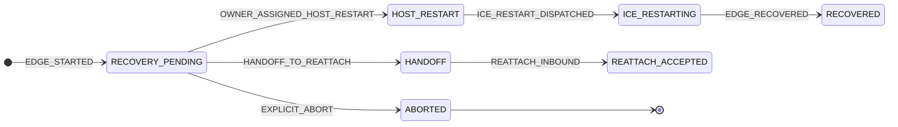

# ADR-0022: Recovery Completion Ownership & Reachability (ADR-CONF-004)

## Status

**Partial Accepted** (2026-07-10; **R28-H / R28-H.1 Accepted 2026-07-13**; **R28-H.2 Accepted 2026-07-13**; **R28-I Accepted 2026-07-14**; **R28-J Accepted 2026-07-20**; **R28-K Accepted 2026-07-21**; **R28-L Accepted 2026-07-21**; **R28-L.1.4 Accepted 2026-07-26**; **R28 Frozen 2026-07-26**; **Appendix C Accepted 2026-07-16**; **Appendix C-2 Accepted 2026-07-16**; **Appendix C-3.1 Accepted 2026-07-16**; **Appendix C-3.2 Accepted 2026-07-16**; **R28-M Draft 2026-07-25**; **R28-PRR Accepted 2026-07-26**) — **Accepted:** R27′-A/B, R28-D/D1 (gate), **R28-E/F/G** (P2-A completion re-evaluate seam, frozen `/grill-with-docs` 2026-07-10), **R28-H / R28-H.1** (Recovery Edge Obligation Lifetime + deadline / pending-decision single writer; soak `647484ef`; **scope per Obligation Episode — see R28-J**), **R28-H.2** (DISCONNECTED_DEBOUNCING reconnect clears suspicion without starting recovery), **R28-I** (WAITING ownership; soak `ea6466f1` M03→M02 participant edge), **R28-J** (Obligation Episode Generation within Edge Lifecycle; soak `obligation-p1-clean-20260720-125309` session `8f1bcfdc` M02→M01 **PASS**), **R28-K** (Recovery Capability vs Attempt Lifetime; soak `obs-matrix-ms1-20260721-120208` session `faaf8579` M-S1 second flap **motivation**), **R28-L** (Recovery Completion Ownership & Convergence; soak `obs-matrix-ms1-r28k-20260721-132235` session `f498ab74` M-S1 post-R28-K **motivation**), **R28-L.1.4** (Link Qualification Transport Repair; soak `obs-r28l1-4-repair-20260726-170329` G-L4-1 **PASS**; post-repair peer path gap documented), **R28-PRR** (Peer Reachability Re-establishment v1; frozen `/grill-with-docs` 2026-07-26; Case B motivation), **Appendix C** (Recovery Attempt Media Action Ownership; causal trace soak `103003` / `125859`), **Appendix C-2** (Deferred Media Action Ownership; soak `112433` **PASS**), **Appendix C-3.1** (Supersede Admission Closure; soak `114047` **PASS**), **Appendix C-3.2** (Recovery Fact Consumption; soak `120053` **PASS**). **R28 freeze (2026-07-26):** scope ends at **Recovery Architecture & Eligibility** (R28-A through R28-L.1.4); no further R28 feature slices. **R28-M** remains Draft (implementation seam), not freeze expansion. Next evolution line: **Peer Reachability Re-establishment (PRR)** — see § R28-PRR. **Accepted companion:** ADR-0024 R29-E (host prune eligibility consumes R28-H; does not redefine obligation). **Draft:** P2-B re-evaluate action decision tree, full S13 completion, **R28-M**. Complements ADR-0021 (R24–R26) and ADR-0023 (R29). **Recovery dispatch eligibility** — which facts may admit a recovery action — is defined in **[ADR-0032](./0032-recovery-dispatch-eligibility-contract.md)** (R28-N), not here; that ADR also corrects three code citations that misattribute the media-plane rule to `INV-REC-009`.

## Summary

S13-B soak proved `RECOVERY_REATTACH_SENT` with `peerReachable=true transportReady=true` does **not** imply host inbound — root cause is **boolean collapse** of orthogonal reachability layers, not missing recovery machinery.

This ADR freezes:

1. **Recovery Edge vs Recovery Attempt vs Obligation Episode** (edge obligation ≠ attempt terminal; R28-J episode scope)
2. **Completion ownership** (per-edge controller, not initiator module)
3. **Action authority + explicit completion decisions** (no decision vacuum)
4. **Two-axis reachability** (`ReachabilitySnapshot`, not linear chain)
5. **Presence projection boundary** (UI reads `ConferencePresenceProjection`, never `ReachabilitySnapshot`)
6. **Recovery Edge Obligation Lifetime** (R28-H: OPEN/CLOSED exclusive close set + observation window; attempt terminal ≠ obligation CLOSED; **scoped per Obligation Episode**)
7. **Obligation Episode Generation** (R28-J: Edge Lifecycle vs Obligation Episode; `obligationGeneration`; `OBLIGATION_CLOSED(RECOVERED)` ≠ edge termination)
8. **WAITING ownership** (R28-I: every WAITING state must name a next-action owner)
9. **Recovery Attempt Media Action Ownership** (Appendix C: attempt MUST resolve media action before silent `FAILED_MEDIA_RECOVERY`)
10. **Deferred Media Action Ownership** (Appendix C-2: `DEFERRED` retains owner; soak `112433` **PASS** — Accepted 2026-07-16)
11. **Recovery Fact Reconciliation** (Appendix C-3: C-3.1 supersede admission **PASS** soak `114047`; C-3.2 fact consumption **PASS** soak `120053`)
12. **Recovery Capability vs Attempt Lifetime** (R28-K: capability unavailable MUST NOT produce attempt failure; timers scoped to capability lifecycle; resume/supersede lineage; soak `obs-matrix-ms1-20260721-120208`)
13. **Recovery Completion Ownership & Convergence** (R28-L: completion fact layer; media ≠ edge recovered; REATTACH reject → reevaluate; rejoin lineage boundary; soak `obs-matrix-ms1-r28k-20260721-132235`)
14. **Recovery Architecture & Eligibility** (R28-L.1.1–L.1.4: link qualification → recovery eligibility gate → transport repair; terminal R28 feature slice)
15. **Recovery Episode Lifecycle Implementation** (R28-M **Draft**: post-`FAILED_MEDIA_RECOVERY` continuation; fact-driven re-evaluate; same-generation attempt supersede; unified lifecycle soak — **not** a new feature slice; **outside R28 freeze**; closes implementation gap between R28-E/F/G/H/J and C-3.2)

```text
ADR-0022 layering (normative roles):

  R28-H / R28-J     — What (episode + generation rules)
  R28-I / Appendix C — What (recovery actions + ownership)
  R28-L.1           — What (qualification + eligibility + repair; R28 freeze terminal)
  R28-O.x           — Observe (producer / projector / consumer trace evidence)
  R28-M             — How (post-FAILED continuation implementation; Draft, not freeze expansion)
  R28-PRR           — Peer reachability re-establishment (Accepted 2026-07-26)
  R28-N             — Dispatch eligibility (which facts may admit an action; → ADR-0032)
```

```text
ReachabilitySnapshot  →  Recovery Controller  →  EdgeRecoveryFacts
                                                      ↓
                              ConferenceRuntimeProjector  |  ConferencePresenceProjector
                                      ↓                 |           ↓
                              Runtime phase/UI          |    joined/connected/recoveringPeers
                                                          ↓
                                                         UI
```

## Context

### S13-B soak evidence (session `dc040181`, M02 host, M01 WiFi loss)

| Observation | Implication |
|-------------|-------------|
| M01 `RECOVERY_REATTACH_SENT` `peerReachable=true transportReady=true` | Local send success ≠ mesh delivery |
| M02 no `INBOUND` / no `RECOVERED` | `routeConverged=false` while authority view stale |
| M02 Meeting pill `roster=3` while `connected=1` | UI reads membership count, not presence projection |
| M01 SENT then M02 silent | **Decision vacuum** — no `WAITING(reason)` emitted |

Probe markers (`peerReachable`, `transportReady`) are **diagnostic only** until R28-D1 gates replace them.

### Architectural layers (extended)

```text
Conference Lifecycle           — ESTABLISHED / TERMINATED
Membership Authority           — JOINED / LEFT
Reachability fact writers      — Connectivity, Discovery, Signaling/Mesh, Conference Runtime
ConferenceEdgeRecoveryController — per-edge policy, ReachabilitySnapshot consumer, EdgeRecoveryFacts producer
ConferenceRuntimeProjector     — phase, bootstrap, degraded, authority (lifecycle/runtime)
ConferencePresenceProjector    — joinedCount, connectedCount, recoveringPeers (presence)
```

## Decision

### R28-A — Recovery Edge vs Recovery Attempt

A **Recovery Edge** is keyed `(sessionId, remoteModuleId)` and may span multiple **Recovery Attempts** (`attemptId`) and multiple **Obligation Episodes** (`obligationGeneration`; R28-J).

| Terminal scope | Allowed values |
|----------------|----------------|
| **Attempt** | `RECOVERED`, `CANCELLED`, `ATTEMPT_TIMEOUT`, `SUPERSEDED` |
| **Obligation episode** (R28-H) | `RECOVERED`, **`obligationDeadline exceeded`** |
| **Edge lifecycle** (R28-J) | Membership `LEFT(remoteModuleId)`, `CONFERENCE_TERMINATED`, local session teardown |

**`ATTEMPT_TIMEOUT` terminates the attempt, not the obligation episode.**

**`CLOSED(RECOVERED)` terminates the obligation episode, not the Edge Lifecycle (R28-J).**

When reachability improves after attempt terminal, the edge controller **MUST re-evaluate** completion. Re-evaluate **MAY** start a new attempt but **MUST NOT** be conflated with "must start next attempt."

Complements ADR-0021 R24 (Strategy A degraded residency); R28-A clarifies edge/attempt orthogonality R24 assumes.

### R28-B — Completion Ownership

**Owner** = per-edge **Conference Edge Recovery Controller** on **this device** for **this** `(sessionId, remoteModuleId)`.

| Concept | Meaning |
|---------|---------|
| **Completion Owner** | Controller maintaining re-evaluate obligation until **obligation episode** terminal (R28-H) or **Edge Lifecycle** end (R28-J) |
| **Preferred Recovery Initiator** | Role hint (`initiatesReattach`); **≠** lifetime owner |
| **Recovery Action Authority** | Which side **may invoke** role-allowed actions when reachable |

Exactly-one obligation episode is **active per edge per local controller** at a time, not "M01 or M02 owns the edge globally."

### R28-C — Action Authority & Explicit Decisions

**v1 capabilities** (minimum):

| Role | Allowed actions |
|------|-----------------|
| Preferred initiator (participant edge) | Dispatch `RECOVERY_REATTACH` |
| Authority (host) | Accept/reject reattach; bounded **media recovery actions** (not frozen to ICE restart only) |
| Both | **MUST NOT** mutate membership |

On every **re-evaluate** (including after reachability change, attempt terminal, or inbound timeout), controller **MUST** emit exactly one **Recovery Completion Decision**:

```text
1. role-allowed completion action
2. WAITING(reason)
3. SUPERSEDED(nextAttemptId)
4. CANCELLED(reason)
```

**Forbidden:** passive wait with no logged decision (S13-B vacuum: SENT → host silence).

#### WAITING(reason) taxonomy

**Connectivity waiting** — not eligible to run recovery protocol:

```text
WAITING_FOR_LINK
WAITING_FOR_DISCOVERY
WAITING_FOR_ROUTE
```

**Protocol waiting** — protocol started, not yet complete:

```text
WAITING_FOR_AUTHORITY
WAITING_FOR_INBOUND
WAITING_FOR_ACCEPT
```

Mapping from `EdgeReachabilitySnapshot` (R28-D): e.g. `!routeConverged` → `WAITING_FOR_ROUTE`, not `WAITING_FOR_AUTHORITY`.

### R28-D — Edge Reachability Facts (two-axis model)

Recovery Controller aggregates **read-only facts**; it **does not own** and **MUST NOT write back** them.

| Fact | Writer | Meaning |
|------|--------|---------|
| `linkReady` | Connectivity | Local network usable |
| `peerDiscovered` | Discovery | Remote module visible |
| `routeConverged` | Signaling / Mesh | Packets can enter routing domain |
| `authorityReachable` | Conference Runtime | Authority can serve conference semantics |

```kotlin
ReachabilitySnapshot(
    linkReady: Boolean,
    peerDiscovered: Boolean,
    routeConverged: Boolean,
    authorityReachable: Boolean,
)
```

**NOT a linear chain.** `authorityReachable` and `routeConverged` are **orthogonal axes**. Soak counterexample: `peerDiscovered=true`, stale `authorityReachable=true`, `routeConverged=false` → reattach sent, host receives nothing.

#### Gates

```text
canDispatchRecoverySignal(edge) :=
    linkReady && peerDiscovered && routeConverged

canCompleteRecovery(edge) :=
    canDispatchRecoverySignal(edge) && authorityReachable
```

Controller **MUST** evaluate dispatch against `canDispatchRecoverySignal` before sending recovery signals.

### R28-D1 — No Boolean Collapse

Recovery decisions **MUST NOT** depend on standalone booleans:

```text
peerReachable
transportReady
authorityReachable   (as sole gate)
```

Completion and dispatch gates **MUST** be evaluated against **`ReachabilitySnapshot`**.

Diagnostic probes (S13-B) may log legacy fields; they **MUST NOT** drive gating after R28 implementation.

### R28-E — Completion Re-evaluate Seam (P2-A)

#### Core invariant

```text
Media Edge Restored          — transport / ICE connectivity re-established (connectivity fact)
Obligation Episode Completed — controller closes current episode (e.g. `CLOSED(RECOVERED)`)
Edge Lifecycle Ended         — record removed; membership / conference / local teardown (R28-J)

Media Edge Restored MUST NOT imply Obligation Episode Completed.
Obligation Episode Completed MUST NOT imply Edge Lifecycle Ended (R28-J).
```

#### ICE restoration vs completion

When edge phase is **`RECOVERY_PENDING`** (or otherwise non-terminal per R28-F) and **control-plane has not started** for the current attempt:

```text
controlPlaneStarted := attempt has crossed accepted recovery control-plane decision
    (REATTACH_ACCEPTED, ICE_RESTARTING after accept)
    — NOT transport delivery (TRANSPORT_SENT / REMOTE_RECEIPT_ACKED / REATTACH_REQUESTED alone)
```

**ICE connectivity restoration MUST NOT directly transition the edge to `RECOVERED`.**

Instead, the controller **MUST**:

```text
1. record the media restoration fact (no phase shortcut)
2. emit RECOVERY_REEVALUATE
3. run completion evaluation (R28-C)
```

Only completion evaluation **MAY** produce: `RECOVERED`, `WAITING(reason)`, `SUPERSEDED(nextAttemptId)`, `CANCELLED(reason)`.

**Narrow exception:** when `controlPlaneStarted == true`, ICE CONNECTED **MAY** satisfy completion evaluation immediately and yield `RECOVERED`.

**Forbidden:**

```text
phase == REATTACH_REQUESTED → direct RECOVERED   (use controlPlaneStarted, not phase enumeration)
routeConverged → coordinator.resend()
ICE CONNECTED → auto REATTACH_REQUESTED
```

The re-evaluate **seam is identical for all edges** (host and participant). Role differences appear only in **evaluation output** (P2-B), not in which connectivity events invoke re-evaluate.

### R28-F — Attempt Terminal vs Edge Obligation

#### Definitions

| Term | Meaning |
|------|---------|
| **Attempt Terminal** | Current recovery attempt ends: `RECOVERED`, `FAILED_MEDIA_RECOVERY`, `CANCELLED`, `SUPERSEDED` |
| **Edge Obligation** | Completion owner maintains re-evaluate duty for the **current Obligation Episode** until episode terminal per R28-H (`RECOVERED`, `OBLIGATION_DEADLINE`, or lifecycle-ending close). **Not** synonymous with Edge Lifecycle (R28-J). |
| **Superseded Attempt** | Material capability change causes explicit abandonment of current attempt; new attempt receives new budget |

#### Rules

```text
attempt_timeout terminates the current attempt only.
It MUST NOT terminate the obligation episode.
```

**Phase model (v1 / P2-A):** `FAILED_MEDIA_RECOVERY` = **attempt terminal marker**; edge record **remains** in the controller map (R24-A degraded residency). P2-A deferred an explicit obligation state machine; **R28-H supersedes that deferral** and freezes `OPEN`/`CLOSED` lifetime + `obligationDeadline`.

When a **material** reachability transition occurs **after** attempt terminal (`FAILED_MEDIA_RECOVERY` record retained):

```text
controller MUST:
    1. emit RECOVERY_REEVALUATE
    2. perform completion evaluation

evaluation MAY produce:
    SUPERSEDED(nextAttemptId)   — not required on every transition
    WAITING(reason)
    CANCELLED(reason)
    RECOVERED
```

**Watchdog:**

```text
watchdog budget belongs to attempts, not to recovery edges.

RECOVERY_REEVALUATE  ≠ extend watchdog
RECOVERY_WAITING       ≠ pause watchdog
```

Before attempt timeout, watchdog **MUST** trigger **`RECOVERY_FINAL_EVALUATION`** (`reason=ATTEMPT_TIMEOUT`) — the last evaluation before attempt terminal — then transition to `FAILED_MEDIA_RECOVERY` if still non-success.

During `FAILED_MEDIA_RECOVERY`: ICE `DISCONNECTED`/`FAILED` **MUST NOT** auto-`beginRecovery` (anti attempt-storm). Coordinator-driven material transitions **MAY** invoke re-evaluate.

### R28-G — Capability Re-evaluation Contract

#### Ownership

```text
Materiality detection belongs to TalkbackCoordinator.

Fact writers MUST NOT invoke recovery evaluation directly.
```

Coordinator assembles `EdgeReachabilitySnapshot`, projects **`RecoveryCapabilitySignature`**, compares against per-edge last signature, and notifies the controller **only on material change**.

#### Recovery Capability Signature

A projection of `EdgeReachabilitySnapshot` capturing the **set of recovery actions currently permitted** — not raw connectivity booleans.

```kotlin
RecoveryCapabilitySignature(
    permittedActions: Set<RecoveryAction>,   // e.g. DISPATCH_REATTACH, COMPLETE_EDGE, …
    waitingReason: WaitingReason?           // current blocker for evaluation
)
```

**Material transition** ⇔ `permittedActions` or `waitingReason` changes.

`permittedActions` / `waitingReason` are **recovery-domain** projections. **`authorityReachable=true` does not imply `COMPLETE_EDGE ∈ permittedActions`** (e.g. `WAITING_FOR_INBOUND` while route and authority facts are true).

**Examples:**

| Scenario | Before | After | Material? |
|----------|--------|-------|-----------|
| Participant, route blocked | `{}`, `WAITING_FOR_ROUTE` | `{DISPATCH_REATTACH}`, `null` | ✅ |
| HELLO seq+1, peer already discovered | unchanged | unchanged | ❌ |
| Authority fact enables completion | `{DISPATCH_REATTACH}`, `WAITING_FOR_AUTHORITY` | `{DISPATCH_REATTACH, COMPLETE_EDGE}`, `null` | ✅ |
| Host, `WAITING_FOR_INBOUND`, route only restores | `{…}`, `WAITING_FOR_INBOUND` | unchanged | ❌ |

For **non-initiator edges**: route restoration alone **does not necessarily** constitute a material transition — only signature change counts.

#### Coordinator hooks (v1)

| Fact change | May change signature |
|-------------|-------------------|
| Mesh ICE state | route / dispatch capability |
| Channel readiness | link capability |
| Peer first callable (`0→1`) | discovery capability |
| **Conference authority reachability fact** flip | completion capability |

**Authority fact source:** domain fact (e.g. `isConferenceAuthorityReachable` / future `ConferenceAuthorityTracker`) — **NOT** `emitConferenceRuntimeProjection` itself. Runtime and Recovery projectors **both consume** the same authority fact; recovery **MUST NOT** read projection output.

**Explicit non-triggers:** per-HELLO refresh when peer already discovered; gossip timestamps; ICE `CHECKING` (v1 route = connected/completed only).

#### Observability (P2-A log contract)

| Marker | Role |
|--------|------|
| `RECOVERY_REEVALUATE` | Capability changed; controller awakened |
| `RECOVERY_FINAL_EVALUATION` | Watchdog expiry; last evaluation before attempt terminal |
| `RECOVERY_DECISION` | Evaluation output (P2-B enriches) |
| `RECOVERY_WAITING` | Explicit wait (protocol state, not debug noise) |

`RECOVERY_REEVALUATE` **SHOULD** log: `session`, `edge`, `attempt`, `trigger`, `capabilityBefore`, `capabilityAfter`, `controlPlaneStarted` — compact capability labels, not raw action-set dumps when avoidable.

**Forbidden in P2-A:** `routeConverged → resend()`; debounce material re-evaluate by default; extend watchdog on `WAITING`.

See `docs/audit/p2a-completion-re-evaluate-seam.md` (Accepted).

### R28-H — Recovery Edge Obligation Lifetime

**Rationale (R29 soak `647484ef`, 2026-07-13):** host M02 ran `FAILED_MEDIA_RECOVERY(M01)` → ~4s cleanup → `AUTHORITY_PRUNE`. Gate was `!isEdgeRecovering()` (attempt-scoped). `edgeObligationOpen()` already returned true for failed residency, but prune never consulted it, and no close/deadline existed — so either "prune immediately after attempt terminal" or (if blindly swapped to `edgeObligationOpen`) "never prune". R28-H freezes the missing middle lifecycle.

**Naming note:** R28-G remains **Capability Re-evaluation Contract**. This section is **R28-H**.

**Scope (R28-J, 2026-07-20):** R28-H defines OPEN / CLOSED / `obligationDeadline` for **one Obligation Episode** (`obligationGeneration`). An **Edge Lifecycle** (R28-J) may contain multiple sequential episodes. The no-reopen invariant applies **within** one episode only; a later recovery responsibility after a terminal episode outcome starts a **new** episode (new generation), not a reopen.

#### Lifecycles (R28-H scope + R28-J)

```text
RecoveryAttempt              — one recovery try (phase machine)
        │
        ▼
RecoveryEdgeObligation       — one obligation episode OPEN/CLOSED (THIS section; R28-J)
        │
        ▼
Edge Lifecycle               — continuous edge record existence (R28-J)
        │
        ▼
Membership Mutation (R29)    — who may prune / leave (ADR-0023; when = ADR-0024 R29-E)
```

| Lifecycle | Answers | Terminal meaning |
|-----------|---------|------------------|
| **RecoveryAttempt** | Did this try end? | End of attempt #N only |
| **RecoveryEdgeObligation** | Does Controller still own completion for **this episode**? | Episode CLOSED (`RECOVERED`, `OBLIGATION_DEADLINE`, or lifecycle-ending reason) |
| **Edge Lifecycle** | Does this observer still track this peer edge? | Record removed (`cancelEdge`) |
| **Membership** | Who may mutate roster? | Separate authority boundary (ADR-0023) |

They **MUST** remain independent. **MUST NOT** implicitly terminate each other except via the explicit close / removal rules below.

#### Attempt Terminal (unchanged scope; clarified non-derivations)

Attempt terminal values:

```text
RECOVERED
FAILED_MEDIA_RECOVERY
FAILED_REQUIRES_USER_ACTION
CANCELLED
SUPERSEDED
```

Attempt terminal **only** means: this attempt has ended.

**MUST NOT** derive from attempt terminal alone:

```text
membership mutation
prune eligible
edge obligation CLOSED
```

#### Obligation states

```text
OPEN
CLOSED
```

While **OPEN** (one episode), the edge record **MAY** host many attempts without closing the episode:

```text
Attempt#3 FAILED     →  obligation episode stays OPEN
Attempt#4 SUPERSEDED →  obligation episode stays OPEN
Attempt#5 FAILED     →  obligation episode stays OPEN
…
```

**There is no "reopen" within one episode.** While the episode stays OPEN, a material transition starts a **new Attempt**, not a reopen of the obligation. A later failure after episode CLOSED starts a **new episode** (R28-J), not a reopen.

#### Close Conditions (exclusive set per episode)

`RecoveryEdgeObligation` (current episode) **MUST** transition to **CLOSED** **only** when one of:

```text
1. RECOVERED                         — episode success (Edge Lifecycle MAY continue — R28-J)
2. membership committed LEFT(remote) — closes episode; Edge Lifecycle ends (record removed)
3. conference TERMINATED             — closes episode; Edge Lifecycle ends
4. obligationDeadline exceeded       — episode abandon (Edge Lifecycle MAY continue — R28-J)
```

**Episode vs lifecycle:** conditions 1 and 4 close the **episode only**. Conditions 2 and 3 close the episode **and** terminate the Edge Lifecycle.

**MUST NOT** close obligation:

```text
FAILED_MEDIA_RECOVERY
FAILED_REQUIRES_USER_ACTION
SUPERSEDED
CANCELLED   (attempt-scoped cancel ≠ obligation close unless it coincides with 2 or 3)
```

R28-A / R28-F close set is **extended** by condition 4 (`obligationDeadline`). Conditions 1–3 remain.

#### Observation Window (not sleep)

```text
obligationDeadline =
    attemptTerminalAt + observationWindow
```

`attemptTerminalAt` = wall-clock when the **current** attempt entered an attempt-terminal state that leaves obligation OPEN (typically `FAILED_MEDIA_RECOVERY` / `FAILED_REQUIRES_USER_ACTION`). A later SUPERSEDED → new attempt that again fails **resets** `attemptTerminalAt` to that new terminal instant (deadline follows the latest failed residency entry).

Observation Window duty is **not** "wait then prune".

It **accepts Reachability Material Transitions** and feeds re-evaluation (R28-G):

```text
Recovery Re-evaluation Triggers (examples):
  HELLO (when it changes capability signature)
  routeConverged flip
  authorityReachable flip
  RecoveryCapabilitySignature material change

≠ Obligation Close Triggers
```

Re-evaluation **MAY** start Attempt #N+1 while obligation remains **OPEN**.

Only when `now >= obligationDeadlineAt` **and** none of close conditions 1–3 have fired does condition 4 close the obligation.

#### R28-H.1 — Obligation Deadline Ownership

```text
ConferenceEdgeRecoveryController is the single writer of:

    obligationOpenedAt
    obligationDeadlineAt
    obligationClosedAt
    obligationCloseReason   // RECOVERED | MEMBERSHIP_LEFT | CONFERENCE_TERMINATED | OBLIGATION_DEADLINE
    hasPendingCompletionDecision
```

Membership / projector / prune / `cleanupUnhealthyConferenceSession` **MUST** consume these timestamps, close reason, and pending-decision flag **read-only**.

**Forbidden:** recomputing `obligationDeadline` (or equivalent grace) in coordinator prune paths, presence projectors, or mesh health cleanup. Dual writers recreate the soak failure class (`FAILED` → local cleanup clock → premature `AUTHORITY_PRUNE`).

**Forbidden:** deriving `hasPendingCompletionDecision` from HELLO silence, ICE CLOSED, or `route=false` outside the controller.

Controller **MUST** set `obligationDeadlineAt` when an attempt enters a failed-media residency that leaves obligation OPEN (`attemptTerminalAt + observationWindow`). Subsequent failed residency after SUPERSEDE **MAY** refresh `obligationDeadlineAt` (follows latest failed entry). Closing **MUST** stamp `obligationClosedAt` + `obligationCloseReason` exactly once per episode; a CLOSED episode **MUST NOT** reopen (R28-J: new failure after terminal episode outcome starts a new episode).

`hasPendingCompletionDecision` **MUST** be true while a completion evaluation / re-evaluate / supersede decision for that edge is in flight, and false only when the controller has emitted a settled completion decision (or the edge has no active evaluation). Membership **MUST NOT** invent this flag.

#### R28-H.2 — Debounce Suspicion Clear on ICE Reconnect

`DISCONNECTED_DEBOUNCING` is a **suspicion buffer**, not an attempt and not recovery ownership.

If ICE reconnects while the edge is still in `DISCONNECTED_DEBOUNCING`:

```text
MUST cancel debounce timer
MUST clear debouncing state → CONNECTED (HEALTHY)
MUST NOT start a recovery attempt
MUST NOT emit REATTACH
MUST NOT model the transition as RECOVERED
```

```text
DISCONNECTED_DEBOUNCING + ICE CONNECTED  →  HEALTHY
(not DISCONNECTED_DEBOUNCING → RECOVERED)
```

**Rationale:** leaving the debounce timer armed after media is already CONNECTED produces false `beginRecovery` / `REATTACH` and sticky `edgeRecovering` while topology is healthy — conflating suspicion with obligation/attempt lifecycles.

#### R28-J — Obligation Episode Generation

**Rationale (soak `obligation-p1-clean-20260720-125309`, 2026-07-20):** session `8f1bcfdc`, M02 host → M01: `CLOSED(RECOVERED)` at `obligationGen=1`, healthy gap, second WiFi loss → `RECOVERY_OBLIGATION_OPENED obligationGen=2` with `previousPhase=RECOVERED` / `pathway=NEW_OBLIGATION_EPISODE`; second `CLOSED(RECOVERED)` at `obligationGen=2`. Prior contaminated soak showed `GROUP_LEAVE` → `cancelEdge()` → `edges.remove()` erased history — not an episode-renewal failure. Frozen `/grill-with-docs` 2026-07-20.

R28-H governs **one recovery obligation episode**. R28-J governs **how many sequential episodes** may exist inside one Edge Lifecycle and when `obligationGeneration` advances.

##### Three lifecycles (orthogonal)

```text
Edge Lifecycle          — does this peer relationship still exist on this observer?
Obligation Episode      — one recovery-responsibility cycle (R28-H OPEN → CLOSED)
Recovery Attempt        — one bounded try inside an episode (R28-A / R28-F)
```

| Lifecycle | Identity (v1) | Answers |
|-----------|---------------|---------|
| **Edge Lifecycle** | Continuous `(sessionId, remoteModuleId)` edge record existence | Does this observer still track recovery for this peer in this session? |
| **Obligation Episode** | `obligationGeneration` within one Edge Lifecycle | Is this recovery-responsibility cycle open or closed? |
| **Recovery Attempt** | `attemptId` within one episode | How is this episode being executed right now? |

Edge Lifecycle persistence **does not** imply obligation continuity across episodes.

##### Edge Lifecycle Identity (v1)

In v1, an Edge Lifecycle is identified **implicitly** by the continuous existence of an edge recovery record keyed by `(sessionId, remoteModuleId)`. Removal of this record terminates the lifecycle. Recreating the record starts a new Edge Lifecycle.

**Termination (lifecycle ends; record removed):** only when the underlying peer relationship is **explicitly** ended:

1. **Membership termination** — member explicitly leaves; authority removes member; membership is no longer valid for this peer.
2. **Conference termination** — conference / session lifecycle ends.
3. **Local endpoint teardown** — local user explicitly hangs up; local session is intentionally destroyed.

**Invariant:** `OBLIGATION_CLOSED(*)` **MUST NOT** terminate an Edge Lifecycle. Recovery completion and temporary connectivity failures **MUST NOT** terminate an Edge Lifecycle.

v1 maps lifecycle termination to `cancelEdge()` → `edges.remove(key)` (implementation). ADR reason strings are non-normative; semantic categories above are normative.

##### Obligation Episode

An **Obligation Episode** is one recovery-responsibility cycle **inside** an active Edge Lifecycle. Each episode runs a full R28-H OPEN → attempts → terminal close arc.

`obligationGeneration` is monotonically increasing **within** the current Edge Lifecycle. It identifies the episode counter, **not** edge identity, remote membership version, or endpoint topology generation.

When a new Edge Lifecycle begins (record recreated after removal), `obligationGeneration` **MUST** start from its initial value (v1: `1`).

##### New episode admission (narrow rule)

A **new** Obligation Episode **MAY** be opened only when:

1. The previous episode within the **same** Edge Lifecycle reached a **terminal recovery outcome**, and
2. A subsequent edge failure requires new recovery responsibility.

**Allowed terminal outcomes that admit the next episode:**

```text
CLOSED(RECOVERED)
CLOSED(OBLIGATION_DEADLINE)
```

**MUST NOT** advance `obligationGeneration` (same episode continues):

```text
ATTEMPT_TIMEOUT
FAILED_MEDIA_RECOVERY
FAILED_REQUIRES_USER_ACTION
SUPERSEDED
REATTACH_REQUESTED
REATTACH_ACCEPTED
ICE_RESTARTING
DISCONNECTED_DEBOUNCING
```

Episode generation advances only across **completed recovery responsibilities**, never across attempts or intermediate failure states.

##### No-reopen rule (tightened)

Within one Obligation Episode: once CLOSED, that episode **MUST NOT** reopen.

A later recovery requirement after a terminal episode outcome **MUST** start a **new** Obligation Episode with `obligationGeneration + 1`. This is **not** a reopen.

##### Non-goals (R28-J)

R28-J **does not** define:

- recovery lineage across removed edge records (`cancelEdge` is an identity boundary);
- whether rejoin after explicit leave should inherit prior edge history;
- obligation continuity after transient membership loss or endpoint / module topology migration.

Those belong to a future ADR (e.g. detached edge / rejoin lineage), not R28-J.

#### R28-I — WAITING Ownership

**Rationale (soak `ea6466f1`, 2026-07-14):** participant M03 observed M02 `ICE_RESTORED` + `mediaRestored=true` while `controlPlaneStarted=false`. Controller logged `decision=WAITING rejectReason=control_plane_not_started` and **returned with no next-action owner** — obligation stayed OPEN, presence stuck (`recoveringPeers` / `mediaUnavailablePeers`), until watchdog timeout or `OBLIGATION_DEADLINE`. WAITING was treated as a terminal parking lot, not a owned intermediate state.

A recovery attempt **MAY** enter a **WAITING** state only if an **explicit next-action owner** exists.

**Valid owners:**

```text
inbound control-plane message
route convergence callback
watchdog timeout
recovery reevaluation
```

A recovery attempt **MUST NOT** remain in WAITING without an owner capable of advancing or terminating the obligation.

**Normative log markers (implementation):**

```text
RECOVERY_CONTROL_PLANE_REQUIRED   — media restored; control-plane continuation scheduled
RECOVERY_CONTROL_PLANE_BOUNDARY   — cross control-plane without transport flap (ICE_RESTART_ONLY + ICE CONNECTED)
decision=WAIT_FOR_CONTROL_PLANE   — owned wait; watchdog / reevaluate owns exit
```

**Forbidden:**

```kotlin
onLog("decision=WAITING rejectReason=xxx_not_started")
return   // no owner scheduled
```

Review question for any new WAITING: **who is responsible for pulling this attempt out of WAITING?**

恢复 attempt 可以进入 WAITING，但必须显式声明下一步动作的 owner。

合法 owner：

- 入站 control-plane
- route 收敛回调
- watchdog 超时
- recovery reevaluate

禁止出现没有 owner 的 WAITING。

#### API contract (normative direction)

Prune / membership eligibility consumers **MUST** consult obligation, not attempt phase helpers:

```kotlin
fun edgeObligationOpen(sessionId, remote): Boolean
fun edgeObligationClosed(sessionId, remote): Boolean
fun obligationDeadlineAt(sessionId, remote): Long?
fun obligationCloseReason(sessionId, remote): ObligationCloseReason?
fun hasPendingCompletionDecision(sessionId, remote): Boolean
```

**Non-normative for prune:**

```kotlin
isEdgeRecovering()          // Attempt phase only
isFailedMediaRecovery()     // Attempt residency marker only
isActivelyRecovering()      // Attempt phase only
```

Existing `EdgeRecoveryRecord.edgeObligationOpen()` (phase actively recovering **or** failed-media residency) is a **partial** open predicate for P2-A. R28-H requires it to become a true **per-episode** lifetime API: OPEN until exclusive close set; expose CLOSED; honor `obligationDeadlineAt` owned solely by the controller. Edge Lifecycle may continue after episode CLOSED(RECOVERED) (R28-J).

#### Boundary with Membership (ADR-0024 R29-E)

```text
ADR-0022 R28-H  →  when the current obligation episode ends (episode CLOSED)
ADR-0022 R28-J  →  when the Edge Lifecycle ends (record removed)
ADR-0024 R29-E  →  after episode CLOSED (and deadline rules), when Membership MAY mutate (prune eligibility)
```

R28-H **MUST NOT** define `canAuthorityPrune`. It only freezes obligation CLOSED as a **necessary** recovery-domain input for that future contract.

#### Soak counterexample this freezes

```text
11:18:01  FAILED_MEDIA_RECOVERY(M01)     — attempt terminal; obligation MUST stay OPEN
11:18:05  AUTHORITY_PRUNE(M01)           — illegal relative to R28-H: obligation not CLOSED
11:18:22  HELLO from M01                 — would have been re-eval trigger inside observation window
```

### R27′-A — Presence Projection Boundary

UI **MUST** consume **`ConferencePresenceProjection`** (and runtime phase from `ConferenceRuntimeProjector` where needed).

**`ReachabilitySnapshot` is recovery-internal** and **MUST NOT** surface to UI or ViewModel.

**Forbidden in UI/ViewModel:**

```kotlin
if (routeConverged && authorityReachable) { showRecovering() }
```

ViewModel **MUST NOT** reconstruct presence from `memberKeys.size`, ICE, or transport callbacks.

### R27′-B — Presence Projection Ownership

```kotlin
data class ConferencePresenceProjection(
    val joinedCount: Int,
    val connectedCount: Int,
    val recoveringPeers: Set<String>,  // ModuleId
)
```

**Producer:** dedicated **`ConferencePresenceProjector`**, sibling to `ConferenceRuntimeProjector`.

Both projectors consume the same read-only facts:

```text
MembershipRoster
EdgeRecoveryFacts
ConnectedPeers
AuthorityState (as needed for connected semantics)
```

**MUST NOT** extend `ConferenceRuntimeProjector.Output` with presence fields — prevents runtime DTO bloat (`suspectPeers`, `speakerPeers`, etc. belong on presence plane).

`recoveringPeers` **MUST** derive from **`EdgeRecoveryFacts` per `remoteModuleId`**, not ICE state or HELLO alone.

#### Semantic split (frozen)

```text
Reachability  → Recovery domain
Phase         → Runtime domain
Who is in / connected / recovering → Presence domain
```

## Relationship to ADR-0021

| ADR-0021 | ADR-0022 |
|----------|----------|
| R24 completion ownership after `attempt_timeout` | R28-A/B/C formalize edge vs attempt, re-evaluate, explicit decisions |
| R5 recovery ownership during attempt | R28-B separates owner vs initiator vs action authority |
| R16 EdgeRecoveryFacts → RuntimeProjector | R27′ adds PresenceProjector consumer |
| S13-B probe (in flight) | R28-D/D1 replace bool gates; probes remain audit-only |

R24 Strategy A (degraded residency) **remains v1 default**; R28 does not authorize Strategy B handoff.

## Consequences

- **Positive:** Soak failures become classifiable (`WAITING_FOR_ROUTE` vs `WAITING_FOR_AUTHORITY`); UI decouples from recovery internals; RuntimeProjector stops growing presence fields.
- **Positive (R28-H):** Attempt terminal no longer silently collapses into prune eligibility; host can observe HELLO/route inside `observationWindow` without prematurely closing recovery ownership; `obligationDeadline` prevents permanent joined=3 stuck conferences.
- **Negative:** Two projectors to keep in sync on shared facts; ReachabilitySnapshot wiring is new work (#73-B implementation).
- **Negative (R28-H):** Controller must track `attemptTerminalAt` / `obligationDeadline` and expose OPEN/CLOSED APIs; prune gate (ADR-0024) must migrate off `isEdgeRecovering`.
- **Neutral:** S13-B probe markers stay until gate implementation; Meeting pill fix is R27′ (can ship before R28 behavior fix).
- **Neutral (R28-H):** Does not authorize prune; ADR-0024 R29-E remains required before host post-terminal membership mutation changes.

## Implementation notes (non-normative)

1. **P0 docs:** this ADR + audit cross-links (`s13b-recovery-reattach-reachability.md`, `ro-m3-recovery-write-matrix.md`).
2. **P1 R27′ (implemented 2026-07-10):** `ConferencePresenceProjector` + `TalkbackSessionSnapshot.conferencePresenceProjection`; Meeting pill reads `connectedCount` / `recoveringPeers` — not roster size.
3. **P1 R28 reachability (implemented 2026-07-10):** `EdgeReachabilitySnapshot` gates `dispatchRecoveryReattachOutcome`; `DEFERRED` → `RECOVERY_PENDING` + `RECOVERY_WAITING(reason)`; v1 `routeConverged = qosMonitor.isGroupConnected(remoteModuleId)`. Soak G-R28-D PASS (`logs-s13b-reattach-reachability-20260710-161257`): no `RECOVERY_REATTACH_SENT` while `routeConverged=false`.
4. **P2-A re-evaluate seam (frozen 2026-07-10):** R28-E/F/G — Coordinator-owned `RecoveryCapabilitySignature`; `RECOVERY_REEVALUATE` / `RECOVERY_FINAL_EVALUATION`; `FAILED_MEDIA_RECOVERY` record retained; material transition → MUST re-evaluate, MAY SUPERSEDE. See grill: `p2a-completion-re-evaluate-seam.md`.
5. **R28-H obligation lifetime (frozen 2026-07-13):** OPEN/CLOSED exclusive close set + `obligationDeadline`; no reopen **within one episode** (R28-J); prune consumers must use `edgeObligationClosed()` — implementation pending; `observationWindow` value TBD at impl (soak showed ~4s too short vs ~20s WiFi restore).
6. **R28-J obligation episode generation (implemented 2026-07-20):** `obligationGeneration` on `EdgeRecoveryRecord`; `needsNewObligationEpisode()` / `openNewRecoveryObligation()`; watchdog binds generation. Soak **PASS** `obligation-p1-clean-20260720-125309` (session `8f1bcfdc`, M02→M01 gen=1→gen=2).
7. **P2-B re-evaluate actions:** decision tree for `permittedActions` → dispatch / ICE restart / `WAITING_FOR_INBOUND` / SUPERSEDE — not frozen in P2-A.
8. **P2 cleanup:** retire probe-only bools from decision paths; S13→E matrix update in write matrix.
9. **ADR-0024 R29-E (not this ADR):** host post-terminal prune eligibility after obligation CLOSED.

## Soak gates (future)

| Gate | Pass criterion | Status |
|------|----------------|--------|
| G-R28-D | WiFi loss: `RECOVERY_WAITING` / `RECOVERY_REATTACH_DEFERRED` with `WAITING_FOR_ROUTE` **before** any `RECOVERY_REATTACH_SENT` when `!routeConverged` | **PASS** `logs-s13b-…-161257` |
| G-R27′ | Meeting pill shows `joinedCount` / `connectedCount` / per-peer recovering consistent with host logs | PASS (prior soak) |
| G-R28-C | No interval where edge is non-terminal and no completion decision for > debounce | **PASS via G-P2-A1/A2** (continuation liveness; was FAIL → P2-A) |
| G-P2-A1 | When `RecoveryCapabilitySignature` changes materially, the recovery controller **MUST** evaluate again within the allowed debounce window. Evidence: `RECOVERY_REEVALUATE` **or** `RECOVERY_DECISION` **or** `RECOVERY_WAITING`. (Continuation liveness only — does **not** require `REATTACH_SENT` / `RECOVERED`.) | **PASS** UT `failedMediaRecovery_materialTransition_emitsReevaluate` + `deferredReattach_iceConnected_blocked_emitsReevaluateOnCapabilityChange` + IT `conferenceR28H2_materialReevalKeepsObligationOpenWithoutPrune`. Material change wakes evaluation inside debounce; may still end WAITING / SUPERSEDE / no dispatch |
| G-P2-A2 | No material capability transition may remain unevaluated until attempt timeout or obligation deadline | **PASS** same suite + UT `capability_participant_routeBlocked_thenConverged_isMaterial` (signature materiality) + H2 IT: route restore after `FAILED_MEDIA_RECOVERY` emits `RECOVERY_REEVALUATE` **before** deadline/timeout silence. Proves continuation seam, not recovery success |
| G-P2-A3 | May still have no `RECOVERY_REATTACH_SENT` (actions = P2-B) | Pending |
| G-S13-E | `RECOVERY_EDGE_RECOVERED` or explicit protocol terminal after WiFi restore | Pending → P2-B |
| G-R28-H1 | After `FAILED_MEDIA_RECOVERY`: obligation stays OPEN; no `AUTHORITY_PRUNE` until CLOSED | **PASS** UT `obligationFacts_stayOpenAfterFailedMediaRecovery` + IT `conferenceR29E_hostMayAuthorityPruneAfterObligationDeadline` (pre-deadline: no prune). Evidence: `ConferenceEdgeRecoveryController` is the single writer of obligation lifecycle (`openedAt` / `deadlineAt` / `closedAt` / `closeReason`); cleanup and prune paths consume facts only |
| G-R28-H2 | Material transition inside observation window → `RECOVERY_REEVALUATE` / new attempt; obligation still OPEN | **PASS** UT `failedMediaRecovery_materialTransition_emitsReevaluate` + IT `conferenceR28H2_materialReevalKeepsObligationOpenWithoutPrune` (also covers G-R29-E2 no prune) |
| G-R28-H3 | Permanent offline past `obligationDeadline` → obligation CLOSED (enables later R29-E prune) | **PASS** UT `obligationDeadline_pastWindow_closesWithObligationDeadline` + IT `conferenceR29E_hostMayAuthorityPruneAfterObligationDeadline`. Evidence: `FAILED_MEDIA_RECOVERY` keeps obligation OPEN until `obligationDeadline`; deadline expiration closes with `closeReason=OBLIGATION_DEADLINE` and unlocks R29-E prune eligibility |
| G-R28-J1 | Same Edge Lifecycle: `CLOSED(RECOVERED)` at gen=N, healthy gap, second disconnect → `RECOVERY_OBLIGATION_OPENED` gen=N+1, `pathway=NEW_OBLIGATION_EPISODE`, second `CLOSED(RECOVERED)`; no `member_left` / `cancelEdge` between rounds | **PASS** `obligation-p1-clean-20260720-125309` session `8f1bcfdc` M02 host → M01 |

## Conference transmit barrier scope — closed by ADR-0026 (2026-07-14)

**Open question:** Should conference recovery block unrelated participant transmit?

**Resolution:** **Closed by ADR-0026.** Conference transmit barriers are **edge-scoped**. Remote edge recovery / obligation OPEN MUST NOT block local capture when another publish path remains healthy. See `docs/adr/0026-conference-media-transmit-barrier-scope.md`.

**Device evidence:** Soak3 session `df7a5404` (2026-07-14) — M02 WiFi loss; M01↔M03 audio continued; no `CONFERENCE_WIDE` `stop_capture` on healthy peers.

**Observability:** `CONFERENCE_BARRIER_SNAPSHOT` logs `policy=EDGE_SCOPED`, `canPublish`, peer recovery telemetry (`recovering`, `obligationOpen`, `failed`) — peer fields are diagnostic only.

## P0-a — GROUP transition readiness observation (2026-07-15)

**Problem (revised):** `MEETING_END` governance transition exists, but terminal predicate is **local** (`membershipReconciled` + `transmitMissingPeers` empty). It does not model receive-capability attach or cross-node session identity convergence. Post-meeting PTT failures with healthy floor control are therefore a **transition/readiness false-positive** class, not PTT/Floor bugs.

**Instrumentation (observation only — no gate/mesh/floor/playback behavior changes):**

| Marker | Purpose |
|--------|---------|
| `MEETING_END_BEGIN` | Transition start + session identity at teardown |
| `GROUP_TRANSITION_READINESS_SNAPSHOT` | Local readiness + identity + bootstrap state |
| `BOOTSTRAP_ATTEMPT` | Bootstrap churn counter (`waitingForPrimary`, `attemptId`) |
| `TRANSITION_TERMINAL_READY` | Local transition terminal timing |

**Key fields:** `sessionTraceId`, `localSessionId`, `initiatorModuleId`, `anchorModuleId`, `floorAuthorityModuleId`, `resolvedBootstrapPrimaryModuleId`, `orphanBelief` (belief only — not ground truth).

**Receive sampling:** only when `floorAuthorityModuleId != null` and a remote floor holder exists; records `HOLDER_AUDIO_UNREACHABLE`, not idle `NO_FLOOR_OWNER`.

**Soak:** `scripts/soak-p0a-group-transition.ps1` — host end → PTT at t+0/5/10/15s; Layer 1 reports `transitionDurationMs`, `bootstrapAttemptCount`, `orphanBeliefDurationMs`. Layer 2 (`correlateBySessionTraceId`) deferred until device data.

**Open questions for P0-a data:**

1. Does `terminalReady=true` coincide with `orphanBelief=true` on participants?
2. How many `BOOTSTRAP_ATTEMPT` per `MEETING_END`?

## Appendix C — Recovery Attempt Media Action Ownership (frozen 2026-07-16)

**Also cited as:** ADR-0022-C — Recovery Attempt Closure Contract.

### Problem statement (revised)

P2-A (R28-E/F/G) froze **completion re-evaluate** after attempt terminal or material capability change. Causal trace soak (`MEDIA RECOVERY CAUSAL TRACE`, stamp `20260716-103003` / `20260715-125859`) proved a **prior** gap:

```text
Recovery ownership          Media action ownership       Signaling / ICE        Completion
        |                            |                        |                    |
RECOVERY_EDGE_STARTED                  X                        ?                    ?
        |                            |                        |                    |
   (implicit wait)              no dispatch              passive ICE?          timeout → FAILED
```

**Appendix C freezes the media-action layer.** It does **not** redefine P2-A completion re-evaluate, membership (ADR-0023), floor, playback, GROUP bootstrap (P2-0), or UI projection (R27′).

### Layer model

```text
1. Recovery attempt opened     — RECOVERY_EDGE_STARTED / RECOVERY_ATTEMPT_OPENED
2. Media action ownership      — Appendix C (this section)
3. Signaling + ICE transport   — MEDIA_SIGNAL_* / MEDIA_ICE_* / ICE state
4. Completion evaluation       — P2-A / R28-E/F/G
5. Edge obligation closure     — R28-H
```

An attempt that reaches layer 4 without resolving layer 2 is **architecturally incomplete**, regardless of whether ICE later moves on its own.

### C-1 — Recovery attempt MUST bind a media action owner

After `RECOVERY_EDGE_STARTED` (or equivalent `beginRecovery` terminal for the attempt), the controller **MUST** within the attempt budget assign exactly one of:

| Outcome | Evidence marker (v1) | Meaning |
|---------|----------------------|---------|
| **A. Host media restart** | `RECOVERY_ICE_RESTART_DISPATCHED` | Host owns `createOffer(iceRestart=true)` for this `(session, remote, attempt)` |
| **B. Reattach handoff** | `RECOVERY_HANDOFF_TO_REATTACH` | Attempt explicitly delegates to inbound reattach / `REATTACH_ACCEPTED` path |
| **C. Explicit abort** | `EXPLICIT_RECOVERY_ABORT(reason=…)` | Attempt ends with stated reason; no silent expiry |

**Forbidden:**

```text
RECOVERY_EDGE_STARTED
        → (no A/B/C)
        → ATTEMPT_TIMEOUT
        → FAILED_MEDIA_RECOVERY
```

This pattern **MUST NOT** occur without an intervening media-action decision. Observation of transport (ICE CHECKING, passive candidate) is **not** a media action assignment.

**Rationale (soak `125859`, M02 host, M03 WiFi):** attempt=2 had `RECOVERY_EDGE_STARTED`, never `RECOVERY_ICE_RESTART_DISPATCHED`, then `FAILED_MEDIA_RECOVERY`. Causal chain broke at layer 2.

#### C-1.1 — Media action owner priority (no competing owners)

`EDGE_STARTED` **MUST NOT** leave two media-action paths racing on the same attempt.

**Priority (highest wins; lower paths MUST defer or supersede):**

| Priority | Rule |
|----------|------|
| 1 | **Existing valid media action owner continues** — once `RECOVERY_MEDIA_OWNER_ASSIGNED` is emitted for attempt *N*, no second owner on *N* |
| 2 | **Explicit handoff supersedes passive attempt** — `RECOVERY_HANDOFF_TO_REATTACH` / inbound `REATTACH_ACCEPTED` **MAY** supersede attempt *N* → *N+1*; attempt *N* MUST NOT also dispatch restart |
| 3 | **Abort only when no valid owner exists** — `EXPLICIT_RECOVERY_ABORT` only after deadline without A or B |

**Forbidden race:**

```text
attempt=2  EDGE_STARTED
    +  host ICE_RESTART_DISPATCHED
    +  participant REATTACH_INBOUND (same attempt, no supersede)
```

**Normative assignment marker:**

```text
RECOVERY_MEDIA_OWNER_ASSIGNED
    session=…
    remote=…
    attempt=N
    owner=HOST_RESTART | PARTICIPANT_REATTACH | ABORTED
    recoveryOwnerModuleId=<local module that owns recovery decision>
    mediaActionOwnerModuleId=<module that will execute signaling restart>
    parentAttempt=<optional, when owner follows handoff>
```

Examples:

```text
RECOVERY_MEDIA_OWNER_ASSIGNED owner=HOST_RESTART attempt=2 recoveryOwnerModuleId=M02 mediaActionOwnerModuleId=M02

RECOVERY_MEDIA_OWNER_ASSIGNED owner=PARTICIPANT_REATTACH attempt=3 parentAttempt=2
    recoveryOwnerModuleId=M02 mediaActionOwnerModuleId=M03 supersededByModule=M03
```

`RECOVERY_ICE_RESTART_DISPATCHED` and `RECOVERY_HANDOFF_TO_REATTACH` **imply** `RECOVERY_MEDIA_OWNER_ASSIGNED` but **MUST** remain separate markers for causal trace.

### C-2 — `ICE_RESTART_ONLY` MUST mean recovery authority owns restart dispatch

Policy `ICE_RESTART_ONLY` **MUST NOT** be implemented as passive observation of the remote peer's transport recovery.

**Terminology (do not conflate):**

| Field | Meaning |
|-------|---------|
| `conferenceHostModuleId` | Conference lifecycle / invite authority |
| `recoveryOwnerModuleId` | Module whose edge controller owns the **recovery attempt** decision on **this device** |
| `mediaActionOwnerModuleId` | Module that **executes** signaling restart (may differ after handoff) |

```text
ICE_RESTART_ONLY  :=  recovery authority on this device MUST assign media action owner (C-1)
                      and dispatch restart (A) OR explicit handoff (B)
                      within attempt budget
```

**MUST NOT** alias `recoveryOwnerModuleId` to `conferenceHostModuleId`. GROUP / unicast recovery **MUST** use the same ownership fields without conference-host coupling.

If the recovery authority only watches ICE/candidate facts without assigning owner, the mode is **passive observation** — not recovery ownership.

**Rationale (soak `103003`):** attempt=2 received `MEDIA_SIGNAL_CANDIDATE_RECEIVED` and ICE CONNECTED while host never dispatched restart. Participant transport recovered **without** host media action closure on attempt=2.

### C-3 — Participant reattach is fallback, not primary closure

Successful soak path (`103003`):

```text
attempt=2  EDGE_STARTED, no dispatch
      →  M03 RECOVERY_REATTACH_INBOUND
      →  SUPERSEDE attempt=3
      →  RECOVERY_ICE_RESTART_DISPATCHED (attempt=3)
      →  RECOVERY_EDGE_RECOVERED
```

This path **MAY** recover the conference but **MUST NOT** be the only closure mechanism for host-owned attempts.

| WiFi timing | Risk if reattach is primary |
|-------------|----------------------------|
| Fast | Participant reattach masks missing host dispatch |
| Slow | No reattach inbound before timeout → `FAILED_MEDIA_RECOVERY` while membership stays JOINED |

**Normative:** Primary owner for host `ICE_RESTART_ONLY` is **A** (dispatch). **B** (reattach handoff) is permitted when dispatch preconditions fail, but **MUST** be explicit (`RECOVERY_HANDOFF_TO_REATTACH`), not accidental via timeout silence.

### C-4 — Attempt supersede MUST name reason and causal relation

When attempt *N* is abandoned for attempt *N+1*, logs **MUST** include:

```text
RECOVERY_ATTEMPT_SUPERSEDED
    session=…
    sessionTraceId=…
    remote=…
    oldAttempt=N
    newAttempt=N+1
    reason=<PARTICIPANT_REATTACH | MATERIAL_CAPABILITY | PEER_DISCOVERED | …>
    supersededByModule=<module that triggered supersede, if remote>
    parentAttempt=N
    parentSessionTraceId=<session trace at supersede time>
```

**Causal question answered:** why may attempt *N+1* legally cover attempt *N*?

Forbidden ambiguity:

```text
attempt=2 FAILED_MEDIA_RECOVERY
attempt=3 RECOVERED
```

without supersede record linking `oldAttempt`, `reason`, and `supersededByModule`.

v1 supersede reasons observed in soak:

| reason | Trigger |
|--------|---------|
| `PARTICIPANT_REATTACH` | `RECOVERY_REATTACH_INBOUND` / `REATTACH_ACCEPTED` |
| `PEER_DISCOVERED` | Discovery / HELLO material transition (R28-H2) |
| `MATERIAL_CAPABILITY` | `RecoveryCapabilitySignature` change |

### C-5 — Acceptance: causal invariants, not UI

**PASS** (successful edge recovery) requires, for the recovering attempt lineage:

```text
RECOVERY_EDGE_STARTED
    → MEDIA_ACTION_OWNER_ASSIGNED     (A or B from C-1)
    → (signaling + ICE — MEDIA_SIGNAL_* / ICE CONNECTED)
    → RECOVERY_EDGE_RECOVERED
```

`MEDIA_ACTION_OWNER_ASSIGNED` evidence (any one):

- `RECOVERY_MEDIA_OWNER_ASSIGNED` with `owner=HOST_RESTART` and matching `attempt=`
- `RECOVERY_MEDIA_OWNER_ASSIGNED` with `owner=PARTICIPANT_REATTACH`, `parentAttempt=`, and supersede record
- `EXPLICIT_RECOVERY_ABORT` with reason (replaces silent `FAILED_MEDIA_RECOVERY` when no owner assigned)

**FAIL** (Appendix C violation):

```text
RECOVERY_EDGE_STARTED
    + FAILED_MEDIA_RECOVERY
    + no RECOVERY_ICE_RESTART_DISPATCHED
    + no RECOVERY_HANDOFF_TO_REATTACH
    + no EXPLICIT_RECOVERY_ABORT
```

for the same `(session, remote, attempt)`.

UI (`connected=3`, pill hints) is **diagnostic only**; gates **MUST** use causal trace + recovery markers.

### Observability contract (v1)

Correlation keys (see `MediaRecoveryCausalTrace`):

```text
session, sessionTraceId, scope, remote, attempt,
conferenceGeneration, pcGeneration, transportGeneration
```

Minimum chain for host edge audit:

```text
RECOVERY_EDGE_STARTED attempt=N
    → RECOVERY_ICE_RESTART_DISPATCHED attempt=N   (or HANDOFF)
    → MEDIA_SIGNAL_OFFER_SENT attempt=N
    → MEDIA_ICE_CANDIDATE_* attempt=N
    → RECOVERY_EDGE_RECOVERED attempt=N′          (N′ may supersede N)
```

### Relationship to P2-A / P2-B

| Topic | Owner |
|-------|-------|
| Media action ownership (this Appendix) | **Appendix C** — implement before relying on completion fixes |
| Completion re-evaluate after material change | P2-A (R28-E/F/G) — layer 4 |
| Action decision tree (`DISPATCH_REATTACH`, `WAIT_FOR_INBOUND`, …) | P2-B — draft |
| Post-terminal `FAILED` + late transport | P2-A grace / completion window — **downstream** of C-1; does not excuse missing dispatch at `EDGE_STARTED` |

### Out of scope (explicit)

- Floor routing, playback, membership mutation (ADR-0023), P2-0 canonical lineage, UI projection rules.

### Freeze sentence

> **A recovery attempt is not a recovery completion candidate until its media action ownership is resolved. An attempt that observes transport changes without owning or delegating a media recovery action MUST NOT silently expire into `FAILED_MEDIA_RECOVERY`.**

### Soak gates (Appendix C)

| Gate | Pass criterion | Status |
|------|----------------|--------|
| G-C-1 | **Forbidden:** `RECOVERY_EDGE_STARTED` + deadline expired + **no** `RECOVERY_MEDIA_OWNER_ASSIGNED` (must be `EXPLICIT_RECOVERY_ABORT`, not silent `FAILED_MEDIA_RECOVERY`) | **FAIL** `125859`; partial **PASS** `103003` (handoff on attempt=3) |
| G-C-2 | **Required:** `EDGE_STARTED` → `MEDIA_ACTION_OWNER_ASSIGNED` → signaling/ICE → `EDGE_RECOVERED` | **PASS** `103003` |
| G-C-3 | **Handoff allowed:** attempt=N → participant reattach → `SUPERSEDE(reason)` → attempt=N+1 → `MEDIA_ACTION_OWNER_ASSIGNED` | **PASS** `103003` |
| G-C-4 | Causal trace: `attempt` threads recovery → dispatch → signaling | **PASS** (instrumentation 2026-07-16) |

### Implementation sequence (non-normative; frozen order)

1. **Patch 1 — C-1 contract:** `EDGE_STARTED` → `MEDIA_ACTION_PENDING`; deadline without owner → `EXPLICIT_RECOVERY_ABORT(NO_MEDIA_ACTION_OWNER)`, not silent `FAILED_MEDIA_RECOVERY`.
2. **Patch 2 — Restart dispatch:** `ICE_RESTART_ONLY` path assigns `owner=HOST_RESTART` and emits `RECOVERY_ICE_RESTART_DISPATCHED` (fixes `125859` class).
3. **Patch 3 — Explicit handoff:** participant reattach remains; becomes `RECOVERY_HANDOFF_TO_REATTACH` + supersede, not implicit rescue.

**Explicitly deferred:** longer timeout, blind retry, membership/floor/playback/UI changes.

### Patch design — C-1 vs existing FSM (non-normative)

**Do not duplicate the recovery FSM.** Insert a **media-action sub-state** on the existing attempt, not a parallel controller.

#### Existing `EdgeRecoveryPhase` (today)

```text
DISCONNECTED_DEBOUNCING → RECOVERY_PENDING → [REATTACH_* | ICE_RESTARTING] → RECOVERED
                                              ↘ FAILED_MEDIA_RECOVERY (watchdog)
```

**Gap (code):** `beginRecovery(initiatesReattach=false)` sets `RECOVERY_PENDING`, schedules watchdog, **never** calls `issueBoundedIceRestart`. Restart only from `REATTACH_ACCEPTED` or `continueControlPlaneRecoveryAfterMediaRestored` (ICE_RESTORED path).

#### Proposed insertion (Appendix C)

Add **logical** sub-state on `EdgeRecoveryRecord` (not necessarily new `EdgeRecoveryPhase` enum value in v1):

```text
mediaActionOwner: UNASSIGNED | PENDING | HOST_RESTART | HANDOFF_REATTACH | ABORTED
```

| Existing phase | New sub-state | Trigger |
|----------------|---------------|---------|
| `RECOVERY_PENDING` | `UNASSIGNED` → `PENDING` | `RECOVERY_EDGE_STARTED` |
| `RECOVERY_PENDING` | `PENDING` → `HOST_RESTART` | `issueBoundedIceRestart` success → `RECOVERY_MEDIA_OWNER_ASSIGNED` |
| `RECOVERY_PENDING` | `PENDING` → `HANDOFF_REATTACH` | `RECOVERY_HANDOFF_TO_REATTACH` / inbound reattach |
| `RECOVERY_PENDING` | `PENDING` → `ABORTED` | watchdog, no owner → `EXPLICIT_RECOVERY_ABORT` |
| `ICE_RESTARTING` | `HOST_RESTART` | already dispatched |
| `REATTACH_ACCEPTED` | `HOST_RESTART` or `HANDOFF` | per C-1.1 priority |

**Patch 2 minimal hook:** end of `beginRecovery`, when `policy=ICE_RESTART_ONLY` and `routeConverged` (or immediate), call `assignMediaActionOwner(HOST_RESTART)` → `issueBoundedIceRestart` — **single writer**, no race with reattach (reattach triggers supersede per C-1.1 #2).


```mermaid
stateDiagram-v2
    direction LR
    [*] --> RECOVERY_PENDING: EDGE_STARTED
    RECOVERY_PENDING --> HOST_RESTART: OWNER_ASSIGNED_HOST_RESTART
    RECOVERY_PENDING --> HANDOFF: HANDOFF_TO_REATTACH
    RECOVERY_PENDING --> ABORTED: EXPLICIT_ABORT
    HOST_RESTART --> ICE_RESTARTING: ICE_RESTART_DISPATCHED
    HANDOFF --> REATTACH_ACCEPTED: REATTACH_INBOUND
    ICE_RESTARTING --> RECOVERED: EDGE_RECOVERED
    ABORTED --> [*]
```

#### FSM对照（插入点）

| 现有代码路径 | 现状 | Appendix C 改法 |
|-------------|------|----------------|
| `beginRecovery(ICE_RESTART_ONLY)` | watchdog only | + assign owner + `issueBoundedIceRestart` |
| `beginRecovery(REATTACH)` | `onRequestReattach` | + `HANDOFF` or `HOST_RESTART` after accept |
| `issueBoundedIceRestart` | reattach / ICE_RESTORED only | also from `beginRecovery` |
| watchdog `ATTEMPT_TIMEOUT` | → `FAILED_MEDIA_RECOVERY` | if `mediaActionOwner==UNASSIGNED` → `EXPLICIT_ABORT` |
| `onRecoveryReattachAccepted` | supersede + restart | + `RECOVERY_ATTEMPT_SUPERSEDED` causal fields |

## Appendix C-2 — Deferred Media Action Ownership Preservation (frozen 2026-07-16)

**Also cited as:** ADR-0022-C2 — Deferred Media Action Ownership.

**Extends:** Appendix C (C-1..C-5). **Does not replace** Appendix C section "C-2" (`ICE_RESTART_ONLY` dispatch semantics).

### Problem statement

Evidence pass soak (`MEDIA RECOVERY CAUSAL TRACE`, stamp `20260716-105748`, session `e408b98f`, M03 WiFi flap) proved Appendix C Patch 1/2 fixed **missing owner at dispatch** but exposed a **second, independent** gap:

```text
RECOVERY_EDGE_STARTED
    → DISPATCH_REATTACH (decision approved)
    → outcome=DEFERRED (transport prerequisite unmet)
    → ATTEMPT_TIMEOUT
    → EXPLICIT_RECOVERY_ABORT(reason=NO_MEDIA_ACTION_OWNER)
```

If `DISPATCH_REATTACH` was chosen, an action owner **was selected**. Classifying the terminal as `NO_MEDIA_ACTION_OWNER` is a **lifecycle contradiction** — not evidence that recovery was impossible.

Separately, the same soak showed **deferred wakeup not wired** (host-edge M03→M02: `Remote module recovered: M02` at 10:59:04 without `RECOVERY_REEVALUATE edge=M02`). That is **out of scope for this appendix** — see future **Appendix C-3** (Deferred Action Wakeup Binding).

**Freeze sentence (C-2 scope only):**

> **C-2 corrects ownership classification across DEFERRED transport states. It does not promise recovery.**

### Governance chain (Appendix C family)

```text
C-1   (Appendix C)   — attempt MUST resolve media action owner before silent expiry
C-2   (this section) — deferred action MUST retain ownership; DEFERRED ≠ UNASSIGNED
C-3   (future)       — deferred action MUST have declared wakeup + re-evaluate binding
C-4   (R28-E/F/G)    — completion re-evaluate after material capability change
C-5   (R28-H)        — edge obligation lifetime / projection
```

Patch 2.5 implements **C-6..C-8** (this appendix). Patch 3+ implements **Appendix C-3** — not retry semantics.

### Layer model (unchanged; C-2 insertion point)

```text
1. Recovery attempt opened
2. Media action ownership      — Appendix C + C-2 (owner + disposition)
3. Signaling + ICE transport
4. Completion evaluation       — R28-G (downstream; MUST NOT substitute for C-2)
5. Edge obligation closure     — R28-H
```

C-2 operates entirely in layer 2. It **MUST NOT** duplicate `EdgeRecoveryPhase` or introduce a parallel recovery FSM (per Appendix C patch design).

### C-6 — Deferred ownership preservation

After `RECOVERY_EDGE_STARTED`, once media action ownership is **assigned**, it **MUST** remain valid through a `DEFERRED` disposition until one of:

```text
completion       — action executed and edge recovers
supersede        — attempt N → N+1 with causal record (Appendix C C-4)
explicit abort   — stated terminal reason (not misclassified absence)
```

**Forbidden:**

```text
DISPATCH_REATTACH approved
    → outcome=DEFERRED
    → (ownership released or never recorded)
    → NO_MEDIA_ACTION_OWNER
```

**Normative:**

```text
DEFERRED is a dispatch outcome, not absence of ownership.
DEFERRED MUST NOT be equivalent to UNASSIGNED.
```

**Rationale (soak `105748`, M03→M02 attempt=3/5):** `RECOVERY_REATTACH_DEFERRED reason=WAITING_FOR_ROUTE` preceded `EXPLICIT_RECOVERY_ABORT(NO_MEDIA_ACTION_OWNER)`. The action was chosen; only transport blocked execution.

### C-7 — Deferred action MUST declare wakeup dependency

Every `DEFERRED` disposition **MUST** record which external fact, when it becomes true, **would** permit re-evaluation of the blocked action. This appendix **declares and logs** the binding only — it does **not** require the coordinator to act on it (Appendix C-3).

**Forbidden:**

```text
DEFERRED with no wakeupBinding
    → silent wait until watchdog
```

That pattern is a zombie-attempt source (same class of bug as pre-C-1 silent expiry).

#### Ownership record (logical model)

Do **not** overload `EdgeRecoveryPhase`. Add orthogonal fields on `EdgeRecoveryRecord` (or equivalent):

```kotlin
MediaActionOwnership(
    owner: MediaActionOwner,              // NONE | HOST | PARTICIPANT
    disposition: MediaActionDisposition,  // closed enum — see below
    deferredReason: DeferredReason?,     // when disposition == DEFERRED
    wakeupBinding: WakeupBinding?,       // declared dependency; C-3 wires re-evaluate
)
```

```kotlin
enum class MediaActionOwner { NONE, HOST, PARTICIPANT }

/** Closed enum — MUST NOT add SENT / DISPATCHING / COMPLETED (those live in EdgeRecoveryPhase). */
enum class MediaActionDisposition { UNASSIGNED, ACTIVE, DEFERRED, ABORTED }

enum class DeferredReason {
    ROUTE_NOT_READY,
    AUTHORITY_NOT_READY,
    MEDIA_NOT_READY,
}

data class WakeupBinding(
    sourceType: WakeupSourceType,
    sourceKey: String,   // scoped identity, e.g. edge(session,remote) or module(M02)
)

enum class WakeupSourceType {
    ROUTE_CONVERGED,
    PEER_DISCOVERED,
    AUTHORITY_REACHABLE,
}
```

**Wakeup binding granularity (required):** `wakeupBinding` **MUST** name both `sourceType` and `sourceKey`. Wildcard bindings are **forbidden**.

| Valid | Invalid |
|-------|---------|
| `{ sourceType: ROUTE_CONVERGED, sourceKey: edge(M03→M02) }` | `{ sourceType: RECOVERY_EVENT }` |
| `{ sourceType: PEER_DISCOVERED, sourceKey: module(M02) }` | `{ sourceType: ANY_RECOVERY_EVENT }` |

C-3 matches **external fact → binding.sourceType + sourceKey → `RECOVERY_REEVALUATE`**. Without scoped keys, C-3 reintroduces silent wait.

**Legal `(owner, disposition)` combinations:**

| owner | disposition | Valid? |
|-------|-------------|--------|
| `NONE` | `UNASSIGNED` | Yes — pre-assignment |
| `NONE` | `ACTIVE` | **No** |
| `HOST` / `PARTICIPANT` | `ACTIVE` | Yes — dispatch in flight or completed |
| `HOST` / `PARTICIPANT` | `DEFERRED` | Yes — prerequisite unmet |
| `NONE` | `ABORTED` | Yes — explicit terminal without prior owner |
| `HOST` / `PARTICIPANT` | `ABORTED` | Yes — explicit abort after assignment |

**Orthogonal to `EdgeRecoveryPhase` (examples):**

```text
owner=HOST, disposition=DEFERRED, phase=RECOVERY_PENDING   (WAITING_FOR_ROUTE)
owner=HOST, disposition=ACTIVE,  phase=ICE_RESTARTING
owner=HOST, disposition=ACTIVE,  phase=RECOVERED
```

Ownership **MUST NOT** encode phase progress (`SENT`, `DISPATCHING`, `COMPLETED`).

#### Observability (v1)

When disposition becomes `DEFERRED`, emit:

```text
RECOVERY_MEDIA_ACTION_DEFERRED
    session=…
    remote=…
    attempt=N
    owner=HOST | PARTICIPANT
    disposition=DEFERRED
    deferredReason=ROUTE_NOT_READY | AUTHORITY_NOT_READY | MEDIA_NOT_READY
    wakeupBinding=<sourceType>/<sourceKey>    e.g. ROUTE_CONVERGED/edge(session,M02)
```

Existing `RECOVERY_REATTACH_DEFERRED` / `RECOVERY_MEDIA_ACTION_DEFERRED` (pre-C-2) **SHOULD** converge on this shape in Patch 2.5.

### C-8 — Timeout classification: owner absent vs owner blocked

Watchdog expiry **MUST** distinguish:

| Classification | Meaning | v1 abort reason |
|----------------|---------|-----------------|
| **OWNER_ABSENT** | No media action owner was assigned before deadline | `NO_MEDIA_ACTION_OWNER` (C-1) |
| **OWNER_BLOCKED** | Owner assigned; action remained `DEFERRED` through deadline | `OWNER_BLOCKED` (**not** `NO_MEDIA_ACTION_OWNER`) |

**`OWNER_BLOCKED` is not failed recovery completion.** It means:

> Owner is determined, but the owner’s media action has not yet satisfied its dispatch prerequisite.

Do **not** read `FAILED_MEDIA_RECOVERY` + `OWNER_BLOCKED` as “recovery failed because the action failed”. C-2 covers only `OWNER_ABSENT` vs `OWNER_BLOCKED`. **`ACTION_FAILED`** (action executed but failed) is **out of scope** for C-2 — a future classification if needed.

| Classification | Meaning |
|----------------|---------|
| `OWNER_ABSENT` | No one owns this recovery action |
| `OWNER_BLOCKED` | Owner exists; execution prerequisite unmet |
| `ACTION_FAILED` | *(not C-2)* Action ran and failed |

**Forbidden:**

```text
owner=PARTICIPANT, disposition=DEFERRED, wakeupBinding=ROUTE_CONVERGED
    → ATTEMPT_TIMEOUT
    → reason=NO_MEDIA_ACTION_OWNER
```

**Normative terminal pattern (owner blocked):**

```text
RECOVERY_MEDIA_OWNER_ASSIGNED owner=PARTICIPANT
    → RECOVERY_MEDIA_ACTION_DEFERRED … wakeupBinding=ROUTE_CONVERGED
    → ATTEMPT_TIMEOUT
    → EXPLICIT_RECOVERY_ABORT(reason=OWNER_BLOCKED)   // or ACTION_BLOCKED
    → FAILED_MEDIA_RECOVERY                           // obligation layer unchanged
```

Obligation phase `FAILED_MEDIA_RECOVERY` **MAY** remain (per C-1 freeze: C-layer abort ≠ obligation rename). C-8 fixes **abort reason semantics**, not obligation closure.

**Semantic correction (non–no-op):** Patch 2.5 **changes failure classification** by preserving ownership across `DEFERRED`. It does **not** guarantee the edge recovers.

### Evidence pass summary (soak `105748`, non-normative)

| Edge | DEFERRED reason | Wakeup observed during attempt? | Outcome |
|------|-----------------|----------------------------------|---------|
| M03→M02 (host) | `ROUTE_NOT_READY` | No `ROUTE_CONVERGED`; `HELLO`/recovered at 10:59:04 **without** `RECOVERY_REEVALUATE` | `NO_MEDIA_ACTION_OWNER` (misclassified) |
| M03→M01 (peer) | `MEDIA_NOT_READY` | `PEER_DISCOVERED` → supersede; `ROUTE_CONVERGED` via ICE | `RECOVERED` |

Conclusion: **C-2 is necessary but not sufficient.** C-3 must answer whether `HELLO` / `Remote module recovered` **SHOULD** awaken host-edge deferred reattach, and whether `routeConverged` **over-couples** to host media path.

### Relationship to Appendix C / P2-A

| Topic | Owner |
|-------|-------|
| Owner must exist before silent expiry | Appendix C **C-1** |
| Owner survives `DEFERRED` | **C-6** (this appendix) |
| Wakeup dependency declared | **C-7** (this appendix) |
| Wakeup triggers re-evaluate | **Appendix C-3** (future) — not retry scheduler |
| Capability / route projection | R28-G — **MUST NOT** be modified by C-2 |
| `routeConverged` vs `authorityReachable` vs media | **Separate ADR question** — potential deadlock if conflated; C-3 + reachability audit |

### Out of scope (explicit)

- `routeConverged` / `authorityReachable` projection changes
- Deferred wakeup **implementation** (re-evaluate hooks, supersede from `FAILED` after late HELLO)
- Retry scheduler, blind resend, watchdog extension
- UI projection (`RECOVERY_FAILED` vs `RECOVERY_DEFERRED` — R27′)
- Membership mutation (ADR-0023)
- Floor, playback, GROUP bootstrap

### Soak gates — C-2 correctness only (Appendix C-2)

Patch 2.5 soak validates **ownership semantics**, not recovery success.

**PASS** — for every attempt that entered `DEFERRED`:

```text
owner != UNASSIGNED (and != NONE)
disposition == DEFERRED
deferredReason present
wakeupBinding present (sourceType + sourceKey)
timeout classification: OWNER_BLOCKED ≠ OWNER_ABSENT (no NO_MEDIA_ACTION_OWNER on deferred attempts)
```

**NOT required for C-2 PASS:**

```text
RECOVERED == true
connectedParticipants restored
UI pill cleared
```

G-C2-4 (M03→M02 `RECOVERED` after WiFi flap) remains **deferred to Appendix C-3**.

| Gate | Pass criterion |
|------|----------------|
| G-C2-1 | `outcome=DEFERRED` → `RECOVERY_MEDIA_OWNER_ASSIGNED` + `RECOVERY_MEDIA_ACTION_DEFERRED` with `owner`, `deferredReason`, `wakeupBinding` |
| G-C2-2 | **Forbidden:** `DEFERRED` attempt → `NO_MEDIA_ACTION_OWNER` |
| G-C2-3 | **Required:** `DEFERRED` attempt timeout → `EXPLICIT_RECOVERY_ABORT(reason=OWNER_BLOCKED)` |
| G-C2-4 | M03→M02 `RECOVERED` after flap — **C-3 only**; not a C-2 gate |

### Soak validation (frozen 2026-07-16)

Soak `20260716-112433`, session `59c4eda9`, M02 host / M03 WiFi flap (Patch 2.5):

| Gate | Result | Evidence |
|------|--------|----------|
| G-C2-1 | **PASS** | M03→M02 attempt=3/5: `PARTICIPANT_REATTACH` + `DEFERRED(ROUTE_NOT_READY)` + `wakeupBinding=ROUTE_CONVERGED/edge(...)` |
| G-C2-2 | **PASS** | No `NO_MEDIA_ACTION_OWNER` on DEFERRED attempts 3/5 |
| G-C2-3 | **PASS** | `EXPLICIT_RECOVERY_ABORT reason=OWNER_BLOCKED` on attempts 3/5 |
| G-C2-4 | **N/A** (C-3) | M03→M02 not `RECOVERED`; expected |

**C-2 status: PASS.** Fixes ownership classification across `DEFERRED`; does **not** promise recovery.

**Known C-3 precursor (fixed by C-3.1):** M03→M02 attempt=7 in soak `112433` — `PEER_DISCOVERED` supersede without `EDGE_STARTED` / ownership → `NO_MEDIA_ACTION_OWNER`. Closed by Appendix C-3.1 soak `114047`.

### Implementation sequence (non-normative)

1. **Patch 2.5 — C-6..C-8:** `MediaActionOwnership` fields; defer preserves owner; new abort classification; `RECOVERY_MEDIA_ACTION_DEFERRED` enriched. **Done.**
2. **Soak `20260716-112433`:** G-C2-1..3 **PASS**.
3. **Patch 3.1 — C-3.1 supersede admission:** **Done.** Soak `20260716-114047` **PASS**.
4. **Patch 3.2 — C-3.2 fact consumption:** **Done.** Soak `20260716-120053` **PASS**.

### Open question (for C-3 / reachability ADR; not C-2)

When host-edge ICE is `FAILED` but control path resumes (`HELLO`, `Remote module recovered`):

```text
routeConverged depends on authorityReachable depends on host media?
```

If yes, reattach may remain `DEFERRED` until media recovers — while media recovery may require route — a **projection deadlock**. C-2 **documents** the binding; resolving the gate logic is **C-3 + reachability**, not ownership lifecycle.

**C-2 intentionally preserves the current reachability predicate.** Whether route convergence should depend on host media ICE is **deferred to Appendix C-3**. C-2 **MUST NOT** be used to justify changing `routeConverged` / `authorityReachable` in the same patch.

## Appendix C-3 — Recovery Fact Reconciliation (2026-07-16)

**Also cited as:** ADR-0022-C3 — Recovery Fact Reconciliation.

**Extends:** Appendix C / C-2. **Not** a retry scheduler or watchdog extension.

### Appendix C status (governance chain)

```text
C-1    Media action ownership existence        PASS
C-2    Deferred ownership persistence          PASS
C-3.1  Supersede admission                     PASS
C-3.2  Recovery fact consumption               PASS
C-4    Completion re-evaluation                PENDING
C-5    Obligation projection                   FUTURE
```

### Problem statement

C-2 soak (`20260716-112433`) proved ownership semantics are correct but exposed the next gap:

```text
external recovery fact exists
        +
attempt waiting (DEFERRED or FAILED residency)
        X
recovery lifecycle does not consume the fact
```

Two mirror failures (now split across C-3.1 / C-3.2):

| Layer | Bug | Fixed by |
|-------|-----|----------|
| C-2 | `DEFERRED` releases owner → `NO_MEDIA_ACTION_OWNER` | C-2 **PASS** |
| C-3.1 | Supersede creates attempt without ownership lifecycle | C-3.1 **PASS** |
| C-3.2 | Fact arrives but `wakeupBinding` not consumed → no re-evaluate | C-3.2 **PASS** |

**Freeze sentence (C-3 scope):**

> **C-3 binds external recovery facts to attempt lifecycle reconciliation. It is not retry.**

### C-9 — External fact must trigger re-evaluation

When a recovery-relevant external fact matches an edge with an **open obligation** and a reconcilable attempt (active, `DEFERRED`, or failed residency eligible for supersede), the system **MUST** emit:

```text
RECOVERY_REEVALUATE(session, edge, attempt, trigger=<FACT>)
```

Recovery-relevant facts (v1):

```text
PEER_DISCOVERED
REMOTE_MODULE_RECOVERED   (HELLO / rediscovery)
ROUTE_CONVERGED
AUTHORITY_REACHABLE
```

**Forbidden:**

```text
fact observed
+
attempt waiting (DEFERRED or FAILED residency)
+
(no RECOVERY_REEVALUATE)
```

That pattern is a silent zombie — the same class of bug C-1 eliminated for watchdog expiry.

**Note:** C-9 declares the binding obligation. **C-3.2** implements dispatch from fact writers to re-evaluate. C-2 already records `wakeupBinding` on `DEFERRED` attempts for traceability.

### C-10 — Supersede must create valid ownership context

When attempt *N+1* supersedes attempt *N*, the new attempt **MUST** enter ownership lifecycle via exactly one of:

```text
A. RECOVERY_EDGE_STARTED  →  ownership assignment path (C-1)
B. explicit inherited ownership  →  logged handoff from prior attempt
```

**Forbidden:**

```text
RECOVERY_ATTEMPT_SUPERSEDED
    → new attempt in RECOVERY_PENDING
    → (no EDGE_STARTED, no owner)
    → NO_MEDIA_ACTION_OWNER
```

**Rationale (soak `112433`, M03→M02 attempt=7):** `PEER_DISCOVERED` supersede from `FAILED_MEDIA_RECOVERY` without ownership assignment. **Closed by C-3.1** soak `114047`.

**Semantic freeze:** Supersede is **not** a shortcut that bypasses recovery lifecycle. It is a **lawful entry** into `EDGE_STARTED` + ownership assignment.

### C-11 — Failed residency is not terminal for external recovery facts

`FAILED_MEDIA_RECOVERY` with obligation **OPEN** (R28-H) **MUST NOT** be treated as “recovery is over” when a matching external fact arrives.

```text
FAILED_MEDIA_RECOVERY + obligation OPEN + PEER_DISCOVERED
    → SUPERSEDE (C-11) → new attempt with valid ownership (C-10)
    → MAY → RECOVERED
```

Without C-11, C-2 correctly leaves attempts at `OWNER_BLOCKED` with no lawful resurrection path — facts exist but lifecycle cannot advance.

**Distinction from R29:** R29 governs **membership** mutation authority. C-11 governs **recovery attempt** reconciliation only.

## Appendix C-3.1 — Supersede Admission Closure (Accepted 2026-07-16)

**Status: PASS**

### Invariant

A superseded recovery attempt **MUST** enter the recovery lifecycle through a valid `RECOVERY_EDGE_STARTED` pathway and **MUST** acquire media action ownership before timeout classification.

Implements **C-10** (and enables **C-11** resurrection without ownership vacuum).

### Evidence — before vs after

**Before C-3.1** (soak `112433`, session `59c4eda9`, M03→M02):

```text
FAILED attempt
    |
    PEER_DISCOVERED
    |
    SUPERSEDE
    |
    NO_MEDIA_ACTION_OWNER
```

**After C-3.1** (soak `114047`, session `122be247`, M03→M02):

```text
FAILED(OWNER_BLOCKED)
    |
    PEER_DISCOVERED
    |
    SUPERSEDE
    |
    EDGE_STARTED(pathway=SUPERSEDE)
    |
    PARTICIPANT_REATTACH
    |
    DEFERRED(ROUTE_NOT_READY)
    |
    OWNER_BLOCKED
```

### Soak validation (frozen 2026-07-16)

Soak `20260716-114047`, session `122be247`, M02 host / M03 WiFi flap (Patch 3.1):

| Gate | Result | Evidence |
|------|--------|----------|
| G-C3.1-1 | **PASS** | M03→M02 attempt=7: `RECOVERY_EDGE_STARTED pathway=SUPERSEDE` after `PEER_DISCOVERED` supersede from attempt=5 `FAILED` |
| G-C3.1-2 | **PASS** | `RECOVERY_MEDIA_OWNER_ASSIGNED owner=PARTICIPANT_REATTACH` + `DEFERRED(ROUTE_NOT_READY)` on attempt=7 |
| G-C3.1-3 | **PASS** | Zero `NO_MEDIA_ACTION_OWNER` in session; attempt=7 timeout → `OWNER_BLOCKED` |

**NOT required for C-3.1 PASS:**

```text
RECOVERED == true
connectedParticipants == 3
M03→M02 media restored
```

M03→M02 remained `connected=2` after attempt=7 `OWNER_BLOCKED` — **expected**; that is **C-3.2** (fact consumption), not supersede admission.

### Layer boundary (do not expand C-3.1)

| Layer | C-3.1 soak |
|-------|------------|
| ownership | **PASS** |
| supersede admission | **PASS** |
| action responsibility | **PASS** |
| wakeup / fact consumption | **not in scope** |

C-3.1 answers: *“Does the new attempt have an owner?”* — not *“When should it act again?”*

### Out of scope (C-3.1)

- `RECOVERY_REEVALUATE` wiring for `HELLO` / `ROUTE_CONVERGED` (C-3.2)
- Watchdog timeout extension
- `routeConverged` projection changes
- UI / `connected=` projection

## Appendix C-3.2 — Recovery Fact Consumption (Accepted 2026-07-16)

**Status: PASS**

**Extends:** C-3.1 **PASS**. Implements **C-12** / **C-13** (and enables **C-9** / **C-11** at coordinator layer). **Not** a wakeup scheduler or retry timer.

### Invariant (fact consumption closure)

When a recovery-relevant external fact matches a `DEFERRED` or `FAILED` residency attempt with open obligation, the system **MUST** emit `RECOVERY_REEVALUATE` and produce a new media-action decision — **not** silent wait.

Implements:

- **C-12:** `wakeupBinding` match → `RECOVERY_REEVALUATE`
- **C-13:** `Remote module recovered` + matching deferred/failed attempt → forbidden silent gap

### Evidence — before vs after (M03→M02)

**Before C-3.2** (soak `114047`, session `122be247`, C-3.1 only):

```text
attempt=7 DEFERRED(ROUTE_NOT_READY)
HELLO from M02 / Remote module recovered
    → (no RECOVERY_REEVALUATE edge=M02)
    → OWNER_BLOCKED, connected=2
```

**After C-3.2** (soak `120053`, session `c93ff44b`):

```text
attempt=5 OWNER_BLOCKED
ICE M02 CONNECTED
    → RECOVERY_REEVALUATE(trigger=ROUTE_CONVERGED)
    → SUPERSEDE attempt=7 + EDGE_STARTED(pathway=SUPERSEDE)
    → DISPATCH_REATTACH + RECOVERY_REATTACH_SENT
    → RECOVERY_EDGE_RECOVERED attempt=7
    → connected=3
```

**Note:** `connected=3` in soak `120053` is **observed success**, not a C-3.2 gate requirement.

### Implementation seams (frozen)

```text
WakeupBinding.matchesTrigger(trigger, session, edge)
hasDeferredWakeupForTrigger(session, edge, trigger)
    → bypass R28-G materiality gate when binding matches

onRemoteModuleRecovered → REMOTE_MODULE_RECOVERED trigger
failedResidencyReevaluate → ROUTE_CONVERGED / AUTHORITY_REACHABLE / …
```

### Problem statement (soak `114047` evidence — closed)

Deferred attempt has owner **and** `wakeupBinding`, but matching recovery fact does not enter re-evaluate:

```text
attempt=7
OWNER=PARTICIPANT_REATTACH
DEFERRED(ROUTE_NOT_READY)
wakeupBinding=ROUTE_CONVERGED/edge(...)

          |
          X

HELLO from M02
Remote module recovered

          |
          X

RECOVERY_REEVALUATE(edge=M02)
```

Missing seam:

```text
Fact → binding match → RECOVERY_REEVALUATE → resolve ownership/action
```

### C-12 — Bound recovery fact must consume deferred attempt

If:

```text
attempt.mediaActionDisposition == DEFERRED
incomingFact matches attempt.wakeupBinding
obligation OPEN
```

the system **MUST** emit:

```text
RECOVERY_REEVALUATE(session, edge, attempt, trigger=<FACT>)
```

and proceed to action resolution (dispatch, defer update, or supersede) — **not** silent wait.

### C-13 — No silent recovered fact

**Forbidden:**

```text
Remote module recovered (or matching external fact)
+
deferred attempt with matching wakeupBinding
+
(no RECOVERY_REEVALUATE)
```

Soak `114047` M03→M02 was the canonical C-13 violation. **Closed** by soak `120053`.

### Soak validation (frozen 2026-07-16)

Soak `20260716-120053`, session `c93ff44b`, M02 host / M03 WiFi flap (Patch 3.2):

| Gate | Result | Evidence |
|------|--------|----------|
| G-C3.2-1 | **PASS** | M03→M02 `RECOVERY_REEVALUATE edge=M02 trigger=ROUTE_CONVERGED` @ 12:02:23 |
| G-C3.2-2 | **PASS** | M03→M01 `RECOVERY_REEVALUATE trigger=REMOTE_MODULE_RECOVERED` @ 12:02:23 |
| G-C3.2-3 | **PASS** | `decision=DISPATCH_REATTACH` → `RECOVERY_REATTACH_SENT` attempt=7 |
| G-C3.2-4 | **PASS** | Zero `NO_MEDIA_ACTION_OWNER` in session |

**NOT required for C-3.2 PASS:**

```text
RECOVERED == true
connected == 3
```

Soak `120053` additionally achieved `RECOVERY_EDGE_RECOVERED` attempt=7 and `connected=3` — informational only.

### Soak gates (normative — not recovery success)

**Required:**

```text
HELLO / REMOTE_MODULE_RECOVERED / ROUTE_CONVERGED
    → binding match on DEFERRED attempt
    → RECOVERY_REEVALUATE(edge=M02)
    → new media action decision (dispatch | defer | supersede)
```

**NOT required:**

```text
RECOVERED == true
connected == 3
ICE CONNECTED
```

Even if ICE ultimately fails, `RECOVERY_REEVALUATE` + decision proves C-3.2.

### Out of scope (explicit)

- Watchdog timeout extension, blind retry timers
- `routeConverged` / `authorityReachable` projection changes (separate reachability ADR if C-3.2 blocked)
- UI projection (`RECOVERY_FAILED` vs `DEFERRED` — R27′)
- Membership mutation (ADR-0023)
- Re-opening C-3.1 supersede admission

### Open question (reachability — deferred)

Host-edge `DEFERRED(ROUTE_NOT_READY)` while control path resumes but `routeConverged` stays false (host ICE `FAILED`). Soak `120053` reconciled via `ICE CONNECTED` → `ROUTE_CONVERGED` trigger. Whether `HELLO` alone must advance reconciliation when mesh ICE remains `FAILED` is **deferred** — not required for C-3.2 PASS.

## R28-K — Recovery Capability vs Attempt Lifetime (Accepted 2026-07-21)

**Refines:** R28-F (attempt terminal vs obligation), R28-G (capability signature), Appendix C-2/C-3 (deferred / supersede). **Does not amend:** ADR-0024 (membership prune), ADR-0030/0031 (presence / distributed observation), Appendix D (REATTACH delivery). **Out of scope:** controller API, watchdog implementation details, REATTACH state machine.

### 1. Motivation

Soak `obs-matrix-ms1-20260721-120208` (session `faaf8579-c32f-43c7-98ed-ab9539e5f2aa`, M-S1 WiFi flap, M02 host):

- **Round 1:** `FAILED_MEDIA_RECOVERY` @ 12:05:01 while `routeConverged=false`, then `ROUTE_CONVERGED` → attempt supersede → `RECOVERED` @ 12:05:22.
- **Round 2:** same pattern — `MEDIA_ACTION_DEFERRED` / `WAITING_FOR_ROUTE`, 13s watchdog → `ATTEMPT_TIMEOUT` / `EXPLICIT_ABORT:OWNER_BLOCKED` while capability still blocked; WiFi restore did not converge to `RECOVERED` before `OBLIGATION_DEADLINE`.

ADR-0024 v2 fail-closed prune **PASS** (no `AUTHORITY_PRUNE`; `RECOVERY_PRUNE_DEFERRED`; `OBLIGATION_DEADLINE` closed obligation only).

**Root cause class:** Recovery treated **environment unavailability** as **attempt failure**. This is distinct from presence projection gaps (M03 not seeing M01 disconnect — expected under ADR-0030/0031 local-edge model; Conference Health aggregation remains deferred).

### 2. Model separation

Three lifecycles MUST NOT be conflated:

```text
Capability lifecycle          Attempt lifecycle           Episode lifecycle
(route, authority,            (open → waiting →           (obligationGeneration;
 transport, control path)      executing → outcome)        OPEN → CLOSED)

        |                              |                            |
        v                              v                            v
Controls whether attempt      Produces attempt-level        Bounds recovery
execution / timers may run    outcomes (not membership)     responsibility window
```

**Frozen boundary chain:**

```text
Capability availability  →  controls attempt execution
Attempt result           →  updates recovery episode facts
Recovery episode         →  MUST NOT directly mutate membership (ADR-0024 / INV-MEM-002)
```

| Layer | Episode terminal (examples) | Attempt outcome (examples) |
|-------|----------------------------|----------------------------|
| **Episode** | `RECOVERED`, `OBLIGATION_DEADLINE` | — |
| **Attempt** | — | `RECOVERED`, `EXHAUSTED` / `FAILED_MEDIA_RECOVERY`, `SUPERSEDED`, `CANCELLED` |

**Attempt terminal outcome MUST NOT be interpreted as episode terminal state.** Episode closure follows R28-H / R28-J only.

### 3. Normative invariants

#### INV-REC-001 — Capability unavailable MUST NOT produce attempt failure

```text
Recovery attempt failure MUST NOT be emitted while required recovery
capability is unavailable.

When required recovery capability is unavailable, the attempt MUST enter
a WAITING/deferred state. Attempt-level failure MUST NOT be emitted solely
because no progress was observed during capability blockage.

Forbidden solely-during-capability-blockage (non-exhaustive):
- ATTEMPT_TIMEOUT
- EXPLICIT_ABORT or OWNER_BLOCKED induced only by capability blockage
  (e.g. watchdog expiry while routeConverged=false)

Permitted (not blocked by this invariant):
- OWNER_BLOCKED when the owner is permanently absent or the episode
  deadline has been reached under an explicit episode-level rule
- EXPLICIT_ABORT for reasons other than capability-induced watchdog expiry
  (e.g. NO_MEDIA_ACTION_OWNER per Appendix C)

Capability unavailable includes (non-exhaustive):
- route not converged
- authority unreachable (when required for the pending action)
- signaling / control transport unavailable
- required control channel unavailable

Normative implementation constraint:
Starting or continuing an attempt failure timer while capability is
unavailable is FORBIDDEN. Setting phase to WAITING while a watchdog
continues to count down is NON-COMPLIANT.
```

#### INV-REC-002 — Attempt terminal outcome ≠ episode terminal

```text
Recovery attempt terminal outcome MUST NOT be interpreted as recovery
episode terminal state.

Attempt terminal outcomes (including FAILED_MEDIA_RECOVERY, ATTEMPT_TIMEOUT,
EXHAUSTED) close or exhaust the current attempt only. They MUST NOT, by
themselves, imply:
- membership removal eligibility
- permanent recovery impossibility for the edge
- obligation episode CLOSED (unless a separate episode rule applies, e.g.
  OBLIGATION_DEADLINE per R28-H)

"No progress during capability blockage" is NEVER sufficient for attempt
terminal failure (see INV-REC-001).
```

#### INV-REC-003 — Timers scoped to capability lifecycle

```text
Recovery attempt timers MUST be scoped to the lifecycle of the capability
they measure.

A timer that measures progress toward a recovery action MUST NOT start,
advance, or expire while the capability prerequisite for that action is
unavailable.

This applies uniformly to all attempt-scoped timers (watchdog, ICE restart,
signaling, ACK, media establishment). Adding a new timer MUST NOT require a
new invariant; it MUST declare which capability lifecycle gates its
advancement.

Examples:
- Attempt watchdog: MUST NOT start while recoveryCapabilityAvailable is
  false for the pending action; MUST NOT advance during capability blockage.
- ICE restart timer: advances only while route converged AND ICE restart
  has been dispatched.

Preferred pattern when capability is unavailable:
  evaluate → WAITING → (no timer)
Not:
  start watchdog → pause watchdog
```

**Refinement of R28-F:** `RECOVERY_WAITING` **MUST** suppress attempt failure timers when the wait reason is capability blockage (`WAITING_FOR_ROUTE`, `MEDIA_NOT_READY` with route/transport blocked, etc.). R28-F watchdog budget still belongs to attempts — but the clock runs only when capability permits execution.

#### INV-REC-004 — Capability restoration: explicit resume or supersede with lineage

```text
When recovery capability becomes available after a WAITING period, the
system MUST explicitly choose one of:

(A) Resume — continue the existing open attempt:
    same attemptId AND same recovery lineage binding
    (sessionId, edge, attemptId, obligationGeneration per Appendix D)

(B) Supersede — open a new attempt:
    new attemptId AND new lineage reference recorded;
    supersede admission per Appendix C-3.1

Implicit resume (e.g. applying inbound signals stamped with a stale
attemptId or obligationGeneration without explicit admission) is FORBIDDEN.

Lineage dimensions (all MUST align for resume):
- attemptId
- obligationGeneration (within the current Obligation Episode)
- recovery signal nonce / envelope binding where applicable (Appendix D)

Example forbidden without supersede:
  attempt=3 open, inbound candidate or signal belongs to attempt=2
  → MUST reject or supersede with causal record, not silent apply.
```

### 4. FAILED_MEDIA_RECOVERY — semantics clarification (no enum change)

Frozen 2026-07-21. **Does not rename** `EdgeRecoveryPhase.FAILED_MEDIA_RECOVERY` in this amendment.

```text
FAILED_MEDIA_RECOVERY is an attempt-level failure indication.

1. Marks the current attempt as exhausted or aborted; NOT episode terminal
   by itself.
2. MUST NOT be interpreted as: membership failure, permanent recovery
   impossibility, or authority to prune (ADR-0024 / INV-MEM-002).
3. Obligation episode MAY remain OPEN after FAILED_MEDIA_RECOVERY (R28-H).
   Material capability restoration MAY trigger RECOVERY_REEVALUATE and
   supersede to a new attempt (soak round 1: FAILED → RECOVERED).
4. Future migration target (non-normative): AttemptState EXHAUSTED vs
   EpisodeState DEADLINE — not in this freeze.
```

**Semantic correction:** `FAILED` in this phase name means **current attempt abandoned**, not **recovery finished** or **edge dead**.

### 5. Soak gates

| Gate | Criterion |
|------|-----------|
| **G-R28-K1** | WiFi flap (M-S1): while `routeConverged=false` (or equivalent capability blocker), logs MUST show `WAITING` / `RECOVERY_MEDIA_ACTION_DEFERRED` / `RECOVERY_REATTACH_DEFERRED`; MUST NOT show `ATTEMPT_TIMEOUT` or capability-induced `OWNER_BLOCKED` solely from watchdog during blockage |
| **G-R28-K2** | After route restored: MUST show `RECOVERY_REEVALUATE` or explicit supersede with lineage before `RECOVERED` or episode `OBLIGATION_DEADLINE` |
| **G-R28-K3** | MUST NOT increment `attemptId` (new attempt generation) solely due to capability blockage timer expiry — no attempt-storm via repeated timeout → supersede while still blocked |

**Evidence (pre-fix, motivation):** `logs/obs-matrix-ms1-20260721-120208/` — round 2 `12:06:08` deferred → `12:06:21` `ATTEMPT_TIMEOUT` `controlPlaneStarted=false` → `OWNER_BLOCKED` → stuck `FAILED_MEDIA_RECOVERY`; `AUTHORITY_PRUNE` absent (ADR-0024 v2 **PASS**).

## R28-L — Recovery Completion Ownership & Convergence (Accepted 2026-07-21)

**Refines:** R28-E (completion re-evaluate seam), R28-F (`FAILED_MEDIA_RECOVERY` semantics), R28-K (capability vs attempt — **does not extend**). **Does not amend:** ADR-0024 (membership prune), ADR-0030/0031 (presence / distributed observation), R28-J (obligation episode lifecycle), Appendix D (REATTACH delivery transport). **Out of scope (deferred to implementation design):** `RecoveryCompletionFact` transport protocol, ACK model, authority as sole completion owner, REATTACH state machine details, tombstone / cache policy.

### 1. Motivation

Post-R28-K soak `obs-matrix-ms1-r28k-20260721-132235` (session `f498ab74`, M-S1 WiFi flap) confirms **G-R28-K1 PASS**: capability blockage produced `RECOVERY_WAITING` / `RECOVERY_WATCHDOG_DEFERRED` without capability-induced `ATTEMPT_TIMEOUT`.

Remaining failures are **completion ownership** gaps, not capability lifetime gaps:

1. **Split-brain completion** — one observer records edge `RECOVERED` and closes its obligation; a related observer retains an open attempt (`REATTACH_REQUESTED`) because completion is local mutable state, not an observable fact.
2. **Media-plane over-completion** — `ICE_CONNECTED` / `mediaRestored=true` interpreted as full recovery while `controlPlaneStarted=false`, yielding `ATTEMPT_TIMEOUT` → `FAILED_MEDIA_RECOVERY` despite live media.
3. **Stale lineage after rejoin** — leave/rejoin does not boundary prior participant incarnation recovery state; old `attemptId` / obligation affects new lifecycle.

The recovery model already distinguishes **Capability lifecycle**, **Attempt lifecycle**, and **Obligation lifecycle** (R28-K). It lacks a frozen **Completion lifecycle**: who may declare recovery complete, and how other observers converge.

REATTACH is one carrier that exposed this gap; R28-L is **not** “fix REATTACH delivery.”

### 2. Model — four layers

```text
Capability
    |
    v
Recovery Attempt
    |
    v
Completion Evaluation
    |
    v
Recovery Completion Fact
```

| Layer | Role |
|-------|------|
| **Capability** | Whether attempt execution / timers may run (R28-K) |
| **Recovery Attempt** | Attempt-scoped outcomes (`RECOVERED`, `FAILED_MEDIA_RECOVERY`, `SUPERSEDED`, …) |
| **Completion Evaluation** | Decides whether declared completion requirements are satisfied |
| **Recovery Completion Fact** | Observable recovery-domain fact consumable by other observers |

**Recovery Completion Fact** is recovery-domain only. It is **not**:

- membership mutation
- presence state
- UI state

This ADR freezes **semantic boundaries** for completion facts. It does **not** require a specific broadcast mechanism.

### 3. Completion evaluation — media vs control vs edge

R28-E already forbids ICE restoration → direct `RECOVERED` when `controlPlaneStarted == false`. R28-L freezes the **outcome taxonomy**:

```text
ICE_RESTORED / media connectivity evidence
        |
        v
   MEDIA_RECOVERED          (media-plane fact only)

MEDIA_RECOVERED
        +
CONTROL_PLANE_READY        (per declared completion requirements)
        |
        v
   EDGE_RECOVERED           (recovery completion for the edge)
```

`CONTROL_PLANE_READY` is defined by existing recovery contracts (e.g. Appendix D `controlPlaneStarted` derivation). R28-L does not redefine it.

**Forbidden implicit upgrade:**

```text
ICE_CONNECTED  →  EDGE_RECOVERED     (without completion evaluation)
mediaRestored  →  obligation CLOSED  (without completion evaluation)
```

### 4. Normative invariants

#### INV-REC-005 — Media restoration MUST NOT imply recovery completion

```text
INV-REC-005 — Media connectivity restoration alone MUST NOT complete a
recovery obligation or establish EDGE_RECOVERED.

ICE_CONNECTED, mediaRestored, or equivalent media-plane evidence MAY
establish MEDIA_RECOVERED.

They MUST NOT alone establish EDGE_RECOVERED.

EDGE_RECOVERED requires all declared recovery completion requirements
for the edge, including required control-plane readiness when the
recovery policy declares it.
```

**Distinction from INV-REC-003 (R28-K):** INV-REC-003 gates timers while **capability is unavailable**. INV-REC-005 gates **completion conclusions** while **capability may be available** but **completion requirements are incomplete** (e.g. media up, control plane not started).

#### INV-REC-006 — Recovery completion MUST have observable ownership

```text
INV-REC-006 — Recovery completion MUST be representable as an observable
recovery-domain fact.

A local recovery state transition MUST NOT be the sole source of truth
when other observers maintain independent recovery state for the same
edge and obligation generation.

A Recovery Completion Fact MUST identify at minimum:

- session identity
- edge identity
- obligation generation
- completion result
- completion source (local | remote-confirmed)

Completion result (non-exhaustive):
- RECOVERED
- DEADLINE
- SUPERSEDED

This invariant does NOT require:
- a specific transport or broadcast protocol
- that all observers receive the fact synchronously
- that presence projection equals completion fact

It requires that completion be **associable and verifiable** across
observers that share recovery responsibility for the edge.
```

**Non-normative sketch (implementation deferred):**

```text
RecoveryCompletionFact
  sessionId
  edgeId
  obligationGeneration
  result: RECOVERED | DEADLINE | SUPERSEDED
  source: local | remote-confirmed
```

#### INV-REC-007 — REATTACH rejection is not completion

```text
INV-REC-007 — A rejected recovery request MUST NOT directly mark the
requester edge as recovered.

REATTACH_REJECTED with reason OBLIGATION_CLOSED indicates that the
remote side has closed its recovery obligation for the referenced
lineage. It is a negative response carrying a positive hint: "this
obligation episode is already closed on the responder."

The requester MUST perform recovery reevaluation using current:

- capability state
- media state (including MEDIA_RECOVERED if applicable)
- control-plane state
- completion facts (INV-REC-006)

Forbidden:

  REATTACH_REJECTED(OBLIGATION_CLOSED)  →  markRecovered()   (direct)

Required:

  REATTACH_REJECTED  →  RECOVERY_REEVALUATE  →  completion evaluation
                              |
              +---------------+---------------+
              |               |               |
         RECOVERED      new attempt      deadline / WAITING
```

Reject is **not** a completion event. It is a **reevaluate trigger**.

#### INV-REC-008 — Rejoin creates a new recovery lineage boundary

```text
INV-REC-008 — Conference rejoin MUST NOT inherit stale recovery
attempt state from a previous participant incarnation.

A rejoin creates a new recovery lineage boundary. Outstanding recovery
state from the previous incarnation MUST NOT affect the new
participant lifecycle.

At minimum, lineage binding MUST distinguish:

- sessionId
- participantInstanceId (or equivalent incarnation identity)
- obligationGeneration
- attemptId

Clearing `recovering[]` in UI projection alone is NON-COMPLIANT if
controller obligation / attempt records from the prior incarnation
remain active.
```

### 5. FAILED_MEDIA_RECOVERY — semantic supplement (no enum change)

`FAILED_MEDIA_RECOVERY` remains an **attempt-level exhaustion signal** (R28-F). R28-L adds:

```text
FAILED_MEDIA_RECOVERY does NOT imply:

- episode terminal failure (obligation MAY remain OPEN per R28-H)
- membership failure or prune eligibility by itself
- permanent inability to recover

An open obligation MAY supersede a failed attempt after capability
restoration or new completion evidence (INV-REC-004 / R28-K).
```

Attempt timeout while `mediaRestored=true` and `controlPlaneStarted=false` is a **completion evaluation failure**, not evidence that media recovery failed.

### 6. Soak gates

| Gate | Criterion |
|------|-----------|
| **G-R28-L1** | Media-only recovery: `ICE_CONNECTED` + `mediaRestored` without required control-plane readiness MUST NOT produce `EDGE_RECOVERED` or close the obligation solely on media evidence |
| **G-R28-L2** | Completion convergence: when one observer records `EDGE_RECOVERED` / obligation `CLOSED(RECOVERED)` for `(session, edge, obligationGeneration)`, other observers with related open recovery state for that lineage MUST either consume an equivalent completion fact or reevaluate to a consistent local outcome. **Does not require** identical UI presence (ADR-0030/0031) |
| **G-R28-L3** | Rejoin lineage: after leave/rejoin, prior incarnation `attemptId` / recovery obligation state MUST NOT affect the new participant incarnation |

**Evidence (motivation, post-R28-K):** `logs/obs-matrix-ms1-r28k-20260721-132235/` session `f498ab74`:

- **G-R28-K PASS:** `14:20:55` `RECOVERY_WATCHDOG_DEFERRED` `ROUTE_NOT_READY` on M01→M02; no capability-block `ATTEMPT_TIMEOUT`.
- **G-R28-L1/L2 FAIL (M01→M02):** `14:21:36` M01 `REATTACH_SENT`; M02 `EDGE_RECOVERED` for M01 via ICE restart; `14:21:38` `REATTACH_INBOUND_REJECTED` `OBLIGATION_CLOSED`; M01 remains `REATTACH_REQUESTED` / `obligationOpen=true` with `hostIce=CONNECTED`.
- **G-R28-L1 FAIL (M03→M02):** `14:21:24` `ICE_RESTORED` `mediaRestored=true`; `14:21:37` `ATTEMPT_TIMEOUT` → `FAILED_MEDIA_RECOVERY` with `controlPlaneStarted=false`.
- **G-R28-L3 FAIL (M01):** `14:22:35` leave with `edges={M02:REATTACH_REQUESTED@a1}`; `14:22:42` rejoin; `14:22:43+` still `recovering=[M02]`.

### 7. Relationship to adjacent ADRs

| ADR / section | Relationship |
|---------------|--------------|
| **R28-K** | Upstream: capability vs attempt. R28-L does **not** extend capability deferral rules. |
| **R28-E** | Upstream: re-evaluate seam. R28-L freezes completion outcome taxonomy (`MEDIA_RECOVERED` vs `EDGE_RECOVERED`). |
| **R28-J / R28-H** | Unchanged: obligation episode lifecycle and deadline. |
| **ADR-0024** | Unchanged: membership eviction consumes obligation facts; completion fact ≠ prune. |
| **ADR-0030 / 0031** | Unchanged: completion fact ≠ presence projection. |
| **Appendix D** | Unchanged transport contract; R28-L does not subsume delivery ACK design. |

### 8. Deferred (implementation design — not in this freeze)

- `RecoveryCompletionFact` propagation (broadcast, pull, implicit inference)
- Whether authority is the sole completion fact emitter for host edges
- Tombstone / dedup / cache TTL for completion facts
- Full REATTACH state machine beyond INV-REC-007 reject semantics

**Suggested implementation order (non-normative):** (1) ADR R28-L freeze; (2) minimal UT for INV-REC-005/007/008; (3) then evaluate Appendix D delivery work.

## Appendix D — REATTACH Control-Plane Delivery Contract (P0-A)

Frozen 2026-07-21. Closes soak `8c187a94` (M-S1): `RECOVERY_REATTACH_SENT` without peer `INBOUND`.

### Problem

`signalingChannel.send()` success is **transport fact only**. It MUST NOT advance recovery obligation, `controlPlaneStarted`, or imply membership progress. See ADR-0024: `TRANSPORT_SENT ≠ REMOTE_DELIVERED`.

### INV-RCV-001 — Delivery path gate

```text
Recovery signal MUST NOT be dispatched when the control route
cannot provide a valid delivery path.

A local send success is insufficient evidence.
```

Implementation: `EdgeReachabilitySnapshot.canDispatchRecoverySignal()` — **not** `canAttemptRecovery()`.

Recovery capability (initiate attempt) and recovery signal delivery capability are **distinct**.

### Sender delivery state machine

```text
QUEUED
  → TRANSPORT_SENT          // send() ok; NOT delivery proof
  → REMOTE_RECEIPT_ACKED    // peer explicit receipt (delivery progress only)
  → ACCEPTED / REJECTED     // recovery control-plane conclusion
```

### Receiver decision state machine

```text
RECEIVED                  // handleConferenceRejoin entry, intent=RECOVERY_REATTACH
  → ACCEPTED
  → REJECTED(reason)
  → DEFERRED(reason)        // MUST be observable — no silent drop
        → ACCEPTED | REJECTED
```

`DEFERRED` is a first-class state, not log-only.

### controlPlaneStarted

```text
controlPlaneStarted MUST be derived from accepted recovery control-plane decision,
not transport delivery.

controlPlaneStarted := phase ∈ { REATTACH_ACCEPTED, ICE_RESTARTING }
```

| Event | Meaning | Sets controlPlaneStarted |
|-------|---------|--------------------------|
| TRANSPORT_SENT | Local send ok | **No** |
| REMOTE_RECEIPT_ACKED | Peer received | **No** |
| RECEIVED | Handler entry | **No** |
| ACCEPTED | Peer accepted recovery | **Yes** |
| DEFERRED | Blocked, will retry | **No** |
| REJECTED | Lineage / policy deny | **No** |

`REATTACH_REQUESTED` phase MAY track in-flight transport; it MUST NOT imply `controlPlaneStarted`.

### Lineage binding key

```text
(sessionId, sender, receiver, nonce, attemptId, obligationGeneration)
```

| Field | Owner |
|-------|-------|
| sessionId | Conference session owner |
| nonce | REATTACH request producer (envelope) |
| attemptId | Recovery Controller |
| obligationGeneration | Recovery obligation owner |

`attemptId` MUST NOT be generated by transport retry. Transport retries reuse the same lineage.

Stale `attemptId` / `obligationGeneration` → REJECT + log. Duplicate RECEIVED / ACK → idempotent.

`TRANSPORT_SENT` without receipt → MAY retry (same lineage); MUST NOT close obligation.

### Log compatibility

Keep `RECOVERY_REATTACH_SENT`; add fields:

```text
transportResult=SENT
deliveryState=TRANSPORT_SENT
```

New: `RECOVERY_REATTACH_RECEIPT` (REMOTE_RECEIPT_ACKED), `RECOVERY_REATTACH_INBOUND_DEFERRED`.

### Out of scope

MembershipEviction, tombstone/roster replay, R28-J obligation episode semantics, fail-closed prune guard (ADR-0024).

## R28-M — Recovery Episode Lifecycle Implementation (Draft 2026-07-25)

**Outside R28 freeze:** R28-M is an implementation chapter under frozen rules. It does **not** extend R28 scope (see § R28 Freeze).

**Role:** Implementation chapter — **not** a new feature. R28-M closes the gap between frozen rules (R28-E/F/G/H/J, Appendix C-3) and runtime behavior observed in R28-O.x soaks.

**Does not redefine:** episode admission (R28-J), obligation deadline (R28-H), media action ownership (Appendix C), completion taxonomy (R28-L), or transport delivery (Appendix D).

**Motivation (soak `obs-r28o7-ownership-20260725-195227`, session `3388926c`, M02 host, M03 WiFi flap):**

| Observation | Implication |
|-------------|-------------|
| `RECOVERY_ACTION_OWNERSHIP_DISPATCH outcome=ISSUED owner=HOST_RESTART` on M01/M02 for M03 | **Not** `NO_MEDIA_ACTION_OWNER` — action layer executed |
| `WATCHDOG_ABORT attempt_timeout` with `controlPlaneStarted=true iceRestartIssued=true` | Completion gate timeout — separate from ownership |
| M03→M02 `REATTACH_REQUESTED` with `authorityReachable=false controlPlaneStarted=false` | Recovery **strategy** gap (Appendix M-A) — not episode lifecycle per se |
| `REMOTE_MODULE_RECOVERED` / `ICE_CONNECTED` → `processingDecision=REJECT processingReason=STALE_ATTEMPT` while `phase=FAILED_MEDIA_RECOVERY attemptId=1` | **Implementation gap:** ADR requires post-FAILED re-evaluate; code rejects facts as stale |
| Zero `RECOVERED` for M03 edges after WiFi restore | Lifecycle chain broken at supersede admission after attempt terminal |

**Diagnosis (one sentence):** ADR says `FAILED → wait for RecoveryFact → re-evaluate`; implementation does `FAILED → RecoveryFact → STALE`.

This is **not** a design change. Design already allows continuation (R28-F § material transition after attempt terminal; R28-J § `FAILED_MEDIA_RECOVERY` does **not** advance `obligationGeneration`). R28-M freezes **how** to implement that seam.

### Governance: R28-O.x vs R28-M

| Layer | Role | Status |
|-------|------|--------|
| **R28-O.x** | Observability — prove whether producer / projector / consumer executed frozen rules | Evidence chain (e.g. O.3 producer, O.4 projector, O.5 consumer, O.6/O.7 ownership trace). **Stop expanding** unless a new independent observability gap appears |
| **R28-M** | Implementation — make the lifecycle chain complete end-to-end | **Active** — code + UT + unified soak |

O.x answers *"where did the chain break?"* M answers *"fix the chain."*

### M-1 — Episode persists; attempts supersede (first principle)

Within one **Obligation Episode** (`obligationGeneration` unchanged):

```text
ATTEMPT_TIMEOUT / FAILED_MEDIA_RECOVERY
    → attempt terminal (R28-F)
    → obligation episode STILL OPEN (R28-H)
    → controller retains completion duty until CLOSED(RECOVERED) or CLOSED(OBLIGATION_DEADLINE)
```

**MUST NOT** conflate:

```text
attempt terminal     ≠  obligation episode closed
attempt supersede    ≠  obligationGeneration advance
```

A subsequent recovery need after attempt terminal **MUST** be expressed as **`SUPERSEDED(nextAttemptId)` within the same `obligationGeneration`**, not as a new episode, unless R28-J episode terminal already occurred (`CLOSED(RECOVERED)` or `CLOSED(OBLIGATION_DEADLINE)`).

**Anti-pattern (observed):** treating `FAILED_MEDIA_RECOVERY` as a lineage freeze — facts that would admit supersede are rejected as `STALE_ATTEMPT` because `attemptId` / phase still reflect the failed attempt.

### M-2 — RecoveryFact drives re-evaluate (not `beginRecovery` storm)

Post attempt-terminal residency, external signals **MUST NOT** call `beginRecovery()` directly (R28-F anti attempt-storm).

Required path (aligns with Appendix C-3.2 producer / consumer split):

```text
RecoveryFact observed
    → binding / materiality check (Coordinator or controller admission)
    → RECOVERY_REEVALUATE(session, edge, attempt, trigger=<FACT>)
    → Recovery Completion Decision (R28-C)
        → SUPERSEDED(nextAttemptId) | WAITING(reason) | DISPATCH_* | RECOVERED | CANCELLED(reason)
```

**Eligible fact families** (non-exhaustive; must be wired consistently post-FAILED):

```text
ICE_CONNECTED
REMOTE_MODULE_RECOVERED
ROUTE_CONVERGED
NETWORK_CHANGED          — when material per R28-G signature
HELLO / peer rediscovery — when bound to deferred attempt (C-3.2)
```

**Forbidden post-FAILED:**

```text
RecoveryFact → silent drop
RecoveryFact → STALE_ATTEMPT without re-evaluate
RecoveryFact → beginRecovery() bypassing decision emission
```

### M-3 — Same-generation supersede; FAILED must not freeze lineage

**Core implementation principle:** `FAILED_MEDIA_RECOVERY` **MUST NOT** freeze lineage for facts that arrive **after** attempt terminal while obligation remains OPEN.

Expected chain (unified lifecycle):

```text
attempt=1
    → FAILED_MEDIA_RECOVERY (attempt terminal; obligation OPEN)

RecoveryFact (post-terminal, same obligationGeneration)
    → RECOVERY_REEVALUATE
    → decision=SUPERSEDED(attempt=2)
    → new attempt opened with supersede lineage (Appendix C-3.1)

attempt=2
    → media / control-plane recovery actions
    → RECOVERED | next terminal outcome
```

**Contrast (soak `3388926c` failure mode):**

```text
attempt=1 FAILED
    → ICE_CONNECTED / REMOTE_MODULE_RECOVERED
    → REJECT reason=STALE_ATTEMPT
    → (no SUPERSEDED, no attempt=2)
    → permanent FAILED residency until obligationDeadline
```

**Lineage rules (extends Appendix D + C-3.1):**

| Situation | Required behavior |
|-----------|-------------------|
| Fact arrives while `phase=FAILED_MEDIA_RECOVERY`, same `obligationGeneration`, obligation OPEN | **MUST** enter M-2 re-evaluate path; **MAY** `SUPERSEDED(attemptId+1)` |
| Fact references **superseded** attempt after supersede committed | REJECT `STALE_ATTEMPT` (valid) |
| Fact references closed obligation episode | REJECT per R28-J no-reopen |
| Duplicate fact same attempt after terminal | Idempotent re-evaluate or reject **after** at least one re-evaluate for that terminal boundary |

**Invariant:**

```text
INV-REC-009 — Post-terminal fact admission

FAILED_MEDIA_RECOVERY freezes the **current attempt**, but MUST NOT freeze the
logical edge lineage while the obligation episode remains OPEN.

While obligation episode is OPEN and phase is attempt-terminal
(FAILED_MEDIA_RECOVERY or FAILED_REQUIRES_USER_ACTION), a material
RecoveryFact for that edge MUST NOT be rejected solely because the
current attempt is terminal. Rejection is permitted only after
re-evaluate emits an explicit decision (including SUPERSEDED).

STALE_ATTEMPT applies only when the fact references a **superseded**
attempt id (fact.attemptId < currentAttemptId). Obligation closed or
generation mismatch uses STALE_OBLIGATION_GENERATION, not STALE_ATTEMPT.
```

### M-4 — Unified lifecycle soak (normative acceptance)

All post-R28-M soak runs **MUST** validate the **same** chain — not per-trace-point PASS/FAIL matrices:

```text
WiFi flap (or controlled reachability loss)
    → attempt=1 executes recovery action (ICE_RESTART | REATTACH per role)
    → ATTEMPT_TIMEOUT → FAILED_MEDIA_RECOVERY (allowed intermediate)
    → RecoveryFact after terminal (ICE_CONNECTED | REMOTE_MODULE_RECOVERED | ROUTE_CONVERGED | NETWORK_CHANGED)
    → RECOVERY_REEVALUATE
    → SUPERSEDED(attempt+1)   [same obligationGeneration]
    → attempt=2 recovery action
    → media + control-plane convergence (R28-L)
    → RECOVERED
    → obligation CLOSED(RECOVERED)
```

**Required log gates (G-R28-M):**

| Gate | PASS criterion |
|------|----------------|
| **G-R28-M-1** | After first `FAILED_MEDIA_RECOVERY`, obligation facts show `obligationOpen=true` until `RECOVERED` or `OBLIGATION_DEADLINE` |
| **G-R28-M-2** | Post-terminal `RecoveryFact` emits `RECOVERY_REEVALUATE` with `trigger=<FACT>` (not silent) |
| **G-R28-M-3** | Re-evaluate emits `SUPERSEDED(attemptId+1)` with same `obligationGeneration` before second recovery action |
| **G-R28-M-4** | Session ends with `RECOVERY_EDGE_RECOVERED` / `CLOSED(RECOVERED)` for the flapped edge on all observers that had an open obligation |
| **G-R28-M-5** | Duplicate post-terminal fact (e.g. repeated HELLO / same trigger on same failed attempt) → `decision=IGNORE`; `attemptId` MUST NOT increase |

**NOT required for early implementation slices:** `connected==N` on all devices simultaneously; zero intermediate `FAILED` (first-attempt success is informational only).

**Soak `3388926c` result:** G-R28-M-1 **PASS**; G-R28-M-2 **FAIL** (`STALE_ATTEMPT`); G-R28-M-3 **FAIL**; G-R28-M-4 **FAIL**.

### Relationship to adjacent sections

| Section | Relationship |
|---------|--------------|
| **R28-F / R28-E / R28-G** | Upstream rules M-2 implements |
| **R28-H / R28-J** | M-1 episode vs attempt vs generation boundaries |
| **Appendix C-3.1** | Supersede admission — M-3 extends to post-`FAILED_MEDIA_RECOVERY` |
| **Appendix C-3.2** | Fact → re-evaluate — M-2/M-3 extend consumption past deferred-only path |
| **R28-L** | Downstream completion taxonomy after attempt=2 succeeds |
| **R28-O.x** | Diagnostic evidence; **not** implementation owner |

### Implementation order (non-normative)

1. **M-3 / INV-REC-009** — post-terminal fact admission + supersede (closes `STALE_ATTEMPT` freeze)
2. **M-2** — coordinator materiality for `NETWORK_CHANGED` after FAILED
3. **G-R28-M soak** — three-device WiFi flap
4. **Appendix M-A** — recovery action selection (REATTACH fallback) if G-R28-M-4 still fails on participant→host edges

### Appendix M-A — Recovery Action Selection (Draft; out of M lifecycle core)

**Scope:** Strategy for **which** recovery action to dispatch after re-evaluate admits a new attempt. **Not** episode lifecycle — kept separate so M-1..M-3 can land without conflating "when to supersede" with "what to dispatch."

**Observed gap (soak `3388926c`, M03→M02):**

```text
authorityReachable=false
    → REATTACH_REQUESTED
    → controlPlaneStarted=false
    → attempt_timeout → FAILED_MEDIA_RECOVERY
```

**Decision sketch (v1):**

```text
role=participant edge to host
    authorityReachable=true  → REATTACH (preferred initiator path, R28-I)
    authorityReachable=false → WAITING_FOR_AUTHORITY
                              OR ICE_RESTART (when capability permits, R28-G signature)
                              — MUST emit explicit WAITING or dispatch decision; no silent timeout
```

**Does not amend:** Appendix D delivery contract; R28-I WAITING taxonomy; host accept/reject semantics.

**Soak gate (informational until M core passes):** participant edge after host path loss **MUST NOT** sit in `REATTACH_REQUESTED` with `iceRestartIssued=false` for full watchdog budget when `authorityReachable=false` without a logged `WAITING_FOR_AUTHORITY` or strategy fallback.

### Appendix M-B — Pending Wakeup Contract (M-B.1 Accepted)

**Status:** Accepted M-B.1 (2026-07-26); observe-only traces from 2026-07-25 retained below.

**Scope:** Observe-only trace for `RECOVERY_PENDING` + deferred media action wakeup lifecycle. **Does not** amend `MEDIA_NOT_READY`, `canDispatchRecoveryMediaAction()`, M-3 continuation, or lineage admission.

**Motivation (soak `obs-r28m-20260725-211705`):** WiFi flap on M03 produced `RECOVERY_MEDIA_ACTION_DEFERRED` with `wakeup=PEER_DISCOVERED`, but recovery never progressed to `FAILED_MEDIA_RECOVERY` — M-3 continuation was never exercised. Root gap is **pending wakeup availability**, not post-FAILED semantics.

**Pending stage (left branch):**

```text
RECOVERY_PENDING
        |
        +-- PEER_DISCOVERED (wakeup producer)
        +-- CONTROL_PLANE_READY
        +-- MEDIA_READY
        +-- obligation deadline -> RECOVERY_WAKEUP_EXPIRED
```

**Hypotheses under test:**

| ID | Hypothesis | Observe |
|----|------------|---------|
| **H1** | Transport: WiFi restore but zero `HELLO` inbound | `SIGNAL_NETWORK_CHANGED`, `SIGNAL_SOCKET_REBIND`, `SIGNAL_DATAGRAM_RECEIVED` HELLO |
| **H2** | Discovery: `HELLO` + `SIGNAL_PEER_OBSERVED` but no `PEER_DISCOVERED` | `PEER_DISCOVERED_SKIPPED reason=count_not_increased` |

**Required observe-only log chain:**

```text
Network restore -> Transport rebound -> HELLO inbound -> SIGNAL_PEER_OBSERVED
    -> PEER_DISCOVERED / PEER_DISCOVERED_SKIPPED
    -> RECOVERY_WAKEUP_ARMED -> RECOVERY_WAKEUP_FIRED / RECOVERY_WAKEUP_SKIPPED / RECOVERY_WAKEUP_EXPIRED
    -> RECOVERY_REEVALUATE -> MEDIA_ACTION_ISSUED -> FAILED / RECOVERED
```

**Trace tags:**

| Tag | Meaning |
|-----|---------|
| `RECOVERY_WAKEUP_ARMED` | Deferred action registered with wakeup binding |
| `RECOVERY_WAKEUP_FIRED` | Matching trigger consumed deferred wakeup |
| `RECOVERY_WAKEUP_SKIPPED` | Trigger arrived but materiality gate blocked re-evaluate |
| `RECOVERY_WAKEUP_EXPIRED` | Obligation closed while wakeup still armed |
| `PEER_DISCOVERED` | Dialable count increased; recovery notify fired |
| `PEER_DISCOVERED_SKIPPED` | Peer observed but dialable count did not increase |
| `SIGNAL_PEER_OBSERVED` | `rememberSignalPeer` after inbound signal |

**Non-goals:** Relax `MEDIA_NOT_READY`; force `FAILED` for soak; amend M-3 / INV-REC-009.

**Promotion:** Accept appendix only after Phase 2 Case A proves which link breaks (transport vs discovery contract).

#### Phase 2 soak finding (`obs-r28m-phase2-20260726-085554`)

**Finding:** Pending wakeup correctness depends on two independent contracts:

1. **Transport reachability restoration** — peer signaling path must deliver inbound datagrams again.
2. **Existing-peer reachability notification** — recovery must observe that a known peer became reachable again (not only that dialable count increased).

Current soak failure occurred **before** recovery continuation (M-3 never exercised).

**Observed chain (M01, edge M03):**

```text
08:56:59  M03 WiFi lost (networkId 111)
08:57:04  RECOVERY_PENDING + RECOVERY_WAKEUP_ARMED (PEER_DISCOVERED)
08:57:12  M03 WiFi restored (networkId 112, socket rebind)
08:57:12..08:58:34  M01: zero M03 inbound (~88s); M01 outbound to M03 continues
08:57:17  M02: ROUTE_CONVERGED -> EDGE_RECOVERED (M02<->M03 path OK)
08:58:33  RECOVERY_WAKEUP_EXPIRED (MEMBERSHIP_LEFT)
08:58:34  M03 HELLO inbound on M01 (1s after obligation closed)
```

**Hypothesis adjudication:**

| ID | Result | Evidence |
|----|--------|----------|
| **H1** | **Confirmed (primary)** | M03 `SIGNAL_DATAGRAM_SENT dst=192.168.31.110` from 08:57:12; M01 `SIGNAL_DATAGRAM_RECEIVED` from M03 = 0 until 08:58:34. M02 receives M03 at 08:57:17. Asymmetric path M01<->M03, not M03 global outage. Stale dst IP ruled out (correct IP in SENT logs). |
| **H2** | **Confirmed (secondary)** | `PEER_DISCOVERED_SKIPPED reason=count_not_increased` throughout; `PEER_DISCOVERED` never fired. M02 bypassed via `ROUTE_CONVERGED`, not `PEER_DISCOVERED` wakeup. |

**Pending wakeup = transport restoration AND reachability notification.** Both failed on M01 for M03 in this soak.

**Next observe-only tags (Step 1-2):**

| Tag | Meaning |
|-----|---------|
| `SIGNAL_PATH_ASYMMETRY` | Outbound to peer IP while inbound silence exceeds threshold |
| `SIGNAL_INBOUND_RESUMED` | First inbound after prolonged silence from peer IP |
| `PEER_REACHABLE_RESTORED` | Known peer observed again after `moduleStaleMs` silence |

**Non-goals (unchanged):** Do not amend M-3, `MEDIA_NOT_READY`, or wakeup consumption until M01<->M03 path failure is explained.

#### R28-L Link Qualification Finding (`obs-r28m-receive-20260726-093619`)

**Status:** Observe-only contract (2026-07-26)

**Observation:**

`TRANSPORT_READY` currently indicates socket lifecycle readiness (bound socket + receive loop marked active), not bidirectional peer reachability.

Soak session `e33bb696` (M03 WiFi flap, 09:51 force-restart):

```text
09:53:53  M03 SOCKET_REBIND socketId=4 + RECEIVE_LOOP_STARTED + TRANSPORT_READY
09:53:54+ M03 FIRST_OUTBOUND (HELLO/HEARTBEAT/ICE to M01/M02)
          M01 zero inbound from 190 (last inbound 09:52:53)
          M03 zero inbound from M01/M02
09:54:07  PATH_ASYMMETRY lastInboundAgeMs=73192
```

M02 on M01: signaling bidirectional resumed 09:53:54, ICE/media CONNECTED, but `edgeRecoveryPhase=REATTACH_REQUESTED` — separate R28-M completion consumption gap.

**Decision:**

Recovery eligibility requires a qualified link state, not `TRANSPORT_READY` alone.

Proposed observe-only qualification ladder (v1):

```text
BOUND
  -> RECEIVE_READY (first inbound after rebind)
  -> BIDIRECTIONAL_READY (outbound + inbound after rebind)
  -> RECOVERY_ELIGIBLE (future gate; not implemented)
```

**Trace acceptance matrix (observe-only):**

| Path | Expected chain |
|------|----------------|
| Failure | `SOCKET_REBIND` -> `RECEIVE_LOOP_STARTED` -> `FIRST_OUTBOUND_AFTER_REBIND` -> (no `FIRST_INBOUND_AFTER_REBIND`) -> (no `BIDIRECTIONAL_CONFIRMED`) |
| Success | `SOCKET_REBIND` -> `FIRST_OUTBOUND_AFTER_REBIND` -> `FIRST_INBOUND_AFTER_REBIND` -> `BIDIRECTIONAL_CONFIRMED` -> `EDGE_RECOVERED` |

**Soak adjudication (three outcomes only):**

| Result | Meaning |
|--------|---------|
| REBIND + no `FIRST_INBOUND` | L2/transport path problem (Case 2) |
| `FIRST_INBOUND` but no `BIDIRECTIONAL_CONFIRMED` | Trace hook or transport contract bug |
| `BIDIRECTIONAL_CONFIRMED` but no `EDGE_RECOVERED` | R28-M completion consumption |

**Implementation note:** Round-1 trace hooks (`FIRST_INBOUND_AFTER_REBIND`, `RECEIVE_LOOP_BLOCKING`, `SOCKET_BOUND`) were defined but not wired on the actual `UdpSignalingChannel.receive()` success path; round-2 wires hooks on the same path as `SIGNAL_DATAGRAM_RECEIVED` and adds `FIRST_OUTBOUND_AFTER_REBIND` + `BIDIRECTIONAL_CONFIRMED`.

**Non-goals:**

- No recovery behavior change
- No retry policy change
- No ICE policy change
- No RTT/sequence/heartbeat-window link quality (deferred)

#### R28-L Trace Contract Fix (`obs-r28l-qualification-20260726-101302`)

**Status:** Observe-only trace fix (2026-07-26)

**Observation:**

Soak session `71f7c454` (M03 WiFi flap) showed link qualification traces working on the real receive/send path:

```text
10:14:31  SOCKET_REBIND socketId=4
10:14:31  FIRST_OUTBOUND_AFTER_REBIND socketId=4
10:14:32  FIRST_INBOUND_AFTER_REBIND socketId=4 sourceAddress=192.168.31.110:50000
10:14:29  EDGE_RECOVERED (ICE_RESTORED, before formal WiFi restore)
```

`socketId` was consistent across rebind/outbound/inbound (no send/receive epoch split). Missing `BIDIRECTIONAL_CONFIRMED` was caused by trace generation initialization: `qualificationRebindGeneration` and `bidirectionalConfirmedForGeneration` both defaulted to `0`, so dedup returned early (`0 == 0`).

**Decision:**

Trace generation uses non-zero monotonic `rebindGeneration` epoch (`+= 1` on each rebind). `bidirectionalConfirmedGeneration` is nullable (`Long?`); unset means not yet confirmed for current epoch.

**Behavior impact:** None. Recovery behavior unchanged.

#### R28-L Diagnostic Freeze (`obs-r28l-qualification-20260726-102139`)

**Status:** **PASS (diagnostic layer)** — Frozen (2026-07-26)

**Verdict:** Observe-only link qualification contract is sufficient to adjudicate transport vs recovery. No further Recovery/M-3/wakeup soak required for R28-L diagnosis.

**Failure sample** (session `467cc536`, M03 WiFi flap ~29s):

```text
10:29:07  SOCKET_REBIND socketId=4 rebindGeneration=4 + RECEIVE_LOOP_STARTED/BLOCKING
10:29:07  FIRST_OUTBOUND_AFTER_REBIND socketId=4
          (no FIRST_INBOUND_AFTER_REBIND, no BIDIRECTIONAL_CONFIRMED)
10:28:34  M01 last inbound from 190; zero inbound after rebind
10:29:47  RECOVERY_WAKEUP_EXPIRED; no EDGE_RECOVERED
```

**Success sample** (session `71f7c454`, same flap protocol):

```text
SOCKET_REBIND -> FIRST_OUTBOUND -> FIRST_INBOUND (~1s) -> EDGE_RECOVERED
```

**Hypothesis adjudication (frozen):**

| Hypothesis | Result |
|------------|--------|
| Socket rebind failed | Rejected |
| Receive loop not started | Rejected |
| Socket epoch split (send vs receive) | Rejected |
| Trace contract incomplete | Rejected (post trace-gen fix) |
| Recovery not consuming evidence | Not primary in failure samples |
| **Transport qualification not met (intermittent)** | **Confirmed** |

**Root cause (one line):** After Android WiFi network switch, UDP transport can enter a half-connected state: socket bound, send OK, receive loop alive, but peer return path absent. `Network available` ≠ `path to peer available`. Failure is intermittent (timing/L2/route), not deterministic application bug.

**Architectural decision (frozen):**

```text
TRANSPORT_READY  ≠  RECOVERY_ELIGIBLE

BOUND -> RECEIVE_READY -> BIDIRECTIONAL_READY -> RECOVERY_ELIGIBLE
```

Industry pattern: do not trust `onAvailable()`; confirm path with active bidirectional probe (current `FIRST_OUTBOUND` / `FIRST_INBOUND` / `BIDIRECTIONAL_CONFIRMED` traces are the observe-only v0).

**Non-goals (R28-L frozen):** Do not amend Recovery, M-3, wakeup, ICE timeout, or REATTACH policy under R28-L diagnostic scope.

#### R28-L.1 Link Qualification Runtime (Proposed)

**Status:** Proposed — implementation not started

**Scope:** Introduce link qualification runtime states; gate recovery continuation on qualified link. **Does not** attempt to fix Android WiFi/L2 intermittency.

**States (v1):**

```text
LINK_BOUND
LINK_RECEIVE_READY
LINK_BIDIRECTIONAL_READY
LINK_UNQUALIFIED
```

**Gate (conceptual):**

```text
recovery media action eligible  iff  linkQualification == BIDIRECTIONAL_READY
(not transportReady alone)
```

**Failure path (conceptual):**

```text
REBIND -> OUTBOUND -> (no inbound within budget) -> LINK_UNQUALIFIED -> retry rebind / validation
```

**In scope:** Link qualification module, promotion of observe traces to runtime state, recovery eligibility gate seam.

**Out of scope:** Recovery state machine rewrite, M-3 continuation semantics, wakeup consumption, ICE policy, guaranteed WiFi flap recovery.

**Principle:** Link qualification is a prerequisite, not a recovery outcome.

#### R28-L.1.1 Link Qualification Runtime (Landed)

**Status:** Landed (2026-07-26); repair wired via L.1.4

| Component | Role |
|-----------|------|
| `LinkQualificationState` | Transport-owned qualification enum |
| `LinkQualificationTracker` | Aggregates facts → state |
| `LinkQualificationFactSink` | Facts from `UdpSignalingChannel` |
| `TransportCapabilitySnapshot` | `SignalingTransportManager.linkQualificationSnapshot()` |

**State machine (v1):** `BOUND` → `RECEIVE_READY` → `BIDIRECTIONAL_READY`; timeout after outbound without inbound → `UNQUALIFIED`.

**Landed:** inbound timeout scheduler (`LinkQualificationTracker`, 30s default).

**Wired (L.1.4):** qualification repair / retry rebind on `UNQUALIFIED` via `QualificationRepairCoordinator` (see R28-L.1.4).

#### R28-L.1.2 Runtime Observation Contract (Accepted)

**Status:** Accepted (2026-07-26)

Observe-only traces: `LINK_FACT_RECEIVED`, `LINK_QUALIFICATION_STATE_CHANGED`, `LINK_QUALIFICATION_SNAPSHOT_READ`. Soak script `scripts/soak-r28l1-link-qualification.ps1`. Case B (transport bound, no inbound) validated on device.

#### R28-L.1.3 Recovery Eligibility Gate (Accepted)

**Status:** Accepted (2026-07-26)

**Purpose:** Prevent recovery execution on transport states that are bound but not bidirectionally validated.

**Non-goals:**

- transport repair
- ICE strategy
- recovery lifecycle changes
- episode management

**Gate placement:** Recovery continuation entry (`resolveMediaActionOwner` / `issueBoundedIceRestart`), not Transport / ICE / REATTACH / wakeup.

**Semantics:** `WAIT_LINK_QUALIFICATION` — link qualification does not decide recovery success/failure; it only gates media action execution. No `failRecovery`, no obligation close, no `attempt++`.

**Trace:** `RECOVERY_MEDIA_ACTION_BLOCKED reason=WAIT_LINK_QUALIFICATION qualification=... socketId=... generation=... remoteKey=... attempt=...`

**Components:** `RecoveryEligibilityGate`, `ConferenceEdgeRecoveryController.linkQualificationSnapshot`, `onRecoveryLinkQualificationChanged`.

**UT:** `RecoveryEligibilityGateTest`, `ConferenceEdgeRecoveryControllerTest` (`gR28L3_1/2/3`).

#### R28-L.1.4 Link Qualification Repair (Accepted)

**Status:** Accepted (2026-07-26); implementation landed per L.1.4.9; soak `obs-r28l1-4-repair-20260726-170329` adjudicated. **Does not** amend `RecoveryEligibilityGate`, M-B wakeup, or recovery lineage.

**One line:**

> When link qualification fails, transport repairs eligibility itself; Recovery only consumes qualification results and does not repair transport.

**Recovery boundary (frozen):**

> Recovery consumes transport capability; it does not repair transport connectivity.
>
> Recovery never initiates transport repair; it only reacts to transport capability transitions.
>
> Peer Reachability is the sole owner of post-repair signaling path establishment.

**Motivation:**

Two-week soak chain converged to a single missing layer:

```text
Recovery Episode
      |
      | waits
      v
Recovery Eligibility Gate (L.1.3 Accepted)
      |
      | requires
      v
Link Qualification (L.1.1/L.1.2 Accepted)
      |
      | missing
      v
Transport Repair  <-- L.1.4 (Accepted)
      |
      | may still lack
      v
Peer Reachability Re-establishment  <-- next layer (not L.1.4)
```

Failure sample `467cc536` and post-M-B.1 soak `obs-r28m-mb1-20260726-154359` (session `182d7fa0`): `TRANSPORT_READY` + outbound HELLO/HEARTBEAT, zero inbound after rebind → `UNQUALIFIED` (or pre-L.1.1: no `BIDIRECTIONAL_READY`) → L.1.3 `WAIT_LINK_QUALIFICATION` → `WAKEUP_EXPIRED`. M-B.1 wakeup producer cannot fire without inbound (`PEER_REACHABLE_RESTORED` = 0). Pre-L.1.4 root gap was **transport path repair**; post-L.1.4 soak shows repair executes but **post-repair peer-to-peer signaling path establishment is not guaranteed** (see L.1.4.10).

**Non-goals:**

- Recovery state machine rewrite
- M-3 continuation semantics
- Wakeup binding changes (M-B.1 frozen)
- `PEER_DISCOVERED` / dialable-count semantics
- Discovery port 51999 self-healing (M-C frozen)
- ICE restart policy
- New Recovery phases

**Boundary (invariant):**

```text
RecoveryController  MUST NOT call  repair() | rebind() | socket ops
RecoveryController  MUST NOT broadcast HELLO | refresh discovery | mutate transport epoch
```

Transport repair is transport-owned. Recovery reads `TransportCapabilitySnapshot` via L.1.3 gate only. Post-repair peer signaling path is PRR-owned (§ R28-PRR).

**Boundary violations (normative):** Recovery-initiated socket rebind, HELLO broadcast, or discovery refresh → **violates R28 freeze**; route to PRR or transport layer.

##### L.1.4.0 Design constraints (frozen)

**Constraint 1 — Repair idempotency:** Same socket epoch MUST NOT spawn duplicate repairs. Coordinator owns `TransportRepairState`:

```text
IDLE -> REPAIR_REQUESTED -> REPAIR_IN_PROGRESS -> QUALIFICATION_WAIT
                                                      |
                                    (cap) -> REPAIR_EXHAUSTED -> UNQUALIFIED_STABLE
```

While `REPAIR_REQUESTED` / `REPAIR_IN_PROGRESS` / `QUALIFICATION_WAIT` for generation *G*, duplicate timeout / network jitter / recovery wakeup MUST be rejected. Recovery does not read `TransportRepairState`; it reads qualification snapshot only.

**Constraint 2 — Repair does not mutate recovery lineage:** Transport repair may change `socketId` and `qualificationGeneration`, but MUST NOT change recovery `attempt`, episode, obligation, or lineage generation. Allowed:

```text
FAILED_MEDIA_RECOVERY attempt=3 -> transport repair -> BIDIRECTIONAL_READY -> continue attempt=3
```

Forbidden: `transport repair -> new recovery episode -> attempt++`.

##### L.1.4.1 `UNQUALIFIED` ≠ DEAD

Current ladder:

```text
BOUND -> RECEIVE_READY -> (30s outbound, no inbound) -> UNQUALIFIED
```

`UNQUALIFIED` means:

```text
current transport epoch does not satisfy recovery eligibility
= transport repair is permitted
```

`UNQUALIFIED` is **not** `FAILED` / `CLOSED` / `DROP`. Socket may remain bound; receive loop may be active; outbound may succeed. Only bidirectional qualification for the current `rebindGeneration` is absent.

##### L.1.4.2 Repair lifecycle

Add transport-internal repair phase. **Do not** add Recovery phases.

```text
                +----------------+
                |
                v
        BIDIRECTIONAL_READY
                ^
                | FIRST_INBOUND_AFTER_REBIND
                |
        RECEIVE_READY
                ^
                | rebind (new generation)
                |
        QUALIFICATION_REPAIRING  (transport-only, in-flight repair)
                ^
                | rebind (new generation)
                |
        UNQUALIFIED  (stable: qualification failed, repair permitted)
                |
                | repairCap reached
                v
        UNQUALIFIED_STABLE  (terminal until external restart)
```

`UNQUALIFIED` is a **stable** qualification failure state (not in-flight repair). `QUALIFICATION_REPAIRING` signals active repair for UI/debug.

`UNQUALIFIED_STABLE`: no further automatic repair until `network_changed`, `socket_error`, or `manual_reconnect`.

State enum: add `QUALIFICATION_REPAIRING`, `UNQUALIFIED_STABLE` to `LinkQualificationState` (transport package only). Coordinator also exposes `TransportRepairState` (not visible to Recovery).

##### L.1.4.3 Single repair entry point

**Only** allowed trigger:

```text
LinkQualificationTracker.onQualificationTimeout()
        |
        v
TransportRepairRequester.requestQualificationRepair(...)
```

**Forbidden:**

```text
RecoveryController -> repair() | rebind() | socket()
ConferenceEdgeRecoveryController -> transport mutation
```

`qualificationRetryRequested = true` (existing snapshot flag) becomes the handoff signal from tracker to repair coordinator; repair coordinator owns retry scheduling and cap.

##### L.1.4.4 API (proposed)

```kotlin
interface TransportRepairRequester {
    fun requestQualificationRepair(
        reason: QualificationFailureReason
    )
}

enum class QualificationFailureReason {
    QUALIFICATION_TIMEOUT,
    SOCKET_ERROR,      // future
    NETWORK_CHANGED    // restart stable repair
}
```

v1 scope: **local signaling socket** repair only (not per-remote `EndpointKey`). Link qualification is local-transport epoch scoped (`LinkQualificationTracker` is not per-peer today). Per-peer asymmetry (M02 receives M03, M01 does not) is observed via inbound facts; repair action is rebind local signaling + probe refresh.

Implementation sketch:

```text
requestQualificationRepair
        |
        +--> SignalingTransportBinding.rebindBinding(networkId, "qualification_repair")
        |
        +--> optional HELLO / heartbeat refresh (coordinator seam, transport-initiated)
        |
        +--> qualification ladder restart (facts -> BOUND -> RECEIVE_READY -> ...)
```

##### L.1.4.5 Trace contract

| Tag | When |
|-----|------|
| `LINK_QUALIFICATION_REPAIR_REQUESTED` | Coordinator accepts handoff; schedules repair |
| `LINK_QUALIFICATION_REPAIR_STARTED` | Rebind executing |
| `LINK_QUALIFICATION_REPAIR_SUCCEEDED` | Epoch reaches `BIDIRECTIONAL_READY` after repair |
| `LINK_QUALIFICATION_REPAIR_EXHAUSTED` | `repairCap` reached → `UNQUALIFIED_STABLE` |

All repair traces MUST include: `reason`, `oldSocketId`, `newSocketId`, `qualificationGeneration`, `repairAttempt`.

Example (request):

```text
LINK_QUALIFICATION_REPAIR_REQUESTED reason=QUALIFICATION_TIMEOUT
    generation=4 attempt=1 socketId=4 networkId=112
```

Example (success):

```text
LINK_QUALIFICATION_REPAIR_SUCCEEDED generation=5 socketId=5
```

Example (exhausted):

```text
LINK_QUALIFICATION_REPAIR_EXHAUSTED retryCount=3 generation=4
    nextRestart=network_changed|socket_error|manual
```

Keep existing: `LINK_QUALIFICATION_STATE_CHANGED` (`RECEIVE_READY` → `BIDIRECTIONAL_READY`), `LINK_FACT_RECEIVED`, `RECOVERY_MEDIA_ACTION_BLOCKED reason=WAIT_LINK_QUALIFICATION`.

##### L.1.4.6 Retry policy

```text
repairCap = 3
backoff: 1s, 5s, 15s  (attempts 1..3)
on exhaust: UNQUALIFIED_STABLE (no further auto-rebind)
restart triggers: network_changed | socket_error | manual_reconnect
```

**Forbidden:** infinite rebind loop from `UNQUALIFIED`; ICE restart storm; Recovery `attempt++` driven by transport repair.

##### L.1.4.7 Acceptance gates (G-R28-L.1.4)

| Gate | Scenario | Required | Forbidden |
|------|----------|----------|-----------|
| **G-L4-1** | Black hole: `TRANSPORT_READY` → `RECEIVE_READY` → timeout → `UNQUALIFIED` | `LINK_QUALIFICATION_REPAIR_REQUESTED` | silent stall |
| **G-L4-2** | Repair success: `UNQUALIFIED` → repair → `FIRST_INBOUND` → `BIDIRECTIONAL_READY` | `RECOVERY_CONTINUE` (L.1.3 unblocks) | — |
| **G-L4-3** | Repair fail: cap exhausted → `UNQUALIFIED_STABLE` | `LINK_QUALIFICATION_REPAIR_EXHAUSTED` | ICE restart storm; `episode++`; `attempt++` |
| **G-L4-4** | Recovery isolation | — | `ConferenceEdgeRecoveryController` / `RecoveryController` calls `repair` / `rebind` / socket APIs |
| **G-L4-5** | `UNQUALIFIED_STABLE` after cap | `LINK_QUALIFICATION_REPAIR_EXHAUSTED` | recovery episode mutation; `attempt++`; obligation close |

Call chain (frozen):

```text
LinkQualificationTracker.onQualificationTimeout()
        -> QualificationRepairCoordinator (via SignalingTransportManager)
        -> UdpSignalingChannel.rebindBinding()
```

NOT: `RecoveryController -> repair`.

Soak target: replay `467cc536` protocol (M03 WiFi flap ~29s). Observed chain (`obs-r28l1-4-repair-20260726-170329`):

```text
UNQUALIFIED -> REPAIR -> FIRST_OUTBOUND_AFTER_REPAIR -> (no inbound) -> WAIT_LINK_QUALIFICATION persists
```

Full success chain (not observed in acceptance soak):

```text
UNQUALIFIED -> REPAIR -> BIDIRECTIONAL_READY -> RECOVERY_CONTINUE -> EDGE_RECOVERED
```

(pre-fix chain ended at `WAKEUP_EXPIRED` with zero inbound; post-L.1.4 repair executes but peer path may remain asymmetric — L.1.4.10)

##### L.1.4.8 Existing capability scan (Step 2 — no new code)

| Capability | Location | Reuse for L.1.4 |
|------------|----------|-----------------|
| Signaling rebind | `UdpSignalingChannel.rebindBinding` | **Yes** — close socket, new `socketId`, `qualificationRebindGeneration += 1`, emits `onSocketBound` / `onReceiveLoopStarted` facts |
| Network-triggered rebind | `SignalingTransportManager.onNetworkAvailable` → all bindings | **Yes** — also **restart trigger** for `UNQUALIFIED_STABLE` |
| Lazy recover rebind | `UdpSignalingChannel.ensureSocketBound` (`recover_$reason`) | **Pattern only** — private; repair should call `rebindBinding` with `reason=qualification_repair` |
| Qualification timeout | `LinkQualificationTracker.onQualificationTimeout` | **Yes** — already transitions to `UNQUALIFIED`, sets `qualificationRetryRequested=true`; **missing**: callback to repair coordinator |
| Inbound timeout scheduler | `LinkQualificationTracker.scheduleInboundTimeoutIfNeeded` (30s default) | **Yes** — landed; update L.1.1 note |
| Socket / generation trace | `TransportCapabilityTrace`, `qualificationRebindGeneration` | **Yes** — no new epoch model |
| HELLO / heartbeat probe | `TalkbackCoordinator.broadcastHello`, `heartbeatIntervalMs=2000` | **Seam** — repair may call `rebroadcastHello()` via thin transport-initiated callback; not owned by Recovery |
| Discovery rebind retry | `DiscoveryUdpSocket` (M-C, port 51999) | **No** — wrong transport; do not couple |
| Recovery gate consumer | `RecoveryEligibilityGate`, `onRecoveryLinkQualificationChanged` | **Read-only** — extend to notify on `BIDIRECTIONAL_READY` only (existing `TalkbackRuntimeFactory` wiring) |
| Per-remote qualification | — | **Not present** — v1 remains local epoch; per-peer asymmetry is diagnostic only |

**Gap to implement:** `TransportRepairRequester` + `QualificationRepairCoordinator` (name TBD) wiring timeout → rebind → cap/backoff → `UNQUALIFIED_STABLE`; traces in `LinkQualificationTrace`.

##### L.1.4.9 Implementation change list (Step 3 — landed)

| # | File / component | Change | Status |
|---|------------------|--------|--------|
| 1 | `LinkQualificationState.kt` | Add `QUALIFICATION_REPAIRING`, `UNQUALIFIED_STABLE` | landed |
| 2 | `LinkQualificationTracker.kt` | On timeout: invoke repair callback; handle repair-enter/exit transitions; cancel timeout during repair | landed |
| 3 | `LinkQualificationTrace.kt` | Add `repairRequested`, `repairSucceeded`, `repairExhausted`; observe-only `LINK_REPAIR_SOCKET_CONTEXT`, `LINK_FIRST_OUTBOUND/INBOUND_AFTER_REPAIR`, `REMOTE_RECEIVE_OBSERVED` | landed |
| 4 | `TransportRepairRequester.kt` (new) | Interface + `QualificationFailureReason` | landed |
| 5 | `QualificationRepairCoordinator.kt` (new) | Cap/backoff, call `SignalingTransportBinding.rebindBinding`, manage `UNQUALIFIED_STABLE` | landed |
| 6 | `SignalingTransportManager.kt` | Register repair coordinator; expose `requestQualificationRepair` seam; `onNetworkAvailable` restarts stable repair | landed |
| 7 | `UdpSignalingChannel.kt` | Accept `qualification_repair` reason; `REMOTE_RECEIVE_OBSERVED` peer evidence | landed |
| 8 | `TalkbackRuntimeFactory.kt` | Wire tracker timeout → repair coordinator; optional `rebroadcastHello` callback | landed |
| 9 | `TransportCapabilitySnapshot.kt` | Optional: `repairAttempt`, `repairStable` fields for gate diagnostics | landed |
| 10 | `LinkQualificationTrackerTest.kt` | Timeout → repair requested; cap → `UNQUALIFIED_STABLE`; restart on network | landed |
| 11 | `QualificationRepairCoordinatorTest.kt` (new) | Backoff, cap, trace emission | landed |
| 12 | `ConferenceEdgeRecoveryControllerTest.kt` | G-L4-4: assert no transport repair imports/calls | landed |
| 13 | `scripts/soak-r28l1-link-qualification.ps1` | Extend grep matrix for repair traces + G-L4-1..3 | landed |

**Explicitly unchanged:** `ConferenceEdgeRecoveryController` recovery logic, M-B.1 wakeup, M-3, `PEER_DISCOVERED`, `DiscoveryUdpSocket`, ICE policy.

##### L.1.4.10 Soak adjudication (`obs-r28l1-4-repair-20260726-170329`)

**Scenario:** M02 host, M03 WiFi flap (~30s), three-device mesh. Observe-only completion traces (`RECOVERY_OBLIGATION_CLOSE_REQUESTED`, `RECOVERY_COMPLETION_EVIDENCE_ACCEPTED`) deployed; recovery logic unchanged.

**G-L4-1 PASS — transport repair executes:**

```text
17:06:02  LINK_QUALIFICATION_STATE_CHANGED -> UNQUALIFIED (QUALIFICATION_TIMEOUT)
17:06:03  LINK_QUALIFICATION_REPAIR_STARTED socketId 5 -> 6, generation 5 -> 6, networkId=129
17:06:05  LINK_FIRST_OUTBOUND_AFTER_REPAIR socketId=6
```

**Case B — post-repair peer signaling path not established:**

| Observation | Implication |
|-------------|-------------|
| No `LINK_FIRST_INBOUND_AFTER_REPAIR` | Local qualification ladder stalls after outbound |
| No `BIDIRECTIONAL_READY` / `WAKEUP_FIRED` / `REATTACH_SENT` | L.1.3 gate never unblocks; recovery never reaches completion path |
| M02: zero `REMOTE_RECEIVE_OBSERVED remote=M03` after repair | Peer did not observe M03 signaling after repair |
| M03: no `HELLO from M02` after flap; `SIGNAL_PATH_ASYMMETRY lastInboundAgeMs≈96s` | Asymmetric peer path persists post-repair |
| `17:06:35` second timeout → `REPAIR_DUPLICATE_REJECTED (QUALIFICATION_WAIT)` | Second repair blocked by idempotency (→ L.1.5) |

**Frozen gap statement:**

> Post-repair peer-to-peer signaling path establishment is not guaranteed (observed in WiFi flap soak).

Do **not** attribute this gap to Android/L2 alone; do **not** fold it into Recovery completion ownership.

**Excluded hypotheses (this soak):**

- Completion ownership bug — zero `COMPLETION_EVIDENCE_ACCEPTED` / `OBLIGATION_CLOSE_REQUESTED` (expected: gate never cleared)
- Qualification timeout scheduling failure — timeout fired at 30s as designed
- Repair did not rebind socket — Case A ruled out (socket 5→6, generation incremented)

**Architecture closure (frozen):**

```text
Recovery / Qualification / Repair     — in scope, L.1.4 Accepted
Peer Reachability Re-establishment    — out of scope for L.1.4; next layer
```

**Next layer name:** `Peer Reachability Re-establishment` (discovery refresh, endpoint re-announce, peer path convergence — transport-initiated, not `ConferenceEdgeRecoveryController`).

Companion soak `obs-r28m-completion-20260726-164948` (session `8792302b`): same WiFi flap protocol; zero completion traces — confirms diagnosis stalled at qualification/repair boundary, not completion convergence.

##### L.1.4.11 Acceptance summary

| Gate | Result | Evidence |
|------|--------|----------|
| **G-L4-1** | **PASS** | Timeout → `UNQUALIFIED` → `REPAIR_STARTED` → new socket epoch |
| **G-L4-2** | **PARTIAL** | Outbound after repair; no inbound → no `BIDIRECTIONAL_READY` |
| **G-L4-3** | not exercised | Cap not reached (second repair rejected — L.1.5) |
| **G-L4-4** | **PASS** | No recovery controller transport mutation |
| **G-L4-5** | not exercised | — |

#### R28-L.1.5 Qualification Repair Retry Policy (Future Work)

**Status:** Future Work (2026-07-26) — **not** in L.1.4 scope.

**Problem:** After first repair enters `QUALIFICATION_WAIT`, a second `QUALIFICATION_TIMEOUT` while still waiting is rejected as `REPAIR_DUPLICATE_REJECTED`. Repair cap/backoff never advances; peer path may remain black-holed indefinitely until `network_changed` / `socket_error` / `manual_reconnect`.

**Non-goals:** Recovery episode mutation; obligation close; ICE restart policy.

**Candidate scope:** Allow bounded re-repair while `QUALIFICATION_WAIT` exceeds inbound budget; distinguish duplicate jitter from genuine second failure; align with L.1.4.6 backoff without violating G-L4-4.

## R28 Freeze — Recovery Architecture & Eligibility (2026-07-26)

**Status:** Frozen

**Accepted terminal scope (no further R28 feature slices):**

```text
R28-A .. R28-L     Episode, evidence, lineage, completion
R28-L.1.1–L.1.4   Link qualification, eligibility gate, transport repair
```

**Explicitly outside R28 freeze:**

| Item | Role |
|------|------|
| **R28-M** (Draft) | Post-`FAILED_MEDIA_RECOVERY` implementation seam; consumes frozen rules |
| **R28-L.1.5** | Repair retry robustness (Future Work) |
| **R28-PRR** | Peer reachability re-establishment (**Accepted 2026-07-26**, v1) |

**Principle:** Network recovery problems MUST NOT default back into `ConferenceEdgeRecoveryController`. Recovery reacts to `BIDIRECTIONAL_READY`; it does not build the path.

## R28-PRR — Peer Reachability Re-establishment (v1)

**Status:** Accepted (2026-07-26) — frozen `/grill-with-docs`. **Not** part of R28 freeze scope; next evolution line after R28-L.1.4.

**Abbreviation:** PRR

**One line:**

> PRR is the component responsible for re-announcing a new local signaling epoch after a transport epoch transition, allowing peer signaling paths to be re-established.

**Positioning:** PRR is **not** another transport repair mechanism. L.1.4 transport repair rebinds the local signaling socket; PRR does not repair anything — it **announces** the new epoch so peers can update their reachability view. Misreading PRR as "PRR repair → Recovery" violates this section.

```text
Transport Repair (L.1.4)
        │
        ▼
Transport Epoch Changed
        │
        ▼
PRR Announcement (re-announce only)
        │
        ▼
Peer Updates Reachability
        │
        ▼
Qualification observes inbound → BIDIRECTIONAL_READY
```

**Motivation:** Soak `obs-r28l1-4-repair-20260726-170329` Case B — L.1.4 transport repair executes (G-L4-1 **PASS**), but post-repair peer-to-peer signaling path is not established: `LINK_FIRST_OUTBOUND_AFTER_REPAIR` without `LINK_FIRST_INBOUND_AFTER_REPAIR`, no `BIDIRECTIONAL_READY`, M02 zero `REMOTE_RECEIVE_OBSERVED` after repair, M03 no HELLO from repair side after WiFi flap.

**Non-goals:**

- R28 freeze expansion (no L.1.5/L.1.6 under PRR)
- Recovery controller logic changes
- `REPAIR_DUPLICATE_REJECTED` fix (L.1.5 Future Work)
- Android/L2 root-cause attribution in Recovery
- Per-peer `LinkQualificationState`
- Callable Roster / dialable-count semantics change (L.1.4 non-goal inheritance)
- Discovery transport lifecycle (M-C owns port `51999`)
- Transport repair / socket rebind (L.1.4 owns repair; PRR is announcement only)

##### PRR.1 Owner & placement

| Item | Owner |
|------|-------|
| PRR episode lifecycle | **Signaling Transport** (`SignalingTransportManager` seam) |
| `PRR_REANNOUNCE` action | Signaling Transport |
| Discovery transport rebind | **M-C** (`DiscoveryUdpSocket`) — not PRR |
| `LinkQualificationState` / `BIDIRECTIONAL_READY` | **`LinkQualificationTracker`** — sole writer |
| Recovery continuation | **`ConferenceEdgeRecoveryController`** — reads qualification snapshot only |

**Forbidden owners:** `ConferenceEdgeRecoveryController`, `ConferenceRecoveryCoordinator`, `LinkQualificationTracker` (for network actions), Discovery layer (for signaling re-announce).

##### PRR.2 Layering & scope

```text
Transport Epoch Changed
        │
        ▼
PRR Episode (epoch scoped)          ← 1 epoch = 1 episode
        │
        │ emit Facts
        ▼
Peer Observation (per-peer facts)   ← PRR_FACT_OBSERVED
        │
        ▼
Link Qualification (transport scoped)
        │
        │ aggregate → BIDIRECTIONAL_READY
        ▼
Recovery Eligibility Gate
        │
        ▼
Recovery Controller (per-edge)
```

| Layer | Scope |
|-------|-------|
| PRR Episode | Transport epoch |
| PRR Facts | Per-peer observations (facts, not state machines) |
| Link Qualification | Local transport / socket epoch |
| Recovery | Per edge `(sessionId, remoteModuleId)` |

**Responsibility chain (normative):**

```text
Transport Repair / Network Rebind / Socket Re-created
        │
        ▼
Peer Reachability Re-establishment (PRR)
        │
        ▼
Link Qualification
        │
        ▼
Recovery Eligibility
        │
        ▼
Recovery Controller   (reacts to capability transitions only)
```

##### PRR.3 Inputs & outputs

**Input facts (candidates — PRR consumes, does not own):**

| Fact | Source | Role |
|------|--------|------|
| Transport epoch transition | Repair coordinator, network rebind, socket recreate | **PRR episode trigger** |
| Network available | Connectivity layer | May coincide with epoch transition |
| Socket rebound / repair completed | L.1.4 `QualificationRepairCoordinator` | Common epoch transition cause |
| Route change | Transport binding | May produce epoch transition |

**Output facts (PRR emits — PRR does not emit capability state):**

| Fact | When |
|------|------|
| `PRR_EPISODE_STARTED` | Local transport epoch transition |
| `PRR_HELLO_SENT` | After `PRR_REANNOUNCE` (signaling reachability) |
| `PRR_ENDPOINT_REANNOUNCED` | Same send as HELLO; proves endpoint payload |
| `PRR_DISCOVERY_REFRESHED` | Optional fallback only (see PRR.5) |
| `PRR_FACT_OBSERVED` | Remote peer received a PRR fact (peer-side observation) |

**Downstream (not PRR-owned):**

| Capability | Owner |
|------------|-------|
| `BOUND` → `RECEIVE_READY` → `BIDIRECTIONAL_READY` | `LinkQualificationTracker` |
| Recovery media action eligible | `RecoveryEligibilityGate` |

Recovery **ONLY reads** `TransportCapabilitySnapshot` / `BIDIRECTIONAL_READY`. Recovery MUST NOT read PRR state.

##### PRR.4 Episode lifecycle

**Trigger:** local transport epoch transition — repair rebind, network rebind, socket re-created, or any operation that advances local signaling transport epoch. Qualification repair is one valid cause; not the only cause.

**Rule:** whoever produces a new local transport epoch runs a local PRR episode. Episodes are **not** peer-coordinated.

```text
Transport Epoch++
        │
        ▼
PRR_EPISODE_STARTED reason=TRANSPORT_EPOCH_CHANGED transportEpoch=N
        │
        ▼
PRR_REANNOUNCE (single runtime action: HELLO + endpoint information, one UDP send)
        │
        ├── trace: PRR_HELLO_SENT
        └── trace: PRR_ENDPOINT_REANNOUNCED
        │
        ▼
Peer Effect? ──no (within budget)──► PRR_DISCOVERY_REFRESHED (optional fallback)
        │
        yes
        ▼
PRR_FACT_OBSERVED remote=<peer>  (≥1 peer)
        │
        ▼
(socket facts) FIRST_INBOUND → LinkQualificationTracker → BIDIRECTIONAL_READY
```

**PRR MUST NOT:** mutate recovery episode, obligation, `attempt`, or lineage generation.

##### PRR.5 Signaling re-announce vs discovery

**Required (v1):** signaling reachability re-announcement via `PRR_REANNOUNCE` (HELLO + endpoint information in one send; two trace facts).

**Optional fallback:** discovery refresh when peer effect is not established within budget. Discovery refresh is **not** an inherent episode action; it is a degradation path when re-announce alone is insufficient.

**M-C boundary:** PRR owns signaling re-announcement on port `50000`. M-C owns discovery transport lifecycle on port `51999`. PRR MUST NOT own discovery socket rebind.

##### PRR.6 Invariants

| ID | Invariant |
|----|-----------|
| **INV-PRR-001** | PRR MUST NOT mutate `LinkQualificationState` directly. PRR may only emit transport observations (facts). `LinkQualificationTracker` is the sole authority that derives capability state, including `BIDIRECTIONAL_READY`. |
| **INV-PRR-002** | A PRR episode MUST be initiated by a **local transport epoch transition**. Transport repair, network rebind, or any operation that creates a new transport epoch MAY initiate PRR. Recovery, Qualification, and remote peer state MUST NOT initiate PRR. |
| **INV-PRR-003** | PRR episode is **local-transport epoch scoped** (one episode per epoch transition). Peer observations are recorded as **per-peer facts** (`PRR_FACT_OBSERVED`) for effect verification only. PRR MUST NOT maintain per-peer reachability state machines. |
| **INV-PRR-004** | Link Qualification remains **local-transport epoch scoped** in PRR v1. Per-peer path asymmetry is observable via `PRR_FACT_OBSERVED` and `REMOTE_RECEIVE_OBSERVED`; it does not promote to per-peer `LinkQualificationState` without a separate ADR. |
| **INV-PRR-005** | PRR success indicates that the new transport epoch has been observed by at least one peer. It does **not** imply that every peer, or the recovery target peer, has established signaling reachability. |
| **INV-PRR-006** | PRR owns **signaling reachability re-announcement** only. Discovery transport lifecycle remains owned by M-C. Discovery refresh is an optional optimization and MUST NOT be required for PRR correctness. |
| **INV-PRR-007** | Qualification MUST NOT emit network actions (HELLO / discovery / reannounce); it only emits state. PRR is the sole owner of signaling re-announcement after epoch transition. |
| **INV-PRR-008** | PRR MUST be idempotent. Repeated PRR episodes within the same transport epoch SHALL NOT change runtime semantics. Duplicate triggers (network callback jitter, link flaps, roaming) MAY emit additional HELLO; they MUST NOT advance epoch, mutate recovery lineage, or re-enter qualification repair. |
| **INV-PRR-009** | PRR success MUST NOT imply Link Qualification success. `PRR_EFFECT_ESTABLISHED` (peer informed) does not entail `BIDIRECTIONAL_READY` (inbound observed on local socket). G-PRR PASS and G-L4-2 PASS are independent layers. |
| **INV-PRR-010** | PRR MUST remain stateless beyond the current transport epoch. PRR episodes MUST derive all emitted announcements from the current transport epoch and endpoint snapshot only. PRR MUST NOT maintain independent peer reachability history, retry lineage, or recovery context. |

##### PRR.7 Boundary violations

| Violation | Route to |
|-----------|----------|
| Recovery initiates socket rebind, HELLO, or discovery refresh | **Violates R28 freeze** → PRR or Signaling Transport |
| PRR directly sets `BIDIRECTIONAL_READY` | **Violates INV-PRR-001** → Link Qualification only |
| `ConferenceRecoveryCoordinator.startPrr()` or equivalent | **Violates owner** → Signaling Transport |
| Qualification timeout → `sendHello()` in tracker | **Violates INV-PRR-007** → PRR episode |
| PRR maintains `PeerReachabilityState` enum | **Violates INV-PRR-003** → facts only |
| PRR maintains peer reachability history / retry lineage / recovery context | **Violates INV-PRR-010** → epoch + endpoint snapshot only |
| PRR owns discovery port `51999` rebind | **Violates INV-PRR-006** → M-C |
| Recovery reads `prrState` / `peerReachability` | **Violates R28 freeze** → `readLinkQualificationSnapshot()` only |
| PRR performs socket rebind / transport repair | **Violates positioning** → L.1.4 repair only; PRR is announcement |

##### PRR.8 Acceptance gates (G-PRR)

Three independent PASS layers (role-agnostic; do not bind gates to host/participant/repair-side):

```text
G-PRR PASS          Peer received my PRR facts
G-L4-2 PASS         FIRST_INBOUND → BIDIRECTIONAL_READY
G-R28 PASS          Eligibility → Recovery Continue → EDGE_RECOVERED
```

| Gate | Layer | Required | Forbidden |
|------|-------|----------|-----------|
| **G-PRR-1** | PRR Episode | `PRR_EPISODE_STARTED` with `reason=TRANSPORT_EPOCH_CHANGED` and `transportEpoch` | Recovery / Qualification timeout directly starting PRR |
| **G-PRR-2** | PRR Announcement | `PRR_HELLO_SENT` + `PRR_ENDPOINT_REANNOUNCED` after episode start | Recovery path emitting PRR traces |
| **G-PRR-3** | PRR Effect | `∃ peer : PRR_FACT_OBSERVED(remote=peer)` | — |

**G-PRR-3 note:** Architecture gate uses **∃ peer** only. Scenario scripts MAY assert `PRR_FACT_OBSERVED(remote=<expectedRecoveryPeer>)` as a **scenario assertion**, not a gate change.

**Downstream gates (unchanged, verified in full-chain soak):**

| Gate | Required |
|------|----------|
| **G-L4-2** | `LINK_FIRST_INBOUND_AFTER_REPAIR` → `LINK_QUALIFICATION_STATE_CHANGED newState=BIDIRECTIONAL_READY` |
| **G-L4-4** | No recovery controller transport mutation |
| **G-R28** (full Case B) | `RECOVERY_CONTINUE` / `EDGE_RECOVERED` after `BIDIRECTIONAL_READY` |

**Case B failure delta (current → target):**

| Observation (FAIL) | Target (PASS) |
|--------------------|---------------|
| No `LINK_FIRST_INBOUND_AFTER_REPAIR` | Present after `PRR_HELLO_SENT` |
| No `BIDIRECTIONAL_READY` | `LINK_QUALIFICATION_STATE_CHANGED → BIDIRECTIONAL_READY` |
| Zero `REMOTE_RECEIVE_OBSERVED` after repair | `PRR_FACT_OBSERVED` + `REMOTE_RECEIVE_OBSERVED` |
| Peer: no HELLO after flap | `PRR_FACT_OBSERVED` on peer within budget |

##### PRR.9 Soak script direction

**Script:** `scripts/soak-r28-prr-v1.ps1` (G-PRR); `scripts/soak-r28-prr-caseb.ps1` (future full Case B)

**Protocol:** replay L.1.4 Case B — host + participant WiFi flap ~30s, three-device mesh.

**Parameters:**

```text
expectedRecoveryPeer=M03   # scenario assertion only, not G-PRR gate
prrPathBudgetMs=30000       # align with L.1.1 qualification timeout default
```

**Per-device grep (role-agnostic):**

```text
G-PRR-1..3 on each node that reports transport epoch transition
G-L4-2 on each node with qualification tracker
Scenario: ASSERT PRR_FACT_OBSERVED(remote=$expectedRecoveryPeer)
FORBIDDEN: PRR traces on RecoveryController code paths
```

**Extends:** `scripts/soak-r28l1-link-qualification.ps1` repair trace matrix.

##### PRR.10 Evolution timeline

```text
2026-07-10   R28-E/F/G frozen (completion re-evaluate seam)
2026-07-21   R28-K/L Accepted (capability vs attempt; completion ownership)
2026-07-26   R28-L.1.1–L.1.4 Accepted (qualification → gate → transport repair)
2026-07-26   R28 Freeze (terminal feature scope)
2026-07-26   L.1.4.10 Case B: repair OK, peer path gap documented
2026-07-26   R28-PRR v1 Accepted (this section)
     │       Implementation: Signaling Transport seam TBD
     ▼
Future       L.1.5 repair retry robustness (not PRR)
Future       R28-M implementation seam (consumes frozen rules)
```

```text
Frozen R28 stack                    PRR v1 (this ADR)
─────────────────────              ───────────────────
Recovery reacts only               PRR re-announces epoch
BIDIRECTIONAL_READY                Facts → Qualification → READY
Never repairs transport            Never mutates recovery lineage
L.1.4 repairs local socket         PRR establishes peer signaling path
```

**Recovery MUST NOT know:** socket construction, UDP receive path, HELLO refresh, discovery refresh.

**Recovery ONLY reads:** `TransportCapabilitySnapshot` / `BIDIRECTIONAL_READY`.

#### R28-L Appendix M-C: Discovery Transport Self-Healing (Accepted)

**Status:** Accepted (2026-07-26)

**Problem:** WiFi / network flap can leave discovery port `51999` in `EADDRINUSE` after `rebindBinding`; prior behavior failed permanently and gossip sweep continued with `dialableBefore=0`.

**Scope:** `DiscoveryUdpSocket` + `DiscoveryTransportTrace` only. Does not change signaling `50000`, recovery, or L.1.3 gate.

**Behavior:**

1. `close` old socket, short post-close delay (50ms default) before bind
2. `EADDRINUSE` / `BindException` → exponential backoff retry: 500ms, 1s, 2s, 5s, 10s, cap 30s; no permanent failure
3. Single pending retry task (cancel superseded retries)

**Traces:** `DISCOVERY_REBIND_REQUESTED`, `DISCOVERY_REBIND_SUCCESS`, `DISCOVERY_REBIND_FAILED`, `DISCOVERY_REBIND_RETRY_SCHEDULED`, `DISCOVERY_READY`

**UT:** `DiscoveryUdpSocketTest` (`d1` close→rebind→ready, `d2` EADDRINUSE once→retry→ready, `d3` ten failures→capped retry, no leak)

## §13.2 Recovery Action Restoration Contract

### 13.2.4 Recovery Resurrection Eligibility Matrix — ACCEPTED

**Status:** **Accepted 2026-07-28** (semantic contract). Gap-2 implementation: successor obligation admission only.

**Freeze goal:** define **successor obligation-episode admission**, not recovery execution / carrier / completion / UI.

**R2 admission predicate (E2 + freshness):**

```text
MUST admit successor obligation episode iff:

  EdgeLifecycle ACTIVE
  AND previous obligationGeneration is CLOSED
  AND evidence.kind == REMOTE_MODULE_RECOVERED
  AND evidence.observedAtMs > previousObligation.closedAtMs
  AND evidence belongs to current edge identity
  AND edge still unhealthy (no media-complete)
```

**Unhealthy clarification:** `no media-complete` means `phase != RECOVERED`. Attempt-scoped `mediaRestored=true` (media-plane fact left after incomplete ICE / deadline) MUST NOT deny successor admission.

**Authority (O2′ / C2):**

```text
Coordinator: REMOTE_MODULE_RECOVERED + observedAtMs → R28-G onRecoveryReachabilityChanged(evidence)
Controller (sole obligationGeneration writer):
  OPEN  → reevaluate / SUPERSEDE (MUST NOT bump gen)
  CLOSED + fresh REMOTE_MODULE_RECOVERED → admitSuccessorObligationEpisode → B2′
  evidence != null && trigger != REMOTE_MODULE_RECOVERED
    → RECOVERY_INVALID_EVIDENCE_BINDING (MUST NOT silent ignore)
  else → IGNORE
```

**B2′ execution reset:** new `obligationGeneration` + new `attemptId`; clear iceRestartIssued / mediaRestored / deferred / watchdog leftovers; preserve edge key / channelId / initiatesReattach.

**M1:** `resolveMediaActionOwner` / reattach 同源；`immediate=false`；watchdog only after dispatch (INV-REC-023).

**B-13.2.4-1:** `ADMIT_SUCCESSOR_OBLIGATION_EPISODE ≠ BEGIN_RECOVERY_ATTEMPT` — forbid admit→beginRecovery fusion.

**INV-REC-017..027** (summary): obligation CLOSED ≠ authority death; fresh evidence MAY admit gen+1; resurrection MUST NOT mutate completion; no exhausted carrier inherit; evidence is admission-only; terminal authority is current gen+attempt (INV-REC-022); no budget before dispatch; controller-only gen writer; kind gate; evidence rides R28-G only; reuse policy not execution state.

**Implementation gates:**

| Gate | Verifies |
|------|----------|
| **G-RESURRECT-0** | evidence kind ≠ `REMOTE_MODULE_RECOVERED` → DENY |
| **G-RESURRECT-1** | CLOSED + fresh evidence + ACTIVE edge → gen+1 admitted |
| **G-RESURRECT-2** | CLOSED + stale evidence → no-op |
| **G-RESURRECT-3** | OPEN obligation → reevaluate, no gen bump |
| **G-RESURRECT-4** | stale terminal fact → INV-REC-022 reject |
| **G-RESURRECT-5** | successor execution state clean |
| **G-RESURRECT-6** | CLOSED + `mediaRestored=true` residual + fresh evidence → still admit gen+1 |
| **G-RESURRECT-7** | CLOSED(OBLIGATION_DEADLINE) + late `markRecovered` → ignore; fresh evidence still admits |

**Out of Gap-2 scope:** Gap-1 (`SIGNAL_INBOUND_RESUMED`), deadline/watchdog extension, carrier / completion predicate / UI, HELLO→`EDGE_RECOVERED`, resurrection-specific owner / `immediate=true`.

## §13.3 Negotiation Capability Observation Lifecycle (B3.0) — ACCEPTED

**Status:** **Accepted 2026-07-28** (architecture review after soak `logs/43e-b3-20260728-180733`).

**Verdict:** B3 capability contract remains valid. Failure is missing **capability observation lifecycle**, not wrong Capability Truth.

```text
Capability Truth = probeIceRestartGate(edge).executable   (INV-NEG-012)  ✅
Producer seam / Event contract / Rising-edge model         ✅
Observation memory for rising-edge detector                ❌ → B3.0 fix
```

**Layering:**

```text
probeIceRestartGate → current executable (Truth)
        ↓
observation ledger (previousExecutable / edge lifecycle)
        ↓
rising-edge detector (false → true)
        ↓
NEGOTIATION_CAN_EXECUTE
```

### INV-NEG-015

> Any deferred negotiation intent MUST establish a capability observation baseline before waiting for `NEGOTIATION_CAN_EXECUTE`.

中文：任何进入 deferred negotiation lifecycle 的 intent，在等待 `NEGOTIATION_CAN_EXECUTE` 前，必须建立 capability observation baseline。

**Admission seed (P0 / B3.0):** when Recovery creates a negotiation-deferred ICE-restart intent because the gate is non-executable, Coordinator records observation=`false`. Must **not** seed from bare probe queries (probe stays side-effect free).

**Lifecycle hygiene (P1):** clear observation on edge/session/channel termination. Generation binding is P2 hardening — out of B3.0 root-cause fix.

**Naming:** observation ledger (`NegotiationCapabilityObservation` / `lastObservedNegotiationExecutableByEdge`), not “capability cache”.

**Do not change:** capability predicate, wakeup model (`NEGOTIATION_CAN_EXECUTE`), event semantics, or return to `NEGOTIATION_RELEASED` wakeup.

**Regression test:** stale previous=`true` → defer (seed `false`) → STABLE/`executable=true` → rising-edge → `NEGOTIATION_CAN_EXECUTE` / wakeup / EXECUTED.

### Soak `43e-b30-20260728-190310` — refined verdict (Accepted 2026-07-28)

```text
FAIL_B30 as gold-chain verdict     = correct (no DEFER→CAN_EXECUTE→WAKEUP→EXECUTED)
B3.0 capability observation        = PASS (INV-NEG-015 baselines 8/8)
B3 wakeup closure                  = BLOCKED_BY_OBLIGATION_LIFECYCLE
```

**Not a B3 capability regression.** Observation baseline is established; deferred intent dies before capability rising-edge can fire.

Host M02 / edge M03 / intent `R1` decision chain:

```text
REMOTE_MODULE_RECOVERED → SUPERSEDE attempt=2
  → GATE_BLOCKED SIGNALING_NOT_STABLE (HAVE_LOCAL_OFFER)
  → DEFER R1 + OBSERVATION baseline=false          ✅ INV-NEG-015
  → ICE CONNECTED / MEDIA_LIFECYCLE CONNECTED
  → RECOVERY_COMPLETION_EVIDENCE_ACCEPTED evidence=ICE_CONNECTED
  → phase ICE_RESTARTING → RECOVERED
  → OBLIGATION_CLOSE_REQUESTED reason=RECOVERED
  → WAKEUP_EXPIRED / STALE_DISCARD R1 (~177ms)
```

**Semantic split exposed:**

| Layer | Question | This soak |
|-------|----------|-----------|
| Negotiation capability | Can I `createOffer`? | Still `HAVE_LOCAL_OFFER` / gate false |
| Recovery obligation | Do I still need recovery? | Closed on `ICE_CONNECTED` as `RECOVERED` |

`RECOVERED` here is **media-plane ICE restore**, not “deferred negotiation intent no longer needed”. Closing obligation unconditionally expires the negotiation intent → Recovery layer overrides Negotiation wait.

**Do not change (still frozen):** `NEGOTIATION_CAN_EXECUTE`, rising-edge, probe predicate, observation baseline.

### Q10 — Obligation vs Deferred Intent lifecycle — **FROZEN R-1**

**Status:** Frozen 2026-07-28 (grill).

**Decision:** **R-1 Defer obligation close** — not R-2 (close obligation, keep orphan intent).

Rationale: as-built and glossary already make **Obligation Episode the sole lifecycle owner** of ICE Restart Intent (`closeObligation` → expire deferred; INV-NEG-002/003). R-2 would introduce a second durable owner (DeferredIntentController) — out of B3 / this knife.

```text
ICE_CONNECTED / Media Edge Restored
  → record transport/media fact
  → canClose(obligation, evidence)?
       pending intents all covered | superseded | cancelled | ALL-domain end?
         NO  → obligation remains OPEN (INV-REC-027)
         YES → CLOSED(RECOVERED) / expire covered intents
```

**Semantic freeze:** `RECOVERED` (episode close) ≠ “one dimension (transport) finished”. Episode close only after owned deferred intents are covered or ALL-domain invalidated.

### Q11 — Phase when transport restored but NEGOTIATION intent uncovered — **FROZEN P-1**

**Status:** Frozen 2026-07-28 (grill).

**Decision:** **P-1** — reject P-2 (`phase=RECOVERED` + obligation OPEN) and defer P-3 (new `WAITING_*` phases).

```text
ICE_CONNECTED
  → mediaRestored = true          // Media Edge Restored fact
  → phase stays actively recovering (not RECOVERED)
  → obligation OPEN
  → … NEGOTIATION_CAN_EXECUTE → EXECUTED (or ALL-domain invalidate) …
  → closeObligation permitted
  → phase = RECOVERED
```

**Phase semantics (frozen):**

| Phase reading | Meaning |
|---------------|---------|
| **Actively recovering** (existing enum members where `isActivelyRecovering()`; not a new enum token) | Recovery process ongoing; unresolved obligation may still own deferred intents. **May include** transport/media restored facts. |
| **`RECOVERED`** | All owned deferred intents resolved **and** `closeObligation` permitted. **Not** ICE connected / media restored / one dimension complete. |

**Reject P-2:** `phase=RECOVERED` + `obligation OPEN` breaks projection contract (UI/metrics infer finished while NEGOTIATION intent pending).

**Defer P-3:** domain wait belongs in intent domain + block reason + obligation OPEN — not global phase explosion (`WAITING_MEDIA` / `WAITING_CONTROL` / …).

### INV-REC-027 (frozen with Q10 R-1)

> Recovery obligation MUST remain open while it owns any uncovered deferred intent.

中文：Recovery obligation 只要仍持有未被 completion evidence 覆盖的 deferred intent，就不得关闭。

### INV-REC-028 (frozen with Q11 P-1)

> Recovery phase MUST NOT transition to `RECOVERED` while any owned deferred intent remains uncovered.

中文：只要 obligation 仍持有未被 completion evidence 覆盖的 deferred intent，attempt phase 不得进入 `RECOVERED`。

Pairs with INV-REC-026 (domain coverage) and INV-REC-027 (obligation stays open).

```text
Evidence → domain coverage check
  uncovered → stay actively recovering + obligation OPEN
  all covered → close obligation → RECOVERED
```

### Q12 — Obligation deferred-intent cardinality — **FROZEN M-1**

**Status:** Frozen 2026-07-28 (grill).

**Decision:** **M-1 single active deferred intent slot** — reject M-2 (multi-intent aggregate) and M-3 (per-domain sub-obligations) for this knife.

```text
Edge → Obligation Episode → at most one active Deferred Intent → Domain
```

As-built matches: one `EdgeRecoveryRecord` holds one `{mediaActionDisposition, deferredReason, wakeupBinding, iceRestartIntentId, deferredGateBlockReason}`.

**canClose (M-1):**

```text
canClose(obligation, evidence) =
  noDeferredIntent
  OR evidence.covers(intent.domain)
  OR evidence covers ALL (session/membership terminate, explicit cancel)
```

**Out of scope:** multi-domain bags, partial-complete phases, child-intent stale rules — later orchestration evolution, not completion-authority fix.

**Q10–Q12 closed loop:**

```text
Completion evidence → domain match → intent resolved → obligation close → phase RECOVERED
```

### Q13 — `media_path_active_without_restart` authority — **FROZEN B-3 + B-1**

**Status:** Frozen 2026-07-28 (grill).

**Decision:** **B-3 + B-1** — not B-2 alone.

| Layer | Rule |
|-------|------|
| **B-1 (semantics)** | `media_path_active_without_restart` is an **Observation Fact** (telemetry/diagnosis only). It MUST NOT enter the `CompletionEvidence` set / `canClose` authority. |
| **B-3 (behavior)** | While a **pending NEGOTIATION deferred ICE-restart intent** exists, forbid the short-circuit that upgrades this observation into control-plane / restart-completed semantics (`crossControlPlaneBoundary` → `phase=ICE_RESTARTING` → `markRecovered`). |

**Fact meaning:**

```text
Observed: ICE/media path usable WITHOUT a successful ICE restart transaction
Proves:   transport/media availability now
Does NOT prove: negotiation intent resolved | restart executed | obligation complete
```

**Correct chain (with pending NEGOTIATION defer):**

```text
ICE CONNECTED → observe media_path_active_without_restart (audit only)
  → pending NEGOTIATION intent? YES
  → forbid short-circuit completion
  → stay actively recovering + obligation OPEN (Q10/Q11)
  → NEGOTIATION_CAN_EXECUTE → dispatch → resolve
  → then closeObligation → RECOVERED
```

**ICE_RESTARTING:** enter only after restart is actually **dispatched** (INV-NEG-004 / Q11) — not when media is live while restart remains DEFERRED.

### INV-REC-029 (frozen with Q13 B-1)

> Media or transport availability observation MUST NOT imply negotiation completion.

中文：Media/transport 恢复事实不得推导 negotiation 完成。

### INV-REC-030 (frozen with Q13 B-3)

> A recovery path that owns a deferred ICE-restart intent MUST NOT enter restart-completed / episode-RECOVERED semantics before that restart transaction is dispatched and resolved (or the intent is invalidated by ALL-domain / explicit supersede-cancel).

中文：需要 ICE restart 且仍持有 deferred restart intent 的恢复路径，在 restart 实际 dispatch 并解消（或被 ALL-domain/显式作废）前，不得进入 restart-completed / episode RECOVERED 语义。

**Root-cause statement (post Q10–Q13):**

> Recovery completion authority incorrectly promoted an observation fact (`media_path_active_without_restart`) into domain completion / episode close while a NEGOTIATION deferred intent was still uncovered — not a missing `NEGOTIATION_CAN_EXECUTE` event.

### Q14 — Post-EXECUTED obligation close evidence — **FROZEN C-3** (absorbs C-2)

**Status:** Frozen 2026-07-28 (grill).

**Decision:** **C-3** — reject C-1. C-2’s “post-dispatch evidence only” constraint is absorbed into C-3 (prefer timestamp/`restartDispatchAt` freshness over blindly clearing `mediaRestored` bool).

```text
DEFERRED (NEGOTIATION)
  → NEGOTIATION_CAN_EXECUTE
  → EXECUTED                    // intent action resolved (dispatch accepted)
  → NEGOTIATION_INTENT_RESOLVED // deferral cleared; iceRestartIssued may be true
  → wait RESTART_RESOLVED evidence (post-dispatch)
  → closeObligation → RECOVERED
```

| Token | Means |
|-------|--------|
| **EXECUTED** | Deferred action was dispatched / attempt consumed the intent (e.g. createOffer/SLD/send). **Not** episode success. |
| **RECOVERED** | Obligation complete: intent resolved **and** restart-resolved completion evidence accepted. |

**Forbidden (C-1):** after EXECUTED, reuse **pre-dispatch** `mediaRestored` / `ICE_CONNECTED` to close.

**Freshness (C-2 absorbed):** completion evidence for close MUST be **post-`restartDispatchAt`** (or equivalent generation/attempt binding) — not a boolean that predates dispatch.

### INV-REC-031 (frozen with Q14 C-3)

> Executing a deferred intent resolves the intent action, but MUST NOT by itself close the owning obligation.

中文：deferred intent 的执行成功只代表动作完成，不代表 recovery obligation 完成。

### INV-NEG-016 (frozen with Q14; **not** INV-NEG-014 — that id is audit-wakeup)

> A negotiation ICE-restart completion MUST be evidenced by **post-dispatch** resolution, not by pre-dispatch transport availability.

中文：ICE restart 完成必须由 dispatch 后产生的 resolution evidence 证明，不得使用 dispatch 前已有的 transport availability。

### Q10–Q14 freeze summary (B3.1 / Recovery completion authority)

| Q | Decision |
|---|----------|
| Q10 | **R-1** defer obligation close |
| Q11 | **P-1** stay actively recovering until close permitted |
| Q12 | **M-1** single deferred intent slot + domain |
| Q13 | **B-3+B-1** media_path observation ≠ completion; forbid short-circuit |
| Q14 | **C-3** EXECUTED ≠ RECOVERED; need post-dispatch restart-resolved evidence |

```text
ICE_CONNECTED(old) ──X──→ close
NEGOTIATION_CAN_EXECUTE → dispatch → EXECUTED
  → post-dispatch restart-resolved evidence → closeObligation → RECOVERED
```

**Implement checkpoints (design frozen — no further model expansion):**

1. Every `markRecovered()` caller holds **legal** completion evidence (domain + freshness).
2. Every `closeObligation()` path goes through `canClose(obligation, evidence)` (M-1).
3. No path elevates `mediaRestored` / `media_path_active_without_restart` alone into `phase=RECOVERED` while uncovered NEGOTIATION defer exists, or into `ICE_RESTARTING` before dispatch.

### Implementation note — B3.1 completion authority (2026-07-28)

**Status:** Implemented on `fix/ignore-late-ice-after-recovered`.

| Checkpoint | Seam |
|------------|------|
| Check 1 | `markRecovered` refuses when `!canClose(... RECOVERED ...)` — logs `RECOVERY_COMPLETION_HELD`; phase stays actively recovering |
| Check 2 | `closeObligation` gated by `canClose` — ALL-domain (`MEMBERSHIP_LEFT` / `CONFERENCE_TERMINATED` / `OBLIGATION_DEADLINE`) always; else domain coverage + post-`restartDispatchAtMs` freshness for RECOVERED after ICE restart dispatch |
| Check 3 | `continueControlPlaneRecoveryAfterMediaRestored`: pending NEGOTIATION defer → `RECOVERY_MEDIA_PATH_OBSERVATION decision=HOLD` (no `ICE_RESTARTING` / no `markRecovered`) |

**Fields:** `EdgeRecoveryRecord.restartDispatchAtMs`, `mediaRestoredObservedAtMs` (bool `mediaRestored` retained; freshness via timestamps).

**UT lock:** `RecoveryCompletionAuthorityTest` (defer+ICE / media_path HOLD / pre-dispatch mediaRestored HOLD / post-dispatch CLOSE / reattach probe freshness).

**Reverse proof (2026-07-28):** `phase=RECOVERED` only inside `markRecovered` after `canClose`; `onIceConnected` is fact→evaluate only. Soak analyzer: `scripts/analyze-b31-completion-authority.ps1` / runner `scripts/soak-b31-completion-authority.ps1`.

**Field soak — PASS_B31 (2026-07-28):** `logs/b31-completion-20260728-202439/`

| Gate | Result |
|------|--------|
| Gold R1 | DEFER → CAN_EXECUTE → WAKEUP → EXECUTED → DISPATCH |
| EDGE_RECOVERED | after dispatch |
| leakEarlyClose | false |
| HOLD | seen (allowed) |

Counts: deferred=8 baselines=8 gold=1 gap=0 executed=4 completionHeld=4 mediaPathHold=2 edgeRecovered=6.

```text
B3 Capability              PASS (frozen; unchanged this knife)
Recovery Completion Auth   PASS_B31 (UT + field gold chain)
Remaining                  Qualification / signaling — SEPARATE
```

### Lineage closure — **CLOSED 2026-07-28** (architecture review)

**Status:** B3 Capability + Recovery Completion Authority formally **CLOSED**. Move from bug investigation to long-term invariant maintenance. Do **not** reopen Q10–Q14 / INV-REC-026..031 / INV-NEG-015..016 / rising-edge / probe for residual work.

```text
Protocol capability:     CLOSED
Completion authority:    CLOSED
Recovery semantics:      CLOSED
Qualification/signaling: NEXT WORKSTREAM (SEPARATE)
```

**Final correct chain (normative):**

```text
Peer disconnect → obligation OPEN
  → ICE restart blocked (e.g. SIGNALING_NOT_STABLE)
  → Deferred intent (domain=NEGOTIATION) + observation baseline=false
  → NEGOTIATION_CAN_EXECUTE → drain → dispatch → EXECUTED
  → post-dispatch restart-resolved evidence → canClose=true
  → closeObligation → RECOVERED
```

**Forbidden equalities (frozen):**

```text
ICE_CONNECTED  ≠ RECOVERED
mediaRestored  ≠ restart completed
EXECUTED       ≠ obligation complete
old evidence   ≠ fresh (post-dispatch) evidence
```

**Regression gold standard (any future Recovery change must preserve):**

1. **Completion authority** — every `RECOVERED` / `closeObligation` answers: which evidence covers which domain?
2. **Freshness** — every `mediaRestoredObservedAt` / `ICE_CONNECTED` used for close answers: after the current recovery action (`restartDispatchAt`)?
3. **Capability separation** — Recovery MUST NOT produce `NEGOTIATION_CAN_EXECUTE`; only consume Coordinator negotiation-seam rising-edge.

**Next workstream:** `QualificationRepairCoordinator` / signaling readiness only — must not mutate frozen B3 capability or completion-authority contracts.

### Qualification / Signaling Readiness — workstream open (2026-07-28)

**Status:** Grill **ACCEPTED 2026-07-28** (Q1–Q8 + INV-SIG-001..020). Next: implementation under three rails below. B3 / Completion Authority remain **CLOSED** — do not reopen.

```text
CLOSED                         NEW
─────────────────────          ─────────────────────────────
B3 Capability                  Link / Signaling Readiness
NEGOTIATION_CAN_EXECUTE        link qualification
rising-edge / probe            signaling socket
Completion Authority           post-rebind inbound
canClose / freshness           readiness restoration
```

**Problem restatement (only):**

> After a recovery action completes, why can the edge's signaling path not stably return to a communicable (qualified) state?

**Not:** why recovery did not recover (CLOSED).

**Forbidden modifications (ADR guard for this workstream):**

| Forbidden | Why (already answered elsewhere) |
|-----------|----------------------------------|
| `NEGOTIATION_CAN_EXECUTE` producer / rising-edge / probe | When offer may be created — not path health |
| `closeObligation` / `markRecovered` / `RECOVERED` | When recovery duty completes — not control-plane re-establish |
| restart freshness / `mediaRestoredObservedAtMs` | Old-evidence pollution — CLOSED |

**Forbidden equalities (new workstream):**

```text
network reachability  ≠  signaling qualification
ICE_CONNECTED         ≠  signaling qualification
socket bound          ≠  bidirectional control path
outbound OK           ≠  inbound OK
```

**Existing layers (must not collapse):**

| Layer | Owner today | Answers |
|-------|-------------|---------|
| **Link Qualification** (R28-L.1) | transport / `LinkQualificationTracker` | Local socket epoch: BOUND → RECEIVE_READY → `BIDIRECTIONAL_READY` (any inbound after outbound) |
| **Transport Repair** (R28-L.1.4) | `QualificationRepairCoordinator` | Rebind local signaling when `UNQUALIFIED` |
| **Peer Reachability (PRR)** | R28-PRR | Post-repair **peer-to-peer** signaling path |

Grill order: Layer1 Qualification Truth → Layer2 Owner → Layer3 Post-rebind inbound.

#### Q1 — Qualification truth (frozen 2026-07-28 — T4 / v1=T2)

```text
T1 = local qualification prerequisite   (existing BIDIRECTIONAL_READY ladder)
T2 = peer-edge signaling qualification truth   (THIS workstream v1)
T3 = diagnostic / optional higher confidence   (HELLO RTT / identity — NOT v1 gate)
```

**Layers:**

| Layer | Name | Truth | Role |
|-------|------|-------|------|
| 0 | Network / transport observation | WiFi/IP/bind/outbound SENT | capability observation only — never qualification |
| 1 | Local signaling capability | `BOUND` → `RECEIVE_READY` → `BIDIRECTIONAL_READY` | "Am I ready?" — **do not redefine** |
| 2 | Peer-edge signaling qualification | inbound from `remoteModuleId` on **current signaling generation** | "Is path to this peer restored?" — **v1 contract** |
| 3 | Control-plane confidence | HELLO RTT / identity / ACK | diagnostics only in v1 |

**Canonical name:** `PEER_EDGE_SIGNALING_READY` (edge-local, peer-specific, generation-aware).  
**Avoid:** `SIGNALING_READY` / `SIGNALING_QUALIFIED` (global implication).

**v1 contract:**

```text
peerEdgeSignalingReady(edge) =
    localQualification >= BIDIRECTIONAL_READY
    && inboundObserved(remoteModuleId, currentSignalingGeneration)
```

T1 is necessary; T2 is completion truth for this workstream; T3 does not admit.

**Forbidden:** `ICE_CONNECTED` / outbound-only / rebind-success → peer-edge ready.

#### Q2 — Fact / generation / decision owners (frozen 2026-07-28 — P2)

**Three-way separation (mandatory):**

| Role | Owner | Emits / owns |
|------|-------|----------------|
| **Generation sole writer** | `LinkQualificationTracker` | `rebindGeneration` advance on rebind/repair |
| **Inbound fact producer** | Signaling receive path (`UdpSignalingChannel`) | `PeerInboundObserved` — never announces ready |
| **Ready decision** | `PeerEdgeSignalingReadiness` (name) | `PEER_EDGE_SIGNALING_READY(edge)` projection |

```text
UdpSignalingChannel / receive pipeline
        → PeerInboundObserved(remoteModuleId, socketId, receiveGeneration, observedAtMs)
        → PeerEdgeSignalingReadiness
        → PEER_EDGE_SIGNALING_READY(edge)

LinkQualificationTracker remains:
  currentGeneration + local qualification + BIDIRECTIONAL_READY only
  MUST NOT grow a per-peer map (that is P1 — rejected)
```

**Identity:** `remoteModuleId = envelope.from.moduleId` (primary). UDP `srcIp→module` is auxiliary lookup only — not qualification identity.

**Fact MUST stamp `receiveGeneration` at packet-accept time** (bound to the socket epoch that received it). Forbidden: async callback later reading `currentGeneration` (G5 packet attributed to G6).

**Decision owner MUST NOT:** rebind, reconnect, bump generation, `closeObligation` / recovery mutation.

##### INV-SIG-001 — Only transport qualification layer may advance signaling generation

##### INV-SIG-002 — Peer edge readiness MUST derive from peer-scoped inbound facts carrying generation

##### INV-SIG-003 — Local `BIDIRECTIONAL_READY` MUST NOT imply `PEER_EDGE_SIGNALING_READY`

#### Q3 — Generation transition invalidates peer ready (frozen 2026-07-28 — C4)

> Generation transition is a fact boundary; ready is a projection that must be **re-proven** on the new generation.

```text
advanceRebindGeneration()  // LinkQualificationTracker sole writer
  → currentGeneration = G_n+1
  → PeerEdgeSignalingReadiness.invalidateGeneration(G_n)   // SYNC, same call stack
  → then announce / notify repair listeners (PRR / binder)
```

**MUST:** invalidate **all** peer ready projections from the prior generation (C1 epoch wipe).  
**MUST NOT:** inherit G_n ready into G_n+1; async invalidate after announce (stale query window); let repair/rebind/PRR/binder set `PEER_EDGE_SIGNALING_READY=true`.

**Ready returns only via:** `PeerInboundObserved(..., receiveGeneration == current)` + local ≥ `BIDIRECTIONAL_READY`.

C2 (keep same-gen facts across partial migration) deferred — v1 is **one signaling generation = one qualification epoch**.

##### INV-SIG-004 — Peer signaling readiness MUST NOT survive a signaling generation transition

##### INV-SIG-005 — Rebind / repair / announce MUST NOT directly produce `PEER_EDGE_SIGNALING_READY`

#### Q4 — Inbound evidence eligibility (frozen 2026-07-28 — I5)

```text
PeerInboundObserved iff:
  datagram → envelope parse OK
  && signature / HMAC verify OK
  && from.moduleId present
  && SignalType valid (any signaling type: HELLO, HEARTBEAT, CONTROL, …)
  && receiveGeneration stamped at accept
```

**Not required:** HELLO specifically. **Excluded:** RTP / media / audio.  
**Bad signature:** drop — **no** `PeerInboundObserved`. Optional `PeerInboundRejected` is **audit/telemetry only** — qualification consumers MUST NOT subscribe (INV-SIG-007).

##### INV-SIG-006 — `PeerInboundObserved` MUST originate only from authenticated signaling envelopes

##### INV-SIG-007 — Rejected inbound traffic MUST NOT affect peer signaling qualification

##### INV-SIG-008 — Media-plane packets MUST NOT satisfy signaling qualification

#### Q5 — Ready is a derived projection with freshness (frozen 2026-07-28 — V3)

```text
PEER_EDGE_SIGNALING_READY(edge) =
    localQualification >= BIDIRECTIONAL_READY
    && edge.observedGeneration == currentGeneration
    && now - edge.lastPeerInboundObservedAtMs <= moduleStaleMs
```

**Stored facts:** `lastPeerInboundObservedAtMs` + `observedGeneration` (not a sticky `ready=true` bit).  
**Freshness window:** reuse `moduleStaleMs` — **no** `SIG_PEER_STALE_MS`.  
**Refresh:** any I5-valid SignalType (HELLO / HEARTBEAT / CONTROL / …) updates `lastPeerInboundObservedAtMs` only — MUST NOT mutate membership / negotiation / recovery.  
**Generation invalidate (Q3)** still clears immediately; soft-expire covers silence within the current epoch.

##### INV-SIG-009 — Peer signaling readiness is a derived projection, not a durable fact

##### INV-SIG-010 — Only authenticated signaling inbound observations refresh peer signaling freshness

##### INV-SIG-011 — Media-plane activity MUST NOT refresh signaling freshness

#### Q6 — Action after peer ready=false (frozen 2026-07-28 — R3)

> Qualification projection MUST NOT own repair authority. Observation → hint ≠ observation → rebind.

| Component | Owns |
|-----------|------|
| `PeerEdgeSignalingReadiness` | projection only (`ready` / `lastObservedAt` / `generation` / `reason`) |
| `LinkQualificationTracker` → `QualificationRepairCoordinator` | **local** UNQUALIFIED / inbound-timeout → repair → generation++ (unchanged L.1.4) |
| Peer-edge stale while local BIDIR | `PeerEdgeSignalingLost` → **PRR hint** (peer-scoped, **per-peer debounce**) |

**MUST NOT:** peer stale alone → `requestQualificationRepair` / `generation++` / invalidate other peers / Recovery / ICE restart.  
**MUST NOT:** global epoch announce for one peer's freshness expiry.

```text
M03 freshness expired (local still BIDIR)
  → PeerEdgeSignalingLost(peer=M03, gen=G6, FRESHNESS_EXPIRED)
  → debounce(M03)
  → if still not ready → PRR announce(peer=M03)
  → M01 ready unchanged; no generation++
```

##### INV-SIG-012 — Peer edge qualification loss MUST NOT directly initiate transport generation repair

##### INV-SIG-013 — Peer-specific signaling loss MAY emit a peer-scoped PRR hint; MUST NOT advance global signaling epoch

##### INV-SIG-014 — Qualification projection components MUST NOT own repair authority

#### Q7 — Restore after PRR announce (frozen 2026-07-28 — A2)

```text
announce ≠ ready

PRR announce(peer) = outbound attempt / peer attention request only
READY restored only by I5 PeerInboundObserved(peer, currentGeneration)
  → Q5 projection formula
```

**PRR MUST NOT:** advance generation, mark ready, refresh peer freshness.  
**PRR outbound MUST NOT** count as L.1 `FIRST_OUTBOUND_AFTER_REBIND` (local qualification outbound vs peer-repair outbound — separate ledgers).  
**Inbound source:** `source=NETWORK_SIGNAL` (authenticated path). Ready does not care whether PRR triggered the peer's response.

##### INV-SIG-015 — PRR announce completion MUST NOT produce peer signaling readiness

##### INV-SIG-016 — Only authenticated peer inbound observation may restore `PEER_EDGE_SIGNALING_READY`

##### INV-SIG-017 — Peer repair outbound traffic MUST NOT satisfy local signaling qualification evidence

#### Q8 — Business impact matrix (frozen 2026-07-28 — accept recommended table)

`PEER_EDGE_SIGNALING_READY` is a **peer-edge signaling qualification projection**, not a global health gate. It only affects **peer-scoped signaling admission**.

| Domain | Gate | Rule |
|--------|------|------|
| ICE restart / media recovery dispatch | **I** | B3 / local L.1.3 / negotiation only — MUST NOT read peer-edge ready |
| New control signaling to that peer (REATTACH / GROUP_* / offer/answer/control) | **H** | Hard-block assume-reachable when not ready |
| Existing media (RTP / audio) | **I** | MUST NOT tear media because signaling degraded |
| Membership / floor / prune | **I** | Other authorities |
| UI signaling degraded | **S** | Diagnostic only — MUST NOT drive state machines |
| PRR hint (Q6) | allowed | Hint ≠ readiness |

**Forbidden deadlock:** `PEER_EDGE_SIGNALING_READY=false` → block ICE restart (signaling broken ↔ need restart ↔ requires ready).  
**Forbidden:** false → `closeObligation` / roll back `RECOVERED` / conference-wide mute.

##### INV-SIG-018 — Peer edge signaling readiness only gates new peer-scoped control signaling admission; MUST NOT gate media continuity or recovery completion

##### INV-SIG-019 — Loss of peer signaling readiness MUST NOT mutate recovery obligation lifecycle

##### INV-SIG-020 — Existing media continuity and peer signaling qualification are independent projections

#### Grill closure — **ACCEPTED 2026-07-28** (Q1–Q8)

```text
Q1 T4/T2 truth · Q2 P2 three-way owners · Q3 C4 sync invalidate
Q4 I5 auth inbound · Q5 V3+moduleStaleMs · Q6 R3 PRR hint
Q7 A2 announce≠ready · Q8 impact matrix
INV-SIG-001..020
```

**Implementation may begin.** Three hard rails:

1. `PeerEdgeSignalingReadiness` MUST NOT call repair / rebind / `generation++`
2. PRR / rebind / binder MUST NOT write `PEER_EDGE_SIGNALING_READY`
3. `PEER_EDGE_SIGNALING_READY` MUST NOT enter B3 completion / obligation / `NEGOTIATION_CAN_EXECUTE`

**Not in this grill:** concrete class APIs, debounce timings, UT list — implementation design.

### Design freeze confirmation — **ACCEPTED 2026-07-28**

**Reviewer verdict:** Q10–Q14 + INV-REC-026..031 + INV-NEG-016 formally frozen. Further grilling has no ROI for the current bug.

```text
B3 capability:                 FROZEN / NO CHANGE
Recovery completion authority: DESIGN FROZEN
Next phase:                    IMPLEMENTATION ONLY
```

**Next session scope (strict):** Recovery completion authority fix only.

| In scope | Out of scope |
|----------|--------------|
| Check 1: audit every `markRecovered()` (evidence / domain / freshness / covers deferred?) | Change `NEGOTIATION_CAN_EXECUTE` / rising-edge / probe / observation baseline |
| Check 2: all `closeObligation()` via `canClose(obligation, evidence)` | Re-open Q10–Q14 |
| Check 3: scan `mediaRestored` / `media_path_active_without_restart` / bare `ICE_CONNECTED` promotion paths | Multi-intent (M-2/M-3), new WAITING_* phases, architecture optimization |

**Semantic equalities (frozen):**

```text
ICE_CONNECTED      ≠ RECOVERED
mediaRestored      ≠ restart completed
EXECUTED           ≠ obligation completed
RECOVERED          == all owned deferred responsibility resolved
```

### INV-REC-026 (Accepted with Q10–Q14)

**Status:** **Accepted 2026-07-28** (grill Q10–Q14). Implementation is a separate knife; do not expand `NEGOTIATION_CAN_EXECUTE` / rising-edge / probe / observation baseline in that knife.

#### Formal statement

> Recovery completion evidence MUST NOT close a deferred intent whose blocking domain is not satisfied by that evidence.

中文：Recovery completion evidence 只能关闭由该 evidence 覆盖的 deferred intent；不得跨域关闭其它 domain 的 intent.

**Corollary (negotiation):** a deferred intent with `domain=NEGOTIATION` (`DeferredReason.NEGOTIATION_SETTLING` / `gateBlock=SIGNALING_NOT_STABLE|ANSWERER_SETTLING`) MUST remain alive until either:

1. executed after `NEGOTIATION_CAN_EXECUTE` **and** post-dispatch restart-resolved evidence accepted (Q14 C-3), or
2. an **explicit higher-priority outcome that covers NEGOTIATION domain** (or ALL), or
3. edge/session lifecycle end.

`ICE_CONNECTED` / `MEDIA_RESTORED` / `media_path_active_without_restart` alone are **not** (2).

#### Naming split (semantic)

| Today (overloaded) | Proposed reading |
|--------------------|------------------|
| `RECOVERED` / `ObligationCloseReason.RECOVERED` | Often means **transport/media recovery success** |
| Deferred ICE-restart intent success | Means **negotiation recovery resolved** (executed or domain-valid invalidation) |

Do not rename in code this round — freeze the distinction in the authority model first.

#### Current implementation fact (root cause confirmed)

`closeObligation()` **unconditionally** calls `expireDeferredIceRestartIntent(... OBLIGATION_CLOSE:$reason)` — i.e. **closeAll(edge deferred intents)**, no `canClose(intent, evidence)` gate.

Soak chain (`43e-b30-20260728-190310`, R1):

```text
DEFER R1 domain=NEGOTIATION block=SIGNALING_NOT_STABLE
  → ICE CONNECTED
  → crossControlPlaneBoundary(media_path_active_without_restart)
       // forces phase=ICE_RESTARTING even though restart not issued
  → COMPLETION_EVIDENCE_ACCEPTED(ICE_CONNECTED)
  → markRecovered → closeObligation(RECOVERED)
  → expire R1   // unauthorized cross-domain close
```

So `ICE_CONNECTED` is mapped as if it completed **ALL** pending recovery intents on the edge.

---

### Table 1 — Deferred Intent Domain (as-built → target)

| Intent / deferred carrier | Today's signals | Domain |
|---------------------------|-----------------|--------|
| Host ICE restart (bounded) | `DeferredReason.NEGOTIATION_SETTLING` + `IceRestartGateBlockReason` + wakeup `NEGOTIATION_CAN_EXECUTE` | **NEGOTIATION** |
| Host ICE restart / media action | `DeferredReason.MEDIA_NOT_READY` | **MEDIA** |
| Recovery media dispatch | `DeferredReason.ROUTE_NOT_READY` | **TRANSPORT** |
| Recovery media dispatch | `DeferredReason.AUTHORITY_NOT_READY` | **CONTROL** |
| Participant reattach | reattach delivery / wakeup `ROUTE_CONVERGED` / peer discover (existing) | **SESSION/CONTROL** (reattach) |

Target shape (design only):

```text
DeferredIntent { id, edge, domain, blockReason, wakeupBinding }
```

`gateBlock` already logged on R1 — promote to explicit domain at grill/impl time.

---

### Table 2 — Completion Evidence Authority

| Evidence / close reason | Proves | MAY close domains | MUST NOT close |
|-------------------------|--------|-------------------|----------------|
| `ICE_CONNECTED` | transport path usable | TRANSPORT, MEDIA (if policy says media≡ICE) | **NEGOTIATION** |
| `MEDIA_RESTORED` / media path live | media path restored | MEDIA (and TRANSPORT if bundled) | **NEGOTIATION** |
| `media_path_active_without_restart` boundary | media live without local restart dispatch | same as ICE/MEDIA | **NEGOTIATION** (must not force-complete deferred restart) |
| `NEGOTIATION_CAN_EXECUTE` + drain EXECUTED | negotiation gate open and intent ran | NEGOTIATION (resolve by execution) | — |
| Remote answer applied / signaling STABLE + gate recheck executable | negotiation settled enough to run or drop restart | NEGOTIATION (after re-probe) | — |
| Rollback completed | negotiation rolled back | NEGOTIATION (B3.1) | — |
| Explicit cancel / policy abort | intent abandoned | named domains or ALL | — |
| `MEMBERSHIP_LEFT` / `CONFERENCE_TERMINATED` / session end | edge lifecycle over | **ALL** | — |
| `OBLIGATION_DEADLINE` | episode timed out | episode close; intent expiry is episode hygiene — **grill whether NEGOTIATION defer should extend deadline** | silent success-as-RECOVERED |
| `SUPERSEDE` / `ADMIT_SUCCESSOR` | new attempt replaces old | prior attempt's intents (lineage) | must audit STALE_DISCARD SUPERSEDED |

**Authority check (target):**

```text
canClose(intent, evidence) :=
  evidence.covers(intent.domain) OR evidence.covers(ALL)
```

Today:

```text
closeObligation → expireDeferredIceRestartIntent   // ALWAYS
```

≡ `canClose = true` for every deferred ICE-restart intent regardless of domain.

---

### Design verdict

> **B3 negotiation wakeup is correct. The leak is Recovery completion authority: transport/media evidence closes NEGOTIATION deferred intents. Freeze INV-REC-026 (domain-matched close). Next implementable knife is `canClose(intent, evidence)` at obligation close / `media_path_active_without_restart` — not more CAN_EXECUTE surface.**

**Out of this design step:** code changes, renaming `RECOVERED`, B3.1 rollback, extending obligation deadline policy.

## References

- ADR-0020 — Conference Runtime Projection Contract
- ADR-0021 — Conference Edge Recovery Lifecycle (R24–R26)
- ADR-0023 — Conference Membership Mutation Authority Boundary (R29)
- ADR-0024 — Host Post-Terminal Prune Eligibility (R29-E)
- [ADR-0030](./0030-presence-projection-contract.md) — Presence projection contract (R30-P)
- [ADR-0031](./0031-distributed-observation-contract.md) — Distributed observation contract (R31-O)
- [ADR-0032](./0032-recovery-dispatch-eligibility-contract.md) — Recovery dispatch eligibility contract (R28-N); **recovery dispatch eligibility rules are defined there, not here**
- `docs/audit/p2a-completion-re-evaluate-seam.md`
- `docs/audit/s13b-recovery-reattach-reachability.md`
- `docs/audit/ro-m3-recovery-write-matrix.md`
- Causal trace soak `logs/conf-rcv-*-20260716-103003.log` (session `50e3a660`, PASS via reattach supersede)
- Causal trace soak `logs/conf-rcv-*-20260715-125859.log` (session `56830c73`, FAIL — no dispatch on attempt=2)
- Evidence pass soak `logs/conf-rcv-*-20260716-105748-final.log` (session `e408b98f`, M03 WiFi flap — C-2 vs C-3 split)
- C-2 soak `logs/conf-rcv-*-20260716-112433-final.log` (session `59c4eda9`, G-C2-1..3 **PASS**; attempt=7 supersede gap → C-3.1)
- C-3.1 soak `logs/conf-rcv-*-20260716-114047-final.log` (session `122be247`, G-C3.1-1..3 **PASS**; C-10 closed; M03→M02 silent fact → C-3.2)
- C-3.2 soak `logs/conf-rcv-*-20260716-120053-final.log` (session `c93ff44b`, G-C3.2-1..4 **PASS**; M03→M02 `ROUTE_CONVERGED` → `REATTACH_SENT` → `EDGE_RECOVERED`)
- Issue #73-B Recovery Reattach Reachability
- R29 soak `logs-r29-soak-20260713-112015` (session `647484ef`)
- R28-K motivation soak `logs/obs-matrix-ms1-20260721-120208` (session `faaf8579`, M-S1 WiFi flap; ADR-0024 v2 prune fail-closed **PASS**; attempt lifetime **FAIL** pre-R28-K implementation)
- R28-L motivation soak `logs/obs-matrix-ms1-r28k-20260721-132235` (session `f498ab74`, M-S1 post-R28-K; G-R28-K **PASS**; G-R28-L1/L2/L3 **FAIL** — completion convergence)
- R28-O.7 ownership trace soak `logs/obs-r28o7-ownership-20260725-195227` (session `3388926c`, M02 host M03 WiFi flap; closes `NO_MEDIA_ACTION_OWNER` / `PENDING_RESET` hypotheses; motivates R28-M `STALE_ATTEMPT` freeze)
- R28-L.1.4 motivation soak `logs/obs-r28m-mb1-20260726-154359` (session `182d7fa0`, M02 host M03 WiFi flap; M-B.1 wakeup armed but H1 transport asymmetry confirmed — motivates L.1.4 repair layer)
- R28-L.1.4 acceptance soak `logs/obs-r28l1-4-repair-20260726-170329` (G-L4-1 **PASS**; Case B post-repair peer path gap; `REPAIR_DUPLICATE_REJECTED` → L.1.5)
- R28-L completion observe soak `logs/obs-r28m-completion-20260726-164948` (session `8792302b`; zero completion traces — gate never cleared)
- R28-L diagnostic failure sample `467cc536` (M03 WiFi flap; `FIRST_OUTBOUND` without `FIRST_INBOUND` — L.1.4 soak replay target)
