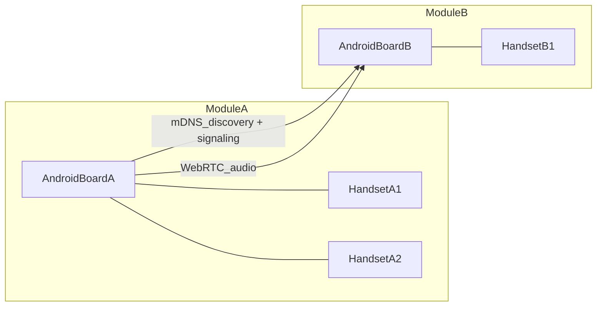

# 安卓板无中心对讲可行方案

## 1. 需求拆解与边界

- **已有条件**：通信模块通过 **射频自动组网** 组成 mesh，对安卓板提供扁平 IP 且模块间可互通；每个模块具备独立 IP。

- **新目标**：在每个通信模块下挂载 `1~N` 个对讲终端（逻辑或物理），并可与其他模块的终端对讲。

- **保密任务**：出任务时临时组专属群，由 **射频任务密钥** 物理隔离；应用层任务密钥用于信令完整性与任务内频道分组。密钥生命周期由运维处理，应用不自动擦除射频密钥。

- 本期范围：仅在安卓板实现无中心对讲，不纳入 GPS 与其他功能。

- 非目标：统一调度平台、录音审计、跨公网穿透、历史轨迹、AI 语音处理。

## 2. 推荐总体架构（无中心、RF mesh 承载）

**承载**：模块间 IP 连通由 **同密钥 RF mesh** 提供；与 ANT PTT 同类为无中心射频组网，差异在应用层采用标准 IP 协议栈（mDNS + UDP + WebRTC）。

- **射频层（带外）**：任务密钥准入、现场换钥、mesh 多跳；决定谁能入网。

- **设备发现层**：在已入网前提下，使用 `mDNS/NSD`（辅）+ **静态 Peer**（主）发现在线模块与能力（模块 ID、编解码、终端数）。多跳 mesh 上组播可能丢包，静态 Peer 不可省。

- **去中心信令层**：模块间点对点交换呼叫控制消息（呼叫、应答、挂断、抢占、心跳）。`HELLO` 同步端点目录，**不承担射频准入**。

- **媒体层**：`WebRTC` 承载语音流（Opus + 抖动缓冲 + 丢包隐藏）。

- **组内映射层**：安卓板维护「本模块终端列表」，把本地 `1~N` 对讲机映射成可寻址的逻辑分机。

## 3. 核心功能设计（首版）

- **寻址模型**：`moduleId + endpointId`，例如 `M01-E03`。

- **呼叫模式**：

  - 单呼：`M01-E01 -> M02-E01`

  - 组呼（同模块/跨模块）：由发起端维护目标列表并并发建立会话

- **PTT 状态机**：`Idle -> RequestFloor -> Talk -> ReleaseFloor -> Idle`

- **抢权规则（无中心）**：

  - 默认先到先得（时间戳 + 模块 ID 字典序做冲突裁决）

  - 可配置优先级（已产品化：绑定 Task Profile，普通 / 指挥 / 紧急三档；随 Profile 切换生效并经 `HELLO` 目录同步）

- **在线状态**：`HELLO` + 心跳 + 超时摘除，列表实时更新。

- **多群**：保存多把射频任务密钥，人为切换后轮流监听（串行，切走漏话）。

## 4. 安卓端实现分层

- `DeviceDiscoveryManager`：NSD + 静态 Peer 发现与上下线管理。

- `SignalingChannel`：mesh IP 子网上的信令传输（当前 UDP；V3 规划 TCP/WebSocket）。

- `PttSessionManager`：会话创建、冲突裁决、Floor 控制。

- `WebRtcAudioEngine`：采集/编码/传输/播放，统一音频参数。

- `EndpointRegistry`：本模块下挂对讲机清单与能力管理。

- `UiController`：频道列表、在线状态、PTT 按键与告警提示。

## 5. 协议与参数建议（首版默认）

- 音频编码：`Opus`，16k/mono 起步（后续按带宽动态上调）。

- 端到端时延目标：`<300ms`（同 RF mesh 内可达）。

- 丢包容忍：启用 PLC/FEC，目标在 `5%` 丢包下可懂度可接受。

- 心跳周期：`1s`，离线判定 `3~5s`。

- 安全：**射频任务密钥** 为保密边界；应用层至少做模块白名单 + 信令签名校验（建议 HMAC-SHA256）；媒体 DTLS-SRTP 强化见 V3。

## 6. 分阶段落地计划

- **阶段 A：单链路打通（1~2 周）**

  - 两块安卓板在**同 RF mesh** 内互发现

  - 单呼 PTT（单终端对单终端）

  - 基础音质与时延验收

- **阶段 B：多终端挂载（2~3 周）**

  - 每模块支持 `1~N endpoint`

  - endpoint 路由与占线管理

  - 组呼与冲突裁决

- **阶段 C：工程化稳定（1~2 周）**

  - 弱网恢复、断线重连、日志埋点

  - 压测与长稳测试（8h/24h）

  - 射频换钥后应用自动重新发现联调

  - 形成可量产配置模板

## 7. 验收标准（建议）

- 功能：单呼/组呼/PTT 抢权/上下线通知全部通过。

- 性能：

  - 同 mesh 内对讲首包建立 `<1s`

  - 连续通话 30 分钟无崩溃

  - 10 模块并发在线时发现与呼叫稳定

- 可靠性：mesh 抖动下自动恢复，异常有日志可追溯。

- 保密：异射频密钥设备互不可见、不可呼叫。

## 8. 对你当前诉求的结论

- 需求可独立做「安卓无中心对讲」，不依赖中心服务器。

- 底层 **射频 mesh + 上层 WebRTC/去中心信令 + 模块内多 endpoint 映射** 可行且可演进；与 ANT PTT 在承载层同类，优势在于现场换钥建群与 IP 层组呼/会议抽象。

- 后续把 GPS 等功能并入同一安卓板时，可在当前分层架构上增量扩展，不需要推翻对讲核心。

