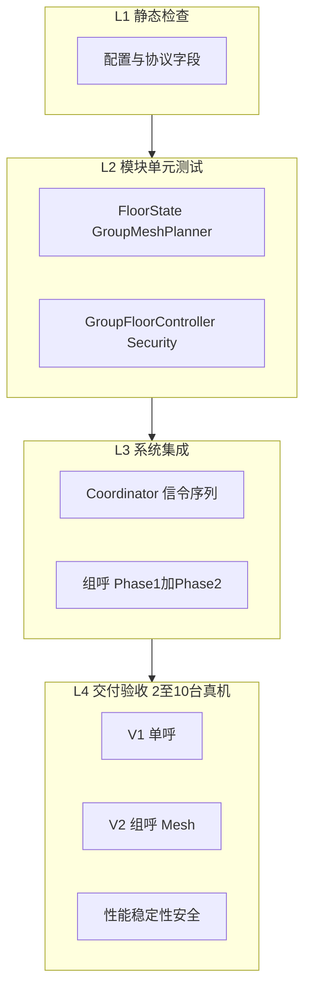

# 安卓无中心对讲 — 现场测试方案与执行手册

> 版本：V1.0  
> 适用范围：RF mesh 无中心对讲（单呼 V1、组呼 V2 Mesh、会议 B2、生产 App 运维）  
> 关联文档：[`交付验收清单.md`](交付验收清单.md)、[`acceptance-test-script.md`](acceptance-test-script.md)、[`系统设计-安卓无中心对讲.md`](系统设计-安卓无中心对讲.md)

---

## 1. 文档目的

本手册从**系统架构验收**角度，定义可执行的测试策略、环境搭建、用例步骤、度量方法与签收标准。  
目标不是仅验证 UI 可点，而是验证以下架构红线是否成立：

- module ↔ module 单 RTP，禁止 endpoint 级 Mesh
- 组呼 ≤5 module 受控 Mesh（Phase1 `GROUP_INVITE` + Phase2 `GROUP_JOIN`）
- 组呼 Floor 由**发起方 module** 唯一裁决并广播
- UDP 信令 + 签名校验 + 防重放（生产 App）
- 单活动会话、忙线拒接、自动重拨

---

## 2. 测试策略：四层金字塔



| 层级 | 目的 | 执行方式 | 门禁 |
|------|------|----------|------|
| **L1** | 配置/协议正确性 | 启动前人工检查 | 不通过不启动 L4 |
| **L2** | 算法与状态机 | `:android-board-talkback:testDebugUnitTest` 或 `scripts\run-unit-tests.bat` | 发版前必绿 |
| **L3** | 信令+会话编排 | Stub WebRTC + 内存 Signaling（后续补充） | 可选 |
| **L4** | 真实语音与网络 | 本手册主体 | 签收依据 |

**执行原则**：L2 不过不进 L4；L4 必须覆盖组呼 3 机 Mesh 与 Floor 权威。

---

## 3. 测试环境与拓扑

### 3.1 硬件矩阵

| 阶段 | 设备数 | 用途 | 优先级 |
|------|--------|------|--------|
| Smoke | 2 台 | V1 单呼、PTT、安全 | P0 |
| Core | 3 台 | V2 组呼 Mesh、Floor 权威 | **P0 必做** |
| Scale | 10 台 | 发现 soak、忙线 | P1 |
| Prod | 2 台 | `talkback-app` 前台服务/自启动 | P1 |

### 3.2 网络要求

- 所有设备使用**同一射频任务密钥**，处于**同一 RF mesh**（扁平 IP 子网，无跨密钥域）
- 设备间 IP 互通（`ping` 可达）；不依赖外部 Wi-Fi / 以太网交换机
- 信令端口 UDP 在 mesh 内可达（模块本地防火墙未批量阻断）
- 多跳 mesh 场景：mDNS 组播可能不稳定，**静态 Peer 必须配置**并与 mDNS 双保险
- 保密任务验收：准备至少一组**异射频密钥**设备，验证互不可见、不可呼叫

```
[同一 RF mesh / 同任务密钥]
  M01 (.101)  M02 (.102)  M03 (.103) ... M10 (.110)
       \___________|___________/
         射频 mesh 多跳（带外换钥）
```

### 3.3 推荐设备配置

#### talkback-app 三机组呼 / 会议（推荐）

| 设备 | moduleId | endpointId | 信令端口 | 角色 |
|------|----------|------------|----------|------|
| 板 A | M01 | E01 | 50000 | 频道发起方 |
| 板 B | M02 | E01 | 50001 | 频道成员 |
| 板 C | M03 | E01 | 50002 | 频道成员 |

三台使用相同 `channelId`、相同 `sharedSecret`；Service 中 staticPeers 互指。半双工组呼关闭会议模式；全双工会议在 My Identity 中开启 **Full-duplex conference mode**。

#### talkback-app 生产验证

| 项 | 要求 |
|----|------|
| sharedSecret | 全体一致 |
| allowedModuleIds | 按项目要求配置白名单 |
| staticPeers | 互指 `moduleId` + IP + port |
| autoRedial | 重拨用例时开启 |

### 3.4 发现模式（各测一轮）

| 模式 | 配置 | 验证目标 |
|------|------|----------|
| **Gossip 子网探测（主）** | staticPeers 为空，默认启用 | 零配置现场主路径 |
| **mDNS（辅）** | 开启 NSD，可不用静态 Peer | 同跳即插即用 |
| **手动 Peer 覆盖** | 填写 staticPeers JSON | 排障 / 覆盖自动发现 |

---

## 4. 观测与记录方法

### 4.1 数据采集

每台被测设备同步记录：

| 数据源 | 命令/位置 | 记录内容 |
|--------|-----------|----------|
| App 内 log | logcat / adb | 信令、Floor、Mesh、会议事件 |
| logcat | `adb logcat \| findstr talkback` | 崩溃、Coordinator 错误 |
| QoS / 网络 | Talk 页 Network 指示 | ICE 连通与网络质量 |
| Wireshark（可选） | 过滤 UDP 信令端口 | 验签、报文类型、无中心 |
| 听感 | 人工 | PTT 半双工、可懂度 |

### 4.2 关键 log 关键字

| 场景 | 期望 log（部分匹配即可） |
|------|---------------------------|
| 单呼建立 | `Outgoing call`、`Call accepted` |
| 组呼 Phase1 | `Group call`、`Group invite accepted` |
| 组呼 Phase2 Mesh | `Group mesh join offered`、`Group mesh link accepted` |
| Floor 权威 | 非发起方 PTT 后，发起方处理；各成员听感与 floor 一致 |
| ICE 连通 | `ICE Mxx state=CONNECTED` |
| Mesh 发现失败 | `Mesh join skipped: Mxx not discovered` |
| 自动重拨 | `Auto redial` 或新 session 建立 |
| 安全失败 | 密钥不一致时无 session / 无 accept |
| 会议 pending 拒 GROUP | `Rejecting GROUP invite while conference active/preferred/pending` |
| 会议邀请过期 | `Conference invite expired` |
| 会议成员状态 | UI：`Inviting…` / `Connecting…` / `No answer`；log：`Conference invite accepted` + `ICE … CONNECTED` |

### 4.4 会议状态机现场用例（TC-CONF）

| 编号 | 场景 | 步骤 | 通过标准 |
|------|------|------|----------|
| TC-CONF-01 | pending 期间组呼互斥 | M01 发起会议；M02 关闭自动入会，收到邀请后不点 Join；M02 长按 PTT | M02 不建立 GROUP session；log 含拒 GROUP；会议邀请仍 pending |
| TC-CONF-02 | 延迟 Join | 同上，等待 5s 后 M02 点 Join | log `Conference invite accepted`；M01 UI 该成员由 Inviting→Connecting→Online；ICE CONNECTED |
| TC-CONF-03 | UI 不误导 | M01 邀请 M02/M03，仅 M03 接听 | M01 人数角标 = 2（本机+M03）；M02 显示 `Inviting…` 或 `No answer`，不计入在会 |
| TC-CONF-04 | 邀请过期 | M02 收到邀请 30s 不操作 | M02 pending 清除；M01 侧 M02 标记未接听；可重拨 |
| TC-CONF-05 | 三端全入会 | 标准会议流程，测试期间不按 PTT | 三台 `ICE … CONNECTED`；M01 connectedRemotes=2 |

详见 [`会议组呼状态机重构方案.md`](会议组呼状态机重构方案.md)。

### 4.4.1 PTT 冷启动（TC-PTT）

| 编号 | 场景 | 步骤 | 通过标准 |
|------|------|------|----------|
| TC-PTT-01 | 冷启动可发麦 | 3 台同密钥零配置；仅 Start Service，**不按 PTT**；打开 Talk 页观察 | **≤5s** 显示队友（onlineCount≥2）；横幅为「正在同步频道…」或「正在连接音频…」而非长期「正在发现队友…」；**≤8s** PTT 可按下（非 NoPeers）；log 含 `GROUP_INVITE` / `ICE … CONNECTED` |
| TC-PTT-ANCHOR | 6~8 人锚点转发 | 6~8 台同频道；观察拓扑与 failover | log 含 `topology=ANCHOR`；非锚点各 1 条 PC；锚点掉线后 **<2s** 次锚点接管；8 台无 maxModules 拒绝 |

详见 [`PTT冷启动加速方案.md`](PTT冷启动加速方案.md)、[`PTT媒体面架构-选举锚点方案.md`](PTT媒体面架构-选举锚点方案.md)。

### 4.5 信令序列参考（会议）

```text
Host: CONFERENCE solo → GROUP_INVITE* (sessionMode=CONFERENCE)
Callee (manual): pending → user Join → GROUP_ACCEPT → GROUP_JOIN* → ICE CONNECTED
Reject path: CALL_REJECT DECLINED / EXPIRED / BUSY
```

### 4.6 信令序列参考（单呼/组呼）

**单呼**

```text
CALL_INVITE → CALL_ACCEPT → WEBRTC_ICE* → FLOOR_REQUEST → FLOOR_GRANTED → FLOOR_RELEASE → HANGUP
```

**组呼（3 模块）**

```text
Phase1: GROUP_INVITE* → GROUP_ACCEPT*
Phase2: GROUP_JOIN (M02→M03) → GROUP_ACCEPT
PTT:    FLOOR_REQUEST (M02→M01) → FLOOR_GRANTED* (M01→全员)
```

测试失败时，将**实际 log 序列**与上表对比，定位是发现、信令、媒体还是 Floor 层问题。

---

## 5. Phase 0：启动前检查（L1）

**预计时间**：15 分钟  
**执行人**：测试工程师  
**通过标准**：全部勾选后方可进入 Phase 1

| ID | 检查项 | 方法 | Pass |
|----|--------|------|------|
| P0-01 | moduleId 全局唯一 | 目视各板配置 | ☐ |
| P0-02 | 信令端口不冲突 | 每 module 独立端口 | ☐ |
| P0-03 | 共享密钥一致 | talkback-app 配置 | ☐ |
| P0-04 | 自动发现或手动 Peer 已验证 | 默认留空 staticPeers；异常时再配 | ☐ |
| P0-05 | 同 RF mesh 互通 | ping 对端 IP | ☐ |
| P0-06 | 同任务射频密钥 | 全体密钥一致（带外确认） | ☐ |
| P0-07 | RECORD_AUDIO 已授权 | 首次启动确认 | ☐ |
| P0-08 | L2 单元测试通过 | Android Studio / Gradle test | ☐ |

---

## 6. Phase 1：V1 单呼验收（2 台）

**预计时间**：约 2 小时  
**App**：talkback-app  
**对应**：[`交付验收清单.md`](交付验收清单.md) §2–§4

### TC-V1-01 设备发现

| 步骤 | 操作 | 预期结果 | Pass |
|------|------|----------|------|
| 1 | M01、M02 启动 Runtime，等待 5s | 对端 module 出现在线数 | ☐ |
| 2 | 静态 Peer 模式 | 关闭 mDNS 仍可发现/呼叫 | ☐ |
| 3 | mDNS 模式 | 5s 内互相发现 | ☐ |

### TC-V1-02 单呼建立

| 步骤 | 操作 | 预期结果 | Pass |
|------|------|----------|------|
| 1 | M01-E01 Call M02-E01 | log 出现 `Outgoing call` / `Call accepted` | ☐ |
| 2 | 观察 QoS / ICE | `ICE M02 state=CONNECTED` | ☐ |
| 3 | 记录建链时间 | 点击 Call → CONNECTED **< 1s**（填 §8 KPI 表） | ☐ |

### TC-V1-03 PTT 半双工

| 步骤 | 操作 | 预期结果 | Pass |
|------|------|----------|------|
| 1 | M01 按住 PTT 说话 | M02 可听 | ☐ |
| 2 | M01 松开 PTT | Floor 释放，M02 可再抢 | ☐ |
| 3 | M01、M02 **同时**按 PTT | **仅一方**上行，无双讲 | ☐ |

### TC-V1-04 忙线 / 挂断 / 重拨

| ID | 操作 | 预期结果 | Pass |
|----|------|----------|------|
| TC-V1-04a | 通话中第三台呼叫占线方 | `CALL_REJECT` / BUSY | ☐ |
| TC-V1-04b | 任一方 Hangup | 双方 sessions=0，媒体释放 | ☐ |
| TC-V1-04c | 关闭 M02 再上线，autoRedial 开 | 自动重拨成功 | ☐ |

### TC-V1-05 安全与协议

| ID | 操作 | 预期结果 | Pass |
|----|------|----------|------|
| TC-V1-05a | 检查 outbound 信令 | 含 `nonce`、`signature` | ☐ |
| TC-V1-05b | M02 故意配置错误 sharedSecret | 无法建立会话 | ☐ |
| TC-V1-05c | 启用白名单，未授权 module 呼叫 | 被叫无响应 / 拒绝 | ☐ |
| TC-V1-05d | 防重放（可选高级） | 同 nonce 重放被拒绝 | ☐ |

### TC-V1-06 稳定性

| ID | 方法 | 通过标准 | Pass |
|----|------|----------|------|
| TC-V1-06a | 单呼保持 30min，每 5min 交替 PTT | 无 crash、无 ANR | ☐ |
| TC-V1-06b | 路由器/sim 模拟 5% UDP 丢包 | 语音可懂，会话不断 | ☐ |
| TC-V1-06c | 短时断开 mesh 链路（关射频/拔天线 3s）后恢复 | 可再次呼叫 / 自动重拨 | ☐ |
| TC-V1-06d | mesh 恢复后 | NSD/静态 Peer 发现恢复 | ☐ |
| TC-V1-06e | 异射频密钥设备在同场 | 双方发现列表互不可见 | ☐ |

---

## 7. Phase 2：V2 组呼 Mesh 验收（3 台）— 必做

**预计时间**：约 3 小时  
**架构验证**：Phase1 INVITE + Phase2 JOIN + 发起方 Floor 权威

### TC-V2-01 三模块组呼建立

**前置**：M01/M02/M03 均已启动 Runtime 且互相可发现（或静态 Peer 已配）

| 步骤 | 操作 | 预期 log / 现象 | Pass |
|------|------|-----------------|------|
| 1 | M01 发起 Group，`M02-E01,M03-E01` | `Group call ... targets=2` | ☐ |
| 2 | 观察 M02 | `Group invite accepted` | ☐ |
| 3 | 观察 M03 | `Group invite accepted` | ☐ |
| 4 | 观察 M02 | `Group mesh join offered -> M03` | ☐ |
| 5 | 观察 M03 | `Group mesh link accepted M02` | ☐ |
| 6 | 三方 QoS | 所需 ICE 均为 CONNECTED | ☐ |

**架构断言**：M02 与 M03 之间存在直连媒体链路，不仅通过 M01 转发。

### TC-V2-02 组内 PTT 轮流发言

| 轮次 | 发言方 | 应听到方 | Pass |
|------|--------|----------|------|
| 1 | M02 PTT | M01、M03 可听 | ☐ |
| 2 | M03 PTT | M01、M02 可听 | ☐ |
| 3 | M01 PTT | M02、M03 可听 | ☐ |

### TC-V2-03 组内 PTT 冲突

| 步骤 | 操作 | 预期结果 | Pass |
|------|------|----------|------|
| 1 | M02、M03 同时按 PTT | 仅一方 GRANTED，无双讲 | ☐ |
| 2 | M02 持麦讲话中，M03（Task Profile 设为 EMERGENCY）按 PTT | M03 抢占成功；M02 收到「已被更高优先级打断」提示，PTT 回到空闲 | ☐ |
| 3 | M02（DISPATCH）在 M03（NORMAL）持麦时按 PTT | M02 被拒绝，M03 继续讲话 | ☐ |

### TC-V2-04 组呼挂断

| 步骤 | 操作 | 预期结果 | Pass |
|------|------|----------|------|
| 1 | M02 Hangup | 相关方 session 清理 | ☐ |
| 2 | 再次发起组呼 | Phase1+2 可重新完成 | ☐ |

### TC-V2-05 HELLO 目录同步

| 步骤 | 操作 | 预期结果 | Pass |
|------|------|----------|------|
| 1 | 启动后等待 3s | log: `HELLO from Mxx endpoints=N` | ☐ |
| 2 | 查看 UI/状态 | 可见对端 endpoint 在线信息 | ☐ |

### TC-V2-06 手动 Peer 覆盖组呼

| 步骤 | 操作 | 预期结果 | Pass |
|------|------|----------|------|
| 1 | 填写 staticPeers，关闭 mDNS | TC-V2-01～03 仍通过 | ☐ |

### TC-DISC-01 零配置发现（3 台）

| 步骤 | 操作 | 预期结果 | Pass |
|------|------|----------|------|
| 1 | 3 台同密钥，Task Profile 中 staticPeers 留空 | — | ☐ |
| 2 | 各台 Start Service，等待 30s | Talk 页互相看到在线 module | ☐ |

### TC-DISC-02 多跳 mesh 零配置（5 台）

| 步骤 | 操作 | 预期结果 | Pass |
|------|------|----------|------|
| 1 | 5 台多跳 mesh，无 staticPeers | — | ☐ |
| 2 | 等待 60s | 全员互见 | ☐ |

### TC-DISC-03 异密钥隔离

| 步骤 | 操作 | 预期结果 | Pass |
|------|------|----------|------|
| 1 | 2 组异密钥设备同网段 | — | ☐ |
| 2 | 各组 Start Service | 组间互不可见、不可呼叫 | ☐ |

### TC-DISC-04 切换 Task Profile 重发现

| 步骤 | 操作 | 预期结果 | Pass |
|------|------|----------|------|
| 1 | 设备从 Profile A 切到 Profile B | 确认切换 | ☐ |
| 2 | 等待 30s | A 组成员消失，B 组成员出现 | ☐ |

---

## 8. Phase 3：容量与性能（Scale）

**预计时间**：约 4 小时（可与 Phase 1 并行部分项）

### TC-P-01 发现 soak（10 module）

| 项 | 方法 | KPI | 实测 | Pass |
|----|------|-----|------|------|
| 在线发现 | 10 台同时 Runtime 5min | 各台看到 9 个远端 module | | ☐ |
| 抽样呼叫 | M01 单呼 M05 ×10 次 | 成功率 ≥ 95% | | ☐ |

### TC-P-02 性能 KPI

| 指标 | 测量方法 | 目标 | 实测 | Pass |
|------|----------|------|------|------|
| 建链首包 | Call 点击 → 首次听到声音（录屏+log 时间戳） | < 1s | ____ ms | ☐ |
| 端到端时延 | 节拍器/对敲声，录屏逐帧估算 | < 300ms | ____ ms | ☐ |
| 组呼建链 | Group 点击 → 末条 `mesh link accepted` | < 3s（建议内控） | ____ ms | ☐ |
| 10 模块稳定 | soak 期间可呼叫 | 稳定 | ____ 台 | ☐ |

**时延粗测法（无需改代码）**：

1. 双机录屏，PTT 按下与声音出现同屏  
2. 逐帧计算时间差；或使用 log 中 PTT 与 ICE/音频相关时间戳差值

---

## 9. Phase 4：生产 App 运维（talkback-app）

**预计时间**：约 1 小时  
**对应**：[`交付验收清单.md`](交付验收清单.md) §6

| ID | 用例 | 通过标准 | Pass |
|----|------|----------|------|
| TC-OPS-01 | 前台服务 Start/Stop | 通知栏常驻；Stop 后停止 | ☐ |
| TC-OPS-02 | 通知栏 Stop 动作 | 服务正常退出 | ☐ |
| TC-OPS-03 | 开机自启动（开） | 重启后服务自动起 | ☐ |
| TC-OPS-04 | 开机自启动（关） | 重启后不自动起 | ☐ |
| TC-OPS-05 | UI 配置校验 | 非法 moduleId/端口/JSON 被拒绝 | ☐ |
| TC-OPS-06 | 状态广播 | UI 收到 RUNNING/STOPPED/ERROR | ☐ |
| TC-OPS-07 | QoS 日志 | 可查看 ICE 状态摘要 | ☐ |
| TC-OPS-08 | Channel 页（单频道） | 仅展示当前 `channelId` 状态（讲话/在线/网络），无多频道列表或切换入口 | ☐ |
| TC-OPS-09 | Contacts 分组 | Online / Offline 端点分组与 HELLO 同步一致 | ☐ |
| TC-OPS-10 | Settings 分组 | Identity → 保存；Network → 启停服务；Security/General 配置持久化 | ☐ |

**UI 说明（V1）**：每台设备配置一个组呼 `channelId`（Settings → My Identity）。全网需使用相同 channel ID 才能组呼；Channels 页不提供第二频道。

---

## 10. 架构红线检查表（L4 每轮必勾）

| 红线 | 验证用例 | 违反现象 |
|------|----------|----------|
| module ↔ module 单 RTP | TC-V2-01 | 每对 module 重复建链 / 媒体风暴 |
| 禁止 endpoint Mesh | 组呼全程 | endpoint 级多条 PC |
| 组呼 Mesh 完整 | TC-V2-02 | M02 发言 M03 听不到 |
| 发起方 Floor 权威 | TC-V2-02/03 | 非 M01 本地擅自 GRANT |
| 单活动会话 | TC-V1-04a | 占线未 BUSY |
| UDP 信令不变 | 抓包（可选） | 信令仍为 UDP JSON |

| 红线 | Pass |
|------|------|
| 以上全部符合 | ☐ |

---

## 11. 缺陷严重度与处理

| 级别 | 定义 | 示例 | 签收影响 |
|------|------|------|----------|
| **S0** | 崩溃、泄密、双讲 | 同时 PTT 双向有声 | **不可签收** |
| **S1** | 主流程不可用 | 3 机 Mesh 失败 | V2 不可签 |
| **S2** | 弱网/边缘 | 5% 丢包严重断续 | 有条件签 |
| **S3** | UI/可观测性 | QoS 无 RTT 数值 | 可签，Phase C 跟进 |

---

## 12. 签收标准

### V1 签收（需全部满足）

- [ ] Phase 0 通过  
- [ ] TC-V1-01～06 通过  
- [ ] 30min 无 crash（TC-V1-06a）  
- [ ] 安全项 TC-V1-05a～c 有记录  
- [ ] §13 KPI 表已填写（可略超目标但需写风险说明）

### V2 签收（在 V1 基础上）

- [ ] TC-V2-01～06 通过  
- [ ] **M02/M03 互听**（TC-V2-02 轮次 1、2）  
- [ ] 组内同时 PTT 无双讲（TC-V2-03）  
- [ ] §10 架构红线全部勾选  

### 不建议签收

- 3 机组呼未测  
- log 缺少 `GROUP_JOIN` / `mesh link accepted`  
- 同时 PTT 出现双讲  

---

## 13. 测试记录表

### 13.1 环境信息

| 项目 | 内容 |
|------|------|
| 测试日期 | |
| 测试人员 | |
| 网络环境 | RF mesh 任务密钥 / 跳数 / 子网： |
| Android 版本 | |
| App 版本 | talkback-app，build： |
| 发现模式 | 静态 Peer / mDNS / 混合 |
| 备注 | |

### 13.2 设备清单

| 设备 | 型号 | IP | moduleId | endpointId | 端口 | Pass |
|------|------|-----|----------|------------|------|------|
| 板 A | | | M01 | E01 | 50000 | |
| 板 B | | | M02 | E01 | 50001 | |
| 板 C | | | M03 | E01 | 50002 | |
| … | | | | | | |

### 13.3 KPI 记录

| 指标 | 目标 | 实测值 | Pass |
|------|------|--------|------|
| 建链首包 | < 1s | ____ ms | ☐ |
| 端到端时延 | < 300ms | ____ ms | ☐ |
| 10 模块在线 | 10 | ____ 台 | ☐ |
| 30min 通话 | 无 crash | 是 / 否 | ☐ |

### 13.4 用例汇总

| 用例 ID | 名称 | 结果 Pass/Fail | 缺陷 ID | 备注 |
|---------|------|----------------|---------|------|
| TC-V1-01 | 设备发现 | | | |
| TC-V1-02 | 单呼建立 | | | |
| TC-V2-01 | 三模块组呼 | | | |
| … | | | | |

### 13.5 缺陷列表

| 缺陷 ID | 级别 | 描述 | 复现步骤 | 状态 |
|---------|------|------|----------|------|
| | | | | |

### 13.6 签收结论

| 项目 | 结论 |
|------|------|
| V1 是否建议签收 | 是 / 否 |
| V2 是否建议签收 | 是 / 否 |
| 主要风险 | |
| 架构师签字 | |
| 日期 | |

---

## 14. 建议执行节奏（2 周）

| 时间 | 内容 | 产出 |
|------|------|------|
| W1 D1–D2 | Phase 0 + Phase 1 + L2 单测 | V1 记录 |
| W1 D3–D4 | Phase 2（静态 Peer + mDNS 各一轮） | Mesh/Floor log |
| W1 D5 | TC-V1-06 稳定性 | 30min / 弱网记录 |
| W2 D1–D2 | Phase 3 十模块 + KPI | §13.3 填实 |
| W2 D3 | Phase 4 talkback-app | 运维项勾选 |
| W2 D4 | 回归 + 缺陷关闭 | 签收评审 |

---

## 15. 附录：弱网模拟参考

### Android / 路由器

| 方式 | 说明 |
|------|------|
| Linux 路由器 `tc netem` | `loss 5%` 作用于 mesh 网关出口（如有） |
| Windows Clumsy | 过滤 UDP 信令/RTP 端口，5% loss |
| 距离 / 干扰 | 拉大射频距离或遮挡（定性测试） |

### 通过标准

- 5% 丢包下语音**可懂**（允许轻微断续，不可完全无声或频繁断 session）

---

## 16. 附录：logcat 采集命令

### 16.1 脚本（推荐）

```powershell
cd talkback
.\scripts\collect-logcat.ps1 -DurationSec 600 -OutDir .\test-logs
```

参数说明：

| 参数 | 说明 |
|------|------|
| `-DeviceId` | 多设备时指定 adb 设备 ID |
| `-DurationSec` | 采集秒数，0 表示手动 Ctrl+C 结束 |
| `-OutDir` | 输出目录，默认 `test-logs` |
| `-TagFilter` | log 过滤正则 |

### 16.2 手动命令

```bash
# Windows PowerShell 示例
adb logcat -c
adb logcat | findstr /i "talkback Coordinator ICE Group Floor"
```

建议每轮测试保存一份 log 文件，命名：`YYYYMMDD_TC-V2-01_M01.log`。

---

## 17. 附录：自动化测试（L2 / L3）

### 17.1 环境准备

1. 安装 JDK 17+
2. 安装 Android SDK，复制 `local.properties.example` 为 `local.properties` 并设置 `sdk.dir`
3. 在项目根目录 `talkback/` 执行：

```bat
scripts\run-unit-tests.bat
```

或：

```bat
gradlew.bat :android-board-talkback:testDebugUnitTest
```

报告路径：`android-board-talkback/build/reports/tests/testDebugUnitTest/index.html`

### 17.2 测试覆盖

| 类型 | 位置 | 说明 |
|------|------|------|
| 单元测试 | `src/test/.../FloorStateTest` 等 | Floor、Mesh 规划、Payload |
| 集成测试 | `TalkbackCoordinatorIntegrationTest` | 内存信令 + Stub WebRTC，三机组呼 Mesh |
| 集成测试 | `ConferenceSessionStateTest` | pending 拦 GROUP、邀请原子性、memberViews |
| 集成测试 | `ChannelModeFsmTest` | per-channel 模式互斥 |

集成测试**不能替代** L4 真机听音验收。

---

## 18. 修订记录

| 版本 | 日期 | 说明 |
|------|------|------|
| V1.2 | 2026-06-15 | 会议/组呼状态机：TC-CONF 用例、会议 log 关键字 |
| V1.1 | 2026-06-01 | 增加 Gradle Wrapper、自动化测试与 logcat 脚本 |
| V1.0 | 2026-06-01 | 初版：L1–L4 策略、V1/V2 用例、KPI 与签收表 |
