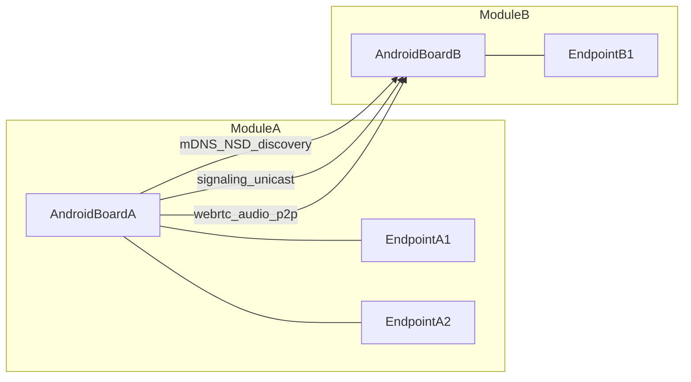

# 安卓无中心对讲系统设计文档（V1.0）

## 1. 目标与范围

- 目标：在安卓板实现无中心对讲，支持每个通信模块挂载 `1~N` 个对讲终端，并实现模块间互讲。
- **网络前提**：底层为 **射频自动组网（RF mesh）**；同射频任务密钥的设备组成 mesh，对上层提供 **扁平 IP 子网**。应用层在已入网前提下使用 mDNS/静态 Peer 发现与 WebRTC 传输（非依赖 Wi-Fi/以太网等外部基础设施）。
- **保密组网**：组网准入由 **射频任务密钥** 在链路层圈定（密钥不同无法进同一 mesh）；应用层 `sharedSecret` 用于信令完整性与防重放，以及任务内 `ChannelManager` 逻辑分组，**不作为网络门禁**。密钥下发与生命周期由运维/带外配置处理，应用不自动擦除射频密钥。
- 本期范围：对讲（PTT）、设备发现、信令、媒体传输、多终端映射与路由。
- 非目标：GPS 功能、录音审计、跨公网穿透、统一调度后台。

## 2. 术语与标识模型

- `moduleId`：通信模块唯一标识，例如 `M01`。
- `endpointId`：模块下终端标识，例如 `E03`。
- `endpointKey`：全局终端键，格式 `moduleId-endpointId`，例如 `M01-E03`。
- `floor`：发言权（半双工）。

## 3. 总体架构

**承载说明**：上图模块间连通建立在 **同一 RF mesh（同射频任务密钥）** 之上；mesh 多跳场景下 mDNS 组播可能不稳定，须以 **静态 Peer** 为主、mDNS 为辅（`CompositeModuleDiscoveryService`）。

### 3.1 分层职责

- 射频层（带外）：组网准入、mesh 多跳、现场换钥；与 Talkback 应用解耦。
- 发现层：在已入网前提下，基于 `mDNS/NSD` + 静态 Peer 的模块发现和上下线感知。
- 信令层：模块间点对点交换控制消息（呼叫、应答、挂断、抢权、心跳）。
- 媒体层：`WebRTC` 音频链路（Opus + 抖动缓冲 + 丢包隐藏）。
- 终端映射层：维护本模块 `1~N` 终端注册表，完成终端寻址与路由。
- 会话层：PTT 状态机、floor 抢权与会话生命周期管理。

## 4. 核心流程设计

## 4.1 设备发现流程

1. 射频层完成 mesh 入网后，模块发布自身服务信息（`moduleId`、地址、端口、能力）。
2. 监听 mesh 内服务变化（mDNS + 静态 Peer）并更新在线模块列表；仅同射频任务密钥域内的模块可见。
3. 通过 `HELLO` / 心跳维持在线状态，超时后摘除离线模块。
4. 射频换钥后退出旧 mesh、进入新 mesh，应用层依赖发现机制自动重新收敛成员列表。

## 4.2 单呼建立流程

1. 发起端发送 `CALL_INVITE`（携带会话信息和协商参数）。
2. 被叫端返回 `CALL_ACCEPT` 或 `CALL_REJECT`。
3. 双方完成 WebRTC 协商并建立音频通道。
4. 任一方发送 `HANGUP` 后结束会话并释放资源。

## 4.3 PTT 抢权流程

状态机：`Idle -> RequestFloor -> Talk -> ReleaseFloor -> Idle`

1. 按下 PTT：进入 `RequestFloor`，发送 `FLOOR_REQUEST`。
2. 授权成功：进入 `Talk`，启动本地采集上行。
3. 松开 PTT：进入 `ReleaseFloor`，发送 `FLOOR_RELEASE`。
4. 会话空闲：回到 `Idle`，等待下一次请求。

## 4.4 Floor 冲突裁决规则

会话内维护显式状态：`floor_owner`、`floor_epoch`、`floor_version`。

- 抢权请求携带 `floorVersion` / `floorEpoch` / `priority`（JSON payload）。
- 对端使用 CAS：仅当版本有效时授予 `FLOOR_GRANTED`，否则 `FLOOR_DENY`。
- 冲突时仲裁顺序：优先级 > 请求序号（信令时间戳）> `moduleId` 字典序 > `endpointId` 字典序。
- **抢占**：仅 `EMERGENCY` 可打断正在讲话的低优先级持麦方；权威方向全员广播 `FLOOR_GRANTED`，并向被抢占方定向 `FLOOR_PREEMPTED`。
- `DISPATCH` 仅在同时争用（尚无持麦方）时优先于 `NORMAL`；持麦期间不可抢麦。
- 裁决所用优先级以 `HELLO` 目录登记为准（自报值仅作目录缺失时的回退），防止单次 PTT 自抬身价。
- 不依赖终端墙钟同步。

## 4.5 媒体拓扑

- 模块间：**module ↔ module** 单条 WebRTC/RTP。
- 模块内：多 endpoint 由 `ModuleAudioMixer` / `AudioRouter` 分发，禁止 endpoint 级 Mesh。
- **组呼（≤5 module，含发起方）**：Module 级受控 Mesh。
  - Phase1：发起方通过 `GROUP_INVITE` 与各成员建链。
  - Phase2：成员间由 `GroupMeshPlanner` 按 `moduleId` 字典序补发 `GROUP_JOIN`（较小 ID 为 offerer）；与发起方已有链路不再重复。
  - Floor 裁决：发起方 module 为唯一权威；`FLOOR_REQUEST` 发往权威，裁决结果 `FLOOR_GRANTED` / `FLOOR_DENY` 广播全员。
- 组呼规模 > 5 模块时建议演进 SFU-lite（见 `docs/V3-roadmap.md`）。

## 5. 协议与消息模型

### 5.1 消息头建议字段

- `msgType`：消息类型
- `sessionId`：会话标识
- `from`：源终端（`moduleId + endpointId`）
- `to`：目标终端（可为空用于广播通知）
- `timestampMs`：发送时间戳
- `payload`：业务负载

### 5.2 消息类型

- 发现与保活：`HELLO`、`HEARTBEAT`
- 呼叫控制：`CALL_INVITE`、`CALL_ACCEPT`、`CALL_REJECT`、`HANGUP`
- 发言权控制：`FLOOR_REQUEST`、`FLOOR_GRANTED`、`FLOOR_RELEASE`
- 媒体协商：`WEBRTC_OFFER`、`WEBRTC_ANSWER`、`WEBRTC_ICE`

## 6. 容量与性能目标

- 音频编码：`Opus 16kHz mono`（后续可动态调整）
- 首包建立时间：`< 1s`（同 RF mesh 内）
- 端到端时延：`< 300ms`
- 丢包容忍：`5%` 丢包下保持可懂度
- 在线模块规模：10 模块稳定在线可发现、可呼叫
- 稳定性：30 分钟连续通话无崩溃

## 7. 安全与可靠性

- **组网准入（保密边界）**：射频任务密钥；异密钥设备无法进同一 mesh，应用层不可见。
- **应用层辅助**：模块白名单；信令签名校验（建议演进 HMAC-SHA256）；防重放（时间戳 + nonce）。
- **多群切换**：单射频同一时刻仅处于一个密钥域；人为切换射频密钥可轮流监听不同任务群（切走漏话）；非同时跨密钥并行监听。
- 可靠性机制：
  - 心跳周期：1s
  - 离线判定：3~5s
  - 异常恢复：断线重连与会话释放策略

## 8. 实现分层与模块边界

- `DeviceDiscoveryManager`：发现与上下线管理
- `SignalingChannel`：信令收发与回调
- `PttSessionManager`：会话编排、抢权、状态迁移
- `WebRtcAudioEngine`：音频采集、编码、传输、播放
- `EndpointRegistry`：模块内多终端注册与寻址
- `UiController`：频道列表、在线状态、PTT 控件

## 9. 里程碑计划

- 阶段 A（1~2 周）：发现 + 单呼 + PTT 基线打通
- 阶段 B（2~3 周）：多终端挂载 + 组呼 + 冲突裁决
- 阶段 C（1~2 周）：弱网恢复 + 压测 + 参数固化

## 10. 验收标准

- 功能验收：单呼、组呼、PTT 抢权、上下线通知均通过
- 性能验收：首包建立 `<1s`，端到端时延 `<300ms`
- 稳定性验收：10 模块在线稳定，30 分钟通话不崩溃
- 可运维性：异常有日志、可追踪、可复现
