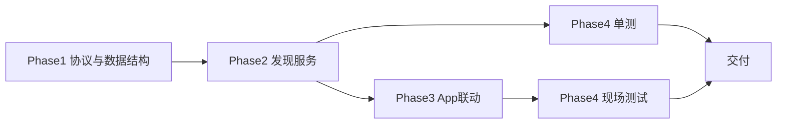

# 零配置寻址（Subnet Sweep + Gossip）实现计划

> 版本：V1.0（计划）  
> 日期：2026-06-10  
> 前置：路线 A 已完成（HMAC 信令、Task Profile、切换流程）  
> 关联：[`保密组网使用手册.md`](保密组网使用手册.md)、[`系统设计-安卓无中心对讲.md`](系统设计-安卓无中心对讲.md)

---

## 1. 目标与约束

### 1.1 要解决的问题

当前 Talkback 在 RF mesh 获得扁平 IP 后，仍需在 Task Profile 中**手填 Static Peers JSON**（`moduleId + host + port`），操作体验显著差于 ANT「换密钥即用」。

根因：**RF mesh 只提供 L3 连通性，不提供 `moduleId → IP:port` 映射**；mDNS 在多跳 mesh 上不可靠，static peers 成为主路径。

### 1.2 本方案目标

| 目标 | 说明 |
|------|------|
| **零配置寻址** | 正常出任务时 Static Peers **默认为空**，操作员无需维护地址表 |
| **纯软件** | 不依赖射频模块在线节点 API、不绑定固定寻址规则 |
| **厂商无关** | 任意 RF mesh + 扁平 IP 子网均可工作 |
| **保密自洽** | 寻址边界与任务密钥一致：异密钥设备互不可见 |
| **可演进** | 保留 static peers / mDNS 作为兜底与排障覆盖 |

### 1.3 明确不做

- 不引入硬件绑定或固定 `moduleId → IP` 映射规则
- 不依赖子网广播/组播（多跳 mesh 不可靠）
- 不改变路线 A 的射频密钥保密边界定位
- 不在本阶段实现 DTLS-SRTP 或可靠信令通道

---

## 2. 方案总览

```
冷启动（Static Peers 为空）
  │
  ├─① SubnetSweep：从本机网卡推导子网，对每个 IP 单播 DISCOVERY_PROBE
  │     （打到统一发现端口，见 §4.2）
  │
  ├─② 同任务密钥设备收到 PROBE → 回 DISCOVERY_ANNOUNCE（HMAC 签名）
  │     payload 含：本机 moduleId、host、signalingPort、endpointCount
  │                 + knownPeers[]（PEX 八卦扩散）
  │
  ├─③ 验签通过 → 合并 roster → ModuleDiscoveryService 回调
  │     一次 ANNOUNCE 可带回整网已知节点，扫描只需「引爆」
  │
  └─④ 收敛后：PROBE 退避到低频；周期性 ANNOUNCE 保活；TTL 剔除离线节点
        HELLO 继续在业务层同步 endpoint 目录（职责不变）
```

**与现有组件关系**：

| 组件 | 变更 |
|------|------|
| `SignalSecurity` | 复用，PROBE/ANNOUNCE 走同一 HMAC 验签 |
| `UdpSignalingChannel` | 扩展：绑定统一发现端口（或复用现有 socket 收包分发） |
| `MeshSweepGossipDiscovery` | **新增** `ModuleDiscoveryService` 实现 |
| `CompositeModuleDiscoveryService` | 扩展为三源合并，调整优先级 |
| `StaticPeerDiscoveryService` | 保留，语义降为「手动覆盖 / 排障」 |
| `NsdModuleDiscoveryService` | 保留，同跳即插即用兜底 |
| `TalkbackCoordinator` | 增加 DISCOVERY 信令分发；HELLO 逻辑不变 |
| Task Profile / UI | Static peers 改为可选；文案改为「手动覆盖（可选）」 |

---

## 3. 架构设计

### 3.1 分层职责（寻址 vs 目录）

| 层级 | 信令 | 职责 |
|------|------|------|
| **发现层（新增）** | `DISCOVERY_PROBE` / `DISCOVERY_ANNOUNCE` | 解决 **moduleId → host:signalingPort** |
| **目录层（已有）** | `HELLO` | 在已知地址上同步 **endpoint 列表** |
| **业务层（已有）** | `CALL_*` / `GROUP_*` / `FLOOR_*` / WebRTC | 通话与媒体 |

发现层与 HELLO **不合并**：发现层回答「去哪连」，HELLO 回答「连上后有哪些 endpoint」。

### 3.2 模块结构

```
android-board-talkback/
  core/discovery/
    MeshSweepGossipDiscovery.kt      # 主实现
    SubnetResolver.kt                # 网卡 → 子网主机列表
    DiscoveryPayload.kt              # PROBE/ANNOUNCE JSON 编解码
    DiscoveryRoster.kt               # 线程安全 roster + TTL
    CompositeModuleDiscoveryService.kt  # 三源合并（改）
  core/model/
    SignalingMessages.kt             # +DISCOVERY_PROBE, DISCOVERY_ANNOUNCE
  app/
    TalkbackCoordinator.kt           # 分发 DISCOVERY 信令
    TalkbackRuntimeFactory.kt        # 装配新发现源
```

### 3.3 信令分发路径

**推荐**：`TalkbackCoordinator.onSignal()` 收到 `DISCOVERY_*` 后转交 `MeshSweepGossipDiscovery`，不进入会话状态机。

原因：

- 发现服务需要 `sharedSecret`、本地 moduleId、signalingPort
- 复用现有 UDP socket 与 `PeerTarget`（来源 IP:port）
- 避免发现层与 `TalkbackCoordinator` 双绑端口冲突

```kotlin
// TalkbackCoordinator.handleSignal 伪代码
SignalType.DISCOVERY_PROBE -> discoveryService.onProbeReceived(signal, fromPeer)
SignalType.DISCOVERY_ANNOUNCE -> discoveryService.onAnnounceReceived(signal, fromPeer)
```

`MeshSweepGossipDiscovery` 实现 `ModuleDiscoveryService`，并额外暴露 `onProbeReceived` / `onAnnounceReceived`（或通过 `DiscoverySignalHandler` 小接口解耦）。

---

## 4. 协议设计

### 4.1 新增信令类型

在 `SignalType` 追加（放在 `HELLO` 之后）：

```kotlin
DISCOVERY_PROBE,
DISCOVERY_ANNOUNCE,
```

### 4.2 统一发现端口（关键决策）

**问题**：各 module 信令端口不同（M01=50000、M02=50001…），仅扫 IP 无法知道对端端口。

**方案**：引入固定 **`discoveryPort = 51999`**（可通过 `TalkbackCoordinatorConfig` 配置）：

- 每个模块在 `discoveryPort` 上**额外监听**（第二个 `DatagramSocket`，或统一收包 demux）
- `DISCOVERY_PROBE` 一律发往 `targetIp:discoveryPort`
- `DISCOVERY_ANNOUNCE` 的 payload 携带真实 **`signalingPort`**，供后续 HELLO/呼叫使用

这样 sweep 复杂度 = `子网主机数`（/24 约 254），而非 `主机数 × 端口数`。

**备选（若不想双端口）**：扫描 `signalingPortBase..signalingPortBase+maxModules`（默认 16），代价更高；计划以统一发现端口为主路径。

### 4.3 DISCOVERY_PROBE

| 字段 | 值 |
|------|-----|
| `type` | `DISCOVERY_PROBE` |
| `from` | 本机 `EndpointAddress` |
| `to` | `null`（单播，无定向 endpoint） |
| `sessionId` | `"discovery"` |
| `payload` | 可选：探针方自身摘要 JSON（便于对端主动回 ANNOUNCE + PEX） |
| `timestampMs` / `nonce` | 必填，走现有防重放 |
| `signature` | `SignalSecurity.sign` |

**PROBE payload（可选，建议带上）**：

```json
{
  "moduleId": "M01",
  "host": "192.168.1.101",
  "signalingPort": 50000,
  "endpointCount": 1
}
```

### 4.4 DISCOVERY_ANNOUNCE

| 字段 | 值 |
|------|-----|
| `type` | `DISCOVERY_ANNOUNCE` |
| `payload` | 见下 |

**ANNOUNCE payload**：

```json
{
  "self": {
    "moduleId": "M01",
    "host": "192.168.1.101",
    "signalingPort": 50000,
    "endpointCount": 1
  },
  "knownPeers": [
    {"moduleId":"M02","host":"192.168.1.102","signalingPort":50001,"endpointCount":2},
    {"moduleId":"M03","host":"192.168.1.103","signalingPort":50002,"endpointCount":1}
  ]
}
```

- `knownPeers` 即 **PEX（Peer Exchange）**：扩散已知 roster，减少全网扫描次数
- `host` 优先使用对端可达地址（可从 `fromPeer.host` 校正，避免 NAT/多网卡填错）

### 4.5 安全规则

1. **验签失败** → 静默丢弃，不回应（异密钥设备互不可见）
2. **防重放** → 复用 `TalkbackCoordinator` 现有 `replayWindowMs` + per-module nonce 表（抽取为 `ReplayGuard` 共用更佳）
3. **时间窗** → `timestampMs` 超出窗口丢弃
4. **白名单** → 可选：验签通过后仍检查 `allowedModuleIds`（与业务信令一致）
5. **不泄露密钥** → 日志仅打印 moduleId / host，不打印 payload 中的敏感字段

### 4.6 与 Task Profile 切换的联动

切换 Profile → `sharedSecret` 变化 → `MeshSweepGossipDiscovery`：

1. `clearRoster()`
2. 立即触发一轮 sweep
3. 旧密钥设备的 ANNOUNCE 全部验签失败，自动隔离

这与路线 A「切换 = 离开当前组网」语义一致。

---

## 5. 核心算法

### 5.1 SubnetResolver

从 Android 网卡读取当前 RF mesh 接口的 IPv4 + 子网掩码，生成待扫描主机列表。

| 规则 | 说明 |
|------|------|
| 接口选择 | 优先 `ConnectivityManager` 活跃网络；回退遍历 `NetworkInterface` |
| 排除 | 本机 IP、网络地址、广播地址 |
| 上限 | `maxSweepHosts` 默认 256，更大子网截断并打日志 |
| 非 /24 | 按掩码精确计算，不假设 /24 |

输出：`List<InetAddress>` 或 `List<String>`。

### 5.2 Sweep 调度

| 阶段 | 行为 |
|------|------|
| **Bootstrap** | `start()` 后立即 sweep 一轮 |
| **收敛判定** | roster 大小连续 N 次周期无变化（或达到预期上限） |
| **Backoff** | 收敛后 sweep 间隔：30s → 60s → 120s（可配置） |
| **保活** | 每 10s 向已知 peer 单播 ANNOUNCE（含 PEX） |
| **重扫触发** | Profile 切换、网卡 IP 变化、roster 清空、手动「重新发现」 |

**速率限制**：

- 单轮 sweep 发包间隔 ≥ 2ms（避免打爆 mesh）
- 并发：单线程顺序发送（简单可靠）

### 5.3 Roster 合并与 TTL

`DiscoveryRoster` 维护 `Map<moduleId, ModulePresence>`：

| 字段 | 来源 |
|------|------|
| `moduleId` | ANNOUNCE |
| `host` | ANNOUNCE / `fromPeer` 校正 |
| `port` | ANNOUNCE.`signalingPort` |
| `endpointCount` | ANNOUNCE（初值）；HELLO 后由 Coordinator 更新 |
| `lastSeenMs` | 每次有效 ANNOUNCE 刷新 |

**TTL**：默认 45s 无刷新则剔除（`peerTtlMs` 可配置，应 > 保活间隔）。

### 5.4 Composite 合并优先级

调整 `CompositeModuleDiscoveryService` 三源优先级：

| 优先级 | 来源 | 语义 |
|--------|------|------|
| 1（最高） | `static` | 人工覆盖，排障用 |
| 2 | `gossip` | 自动发现主路径 |
| 3 | `nsd` | 同跳兜底 |

合并规则：

- 同 moduleId 多源时，**host/port 以高优先级为准**
- `endpointCount` / `lastSeenMs` 取 `max`
- 某源移除条目时，仅当该源是唯一来源才删除（现有逻辑扩展）

---

## 6. 实现任务拆分

### Phase 1 — 协议与数据结构（P0）

| ID | 任务 | 产出 |
|----|------|------|
| P1-01 | `SignalType` 增加 `DISCOVERY_PROBE` / `DISCOVERY_ANNOUNCE` | `SignalingMessages.kt` |
| P1-02 | `DiscoveryPayload` 编解码 + 单测 | `DiscoveryPayload.kt` |
| P1-03 | `SubnetResolver` + 单测（纯 JVM，构造假网卡或参数注入） | `SubnetResolver.kt` |
| P1-04 | `DiscoveryRoster` TTL 合并 + 单测 | `DiscoveryRoster.kt` |
| P1-05 | `TalkbackCoordinatorConfig` 增加 `discoveryPort`、`sweepMaxHosts`、`discoveryPeerTtlMs` 等 | 配置类 |

### Phase 2 — 发现服务（P0）

| ID | 任务 | 产出 |
|----|------|------|
| P2-01 | `MeshSweepGossipDiscovery` 实现 `ModuleDiscoveryService` | 主类 |
| P2-02 | Sweep 调度器（bootstrap / backoff / 保活） | 内部 scheduler |
| P2-03 | PROBE 发送、ANNOUNCE 收发、PEX 合并 | 核心逻辑 |
| P2-04 | 双端口监听：`signalingPort` + `discoveryPort` | `UdpSignalingChannel` 或 `DiscoveryUdpSocket` |
| P2-05 | `TalkbackCoordinator` 分发 DISCOVERY 信令 | 协调器改动 |
| P2-06 | `TalkbackRuntimeFactory` 装配三源 Composite | 工厂改动 |

### Phase 3 — App 与 Profile（P1）

| ID | 任务 | 产出 |
|----|------|------|
| P3-01 | Task Profile / Service 设置：Static peers 文案改为「手动覆盖（可选）」 | `strings.xml`、编辑页 |
| P3-02 | 切换 Profile 时触发 discovery `resetAndSweep()` | `TaskProfileManager` 联动 |
| P3-03 | Settings 增加「重新发现」按钮（可选） | 运维入口 |
| P3-04 | Talk 页显示发现来源标记（static/gossip/nsd，仅调试或长按可见） | 可选 |

### Phase 4 — 测试与文档（P0）

| ID | 任务 | 产出 |
|----|------|------|
| P4-01 | `MeshSweepGossipDiscoveryTest`：InMemory hub 模拟 3～5 节点收敛 | JVM 单测 |
| P4-02 | 异密钥隔离测试：不同 secret 互不可见 | 安全单测 |
| P4-03 | PEX 扩散测试：仅扫到 1 节点，roster 收敛到全员 | 单测 |
| P4-04 | 更新 [`保密组网使用手册.md`](保密组网使用手册.md) | 去掉「必须配 peers」 |
| P4-05 | 更新 [`现场测试方案与执行手册.md`](现场测试方案与执行手册.md) | 新增零配置发现用例 |
| P4-06 | 更新 [`ANT-PTT与Talkback架构对比分析.md`](ANT-PTT与Talkback架构对比分析.md) | 寻址差距闭合说明 |

---

## 7. 测试策略

### 7.1 单元测试（L2）

| 用例 | 断言 |
|------|------|
| `DiscoveryPayloadCodecTest` | JSON 往返一致 |
| `SubnetResolverTest` | /24、/23 主机列表正确；上限截断 |
| `DiscoveryRosterTest` | 合并、TTL 过期剔除 |
| `MeshSweepGossipDiscoveryTest` | 3 节点全互知；PEX 一跳扩散 |

### 7.2 集成测试（L3）

复用 `InMemorySignalingHub` + `TestTalkbackNode` 模式：

```
Given: 3 个 node（M01/M02/M03），static peers 均为空，sharedSecret 相同
When:  启动 discovery，M01 sweep 子网（hub 模拟全连通）
Then:  5s 内 M01 roster 包含 M02、M03
```

```
Given: M01 secret=A, M02 secret=B
When:  互相 sweep
Then:  双方 roster 均为空
```

### 7.3 现场测试（L4）

| 编号 | 场景 | 通过标准 |
|------|------|----------|
| TC-DISC-01 | 3 台同密钥，profiles 无 static peers | 30s 内互相出现在 Talk 页 |
| TC-DISC-02 | 5 台多跳 mesh，无 static peers | 60s 内全员互见 |
| TC-DISC-03 | 2 组异密钥同网段 | 互不可见、不可呼叫 |
| TC-DISC-04 | 切换 Profile | 旧组消失、新组自动发现 |
| TC-DISC-05 | 1 台掉电再上电 | TTL 后消失，恢复后重新发现 |

---

## 8. 风险与缓解

| 风险 | 影响 | 缓解 |
|------|------|------|
| 子网过大（/16） | sweep 包量大 | `maxSweepHosts` 硬上限 + 退避 |
| 多网卡选错接口 | 扫错网段 | 活跃网络优先 + 日志打印选用接口 |
| discoveryPort 被占用 | 发现失败 | 启动失败明确报错；可配置端口 |
| 伪造 ANNOUNCE 刷 roster | 误导 UI | HMAC 验签 + 白名单；仅验签通过才入 roster |
| sweep 与业务 UDP 竞争带宽 | 短暂抖动 | 发包限速；收敛后低频 |
| 老版本 App 无 DISCOVERY | 无法被新 App 发现 | 保留 mDNS + static 覆盖；文档要求同版本升级 |
| ANNOUNCE 中 host 填错 | 呼叫失败 | 用 `fromPeer.host` 校正；HELLO 二次确认 |

---

## 9. 验收标准

### 9.1 功能

- [ ] Static peers 为空时，3 台同密钥设备 30s 内互见
- [ ] 异密钥设备互不可见
- [ ] 切换 Task Profile 后自动重新发现新任务成员
- [ ] PEX：只扫到 1 台时，能通过 ANNOUNCE 学到其余成员
- [ ] static peers 手动填写时仍可覆盖自动发现结果

### 9.2 非功能

- [ ] /24 sweep 一轮 < 3s 完成（限速前提下）
- [ ] 收敛后背景流量 < 5 pkt/s/module（保活）
- [ ] 无 sharedSecret 时 discovery 不发送（与启动校验一致）

### 9.3 文档

- [ ] 使用手册删除「必须配置 Static Peers」
- [ ] 现场测试手册新增 TC-DISC-* 用例

---

## 10. 实施顺序建议



**预估工作量**：2～3 人日（核心库）+ 1 人日（App/文档/测试）。

**建议 PR 拆分**：

1. PR-1：协议 + `MeshSweepGossipDiscovery` + 单测（不切换默认发现源）
2. PR-2：Composite 默认启用 gossip；App 文案与 Profile 联动
3. PR-3：文档 + 现场测试用例

---

## 11. 上线后操作员体验（目标态）

```
出任务
  1. 带外切换射频任务密钥（全队一致）
  2. App 切换到对应 Task Profile（含 sharedSecret，无需填 peers）
  3. Start Service
  4. 等待自动发现（Talk 页出现队友）
  5. 组呼 / 会议 / 单呼

排障（可选）
  Settings → Service → 手动覆盖 Peer（static）
```

**与 ANT 对齐点**：操作员侧不再维护地址表；差异保留在「App 仍需选 Profile / 填 sharedSecret」，这是应用层任务边界，不是寻址问题。

---

## 12. 待决事项（实现前确认）

| # | 问题 | 建议默认 |
|---|------|----------|
| 1 | `discoveryPort` 固定 51999 还是配置项？ | 默认 51999，可配置 |
| 2 | 发现 socket 独立还是与信令 demux？ | 独立 `DatagramSocket` 绑定 `discoveryPort`，实现简单 |
| 3 | PROBE 是否带 payload？ | 带 self 摘要，减少一轮往返 |
| 4 | 是否在 UI 默认隐藏 static peers 编辑？ | 保留高级入口，默认折叠 |
| 5 | 老设备混部是否强制要求升级？ | 文档声明：零配置发现需同版本；static/mDNS 兼容过渡 |

---

## 13. 参考实现锚点（现有代码）

| 文件 | 复用方式 |
|------|----------|
| [`SignalSecurity.kt`](../android-board-talkback/src/main/java/com/talkback/core/security/SignalSecurity.kt) | PROBE/ANNOUNCE 签名验签 |
| [`NsdModuleDiscoveryService.kt`](../android-board-talkback/src/main/java/com/talkback/core/discovery/NsdModuleDiscoveryService.kt) | TTL 清理、scheduler 模式 |
| [`CompositeModuleDiscoveryService.kt`](../android-board-talkback/src/main/java/com/talkback/core/discovery/CompositeModuleDiscoveryService.kt) | 多源合并扩展 |
| [`InMemorySignalingHub.kt`](../android-board-talkback/src/test/java/com/talkback/core/signaling/InMemorySignalingHub.kt) | 多节点收敛单测 |
| [`TalkbackCoordinator.kt`](../android-board-talkback/src/main/java/com/talkback/app/TalkbackCoordinator.kt) | `broadcastHello()`、验签防重放 |
